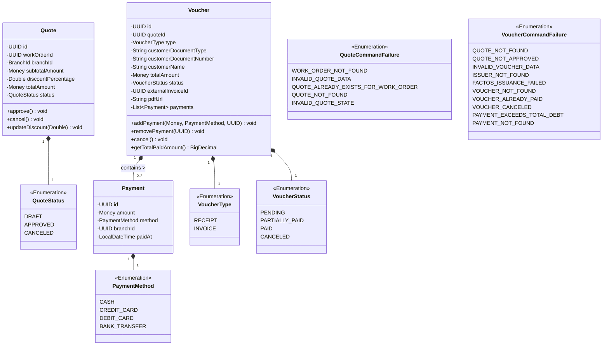
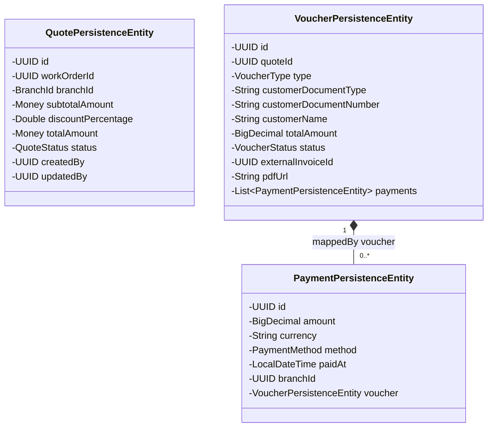
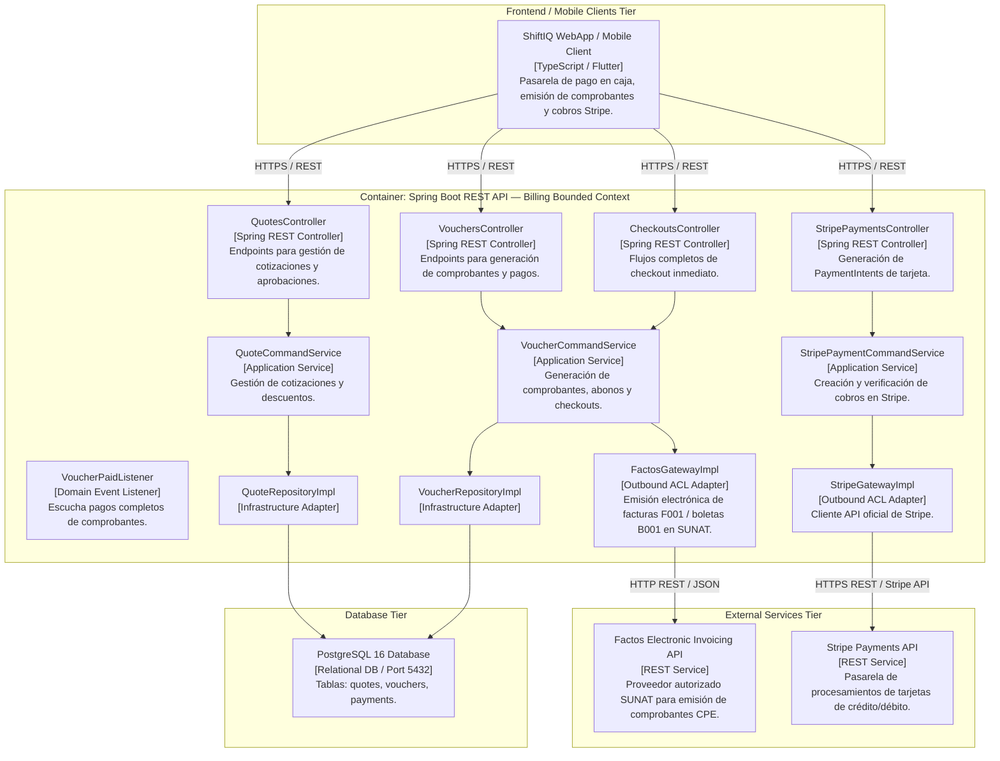
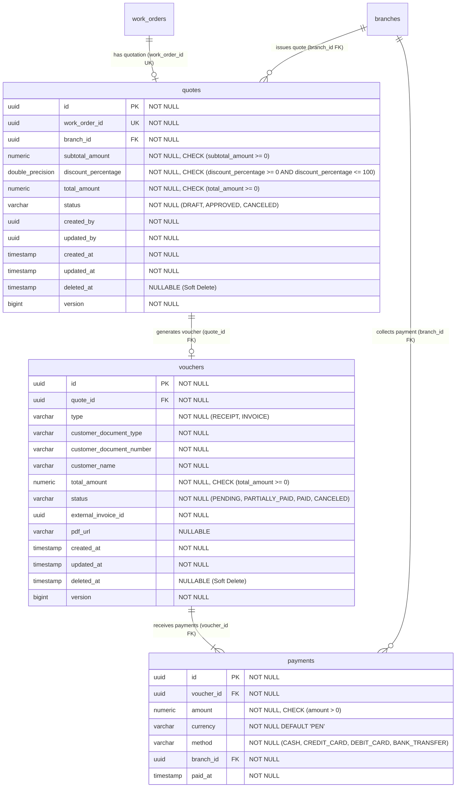

# Bounded Context Software Architecture & Domain Dictionary — Billing (Quotes, Vouchers & Payments)

El **Bounded Context `Billing`** gestiona el ciclo de vida financiero posterior a la prestación de servicios en el taller automotriz. Comprende la cotización preliminar de órdenes de trabajo (`Quote`), la emisión de comprobantes de pago electrónicos autorizados por SUNAT (`Voucher`: Facturas/Boletas) mediante la integración con la API externa **Factos**, el registro y amortización de pagos multicanal (`Payment`), la integración de cobros con tarjeta mediante **Stripe**, y los flujos de facturación inmediata (*Checkout*).

---

## 1. Domain Layer (Capa de Dominio)

La Capa de Dominio encapsula el cálculo estricto de subtotales, impuestos (IGV 18%), descuentos porcentuales, montos totales mediante métodos **Factory**, reglas financieras encapsuladas en los Agregados `Quote` y `Voucher`, transiciones de estado inmutables, la validación del saldo deudor de comprobantes y la emisión de eventos de dominio financieros.

---

### 1.1. Value Objects, Enums & Exceptions

#### 📌 Enumeración: `QuoteStatus`
* `DRAFT`: Cotización borrador generada a partir del subtotal de una Orden de Trabajo.
* `APPROVED`: Cotización aprobada por el cliente. Requisito obligatorio para generar un `Voucher`.
* `CANCELED`: Cotización anulada.

#### 📌 Enumeración: `VoucherType`
* `RECEIPT`: Boleta de venta electrónica (Serie B001 para DNI/Consumidor final).
* `INVOICE`: Factura electrónica (Serie F001 para RUC/Empresa).

#### 📌 Enumeración: `VoucherStatus`
* `PENDING`: Comprobante emitido sin pagos registrados (deuda total).
* `PARTIALLY_PAID`: Comprobante con abonos parciales (saldo pendiente > 0).
* `PAID`: Comprobante pagado en su totalidad (saldo pendiente = 0). Emite `VoucherPaidEvent`.
* `CANCELED`: Comprobante anulado.

#### 📌 Enumeración: `PaymentMethod`
* `CASH`: Pago en efectivo.
* `CREDIT_CARD`: Tarjeta de crédito.
* `DEBIT_CARD`: Tarjeta de débito.
* `BANK_TRANSFER`: Transferencia bancaria directa.

#### 📌 Enumeración: `QuoteCommandFailure`
* `WORK_ORDER_NOT_FOUND`: No se encontró la Orden de Trabajo especificada.
* `INVALID_QUOTE_DATA`: Datos inválidos al crear o actualizar la cotización.
* `QUOTE_ALREADY_EXISTS_FOR_WORK_ORDER`: Ya existe una cotización para la Orden de Trabajo.
* `QUOTE_NOT_FOUND`: Cotización no encontrada.
* `INVALID_QUOTE_STATE`: Operación no permitida para el estado actual de la cotización.

#### 📌 Enumeración: `VoucherCommandFailure`
* `QUOTE_NOT_FOUND`: Cotización de origen no encontrada.
* `QUOTE_NOT_APPROVED`: La cotización no está en estado `APPROVED`.
* `INVALID_VOUCHER_DATA`: Datos del cliente o del comprobante incompletos o inválidos.
* `ISSUER_NOT_FOUND`: Datos del emisor (Sucursal/Empresa) no encontrados.
* `FACTOS_ISSUANCE_FAILED`: Fallo en la comunicación o emisión del comprobante en SUNAT vía Factos API.
* `VOUCHER_NOT_FOUND`: Comprobante no encontrado.
* `VOUCHER_ALREADY_PAID`: El comprobante ya se encuentra pagado al 100%.
* `VOUCHER_CANCELED`: No se pueden registrar o eliminar pagos en un comprobante anulado.
* `PAYMENT_EXCEEDS_TOTAL_DEBT`: El monto del abono excede el saldo deudor pendiente.
* `PAYMENT_NOT_FOUND`: El registro de pago especificado no existe.

---

### 1.2. Aggregates & Entities

#### 📌 Aggregate Root: `Quote`
* **Hereda de:** `AbstractDomainAggregateRoot<Quote>`
* **Propósito:** Agregado que representa la cotización de servicios y repuestos de una Orden de Trabajo.
* **Reglas de Negocio:**
  - Aplica descuento porcentual sobre el subtotal (`0%` a `100%`) para calcular `totalAmount = subtotal * (1 - discount/100)`.
  - Transición a `APPROVED` requiere estar previamente en estado `DRAFT`.
  - No se puede cancelar una cotización si ya se encuentra en estado `APPROVED`.

#### 📌 Aggregate Root: `Voucher`
* **Hereda de:** `AbstractDomainAggregateRoot<Voucher>`
* **Propósito:** Agregado principal de facturación que representa la obligación financiera del cliente y almacena la referencia del comprobante fiscal emitido vía Factos (`externalInvoiceId`, `pdfUrl`).
* **Reglas de Negocio:**
  - Mantiene una colección de abonos (`payments`).
  - `addPayment(...)`: Valida que el abono no supere la deuda restante. Transiciona automáticamente a `PARTIALLY_PAID` o `PAID`. Al cubrir el 100%, emite `VoucherPaidEvent`.
  - `removePayment(UUID paymentId)`: Elimina un abono y recalcula dinámicamente el estado a `PENDING`, `PARTIALLY_PAID` o `PAID`.
  - `cancel()`: Anula el comprobante si no ha sido totalmente pagado.

#### 📌 Entity: `Payment`
* **Propósito:** Entidad que representa un abono monetario registrado contra un `Voucher`.
* **Atributos:** `id` (UUID), `amount` (Money), `method` (PaymentMethod), `branchId` (UUID), `paidAt` (LocalDateTime).

---

### 1.3. Domain Events

* `VoucherPaidEvent(Object source, UUID voucherId, UUID quoteId)`: Evento emitido cuando un comprobante es pagado totalmente (saldo deudor = 0).

---

### 1.4. Domain Repositories (Interfaces)

* `QuoteRepository`:
  * `Quote save(Quote quote)`
  * `Optional<Quote> findById(UUID id)`
  * `List<Quote> findAllByBranchId(BranchId branchId)`
  * `boolean existsByWorkOrderId(UUID workOrderId)`

* `VoucherRepository`:
  * `Voucher save(Voucher voucher)`
  * `Optional<Voucher> findById(UUID id)`
  * `List<Voucher> findByBranchId(BranchId branchId)`

---

## 2. Application Layer (Capa de Aplicación)

La Capa de Aplicación expone la ejecución de casos de uso mediante servicios de comando (`QuoteCommandService`, `VoucherCommandService`, `StripePaymentCommandService`) y servicios de consulta (`QuoteQueryService`, `VoucherQueryService`).

```mermaid
classDiagram
    direction TB

    class QuoteCommandService {
        <<Interface>>
        +handle(CreateQuoteCommand) Result~Quote, QuoteCommandFailure~
        +handle(UpdateQuoteDiscountCommand) Result~Quote, QuoteCommandFailure~
        +handle(ApproveQuoteCommand) Result~Quote, QuoteCommandFailure~
        +handle(CancelQuoteCommand) Result~Quote, QuoteCommandFailure~
    }

    class QuoteQueryService {
        <<Interface>>
        +handle(GetQuoteByIdQuery) Optional~Quote~
        +handle(GetQuotesByBranchIdQuery) List~Quote~
    }

    class VoucherCommandService {
        <<Interface>>
        +handle(GenerateVoucherCommand) Result~Voucher, VoucherCommandFailure~
        +handle(AddPaymentCommand) Result~Voucher, VoucherCommandFailure~
        +handle(RemovePaymentCommand) Result~Voucher, VoucherCommandFailure~
        +handle(ProcessCheckoutCommand) Result~Voucher, VoucherCommandFailure~
        +handle(ProcessStripeCheckoutCommand) Result~Voucher, VoucherCommandFailure~
    }

    class VoucherQueryService {
        <<Interface>>
        +handle(GetVoucherByIdQuery) Optional~Voucher~
        +handle(GetVouchersByBranchIdQuery) List~Voucher~
    }

    class StripePaymentCommandService {
        <<Interface>>
        +createPaymentIntent(BigDecimal, String, String) Optional~StripePaymentIntentResult~
        +getPaymentIntent(String) Optional~StripePaymentIntentResult~
    }

    QuoteCommandServiceImpl ..|> QuoteCommandService
    QuoteQueryServiceImpl ..|> QuoteQueryService
    VoucherCommandServiceImpl ..|> VoucherCommandService
    VoucherQueryServiceImpl ..|> VoucherQueryService
    StripePaymentCommandServiceImpl ..|> StripePaymentCommandService

    VoucherCommandServiceImpl --> FactosGateway
    StripePaymentCommandServiceImpl --> StripeGateway
```

---

### 2.1. Commands & Queries (DTOs de Aplicación)

#### Commands
* 🟦 **`CreateQuoteCommand(UUID workOrderId, BranchId branchId, Double discountPercentage)`**
* 🟦 **`UpdateQuoteDiscountCommand(UUID quoteId, Double discountPercentage)`**
* 🟦 **`ApproveQuoteCommand(UUID quoteId)`**
* 🟦 **`CancelQuoteCommand(UUID quoteId)`**
* 🟦 **`GenerateVoucherCommand(UUID quoteId, VoucherType type, String customerDocumentType, String customerDocumentNumber, String customerName)`**
* 🟦 **`AddPaymentCommand(UUID voucherId, Money amount, PaymentMethod method)`**
* 🟦 **`RemovePaymentCommand(UUID voucherId, UUID paymentId)`**
* 🟦 **`ProcessCheckoutCommand(UUID quoteId, VoucherType type, String customerDocumentType, String customerDocumentNumber, String customerName, PaymentMethod method)`**
* 🟦 **`ProcessStripeCheckoutCommand(UUID quoteId, VoucherType type, String customerDocumentType, String customerDocumentNumber, String customerName, String paymentIntentId)`**

#### Queries
* 🟩 **`GetQuoteByIdQuery(UUID quoteId)`**
* 🟩 **`GetQuotesByBranchIdQuery(BranchId branchId)`**
* 🟩 **`GetVoucherByIdQuery(UUID voucherId)`**
* 🟩 **`GetVouchersByBranchIdQuery(BranchId branchId)`**

---

### 2.2. Outbound Gateways (Puertos de Aplicación)

* `FactosGateway`:
  - `Optional<FactosInvoiceResult> issueVoucher(String issuerRuc, VoucherType documentType, String customerDocumentType, String customerDocumentNumber, String customerName, List<FactosItem> items)`
* `PaymentGateway`:
  - `Optional<PaymentIntentResult> createPaymentIntent(BigDecimal amount, String currency, String description)`
  - `Optional<PaymentIntentResult> getPaymentIntent(String paymentIntentId)`
* `StripeGateway` (extends `PaymentGateway`):
  - `Optional<StripePaymentIntentResult> createStripePaymentIntent(BigDecimal amount, String currency, String description)`
  - `Optional<StripePaymentIntentResult> getStripePaymentIntent(String paymentIntentId)`

---

## 3. Interface Layer (Capa de Interfaz / REST & Events)

Exposición RESTful e integración de listeners para eventos internos de facturación.

```mermaid
classDiagram
    direction TB

    class QuotesController {
        +createQuote(CreateQuoteResource) ResponseEntity~?~
        +updateQuoteDiscount(UUID, UpdateQuoteResource) ResponseEntity~?~
        +approveQuote(UUID) ResponseEntity~?~
        +cancelQuote(UUID) ResponseEntity~?~
        +getQuoteById(UUID) ResponseEntity~QuoteResource~
        +getQuotesByBranchId(UUID) ResponseEntity~List~QuoteResource~~
    }

    class VouchersController {
        +generateVoucher(GenerateVoucherResource) ResponseEntity~?~
        +getVoucherById(UUID) ResponseEntity~VoucherResource~
        +getVouchersByBranch(UUID) ResponseEntity~List~VoucherResource~~
        +addPayment(UUID, AddPaymentResource) ResponseEntity~?~
        +removePayment(UUID, UUID) ResponseEntity~?~
    }

    class CheckoutsController {
        +checkout(ProcessCheckoutResource) ResponseEntity~?~
        +stripeCheckout(ProcessStripeCheckoutResource) ResponseEntity~?~
    }

    class StripePaymentsController {
        +createPaymentIntent(CreatePaymentIntentResource) ResponseEntity~PaymentIntentResource~
    }

    class VoucherPaidListener {
        +onVoucherPaid(VoucherPaidEvent) void
    }

    QuotesController --> QuoteCommandService
    QuotesController --> QuoteQueryService
    VouchersController --> VoucherCommandService
    VouchersController --> VoucherQueryService
    CheckoutsController --> VoucherCommandService
    StripePaymentsController --> StripePaymentCommandService
```

---

### 3.1. Endpoints & REST Controllers

#### 📌 `QuotesController` (`/api/v1/quotes`)
* `POST /api/v1/quotes`: Registra una nueva cotización basada en una Orden de Trabajo.
* `GET /api/v1/quotes?branchId={branchId}`: Obtiene las cotizaciones creadas en una sucursal.
* `GET /api/v1/quotes/{id}`: Obtiene el detalle de una cotización por su ID.
* `PUT /api/v1/quotes/{id}`: Actualiza el porcentaje de descuento de una cotización en estado `DRAFT`.
* `POST /api/v1/quotes/{id}/approvals`: Aprueba una cotización (`DRAFT` ➔ `APPROVED`).
* `POST /api/v1/quotes/{id}/cancellations`: Anula una cotización.

#### 📌 `VouchersController` (`/api/v1/vouchers`)
* `POST /api/v1/vouchers`: Genera un nuevo comprobante (Boleta/Factura) enviándolo a SUNAT vía Factos API.
* `GET /api/v1/vouchers?branchId={branchId}`: Consulta comprobantes emitidos en una sucursal.
* `GET /api/v1/vouchers/{voucherId}`: Consulta el detalle completo de un comprobante y sus abonos.
* `POST /api/v1/vouchers/{voucherId}/payments`: Registra un pago parcial o total a un comprobante.
* `DELETE /api/v1/vouchers/{voucherId}/payments/{paymentId}`: Elimina un abono y actualiza el saldo deudor del comprobante.

#### 📌 `CheckoutsController` (`/api/v1/checkouts`)
* `POST /api/v1/checkouts`: Ejecuta el flujo completo de checkout (generación de comprobante + pago total inmediato en una sola transacción).
* `POST /api/v1/checkouts/stripe`: Verifica la confirmación del `paymentIntentId` en Stripe, emite la factura electrónica en SUNAT y registra el pago completo.

#### 📌 `StripePaymentsController` (`/api/v1/payments/stripe`)
* `POST /api/v1/payments/stripe/payment-intents`: Genera un `PaymentIntent` y su `clientSecret` para procesamiento de cobro con tarjeta en clientes web/móvil.

#### 📌 Event Listener: `VoucherPaidListener`
* Escucha `VoucherPaidEvent` para auditoría y eventual actualización de la Orden de Trabajo a estado completado/pagado.

---

## 4. Infrastructure Layer (Capa de Infraestructura)

Mapeo relacional JPA a tablas PostgreSQL 16 e integración de clientes HTTP REST (`FactosGatewayImpl` y `StripeGatewayImpl`).

---

### 4.1. Mapeo de Entidades Relacionales (JPA)

* **`quotes`** (`QuotePersistenceEntity`):
  * `id` (UUID, PK, heredado de `AuditableAbstractPersistenceEntity`)
  * `work_order_id` (UUID, NOT NULL, UNIQUE)
  * `branch_id` (UUID, NOT NULL)
  * `subtotal_amount` (DECIMAL, `MoneyAttributeConverter`)
  * `discount_percentage` (DOUBLE, NOT NULL)
  * `total_amount` (DECIMAL, `MoneyAttributeConverter`)
  * `status` (VARCHAR(20), NOT NULL)
  * `created_by` (UUID), `updated_by` (UUID)
  * `created_at`, `updated_at`, `version` (heredados de `AuditableAbstractPersistenceEntity`)
* **`vouchers`** (`VoucherPersistenceEntity`):
  * `id` (UUID, PK, heredado de `AuditableAbstractPersistenceEntity`)
  * `quote_id` (UUID, NOT NULL)
  * `type` (VARCHAR(20), NOT NULL)
  * `customer_document_type` (VARCHAR(20), NOT NULL)
  * `customer_document_number` (VARCHAR(20), NOT NULL)
  * `customer_name` (VARCHAR(150), NOT NULL)
  * `total_amount` (DECIMAL(10,2), NOT NULL)
  * `status` (VARCHAR(20), NOT NULL)
  * `external_invoice_id` (UUID, NOT NULL)
  * `pdf_url` (VARCHAR(500))
  * `created_at`, `updated_at`, `version` (heredados de `AuditableAbstractPersistenceEntity`)
* **`payments`** (`PaymentPersistenceEntity`):
  * `id` (UUID, PK)
  * `voucher_id` (UUID, FK, NOT NULL)
  * `amount` (DECIMAL, NOT NULL)
  * `currency` (VARCHAR(3))
  * `method` (VARCHAR(20), NOT NULL)
  * `branch_id` (UUID)
  * `paid_at` (TIMESTAMP)

---

## 5. Software Architecture Component Level Diagrams (C4 Model - Level 3)

Descomposición del Container API en sus componentes principales para el Bounded Context **Billing**.

---

## 6. Code Level Diagrams

### 6.1. Domain Layer Class Diagram

```mermaid
classDiagram
    direction TB

    class Quote {
        <<Aggregate Root>>
        -UUID id
        -UUID workOrderId
        -BranchId branchId
        -Money subtotalAmount
        -Double discountPercentage
        -Money totalAmount
        -QuoteStatus status
        +Quote(CreateQuoteCommand command, Money subtotalAmount)
        +approve() void
        +cancel() void
        +updateDiscount(Double discountPercentage) void
        +getId() UUID
        +getWorkOrderId() UUID
        +getBranchId() BranchId
        +getTotalAmount() Money
        +getStatus() QuoteStatus
    }

    class Voucher {
        <<Aggregate Root>>
        -UUID id
        -UUID quoteId
        -VoucherType type
        -String customerDocumentType
        -String customerDocumentNumber
        -String customerName
        -Money totalAmount
        -VoucherStatus status
        -UUID externalInvoiceId
        -String pdfUrl
        -List~Payment~ payments
        +Voucher(UUID quoteId, VoucherType type, String customerDocumentType, String customerDocumentNumber, String customerName, Money totalAmount, UUID externalInvoiceId, String pdfUrl)
        +addPayment(Money amount, PaymentMethod method, UUID branchId) void
        +removePayment(UUID paymentId) void
        +cancel() void
        +getTotalPaidAmount() BigDecimal
        +getId() UUID
        +getQuoteId() UUID
        +getStatus() VoucherStatus
    }

    class Payment {
        <<Entity>>
        -UUID id
        -Money amount
        -PaymentMethod method
        -UUID branchId
        -LocalDateTime paidAt
        +Payment(Money amount, PaymentMethod method, UUID branchId)
        +getId() UUID
        +getAmount() Money
        +getMethod() PaymentMethod
    }

    class BranchId {
        <<Value Object>>
        -UUID value
        +BranchId(UUID value)
        +value() UUID
    }

    class Money {
        <<Value Object>>
        -BigDecimal amount
        +Money(BigDecimal amount)
        +amount() BigDecimal
    }

    class QuoteStatus {
        <<Enumeration>>
        DRAFT
        APPROVED
        CANCELED
    }

    class VoucherType {
        <<Enumeration>>
        RECEIPT
        INVOICE
    }

    class VoucherStatus {
        <<Enumeration>>
        PENDING
        PARTIALLY_PAID
        PAID
        CANCELED
    }

    class PaymentMethod {
        <<Enumeration>>
        CASH
        CREDIT_CARD
        DEBIT_CARD
        BANK_TRANSFER
    }

    Quote "1" *-- "1" BranchId : branch reference
    Quote "1" *-- "1" Money : total price
    Quote "1" *-- "1" QuoteStatus : state

    Voucher "1" *-- "1" VoucherType : SUNAT CPE type
    Voucher "1" *-- "1" Money : total price
    Voucher "1" *-- "1" VoucherStatus : state
    Voucher "1" *-- "0..*" Payment : contains payments

    Payment "1" *-- "1" Money : amortized amount
    Payment "1" *-- "1" PaymentMethod : transaction channel

    Quote "1" --> "0..1" Voucher : originates
```

---

### 6.2. PostgreSQL 16 Entity Relationship Diagram (ERD)

