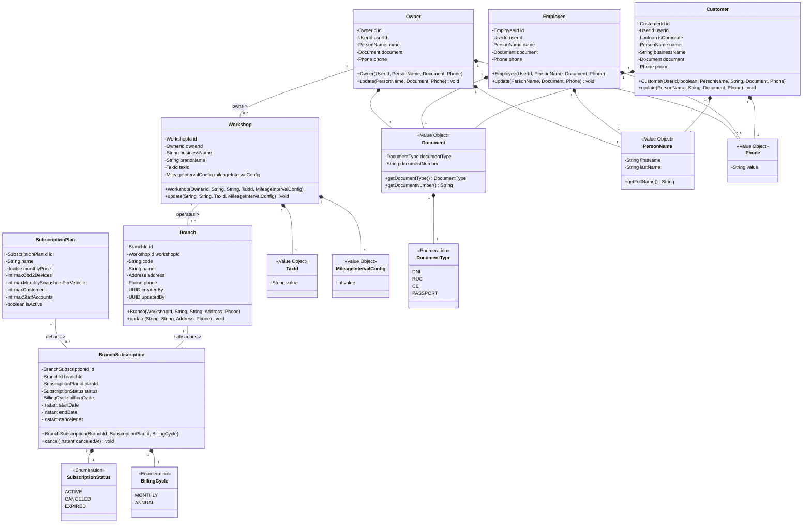
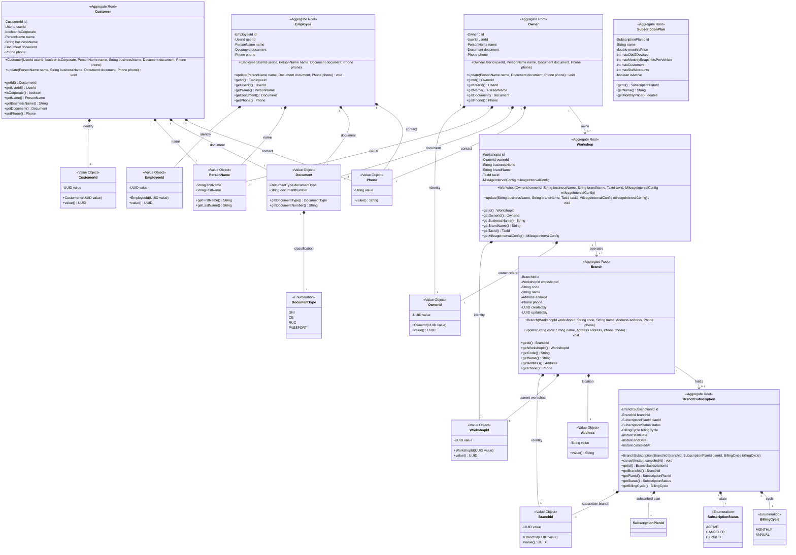
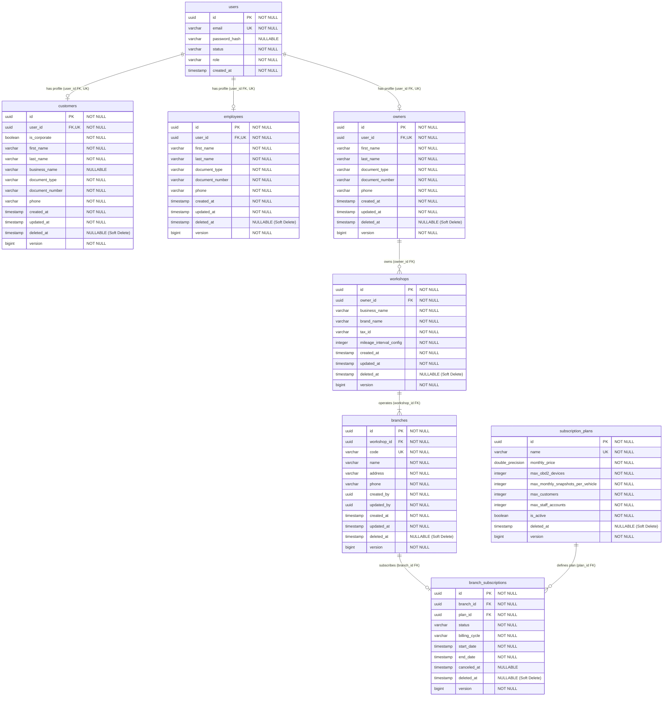

# Bounded Context Software Architecture & Domain Dictionary — Core (Profiles & Operations Management)

El **Bounded Context `Core`** constituye el núcleo relacional y organizacional de la plataforma **ShiftIQ**. Gestiona la identidad de los perfiles operacionales de los usuarios (`Customer`, `Employee`, `Owner`), las organizaciones y talleres mecánicos (`Workshop`), sus sedes o sucursales físicas (`Branch`), así como el modelo de monetización y suscripciones de la plataforma (`SubscriptionPlan`, `BranchSubscription`).

---

## 1. Domain Layer (Capa de Dominio)

La Capa de Dominio define el modelo de negocio inmutable, encapsulando reglas de validación, agregados principales, objetos de valor (Value Objects), métodos de creación (fábricas / constructores), eventos de dominio e interfaces de repositorios agnósticas a la tecnología de persistencia.

---

### 1.1. Value Objects & Enums

#### 📌 Record: `Document(DocumentType documentType, String documentNumber)`
* **Propósito:** Encapsula la identidad legal del sujeto.
* **Validaciones:**
  * `documentType` no puede ser nulo (`core.error.documentType.notNull`).
  * `documentNumber` no puede ser nulo ni estar en blanco (`core.error.documentNumber.notBlank`).

#### 📌 Record: `PersonName(String firstName, String lastName)`
* **Propósito:** Nombre y apellidos de personas naturales.
* **Validaciones:** `firstName` y `lastName` no pueden ser nulos ni estar vacíos (`core.error.firstName.notBlank`, `core.error.lastName.notBlank`).
* **Métodos:** `getFullName()` retorna el string formateado `"firstName lastName"`.

#### 📌 Record: `Phone(String value)`
* **Propósito:** Número telefónico de contacto.
* **Validaciones:** No puede ser nulo ni estar en blanco (`core.error.phone.required`).

#### 📌 Record: `TaxId(String value)`
* **Propósito:** Identificador tributario (RUC de 11 dígitos).
* **Validaciones:** Debe ser exacto de 11 dígitos numéricos (`core.error.taxId.invalid`).

#### 📌 Record: `CreditCard(String cardNumber, String cardHolderName, String expirationDate, String cvv)`
* **Propósito:** Tarjeta de crédito/débito para el cobro simulado de suscripciones.
* **Validaciones:**
  * `cardNumber`: 16 dígitos numéricos (`core.error.cardNumber.invalid`).
  * `cardHolderName`: no en blanco (`core.error.cardHolderName.required`).
  * `expirationDate`: formato `MM/YY` (`core.error.expirationDate.invalid`).
  * `cvv`: 3 dígitos numéricos (`core.error.cvv.invalid`).

#### 📌 Record: `MileageIntervalConfig(int value)`
* **Propósito:** Intervalo de kilometraje para mantenimientos sugeridos del taller.
* **Validaciones:** Debe ser un entero estrictamente positivo (`core.error.mileageIntervalConfig.mustBePositive`).

#### 📌 Identificadores Fuertemente Tipados (Strongly Typed IDs)
* `UserId`, `CustomerId`, `EmployeeId`, `OwnerId`, `WorkshopId`, `BranchId`, `BranchSubscriptionId`, `SubscriptionPlanId`. Encapsulan un valor `UUID`.

#### 📌 Enum: `DocumentType`
* Valores: `DNI`, `RUC`, `CE`, `PASSPORT`.

#### 📌 Enum: `SubscriptionStatus`
* Valores: `ACTIVE`, `CANCELED`, `EXPIRED`.

#### 📌 Enum: `BillingCycle`
* Valores: `MONTHLY`, `ANNUAL`.

---

### 1.2. Aggregates (Raíces de Agregado)

#### 📌 Aggregate: `Customer`
* **Hereda de:** `AbstractDomainAggregateRoot<Customer>` (provee soporte para registro y publicación de eventos de dominio).
* **Propósito:** Agregado para clientes del sistema. Puede ser persona natural (`isCorporate = false`) o persona jurídica (`isCorporate = true`).
* **Reglas de Negocio:**
  * Si es corporativo (`isCorporate = true`), `businessName` es obligatorio (`core.error.businessName.required`).
  * Si es persona natural (`isCorporate = false`), `name` es obligatorio (`core.error.personName.required`).
  * En actualizaciones, el tipo de documento de un cliente corporativo no puede cambiarse (`core.error.customer.corporateDocumentTypeImmutable`).
* **Eventos Emitidos:** `CustomerCreatedEvent`, `CustomerUpdatedEvent`.

#### 📌 Aggregate: `Employee`
* **Hereda de:** `AbstractDomainAggregateRoot<Employee>`
* **Propósito:** Agregado para perfiles de empleados y personal técnico del taller vinculados a un `UserId`.
* **Eventos Emitidos:** `EmployeeCreatedEvent`, `EmployeeUpdatedEvent`.

#### 📌 Aggregate: `Owner`
* **Hereda de:** `AbstractDomainAggregateRoot<Owner>`
* **Propósito:** Agregado para propietarios y dueños de talleres automotrices.
* **Eventos Emitidos:** `OwnerCreatedEvent`, `OwnerUpdatedEvent`.

#### 📌 Aggregate: `Workshop`
* **Hereda de:** `AbstractDomainAggregateRoot<Workshop>`
* **Propósito:** Representa la empresa o taller mecánico comercial propiedad de un `Owner`.
* **Reglas de Negocio:** `businessName` y `brandName` no pueden estar vacíos (`core.error.businessName.required`, `core.error.brandName.required`).
* **Eventos Emitidos:** `WorkshopCreatedEvent`, `WorkshopUpdatedEvent`.

#### 📌 Aggregate: `Branch`
* **Hereda de:** `AbstractDomainAggregateRoot<Branch>`
* **Propósito:** Representa cada sucursal o sede física operacional del taller.
* **Reglas de Negocio:** `code` (único) y `name` son requeridos (`core.error.code.required`, `core.error.name.required`).
* **Eventos Emitidos:** `BranchCreatedEvent`, `BranchUpdatedEvent`.

#### 📌 Aggregate: `BranchSubscription`
* **Hereda de:** `AbstractDomainAggregateRoot<BranchSubscription>`
* **Propósito:** Suscripción contratada por una sucursal a un `SubscriptionPlan`.
* **Reglas de Negocio:** Calcula `endDate` automáticamente (+1 mes si `MONTHLY`, +12 meses si `ANNUAL`). El método `cancel(Instant canceledAt)` cambia el estado a `CANCELED`.

#### 📌 Aggregate: `SubscriptionPlan`
* **Hereda de:** `AbstractDomainAggregateRoot<SubscriptionPlan>`
* **Propósito:** Plan de comercialización del SaaS (ej. Lite, Pro, Max) con límites operacionales de OBD2, snapshots, clientes y usuarios staff.

---

### 1.3. Domain Repositories (Interfaces)

* `CustomerRepository`:
  * `Customer save(Customer customer)`
  * `Optional<Customer> findById(CustomerId id)`
  * `Optional<Customer> findByUserId(UserId userId)`
  * `boolean existsByUserId(UserId userId)`
  * `Optional<Customer> findByDocumentNumber(String documentNumber)`
  * `List<String> findProfileRolesByUserId(UserId userId)`
  * `void delete(Customer customer)`
* `EmployeeRepository`:
  * `Employee save(Employee employee)`
  * `Optional<Employee> findById(EmployeeId id)`
  * `Optional<Employee> findByUserId(UserId userId)`
  * `boolean existsByUserId(UserId userId)`
  * `Optional<Employee> findByDocumentNumber(String documentNumber)`
  * `void delete(Employee employee)`
* `OwnerRepository`:
  * `Owner save(Owner owner)`
  * `Optional<Owner> findById(OwnerId id)`
  * `Optional<Owner> findByUserId(UserId userId)`
  * `boolean existsById(OwnerId id)`
  * `boolean existsByUserId(UserId userId)`
  * `Optional<Owner> findByDocumentNumber(String documentNumber)`
  * `void delete(Owner owner)`
* `WorkshopRepository`:
  * `Workshop save(Workshop workshop)`
  * `Optional<Workshop> findById(WorkshopId id)`
  * `List<Workshop> findAllByOwnerId(OwnerId ownerId)`
  * `boolean existsById(WorkshopId id)`
* `BranchRepository`:
  * `Branch save(Branch branch)`
  * `Optional<Branch> findById(BranchId id)`
  * `List<Branch> findAllByWorkshopId(WorkshopId workshopId)`
  * `boolean existsById(BranchId id)`
  * `boolean existsByCode(String code)`
* `BranchSubscriptionRepository`:
  * `BranchSubscription save(BranchSubscription branchSubscription)`
  * `Optional<BranchSubscription> findById(BranchSubscriptionId id)`
  * `List<BranchSubscription> findAllByBranchId(BranchId branchId)`
  * `Optional<BranchSubscription> findActiveByBranchId(BranchId branchId)`
* `SubscriptionPlanRepository`:
  * `SubscriptionPlan save(SubscriptionPlan subscriptionPlan)`
  * `Optional<SubscriptionPlan> findById(SubscriptionPlanId id)`
  * `Optional<SubscriptionPlan> findByName(String name)`
  * `List<SubscriptionPlan> findAll()`

---

## 2. Application Layer (Capa de Aplicación)

La Capa de Aplicación orquesta los casos de uso, transformando los Commands y Queries provenientes de la capa de interfaz en operaciones del modelo de dominio.

```mermaid
classDiagram
    direction TB

    class CustomerCommandService {
        <<Interface>>
        +handle(CreateCustomerCommand) Optional~Customer~
        +handle(UpdateCustomerCommand) Optional~Customer~
        +handle(DeleteCustomerCommand) void
    }

    class CustomerQueryService {
        <<Interface>>
        +handle(GetCustomerByIdQuery) Optional~Customer~
        +handle(GetCustomerByUserIdQuery) Optional~Customer~
    }

    class EmployeeCommandService {
        <<Interface>>
        +handle(CreateEmployeeCommand) Optional~Employee~
        +handle(UpdateEmployeeCommand) Optional~Employee~
        +handle(DeleteEmployeeCommand) void
    }

    class EmployeeQueryService {
        <<Interface>>
        +handle(GetEmployeeByIdQuery) Optional~Employee~
        +handle(GetEmployeeByUserIdQuery) Optional~Employee~
        +handle(GetEmployeeByDocumentNumberQuery) Optional~Employee~
    }

    class OwnerCommandService {
        <<Interface>>
        +handle(CreateOwnerCommand) Optional~Owner~
        +handle(UpdateOwnerCommand) Optional~Owner~
        +handle(DeleteOwnerCommand) void
    }

    class OwnerQueryService {
        <<Interface>>
        +handle(GetOwnerByIdQuery) Optional~Owner~
        +handle(GetOwnerByUserIdQuery) Optional~Owner~
    }

    class WorkshopCommandService {
        <<Interface>>
        +handle(CreateWorkshopCommand) Optional~Workshop~
        +handle(UpdateWorkshopCommand) Optional~Workshop~
    }

    class WorkshopQueryService {
        <<Interface>>
        +handle(GetWorkshopByIdQuery) Optional~Workshop~
        +handle(GetAllWorkshopsByOwnerIdQuery) List~Workshop~
    }

    class BranchCommandService {
        <<Interface>>
        +handle(CreateBranchCommand) Optional~Branch~
        +handle(UpdateBranchCommand) Optional~Branch~
    }

    class BranchQueryService {
        <<Interface>>
        +handle(GetBranchByIdQuery) Optional~Branch~
        +handle(GetAllBranchesByWorkshopIdQuery) List~Branch~
    }

    class SubscriptionCommandService {
        <<Interface>>
        +handle(AssignSubscriptionCommand) Optional~BranchSubscription~
        +handle(CancelSubscriptionCommand) Optional~BranchSubscription~
    }

    class ProfileQueryService {
        <<Interface>>
        +handle(GetProfileRolesByUserIdQuery) List~String~
        +handle(GetProfileByDocumentNumberQuery) Optional~ProfileSummary~
    }

    CustomerCommandServiceImpl ..|> CustomerCommandService
    CustomerQueryServiceImpl ..|> CustomerQueryService
    EmployeeCommandServiceImpl ..|> EmployeeCommandService
    EmployeeQueryServiceImpl ..|> EmployeeQueryService
    OwnerCommandServiceImpl ..|> OwnerCommandService
    OwnerQueryServiceImpl ..|> OwnerQueryService
    WorkshopCommandServiceImpl ..|> WorkshopCommandService
    WorkshopQueryServiceImpl ..|> WorkshopQueryService
    BranchCommandServiceImpl ..|> BranchCommandService
    BranchQueryServiceImpl ..|> BranchQueryService
    SubscriptionCommandServiceImpl ..|> SubscriptionCommandService
    ProfileQueryServiceImpl ..|> ProfileQueryService
```

---

### 2.1. Commands & Queries (DTOs)

#### Commands
* 🟦 **`CreateCustomerCommand(UserId userId, boolean isCorporate, PersonName name, String businessName, Document document, Phone phone)`**
* 🟦 **`UpdateCustomerCommand(CustomerId customerId, PersonName name, String businessName, Document document, Phone phone)`**
* 🟦 **`DeleteCustomerCommand(CustomerId customerId)`**
* 🟦 **`CreateEmployeeCommand(UserId userId, PersonName name, Document document, Phone phone)`**
* 🟦 **`UpdateEmployeeCommand(EmployeeId employeeId, PersonName name, Document document, Phone phone)`**
* 🟦 **`DeleteEmployeeCommand(EmployeeId employeeId)`**
* 🟦 **`CreateOwnerCommand(UserId userId, PersonName name, Document document, Phone phone)`**
* 🟦 **`UpdateOwnerCommand(OwnerId ownerId, PersonName name, Document document, Phone phone)`**
* 🟦 **`DeleteOwnerCommand(OwnerId ownerId)`**
* 🟦 **`CreateWorkshopCommand(OwnerId ownerId, String businessName, String brandName, TaxId taxId, MileageIntervalConfig mileageIntervalConfig)`**
* 🟦 **`UpdateWorkshopCommand(WorkshopId workshopId, String businessName, String brandName, TaxId taxId, MileageIntervalConfig mileageIntervalConfig)`**
* 🟦 **`CreateBranchCommand(WorkshopId workshopId, String code, String name, Address address, Phone phone)`**
* 🟦 **`UpdateBranchCommand(BranchId branchId, String code, String name, Address address, Phone phone)`**
* 🟦 **`AssignSubscriptionCommand(BranchId branchId, SubscriptionPlanId planId, BillingCycle billingCycle, CreditCard creditCard)`**
* 🟦 **`CancelSubscriptionCommand(BranchId branchId)`**

#### Queries & Responses
* 🟩 **`GetCustomerByIdQuery(CustomerId customerId)`**
* 🟩 **`GetCustomerByUserIdQuery(UserId userId)`**
* 🟩 **`GetEmployeeByIdQuery(EmployeeId employeeId)`**
* 🟩 **`GetEmployeeByUserIdQuery(UserId userId)`**
* 🟩 **`GetEmployeeByDocumentNumberQuery(String documentNumber)`**
* 🟩 **`GetOwnerByIdQuery(OwnerId ownerId)`**
* 🟩 **`GetOwnerByUserIdQuery(UserId userId)`**
* 🟩 **`GetWorkshopByIdQuery(WorkshopId workshopId)`**
* 🟩 **`GetAllWorkshopsByOwnerIdQuery(OwnerId ownerId)`**
* 🟩 **`GetBranchByIdQuery(BranchId branchId)`**
* 🟩 **`GetAllBranchesByWorkshopIdQuery(WorkshopId workshopId)`**
* 🟩 **`GetProfileRolesByUserIdQuery(UserId userId)`**
* 🟩 **`GetProfileByDocumentNumberQuery(String documentNumber)`**
* 🟩 **`ProfileSummary(UUID profileId, UUID userId, String firstName, String lastName, String documentType, String documentNumber, String profileType)`**

---

## 3. Interface Layer (Capa de Interfaz / REST)

Expone los servicios de la plataforma a través de una API RESTful documentada con Swagger/OpenAPI y protegida mediante Spring Security.

```mermaid
classDiagram
    direction TB

    class ProfilesController {
        +getUserProfileRoles(UUID userId) ResponseEntity~List~String~~
        +getProfileByDocumentNumber(String documentNumber) ResponseEntity~ProfileSummary~
    }

    class CustomersController {
        +createCustomer(CreateCustomerResource) ResponseEntity~CustomerResource~
        +updateCustomer(UUID customerId, UpdateCustomerResource) ResponseEntity~CustomerResource~
        +getCustomerById(UUID customerId) ResponseEntity~CustomerResource~
        +getCustomerByUserId(UUID userId) ResponseEntity~CustomerResource~
        +deleteCustomer(UUID customerId) ResponseEntity~?~
    }

    class EmployeesController {
        +createEmployee(CreateEmployeeResource) ResponseEntity~EmployeeResource~
        +updateEmployee(UUID employeeId, UpdateEmployeeResource) ResponseEntity~EmployeeResource~
        +getEmployeeById(UUID employeeId) ResponseEntity~EmployeeResource~
        +getEmployeeByUserId(UUID userId) ResponseEntity~EmployeeResource~
        +getEmployeeByDocumentNumber(String documentNumber) ResponseEntity~EmployeeResource~
        +deleteEmployee(UUID employeeId) ResponseEntity~?~
    }

    class OwnersController {
        +createOwner(CreateOwnerResource) ResponseEntity~OwnerResource~
        +updateOwner(UUID ownerId, UpdateOwnerResource) ResponseEntity~OwnerResource~
        +getOwnerById(UUID ownerId) ResponseEntity~OwnerResource~
        +getOwnerByUserId(UUID userId) ResponseEntity~OwnerResource~
        +deleteOwner(UUID ownerId) ResponseEntity~?~
    }

    class WorkshopsController {
        +createWorkshop(CreateWorkshopResource) ResponseEntity~WorkshopResource~
        +updateWorkshop(UUID workshopId, UpdateWorkshopResource) ResponseEntity~WorkshopResource~
        +getWorkshopById(UUID workshopId) ResponseEntity~WorkshopResource~
        +getWorkshopsByOwnerId(UUID ownerId) ResponseEntity~List~WorkshopResource~~
    }

    class BranchesController {
        +createBranch(CreateBranchResource) ResponseEntity~BranchResource~
        +updateBranch(UUID branchId, UpdateBranchResource) ResponseEntity~BranchResource~
        +getBranchById(UUID branchId) ResponseEntity~BranchResource~
        +getBranchesByWorkshopId(UUID workshopId) ResponseEntity~List~BranchResource~~
        +assignSubscription(UUID branchId, AssignSubscriptionResource) ResponseEntity~BranchSubscriptionResource~
        +cancelSubscription(UUID branchId) ResponseEntity~Void~
    }

    class OwnerQueryService {
        <<Interface>>
    }

    CustomersController --> CustomerCommandService
    CustomersController --> CustomerQueryService
    EmployeesController --> EmployeeCommandService
    EmployeesController --> EmployeeQueryService
    OwnersController --> OwnerCommandService
    OwnersController --> OwnerQueryService
    WorkshopsController --> WorkshopCommandService
    WorkshopsController --> WorkshopQueryService
    BranchesController --> BranchCommandService
    BranchesController --> SubscriptionCommandService
```

---

### 3.1. Endpoints & REST Controllers

#### 📌 `ProfilesController` (`/api/v1/profiles`)
* `GET /api/v1/profiles/roles?userId={userId}`: Retorna la lista de roles asignados a los perfiles del usuario (ej. `["CUSTOMER", "OWNER"]`).
* `GET /api/v1/profiles?documentNumber={documentNumber}`: Búsqueda rápida de perfil por DNI o RUC.

#### 📌 `CustomersController` (`/api/v1/customers`)
* `POST /api/v1/customers`: Registra perfil de cliente (natural o corporate).
* `GET /api/v1/customers?userId={userId}`: Obtiene el `CustomerResource` por ID de usuario.
* `GET /api/v1/customers/{customerId}`: Consulta detalles del cliente.
* `PUT /api/v1/customers/{customerId}`: Actualiza los datos del cliente.
* `DELETE /api/v1/customers/{customerId}`: Eliminación lógica del cliente.

#### 📌 `EmployeesController` (`/api/v1/employees`)
* `POST /api/v1/employees`: Registra perfil de empleado.
* `GET /api/v1/employees?userId={userId}`: Obtiene el perfil por `userId`.
* `GET /api/v1/employees?documentNumber={documentNumber}`: Obtiene el perfil del empleado por número de documento (DNI/RUC).
* `GET /api/v1/employees/{employeeId}`: Consulta detalles del empleado.
* `PUT /api/v1/employees/{employeeId}`: Actualiza datos del empleado.
* `DELETE /api/v1/employees/{employeeId}`: Eliminación lógica del empleado.

#### 📌 `OwnersController` (`/api/v1/owners`)
* `POST /api/v1/owners`: Registra perfil de propietario.
* `GET /api/v1/owners?userId={userId}`: Obtiene el perfil por `userId`.
* `GET /api/v1/owners/{ownerId}`: Consulta detalles del dueño.
* `PUT /api/v1/owners/{ownerId}`: Actualiza datos del dueño.
* `DELETE /api/v1/owners/{ownerId}`: Eliminación lógica del dueño.

#### 📌 `WorkshopsController` (`/api/v1/workshops`)
* `POST /api/v1/workshops`: Registra un nuevo taller asociado a un `ownerId`.
* `GET /api/v1/workshops?ownerId={ownerId}`: Lista todos los talleres de un propietario.
* `GET /api/v1/workshops/{workshopId}`: Consulta un taller por su ID.
* `PUT /api/v1/workshops/{workshopId}`: Actualiza la información del taller.

#### 📌 `BranchesController` (`/api/v1/branches`)
* `POST /api/v1/branches`: Registra una nueva sucursal física asociada a un `workshopId`.
* `GET /api/v1/branches?workshopId={workshopId}`: Lista las sucursales de un taller.
* `GET /api/v1/branches/{branchId}`: Consulta una sucursal específica.
* `PUT /api/v1/branches/{branchId}`: Actualiza datos de la sucursal.
* `POST /api/v1/branches/{branchId}/subscriptions`: Asigna/paga un plan de suscripción para la sucursal.
* `DELETE /api/v1/branches/{branchId}/subscription`: Cancela la suscripción activa de la sucursal.

---

## 4. Infrastructure Layer (Capa de Infraestructura)

Implementa la persistencia física en **PostgreSQL 16** utilizando Spring Data JPA, mapeando entidades de dominio inmutables a entidades de tabla relacional.

```mermaid
classDiagram
    direction TB

    class CustomerPersistenceEntity {
        <<JPA Entity>>
        -UUID id
        -UUID userId
        -boolean isCorporate
        -String firstName
        -String lastName
        -String businessName
        -String documentType
        -String documentNumber
        -String phone
        -Instant createdAt
        -Instant updatedAt
        -Instant deletedAt
        -Long version
    }

    class EmployeePersistenceEntity {
        <<JPA Entity>>
        -UUID id
        -UUID userId
        -String firstName
        -String lastName
        -String documentType
        -String documentNumber
        -String phone
        -Instant createdAt
        -Instant updatedAt
        -Instant deletedAt
        -Long version
    }

    class OwnerPersistenceEntity {
        <<JPA Entity>>
        -UUID id
        -UUID userId
        -String firstName
        -String lastName
        -String documentType
        -String documentNumber
        -String phone
        -Instant createdAt
        -Instant updatedAt
        -Instant deletedAt
        -Long version
    }

    class WorkshopPersistenceEntity {
        <<JPA Entity>>
        -UUID id
        -UUID ownerId
        -String businessName
        -String brandName
        -String taxId
        -int mileageIntervalConfig
        -Instant createdAt
        -Instant updatedAt
        -Instant deletedAt
        -Long version
    }

    class BranchPersistenceEntity {
        <<JPA Entity>>
        -UUID id
        -UUID workshopId
        -String code
        -String name
        -String address
        -String phone
        -Instant createdAt
        -Instant updatedAt
        -Instant deletedAt
        -UUID createdBy
        -UUID updatedBy
        -Long version
    }

    class BranchSubscriptionPersistenceEntity {
        <<JPA Entity>>
        -UUID id
        -UUID branchId
        -UUID planId
        -SubscriptionStatus status
        -BillingCycle billingCycle
        -Instant startDate
        -Instant endDate
        -Instant canceledAt
        -Instant deletedAt
        -Long version
    }

    class SubscriptionPlanPersistenceEntity {
        <<JPA Entity>>
        -UUID id
        -String name
        -double monthlyPrice
        -int maxObd2Devices
        -int maxMonthlySnapshotsPerVehicle
        -int maxCustomers
        -int maxStaffAccounts
        -boolean isActive
        -Instant deletedAt
        -Long version
    }

    class AuditableAbstractPersistenceEntity {
        <<MappedSuperclass>>
        -UUID id
        -Instant createdAt
        -Instant updatedAt
        -Long version
    }

    AuditableAbstractPersistenceEntity <|-- CustomerPersistenceEntity
    AuditableAbstractPersistenceEntity <|-- EmployeePersistenceEntity
    AuditableAbstractPersistenceEntity <|-- OwnerPersistenceEntity
    AuditableAbstractPersistenceEntity <|-- WorkshopPersistenceEntity
    AuditableAbstractPersistenceEntity <|-- BranchPersistenceEntity
    AuditableAbstractPersistenceEntity <|-- BranchSubscriptionPersistenceEntity
    AuditableAbstractPersistenceEntity <|-- SubscriptionPlanPersistenceEntity
```

---

### 4.1. Mapeo de Entidades Relacionales (JPA)

Todas las entidades extienden de `AuditableAbstractPersistenceEntity` (`@MappedSuperclass`) obteniendo `id` (UUID), `created_at`, `updated_at` y `version` (bloqueo optimista `@Version`). Adicionalmente implementan `@SQLDelete` y `@SQLRestriction("deleted_at IS NULL")` para **Soft Delete**.

* **`customers`** (`CustomerPersistenceEntity`):
  * `user_id` (UUID, NOT NULL, UNIQUE)
  * `is_corporate` (boolean, NOT NULL)
  * `first_name`, `last_name`, `business_name`, `document_type`, `document_number`, `phone`, `deleted_at`.
* **`employees`** (`EmployeePersistenceEntity`):
  * `user_id` (UUID, NOT NULL, UNIQUE)
  * `first_name`, `last_name`, `document_type`, `document_number`, `phone`, `deleted_at`.
* **`owners`** (`OwnerPersistenceEntity`):
  * `user_id` (UUID, NOT NULL, UNIQUE)
  * `first_name`, `last_name`, `document_type`, `document_number`, `phone`, `deleted_at`.
* **`workshops`** (`WorkshopPersistenceEntity`):
  * `owner_id` (UUID, NOT NULL)
  * `business_name`, `brand_name`, `tax_id`, `mileage_interval_config`, `deleted_at`.
* **`branches`** (`BranchPersistenceEntity`):
  * `workshop_id` (UUID, NOT NULL)
  * `code` (VARCHAR, NOT NULL, UNIQUE), `name`, `address`, `phone`, `deleted_at`, `created_by`, `updated_by`.
* **`branch_subscriptions`** (`BranchSubscriptionPersistenceEntity`):
  * `branch_id` (UUID, NOT NULL), `plan_id` (UUID, NOT NULL)
  * `status` (VARCHAR, Enum), `billing_cycle` (VARCHAR, Enum), `start_date`, `end_date`, `canceled_at`, `deleted_at`.
* **`subscription_plans`** (`SubscriptionPlanPersistenceEntity`):
  * `name` (VARCHAR, NOT NULL, UNIQUE), `monthly_price`, `max_obd2_devices`, `max_monthly_snapshots_per_vehicle`, `max_customers`, `max_staff_accounts`, `is_active`, `deleted_at`.

---

## 5. Software Architecture Component Level Diagrams (C4 Model - Level 3)

El siguiente diagrama C4 descompone el Container API en sus componentes principales para el Bounded Context **Core**.

```mermaid
graph TB
    subgraph Client_Tier ["Frontend / Mobile Clients Tier"]
        ClientApp["ShiftIQ WebApp / Mobile Client<br>[TypeScript / Flutter]<br>Interacciona con perfiles y estructura organizacional."]
    end

    subgraph External_DB ["Database Tier"]
        PostgreSql["PostgreSQL 16 Database<br>[Relational DB / Port 5432]<br>Tablas: customers, employees, owners, workshops, branches, branch_subscriptions."]
    end

    subgraph Core_Container ["Container: Spring Boot REST API — Core Bounded Context"]
        ProfilesCtrl["ProfilesController<br>[Spring REST Controller]<br>Búsqueda rápida por DNI/RUC y resolución de roles operacionales."]
        CustomersCtrl["CustomersController<br>[Spring REST Controller]<br>Gestión CRUD de clientes (natural / corporativo)."]
        EmployeesCtrl["EmployeesController<br>[Spring REST Controller]<br>Gestión CRUD de empleados."]
        OwnersCtrl["OwnersController<br>[Spring REST Controller]<br>Gestión CRUD de propietarios."]
        WorkshopsCtrl["WorkshopsController<br>[Spring REST Controller]<br>Gestión de talleres automotrices."]
        BranchesCtrl["BranchesController<br>[Spring REST Controller]<br>Gestión de sucursales y suscripciones de pago."]

        MultiTenancySecService["MultiTenancySecurityService<br>[Security Component]<br>Verifica autorización multi-tenant e identidad del token JWT."]

        CustCmdService["CustomerCommandService<br>[Application Service]<br>Orquesta registro y mutación de clientes."]
        EmpCmdService["EmployeeCommandService<br>[Application Service]<br>Orquesta registro y mutación de empleados."]
        OwnerCmdService["OwnerCommandService<br>[Application Service]<br>Orquesta registro y mutación de propietarios."]
        WorkCmdService["WorkshopCommandService<br>[Application Service]<br>Orquesta creación y mantenimiento de talleres."]
        WorkQueryService["WorkshopQueryService<br>[Application Service]<br>Consultas de talleres por dueño o ID."]
        BranchCmdService["BranchCommandService<br>[Application Service]<br>Orquesta sucursales del taller."]
        SubCmdService["SubscriptionCommandService<br>[Application Service]<br>Orquesta la asignación y cobro simulado de planes."]

        CustRepoAdapter["CustomerRepositoryImpl<br>[Infrastructure Adapter]<br>Persistencia JPA y emisión de eventos de clientes."]
        EmpRepoAdapter["EmployeeRepositoryImpl<br>[Infrastructure Adapter]<br>Persistencia JPA de empleados."]
        OwnerRepoAdapter["OwnerRepositoryImpl<br>[Infrastructure Adapter]<br>Persistencia JPA de propietarios."]
        WorkRepoAdapter["WorkshopRepositoryImpl<br>[Infrastructure Adapter]<br>Persistencia JPA de talleres."]
        BranchRepoAdapter["BranchRepositoryImpl<br>[Infrastructure Adapter]<br>Persistencia JPA de sucursales."]
        SubRepoAdapter["BranchSubscriptionRepositoryImpl<br>[Infrastructure Adapter]<br>Persistencia JPA de suscripciones."]

        CustJpaRepo["CustomerPersistenceRepository<br>[Spring Data JPA]"]
        EmpJpaRepo["EmployeePersistenceRepository<br>[Spring Data JPA]"]
        OwnerJpaRepo["OwnerPersistenceRepository<br>[Spring Data JPA]"]
        WorkJpaRepo["WorkshopPersistenceRepository<br>[Spring Data JPA]"]
        BranchJpaRepo["BranchPersistenceRepository<br>[Spring Data JPA]"]
        SubJpaRepo["BranchSubscriptionPersistenceRepository<br>[Spring Data JPA]"]
    end

    ClientApp -->|"HTTPS / REST"| ProfilesCtrl
    ClientApp -->|"HTTPS / REST"| CustomersCtrl
    ClientApp -->|"HTTPS / REST"| EmployeesCtrl
    ClientApp -->|"HTTPS / REST"| OwnersCtrl
    ClientApp -->|"HTTPS / REST"| WorkshopsCtrl
    ClientApp -->|"HTTPS / REST"| BranchesCtrl

    CustomersCtrl --> MultiTenancySecService
    EmployeesCtrl --> MultiTenancySecService
    OwnersCtrl --> MultiTenancySecService
    WorkshopsCtrl --> MultiTenancySecService
    BranchesCtrl --> MultiTenancySecService

    CustomersCtrl --> CustCmdService
    EmployeesCtrl --> EmpCmdService
    OwnersCtrl --> OwnerCmdService
    WorkshopsCtrl --> WorkCmdService
    WorkshopsCtrl --> WorkQueryService
    BranchesCtrl --> BranchCmdService
    BranchesCtrl --> SubCmdService

    CustCmdService --> CustRepoAdapter
    EmpCmdService --> EmpRepoAdapter
    OwnerCmdService --> OwnerRepoAdapter
    WorkCmdService --> WorkRepoAdapter
    WorkQueryService --> WorkRepoAdapter
    BranchCmdService --> BranchRepoAdapter
    SubCmdService --> SubRepoAdapter

    CustRepoAdapter --> CustJpaRepo
    EmpRepoAdapter --> EmpJpaRepo
    OwnerRepoAdapter --> OwnerJpaRepo
    WorkRepoAdapter --> WorkJpaRepo
    BranchRepoAdapter --> BranchJpaRepo
    SubRepoAdapter --> SubJpaRepo

    CustJpaRepo --> PostgreSql
    EmpJpaRepo --> PostgreSql
    OwnerJpaRepo --> PostgreSql
    WorkJpaRepo --> PostgreSql
    BranchJpaRepo --> PostgreSql
    SubJpaRepo --> PostgreSql
```

---

## 6. Code Level Diagrams

### 6.1. Domain Layer Class Diagram

---

### 6.2. PostgreSQL 16 Entity Relationship Diagram (ERD)

