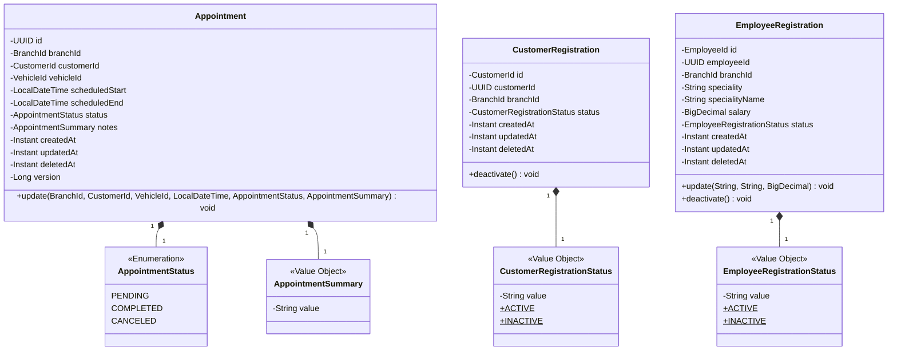
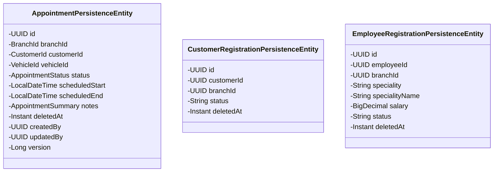
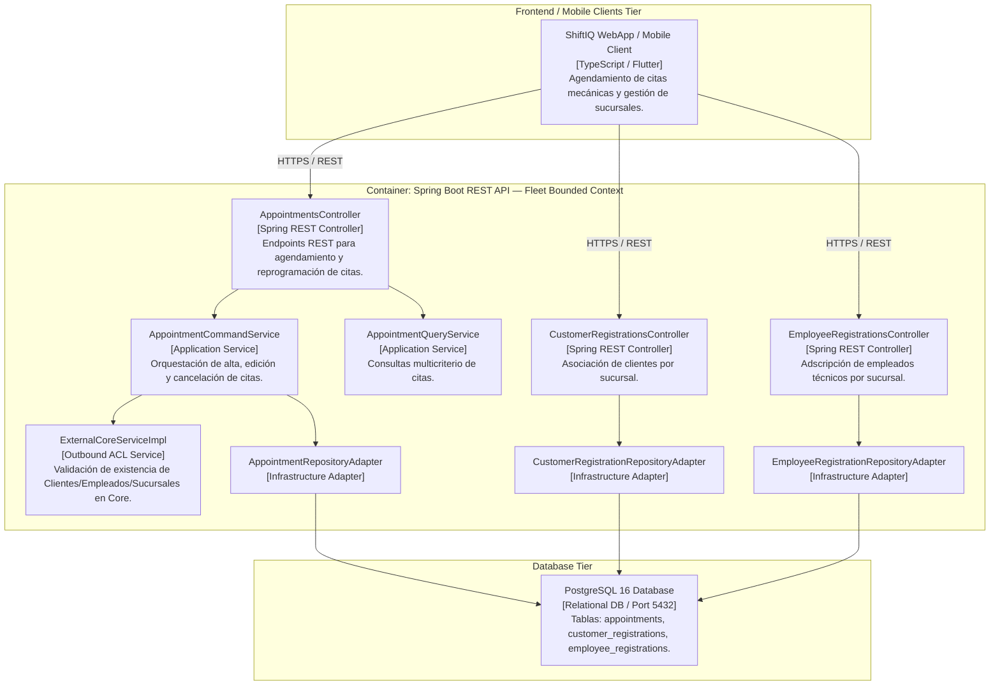
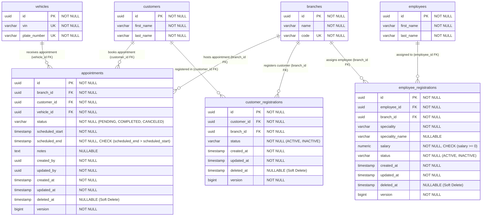

# Bounded Context Software Architecture & Domain Dictionary — Fleet (Appointments & Registrations)

El **Bounded Context `Fleet`** administra las citas programadas de atención mecánica (`Appointment`) en las distintas sucursales del taller, así como el registro y vinculación multi-tenant de clientes (`CustomerRegistration`) y empleados técnicos (`EmployeeRegistration`) con las sucursales del sistema. Interactúa mediante un Anti-Corruption Layer (ACL) con el Bounded Context `Core` para validar la existencia de clientes, empleados y sucursales.

---

## 1. Domain Layer (Capa de Dominio)

La Capa de Dominio define las reglas de agendamiento de citas mecánicas, duraciones estimadas predeterminadas (1 hora), métodos **Factory** para instanciación de agregados, validaciones de solapamiento de horarios en la capa de aplicación y la adscripción de clientes y empleados a las sedes activas del taller.

---

### 1.1. Value Objects, Enums & Exceptions

#### 📌 Enumeración: `AppointmentStatus`
* `PENDING`: Cita agendada pendiente de recepción en el taller.
* `COMPLETED`: Cita completada.
* `CANCELED`: Cita cancelada.

#### 📌 Record Value Object: `CustomerRegistrationStatus(String value)`
* **Constantes Estáticas:** `ACTIVE` ("ACTIVE"), `INACTIVE` ("INACTIVE").
* **Validación:** El estado no puede ser nulo ni estar en blanco.

#### 📌 Record Value Object: `EmployeeRegistrationStatus(String value)`
* **Constantes Estáticas:** `ACTIVE` ("ACTIVE"), `INACTIVE` ("INACTIVE").
* **Validación:** El estado no puede ser nulo ni estar en blanco.

#### 📌 Record Value Object: `AppointmentSummary(String value)`
* **Propósito:** Notas explicativas o resumen del motivo de la cita técnica.
* **Validaciones:** No puede ser nulo ni en blanco. Longitud máxima: `2000` caracteres (`fleet.error.appointmentsSummary.tooLong`).

---

### 1.2. Aggregates & Entities

#### 📌 Aggregate Root: `Appointment`
* **Hereda de:** `AbstractDomainAggregateRoot<Appointment>`
* **Propósito:** Cita de servicio agendada para un cliente y vehículo en una sucursal específica.
* **Reglas de Negocio:**
  - Al crearse, calcula automáticamente `scheduledEnd = scheduledStart + 1 hora`.
  - Inicia por defecto con estado `PENDING`.
  - Registra el evento de dominio `AppointmentCreatedEvent`.

#### 📌 Aggregate Root: `CustomerRegistration`
* **Hereda de:** `AbstractDomainAggregateRoot<CustomerRegistration>`
* **Propósito:** Registro de asociación de un cliente (`CustomerId`) con una sucursal (`BranchId`).
* **Reglas de Negocio:**
  - Inicia en estado `ACTIVE`.
  - `deactivate()`: Cambia el estado a `INACTIVE` y marca la fecha de borrado `deletedAt`.

#### 📌 Aggregate Root: `EmployeeRegistration`
* **Hereda de:** `AbstractDomainAggregateRoot<EmployeeRegistration>`
* **Propósito:** Registro de adscripción de un empleado (`EmployeeId`) a una sucursal con especialidad técnica y salario asignado.
* **Reglas de Negocio:**
  - Permite actualizar especialidad, código de especialidad y salario.
  - `deactivate()`: Cambia el estado a `INACTIVE` y setea `deletedAt`.

---

### 1.3. Domain Events

* `AppointmentCreatedEvent`: Emitido cuando se agenda una nueva cita.
* `CustomerRegistrationCreatedEvent`: Emitido al registrar a un cliente en una sucursal.
* `EmployeeRegistrationCreatedEvent`: Emitido al adscribir un empleado técnico a una sucursal.

---

### 1.4. Domain Repositories (Interfaces)

* `AppointmentRepository`:
  * `Appointment save(Appointment appointment)`
  * `Optional<Appointment> findById(UUID appointmentId)`
  * `boolean existsById(UUID appointmentId)`
  * `void deleteById(UUID appointmentId)`
  * `boolean existsByScheduledStartLessThanAndScheduledEndGreaterThan(LocalDateTime scheduledEnd, LocalDateTime scheduledStart)`
  * `boolean existsByIdNotAndScheduledStartLessThanAndScheduledEndGreaterThan(UUID appointmentId, LocalDateTime scheduledEnd, LocalDateTime scheduledStart)`
  * `List<Appointment> findByBranchId(BranchId branchId)`
  * `List<Appointment> findByCustomerId(CustomerId customerId)`
  * `List<Appointment> findByVehicleId(VehicleId vehicleId)`
  * `List<Appointment> findByBranchIdAndStatus(BranchId branchId, AppointmentStatus status)`

* `CustomerRegistrationRepository`:
  * `CustomerRegistration save(CustomerRegistration registration)`
  * `Optional<CustomerRegistration> findById(UUID id)`
  * `Optional<CustomerRegistration> findByCustomerId(UUID customerId)`
  * `Optional<CustomerRegistration> findByCustomerIdAndBranchId(UUID customerId, UUID branchId)`
  * `List<CustomerRegistration> findByBranchIdAndStatus(BranchId branchId, CustomerRegistrationStatus status)`
  * `boolean existsByCustomerIdAndBranchId(UUID customerId, UUID branchId)`

* `EmployeeRegistrationRepository`:
  * `EmployeeRegistration save(EmployeeRegistration registration)`
  * `Optional<EmployeeRegistration> findById(EmployeeId id)`
  * `Optional<EmployeeRegistration> findByEmployeeId(UUID employeeId)`
  * `List<EmployeeRegistration> findByBranchId(BranchId branchId)`
  * `List<EmployeeRegistration> findByBranchIdAndStatus(BranchId branchId, EmployeeRegistrationStatus status)`
  * `boolean existsByEmployeeIdAndBranchId(UUID employeeId, UUID branchId)`

---

## 2. Application Layer (Capa de Aplicación)

La Capa de Aplicación expone la ejecución de casos de uso mediante servicios de comando y consulta.

```mermaid
classDiagram
    direction TB

    class AppointmentCommandService {
        <<Interface>>
        +handle(CreateAppointmentCommand) Result~Appointment, AppointmentCommandFailure~
        +handle(UpdateAppointmentCommand) Result~Appointment, AppointmentCommandFailure~
        +handle(DeleteAppointmentCommand) Result~UUID, AppointmentCommandFailure~
    }

    class AppointmentQueryService {
        <<Interface>>
        +handle(UUID appointmentId) Result~Appointment, AppointmentQueryFailure~
        +handle(BranchId branchId) Result~List~Appointment~, AppointmentQueryFailure~
        +handle(BranchId branchId, AppointmentStatus status) Result~List~Appointment~, AppointmentQueryFailure~
        +handle(CustomerId customerId) Result~List~Appointment~, AppointmentQueryFailure~
        +handle(VehicleId vehicleId) Result~List~Appointment~, AppointmentQueryFailure~
    }

    class CustomerRegistrationCommandService {
        <<Interface>>
        +handle(CreateCustomerRegistrationCommand) Result~CustomerRegistration, CustomerRegistrationCommandFailure~
        +handle(UpdateCustomerRegistrationCommand) Result~CustomerRegistration, CustomerRegistrationCommandFailure~
        +handle(DeleteCustomerRegistrationCommand) Result~UUID, CustomerRegistrationCommandFailure~
    }

    class CustomerRegistrationQueryService {
        <<Interface>>
        +handle(BranchId) Result~List~CustomerRegistration~, CustomerRegistrationQueryFailure~
        +handle(BranchId, CustomerRegistrationStatus) Result~List~CustomerRegistration~, CustomerRegistrationQueryFailure~
        +handle(UUID registrationId) Result~CustomerRegistration, CustomerRegistrationQueryFailure~
        +handle(GetCustomerRegistrationByCustomerIdQuery) Result~CustomerRegistration, CustomerRegistrationQueryFailure~
    }

    class EmployeeRegistrationCommandService {
        <<Interface>>
        +handle(CreateEmployeeRegistrationCommand) Result~EmployeeRegistration, EmployeeRegistrationCommandFailure~
        +handle(UpdateEmployeeRegistrationCommand) Result~EmployeeRegistration, EmployeeRegistrationCommandFailure~
        +handle(DeleteEmployeeRegistrationCommand) Result~EmployeeRegistration, EmployeeRegistrationCommandFailure~
    }

    class EmployeeRegistrationQueryService {
        <<Interface>>
        +handle(GetEmployeeRegistrationByIdQuery) Result~EmployeeRegistration, EmployeeRegistrationQueryFailure~
        +handle(GetEmployeeRegistrationByEmployeeIdQuery) Result~EmployeeRegistration, EmployeeRegistrationQueryFailure~
        +handle(GetEmployeeRegistrationsByBranchIdQuery) Result~List~EmployeeRegistration~, EmployeeRegistrationQueryFailure~
        +handle(GetEmployeeRegistrationsByBranchIdAndStatusQuery) Result~List~EmployeeRegistration~, EmployeeRegistrationQueryFailure~
    }
```

---

### 2.1. Commands & Queries (DTOs de Aplicación)

#### Commands
* 🟦 **`CreateAppointmentCommand(BranchId branchId, CustomerId customerId, VehicleId vehicleId, LocalDateTime scheduledStart, AppointmentSummary notes)`**
* 🟦 **`UpdateAppointmentCommand(UUID appointmentId, BranchId branchId, CustomerId customerId, VehicleId vehicleId, LocalDateTime scheduledStart, AppointmentStatus status, AppointmentSummary notes)`**
* 🟦 **`DeleteAppointmentCommand(UUID appointmentId)`**
* 🟦 **`CreateCustomerRegistrationCommand(CustomerId customerId, BranchId branchId)`**
* 🟦 **`UpdateCustomerRegistrationCommand(UUID registrationId, CustomerRegistrationStatus status)`**
* 🟦 **`DeleteCustomerRegistrationCommand(UUID registrationId)`**
* 🟦 **`CreateEmployeeRegistrationCommand(EmployeeId employeeId, BranchId branchId, String speciality, String specialityName, BigDecimal salary)`**
* 🟦 **`UpdateEmployeeRegistrationCommand(EmployeeId registrationId, String speciality, String specialityName, BigDecimal salary)`**
* 🟦 **`DeleteEmployeeRegistrationCommand(EmployeeId registrationId)`**

#### Queries
* 🟩 *(AppointmentQueryService opera directamente con parámetros sobrecargados `UUID appointmentId`, `BranchId branchId`, `CustomerId customerId`, `VehicleId vehicleId` y `AppointmentStatus status`)*
* 🟩 *(CustomerRegistrationQueryService opera con parámetros sobrecargados `BranchId branchId`, `CustomerRegistrationStatus status`, `UUID registrationId` y la query `GetCustomerRegistrationByCustomerIdQuery`)*
* 🟩 **`GetCustomerRegistrationByCustomerIdQuery(UUID customerId)`**
* 🟩 **`GetEmployeeRegistrationByIdQuery(EmployeeId registrationId)`**
* 🟩 **`GetEmployeeRegistrationByEmployeeIdQuery(UUID employeeId)`**
* 🟩 **`GetEmployeeRegistrationsByBranchIdQuery(BranchId branchId)`**
* 🟩 **`GetEmployeeRegistrationsByBranchIdAndStatusQuery(BranchId branchId, EmployeeRegistrationStatus status)`**

---

### 2.2. Outbound Services (ACL)

* `ExternalCoreService`: Valida la existencia de Clientes, Empleados y Sucursales delegando al Bounded Context `Core`.
* `ExternalVehicleService`: Valida la existencia de Vehículos.

---

## 3. Interface Layer (Capa de Interfaz / REST)

Exposición RESTful para agendamiento de citas y registros de clientes/empleados por sucursal.

```mermaid
classDiagram
    direction TB

    class AppointmentsController {
        +createAppointment(CreateAppointmentResource) ResponseEntity~?~
        +updateAppointment(UUID, UpdateAppointmentResource) ResponseEntity~?~
        +deleteAppointment(UUID) ResponseEntity~?~
        +getAppointments(UUID, AppointmentStatus, UUID, UUID) ResponseEntity~?~
        +getById(UUID) ResponseEntity~?~
    }

    class CustomerRegistrationsController {
        +createCustomerRegistration(CreateCustomerRegistrationResource) ResponseEntity~?~
        +getCustomerRegistrationByCustomerId(UUID) ResponseEntity~?~
        +getCustomerRegistrationsByBranchIdAndStatus(UUID, String) ResponseEntity~?~
        +updateCustomerRegistration(UUID, UpdateCustomerRegistrationResource) ResponseEntity~?~
        +deleteCustomerRegistration(UUID) ResponseEntity~?~
    }

    class EmployeeRegistrationsController {
        +createEmployeeRegistration(CreateEmployeeRegistrationResource) ResponseEntity~?~
        +getEmployeeRegistrationsByBranchId(UUID, String) ResponseEntity~?~
        +getEmployeeRegistrationById(UUID) ResponseEntity~?~
        +getEmployeeRegistrationByEmployeeId(UUID) ResponseEntity~?~
        +updateEmployeeRegistration(UUID, UpdateEmployeeRegistrationResource) ResponseEntity~?~
        +deleteEmployeeRegistration(UUID) ResponseEntity~?~
    }

    AppointmentsController --> AppointmentCommandService
    AppointmentsController --> AppointmentQueryService
    CustomerRegistrationsController --> CustomerRegistrationCommandService
    CustomerRegistrationsController --> CustomerRegistrationQueryService
    EmployeeRegistrationsController --> EmployeeRegistrationCommandService
    EmployeeRegistrationsController --> EmployeeRegistrationQueryService
```

---

### 3.1. Endpoints & REST Controllers

#### 📌 `AppointmentsController` (`/api/v1/appointments`)
* `POST /api/v1/appointments`: Agenda una nueva cita mecánica.
* `GET /api/v1/appointments`: Obtiene citas filtradas opcionalmente por `branchId`, `status`, `customerId` o `vehicleId`.
* `GET /api/v1/appointments/{appointmentId}`: Obtiene el detalle de una cita específica.
* `PUT /api/v1/appointments/{appointmentId}`: Actualiza horario, estado o notas de una cita.
* `DELETE /api/v1/appointments/{appointmentId}`: Eliminación lógica (soft-delete) de una cita.

#### 📌 `CustomerRegistrationsController` (`/api/v1/customer-registrations`)
* `POST /api/v1/customer-registrations`: Vincula a un cliente con una sucursal.
* `GET /api/v1/customer-registrations?customerId={customerId}`: Obtiene el registro de un cliente por su ID.
* `GET /api/v1/customer-registrations?branchId={branchId}&status={status}`: Obtiene registros por sucursal y estado.
* `PUT /api/v1/customer-registrations/{id}`: Actualiza el estado del registro.
* `DELETE /api/v1/customer-registrations/{id}`: Desactiva el registro de un cliente.

#### 📌 `EmployeeRegistrationsController` (`/api/v1/employee-registrations`)
* `POST /api/v1/employee-registrations`: Adscribe a un empleado técnico a una sucursal.
* `GET /api/v1/employee-registrations?branchId={branchId}&status={status}`: Consulta lista de empleados técnicos adscritos.
* `GET /api/v1/employee-registrations/{id}`: Obtiene registro por ID.
* `GET /api/v1/employee-registrations?employeeId={employeeId}`: Obtiene registro por ID de empleado.
* `PUT /api/v1/employee-registrations/{id}`: Actualiza especialidad o salario del empleado.
* `DELETE /api/v1/employee-registrations/{id}`: Desactiva la adscripción del empleado técnico.

---

## 4. Infrastructure Layer (Capa de Infraestructura)

Mapeo relacional JPA a PostgreSQL 16 con soporte de eliminación lógica (`@SQLDelete` seteando `deleted_at`).

---

### 4.1. Mapeo de Entidades Relacionales (JPA)

* **`appointments`** (`AppointmentPersistenceEntity`):
  * `id` (UUID, PK, heredado de `AuditableAbstractPersistenceEntity`)
  * `branch_id` (UUID, NOT NULL)
  * `customer_id` (UUID, NOT NULL)
  * `vehicle_id` (UUID, NOT NULL)
  * `status` (VARCHAR(20), NOT NULL)
  * `scheduled_start` (TIMESTAMP, NOT NULL)
  * `scheduled_end` (TIMESTAMP, NOT NULL)
  * `notes` (TEXT, `AppointmentSummaryAttributeConverter`)
  * `deleted_at` (TIMESTAMP), `created_by` (UUID), `updated_by` (UUID)
  * `created_at`, `updated_at`, `version` (heredados de `AuditableAbstractPersistenceEntity`)
* **`customer_registrations`** (`CustomerRegistrationPersistenceEntity`):
  * `id` (UUID, PK, heredado de `AuditableAbstractPersistenceEntity`)
  * `customer_id` (UUID, NOT NULL)
  * `branch_id` (UUID, NOT NULL)
  * `status` (VARCHAR(20), NOT NULL)
  * `deleted_at` (TIMESTAMP)
  * `created_at`, `updated_at`, `version` (heredados de `AuditableAbstractPersistenceEntity`)
* **`employee_registrations`** (`EmployeeRegistrationPersistenceEntity`):
  * `id` (UUID, PK, heredado de `AuditableAbstractPersistenceEntity`)
  * `employee_id` (UUID, NOT NULL)
  * `branch_id` (UUID, NOT NULL)
  * `speciality` (VARCHAR(50), NOT NULL)
  * `speciality_name` (VARCHAR(50))
  * `salary` (DECIMAL(10,2), NOT NULL)
  * `status` (VARCHAR(20), NOT NULL)
  * `deleted_at` (TIMESTAMP)
  * `created_at`, `updated_at`, `version` (heredados de `AuditableAbstractPersistenceEntity`)

---

## 5. Software Architecture Component Level Diagrams (C4 Model - Level 3)

Descomposición del Container API en sus componentes principales para el Bounded Context **Fleet**.

---

## 6. Code Level Diagrams

### 6.1. Domain Layer Class Diagram

```mermaid
classDiagram
    direction TB

    class Appointment {
        <<Aggregate Root>>
        -UUID id
        -BranchId branchId
        -CustomerId customerId
        -VehicleId vehicleId
        -LocalDateTime scheduledStart
        -LocalDateTime scheduledEnd
        -AppointmentStatus status
        -AppointmentSummary notes
        -Instant createdAt
        -Instant updatedAt
        -Instant deletedAt
        -Long version
        +Appointment(BranchId branchId, CustomerId customerId, VehicleId vehicleId, LocalDateTime scheduledStart, AppointmentSummary notes)
        +update(BranchId branchId, CustomerId customerId, VehicleId vehicleId, LocalDateTime scheduledStart, AppointmentStatus status, AppointmentSummary notes) void
        +getId() UUID
        +getBranchId() BranchId
        +getCustomerId() CustomerId
        +getVehicleId() VehicleId
        +getScheduledStart() LocalDateTime
        +getScheduledEnd() LocalDateTime
        +getStatus() AppointmentStatus
    }

    class CustomerRegistration {
        <<Aggregate Root>>
        -CustomerId id
        -UUID customerId
        -BranchId branchId
        -CustomerRegistrationStatus status
        -Instant createdAt
        -Instant updatedAt
        -Instant deletedAt
        -Long version
        +CustomerRegistration(UUID customerId, BranchId branchId)
        +deactivate() void
        +getId() CustomerId
        +getCustomerId() UUID
        +getBranchId() BranchId
        +getStatus() CustomerRegistrationStatus
    }

    class EmployeeRegistration {
        <<Aggregate Root>>
        -EmployeeId id
        -UUID employeeId
        -BranchId branchId
        -String speciality
        -String specialityName
        -BigDecimal salary
        -EmployeeRegistrationStatus status
        -Instant createdAt
        -Instant updatedAt
        -Instant deletedAt
        -Long version
        +EmployeeRegistration(UUID employeeId, BranchId branchId, String speciality, String specialityName, BigDecimal salary)
        +update(String speciality, String specialityName, BigDecimal salary) void
        +deactivate() void
        +getId() EmployeeId
        +getEmployeeId() UUID
        +getBranchId() BranchId
        +getStatus() EmployeeRegistrationStatus
    }

    class CustomerId {
        <<Value Object>>
        -UUID value
        +CustomerId(UUID value)
        +value() UUID
    }

    class EmployeeId {
        <<Value Object>>
        -UUID value
        +EmployeeId(UUID value)
        +value() UUID
    }

    class BranchId {
        <<Value Object>>
        -UUID value
        +BranchId(UUID value)
        +value() UUID
    }

    class VehicleId {
        <<Value Object>>
        -UUID value
        +VehicleId(UUID value)
        +value() UUID
    }

    class AppointmentSummary {
        <<Value Object>>
        -String value
        +value() String
    }

    class CustomerRegistrationStatus {
        <<Value Object>>
        -String value
        +ACTIVE$
        +INACTIVE$
        +value() String
    }

    class EmployeeRegistrationStatus {
        <<Value Object>>
        -String value
        +ACTIVE$
        +INACTIVE$
        +value() String
    }

    class AppointmentStatus {
        <<Enumeration>>
        PENDING
        COMPLETED
        CANCELED
    }

    Appointment "1" *-- "1" BranchId : location
    Appointment "1" *-- "1" CustomerId : client
    Appointment "1" *-- "1" VehicleId : car
    Appointment "1" *-- "1" AppointmentStatus : state
    Appointment "1" *-- "1" AppointmentSummary : notes

    CustomerRegistration "1" *-- "1" CustomerId : identity
    CustomerRegistration "1" *-- "1" BranchId : branch reference
    CustomerRegistration "1" *-- "1" CustomerRegistrationStatus : state

    EmployeeRegistration "1" *-- "1" EmployeeId : identity
    EmployeeRegistration "1" *-- "1" BranchId : branch reference
    EmployeeRegistration "1" *-- "1" EmployeeRegistrationStatus : state
```

---

### 6.2. PostgreSQL 16 Entity Relationship Diagram (ERD)

