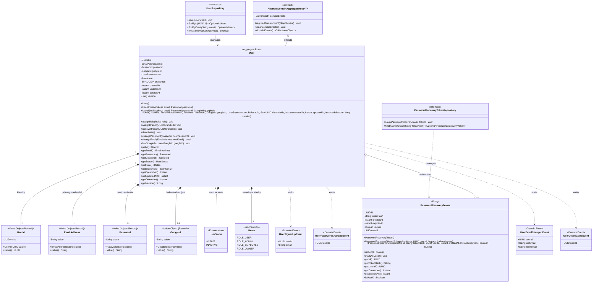
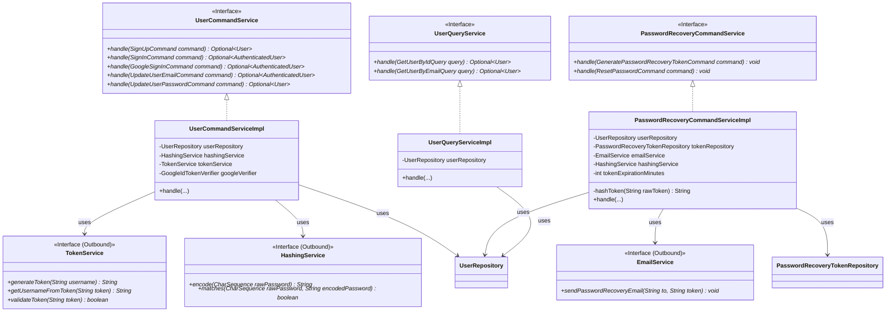
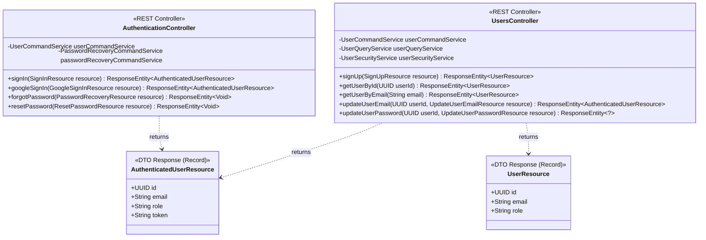
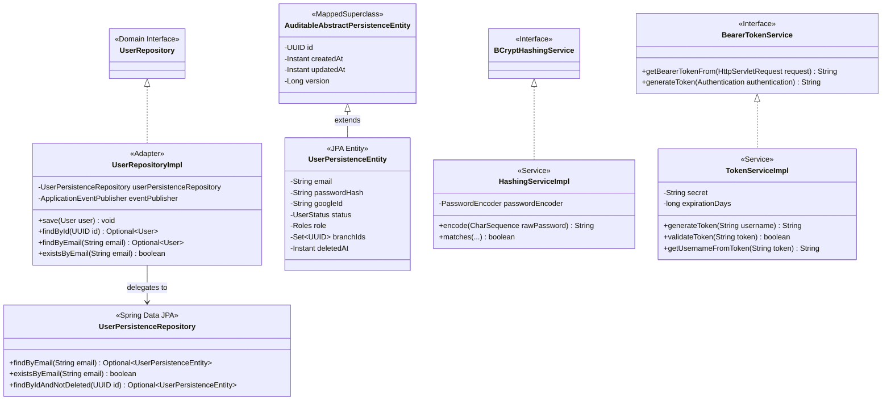
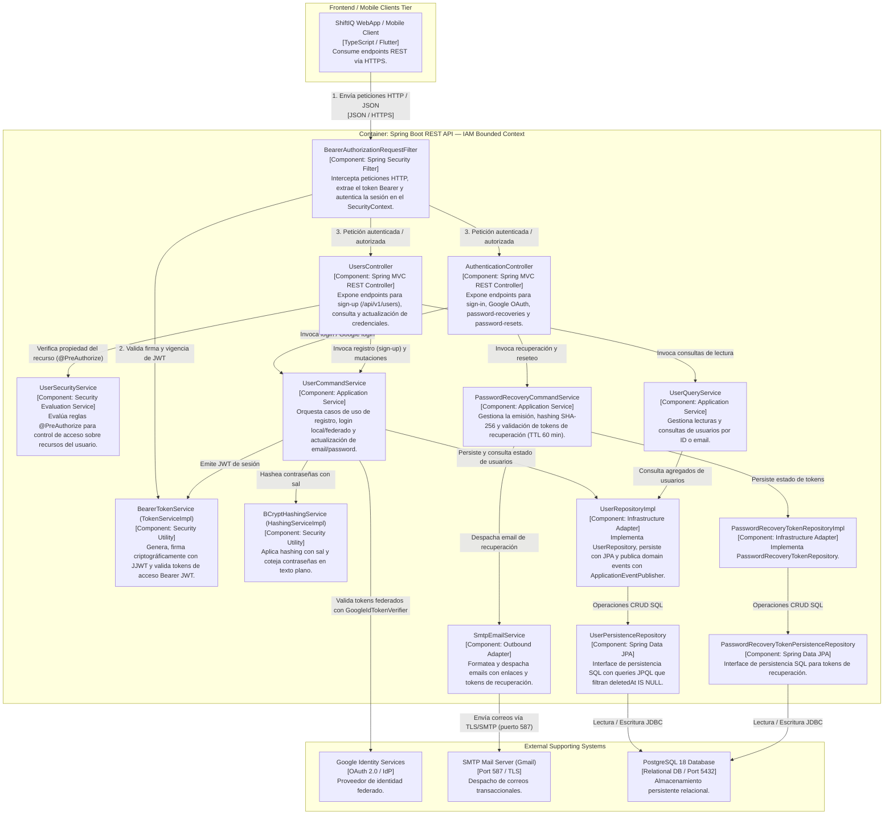
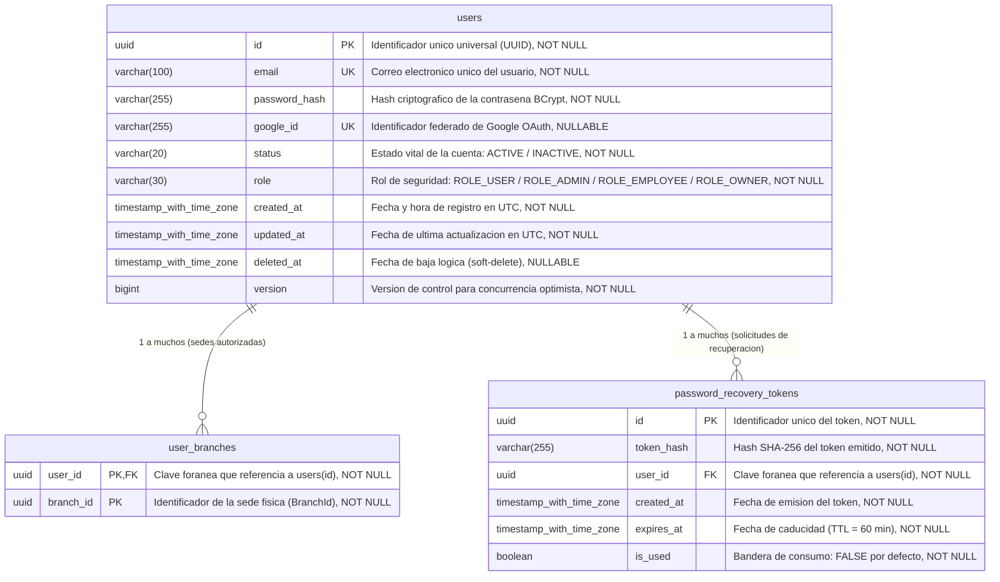

# Diccionario de Arquitectura DDD por Capas y Especificación de Diseño (Bounded Contexts)

Este documento presenta la especificación exhaustiva, formal y técnica de los **Bounded Contexts** implementados en el ecosistema **ShiftIQ Platform**. Cada contexto se estructura rigurosamente bajo los lineamientos del **Domain-Driven Design (DDD) Táctico** y los principios de la **Arquitectura Limpia / Hexagonal**, alineado al 100% con la base de código real. Incluye diagramas de arquitectura en **C4 Model (Nivel 3: Componentes)**, diagramas a nivel de código (**UML Class Diagrams** y **Database ER Diagrams**), y el **Diccionario de Clases por Capas** con atributos tipados, signaturas completas de métodos, visibilidad, reglas de negocio, invariantes y relaciones estructurales entre componentes a través de las cuatro capas fundamentales: **Domain Layer**, **Application Layer**, **Interface Layer** e **Infrastructure Layer**.

---

# Bounded Context: Identity & Access Management (IAM)

El Bounded Context de **Identity & Access Management (IAM)** constituye la piedra angular de seguridad, identidad y control de acceso de la plataforma ShiftIQ. Su responsabilidad primordial radica en centralizar el ciclo de vida de las identidades de usuario, garantizando:
- La confidencialidad y almacenamiento seguro de credenciales mediante hashing criptográfico BCrypt.
- La provisión de mecanismos de autenticación local (vía email y contraseña) y federada (mediante Google Identity Services / OAuth 2.0).
- La emisión, firma criptográfica y verificación de tokens de autorización sin estado (**JSON Web Tokens - JWT**).
- La asignación y verificación de roles de seguridad (Role-Based Access Control - RBAC) con soporte de autorización por propiedad de recurso mediante `UserSecurityService`.
- La orquestación del restablecimiento seguro de contraseñas olvidadas mediante tokens efímeros hasheados con SHA-256 (TTL por defecto de 60 minutos) y notificados vía correo electrónico (SMTP).

---

## 1. Domain Layer (Capa de Dominio)

La Capa de Dominio encierra la lógica de negocio pura, las invariantes operativas y las reglas del sistema de identidad, manteniéndose completamente agnóstica de frameworks web, motores de bases de datos o librerías de persistencia. En esta capa se definen Agregados, Entidades, Value Objects, Servicios de Dominio, Fábricas (Factories/Creation Constructors) e Interfaces de Repositorio.

### 1.1. Aggregates & Entities

#### 📌 Class: `User`
* **Tipo:** Aggregate Root (extiende de `AbstractDomainAggregateRoot<User>`).
* **Propósito:** Raíz de consistencia del agregado de usuario en IAM. Encapsula las credenciales, el estado vital de la cuenta, el rol de autorización RBAC, las asociaciones a sucursales de taller y las transiciones de estado, garantizando la publicación atómica de eventos de dominio ante cambios relevantes.
* **Documentación de Atributos:**
  * `id`: `UserId` (No Nulo) — Identificador único tipado del usuario encapsulado en un Value Object.
  * `email`: `EmailAddress` (No Nulo) — Dirección de correo electrónico normalizada y validada.
  * `password`: `Password` (No Nulo para auth local) — Hash de la contraseña encriptada con BCrypt.
  * `googleId`: `GoogleId` (Opcional) — Sujeto único emitido por Google OAuth (`sub`).
  * `status`: `UserStatus` (No Nulo) — Estado de la cuenta (`ACTIVE` o `INACTIVE`).
  * `role`: `Roles` (No Nulo) — Rol de autorización (`ROLE_USER`, `ROLE_ADMIN`, `ROLE_EMPLOYEE`, `ROLE_OWNER`).
  * `branchIds`: `Set<UUID>` (No Nulo) — Colección de identificadores de sedes (`BranchId`) asociadas al usuario.
  * `createdAt`: `Instant` — Marca de tiempo UTC de creación.
  * `updatedAt`: `Instant` — Marca de tiempo UTC de última actualización.
  * `deletedAt`: `Instant` (Opcional) — Marca de tiempo UTC de baja lógica (soft delete).
  * `version`: `Long` — Control de concurrencia optimista.
* **Documentación de Métodos:**
  * `+ User()`: Constructor por defecto; genera UUID aleatorio, fija `status = ACTIVE`, `role = ROLE_USER` y colección vacía de `branchIds`.
  * `+ User(EmailAddress email, Password password)`: Constructor de registro local. Valida no-nulidad de email y password, e inmediatamente registra el evento `UserSignedUpEvent(this, this.id.value(), this.email.value())`.
  * `+ User(EmailAddress email, Password password, GoogleId googleId)`: Constructor para registro federado o con vinculación explícita de Google.
  * `+ assignRole(Roles role)`: `void` — Asigna o actualiza el rol del usuario. Lanza `IllegalArgumentException("iam.error.role.required")` si es nulo.
  * `+ assignBranch(UUID branchId)`: `void` — Vincula una sucursal al perfil del usuario. Lanza `IllegalArgumentException("iam.error.branchId.required")` si el UUID es nulo.
  * `+ removeBranch(UUID branchId)`: `void` — Remueve la asociación con la sucursal de forma idempotente.
  * `+ deactivate()`: `void` — Muta el estado a `INACTIVE`, establece `deletedAt = Instant.now()` y registra `#registerDomainEvent(new UserDeactivatedEvent(this, this.id.value()))`.
  * `+ changePassword(Password newPassword)`: `void` — Valida no-nulidad y comprueba que la nueva contraseña no coincida con el hash actual (`"iam.error.password.sameAsCurrent"`). Actualiza el hash y registra `#registerDomainEvent(new UserPasswordChangedEvent(this, this.id.value()))`.
  * `+ changeEmail(EmailAddress newEmail)`: `void` — Valida consistencia, actualiza el correo y registra `#registerDomainEvent(new UserEmailChangedEvent(this, this.id.value(), oldEmail, newEmail.value()))`.
  * `+ linkGoogleAccount(GoogleId googleId)`: `void` — Asocia la identidad federada de Google.
* **Relaciones:**
  * Compone los Value Objects `UserId`, `EmailAddress`, `Password`, `GoogleId`, `UserStatus` y `Roles`.
  * Registra eventos de dominio: `UserSignedUpEvent`, `UserPasswordChangedEvent`, `UserEmailChangedEvent`, `UserDeactivatedEvent`.

---

#### 📌 Class: `PasswordRecoveryToken`
* **Tipo:** Entity interna de dominio.
* **Propósito:** Representa un token temporal y efímero generado para validar solicitudes de restablecimiento de contraseña.
* **Documentación de Atributos:**
  * `id`: `UUID` (No Nulo) — Identificador único universal del registro del token.
  * `tokenHash`: `String` (No Nulo) — Hash digest SHA-256 del token plano generado (evita guardar tokens en texto plano en la base de datos).
  * `userId`: `UUID` (No Nulo) — Identificador del usuario propietario del token.
  * `createdAt`: `Instant` — Marca temporal de emisión.
  * `expiresAt`: `Instant` — Marca temporal de caducidad calculada (por defecto 60 minutos).
  * `isUsed`: `boolean` — Bandera de consumo; transiciona irreversiblemente a `true` al usarse.
* **Documentación de Métodos:**
  * `+ PasswordRecoveryToken(String tokenHash, UUID userId, long expirationMinutes)`: Constructor de emisión. Calcula `expiresAt` sumando los minutos a `createdAt` y fija `isUsed = false`.
  * `+ isValid()`: `boolean` — Retorna `true` si `!isUsed` y `Instant.now().isBefore(expiresAt)`.
  * `+ markAsUsed()`: `void` — Invalida el token estableciendo `isUsed = true`.
* **Relaciones:** Mantiene una referencia débil por identificador (`userId`) hacia el agregado `User`.

---

### 1.2. Value Objects

#### 📌 Class: `UserId`
* **Tipo:** Value Object (Java Record).
* **Propósito:** Tipado fuerte para el identificador único del usuario (`UUID`).
* **Atributos:** `value: UUID`.
* **Métodos:** Constructor canónico con validación de no-nulidad (`"iam.error.userId.required"`).

#### 📌 Class: `EmailAddress`
* **Tipo:** Value Object (Java Record).
* **Propósito:** Valida y encapsula una dirección de correo electrónico según la expresión regular `^[a-zA-Z0-9._%+-]+@[a-zA-Z0-9.-]+\\.[a-zA-Z]{2,}$`.
* **Atributos:** `value: String`.
* **Métodos:** Constructor con validación de patrón (`"iam.error.email.invalidFormat"`) y no-nulidad (`"iam.error.email.required"`).

#### 📌 Class: `Password`
* **Tipo:** Value Object (Java Record).
* **Propósito:** Encapsula la contraseña en formato hash, asegurando que el dominio nunca maneje texto plano.
* **Atributos:** `value: String`.
* **Métodos:** Valida no-nulidad ni espacio en blanco (`"iam.error.password.required"`).

#### 📌 Class: `GoogleId`
* **Tipo:** Value Object (Java Record).
* **Propósito:** Encapsula el identificador federado del sujeto provisto por Google (`sub`).
* **Atributos:** `value: String`.

#### 📌 Enum: `Roles`
* **Tipo:** Value Object (Enumeration).
* **Propósito:** Define los roles canónicos de seguridad existentes en la base de código real:
* **Valores:**
  * `ROLE_USER`: Rol base por defecto asignado a todo usuario registrado.
  * `ROLE_ADMIN`: Administrador con privilegios de control global de plataforma.
  * `ROLE_EMPLOYEE`: Personal operativo o técnico del taller automotriz.
  * `ROLE_OWNER`: Propietario del taller automotriz y titular de la suscripción.

#### 📌 Enum: `UserStatus`
* **Tipo:** Value Object (Enumeration).
* **Propósito:** Modela el estado de la cuenta en el ciclo de vida:
* **Valores:**
  * `ACTIVE`: Cuenta habilitada para autenticación y consumo de APIs.
  * `INACTIVE`: Cuenta dada de baja lógica.

---

### 1.3. Domain Events

* 🟧 **`UserSignedUpEvent(Object source, UUID userId, String email)`**: Publicado al crearse una nueva cuenta de usuario.
* 🟧 **`UserPasswordChangedEvent(Object source, UUID userId)`**: Publicado al modificarse la contraseña del usuario.
* 🟧 **`UserEmailChangedEvent(Object source, UUID userId, String oldEmail, String newEmail)`**: Publicado tras la actualización de correo electrónico.
* 🟧 **`UserDeactivatedEvent(Object source, UUID userId)`**: Publicado al ejecutarse la baja lógica de la cuenta.

---

### 1.4. Domain Repositories (Interfaces)

#### 📌 Interface: `UserRepository`
* **Propósito:** Define el contrato formal de persistencia del agregado `User`. En la base de código real, sus métodos de consulta utilizan tipos primitivos/estándar (`UUID`, `String`) y `save()` retorna `void`:
* **Métodos:**
  * `void save(User user)`: Persiste o actualiza el usuario en la base de datos y despacha sus eventos de dominio acumulados mediante `ApplicationEventPublisher`.
  * `Optional<User> findById(UUID id)`: Busca un usuario activo por su identificador único.
  * `Optional<User> findByEmail(String email)`: Busca un usuario activo por su dirección de correo electrónico.
  * `boolean existsByEmail(String email)`: Comprueba si existe un usuario activo con dicho correo.
* **Relaciones:** Implementado en infraestructura por `UserRepositoryImpl`.

#### 📌 Interface: `PasswordRecoveryTokenRepository`
* **Propósito:** Contrato para el almacenamiento y consulta de tokens de recuperación de contraseñas.
* **Métodos:**
  * `void save(PasswordRecoveryToken token)`: Persiste o actualiza el token de recuperación.
  * `Optional<PasswordRecoveryToken> findByTokenHash(String tokenHash)`: Localiza un token mediante su hash SHA-256.
* **Relaciones:** Implementado en infraestructura por `PasswordRecoveryTokenRepositoryImpl`.

---

## 2. Application Layer (Capa de Aplicación)

La Capa de Aplicación orquesta los casos de uso del Bounded Context. Recibe comandos y consultas, coordina los agregados del dominio, ejecuta validaciones de unicidad y delega en servicios de infraestructura (hashing, tokens, email y Google OAuth).

### 2.1. Commands & Queries (DTOs de Aplicación)

* 🟦 **`SignUpCommand(EmailAddress email, Password password)`**: Comando con Value Objects para dar de alta una nueva cuenta.
* 🟦 **`SignInCommand(EmailAddress email, Password password)`**: Credenciales para autenticación local.
* 🟦 **`GoogleSignInCommand(String idToken)`**: Token de identidad emitido por Google Identity Services.
* 🟦 **`GeneratePasswordRecoveryTokenCommand(EmailAddress email)`**: Solicitud de token de recuperación.
* 🟦 **`ResetPasswordCommand(String token, Password newPassword)`**: Token plano recibido por email y Value Object de la nueva contraseña.
* 🟦 **`UpdateUserEmailCommand(UserId userId, EmailAddress newEmail)`**: Parámetros para actualizar el correo electrónico.
* 🟦 **`UpdateUserPasswordCommand(UserId userId, Password currentPassword, Password newPassword)`**: Parámetros para cambiar la clave verificando la actual.
* 🟩 **`GetUserByIdQuery(UserId userId)`**: Consulta inmutable de usuario por su identificador.
* 🟩 **`GetUserByEmailQuery(EmailAddress email)`**: Consulta de usuario por dirección de correo.
* 🟩 **`AuthenticatedUser(User user, String token)`**: Modelo de resultado de autenticación que encapsula el agregado `User` y el token JWT emitido.

---

### 2.2. Command Services & Handlers

#### 📌 Interface: `UserCommandService` / Class: `UserCommandServiceImpl`
* **Propósito:** Orquestador de mutaciones de usuario en IAM.
* **Dependencias inyectadas:** `UserRepository`, `HashingService`, `TokenService`, `GoogleIdTokenVerifier` (configurado con `@Value("${google.client.id}")`).
* **Documentación de Métodos:**
  * `Optional<User> handle(SignUpCommand command)`:
    * *Lógica:* Verifica si `userRepository.existsByEmail(command.email().value())` es verdadero. De ser así, lanza `IllegalArgumentException("iam.error.email.alreadyInUse")`. Hashea la contraseña mediante `hashingService.encode(command.password().value())`, instancia `new User(command.email(), passwordVO)` y persiste mediante `userRepository.save(user)`. Retorna `userRepository.findByEmail(command.email().value())`.
  * `Optional<AuthenticatedUser> handle(SignInCommand command)`:
    * *Lógica:* Busca el usuario por email. Si no existe o `hashingService.matches(command.password().value(), user.getPassword().value())` falla, lanza `IllegalArgumentException("iam.error.credentials.invalid")`. Genera el token JWT llamando a `tokenService.generateToken(user.getEmail().value())` y retorna `Optional.of(new AuthenticatedUser(user, token))`.
  * `Optional<AuthenticatedUser> handle(GoogleSignInCommand command)`:
    * *Lógica:* Valida el `idToken` mediante `googleVerifier.verify(command.idToken())`. Si es nulo o falla, lanza `IllegalArgumentException("iam.error.googleToken.invalid")`. Extrae email y subject (`googleId`). Si el usuario no existe, aprovisiona un nuevo agregado `User` con contraseña aleatoria encriptada y lo vincula a `GoogleId`. Si ya existía, vincula el `googleId` si estaba ausente. Genera el JWT y retorna `Optional.of(new AuthenticatedUser(user, token))`.
  * `Optional<AuthenticatedUser> handle(UpdateUserEmailCommand command)`:
    * *Lógica:* Localiza al usuario por ID o lanza `"iam.error.user.notFound"`. Si el email cambia y ya existe en otro registro, lanza `"iam.error.email.alreadyInUse"`. Invoca `user.changeEmail(command.newEmail())`, persiste vía `userRepository.save(user)`, genera un nuevo JWT con el nuevo email y retorna `Optional.of(new AuthenticatedUser(user, token))`.
  * `Optional<User> handle(UpdateUserPasswordCommand command)`:
    * *Lógica:* Localiza al usuario por ID. Comprueba la contraseña actual mediante `hashingService.matches()`; si no coincide, lanza `"iam.error.currentPassword.invalid"`. Encripta la nueva clave, llama a `user.changePassword(newPasswordVO)`, guarda con `userRepository.save(user)` y retorna `Optional.of(user)`.

#### 📌 Interface: `PasswordRecoveryCommandService` / Class: `PasswordRecoveryCommandServiceImpl`
* **Propósito:** Orquestador del flujo de recuperación y reseteo de contraseñas.
* **Dependencias inyectadas:** `UserRepository`, `PasswordRecoveryTokenRepository`, `EmailService`, `HashingService`, `@Value("${password.recovery.token.expiration.minutes:60}") int tokenExpirationMinutes`.
* **Documentación de Métodos:**
  * `void handle(GeneratePasswordRecoveryTokenCommand command)`:
    * *Lógica:* Busca al usuario por email. Si no existe, registra un log de advertencia y termina la ejecución silenciosamente (prevención de enumeración de cuentas). Si existe, genera un token plano aleatorio `UUID.randomUUID().toString()`, calcula su hash digest SHA-256 mediante el método privado `hashToken(rawToken)`, crea la entidad `PasswordRecoveryToken(tokenHash, user.getId().value(), tokenExpirationMinutes)` y la persiste con `tokenRepository.save(token)`. Finalmente, despacha el correo mediante `emailService.sendPasswordRecoveryEmail(user.getEmail().value(), rawToken)`.
  * `void handle(ResetPasswordCommand command)`:
    * *Lógica:* Calcula el hash digest SHA-256 del token plano recibido (`hashToken(command.token())`). Busca el token con `tokenRepository.findByTokenHash(tokenHash)`. Si no existe o `!tokenEntity.isValid()`, lanza `IllegalArgumentException("iam.error.token.invalidOrExpired")`. Localiza al usuario por `tokenEntity.getUserId()`, hashea la nueva contraseña con `hashingService.encode()`, actualiza con `user.changePassword()`, marca `tokenEntity.markAsUsed()` y persiste ambas entidades.
  * `- hashToken(String rawToken)`: `String` — Método utilitario privado que aplica el algoritmo criptográfico estándar `MessageDigest.getInstance("SHA-256")` codificado en hexadecimal sobre el token plano.

---

### 2.3. Query Services

#### 📌 Interface: `UserQueryService` / Class: `UserQueryServiceImpl`
* **Propósito:** Consultas de lectura pura sobre usuarios.
* **Métodos:**
  * `Optional<User> handle(GetUserByIdQuery query)`: Invoca `userRepository.findById(query.userId().value())`.
  * `Optional<User> handle(GetUserByEmailQuery query)`: Invoca `userRepository.findByEmail(query.email().value())`.

---

### 2.4. Outbound Services Interfaces

* **`HashingService`**:
  * `String encode(CharSequence rawPassword)`: Encripta la contraseña.
  * `boolean matches(CharSequence rawPassword, String encodedPassword)`: Coteja contraseñas.
* **`TokenService`**:
  * `String generateToken(String username)`: Genera el token JWT a partir del nombre de usuario / email (`String`).
  * `String getUsernameFromToken(String token)`: Extrae el email del payload del token.
  * `boolean validateToken(String token)`: Valida la firma y tiempo de expiración.
* **`EmailService`**:
  * `void sendPasswordRecoveryEmail(String to, String token)`: Envía el correo electrónico con el token plano de recuperación.

---

## 3. Interface Layer (Capa de Interfaces)

La Capa de Interfaces expone los controladores REST HTTP bajo la convención de URLs reales del sistema. Transforma peticiones JSON entrantes en comandos/queries y mapea los resultados del dominio a Resources DTOs.

### 3.1. REST Controllers

#### 📌 Class: `AuthenticationController`
* **Ruta Base:** `/api/v1/authentication`
* **Anotaciones:** `@RestController`, `@RequestMapping("/api/v1/authentication")`, `@Tag(name = "Authentication")`.
* **Endpoints y Métodos:**
  * `POST /sessions` (`signIn`):
    * Recibe `@Valid @RequestBody SignInResource`. Transforma a `SignInCommand`, delega en `userCommandService.handle(signInCommand)`. Si está vacío retorna `401 Unauthorized`; si es exitoso retorna `200 OK` con `AuthenticatedUserResource`.
  * `POST /sessions/google` (`googleSignIn`):
    * Recibe `@Valid @RequestBody GoogleSignInResource`. Transforma a `GoogleSignInCommand`, delega en `userCommandService.handle()`. Si está vacío retorna `401 Unauthorized`; si es exitoso retorna `200 OK` con `AuthenticatedUserResource`.
  * `POST /password-recoveries` (`forgotPassword`):
    * Recibe `@Valid @RequestBody PasswordRecoveryResource`. Transforma a `GeneratePasswordRecoveryTokenCommand`, delega en `passwordRecoveryCommandService.handle()` y retorna `200 OK` vacío (`ResponseEntity.ok().build()`).
  * `POST /password-resets` (`resetPassword`):
    * Recibe `@Valid @RequestBody ResetPasswordResource`. Transforma a `ResetPasswordCommand`, delega en `passwordRecoveryCommandService.handle()` y retorna `200 OK` vacío (`ResponseEntity.ok().build()`).

#### 📌 Class: `UsersController`
* **Ruta Base:** `/api/v1/users`
* **Anotaciones:** `@RestController`, `@RequestMapping("/api/v1/users")`, `@Tag(name = "Users")`, `@PreAuthorize("isAuthenticated()")`.
* **Endpoints y Métodos:**
  * `POST /` (`signUp`):
    * `@PreAuthorize("permitAll()")`. Recibe `@Valid @RequestBody SignUpResource`. Transforma a `SignUpCommand`, delega en `userCommandService.handle(signUpCommand)`. Si falla retorna `400 Bad Request`; si es exitoso retorna `201 Created` con el cuerpo `UserResource`.
  * `GET /{userId}` (`getUserById`):
    * `@PreAuthorize("isAuthenticated() and @userSecurityService.isCurrentUser(#userId)")`. Recibe `@PathVariable UUID userId`. Emite `GetUserByIdQuery`. Si no existe retorna `404 Not Found`; si existe retorna `200 OK` con `UserResource`.
  * `GET /` (`getUserByEmail`):
    * Recibe `@RequestParam(name = "email") String email`. Emite `GetUserByEmailQuery`. Si no existe retorna `404 Not Found`. Valida que `@userSecurityService.isCurrentUser(user.getId().value())` sea verdadero; de lo contrario retorna `403 Forbidden`. Retorna `200 OK` con `UserResource`.
  * `PUT /{userId}/email` (`updateUserEmail`):
    * `@PreAuthorize("isAuthenticated() and @userSecurityService.isCurrentUser(#userId)")`. Recibe `UpdateUserEmailResource`. Transforma a `UpdateUserEmailCommand`, delega en `userCommandService.handle()`. Si falla retorna `400 Bad Request`; si tiene éxito retorna `200 OK` con `AuthenticatedUserResource` (incluyendo el nuevo JWT regenerado).
  * `PUT /{userId}/password` (`updateUserPassword`):
    * `@PreAuthorize("isAuthenticated() and @userSecurityService.isCurrentUser(#userId)")`. Recibe `UpdateUserPasswordResource`. Transforma a `UpdateUserPasswordCommand`. Si falla retorna `400 Bad Request`; si tiene éxito retorna `200 OK`.

---

### 3.2. Resources (DTOs) & Assemblers

* **`UserResource(UUID id, String email, String role)`**: Record inmutable de respuesta para datos públicos de usuario.
* **`AuthenticatedUserResource(UUID id, String email, String role, String token)`**: Record inmutable de respuesta que incluye el token Bearer JWT tras el login exitoso.
* **`SignUpResource(String email, String password)`**: DTO de entrada con `@NotBlank @Email` y `@NotBlank @Size(min = 8)`.
* **`SignInResource(String email, String password)`**: DTO de entrada con `@NotBlank @Email` y `@NotBlank`.
* **`GoogleSignInResource(String idToken)`**: DTO de entrada con `@NotBlank String idToken`.
* **`PasswordRecoveryResource(String email)`**: DTO de entrada con `@NotBlank @Email String email`.
* **`ResetPasswordResource(String token, String newPassword)`**: DTO de entrada con `@NotBlank String token` y `@NotBlank @Size(min = 8) String newPassword`.
* **`UpdateUserEmailResource(String email)`**: DTO de entrada con `@NotBlank @Email String email`.
* **`UpdateUserPasswordResource(String currentPassword, String newPassword)`**: DTO de entrada con `@NotBlank String currentPassword` y `@NotBlank @Size(min = 8) String newPassword`.
* **Assemblers Estáticos:**
  * `SignUpCommandFromResourceAssembler.toCommandFromResource(resource)`
  * `SignInCommandFromResourceAssembler.toCommandFromResource(resource)`
  * `GoogleSignInCommandFromResourceAssembler.toCommandFromResource(resource)`
  * `GeneratePasswordRecoveryTokenCommandFromResourceAssembler.toCommandFromResource(resource)`
  * `ResetPasswordCommandFromResourceAssembler.toCommandFromResource(resource)`
  * `UpdateUserEmailCommandFromResourceAssembler.toCommandFromResource(userId, resource)`
  * `UpdateUserPasswordCommandFromResourceAssembler.toCommandFromResource(userId, resource)`
  * `UserResourceFromEntityAssembler.toResourceFromEntity(user)`
  * `AuthenticatedUserResourceFromEntityAssembler.toResourceFromEntity(authenticatedUser)`

---

## 4. Infrastructure Layer (Capa de Infraestructura)

La Capa de Infraestructura implementa la persistencia física en PostgreSQL 18 con Spring Data JPA, el filtrado de seguridad con Spring Security, el hashing BCrypt y la integración con SMTP y Google Identity Services.

### 4.1. Persistence (JPA Entities, Repositories & Assemblers)

#### 📌 Class: `AuditableAbstractPersistenceEntity`
* **Tipo:** `@MappedSuperclass` con listener `@EntityListeners(AuditingEntityListener.class)`.
* **Propósito:** Provee los campos comunes de identidad, auditoría y control de concurrencia optimista para las entidades relacionales de la plataforma:
  * `@Id @GeneratedValue(strategy = GenerationType.UUID) @Column(columnDefinition = "uuid", updatable = false, nullable = false) private UUID id;`
  * `@CreatedDate @Column(name = "created_at", nullable = false, updatable = false) private Instant createdAt;`
  * `@LastModifiedDate @Column(name = "updated_at", nullable = false) private Instant updatedAt;`
  * `@Version @Column(name = "version") private Long version;`

#### 📌 Class: `UserPersistenceEntity`
* **Tipo:** Entidad JPA (`@Entity`, `@Table(name = "users")`) que extiende de `AuditableAbstractPersistenceEntity`.
* **Mapeo de Columnas:**
  * `@Column(name = "email", nullable = false, unique = true, length = 100) private String email;`
  * `@Column(name = "password_hash", nullable = false) private String passwordHash;`
  * `@Column(name = "google_id", unique = true) private String googleId;`
  * `@Enumerated(EnumType.STRING) @Column(name = "status", nullable = false, length = 20) private UserStatus status = UserStatus.ACTIVE;`
  * `@Enumerated(EnumType.STRING) @Column(name = "role", nullable = false, length = 30) private Roles role = Roles.ROLE_USER;`
  * `@ElementCollection(fetch = FetchType.EAGER) @CollectionTable(name = "user_branches", joinColumns = @JoinColumn(name = "user_id")) @Column(name = "branch_id") private Set<UUID> branchIds;`
  * `@Column(name = "deleted_at") private Instant deletedAt;`

#### 📌 Class: `PasswordRecoveryTokenPersistenceEntity`
* **Tipo:** Entidad JPA (`@Entity`, `@Table(name = "password_recovery_tokens")`).
* **Mapeo de Columnas:**
  * `@Id @Column(columnDefinition = "uuid", updatable = false, nullable = false) private UUID id;`
  * `@Column(name = "token_hash", nullable = false) private String tokenHash;`
  * `@Column(name = "user_id", nullable = false) private UUID userId;`
  * `@Column(name = "created_at", nullable = false, updatable = false) private Instant createdAt;`
  * `@Column(name = "expires_at", nullable = false, updatable = false) private Instant expiresAt;`
  * `@Column(name = "is_used", nullable = false) private boolean isUsed = false;`

#### 📌 Interface: `UserPersistenceRepository`
* **Tipo:** Interfaz de Spring Data JPA (`JpaRepository<UserPersistenceEntity, UUID>`).
* **Consultas JPQL con soporte Soft-Delete:**
  * `@Query("SELECT u FROM UserPersistenceEntity u WHERE u.email = :email AND u.deletedAt IS NULL") Optional<UserPersistenceEntity> findByEmail(@Param("email") String email);`
  * `@Query("SELECT COUNT(u) > 0 FROM UserPersistenceEntity u WHERE u.email = :email AND u.deletedAt IS NULL") boolean existsByEmail(@Param("email") String email);`
  * `@Query("SELECT u FROM UserPersistenceEntity u WHERE u.id = :id AND u.deletedAt IS NULL") Optional<UserPersistenceEntity> findByIdAndNotDeleted(@Param("id") UUID id);`

#### 📌 Class: `UserRepositoryImpl`
* **Tipo:** Adaptador de repositorio que implementa `com.tuxlogic.shiftiq.platform.iam.domain.repositories.UserRepository`.
* **Lógica:**
  * En `save(User user)`: Busca o crea `UserPersistenceEntity`, mapea con `UserPersistenceAssembler.toEntity(user, entity)`, persiste vía `userPersistenceRepository.save(entity)`, itera sobre `user.domainEvents()` publicándolos mediante `eventPublisher.publishEvent()` y limpia los eventos con `user.clearDomainEvents()`.
  * En `findById(UUID id)`: Invoca `userPersistenceRepository.findByIdAndNotDeleted(id).map(UserPersistenceAssembler::toDomain)`.
  * En `findByEmail(String email)`: Invoca `userPersistenceRepository.findByEmail(email).map(UserPersistenceAssembler::toDomain)`.
  * En `existsByEmail(String email)`: Invoca `userPersistenceRepository.existsByEmail(email)`.

#### 📌 Class: `PasswordRecoveryTokenRepositoryImpl`
* **Tipo:** Adaptador que implementa `PasswordRecoveryTokenRepository`.
* **Lógica:**
  * En `save(PasswordRecoveryToken token)`: Mapea a `PasswordRecoveryTokenPersistenceEntity` y guarda mediante `tokenPersistenceRepository.save()`.
  * En `findByTokenHash(String tokenHash)`: Busca en la base de datos y mapea a dominio mediante `PasswordRecoveryTokenPersistenceAssembler.toDomain()`.

#### 📌 Classes: `UserPersistenceAssembler` y `PasswordRecoveryTokenPersistenceAssembler`
* Mapeadores estáticos que transfieren datos bidireccionalmente entre los agregados de dominio y las entidades JPA relacionales.

---

### 4.2. Security & Authorization (Spring Security, JWT & RBAC)

#### 📌 Class: `WebSecurityConfiguration`
* **Anotaciones:** `@Configuration`, `@EnableMethodSecurity`.
* **Cadena de Filtros (`SecurityFilterChain`):**
  * Deshabilita CSRF (`csrf.disable()`) por ser una API REST stateless.
  * Define `SessionCreationPolicy.STATELESS`.
  * Configura CORS autorizando los dominios cliente (`app.frontend.url`, `localhost:5173`, etc.).
  * **Rutas Públicas Permitidas (`permitAll()`):**
    * `POST /api/v1/users` (Registro / Sign Up).
    * `/api/v1/authentication/**` (Inicio de sesión, OAuth Google, recuperación y reseteo).
    * `/v3/api-docs/**`, `/swagger-ui/**`, `/swagger-ui.html` (Documentación OpenAPI).
  * **Rutas Protegidas:** `anyRequest().authenticated()`.
  * Registra `BearerAuthorizationRequestFilter` antes de `UsernamePasswordAuthenticationFilter`.

#### 📌 Class: `BearerAuthorizationRequestFilter`
* **Propósito:** `OncePerRequestFilter` que extrae el token Bearer de la cabecera HTTP `Authorization`, lo valida con `tokenService.validateToken(token)`, extrae el email (`getUsernameFromToken`), carga los detalles con `userDetailsService.loadUserByUsername(email)` y establece la autenticación mediante `UsernamePasswordAuthenticationTokenBuilder.build(userDetails, request)` en `SecurityContextHolder`.

#### 📌 Class: `UsernamePasswordAuthenticationTokenBuilder`
* **Propósito:** Clase utilitaria con método estático `build(UserDetails principal, HttpServletRequest request)` que instancia `UsernamePasswordAuthenticationToken` asignando los detalles web (`WebAuthenticationDetailsSource`).

#### 📌 Class: `UserSecurityService`
* **Ubicación:** `com.tuxlogic.shiftiq.platform.shared.infrastructure.security.UserSecurityService`.
* **Propósito:** Servicio de seguridad inyectado en expresiones SpEL (`@PreAuthorize("@userSecurityService.isCurrentUser(#userId)")`) para verificar en tiempo de ejecución si el usuario autenticado coincide con el propietario del recurso solicitado, asegurando aislamiento de datos multi-tenant.

#### 📌 Class: `UserDetailsServiceImpl` y `UserDetailsImpl`
* **`UserDetailsImpl`**: Implementa `UserDetails` de Spring Security. Contiene `id: UUID`, `username: String`, `password: String`, `authorities: Collection<GrantedAuthority>`, `branchIds: Set<UUID>`, y `enabled: boolean` (calculado mediante `user.getStatus() == UserStatus.ACTIVE`).
* **`UserDetailsServiceImpl`**: Carga el usuario mediante `userRepository.findByEmail(username)` y construye el `UserDetailsImpl`.

#### 📌 Class: `UnauthorizedRequestHandlerEntryPoint`
* **Propósito:** Implementa `AuthenticationEntryPoint`. Intercepta peticiones no autenticadas ejecutando `response.sendError(HttpServletResponse.SC_UNAUTHORIZED, "Unauthorized request detected")`.

---

### 4.3. Outbound Services Implementation

#### 📌 Interface: `BCryptHashingService` / Class: `HashingServiceImpl`
* **`BCryptHashingService`**: Interfaz de infraestructura que extiende tanto de `HashingService` (puerto de aplicación) como de `org.springframework.security.crypto.password.PasswordEncoder`.
* **`HashingServiceImpl`**: Servicio anotado con `@Service` que delega en una instancia de `BCryptPasswordEncoder` para encriptar y verificar contraseñas con sal aleatoria.

#### 📌 Interface: `BearerTokenService` / Class: `TokenServiceImpl`
* **`BearerTokenService`**: Interfaz de infraestructura que extiende de `TokenService` y agrega los métodos `String getBearerTokenFrom(HttpServletRequest request)` y `String generateToken(Authentication authentication)`.
* **`TokenServiceImpl`**: Implementación basada en la librería **JJWT** (`io.jsonwebtoken`). Firma tokens HMAC-SHA256 (`subject(username)`, sin claims extra de `userId`/`role`/`status` en el JWT crudo) utilizando la clave secreta `authorization.jwt.secret` y la vigencia configurada en `authorization.jwt.expiration.days`.

#### 📌 Class: `SmtpEmailService`
* **Propósito:** Implementación del puerto `EmailService` mediante `org.springframework.mail.javamail.JavaMailSender`.
* **Lógica:** Implementa `sendPasswordRecoveryEmail(String to, String token)` creando un `SimpleMailMessage` con el remitente configurado en `spring.mail.username`, el asunto localizado internacionalizado mediante `MessageSource` (`email.recovery.subject`, con fallback *"Recuperación de Contraseña - Atelier"*) y el cuerpo del mensaje internacionalizado (`email.recovery.body`) conteniendo la URL base del frontend (`app.frontend.url`) y el token de recuperación.

---

## 5. Bounded Context Software Architecture Component Level Diagrams

En esta sección, el equipo explica y presenta el **Component Diagram de C4 Model (Nivel 3)** para el Container **Spring Boot REST API** en el Bounded Context de **IAM**. Este diagrama refleja la descomposición estructural del container para identificar sus bloques de construcción principales, sus interacciones internas y las conexiones con clientes externos y servicios de terceros.

### 5.1. C4 Model Component Diagram (Container: Spring Boot REST API — IAM)

### 5.2. Descomposición y Responsabilidad de Componentes

1. **`BearerAuthorizationRequestFilter` (Spring Security Filter)**:
   - *Qué es:* Filtro interceptor HTTP `OncePerRequestFilter`.
   - *Responsabilidades:* Inspecciona la cabecera HTTP `Authorization`, verifica el prefijo `Bearer `, valida criptográficamente la firma con `TokenService`, extrae el email del sujeto, carga autoridades con `UserDetailsService` y registra la sesión con `UsernamePasswordAuthenticationTokenBuilder` en el `SecurityContextHolder`.
   - *Tecnología:* Spring Security 6 / Servlet Filter.
2. **`AuthenticationController` & `UsersController` (Spring MVC REST Controllers)**:
   - *Qué es:* Controladores de presentación REST bajo `/api/v1/authentication` y `/api/v1/users`.
   - *Responsabilidades:* Manejar el ciclo de vida de peticiones HTTP, ejecutar validaciones declarativas `@Valid` (Jakarta Validation), transformar payloads JSON a Comandos/Queries mediante Assemblers y retornar respuestas HTTP (`200 OK`, `201 Created`, `400 Bad Request`, `401 Unauthorized`, `404 Not Found`).
   - *Nota Arquitectónica:* `signUp` reside en `UsersController` (`POST /api/v1/users`) con `@PreAuthorize("permitAll()")`, mientras que la gestión de sesiones y recuperación reside en `AuthenticationController` (`/sessions`, `/sessions/google`, `/password-recoveries`, `/password-resets`).
   - *Tecnología:* Spring Web MVC, Springdoc OpenAPI 3.
3. **`UserSecurityService` (Security Evaluation Service)**:
   - *Qué es:* Componente de autorización transversal ubicado en `shared.infrastructure.security`.
   - *Responsabilidades:* Valida en expresiones SpEL si el usuario autenticado coincide con el identificador del recurso objetivo (`isCurrentUser(#userId)`), impidiendo que un usuario acceda o modifique perfiles ajenos.
4. **`UserCommandService` & `PasswordRecoveryCommandService` (Application Services)**:
   - *Qué es:* Componentes de la capa de aplicación que orquestan los flujos transaccionales del negocio.
   - *Responsabilidades:* Coordinar la lógica de registro (validando unicidad de emails), login local (verificando hashes de passwords con BCrypt), autenticación federada (validando tokens contra Google con `GoogleIdTokenVerifier`), emisión de JWTs, y el flujo de recuperación de cuentas (generando tokens efímeros con TTL de 60 minutos, hashing SHA-256 y evitando enumeración de cuentas).
   - *Tecnología:* Spring Framework `@Service`, `@Transactional`.
5. **`UserQueryService` (Application Query Service)**:
   - *Qué es:* Servicio de aplicación dedicado a consultas de solo lectura.
   - *Responsabilidades:* Atender consultas inmutables de perfil de usuario (`GetUserByIdQuery`, `GetUserByEmailQuery`).
   - *Tecnología:* Spring Framework `@Service`, `@Transactional(readOnly = true)`.
6. **`BearerTokenService` & `BCryptHashingService` (Security Utilities)**:
   - *Qué es:* Interfaces e implementaciones especializadas en criptografía y seguridad.
   - *Responsabilidades:* `BearerTokenService` gestiona la firma digital HMAC-SHA256 y extracción de tokens Bearer de peticiones HTTP mediante **JJWT**. `BCryptHashingService` aplica hashing con sal aleatoria.
   - *Tecnología:* `io.jsonwebtoken` (JJWT 0.12.6), Spring Security Crypto (`BCryptPasswordEncoder`).
7. **`UserRepositoryImpl` & `PasswordRecoveryTokenRepositoryImpl` (Infrastructure Repositories)**:
   - *Qué es:* Adaptadores de infraestructura que implementan los contratos `UserRepository` y `PasswordRecoveryTokenRepository`.
   - *Responsabilidades:* Persistir en PostgreSQL mediante Spring Data JPA, mapear bidireccionalmente con Assemblers de persistencia y despachar eventos de dominio acumulados tras el guardado utilizando `ApplicationEventPublisher`.
   - *Tecnología:* Spring Data JPA, Hibernate ORM, PostgreSQL JDBC Driver.

---

## 6. Bounded Context Software Architecture Code Level Diagrams

En esta sección se presentan y explican los diagramas de máximo nivel de detalle técnico sobre la implementación de componentes en el Bounded Context de **IAM**, divididos en el **Diagrama de Clases del Domain Layer** y el **Diagrama de Base de Datos Relacional**.

### 6.1. Bounded Context Domain Layer Class Diagrams

En esta sección se presenta el **Class Diagram de UML** para las clases que componen el **Domain Layer** del Bounded Context de IAM, reflejando fielmente las clases, métodos, tipos de retorno y parámetros del código fuente real:

#### Explicación del Diagrama de Clases del Dominio:
- **`User` como Aggregate Root**: Encapsula todas las invariantes de identidad. No permite mutaciones directas de estado (los atributos son privados `-`), exponiendo únicamente métodos de negocio que validan las reglas y registran Domain Events protegidos mediante `#registerDomainEvent()`.
- **Value Objects**: Garantizan inmutabilidad y auto-validación desde su instanciación (`UserId`, `EmailAddress`, `Password`, `GoogleId`).
- **Enumeración `Roles`**: Define estrictamente los 4 roles soportados por el backend: `ROLE_USER`, `ROLE_ADMIN`, `ROLE_EMPLOYEE` y `ROLE_OWNER`.
- **Contratos de Repositorio**: `UserRepository` declara métodos con tipos de búsqueda estándar (`UUID id`, `String email`) y retorno `void` en `save()`, optimizando el consumo directo en servicios de aplicación.

---

### 6.2. Bounded Context Database Diagram

El siguiente diagrama Entidad-Relación (**Database Diagram**) describe con exactitud el esquema relacional desplegado en **PostgreSQL 18** para soportar la persistencia de información de los objetos de **IAM**. Se especifican tablas, columnas, tipos de datos físicos, constraints (`PRIMARY KEY`, `FOREIGN KEY`, `UNIQUE`, `NOT NULL`) y relaciones de cardinalidad:

#### Explicación Técnica de la Base de Datos y Normalización:
1. **Tabla `users`**:
   - **Primary Key:** `id` de tipo `uuid` generado en la capa de persistencia (`@GeneratedValue(strategy = GenerationType.UUID)`).
   - **Columna `password_hash`:** Almacena la contraseña hasheada con BCrypt (`NOT NULL`).
   - **Unique Constraints:** `email` posee índice único; `google_id` posee índice único para asociar un único perfil federado por cuenta.
   - **Auditoría y Concurrencia:** Extiende de `AuditableAbstractPersistenceEntity` proveyendo `created_at` y `updated_at` automáticos. `version` (`bigint`) previene colisiones concurrentes mediante `@Version`.
   - **Soft Delete:** El campo `deleted_at` almacena la fecha de baja lógica. Las consultas de persistencia (`UserPersistenceRepository`) aplican automáticamente `WHERE u.deletedAt IS NULL`.
2. **Tabla `user_branches`**:
   - Implementa la colección `@ElementCollection` de sedes autorizadas para el usuario.
   - Primary Key compuesta: `(user_id, branch_id)`.
   - Foreign Key: `user_id` referencia a `users(id)` asegurando integridad referencial.
3. **Tabla `password_recovery_tokens`**:
   - `id` (`uuid`, PK): Identificador único del registro.
   - `token_hash` (`varchar(255)`): Almacena el hash digest SHA-256 del token plano generado aleatoriamente.
   - `user_id` (`uuid`, FK): Clave foránea que referencia a `users(id)`.
   - `expires_at`: Fija la expiración por defecto a 60 minutos (`@Value("${password.recovery.token.expiration.minutes:60}")`).
   - `is_used`: Bandera booleana inicializada en `false` que transiciona a `true` tras el primer reseteo exitoso.
