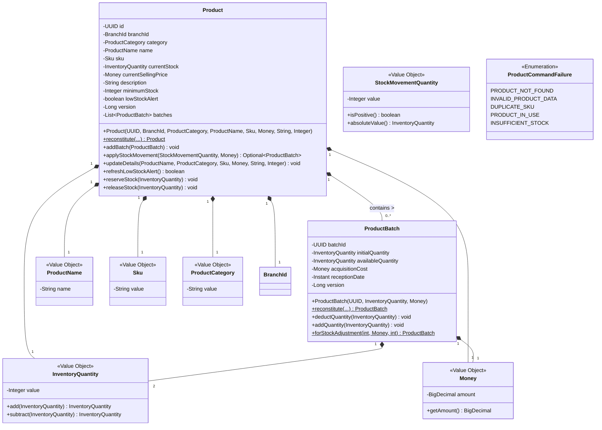
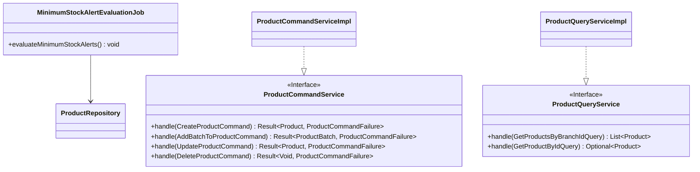
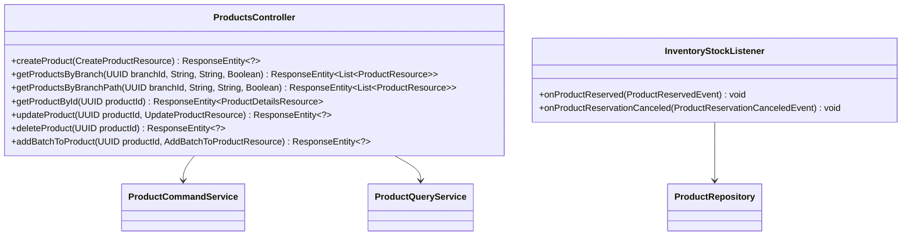
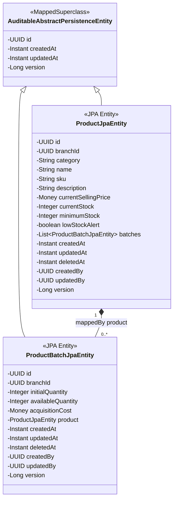
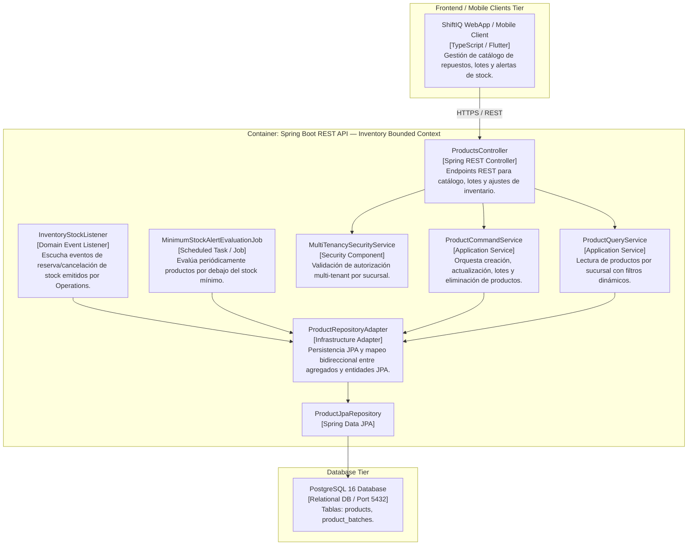
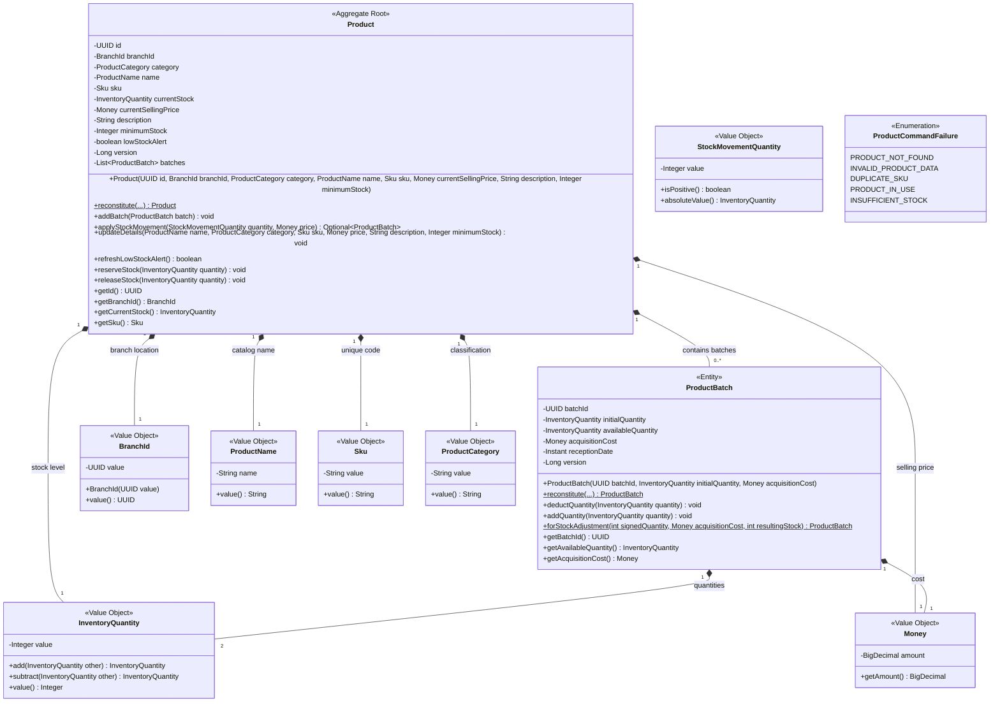
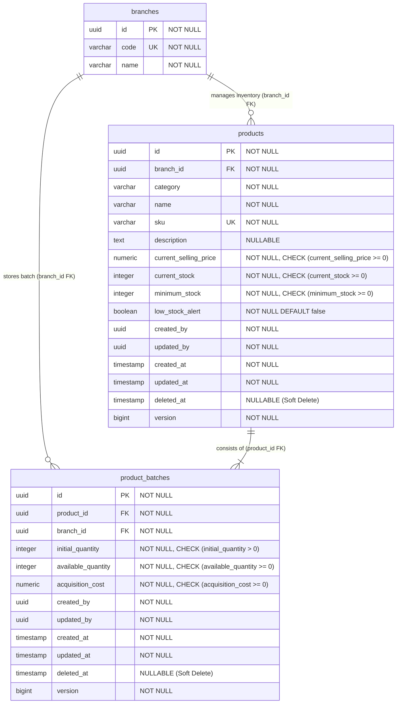

# Bounded Context Software Architecture & Domain Dictionary — Inventory (Stock & Products Management)

El **Bounded Context `Inventory`** administra el catálogo de repuestos, autopartes y consumibles del taller automotriz (`Product`), la gestión física de existencias mediante lotes de adquisición (`ProductBatch`), la evaluación automática de niveles de stock mínimo (`MinimumStockAlertEvaluationJob`), y la sincronización asíncrona de inventario respondiendo a las reservas y despachos producidos por las Órdenes de Trabajo del Bounded Context `Operations`.

---

## 1. Domain Layer (Capa de Dominio)

La Capa de Dominio define las reglas inmutables del inventario, gestionando el stock disponible, la deducción FIFO encapsulada en el agregado `Product`, los métodos de creación y reconstitución (patrón **Factory**), la activación de alertas de bajo stock y las validaciones de negocio sin dependencias tecnológicas externas.

---

### 1.1. Value Objects, Enums & Exceptions

#### 📌 Record: `BranchId(UUID value)`
* **Propósito:** Identificador único fuertemente tipado de la sucursal de taller asociada al inventario.
* **Validaciones:** No nulo.

#### 📌 Record: `Money(BigDecimal amount)`
* **Propósito:** Representa montos monetarios para precios de venta y costos de adquisición de lotes.
* **Validaciones:** `amount` no nulo y `>= 0`.
* **Métodos:** `getAmount()`.

#### 📌 Record: `ProductName(String name)`
* **Propósito:** Nombre comercial de la autoparte o repuesto.
* **Validaciones:** No puede ser nulo ni estar en blanco (`inventory.error.productName.required`).

#### 📌 Record: `Sku(String value)`
* **Propósito:** Stock Keeping Unit (código único de producto por sucursal).
* **Validaciones:** No puede ser nulo ni estar en blanco (`inventory.error.sku.required`).

#### 📌 Record: `ProductCategory(String value)`
* **Propósito:** Categoría o familia del producto (ej. "Frenos", "Filtros", "Lubricantes").
* **Validaciones:** No puede ser nulo ni estar en blanco (`inventory.error.productCategory.required`).

#### 📌 Record: `InventoryQuantity(Integer value)`
* **Propósito:** Cantidad entera no negativa en inventario.
* **Validaciones:** No nulo y `>= 0` (`inventory.error.quantity.invalid`).
* **Métodos:**
  * `add(InventoryQuantity)`: Suma cantidades.
  * `subtract(InventoryQuantity)`: Resta cantidades; lanza `IllegalArgumentException` si el resultado es negativo.

#### 📌 Record: `StockMovementQuantity(Integer value)`
* **Propósito:** Representa un movimiento o ajuste de inventario (positivo para ingresos, negativo para egresos).
* **Validaciones:** No nulo y distinto de cero.
* **Métodos:** `isPositive()`, `absoluteValue()`.

#### 📌 Enum: `ProductCommandFailure`
* **Valores:** `PRODUCT_NOT_FOUND`, `INVALID_PRODUCT_DATA`, `DUPLICATE_SKU`, `PRODUCT_IN_USE`, `INSUFFICIENT_STOCK`.

#### 📌 Excepción: `InsufficientStockException`
* Excepción de dominio lanzada cuando se intenta reservar o descontar más stock del disponible (`inventory.error.product.insufficientStock`).

---

### 1.2. Aggregates & Entities

#### 📌 Aggregate Root: `Product`
* **Hereda de:** `org.springframework.data.domain.AbstractAggregateRoot<Product>` (Spring Data).
* **Propósito:** Raíz del agregado que representa un producto del inventario en una sucursal (`BranchId`). Su clave primaria es un `UUID id` directo.
* **Reglas de Negocio:**
  * Mantiene la lista de lotes físicos recibidos (`batches`).
  * `reserveStock(InventoryQuantity amount)`: Lógica pura de negocio que recorre los lotes activos (`ProductBatch`) en estricto orden FIFO (`receptionDate` ascendente) descontando existencias. Lanza `InsufficientStockException` si `currentStock < amount`.
  * `releaseStock(InventoryQuantity amount)`: Reingresa existencias a los lotes en caso de cancelación de reserva.
  * `refreshLowStockAlert()`: Compara `currentStock <= minimumStock`. Si el estado de la alerta cambia, emite `LowStockAlertTriggeredEvent` o `LowStockAlertClearedEvent`.

#### 📌 Entity: `ProductBatch`
* **Propósito:** Entidad de dominio que representa un lote físico recibido con costo de adquisición y fecha de recepción. Su clave primaria es `UUID batchId`.
* **Atributos:** `batchId` (UUID), `initialQuantity` (InventoryQuantity), `availableQuantity` (InventoryQuantity), `acquisitionCost` (Money), `receptionDate` (Instant), `version` (Long).
* **Comportamiento:** `deductQuantity` y `addQuantity` actualizan `availableQuantity`.

---

### 1.3. Creation & Reconstitution Methods (Factory Pattern)

* **Constructor Público `Product(...)`**:
  * **Firma:** `public Product(UUID id, BranchId branchId, ProductCategory category, ProductName name, Sku sku, Money currentSellingPrice, String description, Integer minimumStock)`
  * **Comportamiento:** Si `id == null`, asigna `UUID.randomUUID()`. Inicializa `currentStock = 0`, `lowStockAlert = false` y emite `ProductCreatedEvent`.
* **`Product.reconstitute(...)`**:
  * **Firma:** `public static Product reconstitute(UUID id, BranchId branchId, ProductCategory category, ProductName name, Sku sku, InventoryQuantity currentStock, Money currentSellingPrice, String description, Integer minimumStock, boolean lowStockAlert, Long version, List<ProductBatch> batches)`
  * **Comportamiento:** Método Factory de reconstitución para reconstruir el Agregado desde la capa de infraestructura sin emitir eventos de creación.
* **`ProductBatch.forStockAdjustment(int signedQuantity, Money acquisitionCost, int resultingStock)`**:
  * **Firma:** `public static ProductBatch forStockAdjustment(int signedQuantity, Money acquisitionCost, int resultingStock)`
  * **Parámetros:** `signedQuantity` (cantidad del ajuste), `acquisitionCost` (costo de adquisición), `resultingStock` (saldo de stock resultante).
  * **Comportamiento:** Reconstituye un `ProductBatch` para ajustes manuales de almacén asignando `initialQuantity = 0` y `availableQuantity = resultingStock`.

---

### 1.4. Domain Events

* `ProductCreatedEvent`: Notifica la creación de un nuevo producto en una sucursal.
* `ProductUpdatedEvent`: Notifica la actualización de los datos del producto.
* `StockMovementAppliedEvent`: Notifica la aplicación de un movimiento de stock manual o lote.
* `StockReservedEvent`: Notifica la reserva exitosa de stock solicitada desde Operations.
* `StockReleasedEvent`: Notifica la liberación de stock previamente reservado.
* `LowStockAlertTriggeredEvent`: Notifica cuando el stock cae por debajo del mínimo configurado.
* `LowStockAlertClearedEvent`: Notifica cuando el stock se recupera por encima del mínimo.

---

### 1.6. Domain Repositories (Interfaces)

* `ProductRepository`:
  * `Product save(Product product)`
  * `Optional<Product> findById(UUID id)`
  * `List<Product> findAllByBranchId(BranchId branchId)`
  * `List<Product> findAllByBranchIdWithFilters(BranchId branchId, String name, String category, Boolean lowStockOnly)`
  * `List<Product> findAll()`
  * `boolean existsByBranchIdAndSku(BranchId branchId, String sku)`
  * `boolean existsByBranchIdAndSkuAndIdNot(BranchId branchId, String sku, UUID productId)`
  * `boolean existsById(UUID id)`
  * `void deleteById(UUID id)`

---

## 2. Application Layer (Capa de Aplicación)

La Capa de Aplicación expone la ejecución de casos de uso utilizando `Result<T, ProductCommandFailure>` para manejo funcional de fallos y ejecuta tareas programadas para la evaluación continua de alertas.

---

### 2.1. Commands & Queries (DTOs de Aplicación)

#### Commands
* 🟦 **`CreateProductCommand(BranchId branchId, ProductCategory category, ProductName name, Sku sku, String description, Money salePrice, InventoryQuantity minimumStock)`**
* 🟦 **`UpdateProductCommand(UUID productId, ProductName name, ProductCategory category, Sku sku, String description, Money salePrice, InventoryQuantity minimumStock)`**
* 🟦 **`DeleteProductCommand(UUID productId)`**
* 🟦 **`AddBatchToProductCommand(UUID productId, StockMovementQuantity quantity, Money acquisitionCost)`**

#### Queries
* 🟩 **`GetProductByIdQuery(UUID productId)`**
* 🟩 **`GetProductsByBranchIdQuery(BranchId branchId, String name, String category, Boolean lowStockOnly)`**

---

### 2.2. Capabilities & Scheduled Tasks

* **`MinimumStockAlertEvaluationJob`**:
  * **Tipo:** Capability / Proceso de fondo programado (`@Scheduled(cron = "0 0 * * * *")`).
  * **Responsabilidad:** Inspecciona el estado de existencias de todos los productos por sucursal en la base de datos, invocando directamente `product.refreshLowStockAlert()` en cada agregado para actualizar el indicador `lowStockAlert` y publicar eventos `LowStockAlertTriggeredEvent` cuando el stock disponible cae por debajo de la reserva mínima configurada.

---

## 3. Interface Layer (Capa de Interfaz / REST & Events)

Exposición RESTful e integración asíncrona mediante listeners de eventos producidos por otros Bounded Contexts.

---

### 3.1. Endpoints & REST Controllers

#### 📌 `ProductsController` (`/api/v1/inventory/products`)
* `POST /api/v1/inventory/products`: Registra un nuevo producto en el inventario de una sucursal.
* `GET /api/v1/inventory/products?branchId={branchId}`: Consulta productos por sucursal con filtros opcionales de búsqueda (`name`, `category`, `lowStockOnly`).
* `GET /api/v1/inventory/products/branch/{branchId}`: Catálogo de productos por ruta de sucursal.
* `GET /api/v1/inventory/products/{productId}`: Consulta detalles completos de un producto incluyendo sus lotes.
* `PUT /api/v1/inventory/products/{productId}`: Actualiza información básica del producto.
* `DELETE /api/v1/inventory/products/{productId}`: Eliminación lógica (soft-delete vía `deleted_at`) del producto y sus lotes.
* `POST /api/v1/inventory/products/{productId}/batches`: Registra la entrada de un nuevo lote de stock o un ajuste manual de almacén.

#### 📌 Event Listener: `InventoryStockListener`
* Escucha `ProductReservedEvent` proveniente de `Operations` e invoca `product.reserveStock(amount)`.
* Escucha `ProductReservationCanceledEvent` proveniente de `Operations` e invoca `product.releaseStock(amount)`.

---

## 4. Infrastructure Layer (Capa de Infraestructura)

Mapeo ORM relacional a PostgreSQL 16 con Spring Data JPA y configuración de Jobs programados con `@EnableScheduling`.

---

### 4.1. Mapeo de Entidades Relacionales (JPA)

* **`products`** (`ProductJpaEntity`):
  * `id` (UUID, PK, heredado de `AuditableAbstractPersistenceEntity`)
  * `branch_id` (UUID, NOT NULL)
  * `category` (VARCHAR, NOT NULL)
  * `name` (VARCHAR, NOT NULL)
  * `sku` (VARCHAR, NOT NULL)
  * `description` (TEXT)
  * `current_selling_price` (DECIMAL, `MoneyAttributeConverter`)
  * `current_stock` (INTEGER, NOT NULL)
  * `minimum_stock` (INTEGER, NOT NULL)
  * `low_stock_alert` (BOOLEAN, NOT NULL)
  * `deleted_at` (TIMESTAMP), `created_by` (UUID), `updated_by` (UUID)
  * `created_at`, `updated_at`, `version` (heredados de `AuditableAbstractPersistenceEntity`)
* **`product_batches`** (`ProductBatchJpaEntity`):
  * `id` (UUID, PK, heredado de `AuditableAbstractPersistenceEntity`)
  * `product_id` (UUID, FK, NOT NULL)
  * `branch_id` (UUID, NOT NULL)
  * `initial_quantity` (INTEGER, NOT NULL)
  * `available_quantity` (INTEGER, NOT NULL)
  * `acquisition_cost` (DECIMAL, `MoneyAttributeConverter`)
  * `deleted_at` (TIMESTAMP), `created_by` (UUID), `updated_by` (UUID)
  * `created_at`, `updated_at`, `version` (heredados de `AuditableAbstractPersistenceEntity`)

---

### 4.2. Repository Adapters & Infrastructure Components

#### 📌 `ProductRepositoryAdapter`
* **Implementa:** Interface de dominio `ProductRepository`.
* **Inyecta:** `ProductJpaRepository` (Spring Data JPA).
* **Responsabilidad:** Provee persistencia relacional con aislamiento total del modelo de dominio. Realiza el mapeo bidireccional entre los agregados de dominio (`Product`, `ProductBatch`) y las entidades de persistencia JPA (`ProductJpaEntity`, `ProductBatchJpaEntity`).
* **Métodos Implementados:**
  * `save(Product product)`: Mapea la raíz del agregado a `ProductJpaEntity` y sus lotes a `ProductBatchJpaEntity`, persistiendo ambas jerarquías en una sola transacción.
  * `findById(UUID id)`: Recupera la entidad JPA con sus lotes activos y reconstruye el Agregado de Dominio `Product`.
  * `findAllByBranchId(BranchId branchId)`: Recupera todos los productos de una sucursal.
  * `findAllByBranchIdWithFilters(BranchId branchId, String name, String category, Boolean lowStockOnly)`: Ejecuta búsquedas filtradas dinámicamente con criterios de bajo stock.
  * `existsByBranchIdAndSku(BranchId branchId, String sku)`: Verifica duplicidad de SKU.
  * `deleteById(UUID id)`: Realiza soft-delete seteando `deleted_at = Instant.now()`.

---

## 5. Software Architecture Component Level Diagrams (C4 Model - Level 3)

El siguiente diagrama C4 descompone el Container API en sus componentes principales para el Bounded Context **Inventory**.

### 5.2. Descomposición y Responsabilidad de Componentes

| Componente | Capa Architectural | Responsabilidad Técnica Principal | Tecnologías / Protocolos |
| :--- | :--- | :--- | :--- |
| **`ProductsController`** | Interface Layer | Expone los endpoints RESTful para la creación, consulta filtrada, actualización y eliminación de productos y registro de lotes. | Spring Web MVC, REST over HTTPS, Jackson JSON |
| **`InventoryStockListener`** | Interface Layer | Escucha asíncronamente eventos de dominio emitidos por `Operations` (`ProductReservedEvent`, `ProductReservationCanceledEvent`) e invoca reglas de reserva. | Spring Application Events / Domain Event Listener |
| **`MinimumStockAlertEvaluationJob`** | Application Layer | Capability programada en segundo plano que evalúa los umbrales de stock mínimo invocando `product.refreshLowStockAlert()`. | Spring Scheduled Tasks (`@Scheduled`), Spring Framework |
| **`ProductCommandService`** | Application Layer | Orquesta los comandos de creación, edición, borrado de productos y adición de lotes de inventario. | Spring Service (`@Service`), Functional `Result<T, E>` |
| **`ProductQueryService`** | Application Layer | Ejecuta consultas filtradas por sucursal, categoría y estado de alerta de bajo stock. | Spring Service (`@Service`), Read-only Transactions |
| **`ProductRepositoryAdapter`** | Infrastructure Layer | Adaptador de infraestructura que mapea agregados y entidades de dominio hacia/desde entidades relacionales JPA. | Spring Component (`@Component`), JPA Hibernate Mapping |
| **`ProductJpaRepository`** | Infrastructure Layer | Repositorio Spring Data JPA que interactúa directamente con PostgreSQL 16. | Spring Data JPA, Hibernate ORM, SQL Native Queries |

---

## 6. Code Level Diagrams

### 6.1. Domain Layer Class Diagram

---

### 6.2. PostgreSQL 16 Entity Relationship Diagram (ERD)

