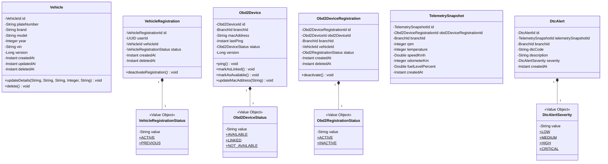
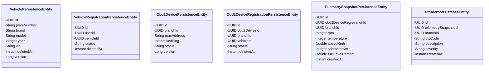
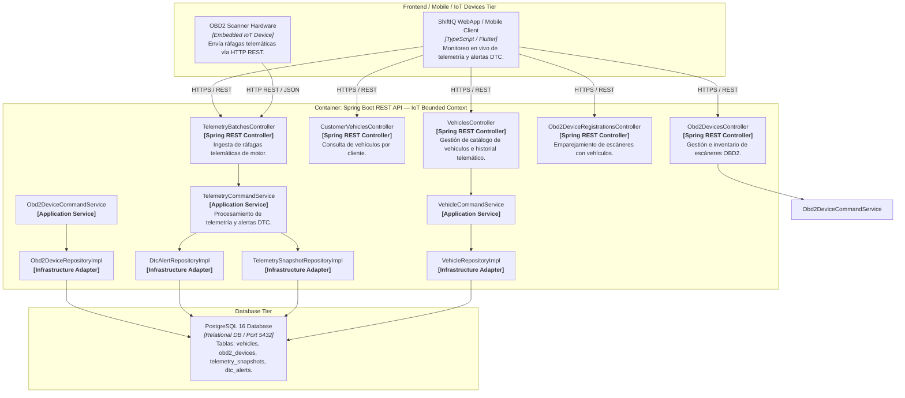
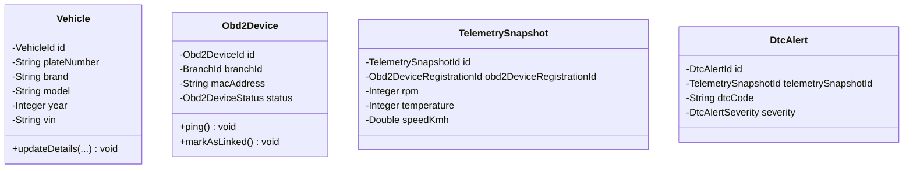
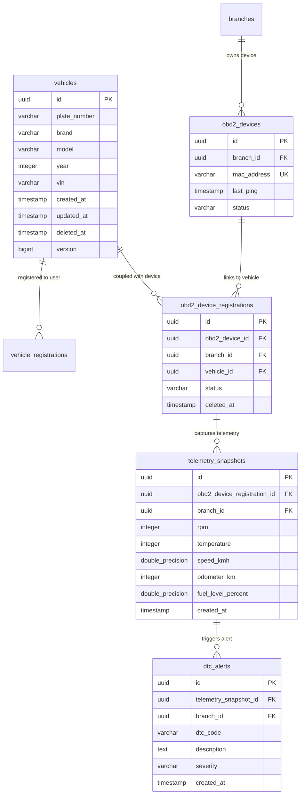

# Bounded Context Software Architecture & Domain Dictionary — IoT (Telemetry, Vehicles & OBD-II Devices)

El **Bounded Context `IoT`** administra la identidad telemática de los vehículos (`Vehicle`), la vinculación con sus conductores/propietarios (`VehicleRegistration`), el inventario y estado operativo de escáneres telemáticos OBD2 (`Obd2Device`), el emparejamiento activo entre escáneres y vehículos (`Obd2DeviceRegistration`), la ingesta remota de ráfagas telemáticas (`TelemetrySnapshot`), y la gestión inmutable de alertas por códigos de error computarizados (`DtcAlert` / Diagnostic Trouble Codes).

---

## 1. Domain Layer (Capa de Dominio)

La Capa de Dominio rige las reglas de lectura e ingesta telemática, constructores de dominio para la instanciación garantizada de Agregados (`Vehicle`, `Obd2Device`, `TelemetrySnapshot`), el servicio de contexto `ActiveRegistrationContextService`, la vinculación inmutable de dispositivos OBD2 con vehículos, las alertas automáticas según la gravedad de los códigos DTC (LOW, MEDIUM, HIGH, CRITICAL) y la validación de vin/placa vehicular.

---

### 1.1. Value Objects, Enums & Exceptions

#### 📌 Record Value Object: `Obd2DeviceStatus(String value)`
* **Valores Válidos:** `AVAILABLE`, `LINKED`, `NOT_AVAILABLE`.
* **Propósito:** Representa el estado de disponibilidad física de un escáner OBD2 en la sucursal.

#### 📌 Record Value Object: `Obd2RegistrationStatus(String value)`
* **Valores Válidos:** `ACTIVE`, `INACTIVE`.
* **Propósito:** Estado del acoplamiento entre un escáner OBD2 y un vehículo.

#### 📌 Record Value Object: `VehicleRegistrationStatus(String value)`
* **Valores Válidos:** `ACTIVE`, `PREVIOUS`.
* **Propósito:** Estado de la vinculación entre un usuario conductor y un vehículo.

#### 📌 Record Value Object: `DtcAlertSeverity(String value)`
* **Valores Válidos:** `LOW`, `MEDIUM`, `HIGH`, `CRITICAL`.
* **Propósito:** Severidad del código de error de diagnóstico telemático (Diagnostic Trouble Code).

---

### 1.2. Aggregates & Entities

#### 📌 Aggregate Root: `Vehicle`
* **Hereda de:** `AbstractDomainAggregateRoot<Vehicle>`
* **Propósito:** Agregado que representa un automóvil o vehículo del parque automotor.
* **Reglas de Negocio:**
  - Valida obligatoriedad de placa, marca, modelo, VIN y año (1900 a año actual + 1).
  - Emite `VehicleDetailsUpdatedEvent` al modificar sus especificaciones.

#### 📌 Aggregate Root: `VehicleRegistration`
* **Hereda de:** `AbstractDomainAggregateRoot<VehicleRegistration>`
* **Propósito:** Enlace entre un conductor (`userId`) y un vehículo (`vehicleId`).
* **Reglas de Negocio:**
  - `deactivateRegistration()`: Cambia el estado a `PREVIOUS`, marca `deletedAt` y emite `VehicleRegistrationDeactivatedEvent`.

#### 📌 Aggregate Root: `Obd2Device`
* **Hereda de:** `AbstractDomainAggregateRoot<Obd2Device>`
* **Propósito:** Dispositivo físico de diagnóstico telemático registrado en una sucursal (`BranchId`).
* **Reglas de Negocio:**
  - `ping()`: Actualiza el timestamp de última conexión (`lastPing`).
  - `markAsLinked()`: Transiciona a `LINKED` y emite `Obd2DeviceStatusChangedEvent`.
  - `markAsAvailable()`: Transiciona a `AVAILABLE`.

#### 📌 Aggregate Root: `Obd2DeviceRegistration`
* **Hereda de:** `AbstractDomainAggregateRoot<Obd2DeviceRegistration>`
* **Propósito:** Emparejamiento activo entre un escáner OBD2 y un vehículo en una sucursal.
* **Reglas de Negocio:**
  - `deactivate()`: Cambia estado a `INACTIVE`, marca `deletedAt` y emite `Obd2DeviceRegistrationDeactivatedEvent`.

#### 📌 Aggregate Root: `TelemetrySnapshot`
* **Hereda de:** `AbstractDomainAggregateRoot<TelemetrySnapshot>`
* **Propósito:** Captura puntual e inmutable de parámetros de motor (RPM, temperatura, velocidad km/h, odómetro, nivel de combustible %).

#### 📌 Aggregate Root: `DtcAlert`
* **Hereda de:** `AbstractDomainAggregateRoot<DtcAlert>`
* **Propósito:** Alerta de falla computarizada generada por el escáner (código DTC, descripción y severidad).
* **Reglas de Negocio:**
  - Al instanciarse durante la ingesta telemática, emite `DtcAlertTriggeredEvent`.

---

### 1.3. Domain Events

* `VehicleDetailsUpdatedEvent`: Notifica actualización de datos de un vehículo.
* `VehicleRegistrationDeactivatedEvent`: Notifica desvinculación de un conductor con un vehículo.
* `Obd2DeviceStatusChangedEvent`: Notifica cambios de estado de un escáner OBD2 (AVAILABLE / LINKED).
* `Obd2DeviceRegistrationDeactivatedEvent`: Notifica la desvinculación de un escáner OBD2 de un vehículo.
* `DtcAlertTriggeredEvent`: Notifica la detección de una falla telemática DTC en tiempo real.

---

### 1.4. Domain Repositories (Interfaces)

* `VehicleRepository`:
  * `Optional<Vehicle> findById(VehicleId id)`
  * `Vehicle save(Vehicle vehicle)`
  * `Optional<Vehicle> findByVin(String vin)`
  * `Optional<Vehicle> findByPlateNumber(String plateNumber)`
  * `void delete(VehicleId id)`
  * `List<Vehicle> findAllByIds(List<VehicleId> ids)`

* `VehicleRegistrationRepository`:
  * `VehicleRegistration save(VehicleRegistration registration)`
  * `Optional<VehicleRegistration> findActiveByVehicleId(VehicleId vehicleId)`
  * `List<VehicleRegistration> findAllActiveByUserId(UUID userId)`
  * `List<VehicleRegistration> findAllActiveByUserIds(List<UUID> userIds)`

* `Obd2DeviceRepository`:
  * `Obd2Device save(Obd2Device obd2Device)`
  * `Optional<Obd2Device> findById(Obd2DeviceId id)`
  * `Optional<Obd2Device> findByMacAddress(String macAddress)`
  * `boolean existsByMacAddress(String macAddress)`
  * `void delete(Obd2DeviceId id)`
  * `List<Obd2Device> findAllByBranchId(BranchId branchId)`
  * `List<Obd2Device> findAllByBranchIdAndStatus(BranchId branchId, Obd2DeviceStatus status)`

* `Obd2DeviceRegistrationRepository`:
  * `Obd2DeviceRegistration save(Obd2DeviceRegistration registration)`
  * `Optional<Obd2DeviceRegistration> findById(Obd2DeviceRegistrationId id)`
  * `Optional<Obd2DeviceRegistration> findActiveByObd2DeviceId(Obd2DeviceId obd2DeviceId)`
  * `Optional<Obd2DeviceRegistration> findActiveByVehicleId(VehicleId vehicleId)`
  * `List<Obd2DeviceRegistration> findAllByBranchIdAndStatus(BranchId branchId, Obd2RegistrationStatus status)`
  * `Set<VehicleId> findVehicleIdsWithActiveRegistration(List<VehicleId> vehicleIds)`

* `TelemetrySnapshotRepository`:
  * `TelemetrySnapshot save(TelemetrySnapshot telemetrySnapshot)`
  * `List<TelemetrySnapshot> saveAll(List<TelemetrySnapshot> telemetrySnapshots)`
  * `Optional<TelemetrySnapshot> findById(TelemetrySnapshotId id)`
  * `Optional<TelemetrySnapshot> findLatestByRegistrationId(Obd2DeviceRegistrationId registrationId)`
  * `List<TelemetrySnapshot> findAllByRegistrationId(Obd2DeviceRegistrationId registrationId)`
  * `List<TelemetrySnapshot> findAllByRegistrationId(Obd2DeviceRegistrationId registrationId, int page, int size)`
  * `List<TelemetrySnapshot> findAllByRegistrationIdAndCreatedAtGreaterThanEqual(Obd2DeviceRegistrationId registrationId, Instant startTimestamp)`
  * `List<TelemetrySnapshot> findAllByRegistrationIdAndCreatedAtGreaterThanEqual(Obd2DeviceRegistrationId registrationId, Instant startTimestamp, int page, int size)`

* `DtcAlertRepository`:
  * `DtcAlert save(DtcAlert dtcAlert)`
  * `List<DtcAlert> saveAll(List<DtcAlert> dtcAlerts)`
  * `List<DtcAlert> findAllByRegistrationId(Obd2DeviceRegistrationId registrationId)`
  * `List<DtcAlert> findAllByRegistrationId(Obd2DeviceRegistrationId registrationId, int page, int size)`
  * `List<DtcAlert> findAllByRegistrationIdAndCreatedAtGreaterThanEqual(Obd2DeviceRegistrationId registrationId, Instant startTimestamp)`
  * `List<DtcAlert> findAllByRegistrationIdAndCreatedAtGreaterThanEqual(Obd2DeviceRegistrationId registrationId, Instant startTimestamp, int page, int size)`

---

## 2. Application Layer (Capa de Aplicación)

La Capa de Aplicación expone la ingesta de telemetría, emparejamiento de escáneres y consulta de alertas de motor.

```mermaid
classDiagram
    direction TB

    class VehicleCommandService {
        <<Interface>>
        +handle(RegisterVehicleCommand) Result~VehicleRegistration, VehicleCommandFailure~
        +handle(UpdateVehicleCommand) Result~Vehicle, VehicleCommandFailure~
        +handle(DeleteVehicleCommand) Result~Void, VehicleCommandFailure~
    }

    class VehicleQueryService {
        <<Interface>>
        +handle(GetVehiclesAvailableForLinkingQuery) Result~List~Vehicle~, VehicleQueryFailure~
        +handle(GetActiveVehiclesByCustomerIdQuery) Result~List~Vehicle~, VehicleQueryFailure~
        +handle(GetVehicleByIdQuery) Result~Vehicle, VehicleQueryFailure~
    }

    class Obd2DeviceCommandService {
        <<Interface>>
        +handle(CreateObd2DeviceCommand) Result~Obd2Device, Obd2DeviceCommandFailure~
        +handle(DeleteObd2DeviceCommand) Result~Void, Obd2DeviceCommandFailure~
        +handle(UpdateObd2DeviceCommand) Result~Obd2Device, Obd2DeviceCommandFailure~
    }

    class Obd2DeviceQueryService {
        <<Interface>>
        +handle(GetObd2DeviceByIdQuery) Result~Obd2Device, Obd2DeviceQueryFailure~
        +handle(GetObd2DevicesByBranchIdQuery) Result~List~Obd2Device~, Obd2DeviceQueryFailure~
        +handle(GetAvailableObd2DevicesQuery) Result~List~Obd2Device~, Obd2DeviceQueryFailure~
    }

    class Obd2DeviceRegistrationCommandService {
        <<Interface>>
        +handle(LinkObd2DeviceToVehicleCommand) Result~Obd2DeviceRegistration, Obd2DeviceRegistrationCommandFailure~
        +handle(DeactivateObd2DeviceRegistrationCommand) Result~Obd2DeviceRegistration, Obd2DeviceRegistrationCommandFailure~
    }

    class Obd2DeviceRegistrationQueryService {
        <<Interface>>
        +handle(GetObd2DeviceRegistrationsByBranchIdAndStatusQuery) Result~List~Obd2DeviceRegistration~, Obd2DeviceRegistrationQueryFailure~
    }

    class TelemetryCommandService {
        <<Interface>>
        +handle(IngestTelemetryBatchCommand) Result~List~TelemetrySnapshot~, TelemetryCommandFailure~
    }

    class TelemetryQueryService {
        <<Interface>>
        +handle(GetLatestTelemetrySnapshotQuery) Result~TelemetrySnapshot, TelemetryQueryFailure~
        +handle(GetTelemetrySnapshotHistoryQuery) Result~List~TelemetrySnapshot~, TelemetryQueryFailure~
        +handle(GetTelemetrySnapshotsByRegistrationIdQuery) Result~List~TelemetrySnapshot~, TelemetryQueryFailure~
        +handle(GetVehicleTelemetrySnapshotHistoryQuery) Result~List~TelemetrySnapshot~, TelemetryQueryFailure~
    }

    class DtcAlertQueryService {
        <<Interface>>
        +handle(GetDtcAlertsByRegistrationIdQuery) Result~List~DtcAlert~, DtcAlertQueryFailure~
        +handle(GetVehicleDtcAlertHistoryQuery) Result~List~DtcAlert~, DtcAlertQueryFailure~
    }
```

---

### 2.1. Commands & Queries (DTOs de Aplicación)

#### Commands
* 🟦 **`RegisterVehicleCommand(UUID userId, String plateNumber, String brand, String model, Integer year, String vin)`**
* 🟦 **`UpdateVehicleCommand(UUID id, String plateNumber, String brand, String model, Integer year, String vin)`**
* 🟦 **`DeleteVehicleCommand(VehicleId vehicleId)`**
* 🟦 **`CreateObd2DeviceCommand(BranchId branchId, String macAddress)`**
* 🟦 **`UpdateObd2DeviceCommand(Obd2DeviceId id, String macAddress)`**
* 🟦 **`DeleteObd2DeviceCommand(Obd2DeviceId obd2DeviceId)`**
* 🟦 **`LinkObd2DeviceToVehicleCommand(Obd2DeviceId obd2DeviceId, BranchId branchId, VehicleId vehicleId)`**
* 🟦 **`DeactivateObd2DeviceRegistrationCommand(Obd2DeviceRegistrationId registrationId)`**
* 🟦 **`IngestTelemetryBatchCommand(Obd2DeviceId obd2DeviceId, List<TelemetrySnapshotData> snapshots)`**

#### Queries
* 🟩 **`GetVehicleByIdQuery(VehicleId vehicleId)`**
* 🟩 **`GetActiveVehiclesByCustomerIdQuery(CustomerId customerId)`**
* 🟩 **`GetVehiclesAvailableForLinkingQuery(BranchId branchId)`**
* 🟩 **`GetObd2DeviceByIdQuery(Obd2DeviceId obd2DeviceId)`**
* 🟩 **`GetObd2DevicesByBranchIdQuery(BranchId branchId)`**
* 🟩 **`GetAvailableObd2DevicesQuery(BranchId branchId)`**
* 🟩 **`GetObd2DeviceRegistrationsByBranchIdAndStatusQuery(BranchId branchId, Obd2RegistrationStatus status)`**
* 🟩 **`GetLatestTelemetrySnapshotQuery(Obd2DeviceId obd2DeviceId)`**
* 🟩 **`GetTelemetrySnapshotHistoryQuery(Obd2DeviceRegistrationId registrationId)`**
* 🟩 **`GetTelemetrySnapshotsByRegistrationIdQuery(Obd2DeviceRegistrationId registrationId, int page, int size)`**
* 🟩 **`GetVehicleTelemetrySnapshotHistoryQuery(VehicleId vehicleId, int page, int size)`**
* 🟩 **`GetDtcAlertsByRegistrationIdQuery(Obd2DeviceRegistrationId registrationId, int page, int size)`**
* 🟩 **`GetVehicleDtcAlertHistoryQuery(VehicleId vehicleId, int page, int size)`**

---

### 2.2. Command Failure ADTs (Sealed Interfaces)

Los fallos de comandos en `IoT` se representan mediante **Sealed Interfaces** con variantes de registros anidados (`NotFound`, `InvalidState`, `Duplicate`, etc.):

* **`VehicleCommandFailure`**: `NotFound(String message)`, `InvalidState(String message)`, `Duplicate(String message)`
* **`Obd2DeviceCommandFailure`**: `NotFound(String message)`, `InvalidState(String message)`, `Duplicate(String message)`
* **`Obd2DeviceRegistrationCommandFailure`**: `NotFound(String message)`, `InvalidState(String message)`
* **`TelemetryCommandFailure`**: `NotFound(String message)`, `InvalidState(String message)`

---

## 3. Interface Layer (Capa de Interfaz / REST)

Exposición RESTful para ingesta telemática, alertas de motor y catálogo de vehículos.

```mermaid
classDiagram
    direction TB

    class VehiclesController {
        +getVehicles(UUID branchId, String status) ResponseEntity~?~
        +getVehicleById(UUID id) ResponseEntity~?~
        +registerVehicle(RegisterVehicleResource) ResponseEntity~?~
        +updateVehicle(UUID id, UpdateVehicleResource) ResponseEntity~?~
        +deleteVehicle(UUID id) ResponseEntity~?~
        +getVehicleTelemetrySnapshots(UUID vehicleId, int page, int size) ResponseEntity~?~
        +getVehicleDtcAlerts(UUID vehicleId, int page, int size) ResponseEntity~?~
    }

    class CustomerVehiclesController {
        +getActiveVehiclesByCustomerId(UUID customerId) ResponseEntity~?~
    }

    class Obd2DevicesController {
        +createObd2Device(CreateObd2DeviceResource) ResponseEntity~?~
        +getObd2DeviceById(UUID id) ResponseEntity~?~
        +deleteObd2Device(UUID id) ResponseEntity~?~
        +updateObd2Device(UUID id, UpdateObd2DeviceResource) ResponseEntity~?~
        +getObd2Devices(UUID branchId, String status) ResponseEntity~?~
        +getLatestTelemetrySnapshot(UUID id) ResponseEntity~?~
        +getTelemetrySnapshotHistory(UUID id) ResponseEntity~?~
    }

    class Obd2DeviceRegistrationsController {
        +linkObd2Device(LinkObd2DeviceResource) ResponseEntity~?~
        +updateObd2DeviceRegistrationStatus(UUID id, UpdateObd2DeviceRegistrationStatusResource) ResponseEntity~?~
        +getObd2DeviceRegistrations(UUID branchId, String status) ResponseEntity~?~
        +getTelemetrySnapshotsForRegistration(UUID id, int page, int size) ResponseEntity~?~
        +getDtcAlertsForRegistration(UUID id, int page, int size) ResponseEntity~?~
    }

    class TelemetryBatchesController {
        +ingestTelemetryBatch(IngestTelemetryBatchResource) ResponseEntity~?~
    }

    VehiclesController --> VehicleCommandService
    VehiclesController --> VehicleQueryService
    VehiclesController --> TelemetryQueryService
    VehiclesController --> DtcAlertQueryService
    CustomerVehiclesController --> VehicleQueryService
    Obd2DevicesController --> Obd2DeviceCommandService
    Obd2DevicesController --> Obd2DeviceQueryService
    Obd2DevicesController --> TelemetryQueryService
    Obd2DeviceRegistrationsController --> Obd2DeviceRegistrationCommandService
    Obd2DeviceRegistrationsController --> Obd2DeviceRegistrationQueryService
    Obd2DeviceRegistrationsController --> TelemetryQueryService
    Obd2DeviceRegistrationsController --> DtcAlertQueryService
    TelemetryBatchesController --> TelemetryCommandService
```

---

### 3.1. Endpoints & REST Controllers

#### 📌 `VehiclesController` (`/api/v1/vehicles`)
* `GET /api/v1/vehicles?branchId={branchId}&status=available-for-linking`: Consulta catálogo de vehículos disponibles para vinculación en la sucursal.
* `GET /api/v1/vehicles/{id}`: Obtiene el detalle de un vehículo por su ID.
* `POST /api/v1/vehicles`: Registra un nuevo vehículo y lo vincula al usuario autenticado.
* `PUT /api/v1/vehicles/{id}`: Actualiza especificaciones técnicas del vehículo.
* `DELETE /api/v1/vehicles/{id}`: Eliminación lógica (soft delete) del vehículo y desactivación de enlaces.
* `GET /api/v1/vehicles/{vehicleId}/telemetry-snapshots`: Consulta historial telemático del vehículo con paginación (`page`, `size`).
* `GET /api/v1/vehicles/{vehicleId}/dtc-alerts`: Consulta historial de alertas DTC de motor con paginación (`page`, `size`).

#### 📌 `CustomerVehiclesController` (`/api/v1/customers/{customerId}/vehicles`)
* `GET /api/v1/customers/{customerId}/vehicles`: Consulta los vehículos activos pertenecientes a un cliente.

#### 📌 `Obd2DevicesController` (`/api/v1/obd2-devices`)
* `POST /api/v1/obd2-devices`: Registra un nuevo escáner OBD2 en una sucursal.
* `GET /api/v1/obd2-devices/{id}`: Obtiene detalle del escáner por su ID.
* `DELETE /api/v1/obd2-devices/{id}`: Elimina un escáner OBD2 por su ID.
* `PUT /api/v1/obd2-devices/{id}`: Actualiza la dirección MAC del escáner.
* `GET /api/v1/obd2-devices?branchId={branchId}&status={status}`: Lista escáneres por sucursal y estado.
* `GET /api/v1/obd2-devices/{id}/telemetry-snapshots/latest`: Obtiene la última captura telemática transmitida por el dispositivo.
* `GET /api/v1/obd2-devices/{id}/telemetry-snapshots`: Obtiene el historial telemático transmitido por el dispositivo.

#### 📌 `Obd2DeviceRegistrationsController` (`/api/v1/obd2-device-registrations`)
* `POST /api/v1/obd2-device-registrations`: Vincula un escáner OBD2 a un vehículo en una sucursal.
* `PATCH /api/v1/obd2-device-registrations/{id}`: Desactiva/desvincula la registración activa (usando `status=INACTIVE`).
* `GET /api/v1/obd2-device-registrations?branchId={branchId}&status={status}`: Lista registraciones por sucursal y estado.
* `GET /api/v1/obd2-device-registrations/{id}/telemetry-snapshots`: Obtiene capturas telemáticas de la registración con paginación.
* `GET /api/v1/obd2-device-registrations/{id}/dtc-alerts`: Obtiene alertas DTC registradas para la registración.

#### 📌 `TelemetryBatchesController` (`/api/v1/telemetry-batches`)
* `POST /api/v1/telemetry-batches`: Endpoint de ingesta masiva telemática usado por los dispositivos hardware OBD2.

---

## 4. Infrastructure Layer (Capa de Infraestructura)

Mapeo relacional JPA a PostgreSQL 16 con adaptadores de repositorio, ensambladores de persistencia y listeners de eventos de dominio.

---

### 4.1. Mapeo de Entidades Relacionales (JPA)

* **`vehicles`** (`VehiclePersistenceEntity`):
  * `id` (UUID, PK, heredado de `AuditableAbstractPersistenceEntity`)
  * `plate_number` (VARCHAR(20), NOT NULL)
  * `brand` (VARCHAR(50), NOT NULL)
  * `model` (VARCHAR(50), NOT NULL)
  * `year` (INTEGER, NOT NULL)
  * `vin` (VARCHAR(50), NOT NULL)
  * `deleted_at` (TIMESTAMP)
  * `created_at`, `updated_at`, `version` (heredados)
* **`vehicle_registrations`** (`VehicleRegistrationPersistenceEntity`):
  * `id` (UUID, PK, heredado de `AuditableAbstractPersistenceEntity`)
  * `user_id` (UUID, NOT NULL)
  * `vehicle_id` (UUID, NOT NULL)
  * `status` (VARCHAR(20), NOT NULL)
  * `deleted_at` (TIMESTAMP)
* **`obd2_devices`** (`Obd2DevicePersistenceEntity`):
  * `id` (UUID, PK, heredado de `AuditableAbstractPersistenceEntity`)
  * `branch_id` (UUID, NOT NULL)
  * `mac_address` (VARCHAR(50), NOT NULL, UNIQUE)
  * `last_ping` (TIMESTAMP)
  * `status` (VARCHAR(20), NOT NULL)
* **`obd2_device_registrations`** (`Obd2DeviceRegistrationPersistenceEntity`):
  * `id` (UUID, PK, heredado de `AuditableAbstractPersistenceEntity`)
  * `obd2_device_id` (UUID, NOT NULL)
  * `branch_id` (UUID, NOT NULL)
  * `vehicle_id` (UUID, NOT NULL)
  * `status` (VARCHAR(20), NOT NULL)
  * `deleted_at` (TIMESTAMP)
* **`telemetry_snapshots`** (`TelemetrySnapshotPersistenceEntity`):
  * `id` (UUID, PK)
  * `obd2_device_registration_id` (UUID, NOT NULL)
  * `branch_id` (UUID, NOT NULL)
  * `rpm` (INTEGER), `temperature` (INTEGER), `speed_kmh` (DOUBLE PRECISION), `odometer_km` (INTEGER), `fuel_level_percent` (DOUBLE PRECISION)
  * `created_at` (TIMESTAMP)
* **`dtc_alerts`** (`DtcAlertPersistenceEntity`):
  * `id` (UUID, PK)
  * `telemetry_snapshot_id` (UUID, NOT NULL)
  * `branch_id` (UUID, NOT NULL)
  * `dtc_code` (VARCHAR(20), NOT NULL)
  * `description` (TEXT)
  * `severity` (VARCHAR(20), NOT NULL)
  * `created_at` (TIMESTAMP)

---

### 4.2. Adapters & Infrastructure Components

* **Persistence Adapters:** `VehicleRepositoryImpl`, `VehicleRegistrationRepositoryImpl`, `Obd2DeviceRepositoryImpl`, `Obd2DeviceRegistrationRepositoryImpl`, `TelemetrySnapshotRepositoryImpl`, `DtcAlertRepositoryImpl`.
* **Assemblers de Persistencia:** `VehiclePersistenceAssembler`, `VehicleRegistrationPersistenceAssembler`, `Obd2DevicePersistenceAssembler`, `Obd2DeviceRegistrationPersistenceAssembler`, `TelemetrySnapshotPersistenceAssembler`, `DtcAlertPersistenceAssembler`.
* **Outbound Services / Ports:** `CustomerDirectoryPortImpl` (ACL para validación de clientes en `Core`), `ActiveRegistrationContextServiceImpl` (resolución de contexto activo de escáner a vehículo).
* **Event Listeners:** `DtcAlertEventListener` (escucha `DtcAlertTriggeredEvent` para notificaciones o integración con Órdenes de Trabajo).

---

## 5. Software Architecture Component Level Diagrams (C4 Model - Level 3)

Descomposición del Container API en sus componentes principales para el Bounded Context **IoT**.

---

## 6. Code Level Diagrams

### 6.1. Domain Layer Class Diagram

---

### 6.2. PostgreSQL 16 Entity Relationship Diagram (ERD)

