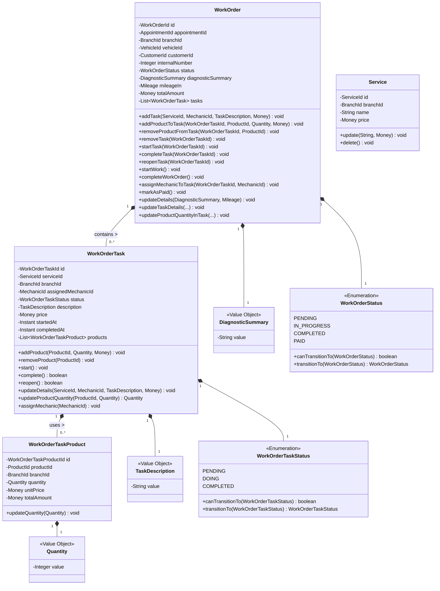
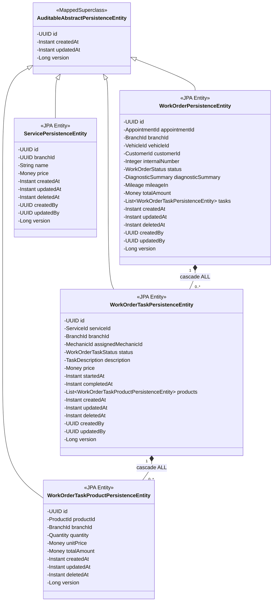
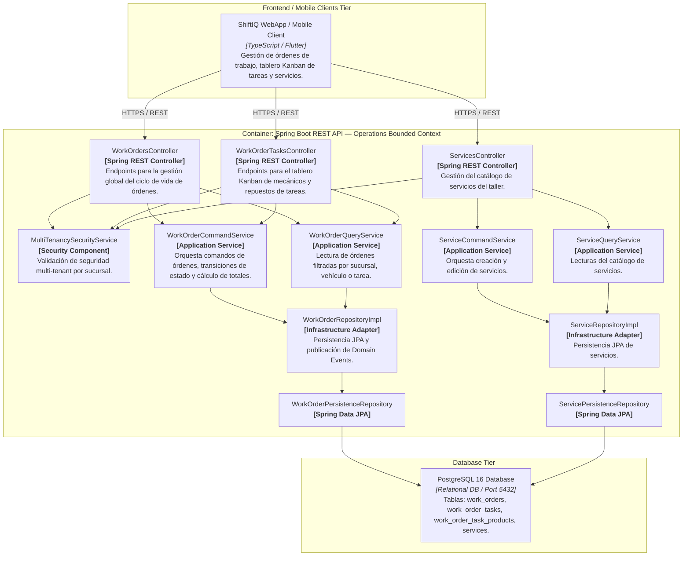
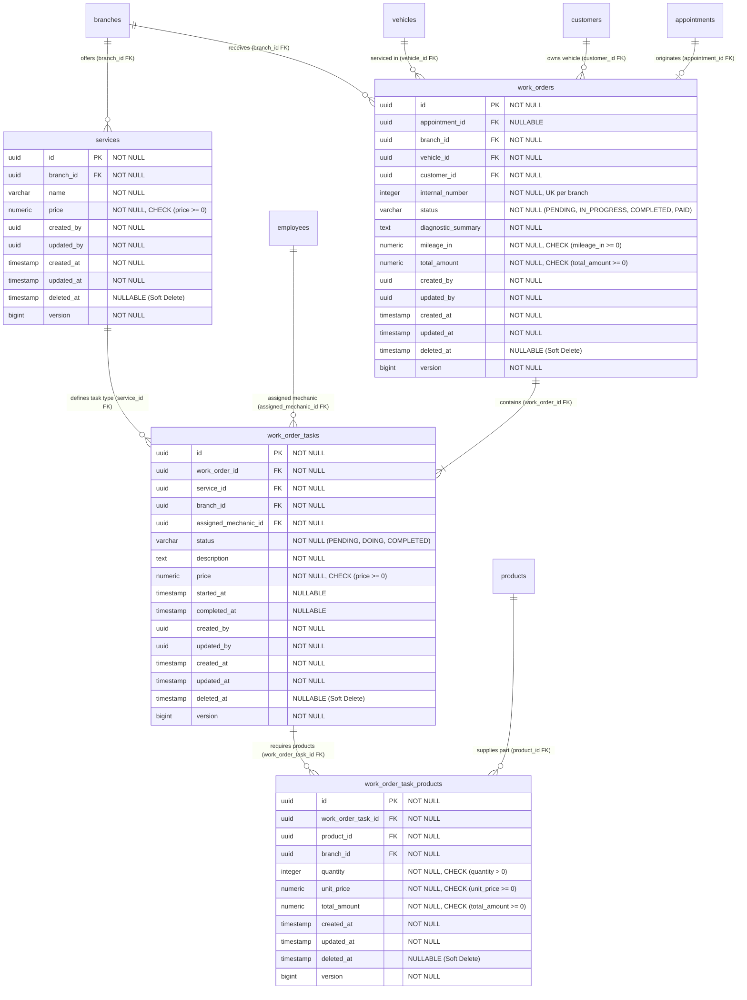

# Bounded Context Software Architecture & Domain Dictionary — Operations (Work Orders & Services)

El **Bounded Context `Operations`** es el motor operativo principal de la plataforma **ShiftIQ**. Gestiona el flujo de trabajo completo del taller automotriz: desde la definición del catálogo de servicios ofreciendo precios y mantenimiento (`Service`), la emisión y control del ciclo de vida de Órdenes de Trabajo (`WorkOrder`), la orquestación de tareas asignadas a mecánicos (`WorkOrderTask`), hasta el consumo y reserva de repuestos/productos de inventario (`WorkOrderTaskProduct`).

---

## 1. Domain Layer (Capa de Dominio)

La Capa de Dominio encapsula el modelo de negocio inmutable, asegurando transiciones estrictas de estado para las órdenes de trabajo y tareas mediante métodos **Factory**, reglas de negocio encapsuladas en el Agregado `WorkOrder`, el cálculo dinámico de costos y la emisión de eventos de dominio.

---

### 1.1. Value Objects, Enums & Command Failures

#### 📌 Record: `DiagnosticSummary(String value)`
* **Propósito:** Resumen del diagnóstico técnico de recepción del vehículo.
* **Validaciones:**
  * No puede ser nulo ni estar en blanco (`operations.error.diagnosticSummary.notBlank`).
  * Longitud máxima: 2000 caracteres (`operations.error.diagnosticSummary.tooLong`).

#### 📌 Record: `TaskDescription(String value)`
* **Propósito:** Instrucciones detalladas de trabajo enviadas al mecánico.
* **Validaciones:**
  * No puede ser nulo ni estar en blanco (`operations.error.taskDescription.required`).
  * Longitud mínima: 10 caracteres (`operations.error.taskDescription.tooShort`).
  * Longitud máxima: 1000 caracteres (`operations.error.taskDescription.tooLong`).

#### 📌 Record: `Quantity(Integer value)`
* **Propósito:** Cantidad entera de productos/repuestos consumidos en una tarea.
* **Validaciones:** No puede ser nulo y debe ser estrictamente mayor a cero (`operations.error.quantity.required`, `operations.error.quantity.mustBeGreaterThanZero`).

#### 📌 Enum: `WorkOrderStatus`
* **Valores:** `PENDING`, `IN_PROGRESS`, `COMPLETED`, `PAID`.
* **Métodos:**
  * `canTransitionTo(WorkOrderStatus next)`: Evalúa la validez del cambio de estado.
  * `transitionTo(WorkOrderStatus next)`: Aplica la transición o lanza `IllegalStateException` si es inválida.
* **Reglas de Transición Inmutables:**
  * `PENDING` ➔ `IN_PROGRESS`
  * `IN_PROGRESS` ➔ `COMPLETED`
  * `COMPLETED` ➔ `PAID` o `IN_PROGRESS` (si se reabre una tarea)
  * `PAID` ➔ Estado final inmutable (retorna `false` para cualquier cambio).

#### 📌 Enum: `WorkOrderTaskStatus`
* **Valores:** `PENDING`, `DOING`, `COMPLETED`.
* **Métodos:**
  * `canTransitionTo(WorkOrderTaskStatus next)`: Evalúa la validez del cambio de estado.
  * `transitionTo(WorkOrderTaskStatus next)`: Aplica la transición o lanza `IllegalStateException` si es inválida.
* **Reglas de Transición:**
  * `PENDING` ➔ `DOING`
  * `DOING` ➔ `COMPLETED`
  * `COMPLETED` ➔ `DOING` (reapertura)

#### 📌 Sealed Failures ADT: `WorkOrderCommandFailure`
* **Definición:** Sealed Interface (`permits NotFound, InvalidState, Duplicate`).
* **Variantes:**
  * `NotFound(String message)`
  * `InvalidState(String message)`
  * `Duplicate(String message)`

#### 📌 Sealed Failures ADT: `ServiceCommandFailure`
* **Definición:** Sealed Interface (`permits NotFound, InvalidData`).
* **Variantes:**
  * `NotFound(String message)`
  * `InvalidData(String message)`

#### 📌 Identificadores Fuertemente Tipados (Strongly Typed IDs)
* **Propios de Operations:** `WorkOrderId`, `WorkOrderTaskId`, `WorkOrderTaskProductId`, `ServiceId`, `MechanicId`, `AppointmentId`, `ProductId`.
* **Compartidos (`shared`):** `BranchId`, `VehicleId`, `CustomerId`, `Money`, `Mileage`.

---

### 1.2. Aggregates & Entities

#### 📌 Aggregate: `WorkOrder`
* **Hereda de:** `AbstractDomainAggregateRoot<WorkOrder>`
* **Propósito:** Raíz de agregado que representa una Orden de Trabajo completa.
* **Reglas de Negocio:**
  * Si la orden está en estado `COMPLETED` o `PAID`, no permite agregar, modificar ni eliminar tareas ni productos (`WORK_ORDER_CANNOT_MODIFY_CLOSED`).
  * Si está en `PAID`, no permite reapertura ni eliminación (`WORK_ORDER_CANNOT_DELETE_PAID`, `WORK_ORDER_CANNOT_REOPEN_PAID`).
  * Recalcula automáticamente su `totalAmount` como la suma de los precios de todas sus tareas activas (mano de obra + repuestos).
  * Emite eventos de reserva y cancelación de stock para el contexto de Inventario.

#### 📌 Entity: `WorkOrderTask`
* **Propósito:** Entidad que representa una tarea individual dentro de la orden de trabajo.
* **Reglas de Negocio:**
  * Si la tarea está `COMPLETED`, se bloquea cualquier modificación directa (`TASK_CANNOT_MODIFY_COMPLETED`).
  * Mantiene su propio costo total (`price`), calculado sumando el costo de mano de obra inicial con los montos totales de repuestos asignados (`WorkOrderTaskProduct`).

#### 📌 Entity: `WorkOrderTaskProduct`
* **Propósito:** Entidad que representa un repuesto/producto de inventario consumido en una tarea.
* **Reglas de Negocio:** Calcula `totalAmount = unitPrice * quantity`.

#### 📌 Aggregate: `Service`
* **Hereda de:** `AbstractDomainAggregateRoot<Service>`
* **Propósito:** Representa un servicio ofrecido en el catálogo del taller (ej. "Cambio de Aceite Synthetic 5W-30").

---

### 1.3. Domain Events

* **Propios de Operations:**
  * `TaskStartedEvent`: Emitido al iniciar el trabajo físico de una tarea.
  * `TaskCompletedEvent`: Emitido cuando un mecánico completa una tarea.
  * `TaskReopenedEvent`: Emitido al reabrir una tarea completada.
  * `WorkOrderCompletedEvent`: Emitido cuando todas las tareas finalizan y la orden pasa a `COMPLETED`.
  * `WorkOrderPaidEvent`: Emitido al marcar la orden como `PAID`, notificando el despacho final de inventario.
* **Compartidos (`shared`) emitidos por Operations:**
  * `ProductReservedEvent`: Notifica a Inventario para reservar stock al agregar productos a una tarea.
  * `ProductReservationCanceledEvent`: Notifica a Inventario para liberar stock reservado al remover productos o tareas.

---

### 1.4. Domain Repositories (Interfaces)

* `WorkOrderRepository`:
  * `WorkOrder save(WorkOrder workOrder)`
  * `Optional<WorkOrder> findById(WorkOrderId id)`
  * `Optional<WorkOrder> findByTaskId(WorkOrderTaskId taskId)`
  * `List<WorkOrder> findAllByBranchId(BranchId branchId)`
  * `Optional<WorkOrder> findByAppointmentId(AppointmentId appointmentId)`
  * `boolean existsByAppointmentId(AppointmentId appointmentId)`
  * `List<WorkOrder> findAllByCustomerId(CustomerId customerId)`
  * `List<WorkOrder> findAllByVehicleId(VehicleId vehicleId)`
  * `Optional<WorkOrder> findByInternalNumberAndBranchId(Integer internalNumber, BranchId branchId)`
  * `int findMaxInternalNumberByBranchId(BranchId branchId)`
* `ServiceRepository`:
  * `Service save(Service service)`
  * `Optional<Service> findById(ServiceId id)`
  * `List<Service> findAllByBranchId(BranchId branchId)`
  * `void delete(Service service)`

---

## 2. Application Layer (Capa de Aplicación)

```mermaid
classDiagram
    direction TB

    class WorkOrderCommandService {
        <<Interface>>
        +handle(CreateWorkOrderCommand) Result~WorkOrder, WorkOrderCommandFailure~
        +handle(AddTaskToWorkOrderCommand) Result~WorkOrder, WorkOrderCommandFailure~
        +handle(AddProductToTaskCommand) Result~WorkOrder, WorkOrderCommandFailure~
        +handle(RemoveProductFromTaskCommand) Result~WorkOrder, WorkOrderCommandFailure~
        +handle(RemoveTaskFromWorkOrderCommand) Result~WorkOrder, WorkOrderCommandFailure~
        +handle(StartTaskCommand) Result~WorkOrder, WorkOrderCommandFailure~
        +handle(CompleteTaskCommand) Result~WorkOrder, WorkOrderCommandFailure~
        +handle(ReopenTaskCommand) Result~WorkOrder, WorkOrderCommandFailure~
        +handle(MarkWorkOrderAsPaidCommand) Result~WorkOrder, WorkOrderCommandFailure~
        +handle(UpdateWorkOrderDetailsCommand) Result~WorkOrder, WorkOrderCommandFailure~
        +handle(UpdateWorkOrderTaskDetailsCommand) Result~WorkOrder, WorkOrderCommandFailure~
        +handle(UpdateProductQuantityInTaskCommand) Result~WorkOrder, WorkOrderCommandFailure~
        +handle(DeleteWorkOrderCommand) Result~WorkOrder, WorkOrderCommandFailure~
        +handle(CompleteWorkOrderCommand) Result~WorkOrder, WorkOrderCommandFailure~
        +handle(AssignMechanicToTaskCommand) Result~WorkOrder, WorkOrderCommandFailure~
    }

    class WorkOrderQueryService {
        <<Interface>>
        +handle(GetWorkOrderByIdQuery) Optional~WorkOrder~
        +handle(GetWorkOrderByTaskIdQuery) Optional~WorkOrder~
        +handle(GetWorkOrdersByBranchIdQuery) List~WorkOrder~
        +handle(GetWorkOrdersByVehicleIdQuery) List~WorkOrder~
        +getBranchCode(UUID branchId) String
    }

    class ServiceCommandService {
        <<Interface>>
        +handle(CreateServiceCommand) Result~Service, ServiceCommandFailure~
        +handle(UpdateServiceCommand) Result~Service, ServiceCommandFailure~
        +handle(DeleteServiceCommand) Result~UUID, ServiceCommandFailure~
    }

    class ServiceQueryService {
        <<Interface>>
        +handle(GetServiceByIdQuery) Optional~Service~
        +handle(GetAllServicesByBranchIdQuery) List~Service~
    }

    WorkOrderCommandServiceImpl ..|> WorkOrderCommandService
    WorkOrderQueryServiceImpl ..|> WorkOrderQueryService
    ServiceCommandServiceImpl ..|> ServiceCommandService
    ServiceQueryServiceImpl ..|> ServiceQueryService
```

La Capa de Aplicación expone la ejecución de casos de uso mediante un contrato genérico `Result<WorkOrder, WorkOrderCommandFailure>`, garantizando un manejo funcional de errores sin excepciones no controladas.

---

### 2.1. Commands & Queries (DTOs de Aplicación)

#### Commands
* 🟦 **`CreateWorkOrderCommand(AppointmentId appointmentId, BranchId branchId, VehicleId vehicleId, CustomerId customerId, DiagnosticSummary diagnosticSummary, Mileage mileageIn)`**
* 🟦 **`AddTaskToWorkOrderCommand(WorkOrderId workOrderId, ServiceId serviceId, MechanicId mechanicId, TaskDescription description)`**
* 🟦 **`AddProductToTaskCommand(WorkOrderId workOrderId, WorkOrderTaskId taskId, ProductId productId, Quantity quantity)`**
* 🟦 **`RemoveProductFromTaskCommand(WorkOrderId workOrderId, WorkOrderTaskId taskId, ProductId productId)`**
* 🟦 **`RemoveTaskFromWorkOrderCommand(WorkOrderId workOrderId, WorkOrderTaskId taskId)`**
* 🟦 **`StartTaskCommand(WorkOrderId workOrderId, WorkOrderTaskId taskId)`**
* 🟦 **`CompleteTaskCommand(WorkOrderId workOrderId, WorkOrderTaskId taskId)`**
* 🟦 **`ReopenTaskCommand(WorkOrderId workOrderId, WorkOrderTaskId taskId)`**
* 🟦 **`MarkWorkOrderAsPaidCommand(WorkOrderId workOrderId)`**
* 🟦 **`UpdateWorkOrderDetailsCommand(WorkOrderId workOrderId, DiagnosticSummary diagnosticSummary, Mileage mileageIn)`**
* 🟦 **`UpdateWorkOrderTaskDetailsCommand(WorkOrderId workOrderId, WorkOrderTaskId taskId, ServiceId serviceId, MechanicId mechanicId, TaskDescription description)`**
* 🟦 **`UpdateProductQuantityInTaskCommand(WorkOrderId workOrderId, WorkOrderTaskId taskId, ProductId productId, Quantity newQuantity)`**
* 🟦 **`DeleteWorkOrderCommand(WorkOrderId workOrderId)`**
* 🟦 **`CompleteWorkOrderCommand(WorkOrderId workOrderId)`**
* 🟦 **`AssignMechanicToTaskCommand(WorkOrderId workOrderId, WorkOrderTaskId taskId, MechanicId mechanicId)`**
* 🟦 **`CreateServiceCommand(BranchId branchId, String name, Money price)`**
* 🟦 **`UpdateServiceCommand(ServiceId serviceId, String name, Money price)`**
* 🟦 **`DeleteServiceCommand(ServiceId serviceId)`**

#### Queries
* 🟩 **`GetWorkOrderByIdQuery(WorkOrderId id)`**
* 🟩 **`GetWorkOrderByTaskIdQuery(WorkOrderTaskId taskId)`**
* 🟩 **`GetWorkOrdersByBranchIdQuery(BranchId branchId)`**
* 🟩 **`GetWorkOrdersByVehicleIdQuery(VehicleId vehicleId)`**
* 🟩 **`GetServiceByIdQuery(ServiceId id)`**
* 🟩 **`GetAllServicesByBranchIdQuery(BranchId branchId)`**

---

## 3. Interface Layer (Capa de Interfaz / REST)

La Capa de Interfaz expone endpoints RESTful con Swagger/OpenAPI, internacionalización de respuestas mediante `MessageSource` y mapeo de identificadores amigables (`WO-001`).

```mermaid
classDiagram
    direction TB

    class WorkOrdersController {
        +createWorkOrder(CreateWorkOrderResource) ResponseEntity~?~
        +updateWorkOrderDetails(UUID id, UpdateWorkOrderDetailsResource) ResponseEntity~?~
        +getWorkOrderById(UUID id) ResponseEntity~?~
        +getWorkOrders(UUID branchId, UUID vehicleId) ResponseEntity~?~
        +deleteWorkOrder(UUID id) ResponseEntity~?~
        +addTaskToWorkOrder(UUID id, AddTaskResource) ResponseEntity~?~
        +updateWorkOrderTaskDetails(UUID id, UUID taskId, UpdateWorkOrderTaskDetailsResource) ResponseEntity~?~
        +removeTaskFromWorkOrder(UUID id, UUID taskId) ResponseEntity~?~
        +completeWorkOrder(UUID id) ResponseEntity~?~
    }

    class WorkOrderTasksController {
        +addProductToTask(UUID taskId, AddProductResource) ResponseEntity~?~
        +updateProductQuantityInTask(UUID taskId, UUID productId, UpdateProductQuantityInTaskResource) ResponseEntity~?~
        +removeProductFromTask(UUID taskId, UUID productId) ResponseEntity~?~
        +startTask(UUID taskId) ResponseEntity~?~
        +completeTask(UUID taskId) ResponseEntity~?~
        +reopenTask(UUID taskId) ResponseEntity~?~
        +assignMechanicToTask(UUID taskId, UUID mechanicId) ResponseEntity~?~
    }

    class ServicesController {
        +createService(CreateServiceResource) ResponseEntity~ServiceResource~
        +updateService(UUID serviceId, UpdateServiceResource) ResponseEntity~ServiceResource~
        +deleteService(UUID serviceId) ResponseEntity~?~
        +getServicesByBranchId(UUID branchId) ResponseEntity~List~ServiceResource~~
    }

    WorkOrdersController --> WorkOrderCommandService
    WorkOrdersController --> WorkOrderQueryService
    WorkOrderTasksController --> WorkOrderCommandService
    WorkOrderTasksController --> WorkOrderQueryService
    ServicesController --> ServiceCommandService
    ServicesController --> ServiceQueryService
```

---

### 3.1. Endpoints & REST Controllers

#### 📌 `WorkOrdersController` (`/api/v1/work-orders`)
* `POST /api/v1/work-orders`: Crea una orden de trabajo inicial para una sucursal y vehículo.
* `GET /api/v1/work-orders/{id}`: Obtiene el `WorkOrderResource` detallado con tareas y repuestos.
* `GET /api/v1/work-orders?branchId={branchId}`: Lista órdenes de trabajo por sucursal.
* `GET /api/v1/work-orders?vehicleId={vehicleId}`: Lista órdenes de trabajo por vehículo.
* `PUT /api/v1/work-orders/{id}`: Actualiza resumen diagnóstico y kilometraje de ingreso.
* `DELETE /api/v1/work-orders/{id}`: Eliminación lógica de la orden de trabajo.
* `POST /api/v1/work-orders/{id}/tasks`: Agrega una tarea de mecánica a la orden.
* `PUT /api/v1/work-orders/{id}/tasks/{taskId}`: Actualiza mano de obra o detalles de una tarea.
* `DELETE /api/v1/work-orders/{id}/tasks/{taskId}`: Remueve una tarea y libera reservas de stock.
* `POST /api/v1/work-orders/{id}/complete`: Marca la orden como `COMPLETED` si todas sus tareas finalizaron.

#### 📌 `WorkOrderTasksController` (`/api/v1/work-order-tasks`)
* `POST /api/v1/work-order-tasks/{taskId}/products`: Agrega un repuesto de inventario a la tarea.
* `PUT /api/v1/work-order-tasks/{taskId}/products/{productId}`: Actualiza la cantidad de repuestos de una tarea.
* `DELETE /api/v1/work-order-tasks/{taskId}/products/{productId}`: Remueve un repuesto de la tarea.
* `POST /api/v1/work-order-tasks/{taskId}/start`: Cambia el estado de la tarea a `DOING`.
* `POST /api/v1/work-order-tasks/{taskId}/complete`: Marca la tarea como `COMPLETED`.
* `POST /api/v1/work-order-tasks/{taskId}/reopen`: Reabre una tarea completada devolviéndola a `DOING`.
* `POST /api/v1/work-order-tasks/{taskId}/assign-mechanic?mechanicId={mechanicId}`: Asigna un mecánico a la tarea.

#### 📌 `ServicesController` (`/api/v1/services`)
* `POST /api/v1/services`: Registra un nuevo servicio en el catálogo de la sucursal.
* `GET /api/v1/services?branchId={branchId}`: Lista todos los servicios de una sucursal.
* `PUT /api/v1/services/{serviceId}`: Actualiza nombre y precio del servicio.
* `DELETE /api/v1/services/{serviceId}`: Eliminación lógica del servicio.

---

## 4. Infrastructure Layer (Capa de Infraestructura)

Mapea los agregados y entidades de dominio a tablas relacionales de PostgreSQL 16 utilizando Spring Data JPA y `AttributeConverter` personalizados para Value Objects.

---

### 4.1. Mapeo de Entidades Relacionales (JPA)

Todas las entidades extienden de `AuditableAbstractPersistenceEntity` (`@MappedSuperclass`) con Soft Delete (`deleted_at`) y bloqueo optimista (`@Version`).

* **`work_orders`** (`WorkOrderPersistenceEntity`):
  * `appointment_id` (UUID, NOT NULL)
  * `branch_id` (UUID, NOT NULL)
  * `vehicle_id` (UUID, NOT NULL)
  * `customer_id` (UUID, NOT NULL)
  * `internal_number` (INTEGER, NOT NULL)
  * `status` (VARCHAR, Enum: `PENDING`, `IN_PROGRESS`, `COMPLETED`, `PAID`)
  * `diagnostic_summary` (TEXT, `DiagnosticSummaryAttributeConverter`)
  * `mileage_in` (DECIMAL/INTEGER, `MileageAttributeConverter`)
  * `total_amount` (DECIMAL, `MoneyAttributeConverter`)
* **`work_order_tasks`** (`WorkOrderTaskPersistenceEntity`):
  * `work_order_id` (UUID, FK, NOT NULL)
  * `service_id` (UUID, NOT NULL)
  * `branch_id` (UUID, NOT NULL)
  * `assigned_mechanic_id` (UUID, NOT NULL)
  * `status` (VARCHAR, Enum: `PENDING`, `DOING`, `COMPLETED`)
  * `description` (TEXT, `TaskDescriptionAttributeConverter`)
  * `price` (DECIMAL, `MoneyAttributeConverter`)
  * `started_at`, `completed_at` (TIMESTAMP).
* **`work_order_task_products`** (`WorkOrderTaskProductPersistenceEntity`):
  * `work_order_task_id` (UUID, FK, NOT NULL)
  * `product_id` (UUID, NOT NULL)
  * `branch_id` (UUID, NOT NULL)
  * `quantity` (INTEGER, `QuantityAttributeConverter`)
  * `unit_price`, `total_amount` (DECIMAL, `MoneyAttributeConverter`).
* **`services`** (`ServicePersistenceEntity`):
  * `branch_id` (UUID, NOT NULL)
  * `name` (VARCHAR, NOT NULL)
  * `price` (DECIMAL, `MoneyAttributeConverter`).

---

## 5. Software Architecture Component Level Diagrams (C4 Model - Level 3)

El siguiente diagrama C4 descompone el Container API en sus componentes principales para el Bounded Context **Operations**.

---

## 6. Code Level Diagrams

### 6.1. Domain Layer Class Diagram

```mermaid
classDiagram
    direction TB

    class WorkOrder {
        <<Aggregate Root>>
        -WorkOrderId id
        -AppointmentId appointmentId
        -BranchId branchId
        -VehicleId vehicleId
        -CustomerId customerId
        -Integer internalNumber
        -WorkOrderStatus status
        -DiagnosticSummary diagnosticSummary
        -Mileage mileageIn
        -Money totalAmount
        -List~WorkOrderTask~ tasks
        +WorkOrder(AppointmentId appointmentId, BranchId branchId, VehicleId vehicleId, CustomerId customerId, Integer internalNumber, DiagnosticSummary diagnosticSummary, Mileage mileageIn)
        +addTask(ServiceId serviceId, MechanicId assignedMechanicId, TaskDescription description, Money price) void
        +addProductToTask(WorkOrderTaskId taskId, ProductId productId, Quantity quantity, Money unitPrice) void
        +removeProductFromTask(WorkOrderTaskId taskId, ProductId productId) void
        +removeTask(WorkOrderTaskId taskId) void
        +startTask(WorkOrderTaskId taskId) void
        +completeTask(WorkOrderTaskId taskId) void
        +reopenTask(WorkOrderTaskId taskId) void
        +startWork() void
        +completeWorkOrder() void
        +assignMechanicToTask(WorkOrderTaskId taskId, MechanicId mechanicId) void
        +markAsPaid() void
        +updateDetails(DiagnosticSummary diagnosticSummary, Mileage mileageIn) void
        -recalculateTotalAmount() void
        +getId() WorkOrderId
        +getStatus() WorkOrderStatus
        +getTotalAmount() Money
    }

    class WorkOrderTask {
        <<Entity>>
        -WorkOrderTaskId id
        -ServiceId serviceId
        -BranchId branchId
        -MechanicId assignedMechanicId
        -WorkOrderTaskStatus status
        -TaskDescription description
        -Money price
        -Instant startedAt
        -Instant completedAt
        -List~WorkOrderTaskProduct~ products
        +WorkOrderTask(ServiceId serviceId, BranchId branchId, MechanicId assignedMechanicId, TaskDescription description, Money price)
        +addProduct(ProductId productId, Quantity quantity, Money unitPrice) void
        +removeProduct(ProductId productId) void
        +start() void
        +complete() boolean
        +reopen() boolean
        +getId() WorkOrderTaskId
        +getStatus() WorkOrderTaskStatus
    }

    class WorkOrderTaskProduct {
        <<Entity>>
        -WorkOrderTaskProductId id
        -ProductId productId
        -BranchId branchId
        -Quantity quantity
        -Money unitPrice
        -Money totalAmount
        +WorkOrderTaskProduct(ProductId productId, BranchId branchId, Quantity quantity, Money unitPrice)
        +updateQuantity(Quantity quantity) void
        +getId() WorkOrderTaskProductId
        +getTotalAmount() Money
    }

    class Service {
        <<Aggregate Root>>
        -ServiceId id
        -BranchId branchId
        -String name
        -Money price
        +Service(BranchId branchId, String name, Money price)
        +update(String name, Money price) void
        +getId() ServiceId
        +getName() String
        +getPrice() Money
    }

    class WorkOrderId {
        <<Value Object>>
        -UUID value
        +WorkOrderId(UUID value)
        +value() UUID
    }

    class WorkOrderTaskId {
        <<Value Object>>
        -UUID value
        +WorkOrderTaskId(UUID value)
        +value() UUID
    }

    class WorkOrderTaskProductId {
        <<Value Object>>
        -UUID value
        +WorkOrderTaskProductId(UUID value)
        +value() UUID
    }

    class ServiceId {
        <<Value Object>>
        -UUID value
        +ServiceId(UUID value)
        +value() UUID
    }

    class DiagnosticSummary {
        <<Value Object>>
        -String value
        +value() String
    }

    class TaskDescription {
        <<Value Object>>
        -String value
        +value() String
    }

    class Mileage {
        <<Value Object>>
        -Integer value
        +value() Integer
    }

    class Money {
        <<Value Object>>
        -BigDecimal amount
        +Money(BigDecimal amount)
        +amount() BigDecimal
    }

    class Quantity {
        <<Value Object>>
        -Integer value
        +value() Integer
    }

    class WorkOrderStatus {
        <<Enumeration>>
        PENDING
        IN_PROGRESS
        COMPLETED
        PAID
        +canTransitionTo(WorkOrderStatus next) boolean
        +transitionTo(WorkOrderStatus next) WorkOrderStatus
    }

    class WorkOrderTaskStatus {
        <<Enumeration>>
        PENDING
        DOING
        COMPLETED
        +canTransitionTo(WorkOrderTaskStatus next) boolean
        +transitionTo(WorkOrderTaskStatus next) WorkOrderTaskStatus
    }

    WorkOrder "1" *-- "1" WorkOrderId : identity
    WorkOrder "1" *-- "1" WorkOrderStatus : state
    WorkOrder "1" *-- "1" DiagnosticSummary : diagnosis
    WorkOrder "1" *-- "1" Mileage : odometer
    WorkOrder "1" *-- "1" Money : total cost
    WorkOrder "1" *-- "0..*" WorkOrderTask : contains

    WorkOrderTask "1" *-- "1" WorkOrderTaskId : identity
    WorkOrderTask "1" *-- "1" ServiceId : catalog type
    WorkOrderTask "1" *-- "1" WorkOrderTaskStatus : state
    WorkOrderTask "1" *-- "1" TaskDescription : detail
    WorkOrderTask "1" *-- "1" Money : labor price
    WorkOrderTask "1" *-- "0..*" WorkOrderTaskProduct : requires parts

    WorkOrderTaskProduct "1" *-- "1" WorkOrderTaskProductId : identity
    WorkOrderTaskProduct "1" *-- "1" Quantity : quantity
    WorkOrderTaskProduct "1" *-- "1" Money : unit & total price

    Service "1" *-- "1" ServiceId : identity
    Service "1" *-- "1" Money : catalog price
```

---

### 6.2. PostgreSQL 16 Entity Relationship Diagram (ERD)

