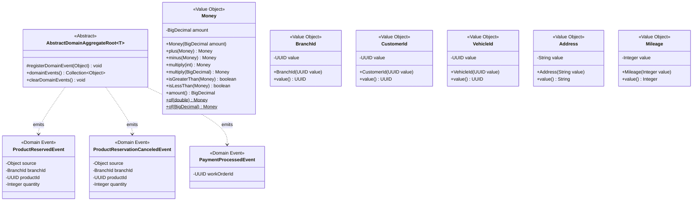
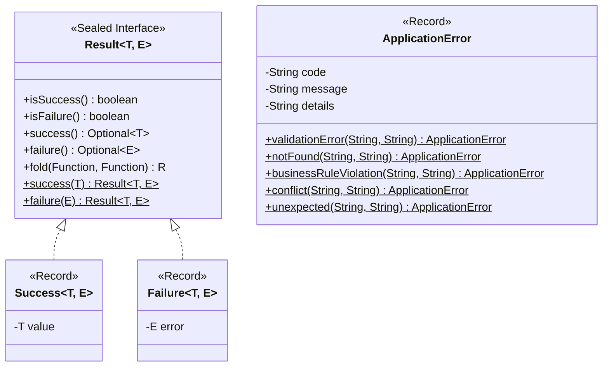
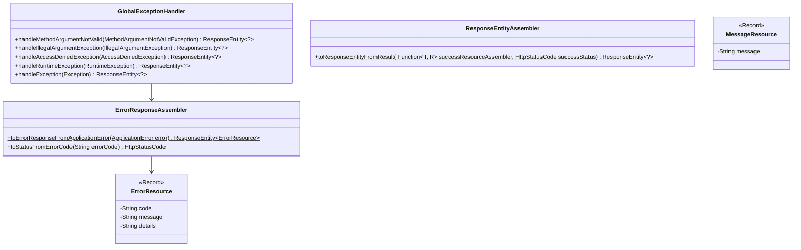
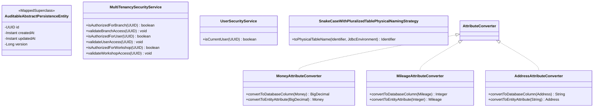
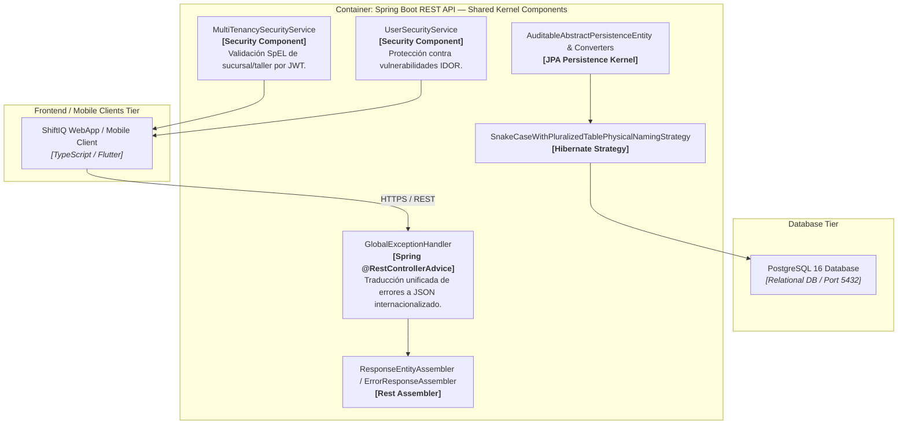
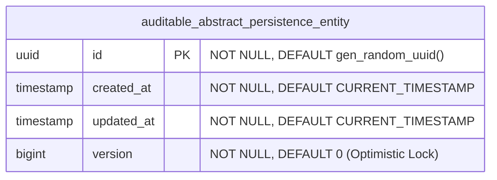

# Bounded Context Software Architecture & Domain Dictionary — Shared Kernel

El **Shared Kernel** (`shared`) provee la infraestructura transversal, las abstracciones de dominio compartidas, los Value Objects reutilizables, la gestión de eventos de dominio cross-context, el patrón funcional de manejo de errores (`Result<T, E>`), la seguridad multi-tenant por sucursal (`MultiTenancySecurityService`), el mapeo relacional base auditado (`AuditableAbstractPersistenceEntity`) y el manejo centralizado de excepciones REST en la plataforma **ShiftIQ**.

---

## 1. Domain Layer (Capa de Dominio)

La Capa de Dominio del Shared Kernel encapsula los tipos de valor reutilizables entre múltiples Bounded Contexts, la abstracción base para raíces de agregado (`AbstractDomainAggregateRoot`), y los eventos de dominio de integración que comunican el flujo entre módulos sin acoplamiento directo de infraestructura.

---

### 1.1. Base Aggregates & Abstract Entities

#### 📌 `AbstractDomainAggregateRoot<T extends AbstractDomainAggregateRoot<T>>`
* **Tipo:** Clase Abstracta (`extends AbstractAggregateRoot<T>`).
* **Propósito:** Provee soporte inmutable para registro y despacho de Eventos de Dominio sin acoplar el modelo a JPA ni a frameworks de persistencia.
* **Métodos:**
  * `#registerDomainEvent(Object event)`: Registra un evento de dominio para ser publicado tras persistir el agregado.
  * `+domainEvents()`: Retorna la colección no modificable de eventos registrados.
  * `+clearDomainEvents()`: Limpia la lista de eventos tras su publicación exitosa por los adaptadores de repositorio.

---

### 1.2. Shared Value Objects & Records

#### 📌 Record: `Money(BigDecimal amount)`
* **Propósito:** Value Object inmutable para representación precisa de montos monetarios.
* **Invariantes & Validaciones:**
  * No puede ser nulo (`operations.error.money.required`).
  * No puede ser negativo (`operations.error.money.cannotBeNegative`).
  * Redondeo automático a 2 decimales (`HALF_UP`).
* **Operaciones:** `plus(Money)`, `minus(Money)`, `multiply(int)`, `multiply(BigDecimal)`, `isGreaterThan(Money)`, `isLessThan(Money)`.
* **Constantes:** `ZERO` (`BigDecimal.ZERO`).

#### 📌 Record: `BranchId(UUID value)`
* **Propósito:** Identificador fuertemente tipado para sucursales del taller.
* **Validación:** No permite valores nulos (`shared.error.branchId.required`).

#### 📌 Record: `CustomerId(UUID value)`
* **Propósito:** Identificador fuertemente tipado para clientes.
* **Validación:** No permite valores nulos (`shared.error.customerId.required`).

#### 📌 Record: `VehicleId(UUID value)`
* **Propósito:** Identificador fuertemente tipado para vehículos.
* **Validación:** No permite valores nulos (`shared.error.vehicleId.required`).

#### 📌 Record: `Address(String value)`
* **Propósito:** Dirección física formateada.
* **Validación:** No puede estar vacía/nula (`operations.error.address.notBlank`) y longitud máxima de 100 caracteres (`operations.error.address.tooLong`).

#### 📌 Record: `Mileage(Integer value)`
* **Propósito:** Kilometraje de vehículos.
* **Validación:** No nulo (`operations.error.mileage.required`) y no negativo (`operations.error.mileage.cannotBeNegative`).

---

### 1.3. Cross-Context Domain Events

* **`ProductReservedEvent(Object source, BranchId branchId, UUID productId, Integer quantity)`**: Notifica la reserva temporal de repuestos emitida desde `Operations` hacia `Inventory`.
* **`ProductReservationCanceledEvent(Object source, BranchId branchId, UUID productId, Integer quantity)`**: Notifica la liberación de reservas de stock al modificar o cancelar tareas de ordenes de trabajo.
* **`PaymentProcessedEvent(UUID workOrderId)`**: Notifica el procesamiento exitoso de pago de una orden de trabajo desde `Billing`.

---

## 2. Application Layer (Capa de Aplicación)

La Capa de Aplicación del Shared Kernel provee la estructura funcional `Result<T, E>` para manejo de errores sin excepciones de control de flujo, y el modelo canónico de errores de aplicación `ApplicationError`.

---

### 2.1. Functional Result Pattern & Error Specification

#### 📌 Sealed Interface: `Result<T, E>`
* **Permite:** `Result.Success<T, E>`, `Result.Failure<T, E>`.
* **Métodos Principales:**
  * `static success(T value)` / `static failure(E error)`: Métodos de fábrica.
  * `fold(onSuccess, onFailure)`: Evaluación funcional pattern-matching.
  * `isSuccess()`, `isFailure()`, `success()`, `failure()`.

#### 📌 Record: `ApplicationError(String code, String message, String details)`
* **Métodos Estáticos de Fábrica:**
  * `validationError(field, reason)`
  * `notFound(resourceType, identifier)`
  * `businessRuleViolation(rule, reason)`
  * `conflict(resource, reason)`
  * `unexpected(context, reason)`

---

## 3. Interface Layer (Capa de Interfaz / REST)

Manejo global de excepciones (`@RestControllerAdvice`), ensambladores universales de respuestas HTTP e internacionalización (`MessageSource`).

---

### 3.1. Infrastructure REST Utilities & Cross-Cutting Exception Handlers

#### 📌 `GlobalExceptionHandler` (`@RestControllerAdvice`)
* Centraliza las excepciones no capturadas a nivel REST.
* Traduce `@Valid` binding errors (`MethodArgumentNotValidException`), `IllegalArgumentException`, `AccessDeniedException` y `RuntimeException` a respuestas `ErrorResource` internacionalizadas mediante `messages.properties`.

#### 📌 `ErrorResponseAssembler` & `ResponseEntityAssembler`
* Mapea códigos de error (`VALIDATION_ERROR`, `NOT_FOUND`, `CONFLICT`, `ACCESS_DENIED`) a los códigos de estado HTTP correspondientes (`400`, `404`, `409`, `403`, `500`).

---

## 4. Infrastructure Layer (Capa de Infraestructura)

Clase base relacional auditada JPA (`AuditableAbstractPersistenceEntity`), conversores de atributos (`AttributeConverter`), seguridad multi-tenant por sucursal y configuraciones transversales.

---

### 4.1. JPA MappedSuperclass & Persistence Base

#### 📌 `@MappedSuperclass`: `AuditableAbstractPersistenceEntity`
* **Anotaciones:** `@EntityListeners(AuditingEntityListener.class)`.
* **Atributos Heredados:**
  * `@Id @GeneratedValue(strategy = GenerationType.UUID) UUID id`
  * `@CreatedDate Instant createdAt`
  * `@LastModifiedDate Instant updatedAt`
  * `@Version Long version`

---

### 4.2. JPA Custom Attribute Converters

* **`MoneyAttributeConverter`**: Mapea `Money` ↔ `DECIMAL(12,2)`.
* **`MileageAttributeConverter`**: Mapea `Mileage` ↔ `INTEGER`.
* **`AddressAttributeConverter`**: Mapea `Address` ↔ `VARCHAR(100)`.

---

### 4.3. Multi-Tenancy Security & Auditing

* **`MultiTenancySecurityService`**: Bean `@Service("multiTenancySecurityService")` expuesto para expresiones SpEL (`@PreAuthorize`) que valida si el usuario autenticado posee permisos sobre el `branchId`, `userId` o `workshopId` de la petición.
* **`UserSecurityService`**: Bean `@Service("userSecurityService")` para verificación de identidad propia en SpEL (prevención de IDOR).
* **`SnakeCaseWithPluralizedTablePhysicalNamingStrategy`**: Convierte los nombres de entidades de CamelCase a `snake_case` pluralizado para PostgreSQL (ej. `WorkOrder` ➔ `work_orders`).

---

## 5. Software Architecture Component Level Diagrams (C4 Model - Level 3)

Descomposición del Container REST API resaltando los componentes del **Shared Kernel** que prestan servicio transversal a todos los Bounded Contexts.

---

## 6. Code Level Diagrams

### 6.1. Domain & Shared Kernel Class Diagram

```mermaid
classDiagram
    direction TB

    class AbstractDomainAggregateRoot~T~ {
        <<Abstract>>
        #registerDomainEvent(Object event) void
        +domainEvents() Collection~Object~
        +clearDomainEvents() void
    }

    class Money {
        <<Value Object>>
        -BigDecimal amount
        +Money(BigDecimal amount)
        +plus(Money other) Money
        +minus(Money other) Money
        +multiply(int quantity) Money
        +multiply(BigDecimal factor) Money
        +isGreaterThan(Money other) boolean
        +isLessThan(Money other) boolean
        +amount() BigDecimal
        +of(double val)$ Money
        +of(BigDecimal val)$ Money
    }

    class BranchId {
        <<Value Object>>
        -UUID value
        +BranchId(UUID value)
        +value() UUID
    }

    class CustomerId {
        <<Value Object>>
        -UUID value
        +CustomerId(UUID value)
        +value() UUID
    }

    class VehicleId {
        <<Value Object>>
        -UUID value
        +VehicleId(UUID value)
        +value() UUID
    }

    class Address {
        <<Value Object>>
        -String value
        +Address(String value)
        +value() String
    }

    class Mileage {
        <<Value Object>>
        -Integer value
        +Mileage(Integer value)
        +value() Integer
    }

    class Result~T, E~ {
        <<Sealed Interface>>
        +isSuccess() boolean
        +isFailure() boolean
        +success() Optional~T~
        +failure() Optional~E~
        +fold(Function onSuccess, Function onFailure) R
        +success(T value)$ Result~T, E~
        +failure(E error)$ Result~T, E~
    }

    class ApplicationError {
        <<Record>>
        -String code
        -String message
        -String details
        +validationError(String field, String reason)$ ApplicationError
        +notFound(String resourceType, String identifier)$ ApplicationError
        +businessRuleViolation(String rule, String reason)$ ApplicationError
        +conflict(String resource, String reason)$ ApplicationError
        +unexpected(String context, String reason)$ ApplicationError
    }

    class AuditableAbstractPersistenceEntity {
        <<MappedSuperclass>>
        -UUID id
        -Instant createdAt
        -Instant updatedAt
        -Long version
        +getId() UUID
        +getCreatedAt() Instant
        +getUpdatedAt() Instant
        +getVersion() Long
    }

    class MultiTenancySecurityService {
        +isAuthorizedForBranch(UUID branchId) boolean
        +validateBranchAccess(UUID branchId) void
        +isAuthorizedForUser(UUID userId) boolean
        +validateUserAccess(UUID userId) void
        +isAuthorizedForWorkshop(UUID workshopId) boolean
        +validateWorkshopAccess(UUID workshopId) void
    }

    class ErrorResponseAssembler {
        +toErrorResponseFromApplicationError(ApplicationError error)$ ResponseEntity~ErrorResource~
        +toStatusFromErrorCode(String errorCode)$ HttpStatusCode
    }

    class ResponseEntityAssembler {
        +toResponseEntityFromResult(Result~T, ApplicationError~ result, Function~T, R~ successResourceAssembler, HttpStatusCode successStatus)$ ResponseEntity~?~
    }

    class ErrorResource {
        <<Record>>
        -String code
        -String message
        -String details
    }

    class ProductReservedEvent {
        <<Domain Event>>
        -Object source
        -BranchId branchId
        -UUID productId
        -Integer quantity
    }

    class ProductReservationCanceledEvent {
        <<Domain Event>>
        -Object source
        -BranchId branchId
        -UUID productId
        -Integer quantity
    }

    class PaymentProcessedEvent {
        <<Domain Event>>
        -UUID workOrderId
    }

    class GlobalExceptionHandler {
        +handleMethodArgumentNotValid(MethodArgumentNotValidException ex) ResponseEntity~?~
        +handleIllegalArgumentException(IllegalArgumentException ex) ResponseEntity~?~
        +handleAccessDeniedException(AccessDeniedException ex) ResponseEntity~?~
        +handleRuntimeException(RuntimeException ex) ResponseEntity~?~
        +handleException(Exception ex) ResponseEntity~?~
    }
```

---

### 6.2. MappedSuperclass Database Relational Layout

