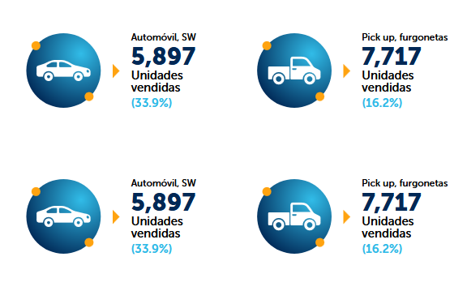
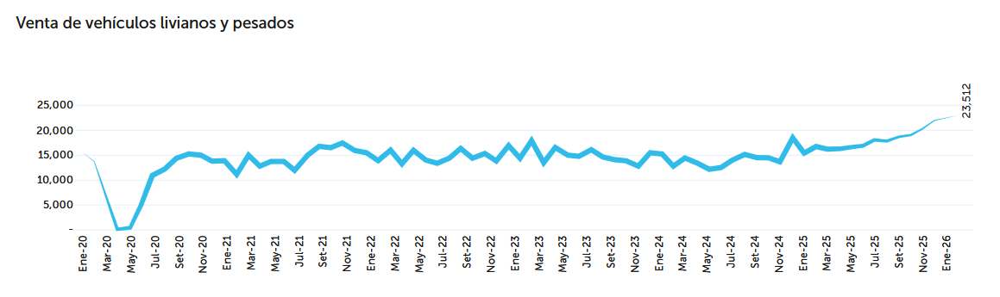
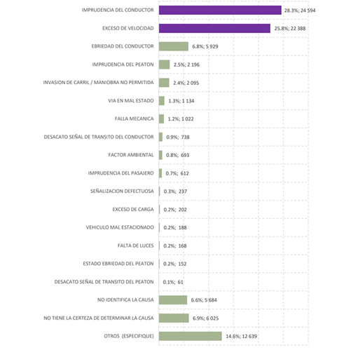
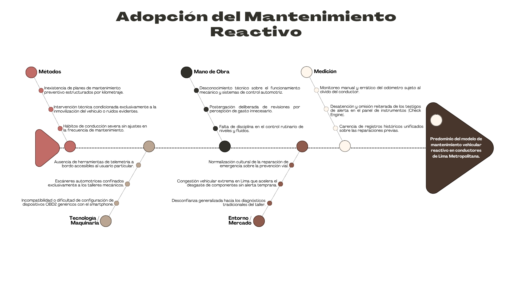
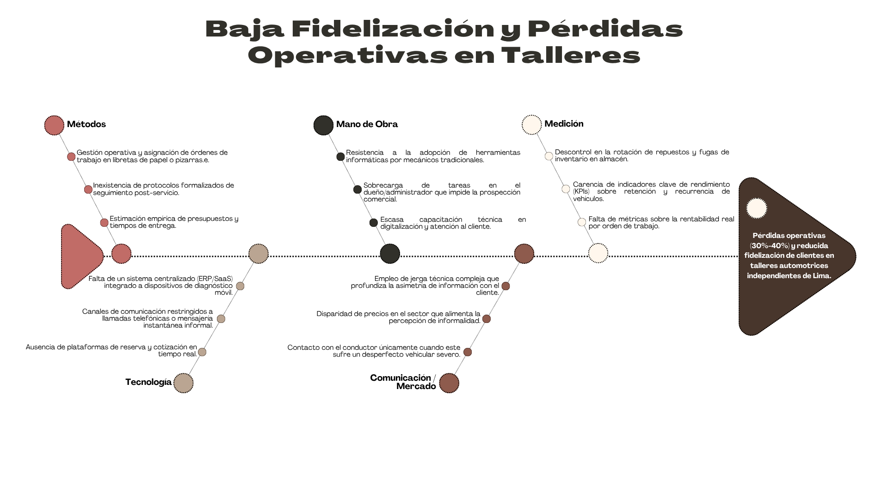

## 1.2. Solution Profile

El perfil de la solución define los fundamentos estratégicos, operativos y técnicos de ShiftIq, ecosistema desarrollado por TuxLogic. Esta sección sintetiza la problemática del mantenimiento vehicular en Lima Metropolitana mediante el análisis de datos estadísticos oficiales, diagramas de causa-raíz y el marco contextual de las 5W’s y 2H’s, articulando la formulación del producto a través del marco de trabajo Lean UX.

### 1.2.1. Antecedentes y problemática

En Lima Metropolitana, la gestión del mantenimiento automotriz opera predominantemente bajo un esquema reactivo, en el cual los usuarios acuden a los centros de reparación únicamente cuando la falla mecánica ha inhabilitado el funcionamiento del vehículo. Esta dinámica genera sobrecostos imprevistos para los propietarios y compromete la sostenibilidad operativa de los talleres mecánicos independientes, los cuales sufren de una demanda altamente volátil y bajos niveles de fidelización.

De acuerdo con las cifras de la Asociación Automotriz del Perú (AAP, 2026), durante el primer bimestre del año 2026 se comercializaron 41,584 unidades de vehículos livianos, lo que representó una expansión interanual del 36.8% frente al mismo periodo del año anterior. Este dinamismo sostenido en las matriculaciones acentúa la presión operativa sobre el parque automotor existente, demandando capacidades de servicio técnico que garanticen la vida útil de las unidades en circulación.

**Figura 1**  
*Venta de vehículos livianos y pesados en el periodo enero-febrero 2026*  

**Figura 2**  
*Evolución de ventas de vehículos livianos y pesados (2020 - 2026)*  

A pesar de este crecimiento en el parque vehicular, el sector de servicios técnicos presenta una marcada ineficiencia estructural. En Lima Metropolitana y el Callao operan aproximadamente 38,000 talleres mecánicos independientes, de los cuales una proporción significativa registra pérdidas operativas de entre el 30% y el 40% debido a la falta de herramientas tecnológicas de gestión, la asimetría de precios y la reducida recurrencia de los clientes (Fiestas et al., 2021). La ausencia de canales de comunicación directos y transparentes entre el taller y el cliente perpetúa un clima de desconfianza que inhibe el mantenimiento regular.

Esta desatención preventiva impacta de manera crítica en la seguridad vial. Según el Boletín Estadístico Anual de Siniestralidad Vial publicado por el Observatorio Nacional de Seguridad Vial (ONSV, 2025), durante el año 2024 se registraron 87,757 siniestros de tránsito a nivel nacional, de los cuales el 1.4% tuvieron como factor causal directo fallas mecánicas e inoperatividad de sistemas de iluminación. Esto equivale a 1,190 siniestros viales que pudieron haberse prevenido mediante diagnósticos mecánicos oportunos y esquemas de mantenimiento preventivo basados en el estado real del vehículo.

**Figura 3**  
*Distribución porcentual de siniestros viales según causa raíz (2024)*  

Con la finalidad de aislar los componentes estructurales de esta problemática, TuxLogic desarrolló dos diagramas de Ishikawa, los cuales delimitan las causas origen del mantenimiento reactivo y la fragmentación en la relación taller-conductor.

**Figura 4**  
*Diagrama de Ishikawa: Adopción predominante de un modelo de mantenimiento reactivo en Lima*  

* **Métodos:** Falta de planes de mantenimiento preventivo protocolizados; ausencia de historiales técnicos unificados por vehículo.
* **Mano de obra:** Diagnóstico empírico basado en inspección visual o auditiva; escasa capacitación técnica en digitalización de talleres.
* **Maquinaria / Tecnología:** Equipamiento de escaneo automotriz costoso, desconectado de la nube y limitado al espacio físico del taller; falta de telemetría remota.
* **Medición:** Monitoreo manual del kilometraje sujeto a olvido del usuario; carencia de indicadores de desgaste en tiempo real.
* **Medio ambiente / Mercado:** Informalidad generalizada del sector mecánico; percepción del mantenimiento preventivo como un gasto prescindible en vez de una inversión de seguridad.

**Figura 5**  
*Diagrama de Ishikawa: Baja fidelización y pérdida de recurrencia en talleres automotrices independientes*  

* **Comunicación:** Lenguaje técnico inaccesible y opaco para el conductor; contacto esporádico limitado a contingencias mecánicas.
* **Procesos:** Tiempos de espera impredecibles en cotizaciones y entregas; ausencia de agendamiento digital estructurado.
* **Gestión de Datos:** Inexistencia de registros de clientes en bases de datos relacionales; gestión basada en notas en papel o mensajería informal.
* **Confianza:** Temor del cliente a cobros inflados o sustitución no autorizada de repuestos; asimetría de información técnica.

Adicionalmente, se delimitó el alcance operativo mediante el análisis de las 5W’s y 2H’s:

**Figura 7**  
*Diagrama 5W's + 2H's - Ecosistema ShiftIq*  
*(Insertar diagrama de caracterización)*

* **Who (Quién):** Afecta a los dueños y administradores de talleres automotrices independientes y a los conductores de vehículos particulares de Lima Metropolitana.
* **What (Qué):** Pérdidas económicas por ineficiencia operativa en talleres y sobrecostos por fallas vehiculares graves derivadas de la falta de diagnóstico temprano.
* **Where (Dónde):** En el parque automotor y los talleres mecánicos independientes de Lima Metropolitana.
* **When (Cuándo):** Ocurre de forma constante durante la circulación vehicular diaria y se agudiza cuando los componentes críticos sufren averías catastróficas por falta de advertencia previa.
* **Why (Por qué):** Debido a la brecha tecnológica en los talleres independientes y la carencia de herramientas móviles que traduzcan la telemetría del vehículo a información comprensible para el conductor.
* **How (Cómo):** Se evidencia en talleres con saturación desordenada, pérdidas operativas del 30% al 40%, y vehículos circulando con alertas mecánicas no atendidas.
* **How Much (Cuánto):** Compromete la rentabilidad de cerca de 38,000 talleres independientes en la región y repercute en más de 1,100 siniestros evitables al año.

#### Oportunidad Comercial y Restricciones Técnicas

La oportunidad para TuxLogic consiste en articular una solución digital SaaS integrada con hardware de telemetría OBD2 accesible, apalancada en aplicaciones móviles intuitivas que sincronicen la telemetría vehicular en tiempo real con la administración del taller.

Para garantizar la viabilidad técnica y operativa del sistema, se establecen las siguientes restricciones de diseño e ingeniería:

* **Heterogeneidad del hardware vehicular:** El parque automotor limeño presenta una marcada diversidad de marcas y años de fabricación. El dispositivo y los servicios móviles deben basarse en el estándar universal OBD2 (SAE J1979 / ISO 15031) para asegurar la captura uniforme de códigos de diagnóstico de fallas (DTC).
* **Usabilidad móvil en entornos operacionales:** Los administradores y mecánicos operan con altos niveles de fricción física. Las interfaces móviles deben regirse bajo principios de Material Design 3, minimizando la densidad de interacción y optimizando el flujo de trabajo en pantalla.
* **Tolerancia a fallos de conectividad:** Considerando la variabilidad en la cobertura de redes móviles en distintas zonas de la capital, las aplicaciones deben implementar persistencia local reactiva para almacenar lecturas de telemetría y transacciones locales, sincronizándose asíncronamente con los servicios en la nube al restablecerse el enlace de datos.

---

### 1.2.2. Lean UX Process

El diseño de la experiencia de usuario y el desarrollo de ShiftIq se fundamentan en el marco de trabajo Lean UX, estructurado para iterar rápidamente sobre hipótesis validadas y reducir el riesgo de producto en función del valor entregado a los dos segmentos objetivo.

#### 1.2.2.1. Lean UX Problem Statement

**Problem Statement 1: Dueños o Administradores de Talleres Automotrices Independientes**

El sector de mantenimiento automotriz independiente en Lima busca que los administradores y dueños de talleres gestionen sus operaciones, órdenes de servicio y cronogramas de mantenimiento de manera centralizada, manteniendo una comunicación transparente que asegure la recurrencia de sus clientes.

Sin embargo, estos negocios presentan pérdidas operativas de entre el 30% y el 40% y una reducida tasa de fidelización, debido a que administran sus procesos mediante cuadernos físicos, grupos de mensajería y hojas de cálculo desarticuladas, perdiendo capacidad para anticipar los mantenimientos de su base instalada de vehículos.

*¿Cómo podríamos optimizar la gestión operativa y la capacidad proactiva de captación de los administradores de talleres automotrices independientes en Lima, de modo que incrementen su rentabilidad y fidelicen a sus clientes basándose en el estado técnico real de los vehículos?*

**Problem Statement 2: Conductores de Vehículos en Lima**

Los conductores particulares en Lima tienen como objetivo mantener sus vehículos en condiciones óptimas de seguridad y funcionamiento al menor costo posible, requiriendo información oportuna para prevenir fallas que detengan imprevistamente sus traslados.

Sin embargo, los conductores posponen el mantenimiento debido a la desconfianza hacia los diagnósticos tradicionales, la complejidad del lenguaje mecánico y la falta de seguimiento preventivo, lo que desencadena gastos correctivos elevados y contribuye al índice de siniestralidad mecánica en la ciudad.

*¿Cómo podríamos facilitar a los conductores de vehículos de Lima el acceso a información diagnóstica clara, comprensible y en tiempo real, de manera que puedan tomar decisiones de mantenimiento preventivo y coordinar servicios técnicos antes de que se produzcan averías severas?*

---

#### 1.2.2.2. Lean UX Assumptions

##### Business Assumptions

* **Clientes Iniciales:** Dueños y administradores de talleres mecánicos independientes en Lima que atienden un volumen promedio de 10 a 30 vehículos por semana, que no cuentan con herramientas de software especializadas y que demandan optimizar su retorno operativo en menos de 90 días.
* **Estrategia de Adquisición:** Despliegue presencial de programas piloto en talleres de Lima Metropolitana, ofreciendo 30 días de evaluación asistida. Los conductores se integrarán por recomendación y vinculación directa desde el taller afiliado, persiguiendo una meta base de 20 conductores vinculados por taller en el primer mes.
* **Modelo de Monetización:** Esquema de suscripción mensual (SaaS B2B) escalonado para el taller automotriz, complementado por la provisión del dispositivo de diagnóstico OBD2 (venta directa o comodato por suscripción).
* **Entorno Competitivo:** Existen sistemas ERP tradicionales de gestión comercial y escáneres automotrices industriales; sin embargo, no articulan la sincronización continua de telemetría IoT móvil con la recepción directa de alertas en la agenda del taller.
* **Riesgo Crítico de Producto:** Que la fricción en la instalación inicial del conector OBD2 o una interfaz compleja en la aplicación móvil provoquen el abandono de la plataforma durante los primeros 14 días.

##### Business Outcomes

* Reducción de la pérdida operativa de los talleres afiliados a menos del 18% al término de los primeros 6 meses de uso del ecosistema.
* Lograr que al menos el 45% de los ingresos por servicios del taller provengan de intervenciones preventivas planificadas en lugar de reparaciones reactivas.
* Tasa de conversión de alertas mecánicas OBD2 a órdenes de servicio confirmadas en la app igual o superior al 35%.
* Retención de usuarios conductores en la aplicación móvil a los 60 días superior al 60%.
* Tasa de renovación mensual de suscripciones por parte de los talleres superior al 85% al finalizar el primer trimestre.

##### User Assumptions

* **Perfil del Usuario - Taller:** Profesionales con amplia pericia en mecánica automotriz pero con bajo nivel de digitalización administrativa, acostumbrados a métodos empíricos y registros físicos.
* **Perfil del Usuario - Conductor:** Propietarios de vehículos particulares sin conocimientos técnicos avanzados, habituados al uso de smartphones para resolver gestiones cotidianas, pero con tendencia a postergar el mantenimiento por falta de tiempo o desconfianza.
* **Punto de Contacto (Touchpoint):**
  * Para el administrador: Una aplicación de supervisión y gestión operativa (móvil y web) consultada al inicio del día para coordinar citas, órdenes y alertas entrantes.
  * Para el conductor: Una aplicación móvil con notificaciones automáticas que solo interrumpe al usuario cuando se detecta un parámetro anómalo o se aproxima un kilometraje de servicio crítico.

##### User Outcomes

* **Para el Taller:** Control estructurado de citas y órdenes de servicio desde el dispositivo móvil, respaldado por la capacidad de contactar al cliente con el diagnóstico DTC exacto antes de que el vehículo ingrese a la rampa.
* **Para el Conductor:** Comprensión transparente del estado de salud del vehículo en una interfaz gráfica sin tecnicismos opacos, evitando emergencias mecánicas y sobrecostos inesperados.

##### Features

* **Módulo de Diagnóstico DTC Simplificado (Mobile):** Conversión automática de códigos OBD2 leídos vía Bluetooth a alertas en lenguaje natural con nivel de severidad (Bajo, Medio, Crítico).
* **Agendamiento y Presupuesto In-App:** Capacidad del conductor para agendar su cita preventiva con un solo clic tras recibir una alerta mecánica, visualizando el estimado del servicio.
* **Tablero Móvil de Alertas para Talleres:** Bandeja centralizada de telemetría que prioriza a los clientes cuyos vehículos presentan códigos de falla activos para su contacto preventivo inmediato.

---

#### 1.2.2.3. Lean UX Hypothesis Statements

* **Hipótesis 1 (Gestión Proactiva del Taller):**  
  Creemos que lograremos **un incremento del 40% en citas de mantenimiento preventivo** si el **administrador del taller** dispone de un **tablero móvil de monitoreo de telemetría OBD2 que priorice las alertas mecánicas de sus clientes**, permitiéndole contactarlos de manera proactiva. Sabremos que hemos tenido éxito cuando **al menos el 50% de las órdenes de trabajo mensuales se originen a partir de alertas automáticas del sistema** durante los primeros 90 días de operación.

* **Hipótesis 2 (Adopción y Confianza del Conductor):**  
  Creemos que alcanzaremos **una retención a 60 días superior al 60% en la app móvil** si el **conductor particular** obtiene **notificaciones sobre el estado de su vehículo expresadas en lenguaje cotidiano con estimaciones de urgencia**, reduciendo la asimetría de información técnica. Sabremos que hemos tenido éxito cuando **el 70% de los usuarios activos abra la app dentro de las primeras 48 horas posteriores a la emisión de una notificación de advertencia vehicular**.

* **Hipótesis 3 (Flujo de Agendamiento Sin Fricción):**  
  Creemos que conseguiremos **una tasa de conversión de alerta a cita confirmada no menor al 35%** si el **conductor particular** cuenta con **un enlace directo de reserva y cotización referencial dentro de la notificación de falla**, evitando llamadas o trámites externos. Sabremos que hemos tenido éxito cuando **el tiempo promedio transcurrido entre la detección de un código DTC y la confirmación de la cita en el taller sea inferior a 72 horas**.

---

#### 1.2.2.4. Lean UX Canvas

<table>
    <tr>
        <td valign="top">
            
 <b>Business Problem</b>
 
            
El modelo actual de mantenimiento automotriz en Lima es reactivo, lo que provoca que más de 38,000 talleres independientes experimenten pérdidas operativas de entre el 30% y el 40% debido a la falta de herramientas digitales y baja fidelización de clientes[cite: 1]. A la par, la desatención preventiva genera sobrecostos a los conductores y deriva en 1,190 siniestros viales anuales atribuibles a fallas mecánicas evitables[cite: 1].  ¿Cómo podríamos facilitar un ecosistema digital y móvil que conecte la telemetría vehicular con la administración del taller para transformar el mantenimiento reactivo en un modelo preventivo, oportuno y confiable?
 
        </td>
        <td rowspan="2" valign="top">
            
 <b>Solutions</b>
 
            <ul>
                <li>Desarrollar una aplicación móvil nativa para el conductor que se vincule vía Bluetooth con dispositivos OBD2, mostrando el estado de salud vehicular y alertas en lenguaje comprensible[cite: 1].</li> 
                <li>Implementar un motor de interpretación que traduzca códigos de diagnóstico de fallas (DTC) y telemetría a advertencias claras con nivel de criticidad.</li> 
                <li>Construir un módulo de gestión operativa y móvil para talleres que centralice la recepción de telemetría, el control de órdenes de trabajo y la programación de servicios preventivos[cite: 1].</li> 
                <li>Integrar un sistema de notificaciones push proactivas con cálculo de costos estimados y botón de agendamiento directo de citas hacia el taller afiliado[cite: 1].</li> 
            </ul> 
        </td>
        <td valign="top">
            
 <b>Business Outcomes</b>
 
            <ul>
                <li>Reducir las pérdidas operativas de los talleres afiliados a menos del 18% al término de 6 meses de operación[cite: 1].</li> 
                <li>Alcanzar una tasa de conversión de alertas OBD2 a citas confirmadas igual o superior al 35% en los primeros 7 días[cite: 1].</li> 
                <li>Lograr una retención de usuarios conductores en la app móvil mayor o igual al 60% a los 60 días de registro[cite: 1].</li> 
                <li>Mantener una tasa de renovación mensual de suscripciones SaaS por parte de los talleres superior al 85% al finalizar el primer trimestre[cite: 1].</li>
            </ul> 
        </td>
    </tr>
    <tr>
        <td valign="top">
            
 <b>Users</b>
 
            <ul>
                <li><b>Dueños o administradores de talleres automotrices independientes en Lima:</b> Negocios que atienden de 5 a 30 vehículos por semana y buscan modernizar su operación manual[cite: 1].</li> 
                <li><b>Conductores de vehículos particulares de Lima:</b> Propietarios de vehículos livianos con baja alfabetización mecánica que postergan revisiones por falta de tiempo o desconfianza diagnóstica[cite: 1].</li>
            </ul> 
        </td>
        <td valign="top">
            
 <b>User Outcomes & Benefits</b>
 
            <ul>
                <li><b>Talleres:</b> Control integral de la agenda y órdenes de servicio desde el móvil, reducción de tiempos muertos y capacidad de contactar al cliente con respaldo de datos técnicos objetivos[cite: 1].</li> 
                <li><b>Conductores:</b> Monitoreo transparente del estado real del vehículo sin jerga técnica, prevención de averías mecánicas críticas y ahorro económico en correctivos de emergencia[cite: 1].</li> 
                <li><b>Ambos:</b> Relación comercial transparente y libre de asimetrías de información durante el presupuesto y la ejecución de mantenimientos[cite: 1].</li>
            </ul> 
        </td>
    </tr>
    <tr>
        <td valign="top">
            
 <b>Hypotheses</b>
 
            
Creemos que el ecosistema ShiftIq incrementará la adopción del mantenimiento preventivo y optimizará la rentabilidad de los talleres independientes al sincronizar alertas diagnósticas OBD2 con un canal directo de reserva técnica[cite: 1].  Sabremos que esto es cierto cuando al menos el 50% de las citas registradas en la plataforma se originen proactivamente por alertas mecánicas y más del 65% de los conductores activos mantenga el dispositivo OBD2 sincronizado durante su segundo mes de uso[cite: 1].
 
        </td>
        <td valign="top">
            
 <b>What's the most important thing we need to learn first?</b>
 
            <ul>
                <li>Validar si los conductores están dispuestos a conservar el dispositivo OBD2 conectado permanentemente en sus vehículos a cambio de telemetría en su smartphone[cite: 1].</li> 
                <li>Identificar si los administradores de talleres independientes encuentran viable y rápida la adopción de una interfaz móvil para gestionar citas y órdenes frente a sus libretas físicas[cite: 1].</li> 
                <li>Determinar si una notificación push con costo estimado y nivel de urgencia reduce significativamente la fricción de agendamiento en el conductor[cite: 1].</li>
            </ul> 
        </td>
        <td valign="top">
            
 <b>What's the least amount of work we need to do to learn the next most important thing?</b>
 
            <ul>
                <li>Desplegar una prueba piloto de 30 días con 5 talleres independientes y 30 conductores en Lima utilizando el MVP móvil vinculado a emuladores y dongles OBD2 estándar[cite: 1].</li> 
                <li>Evaluar el comportamiento y tiempo de respuesta de los conductores ante el envío de alertas diagnósticas simuladas y reales.</li> 
                <li>Aplicar entrevistas breves y métricas in-app para medir la facilidad de uso y la tasa de agendamiento efectivo post-alerta.</li>
            </ul> 
        </td>
    </tr>
</table>