## 2.6. Tactical-Level Domain-Driven Design

### 2.6.1. Bounded Context: Shared Kernel

El **Shared Kernel** (`shared`) provee la infraestructura transversal, las abstracciones de dominio compartidas, los Value Objects reutilizables, la gestión de eventos de dominio cross-context, el patrón funcional de manejo de errores (`Result<T, E>`), la seguridad multi-tenant por sucursal (`MultiTenancySecurityService`), el mapeo relacional base auditado (`AuditableAbstractPersistenceEntity`) y el manejo centralizado de excepciones REST en la plataforma **ShiftIQ**.

---

#### 2.6.1.1. Domain Layer

La Capa de Dominio del Shared Kernel encapsula los tipos de valor reutilizables entre múltiples Bounded Contexts, la abstracción base para raíces de agregado (`AbstractDomainAggregateRoot`), y los eventos de dominio de integración que comunican el flujo entre módulos sin acoplamiento directo de infraestructura.

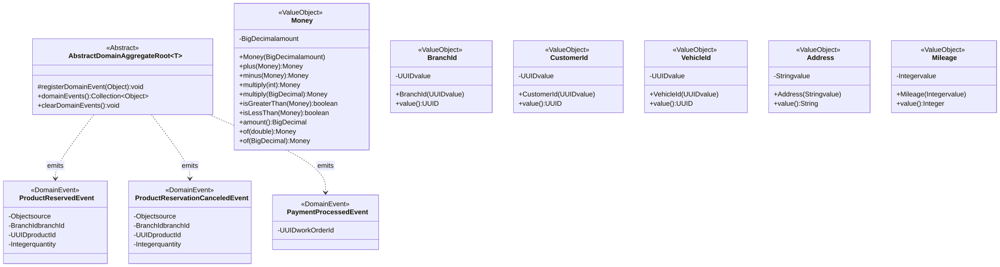

##### 2.6.1.1.1. Base Aggregates & Abstract Entities

###### `AbstractDomainAggregateRoot<T extends AbstractDomainAggregateRoot<T>>`
* **Tipo:** Clase Abstracta (`extends AbstractAggregateRoot<T>`).
* **Propósito:** Provee soporte inmutable para registro y despacho de Eventos de Dominio sin acoplar el modelo a JPA ni a frameworks de persistencia.
* **Métodos:**
  * `#registerDomainEvent(Object event)`: Registra un evento de dominio para ser publicado tras persistir el agregado.
  * `+domainEvents()`: Retorna la colección no modificable de eventos registrados.
  * `+clearDomainEvents()`: Limpia la lista de eventos tras su publicación exitosa por los adaptadores de repositorio.

##### 2.6.1.1.2. Shared Value Objects & Records

###### Record: `Money(BigDecimal amount)`
* **Propósito:** Value Object inmutable para representación precisa de montos monetarios.
* **Invariantes & Validaciones:**
  * No puede ser nulo (`operations.error.money.required`).
  * No puede ser negativo (`operations.error.money.cannotBeNegative`).
  * Redondeo automático a 2 decimales (`HALF_UP`).
* **Operaciones:** `plus(Money)`, `minus(Money)`, `multiply(int)`, `multiply(BigDecimal)`, `isGreaterThan(Money)`, `isLessThan(Money)`.
* **Constantes:** `ZERO` (`BigDecimal.ZERO`).

###### Record: `BranchId(UUID value)`
* **Propósito:** Identificador fuertemente tipado para sucursales del taller.
* **Validación:** No permite valores nulos (`shared.error.branchId.required`).

###### Record: `CustomerId(UUID value)`
* **Propósito:** Identificador fuertemente tipado para clientes.
* **Validación:** No permite valores nulos (`shared.error.customerId.required`).

###### Record: `VehicleId(UUID value)`
* **Propósito:** Identificador fuertemente tipado para vehículos.
* **Validación:** No permite valores nulos (`shared.error.vehicleId.required`).

###### Record: `Address(String value)`
* **Propósito:** Dirección física formateada.
* **Validación:** No puede estar vacía/nula (`operations.error.address.notBlank`) y longitud máxima de 100 caracteres (`operations.error.address.tooLong`).

###### Record: `Mileage(Integer value)`
* **Propósito:** Kilometraje de vehículos.
* **Validación:** No nulo (`operations.error.mileage.required`) y no negativo (`operations.error.mileage.cannotBeNegative`).

##### 2.6.1.1.3. Cross-Context Domain Events

* **`ProductReservedEvent(Object source, BranchId branchId, UUID productId, Integer quantity)`**: Notifica la reserva temporal de repuestos emitida desde `Operations` hacia `Inventory`.
* **`ProductReservationCanceledEvent(Object source, BranchId branchId, UUID productId, Integer quantity)`**: Notifica la liberación de reservas de stock al modificar o cancelar tareas de ordenes de trabajo.
* **`PaymentProcessedEvent(UUID workOrderId)`**: Notifica el procesamiento exitoso de pago de una orden de trabajo desde `Billing`.

---

#### 2.6.1.2. Interface Layer

Manejo global de excepciones (`@RestControllerAdvice`), ensambladores universales de respuestas HTTP e internacionalización (`MessageSource`).

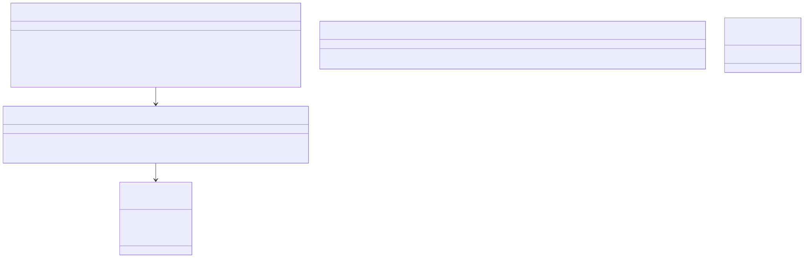

##### 2.6.1.2.1. Infrastructure REST Utilities & Cross-Cutting Exception Handlers

###### `GlobalExceptionHandler` (`@RestControllerAdvice`)
* Centraliza las excepciones no capturadas a nivel REST.
* Traduce `@Valid` binding errors (`MethodArgumentNotValidException`), `IllegalArgumentException`, `AccessDeniedException` y `RuntimeException` a respuestas `ErrorResource` internacionalizadas mediante `messages.properties`.

###### `ErrorResponseAssembler` & `ResponseEntityAssembler`
* Mapea códigos de error (`VALIDATION_ERROR`, `NOT_FOUND`, `CONFLICT`, `ACCESS_DENIED`) a los códigos de estado HTTP correspondientes (`400`, `404`, `409`, `403`, `500`).

---

#### 2.6.1.3. Application Layer

La Capa de Aplicación del Shared Kernel provee la estructura funcional `Result<T, E>` para manejo de errores sin excepciones de control de flujo, y el modelo canónico de errores de aplicación `ApplicationError`.

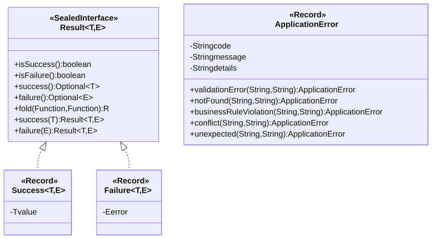

##### 2.6.1.3.1. Functional Result Pattern & Error Specification

###### Sealed Interface: `Result<T, E>`
* **Permite:** `Result.Success<T, E>`, `Result.Failure<T, E>`.
* **Métodos Principales:**
  * `static success(T value)` / `static failure(E error)`: Métodos de fábrica.
  * `fold(onSuccess, onFailure)`: Evaluación funcional pattern-matching.
  * `isSuccess()`, `isFailure()`, `success()`, `failure()`.

###### Record: `ApplicationError(String code, String message, String details)`
* **Métodos Estáticos de Fábrica:**
  * `validationError(field, reason)`
  * `notFound(resourceType, identifier)`
  * `businessRuleViolation(rule, reason)`
  * `conflict(resource, reason)`
  * `unexpected(context, reason)`

---

#### 2.6.1.4. Infrastructure Layer

Clase base relacional auditada JPA (`AuditableAbstractPersistenceEntity`), conversores de atributos (`AttributeConverter`), seguridad multi-tenant por sucursal y configuraciones transversales.

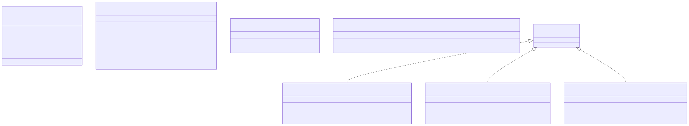

##### 2.6.1.4.1. JPA MappedSuperclass & Persistence Base

###### `@MappedSuperclass`: `AuditableAbstractPersistenceEntity`
* **Anotaciones:** `@EntityListeners(AuditingEntityListener.class)`.
* **Atributos Heredados:**
  * `@Id @GeneratedValue(strategy = GenerationType.UUID) UUID id`
  * `@CreatedDate Instant createdAt`
  * `@LastModifiedDate Instant updatedAt`
  * `@Version Long version`

##### 2.6.1.4.2. JPA Custom Attribute Converters

* **`MoneyAttributeConverter`**: Mapea `Money` ↔ `DECIMAL(12,2)`.
* **`MileageAttributeConverter`**: Mapea `Mileage` ↔ `INTEGER`.
* **`AddressAttributeConverter`**: Mapea `Address` ↔ `VARCHAR(100)`.

##### 2.6.1.4.3. Multi-Tenancy Security & Auditing

* **`MultiTenancySecurityService`**: Bean `@Service("multiTenancySecurityService")` expuesto para expresiones SpEL (`@PreAuthorize`) que valida si el usuario autenticado posee permisos sobre el `branchId`, `userId` o `workshopId` de la petición.
* **`UserSecurityService`**: Bean `@Service("userSecurityService")` para verificación de identidad propia en SpEL (prevención de IDOR).
* **`SnakeCaseWithPluralizedTablePhysicalNamingStrategy`**: Convierte los nombres de entidades de CamelCase a `snake_case` pluralizado para PostgreSQL (ej. `WorkOrder` ➔ `work_orders`).

---

#### 2.6.1.5. Bounded Context Software Architecture Component Level Diagrams

Descomposición del Container REST API resaltando los componentes del **Shared Kernel** que prestan servicio transversal a todos los Bounded Contexts.

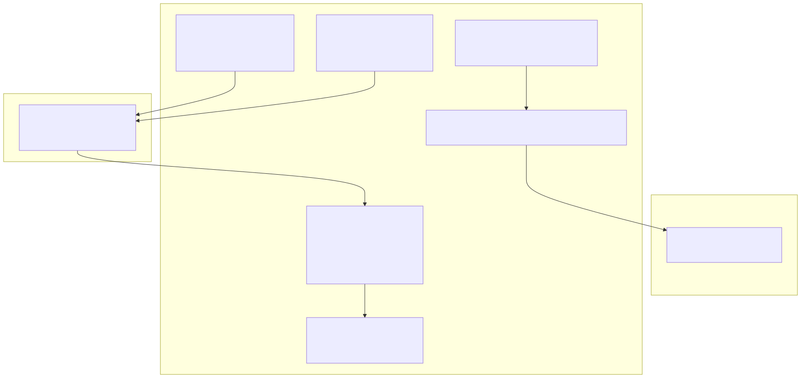

---

#### 2.6.1.6. Bounded Context Software Architecture Code Level Diagrams

##### 2.6.1.6.1. Bounded Context Domain Layer Class Diagrams

Representación detallada de clases del módulo Shared Kernel en formato UML, abarcando las clases abstractas, Value Objects, Records, Eventos de Dominio, interfaces selladas y utilitarios transversales.

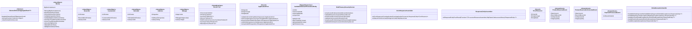

##### 2.6.1.6.2. Bounded Context Database Design Diagram

Estructura de la tabla relacional base heredada por las entidades persistentes mediante la estrategia `@MappedSuperclass` de JPA en PostgreSQL:

| Columna | Tipo de Dato | Constraints / Descripción |
| :--- | :--- | :--- |
| **`id`** | `UUID` | `PRIMARY KEY, DEFAULT gen_random_uuid()` |
| **`created_at`** | `TIMESTAMP` | `NOT NULL, DEFAULT CURRENT_TIMESTAMP` |
| **`updated_at`** | `TIMESTAMP` | `NOT NULL, DEFAULT CURRENT_TIMESTAMP` |
| **`version`** | `BIGINT` | `NOT NULL, DEFAULT 0` (Control de concurrencia optimista) |

---

Este documento presenta la especificación exhaustiva, formal y técnica de los **Bounded Contexts** implementados en el ecosistema **ShiftIQ Platform**. Cada contexto se estructura rigurosamente bajo los lineamientos del **Domain-Driven Design (DDD) Táctico** y los principios de la **Arquitectura Limpia / Hexagonal**, alineado al 100% con la base de código real. Incluye diagramas de arquitectura en **C4 Model (Nivel 3: Componentes)**, diagramas a nivel de código (**UML Class Diagrams** y **Database ER Diagrams**), y el **Diccionario de Clases por Capas** con atributos tipados, signaturas completas de métodos, visibilidad, reglas de negocio, invariantes y relaciones estructurales entre componentes a través de las cuatro capas fundamentales: **Domain Layer**, **Application Layer**, **Interface Layer** e **Infrastructure Layer**.

---

Este documento presenta la especificación exhaustiva, formal y técnica de los **Bounded Contexts** implementados en el ecosistema **ShiftIQ Platform**. Cada contexto se estructura rigurosamente bajo los lineamientos del **Domain-Driven Design (DDD) Táctico** y los principios de la **Arquitectura Limpia / Hexagonal**, alineado al 100% con la base de código real. Incluye diagramas de arquitectura en **C4 Model (Nivel 3: Componentes)**, diagramas a nivel de código (**UML Class Diagrams** y **Database ER Diagrams**), y el **Diccionario de Clases por Capas** con atributos tipados, signaturas completas de métodos, visibilidad, reglas de negocio, invariantes y relaciones estructurales entre componentes a través de las cuatro capas fundamentales: **Domain Layer**, **Application Layer**, **Interface Layer** e **Infrastructure Layer**.

---

Este documento presenta la especificación exhaustiva, formal y técnica de los **Bounded Contexts** implementados en el ecosistema **ShiftIQ Platform**. Cada contexto se estructura rigurosamente bajo los lineamientos del **Domain-Driven Design (DDD) Táctico** y los principios de la **Arquitectura Limpia / Hexagonal**, alineado al 100% con la base de código real. Incluye diagramas de arquitectura en **C4 Model (Nivel 3: Componentes)**, diagramas a nivel de código (**UML Class Diagrams** y **Database ER Diagrams**), y el **Diccionario de Clases por Capas** con atributos tipados, signaturas completas de métodos, visibilidad, reglas de negocio, invariantes y relaciones estructurales entre componentes a través de las cuatro capas fundamentales: **Domain Layer**, **Application Layer**, **Interface Layer** e **Infrastructure Layer**.

---

Este documento presenta la especificación exhaustiva, formal y técnica de los **Bounded Contexts** implementados en el ecosistema **ShiftIQ Platform**. Cada contexto se estructura rigurosamente bajo los lineamientos del **Domain-Driven Design (DDD) Táctico** y los principios de la **Arquitectura Limpia / Hexagonal**, alineado al 100% con la base de código real. Incluye diagramas de arquitectura en **C4 Model (Nivel 3: Componentes)**, diagramas a nivel de código (**UML Class Diagrams** y **Database ER Diagrams**), y el **Diccionario de Clases por Capas** con atributos tipados, signaturas completas de métodos, visibilidad, reglas de negocio, invariantes y relaciones estructurales entre componentes a través de las cuatro capas fundamentales: **Domain Layer**, **Application Layer**, **Interface Layer** e **Infrastructure Layer**.

### 2.6.2. Bounded Context: Identity & Access Management (IAM)

El Bounded Context de **Identity & Access Management (IAM)** constituye la piedra angular de seguridad, identidad y control de acceso de la plataforma ShiftIQ. Su responsabilidad primordial radica en centralizar el ciclo de vida de las identidades de usuario, garantizando:
- La confidencialidad y almacenamiento seguro de credenciales mediante hashing criptográfico BCrypt.
- La provisión de mecanismos de autenticación local (vía email y contraseña) y federada (mediante Google Identity Services / OAuth 2.0).
- La emisión, firma criptográfica y verificación de tokens de autorización sin estado (**JSON Web Tokens - JWT**).
- La asignación y verificación de roles de seguridad (Role-Based Access Control - RBAC) con soporte de autorización por propiedad de recurso mediante `UserSecurityService`.
- La orquestación del restablecimiento seguro de contraseñas olvidadas mediante tokens efímeros hasheados con SHA-256 (TTL por defecto de 60 minutos) y notificados vía correo electrónico (SMTP).

---

#### 2.6.2.1. Domain Layer (Capa de Dominio)

La Capa de Dominio encierra la lógica de negocio pura, las invariantes operativas y las reglas del sistema de identidad, manteniéndose completamente agnóstica de frameworks web, motores de bases de datos o librerías de persistencia. En esta capa se definen Agregados, Entidades, Value Objects, Servicios de Dominio, Fábricas (Factories/Creation Constructors) e Interfaces de Repositorio.

##### 2.6.2.1.1. Aggregates & Entities

##### Class: `User`
* **Tipo:** Aggregate Root (extiende de `AbstractDomainAggregateRoot<User>`).
* **Propósito:** Raíz de consistencia del agregado de usuario en IAM. Encapsula las credenciales, el estado vital de la cuenta, el rol de autorización RBAC, las asociaciones a sucursales de taller y las transiciones de estado, garantizando la publicación atómica de eventos de dominio ante cambios relevantes.
* **Documentación de Atributos:**
  * `id`: `UserId` (No Nulo) — Identificador único tipado del usuario encapsulado en un Value Object.
  * `email`: `EmailAddress` (No Nulo) — Dirección de correo electrónico normalizada y validada.
  * `password`: `Password` (No Nulo para auth local) — Hash de la contraseña encriptada con BCrypt.
  * `googleId`: `GoogleId` (Opcional) — Sujeto único emitido por Google OAuth (`sub`).
  * `status`: `UserStatus` (No Nulo) — Estado de la cuenta (`ACTIVE` o `INACTIVE`).
  * `role`: `Roles` (No Nulo) — Rol de autorización (`ROLE_USER`, `ROLE_ADMIN`, `ROLE_EMPLOYEE`, `ROLE_OWNER`).
  * `branchIds`: `Set<UUID>` (No Nulo) — Colección de identificadores de sedes (`BranchId`) asociadas al usuario.
  * `createdAt`: `Instant` — Marca de tiempo UTC de creación.
  * `updatedAt`: `Instant` — Marca de tiempo UTC de última actualización.
  * `deletedAt`: `Instant` (Opcional) — Marca de tiempo UTC de baja lógica (soft delete).
  * `version`: `Long` — Control de concurrencia optimista.
* **Documentación de Métodos:**
  * `+ User()`: Constructor por defecto; genera UUID aleatorio, fija `status = ACTIVE`, `role = ROLE_USER` y colección vacía de `branchIds`.
  * `+ User(EmailAddress email, Password password)`: Constructor de registro local. Valida no-nulidad de email y password, e inmediatamente registra el evento `UserSignedUpEvent(this, this.id.value(), this.email.value())`.
  * `+ User(EmailAddress email, Password password, GoogleId googleId)`: Constructor para registro federado o con vinculación explícita de Google.
  * `+ assignRole(Roles role)`: `void` — Asigna o actualiza el rol del usuario. Lanza `IllegalArgumentException("iam.error.role.required")` si es nulo.
  * `+ assignBranch(UUID branchId)`: `void` — Vincula una sucursal al perfil del usuario. Lanza `IllegalArgumentException("iam.error.branchId.required")` si el UUID es nulo.
  * `+ removeBranch(UUID branchId)`: `void` — Remueve la asociación con la sucursal de forma idempotente.
  * `+ deactivate()`: `void` — Muta el estado a `INACTIVE`, establece `deletedAt = Instant.now()` y registra `#registerDomainEvent(new UserDeactivatedEvent(this, this.id.value()))`.
  * `+ changePassword(Password newPassword)`: `void` — Valida no-nulidad y comprueba que la nueva contraseña no coincida con el hash actual (`"iam.error.password.sameAsCurrent"`). Actualiza el hash y registra `#registerDomainEvent(new UserPasswordChangedEvent(this, this.id.value()))`.
  * `+ changeEmail(EmailAddress newEmail)`: `void` — Valida consistencia, actualiza el correo y registra `#registerDomainEvent(new UserEmailChangedEvent(this, this.id.value(), oldEmail, newEmail.value()))`.
  * `+ linkGoogleAccount(GoogleId googleId)`: `void` — Asocia la identidad federada de Google.
* **Relaciones:**
  * Compone los Value Objects `UserId`, `EmailAddress`, `Password`, `GoogleId`, `UserStatus` y `Roles`.
  * Registra eventos de dominio: `UserSignedUpEvent`, `UserPasswordChangedEvent`, `UserEmailChangedEvent`, `UserDeactivatedEvent`.

---

##### Class: `PasswordRecoveryToken`
* **Tipo:** Entity interna de dominio.
* **Propósito:** Representa un token temporal y efímero generado para validar solicitudes de restablecimiento de contraseña.
* **Documentación de Atributos:**
  * `id`: `UUID` (No Nulo) — Identificador único universal del registro del token.
  * `tokenHash`: `String` (No Nulo) — Hash digest SHA-256 del token plano generado (evita guardar tokens en texto plano en la base de datos).
  * `userId`: `UUID` (No Nulo) — Identificador del usuario propietario del token.
  * `createdAt`: `Instant` — Marca temporal de emisión.
  * `expiresAt`: `Instant` — Marca temporal de caducidad calculada (por defecto 60 minutos).
  * `isUsed`: `boolean` — Bandera de consumo; transiciona irreversiblemente a `true` al usarse.
* **Documentación de Métodos:**
  * `+ PasswordRecoveryToken(String tokenHash, UUID userId, long expirationMinutes)`: Constructor de emisión. Calcula `expiresAt` sumando los minutos a `createdAt` y fija `isUsed = false`.
  * `+ isValid()`: `boolean` — Retorna `true` si `!isUsed` y `Instant.now().isBefore(expiresAt)`.
  * `+ markAsUsed()`: `void` — Invalida el token estableciendo `isUsed = true`.
* **Relaciones:** Mantiene una referencia débil por identificador (`userId`) hacia el agregado `User`.

---

##### 1.2. Value Objects

##### Class: `UserId`
* **Tipo:** Value Object (Java Record).
* **Propósito:** Tipado fuerte para el identificador único del usuario (`UUID`).
* **Atributos:** `value: UUID`.
* **Métodos:** Constructor canónico con validación de no-nulidad (`"iam.error.userId.required"`).

##### Class: `EmailAddress`
* **Tipo:** Value Object (Java Record).
* **Propósito:** Valida y encapsula una dirección de correo electrónico según la expresión regular `^[a-zA-Z0-9._%+-]+@[a-zA-Z0-9.-]+\\.[a-zA-Z]{2,}$`.
* **Atributos:** `value: String`.
* **Métodos:** Constructor con validación de patrón (`"iam.error.email.invalidFormat"`) y no-nulidad (`"iam.error.email.required"`).

##### Class: `Password`
* **Tipo:** Value Object (Java Record).
* **Propósito:** Encapsula la contraseña en formato hash, asegurando que el dominio nunca maneje texto plano.
* **Atributos:** `value: String`.
* **Métodos:** Valida no-nulidad ni espacio en blanco (`"iam.error.password.required"`).

##### Class: `GoogleId`
* **Tipo:** Value Object (Java Record).
* **Propósito:** Encapsula el identificador federado del sujeto provisto por Google (`sub`).
* **Atributos:** `value: String`.

##### Enum: `Roles`
* **Tipo:** Value Object (Enumeration).
* **Propósito:** Define los roles canónicos de seguridad existentes en la base de código real:
* **Valores:**
  * `ROLE_USER`: Rol base por defecto asignado a todo usuario registrado.
  * `ROLE_ADMIN`: Administrador con privilegios de control global de plataforma.
  * `ROLE_EMPLOYEE`: Personal operativo o técnico del taller automotriz.
  * `ROLE_OWNER`: Propietario del taller automotriz y titular de la suscripción.

##### Enum: `UserStatus`
* **Tipo:** Value Object (Enumeration).
* **Propósito:** Modela el estado de la cuenta en el ciclo de vida:
* **Valores:**
  * `ACTIVE`: Cuenta habilitada para autenticación y consumo de APIs.
  * `INACTIVE`: Cuenta dada de baja lógica.

---

##### 1.3. Domain Events

*  **`UserSignedUpEvent(Object source, UUID userId, String email)`**: Publicado al crearse una nueva cuenta de usuario.
*  **`UserPasswordChangedEvent(Object source, UUID userId)`**: Publicado al modificarse la contraseña del usuario.
*  **`UserEmailChangedEvent(Object source, UUID userId, String oldEmail, String newEmail)`**: Publicado tras la actualización de correo electrónico.
*  **`UserDeactivatedEvent(Object source, UUID userId)`**: Publicado al ejecutarse la baja lógica de la cuenta.

---

##### 2.6.2.1.4. Domain Repositories (Interfaces)

##### Interface: `UserRepository`
* **Propósito:** Define el contrato formal de persistencia del agregado `User`. En la base de código real, sus métodos de consulta utilizan tipos primitivos/estándar (`UUID`, `String`) y `save()` retorna `void`:
* **Métodos:**
  * `void save(User user)`: Persiste o actualiza el usuario en la base de datos y despacha sus eventos de dominio acumulados mediante `ApplicationEventPublisher`.
  * `Optional<User> findById(UUID id)`: Busca un usuario activo por su identificador único.
  * `Optional<User> findByEmail(String email)`: Busca un usuario activo por su dirección de correo electrónico.
  * `boolean existsByEmail(String email)`: Comprueba si existe un usuario activo con dicho correo.
* **Relaciones:** Implementado en infraestructura por `UserRepositoryImpl`.

##### Interface: `PasswordRecoveryTokenRepository`
* **Propósito:** Contrato para el almacenamiento y consulta de tokens de recuperación de contraseñas.
* **Métodos:**
  * `void save(PasswordRecoveryToken token)`: Persiste o actualiza el token de recuperación.
  * `Optional<PasswordRecoveryToken> findByTokenHash(String tokenHash)`: Localiza un token mediante su hash SHA-256.
* **Relaciones:** Implementado en infraestructura por `PasswordRecoveryTokenRepositoryImpl`.

---

#### 2.6.2.2. Application Layer (Capa de Aplicación)

La Capa de Aplicación orquesta los casos de uso del Bounded Context. Recibe comandos y consultas, coordina los agregados del dominio, ejecuta validaciones de unicidad y delega en servicios de infraestructura (hashing, tokens, email y Google OAuth).

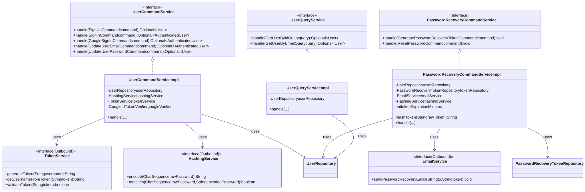

##### 2.6.2.2.1. Commands & Queries (DTOs de Aplicación)

*  **`SignUpCommand(EmailAddress email, Password password)`**: Comando con Value Objects para dar de alta una nueva cuenta.
*  **`SignInCommand(EmailAddress email, Password password)`**: Credenciales para autenticación local.
*  **`GoogleSignInCommand(String idToken)`**: Token de identidad emitido por Google Identity Services.
*  **`GeneratePasswordRecoveryTokenCommand(EmailAddress email)`**: Solicitud de token de recuperación.
*  **`ResetPasswordCommand(String token, Password newPassword)`**: Token plano recibido por email y Value Object de la nueva contraseña.
*  **`UpdateUserEmailCommand(UserId userId, EmailAddress newEmail)`**: Parámetros para actualizar el correo electrónico.
*  **`UpdateUserPasswordCommand(UserId userId, Password currentPassword, Password newPassword)`**: Parámetros para cambiar la clave verificando la actual.
*  **`GetUserByIdQuery(UserId userId)`**: Consulta inmutable de usuario por su identificador.
*  **`GetUserByEmailQuery(EmailAddress email)`**: Consulta de usuario por dirección de correo.
*  **`AuthenticatedUser(User user, String token)`**: Modelo de resultado de autenticación que encapsula el agregado `User` y el token JWT emitido.

---

##### 2.2. Command Services & Handlers

##### Interface: `UserCommandService` / Class: `UserCommandServiceImpl`
* **Propósito:** Orquestador de mutaciones de usuario en IAM.
* **Dependencias inyectadas:** `UserRepository`, `HashingService`, `TokenService`, `GoogleIdTokenVerifier` (configurado con `@Value("${google.client.id}")`).
* **Documentación de Métodos:**
  * `Optional<User> handle(SignUpCommand command)`:
    * *Lógica:* Verifica si `userRepository.existsByEmail(command.email().value())` es verdadero. De ser así, lanza `IllegalArgumentException("iam.error.email.alreadyInUse")`. Hashea la contraseña mediante `hashingService.encode(command.password().value())`, instancia `new User(command.email(), passwordVO)` y persiste mediante `userRepository.save(user)`. Retorna `userRepository.findByEmail(command.email().value())`.
  * `Optional<AuthenticatedUser> handle(SignInCommand command)`:
    * *Lógica:* Busca el usuario por email. Si no existe o `hashingService.matches(command.password().value(), user.getPassword().value())` falla, lanza `IllegalArgumentException("iam.error.credentials.invalid")`. Genera el token JWT llamando a `tokenService.generateToken(user.getEmail().value())` y retorna `Optional.of(new AuthenticatedUser(user, token))`.
  * `Optional<AuthenticatedUser> handle(GoogleSignInCommand command)`:
    * *Lógica:* Valida el `idToken` mediante `googleVerifier.verify(command.idToken())`. Si es nulo o falla, lanza `IllegalArgumentException("iam.error.googleToken.invalid")`. Extrae email y subject (`googleId`). Si el usuario no existe, aprovisiona un nuevo agregado `User` con contraseña aleatoria encriptada y lo vincula a `GoogleId`. Si ya existía, vincula el `googleId` si estaba ausente. Genera el JWT y retorna `Optional.of(new AuthenticatedUser(user, token))`.
  * `Optional<AuthenticatedUser> handle(UpdateUserEmailCommand command)`:
    * *Lógica:* Localiza al usuario por ID o lanza `"iam.error.user.notFound"`. Si el email cambia y ya existe en otro registro, lanza `"iam.error.email.alreadyInUse"`. Invoca `user.changeEmail(command.newEmail())`, persiste vía `userRepository.save(user)`, genera un nuevo JWT con el nuevo email y retorna `Optional.of(new AuthenticatedUser(user, token))`.
  * `Optional<User> handle(UpdateUserPasswordCommand command)`:
    * *Lógica:* Localiza al usuario por ID. Comprueba la contraseña actual mediante `hashingService.matches()`; si no coincide, lanza `"iam.error.currentPassword.invalid"`. Encripta la nueva clave, llama a `user.changePassword(newPasswordVO)`, guarda con `userRepository.save(user)` y retorna `Optional.of(user)`.

##### Interface: `PasswordRecoveryCommandService` / Class: `PasswordRecoveryCommandServiceImpl`
* **Propósito:** Orquestador del flujo de recuperación y reseteo de contraseñas.
* **Dependencias inyectadas:** `UserRepository`, `PasswordRecoveryTokenRepository`, `EmailService`, `HashingService`, `@Value("${password.recovery.token.expiration.minutes:60}") int tokenExpirationMinutes`.
* **Documentación de Métodos:**
  * `void handle(GeneratePasswordRecoveryTokenCommand command)`:
    * *Lógica:* Busca al usuario por email. Si no existe, registra un log de advertencia y termina la ejecución silenciosamente (prevención de enumeración de cuentas). Si existe, genera un token plano aleatorio `UUID.randomUUID().toString()`, calcula su hash digest SHA-256 mediante el método privado `hashToken(rawToken)`, crea la entidad `PasswordRecoveryToken(tokenHash, user.getId().value(), tokenExpirationMinutes)` y la persiste con `tokenRepository.save(token)`. Finalmente, despacha el correo mediante `emailService.sendPasswordRecoveryEmail(user.getEmail().value(), rawToken)`.
  * `void handle(ResetPasswordCommand command)`:
    * *Lógica:* Calcula el hash digest SHA-256 del token plano recibido (`hashToken(command.token())`). Busca el token con `tokenRepository.findByTokenHash(tokenHash)`. Si no existe o `!tokenEntity.isValid()`, lanza `IllegalArgumentException("iam.error.token.invalidOrExpired")`. Localiza al usuario por `tokenEntity.getUserId()`, hashea la nueva contraseña con `hashingService.encode()`, actualiza con `user.changePassword()`, marca `tokenEntity.markAsUsed()` y persiste ambas entidades.
  * `- hashToken(String rawToken)`: `String` — Método utilitario privado que aplica el algoritmo criptográfico estándar `MessageDigest.getInstance("SHA-256")` codificado en hexadecimal sobre el token plano.

---

##### 2.3. Query Services

##### Interface: `UserQueryService` / Class: `UserQueryServiceImpl`
* **Propósito:** Consultas de lectura pura sobre usuarios.
* **Métodos:**
  * `Optional<User> handle(GetUserByIdQuery query)`: Invoca `userRepository.findById(query.userId().value())`.
  * `Optional<User> handle(GetUserByEmailQuery query)`: Invoca `userRepository.findByEmail(query.email().value())`.

---

##### 2.4. Outbound Services Interfaces

* **`HashingService`**:
  * `String encode(CharSequence rawPassword)`: Encripta la contraseña.
  * `boolean matches(CharSequence rawPassword, String encodedPassword)`: Coteja contraseñas.
* **`TokenService`**:
  * `String generateToken(String username)`: Genera el token JWT a partir del nombre de usuario / email (`String`).
  * `String getUsernameFromToken(String token)`: Extrae el email del payload del token.
  * `boolean validateToken(String token)`: Valida la firma y tiempo de expiración.
* **`EmailService`**:
  * `void sendPasswordRecoveryEmail(String to, String token)`: Envía el correo electrónico con el token plano de recuperación.

---

#### 2.6.2.3. Interface Layer (Capa de Interfaces)

La Capa de Interfaces expone los controladores REST HTTP bajo la convención de URLs reales del sistema. Transforma peticiones JSON entrantes en comandos/queries y mapea los resultados del dominio a Resources DTOs.

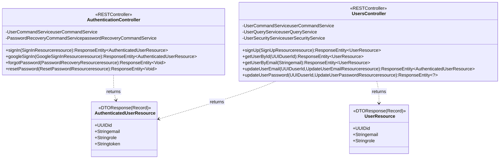

##### 2.6.2.3.1. REST Controllers & DTO Resources

##### Class: `AuthenticationController`
* **Ruta Base:** `/api/v1/authentication`
* **Anotaciones:** `@RestController`, `@RequestMapping("/api/v1/authentication")`, `@Tag(name = "Authentication")`.
* **Endpoints y Métodos:**
  * `POST /sessions` (`signIn`):
    * Recibe `@Valid @RequestBody SignInResource`. Transforma a `SignInCommand`, delega en `userCommandService.handle(signInCommand)`. Si está vacío retorna `401 Unauthorized`; si es exitoso retorna `200 OK` con `AuthenticatedUserResource`.
  * `POST /sessions/google` (`googleSignIn`):
    * Recibe `@Valid @RequestBody GoogleSignInResource`. Transforma a `GoogleSignInCommand`, delega en `userCommandService.handle()`. Si está vacío retorna `401 Unauthorized`; si es exitoso retorna `200 OK` con `AuthenticatedUserResource`.
  * `POST /password-recoveries` (`forgotPassword`):
    * Recibe `@Valid @RequestBody PasswordRecoveryResource`. Transforma a `GeneratePasswordRecoveryTokenCommand`, delega en `passwordRecoveryCommandService.handle()` y retorna `200 OK` vacío (`ResponseEntity.ok().build()`).
  * `POST /password-resets` (`resetPassword`):
    * Recibe `@Valid @RequestBody ResetPasswordResource`. Transforma a `ResetPasswordCommand`, delega en `passwordRecoveryCommandService.handle()` y retorna `200 OK` vacío (`ResponseEntity.ok().build()`).

##### Class: `UsersController`
* **Ruta Base:** `/api/v1/users`
* **Anotaciones:** `@RestController`, `@RequestMapping("/api/v1/users")`, `@Tag(name = "Users")`, `@PreAuthorize("isAuthenticated()")`.
* **Endpoints y Métodos:**
  * `POST /` (`signUp`):
    * `@PreAuthorize("permitAll()")`. Recibe `@Valid @RequestBody SignUpResource`. Transforma a `SignUpCommand`, delega en `userCommandService.handle(signUpCommand)`. Si falla retorna `400 Bad Request`; si es exitoso retorna `201 Created` con el cuerpo `UserResource`.
  * `GET /{userId}` (`getUserById`):
    * `@PreAuthorize("isAuthenticated() and @userSecurityService.isCurrentUser(#userId)")`. Recibe `@PathVariable UUID userId`. Emite `GetUserByIdQuery`. Si no existe retorna `404 Not Found`; si existe retorna `200 OK` con `UserResource`.
  * `GET /` (`getUserByEmail`):
    * Recibe `@RequestParam(name = "email") String email`. Emite `GetUserByEmailQuery`. Si no existe retorna `404 Not Found`. Valida que `@userSecurityService.isCurrentUser(user.getId().value())` sea verdadero; de lo contrario retorna `403 Forbidden`. Retorna `200 OK` con `UserResource`.
  * `PUT /{userId}/email` (`updateUserEmail`):
    * `@PreAuthorize("isAuthenticated() and @userSecurityService.isCurrentUser(#userId)")`. Recibe `UpdateUserEmailResource`. Transforma a `UpdateUserEmailCommand`, delega en `userCommandService.handle()`. Si falla retorna `400 Bad Request`; si tiene éxito retorna `200 OK` con `AuthenticatedUserResource` (incluyendo el nuevo JWT regenerado).
  * `PUT /{userId}/password` (`updateUserPassword`):
    * `@PreAuthorize("isAuthenticated() and @userSecurityService.isCurrentUser(#userId)")`. Recibe `UpdateUserPasswordResource`. Transforma a `UpdateUserPasswordCommand`. Si falla retorna `400 Bad Request`; si tiene éxito retorna `200 OK`.

---

##### 3.2. Resources (DTOs) & Assemblers

* **`UserResource(UUID id, String email, String role)`**: Record inmutable de respuesta para datos públicos de usuario.
* **`AuthenticatedUserResource(UUID id, String email, String role, String token)`**: Record inmutable de respuesta que incluye el token Bearer JWT tras el login exitoso.
* **`SignUpResource(String email, String password)`**: DTO de entrada con `@NotBlank @Email` y `@NotBlank @Size(min = 8)`.
* **`SignInResource(String email, String password)`**: DTO de entrada con `@NotBlank @Email` y `@NotBlank`.
* **`GoogleSignInResource(String idToken)`**: DTO de entrada con `@NotBlank String idToken`.
* **`PasswordRecoveryResource(String email)`**: DTO de entrada con `@NotBlank @Email String email`.
* **`ResetPasswordResource(String token, String newPassword)`**: DTO de entrada con `@NotBlank String token` y `@NotBlank @Size(min = 8) String newPassword`.
* **`UpdateUserEmailResource(String email)`**: DTO de entrada con `@NotBlank @Email String email`.
* **`UpdateUserPasswordResource(String currentPassword, String newPassword)`**: DTO de entrada con `@NotBlank String currentPassword` y `@NotBlank @Size(min = 8) String newPassword`.
* **Assemblers Estáticos:**
  * `SignUpCommandFromResourceAssembler.toCommandFromResource(resource)`
  * `SignInCommandFromResourceAssembler.toCommandFromResource(resource)`
  * `GoogleSignInCommandFromResourceAssembler.toCommandFromResource(resource)`
  * `GeneratePasswordRecoveryTokenCommandFromResourceAssembler.toCommandFromResource(resource)`
  * `ResetPasswordCommandFromResourceAssembler.toCommandFromResource(resource)`
  * `UpdateUserEmailCommandFromResourceAssembler.toCommandFromResource(userId, resource)`
  * `UpdateUserPasswordCommandFromResourceAssembler.toCommandFromResource(userId, resource)`
  * `UserResourceFromEntityAssembler.toResourceFromEntity(user)`
  * `AuthenticatedUserResourceFromEntityAssembler.toResourceFromEntity(authenticatedUser)`

---

#### 2.6.2.4. Infrastructure Layer (Capa de Infraestructura)

La Capa de Infraestructura implementa la persistencia física en PostgreSQL 18 con Spring Data JPA, el filtrado de seguridad con Spring Security, el hashing BCrypt y la integración con SMTP y Google Identity Services.

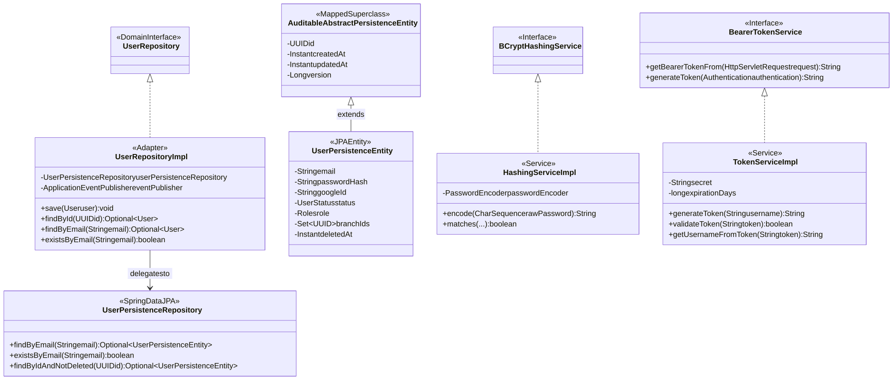

##### 2.6.2.4.1. Persistence & Security Adapters

##### Class: `AuditableAbstractPersistenceEntity`
* **Tipo:** `@MappedSuperclass` con listener `@EntityListeners(AuditingEntityListener.class)`.
* **Propósito:** Provee los campos comunes de identidad, auditoría y control de concurrencia optimista para las entidades relacionales de la plataforma:
  * `@Id @GeneratedValue(strategy = GenerationType.UUID) @Column(columnDefinition = "uuid", updatable = false, nullable = false) private UUID id;`
  * `@CreatedDate @Column(name = "created_at", nullable = false, updatable = false) private Instant createdAt;`
  * `@LastModifiedDate @Column(name = "updated_at", nullable = false) private Instant updatedAt;`
  * `@Version @Column(name = "version") private Long version;`

##### Class: `UserPersistenceEntity`
* **Tipo:** Entidad JPA (`@Entity`, `@Table(name = "users")`) que extiende de `AuditableAbstractPersistenceEntity`.
* **Mapeo de Columnas:**
  * `@Column(name = "email", nullable = false, unique = true, length = 100) private String email;`
  * `@Column(name = "password_hash", nullable = false) private String passwordHash;`
  * `@Column(name = "google_id", unique = true) private String googleId;`
  * `@Enumerated(EnumType.STRING) @Column(name = "status", nullable = false, length = 20) private UserStatus status = UserStatus.ACTIVE;`
  * `@Enumerated(EnumType.STRING) @Column(name = "role", nullable = false, length = 30) private Roles role = Roles.ROLE_USER;`
  * `@ElementCollection(fetch = FetchType.EAGER) @CollectionTable(name = "user_branches", joinColumns = @JoinColumn(name = "user_id")) @Column(name = "branch_id") private Set<UUID> branchIds;`
  * `@Column(name = "deleted_at") private Instant deletedAt;`

##### Class: `PasswordRecoveryTokenPersistenceEntity`
* **Tipo:** Entidad JPA (`@Entity`, `@Table(name = "password_recovery_tokens")`).
* **Mapeo de Columnas:**
  * `@Id @Column(columnDefinition = "uuid", updatable = false, nullable = false) private UUID id;`
  * `@Column(name = "token_hash", nullable = false) private String tokenHash;`
  * `@Column(name = "user_id", nullable = false) private UUID userId;`
  * `@Column(name = "created_at", nullable = false, updatable = false) private Instant createdAt;`
  * `@Column(name = "expires_at", nullable = false, updatable = false) private Instant expiresAt;`
  * `@Column(name = "is_used", nullable = false) private boolean isUsed = false;`

##### Interface: `UserPersistenceRepository`
* **Tipo:** Interfaz de Spring Data JPA (`JpaRepository<UserPersistenceEntity, UUID>`).
* **Consultas JPQL con soporte Soft-Delete:**
  * `@Query("SELECT u FROM UserPersistenceEntity u WHERE u.email = :email AND u.deletedAt IS NULL") Optional<UserPersistenceEntity> findByEmail(@Param("email") String email);`
  * `@Query("SELECT COUNT(u) > 0 FROM UserPersistenceEntity u WHERE u.email = :email AND u.deletedAt IS NULL") boolean existsByEmail(@Param("email") String email);`
  * `@Query("SELECT u FROM UserPersistenceEntity u WHERE u.id = :id AND u.deletedAt IS NULL") Optional<UserPersistenceEntity> findByIdAndNotDeleted(@Param("id") UUID id);`

##### Class: `UserRepositoryImpl`
* **Tipo:** Adaptador de repositorio que implementa `com.tuxlogic.shiftiq.platform.iam.domain.repositories.UserRepository`.
* **Lógica:**
  * En `save(User user)`: Busca o crea `UserPersistenceEntity`, mapea con `UserPersistenceAssembler.toEntity(user, entity)`, persiste vía `userPersistenceRepository.save(entity)`, itera sobre `user.domainEvents()` publicándolos mediante `eventPublisher.publishEvent()` y limpia los eventos con `user.clearDomainEvents()`.
  * En `findById(UUID id)`: Invoca `userPersistenceRepository.findByIdAndNotDeleted(id).map(UserPersistenceAssembler::toDomain)`.
  * En `findByEmail(String email)`: Invoca `userPersistenceRepository.findByEmail(email).map(UserPersistenceAssembler::toDomain)`.
  * En `existsByEmail(String email)`: Invoca `userPersistenceRepository.existsByEmail(email)`.

##### Class: `PasswordRecoveryTokenRepositoryImpl`
* **Tipo:** Adaptador que implementa `PasswordRecoveryTokenRepository`.
* **Lógica:**
  * En `save(PasswordRecoveryToken token)`: Mapea a `PasswordRecoveryTokenPersistenceEntity` y guarda mediante `tokenPersistenceRepository.save()`.
  * En `findByTokenHash(String tokenHash)`: Busca en la base de datos y mapea a dominio mediante `PasswordRecoveryTokenPersistenceAssembler.toDomain()`.

##### Classes: `UserPersistenceAssembler` y `PasswordRecoveryTokenPersistenceAssembler`
* Mapeadores estáticos que transfieren datos bidireccionalmente entre los agregados de dominio y las entidades JPA relacionales.

---

##### 4.2. Security & Authorization (Spring Security, JWT & RBAC)

##### Class: `WebSecurityConfiguration`
* **Anotaciones:** `@Configuration`, `@EnableMethodSecurity`.
* **Cadena de Filtros (`SecurityFilterChain`):**
  * Deshabilita CSRF (`csrf.disable()`) por ser una API REST stateless.
  * Define `SessionCreationPolicy.STATELESS`.
  * Configura CORS autorizando los dominios cliente (`app.frontend.url`, `localhost:5173`, etc.).
  * **Rutas Públicas Permitidas (`permitAll()`):**
    * `POST /api/v1/users` (Registro / Sign Up).
    * `/api/v1/authentication/**` (Inicio de sesión, OAuth Google, recuperación y reseteo).
    * `/v3/api-docs/**`, `/swagger-ui/**`, `/swagger-ui.html` (Documentación OpenAPI).
  * **Rutas Protegidas:** `anyRequest().authenticated()`.
  * Registra `BearerAuthorizationRequestFilter` antes de `UsernamePasswordAuthenticationFilter`.

##### Class: `BearerAuthorizationRequestFilter`
* **Propósito:** `OncePerRequestFilter` que extrae el token Bearer de la cabecera HTTP `Authorization`, lo valida con `tokenService.validateToken(token)`, extrae el email (`getUsernameFromToken`), carga los detalles con `userDetailsService.loadUserByUsername(email)` y establece la autenticación mediante `UsernamePasswordAuthenticationTokenBuilder.build(userDetails, request)` en `SecurityContextHolder`.

##### Class: `UsernamePasswordAuthenticationTokenBuilder`
* **Propósito:** Clase utilitaria con método estático `build(UserDetails principal, HttpServletRequest request)` que instancia `UsernamePasswordAuthenticationToken` asignando los detalles web (`WebAuthenticationDetailsSource`).

##### Class: `UserSecurityService`
* **Ubicación:** `com.tuxlogic.shiftiq.platform.shared.infrastructure.security.UserSecurityService`.
* **Propósito:** Servicio de seguridad inyectado en expresiones SpEL (`@PreAuthorize("@userSecurityService.isCurrentUser(#userId)")`) para verificar en tiempo de ejecución si el usuario autenticado coincide con el propietario del recurso solicitado, asegurando aislamiento de datos multi-tenant.

##### Class: `UserDetailsServiceImpl` y `UserDetailsImpl`
* **`UserDetailsImpl`**: Implementa `UserDetails` de Spring Security. Contiene `id: UUID`, `username: String`, `password: String`, `authorities: Collection<GrantedAuthority>`, `branchIds: Set<UUID>`, y `enabled: boolean` (calculado mediante `user.getStatus() == UserStatus.ACTIVE`).
* **`UserDetailsServiceImpl`**: Carga el usuario mediante `userRepository.findByEmail(username)` y construye el `UserDetailsImpl`.

##### Class: `UnauthorizedRequestHandlerEntryPoint`
* **Propósito:** Implementa `AuthenticationEntryPoint`. Intercepta peticiones no autenticadas ejecutando `response.sendError(HttpServletResponse.SC_UNAUTHORIZED, "Unauthorized request detected")`.

---

##### 4.3. Outbound Services Implementation

##### Interface: `BCryptHashingService` / Class: `HashingServiceImpl`
* **`BCryptHashingService`**: Interfaz de infraestructura que extiende tanto de `HashingService` (puerto de aplicación) como de `org.springframework.security.crypto.password.PasswordEncoder`.
* **`HashingServiceImpl`**: Servicio anotado con `@Service` que delega en una instancia de `BCryptPasswordEncoder` para encriptar y verificar contraseñas con sal aleatoria.

##### Interface: `BearerTokenService` / Class: `TokenServiceImpl`
* **`BearerTokenService`**: Interfaz de infraestructura que extiende de `TokenService` y agrega los métodos `String getBearerTokenFrom(HttpServletRequest request)` y `String generateToken(Authentication authentication)`.
* **`TokenServiceImpl`**: Implementación basada en la librería **JJWT** (`io.jsonwebtoken`). Firma tokens HMAC-SHA256 (`subject(username)`, sin claims extra de `userId`/`role`/`status` en el JWT crudo) utilizando la clave secreta `authorization.jwt.secret` y la vigencia configurada en `authorization.jwt.expiration.days`.

##### Class: `SmtpEmailService`
* **Propósito:** Implementación del puerto `EmailService` mediante `org.springframework.mail.javamail.JavaMailSender`.
* **Lógica:** Implementa `sendPasswordRecoveryEmail(String to, String token)` creando un `SimpleMailMessage` con el remitente configurado en `spring.mail.username`, el asunto localizado internacionalizado mediante `MessageSource` (`email.recovery.subject`, con fallback *"Recuperación de Contraseña - Atelier"*) y el cuerpo del mensaje internacionalizado (`email.recovery.body`) conteniendo la URL base del frontend (`app.frontend.url`) y el token de recuperación.

---

#### 2.6.2.5. C4 Model Component Diagram

En esta sección, el equipo explica y presenta el **Component Diagram de C4 Model (Nivel 3)** para el Container **Spring Boot REST API** en el Bounded Context de **IAM**. Este diagrama refleja la descomposición estructural del container para identificar sus bloques de construcción principales, sus interacciones internas y las conexiones con clientes externos y servicios de terceros.

##### 5.1. C4 Model Component Diagram (Container: Spring Boot REST API — IAM)

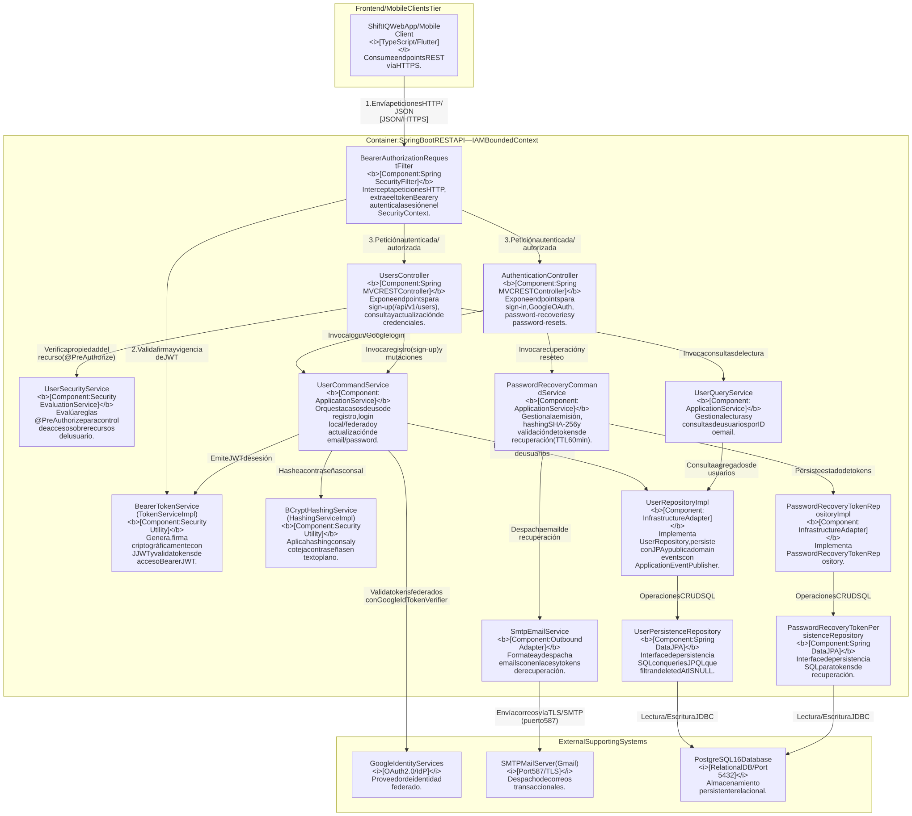

##### 5.2. Descomposición y Responsabilidad de Componentes

1. **`BearerAuthorizationRequestFilter` (Spring Security Filter)**:
   - *Qué es:* Filtro interceptor HTTP `OncePerRequestFilter`.
   - *Responsabilidades:* Inspecciona la cabecera HTTP `Authorization`, verifica el prefijo `Bearer `, valida criptográficamente la firma con `TokenService`, extrae el email del sujeto, carga autoridades con `UserDetailsService` y registra la sesión con `UsernamePasswordAuthenticationTokenBuilder` en el `SecurityContextHolder`.
   - *Tecnología:* Spring Security 6 / Servlet Filter.
2. **`AuthenticationController` & `UsersController` (Spring MVC REST Controllers)**:
   - *Qué es:* Controladores de presentación REST bajo `/api/v1/authentication` y `/api/v1/users`.
   - *Responsabilidades:* Manejar el ciclo de vida de peticiones HTTP, ejecutar validaciones declarativas `@Valid` (Jakarta Validation), transformar payloads JSON a Comandos/Queries mediante Assemblers y retornar respuestas HTTP (`200 OK`, `201 Created`, `400 Bad Request`, `401 Unauthorized`, `404 Not Found`).
   - *Nota Arquitectónica:* `signUp` reside en `UsersController` (`POST /api/v1/users`) con `@PreAuthorize("permitAll()")`, mientras que la gestión de sesiones y recuperación reside en `AuthenticationController` (`/sessions`, `/sessions/google`, `/password-recoveries`, `/password-resets`).
   - *Tecnología:* Spring Web MVC, Springdoc OpenAPI 3.
3. **`UserSecurityService` (Security Evaluation Service)**:
   - *Qué es:* Componente de autorización transversal ubicado en `shared.infrastructure.security`.
   - *Responsabilidades:* Valida en expresiones SpEL si el usuario autenticado coincide con el identificador del recurso objetivo (`isCurrentUser(#userId)`), impidiendo que un usuario acceda o modifique perfiles ajenos.
4. **`UserCommandService` & `PasswordRecoveryCommandService` (Application Services)**:
   - *Qué es:* Componentes de la capa de aplicación que orquestan los flujos transaccionales del negocio.
   - *Responsabilidades:* Coordinar la lógica de registro (validando unicidad de emails), login local (verificando hashes de passwords con BCrypt), autenticación federada (validando tokens contra Google con `GoogleIdTokenVerifier`), emisión de JWTs, y el flujo de recuperación de cuentas (generando tokens efímeros con TTL de 60 minutos, hashing SHA-256 y evitando enumeración de cuentas).
   - *Tecnología:* Spring Framework `@Service`, `@Transactional`.
5. **`UserQueryService` (Application Query Service)**:
   - *Qué es:* Servicio de aplicación dedicado a consultas de solo lectura.
   - *Responsabilidades:* Atender consultas inmutables de perfil de usuario (`GetUserByIdQuery`, `GetUserByEmailQuery`).
   - *Tecnología:* Spring Framework `@Service`, `@Transactional(readOnly = true)`.
6. **`BearerTokenService` & `BCryptHashingService` (Security Utilities)**:
   - *Qué es:* Interfaces e implementaciones especializadas en criptografía y seguridad.
   - *Responsabilidades:* `BearerTokenService` gestiona la firma digital HMAC-SHA256 y extracción de tokens Bearer de peticiones HTTP mediante **JJWT**. `BCryptHashingService` aplica hashing con sal aleatoria.
   - *Tecnología:* `io.jsonwebtoken` (JJWT 0.12.6), Spring Security Crypto (`BCryptPasswordEncoder`).
7. **`UserRepositoryImpl` & `PasswordRecoveryTokenRepositoryImpl` (Infrastructure Repositories)**:
   - *Qué es:* Adaptadores de infraestructura que implementan los contratos `UserRepository` y `PasswordRecoveryTokenRepository`.
   - *Responsabilidades:* Persistir en PostgreSQL mediante Spring Data JPA, mapear bidireccionalmente con Assemblers de persistencia y despachar eventos de dominio acumulados tras el guardado utilizando `ApplicationEventPublisher`.
   - *Tecnología:* Spring Data JPA, Hibernate ORM, PostgreSQL JDBC Driver.

---

#### 2.6.2.6. Bounded Context Software Architecture Code Level Diagrams

En esta sección se presentan y explican los diagramas de máximo nivel de detalle técnico sobre la implementación de componentes en el Bounded Context de **IAM**, divididos en el **Diagrama de Clases del Domain Layer** y el **Diagrama de Base de Datos Relacional**.

##### 2.6.2.6.1. Domain Layer Class Diagram

En esta sección se presenta el **Class Diagram de UML** para las clases que componen el **Domain Layer** del Bounded Context de IAM, reflejando fielmente las clases, métodos, tipos de retorno y parámetros del código fuente real:

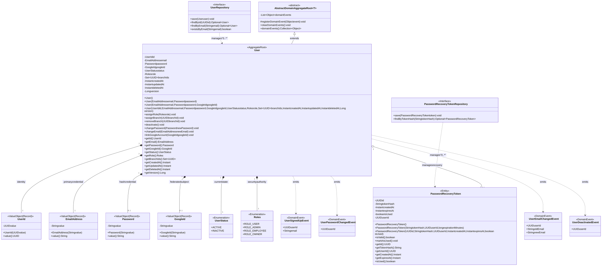

###### Explicación del Diagrama de Clases del Dominio:
- **`User` como Aggregate Root**: Encapsula todas las invariantes de identidad. No permite mutaciones directas de estado (los atributos son privados `-`), exponiendo únicamente métodos de negocio que validan las reglas y registran Domain Events protegidos mediante `#registerDomainEvent()`.
- **Value Objects**: Garantizan inmutabilidad y auto-validación desde su instanciación (`UserId`, `EmailAddress`, `Password`, `GoogleId`).
- **Enumeración `Roles`**: Define estrictamente los 4 roles soportados por el backend: `ROLE_USER`, `ROLE_ADMIN`, `ROLE_EMPLOYEE` y `ROLE_OWNER`.
- **Contratos de Repositorio**: `UserRepository` declara métodos con tipos de búsqueda estándar (`UUID id`, `String email`) y retorno `void` en `save()`, optimizando el consumo directo en servicios de aplicación.

---

##### 2.6.2.6.2. Database Design Diagram (PostgreSQL 18)

El siguiente diagrama Entidad-Relación (**Database Diagram**) describe con exactitud el esquema relacional desplegado en **PostgreSQL 18** para soportar la persistencia de información de los objetos de **IAM**. Se especifican tablas, columnas, tipos de datos físicos, constraints (`PRIMARY KEY`, `FOREIGN KEY`, `UNIQUE`, `NOT NULL`) y relaciones de cardinalidad:

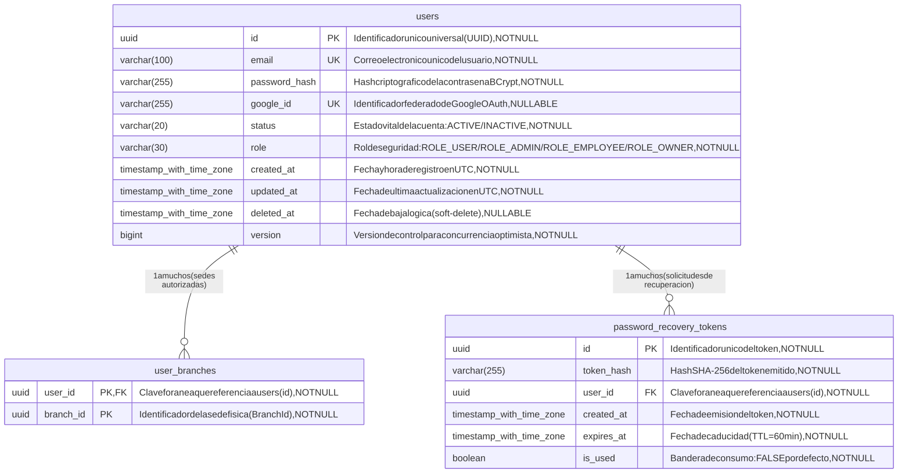

###### Explicación Técnica de la Base de Datos y Normalización:
1. **Tabla `users`**:
   - **Primary Key:** `id` de tipo `uuid` generado en la capa de persistencia (`@GeneratedValue(strategy = GenerationType.UUID)`).
   - **Columna `password_hash`:** Almacena la contraseña hasheada con BCrypt (`NOT NULL`).
   - **Unique Constraints:** `email` posee índice único; `google_id` posee índice único para asociar un único perfil federado por cuenta.
   - **Auditoría y Concurrencia:** Extiende de `AuditableAbstractPersistenceEntity` proveyendo `created_at` y `updated_at` automáticos. `version` (`bigint`) previene colisiones concurrentes mediante `@Version`.
   - **Soft Delete:** El campo `deleted_at` almacena la fecha de baja lógica. Las consultas de persistencia (`UserPersistenceRepository`) aplican automáticamente `WHERE u.deletedAt IS NULL`.
2. **Tabla `user_branches`**:
   - Implementa la colección `@ElementCollection` de sedes autorizadas para el usuario.
   - Primary Key compuesta: `(user_id, branch_id)`.
   - Foreign Key: `user_id` referencia a `users(id)` asegurando integridad referencial.
3. **Tabla `password_recovery_tokens`**:
   - `id` (`uuid`, PK): Identificador único del registro.
   - `token_hash` (`varchar(255)`): Almacena el hash digest SHA-256 del token plano generado aleatoriamente.
   - `user_id` (`uuid`, FK): Clave foránea que referencia a `users(id)`.
   - `expires_at`: Fija la expiración por defecto a 60 minutos (`@Value("${password.recovery.token.expiration.minutes:60}")`).
   - `is_used`: Bandera booleana inicializada en `false` que transiciona a `true` tras el primer reseteo exitoso.

---

### 2.6.3. Bounded Context: Operations (Work Orders & Services)

El **Bounded Context `Operations`** es el motor operativo principal de la plataforma **ShiftIQ**. Gestiona el flujo de trabajo completo del taller automotriz: desde la definición del catálogo de servicios ofreciendo precios y mantenimiento (`Service`), la emisión y control del ciclo de vida de Órdenes de Trabajo (`WorkOrder`), la orquestación de tareas asignadas a mecánicos (`WorkOrderTask`), hasta el consumo y reserva de repuestos/productos de inventario (`WorkOrderTaskProduct`).

#### 2.6.3.1. Domain Layer (Capa de Dominio)

La Capa de Dominio encapsula el modelo de negocio inmutable, asegurando transiciones estrictas de estado para las órdenes de trabajo y tareas mediante métodos **Factory**, reglas de negocio encapsuladas en el Agregado `WorkOrder`, el cálculo dinámico de costos y la emisión de eventos de dominio.

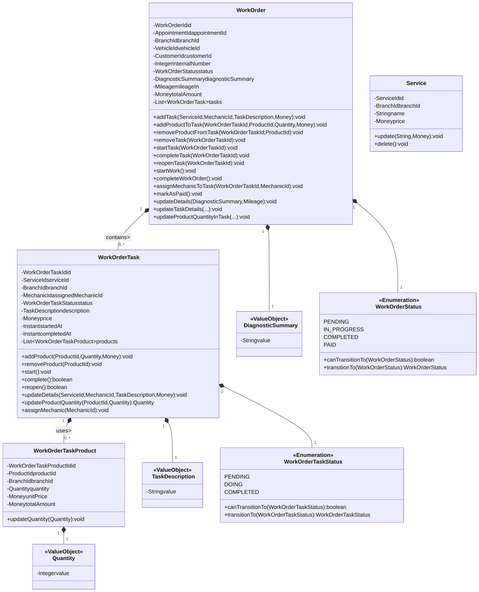

---

##### 2.6.3.1.1. Aggregates & Entities

####  Record: `DiagnosticSummary(String value)`
* **Propósito:** Resumen del diagnóstico técnico de recepción del vehículo.
* **Validaciones:**
  * No puede ser nulo ni estar en blanco (`operations.error.diagnosticSummary.notBlank`).
  * Longitud máxima: 2000 caracteres (`operations.error.diagnosticSummary.tooLong`).

####  Record: `TaskDescription(String value)`
* **Propósito:** Instrucciones detalladas de trabajo enviadas al mecánico.
* **Validaciones:**
  * No puede ser nulo ni estar en blanco (`operations.error.taskDescription.required`).
  * Longitud mínima: 10 caracteres (`operations.error.taskDescription.tooShort`).
  * Longitud máxima: 1000 caracteres (`operations.error.taskDescription.tooLong`).

####  Record: `Quantity(Integer value)`
* **Propósito:** Cantidad entera de productos/repuestos consumidos en una tarea.
* **Validaciones:** No puede ser nulo y debe ser estrictamente mayor a cero (`operations.error.quantity.required`, `operations.error.quantity.mustBeGreaterThanZero`).

####  Enum: `WorkOrderStatus`
* **Valores:** `PENDING`, `IN_PROGRESS`, `COMPLETED`, `PAID`.
* **Métodos:**
  * `canTransitionTo(WorkOrderStatus next)`: Evalúa la validez del cambio de estado.
  * `transitionTo(WorkOrderStatus next)`: Aplica la transición o lanza `IllegalStateException` si es inválida.
* **Reglas de Transición Inmutables:**
  * `PENDING` ➔ `IN_PROGRESS`
  * `IN_PROGRESS` ➔ `COMPLETED`
  * `COMPLETED` ➔ `PAID` o `IN_PROGRESS` (si se reabre una tarea)
  * `PAID` ➔ Estado final inmutable (retorna `false` para cualquier cambio).

####  Enum: `WorkOrderTaskStatus`
* **Valores:** `PENDING`, `DOING`, `COMPLETED`.
* **Métodos:**
  * `canTransitionTo(WorkOrderTaskStatus next)`: Evalúa la validez del cambio de estado.
  * `transitionTo(WorkOrderTaskStatus next)`: Aplica la transición o lanza `IllegalStateException` si es inválida.
* **Reglas de Transición:**
  * `PENDING` ➔ `DOING`
  * `DOING` ➔ `COMPLETED`
  * `COMPLETED` ➔ `DOING` (reapertura)

####  Sealed Failures ADT: `WorkOrderCommandFailure`
* **Definición:** Sealed Interface (`permits NotFound, InvalidState, Duplicate`).
* **Variantes:**
  * `NotFound(String message)`
  * `InvalidState(String message)`
  * `Duplicate(String message)`

####  Sealed Failures ADT: `ServiceCommandFailure`
* **Definición:** Sealed Interface (`permits NotFound, InvalidData`).
* **Variantes:**
  * `NotFound(String message)`
  * `InvalidData(String message)`

####  Identificadores Fuertemente Tipados (Strongly Typed IDs)
* **Propios de Operations:** `WorkOrderId`, `WorkOrderTaskId`, `WorkOrderTaskProductId`, `ServiceId`, `MechanicId`, `AppointmentId`, `ProductId`.
* **Compartidos (`shared`):** `BranchId`, `VehicleId`, `CustomerId`, `Money`, `Mileage`.

---

##### 2.6.3.1.2. Value Objects & Records

####  Aggregate: `WorkOrder`
* **Hereda de:** `AbstractDomainAggregateRoot<WorkOrder>`
* **Propósito:** Raíz de agregado que representa una Orden de Trabajo completa.
* **Reglas de Negocio:**
  * Si la orden está en estado `COMPLETED` o `PAID`, no permite agregar, modificar ni eliminar tareas ni productos (`WORK_ORDER_CANNOT_MODIFY_CLOSED`).
  * Si está en `PAID`, no permite reapertura ni eliminación (`WORK_ORDER_CANNOT_DELETE_PAID`, `WORK_ORDER_CANNOT_REOPEN_PAID`).
  * Recalcula automáticamente su `totalAmount` como la suma de los precios de todas sus tareas activas (mano de obra + repuestos).
  * Emite eventos de reserva y cancelación de stock para el contexto de Inventario.

####  Entity: `WorkOrderTask`
* **Propósito:** Entidad que representa una tarea individual dentro de la orden de trabajo.
* **Reglas de Negocio:**
  * Si la tarea está `COMPLETED`, se bloquea cualquier modificación directa (`TASK_CANNOT_MODIFY_COMPLETED`).
  * Mantiene su propio costo total (`price`), calculado sumando el costo de mano de obra inicial con los montos totales de repuestos asignados (`WorkOrderTaskProduct`).

####  Entity: `WorkOrderTaskProduct`
* **Propósito:** Entidad que representa un repuesto/producto de inventario consumido en una tarea.
* **Reglas de Negocio:** Calcula `totalAmount = unitPrice * quantity`.

####  Aggregate: `Service`
* **Hereda de:** `AbstractDomainAggregateRoot<Service>`
* **Propósito:** Representa un servicio ofrecido en el catálogo del taller (ej. "Cambio de Aceite Synthetic 5W-30").

---

##### 2.6.3.1.3. Enumerations

* **Propios de Operations:**
  * `TaskStartedEvent`: Emitido al iniciar el trabajo físico de una tarea.
  * `TaskCompletedEvent`: Emitido cuando un mecánico completa una tarea.
  * `TaskReopenedEvent`: Emitido al reabrir una tarea completada.
  * `WorkOrderCompletedEvent`: Emitido cuando todas las tareas finalizan y la orden pasa a `COMPLETED`.
  * `WorkOrderPaidEvent`: Emitido al marcar la orden como `PAID`, notificando el despacho final de inventario.
* **Compartidos (`shared`) emitidos por Operations:**
  * `ProductReservedEvent`: Notifica a Inventario para reservar stock al agregar productos a una tarea.
  * `ProductReservationCanceledEvent`: Notifica a Inventario para liberar stock reservado al remover productos o tareas.

---

##### 2.6.3.1.4. Domain Repositories (Interfaces)

* `WorkOrderRepository`:
  * `WorkOrder save(WorkOrder workOrder)`
  * `Optional<WorkOrder> findById(WorkOrderId id)`
  * `Optional<WorkOrder> findByTaskId(WorkOrderTaskId taskId)`
  * `List<WorkOrder> findAllByBranchId(BranchId branchId)`
  * `Optional<WorkOrder> findByAppointmentId(AppointmentId appointmentId)`
  * `boolean existsByAppointmentId(AppointmentId appointmentId)`
  * `List<WorkOrder> findAllByCustomerId(CustomerId customerId)`
  * `List<WorkOrder> findAllByVehicleId(VehicleId vehicleId)`
  * `Optional<WorkOrder> findByInternalNumberAndBranchId(Integer internalNumber, BranchId branchId)`
  * `int findMaxInternalNumberByBranchId(BranchId branchId)`
* `ServiceRepository`:
  * `Service save(Service service)`
  * `Optional<Service> findById(ServiceId id)`
  * `List<Service> findAllByBranchId(BranchId branchId)`
  * `void delete(Service service)`

---

#### 2.6.3.2. Application Layer (Capa de Aplicación)

La Capa de Aplicación expone la ejecución de casos de uso mediante un contrato genérico `Result<WorkOrder, WorkOrderCommandFailure>`, garantizando un manejo funcional de errores sin excepciones no controladas.

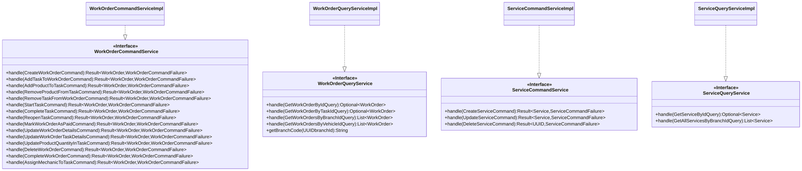

---

##### 2.6.3.2.1. Commands & Queries (DTOs de Aplicación)

#### Commands
*  **`CreateWorkOrderCommand(AppointmentId appointmentId, BranchId branchId, VehicleId vehicleId, CustomerId customerId, DiagnosticSummary diagnosticSummary, Mileage mileageIn)`**
*  **`AddTaskToWorkOrderCommand(WorkOrderId workOrderId, ServiceId serviceId, MechanicId mechanicId, TaskDescription description)`**
*  **`AddProductToTaskCommand(WorkOrderId workOrderId, WorkOrderTaskId taskId, ProductId productId, Quantity quantity)`**
*  **`RemoveProductFromTaskCommand(WorkOrderId workOrderId, WorkOrderTaskId taskId, ProductId productId)`**
*  **`RemoveTaskFromWorkOrderCommand(WorkOrderId workOrderId, WorkOrderTaskId taskId)`**
*  **`StartTaskCommand(WorkOrderId workOrderId, WorkOrderTaskId taskId)`**
*  **`CompleteTaskCommand(WorkOrderId workOrderId, WorkOrderTaskId taskId)`**
*  **`ReopenTaskCommand(WorkOrderId workOrderId, WorkOrderTaskId taskId)`**
*  **`MarkWorkOrderAsPaidCommand(WorkOrderId workOrderId)`**
*  **`UpdateWorkOrderDetailsCommand(WorkOrderId workOrderId, DiagnosticSummary diagnosticSummary, Mileage mileageIn)`**
*  **`UpdateWorkOrderTaskDetailsCommand(WorkOrderId workOrderId, WorkOrderTaskId taskId, ServiceId serviceId, MechanicId mechanicId, TaskDescription description)`**
*  **`UpdateProductQuantityInTaskCommand(WorkOrderId workOrderId, WorkOrderTaskId taskId, ProductId productId, Quantity newQuantity)`**
*  **`DeleteWorkOrderCommand(WorkOrderId workOrderId)`**
*  **`CompleteWorkOrderCommand(WorkOrderId workOrderId)`**
*  **`AssignMechanicToTaskCommand(WorkOrderId workOrderId, WorkOrderTaskId taskId, MechanicId mechanicId)`**
*  **`CreateServiceCommand(BranchId branchId, String name, Money price)`**
*  **`UpdateServiceCommand(ServiceId serviceId, String name, Money price)`**
*  **`DeleteServiceCommand(ServiceId serviceId)`**

#### Queries
*  **`GetWorkOrderByIdQuery(WorkOrderId id)`**
*  **`GetWorkOrderByTaskIdQuery(WorkOrderTaskId taskId)`**
*  **`GetWorkOrdersByBranchIdQuery(BranchId branchId)`**
*  **`GetWorkOrdersByVehicleIdQuery(VehicleId vehicleId)`**
*  **`GetServiceByIdQuery(ServiceId id)`**
*  **`GetAllServicesByBranchIdQuery(BranchId branchId)`**

---

#### 2.6.3.3. Interface Layer (Capa de Interfaces)

La Capa de Interfaz expone endpoints RESTful con Swagger/OpenAPI, internacionalización de respuestas mediante `MessageSource` y mapeo de identificadores amigables (`WO-001`).

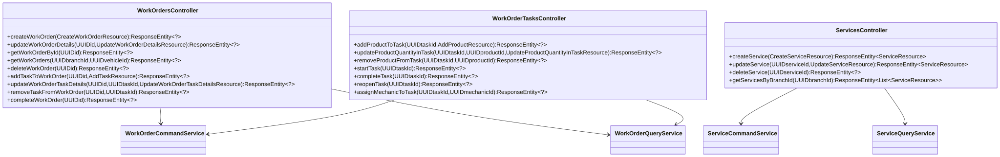

---

##### 2.6.3.3.1. REST Controllers & DTO Resources

####  `WorkOrdersController` (`/api/v1/work-orders`)
* `POST /api/v1/work-orders`: Crea una orden de trabajo inicial para una sucursal y vehículo.
* `GET /api/v1/work-orders/{id}`: Obtiene el `WorkOrderResource` detallado con tareas y repuestos.
* `GET /api/v1/work-orders?branchId={branchId}`: Lista órdenes de trabajo por sucursal.
* `GET /api/v1/work-orders?vehicleId={vehicleId}`: Lista órdenes de trabajo por vehículo.
* `PUT /api/v1/work-orders/{id}`: Actualiza resumen diagnóstico y kilometraje de ingreso.
* `DELETE /api/v1/work-orders/{id}`: Eliminación lógica de la orden de trabajo.
* `POST /api/v1/work-orders/{id}/tasks`: Agrega una tarea de mecánica a la orden.
* `PUT /api/v1/work-orders/{id}/tasks/{taskId}`: Actualiza mano de obra o detalles de una tarea.
* `DELETE /api/v1/work-orders/{id}/tasks/{taskId}`: Remueve una tarea y libera reservas de stock.
* `POST /api/v1/work-orders/{id}/complete`: Marca la orden como `COMPLETED` si todas sus tareas finalizaron.

####  `WorkOrderTasksController` (`/api/v1/work-order-tasks`)
* `POST /api/v1/work-order-tasks/{taskId}/products`: Agrega un repuesto de inventario a la tarea.
* `PUT /api/v1/work-order-tasks/{taskId}/products/{productId}`: Actualiza la cantidad de repuestos de una tarea.
* `DELETE /api/v1/work-order-tasks/{taskId}/products/{productId}`: Remueve un repuesto de la tarea.
* `POST /api/v1/work-order-tasks/{taskId}/start`: Cambia el estado de la tarea a `DOING`.
* `POST /api/v1/work-order-tasks/{taskId}/complete`: Marca la tarea como `COMPLETED`.
* `POST /api/v1/work-order-tasks/{taskId}/reopen`: Reabre una tarea completada devolviéndola a `DOING`.
* `POST /api/v1/work-order-tasks/{taskId}/assign-mechanic?mechanicId={mechanicId}`: Asigna un mecánico a la tarea.

####  `ServicesController` (`/api/v1/services`)
* `POST /api/v1/services`: Registra un nuevo servicio en el catálogo de la sucursal.
* `GET /api/v1/services?branchId={branchId}`: Lista todos los servicios de una sucursal.
* `PUT /api/v1/services/{serviceId}`: Actualiza nombre y precio del servicio.
* `DELETE /api/v1/services/{serviceId}`: Eliminación lógica del servicio.

---

#### 2.6.3.4. Infrastructure Layer (Capa de Infraestructura)

Mapea los agregados y entidades de dominio a tablas relacionales de PostgreSQL 18 utilizando Spring Data JPA y `AttributeConverter` personalizados para Value Objects.

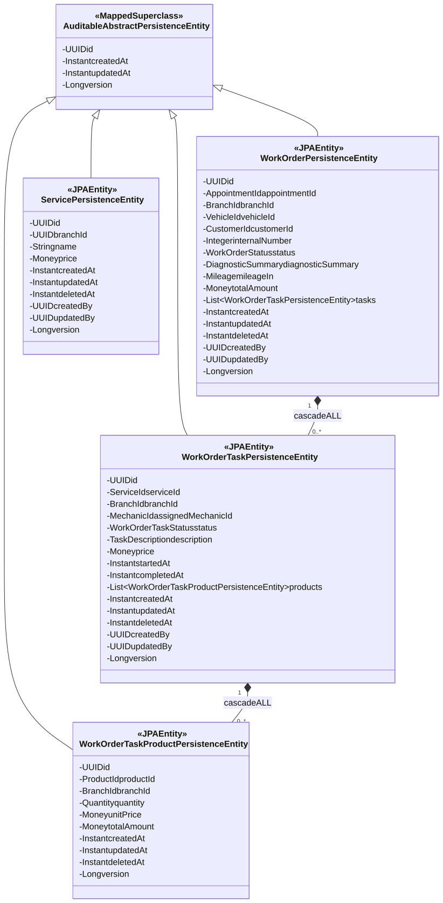

---

##### 2.6.3.4.1. Persistence & Security Adapters

Todas las entidades extienden de `AuditableAbstractPersistenceEntity` (`@MappedSuperclass`) con Soft Delete (`deleted_at`) y bloqueo optimista (`@Version`).

* **`work_orders`** (`WorkOrderPersistenceEntity`):
  * `appointment_id` (UUID, NOT NULL)
  * `branch_id` (UUID, NOT NULL)
  * `vehicle_id` (UUID, NOT NULL)
  * `customer_id` (UUID, NOT NULL)
  * `internal_number` (INTEGER, NOT NULL)
  * `status` (VARCHAR, Enum: `PENDING`, `IN_PROGRESS`, `COMPLETED`, `PAID`)
  * `diagnostic_summary` (TEXT, `DiagnosticSummaryAttributeConverter`)
  * `mileage_in` (DECIMAL/INTEGER, `MileageAttributeConverter`)
  * `total_amount` (DECIMAL, `MoneyAttributeConverter`)
* **`work_order_tasks`** (`WorkOrderTaskPersistenceEntity`):
  * `work_order_id` (UUID, FK, NOT NULL)
  * `service_id` (UUID, NOT NULL)
  * `branch_id` (UUID, NOT NULL)
  * `assigned_mechanic_id` (UUID, NOT NULL)
  * `status` (VARCHAR, Enum: `PENDING`, `DOING`, `COMPLETED`)
  * `description` (TEXT, `TaskDescriptionAttributeConverter`)
  * `price` (DECIMAL, `MoneyAttributeConverter`)
  * `started_at`, `completed_at` (TIMESTAMP).
* **`work_order_task_products`** (`WorkOrderTaskProductPersistenceEntity`):
  * `work_order_task_id` (UUID, FK, NOT NULL)
  * `product_id` (UUID, NOT NULL)
  * `branch_id` (UUID, NOT NULL)
  * `quantity` (INTEGER, `QuantityAttributeConverter`)
  * `unit_price`, `total_amount` (DECIMAL, `MoneyAttributeConverter`).
* **`services`** (`ServicePersistenceEntity`):
  * `branch_id` (UUID, NOT NULL)
  * `name` (VARCHAR, NOT NULL)
  * `price` (DECIMAL, `MoneyAttributeConverter`).

---

#### 2.6.3.5. C4 Model Component Diagram

El siguiente diagrama C4 descompone el Container API en sus componentes principales para el Bounded Context **Operations**.

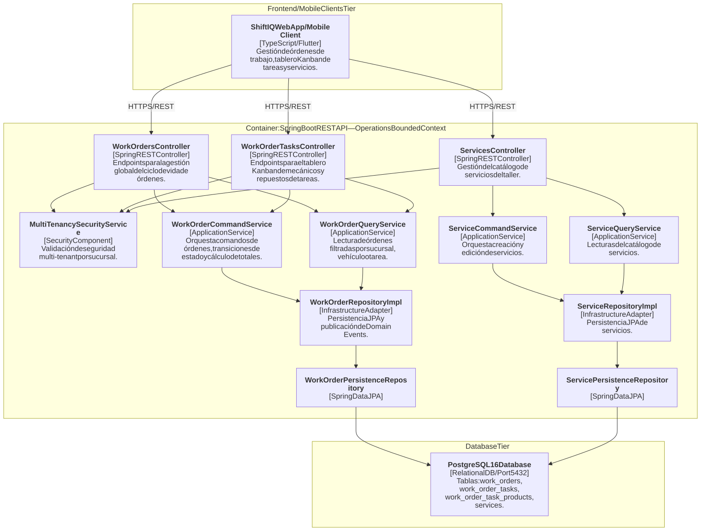

---

#### 2.6.3.6. Code Level Diagrams

#### 2.6.3.6. Code Level Diagrams

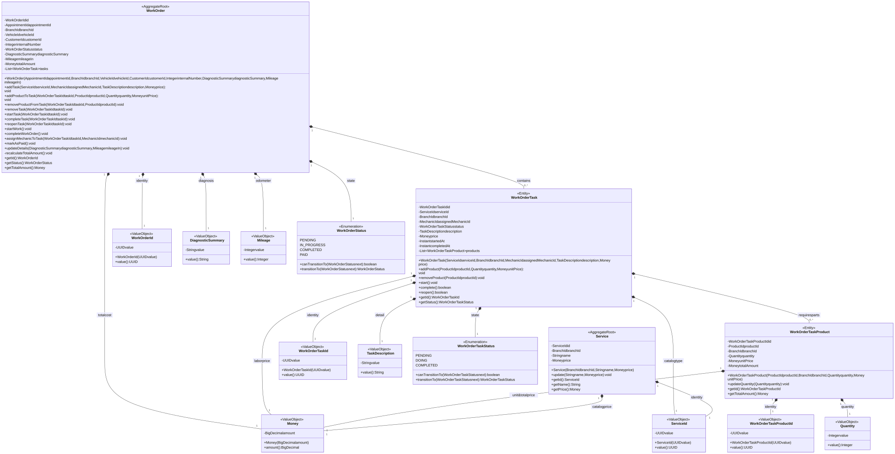

---

#### 2.6.3.6. Code Level Diagrams

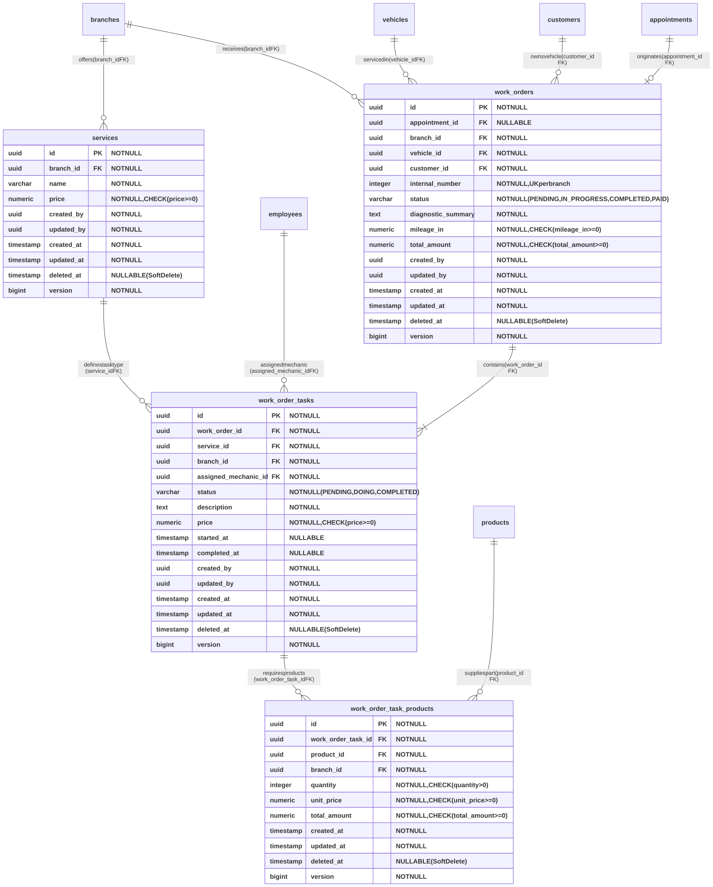

---

### 2.6.4. Bounded Context: Inventory (Stock & Products Management)

El **Bounded Context `Inventory`** administra el catálogo de repuestos, autopartes y consumibles del taller automotriz (`Product`), la gestión física de existencias mediante lotes de adquisición (`ProductBatch`), la evaluación automática de niveles de stock mínimo (`MinimumStockAlertEvaluationJob`), y la sincronización asíncrona de inventario respondiendo a las reservas y despachos producidos por las Órdenes de Trabajo del Bounded Context `Operations`.

---

#### 2.6.4.1. Domain Layer (Capa de Dominio)

La Capa de Dominio define las reglas inmutables del inventario, gestionando el stock disponible, la deducción FIFO encapsulada en el agregado `Product`, los métodos de creación y reconstitución (patrón **Factory**), la activación de alertas de bajo stock y las validaciones de negocio sin dependencias tecnológicas externas.

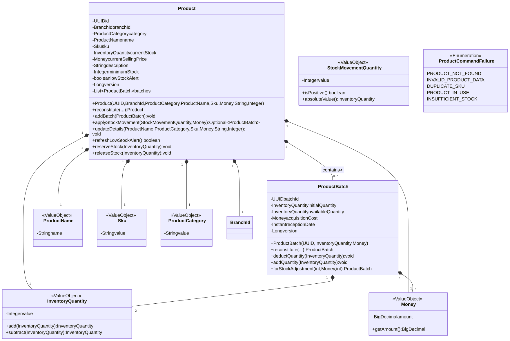

---

##### 2.6.4.1.1. Value Objects, Enums & Exceptions

##### Record: `BranchId(UUID value)`
* **Propósito:** Identificador único fuertemente tipado de la sucursal de taller asociada al inventario.
* **Validaciones:** No nulo.

##### Record: `Money(BigDecimal amount)`
* **Propósito:** Representa montos monetarios para precios de venta y costos de adquisición de lotes.
* **Validaciones:** `amount` no nulo y `>= 0`.
* **Métodos:** `getAmount()`.

##### Record: `ProductName(String name)`
* **Propósito:** Nombre comercial de la autoparte o repuesto.
* **Validaciones:** No puede ser nulo ni estar en blanco (`inventory.error.productName.required`).

##### Record: `Sku(String value)`
* **Propósito:** Stock Keeping Unit (código único de producto por sucursal).
* **Validaciones:** No puede ser nulo ni estar en blanco (`inventory.error.sku.required`).

##### Record: `ProductCategory(String value)`
* **Propósito:** Categoría o familia del producto (ej. "Frenos", "Filtros", "Lubricantes").
* **Validaciones:** No puede ser nulo ni estar en blanco (`inventory.error.productCategory.required`).

##### Record: `InventoryQuantity(Integer value)`
* **Propósito:** Cantidad entera no negativa en inventario.
* **Validaciones:** No nulo y `>= 0` (`inventory.error.quantity.invalid`).
* **Métodos:**
  * `add(InventoryQuantity)`: Suma cantidades.
  * `subtract(InventoryQuantity)`: Resta cantidades; lanza `IllegalArgumentException` si el resultado es negativo.

##### Record: `StockMovementQuantity(Integer value)`
* **Propósito:** Representa un movimiento o ajuste de inventario (positivo para ingresos, negativo para egresos).
* **Validaciones:** No nulo y distinto de cero.
* **Métodos:** `isPositive()`, `absoluteValue()`.

##### Enum: `ProductCommandFailure`
* **Valores:** `PRODUCT_NOT_FOUND`, `INVALID_PRODUCT_DATA`, `DUPLICATE_SKU`, `PRODUCT_IN_USE`, `INSUFFICIENT_STOCK`.

##### Excepción: `InsufficientStockException`
* Excepción de dominio lanzada cuando se intenta reservar o descontar más stock del disponible (`inventory.error.product.insufficientStock`).

---

##### 2.6.4.1.2. Aggregates & Entities

##### Aggregate Root: `Product`
* **Hereda de:** `org.springframework.data.domain.AbstractAggregateRoot<Product>` (Spring Data).
* **Propósito:** Raíz del agregado que representa un producto del inventario en una sucursal (`BranchId`). Su clave primaria es un `UUID id` directo.
* **Reglas de Negocio:**
  * Mantiene la lista de lotes físicos recibidos (`batches`).
  * `reserveStock(InventoryQuantity amount)`: Lógica pura de negocio que recorre los lotes activos (`ProductBatch`) en estricto orden FIFO (`receptionDate` ascendente) descontando existencias. Lanza `InsufficientStockException` si `currentStock < amount`.
  * `releaseStock(InventoryQuantity amount)`: Reingresa existencias a los lotes en caso de cancelación de reserva.
  * `refreshLowStockAlert()`: Compara `currentStock <= minimumStock`. Si el estado de la alerta cambia, emite `LowStockAlertTriggeredEvent` o `LowStockAlertClearedEvent`.

##### Entity: `ProductBatch`
* **Propósito:** Entidad de dominio que representa un lote físico recibido con costo de adquisición y fecha de recepción. Su clave primaria es `UUID batchId`.
* **Atributos:** `batchId` (UUID), `initialQuantity` (InventoryQuantity), `availableQuantity` (InventoryQuantity), `acquisitionCost` (Money), `receptionDate` (Instant), `version` (Long).
* **Comportamiento:** `deductQuantity` y `addQuantity` actualizan `availableQuantity`.

---

##### 2.6.4.1.3. Creation & Reconstitution Methods (Factory Pattern)

* **Constructor Público `Product(...)`**:
  * **Firma:** `public Product(UUID id, BranchId branchId, ProductCategory category, ProductName name, Sku sku, Money currentSellingPrice, String description, Integer minimumStock)`
  * **Comportamiento:** Si `id == null`, asigna `UUID.randomUUID()`. Inicializa `currentStock = 0`, `lowStockAlert = false` y emite `ProductCreatedEvent`.
* **`Product.reconstitute(...)`**:
  * **Firma:** `public static Product reconstitute(UUID id, BranchId branchId, ProductCategory category, ProductName name, Sku sku, InventoryQuantity currentStock, Money currentSellingPrice, String description, Integer minimumStock, boolean lowStockAlert, Long version, List<ProductBatch> batches)`
  * **Comportamiento:** Método Factory de reconstitución para reconstruir el Agregado desde la capa de infraestructura sin emitir eventos de creación.
* **`ProductBatch.forStockAdjustment(int signedQuantity, Money acquisitionCost, int resultingStock)`**:
  * **Firma:** `public static ProductBatch forStockAdjustment(int signedQuantity, Money acquisitionCost, int resultingStock)`
  * **Parámetros:** `signedQuantity` (cantidad del ajuste), `acquisitionCost` (costo de adquisición), `resultingStock` (saldo de stock resultante).
  * **Comportamiento:** Reconstituye un `ProductBatch` para ajustes manuales de almacén asignando `initialQuantity = 0` y `availableQuantity = resultingStock`.

---

##### 2.6.4.1.4. Domain Events

* `ProductCreatedEvent`: Notifica la creación de un nuevo producto en una sucursal.
* `ProductUpdatedEvent`: Notifica la actualización de los datos del producto.
* `StockMovementAppliedEvent`: Notifica la aplicación de un movimiento de stock manual o lote.
* `StockReservedEvent`: Notifica la reserva exitosa de stock solicitada desde Operations.
* `StockReleasedEvent`: Notifica la liberación de stock previamente reservado.
* `LowStockAlertTriggeredEvent`: Notifica cuando el stock cae por debajo del mínimo configurado.
* `LowStockAlertClearedEvent`: Notifica cuando el stock se recupera por encima del mínimo.

---

##### 2.6.4.1.5. Domain Repositories (Interfaces)

* `ProductRepository`:
  * `Product save(Product product)`
  * `Optional<Product> findById(UUID id)`
  * `List<Product> findAllByBranchId(BranchId branchId)`
  * `List<Product> findAllByBranchIdWithFilters(BranchId branchId, String name, String category, Boolean lowStockOnly)`
  * `List<Product> findAll()`
  * `boolean existsByBranchIdAndSku(BranchId branchId, String sku)`
  * `boolean existsByBranchIdAndSkuAndIdNot(BranchId branchId, String sku, UUID productId)`
  * `boolean existsById(UUID id)`
  * `void deleteById(UUID id)`

---

#### 2.6.4.2. Application Layer (Capa de Aplicación)

La Capa de Aplicación expone la ejecución de casos de uso utilizando `Result<T, ProductCommandFailure>` para manejo funcional de fallos y ejecuta tareas programadas para la evaluación continua de alertas.

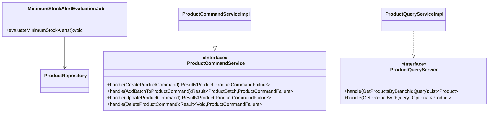

---

##### 2.6.4.2.1. Commands & Queries (DTOs de Aplicación)

##### Commands
* **`CreateProductCommand(BranchId branchId, ProductCategory category, ProductName name, Sku sku, String description, Money salePrice, InventoryQuantity minimumStock)`**
* **`UpdateProductCommand(UUID productId, ProductName name, ProductCategory category, Sku sku, String description, Money salePrice, InventoryQuantity minimumStock)`**
* **`DeleteProductCommand(UUID productId)`**
* **`AddBatchToProductCommand(UUID productId, StockMovementQuantity quantity, Money acquisitionCost)`**

##### Queries
* **`GetProductByIdQuery(UUID productId)`**
* **`GetProductsByBranchIdQuery(BranchId branchId, String name, String category, Boolean lowStockOnly)`**

---

##### 2.6.4.2.2. Capabilities & Scheduled Tasks

* **`MinimumStockAlertEvaluationJob`**:
  * **Tipo:** Capability / Proceso de fondo programado (`@Scheduled(cron = "0 0 * * * *")`).
  * **Responsabilidad:** Inspecciona el estado de existencias de todos los productos por sucursal en la base de datos, invocando directamente `product.refreshLowStockAlert()` en cada agregado para actualizar el indicador `lowStockAlert` y publicar eventos `LowStockAlertTriggeredEvent` cuando el stock disponible cae por debajo de la reserva mínima configurada.

---

#### 2.6.4.3. Interface Layer (Capa de Interfaz / REST & Events)

Exposición RESTful e integración asíncrona mediante listeners de eventos producidos por otros Bounded Contexts.

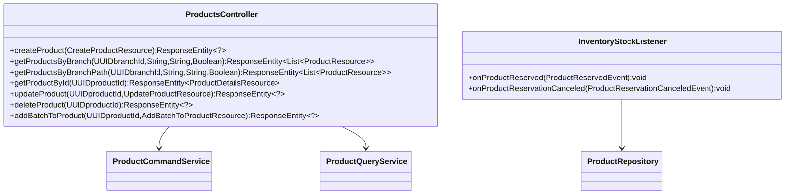

---

##### 2.6.4.3.1. Endpoints & REST Controllers

##### `ProductsController` (`/api/v1/inventory/products`)
* `POST /api/v1/inventory/products`: Registra un nuevo producto en el inventario de una sucursal.
* `GET /api/v1/inventory/products?branchId={branchId}`: Consulta productos por sucursal con filtros opcionales de búsqueda (`name`, `category`, `lowStockOnly`).
* `GET /api/v1/inventory/products/branch/{branchId}`: Catálogo de productos por ruta de sucursal.
* `GET /api/v1/inventory/products/{productId}`: Consulta detalles completos de un producto incluyendo sus lotes.
* `PUT /api/v1/inventory/products/{productId}`: Actualiza información básica del producto.
* `DELETE /api/v1/inventory/products/{productId}`: Eliminación lógica (soft-delete vía `deleted_at`) del producto y sus lotes.
* `POST /api/v1/inventory/products/{productId}/batches`: Registra la entrada de un nuevo lote de stock o un ajuste manual de almacén.

##### Event Listener: `InventoryStockListener`
* Escucha `ProductReservedEvent` proveniente de `Operations` e invoca `product.reserveStock(amount)`.
* Escucha `ProductReservationCanceledEvent` proveniente de `Operations` e invoca `product.releaseStock(amount)`.

---

#### 2.6.4.4. Infrastructure Layer (Capa de Infraestructura)

Mapeo ORM relacional a PostgreSQL 18 con Spring Data JPA y configuración de Jobs programados con `@EnableScheduling`.

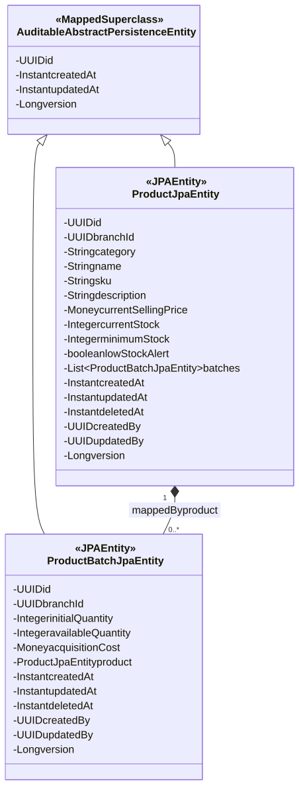

---

##### 2.6.4.4.1. Mapeo de Entidades Relacionales (JPA)

* **`products`** (`ProductJpaEntity`):
  * `id` (UUID, PK, heredado de `AuditableAbstractPersistenceEntity`)
  * `branch_id` (UUID, NOT NULL)
  * `category` (VARCHAR, NOT NULL)
  * `name` (VARCHAR, NOT NULL)
  * `sku` (VARCHAR, NOT NULL)
  * `description` (TEXT)
  * `current_selling_price` (DECIMAL, `MoneyAttributeConverter`)
  * `current_stock` (INTEGER, NOT NULL)
  * `minimum_stock` (INTEGER, NOT NULL)
  * `low_stock_alert` (BOOLEAN, NOT NULL)
  * `deleted_at` (TIMESTAMP), `created_by` (UUID), `updated_by` (UUID)
  * `created_at`, `updated_at`, `version` (heredados de `AuditableAbstractPersistenceEntity`)
* **`product_batches`** (`ProductBatchJpaEntity`):
  * `id` (UUID, PK, heredado de `AuditableAbstractPersistenceEntity`)
  * `product_id` (UUID, FK, NOT NULL)
  * `branch_id` (UUID, NOT NULL)
  * `initial_quantity` (INTEGER, NOT NULL)
  * `available_quantity` (INTEGER, NOT NULL)
  * `acquisition_cost` (DECIMAL, `MoneyAttributeConverter`)
  * `deleted_at` (TIMESTAMP), `created_by` (UUID), `updated_by` (UUID)
  * `created_at`, `updated_at`, `version` (heredados de `AuditableAbstractPersistenceEntity`)

---

##### 2.6.4.4.2. Repository Adapters & Infrastructure Components

##### `ProductRepositoryAdapter`
* **Implementa:** Interface de dominio `ProductRepository`.
* **Inyecta:** `ProductJpaRepository` (Spring Data JPA).
* **Responsabilidad:** Provee persistencia relacional con aislamiento total del modelo de dominio. Realiza el mapeo bidireccional entre los agregados de dominio (`Product`, `ProductBatch`) y las entidades de persistencia JPA (`ProductJpaEntity`, `ProductBatchJpaEntity`).
* **Métodos Implementados:**
  * `save(Product product)`: Mapea la raíz del agregado a `ProductJpaEntity` y sus lotes a `ProductBatchJpaEntity`, persistiendo ambas jerarquías en una sola transacción.
  * `findById(UUID id)`: Recupera la entidad JPA con sus lotes activos y reconstruye el Agregado de Dominio `Product`.
  * `findAllByBranchId(BranchId branchId)`: Recupera todos los productos de una sucursal.
  * `findAllByBranchIdWithFilters(BranchId branchId, String name, String category, Boolean lowStockOnly)`: Ejecuta búsquedas filtradas dinámicamente con criterios de bajo stock.
  * `existsByBranchIdAndSku(BranchId branchId, String sku)`: Verifica duplicidad de SKU.
  * `deleteById(UUID id)`: Realiza soft-delete seteando `deleted_at = Instant.now()`.

---

#### 2.6.4.5. Software Architecture Component Level Diagrams (C4 Model - Level 3)

El siguiente diagrama C4 descompone el Container API en sus componentes principales para el Bounded Context **Inventory**.

##### 2.6.4.5.1. C4 Model Component Diagram

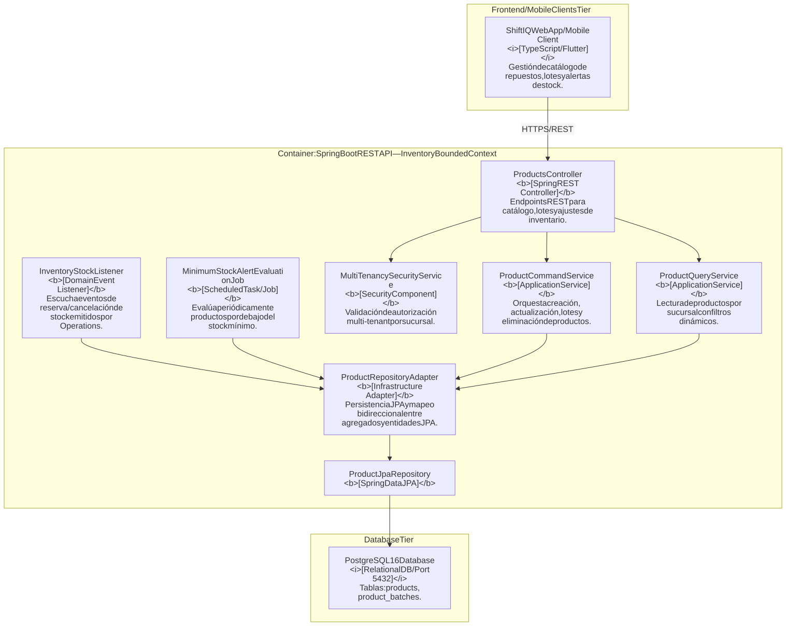

##### 2.6.4.5.2. Descomposición y Responsabilidad de Componentes

| Componente | Capa Architectural | Responsabilidad Técnica Principal | Tecnologías / Protocolos |
| :--- | :--- | :--- | :--- |
| **`ProductsController`** | Interface Layer | Expone los endpoints RESTful para la creación, consulta filtrada, actualización y eliminación de productos y registro de lotes. | Spring Web MVC, REST over HTTPS, Jackson JSON |
| **`InventoryStockListener`** | Interface Layer | Escucha asíncronamente eventos de dominio emitidos por `Operations` (`ProductReservedEvent`, `ProductReservationCanceledEvent`) e invoca reglas de reserva. | Spring Application Events / Domain Event Listener |
| **`MinimumStockAlertEvaluationJob`** | Application Layer | Capability programada en segundo plano que evalúa los umbrales de stock mínimo invocando `product.refreshLowStockAlert()`. | Spring Scheduled Tasks (`@Scheduled`), Spring Framework |
| **`ProductCommandService`** | Application Layer | Orquesta los comandos de creación, edición, borrado de productos y adición de lotes de inventario. | Spring Service (`@Service`), Functional `Result<T, E>` |
| **`ProductQueryService`** | Application Layer | Ejecuta consultas filtradas por sucursal, categoría y estado de alerta de bajo stock. | Spring Service (`@Service`), Read-only Transactions |
| **`ProductRepositoryAdapter`** | Infrastructure Layer | Adaptador de infraestructura que mapea agregados y entidades de dominio hacia/desde entidades relacionales JPA. | Spring Component (`@Component`), JPA Hibernate Mapping |
| **`ProductJpaRepository`** | Infrastructure Layer | Repositorio Spring Data JPA que interactúa directamente con PostgreSQL 18. | Spring Data JPA, Hibernate ORM, SQL Native Queries |

---

#### 2.6.4.6. Code Level Diagrams

##### 2.6.4.6.1. Domain Layer Class Diagram

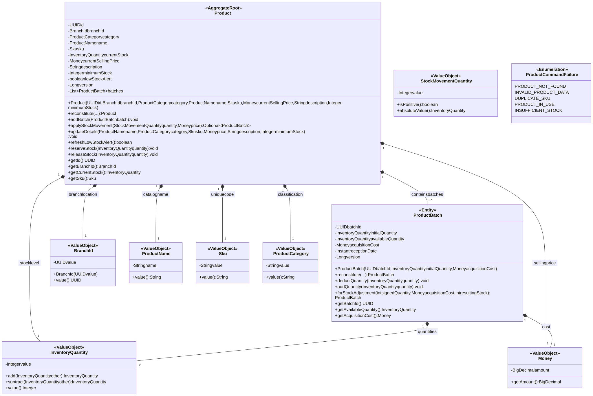

---

##### 2.6.4.6.2. PostgreSQL 18 Entity Relationship Diagram (ERD)

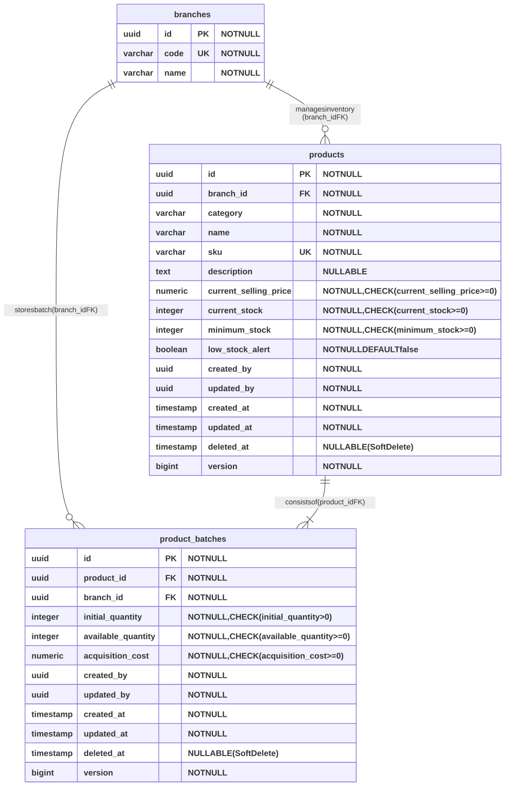
