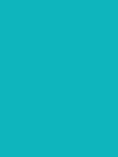
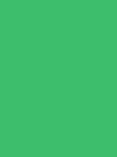
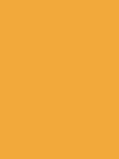
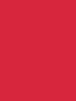
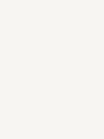
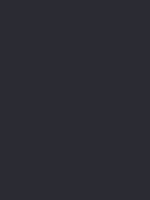
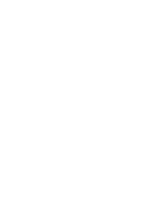

# 3.1. Product design

## 3.1.1. Style Guidelines

### 3.1.1.1. General Style Guidelines

La propuesta visual de ShiftIQ se aplica a tres superficies: la landing page (sitio comercial responsive en español e inglés), la aplicación web del taller (SPA en Angular) y la aplicación móvil Android (Kotlin, Material Design 3). Las decisiones de branding, color, tipografía y espaciado buscan que un dueño de taller o un conductor lea el estado de un vehículo de un vistazo, con baja densidad de interfaz y sin jerga técnica.

**Branding y tono de comunicación**

- **Marca:** el logotipo escribe "ShiftIQ" y resalta "IQ" con el azul de acento, para destacar la parte de inteligencia diagnóstica.
- **Tono:** profesional, directo y orientado a la acción preventiva. Con el taller es preciso y operativo; con el conductor usa lenguaje cotidiano y acompaña cada código DTC con una explicación y un nivel de urgencia.
- **Redacción:** voz activa y verbos de acción ("Agendar cita", "Ver diagnóstico"). Los mensajes de error explican qué ocurrió y cómo recuperarse, sin culpar al usuario.
- **Idioma:** español (Perú) por defecto. La landing ofrece inglés mediante el selector ES/EN.

**Paleta de colores**

  <table style="margin: auto; width: 100%; border-collapse: collapse; border: 1px solid #555;">
    <thead>
      <tr>
        <th style="padding: 12px; border: 1px solid #555; text-align: left;">Color</th>
        <th style="padding: 12px; border: 1px solid #555; text-align: center;">Hex</th>
        <th style="padding: 12px; border: 1px solid #555; text-align: left;">Significado y Justificación</th>
        <th style="padding: 12px; border: 1px solid #555; text-align: left;">Ejemplo de uso en la interfaz</th>
        <th style="padding: 12px; border: 1px solid #555; text-align: center;">Imagen</th>
      </tr>
    </thead>
    <tbody>
      <tr>
        <td style="padding: 12px; border: 1px solid #555; font-weight: bold;">Primary Blue</td>
        <td style="padding: 12px; border: 1px solid #555; font-family: monospace; text-align: center;">#1E3A8A</td>
        <td style="padding: 12px; border: 1px solid #555;">Azul de marca de la landing y del reporte. Transmite confianza técnica y estabilidad.</td>
        <td style="padding: 12px; border: 1px solid #555;">Botones primarios, enlace activo del navbar, sidebar, encabezados.</td>
        <td style="padding: 12px; border: 1px solid #555; text-align: center;"></td>
      </tr>
      <tr>
        <td style="padding: 12px; border: 1px solid #555; font-weight: bold;">Accent Sky Blue</td>
        <td style="padding: 12px; border: 1px solid #555; font-family: monospace; text-align: center;">#60A5FA</td>
        <td style="padding: 12px; border: 1px solid #555;">Acento legible sobre fondos oscuros ("IQ" del logotipo). Representa también la severidad <b>Baja</b> (informativa).</td>
        <td style="padding: 12px; border: 1px solid #555;">Logotipo sobre fondo oscuro, badge de severidad Baja.</td>
        <td style="padding: 12px; border: 1px solid #555; text-align: center;"></td>
      </tr>
      <tr>
        <td style="padding: 12px; border: 1px solid #555; font-weight: bold;">Secondary Teal</td>
        <td style="padding: 12px; border: 1px solid #555; font-family: monospace; text-align: center;">#0FB5BA</td>
        <td style="padding: 12px; border: 1px solid #555;">Teal que evoca telemetría en tiempo real y monitoreo activo.</td>
        <td style="padding: 12px; border: 1px solid #555;">Dispositivo OBD2 "Vinculado", gráficos de telemetría.</td>
        <td style="padding: 12px; border: 1px solid #555; text-align: center;"></td>
      </tr>
      <tr>
        <td style="padding: 12px; border: 1px solid #555; font-weight: bold;">Preventive Green</td>
        <td style="padding: 12px; border: 1px solid #555; font-family: monospace; text-align: center;">#3DBE6C</td>
        <td style="padding: 12px; border: 1px solid #555;">Mantenimiento preventivo exitoso y vehículo saludable.</td>
        <td style="padding: 12px; border: 1px solid #555;">Badge "Sin alertas", estados "Completada" y "Pagada".</td>
        <td style="padding: 12px; border: 1px solid #555; text-align: center;"></td>
      </tr>
      <tr>
        <td style="padding: 12px; border: 1px solid #555; font-weight: bold;">Severity Amber</td>
        <td style="padding: 12px; border: 1px solid #555; font-family: monospace; text-align: center;">#F2A93B</td>
        <td style="padding: 12px; border: 1px solid #555;">Ámbar cálido para severidad <b>Media</b>: visible sin ser alarmante.</td>
        <td style="padding: 12px; border: 1px solid #555;">Badge de severidad Media en el tablero de alertas.</td>
        <td style="padding: 12px; border: 1px solid #555; text-align: center;"></td>
      </tr>
      <tr>
        <td style="padding: 12px; border: 1px solid #555; font-weight: bold;">Severity Orange</td>
        <td style="padding: 12px; border: 1px solid #555; font-family: monospace; text-align: center;">#C94A0E</td>
        <td style="padding: 12px; border: 1px solid #555;">Naranja quemado para severidad <b>Alta</b>: pide atención pronta y se distingue del ámbar y del carmesí.</td>
        <td style="padding: 12px; border: 1px solid #555;">Badge de severidad Alta, sugerencia de agendar cita.</td>
        <td style="padding: 12px; border: 1px solid #555; text-align: center;"></td>
      </tr>
      <tr>
        <td style="padding: 12px; border: 1px solid #555; font-weight: bold;">Severity Crimson</td>
        <td style="padding: 12px; border: 1px solid #555; font-family: monospace; text-align: center;">#D7263D</td>
        <td style="padding: 12px; border: 1px solid #555;">Rojo carmesí para severidad <b>Crítica</b> (riesgo inminente de falla) y para acciones destructivas.</td>
        <td style="padding: 12px; border: 1px solid #555;">Badge de severidad Crítica, notificación push urgente, botón "Cancelar cita".</td>
        <td style="padding: 12px; border: 1px solid #555; text-align: center;"></td>
      </tr>
      <tr>
        <td style="padding: 12px; border: 1px solid #555; font-weight: bold;">Warm Neutral</td>
        <td style="padding: 12px; border: 1px solid #555; font-family: monospace; text-align: center;">#F7F5F2</td>
        <td style="padding: 12px; border: 1px solid #555;">Gris cálido que reduce la fatiga visual y resalta los datos de telemetría.</td>
        <td style="padding: 12px; border: 1px solid #555;">Fondo general del panel, tarjetas KPI.</td>
        <td style="padding: 12px; border: 1px solid #555; text-align: center;"></td>
      </tr>
      <tr>
        <td style="padding: 12px; border: 1px solid #555; font-weight: bold;">Graphite</td>
        <td style="padding: 12px; border: 1px solid #555; font-family: monospace; text-align: center;">#2B2B33</td>
        <td style="padding: 12px; border: 1px solid #555;">Gris grafito de alto contraste para texto principal y códigos DTC.</td>
        <td style="padding: 12px; border: 1px solid #555;">Cuerpo de texto, descripciones técnicas.</td>
        <td style="padding: 12px; border: 1px solid #555; text-align: center;"></td>
      </tr>
      <tr>
        <td style="padding: 12px; border: 1px solid #555; font-weight: bold;">White</td>
        <td style="padding: 12px; border: 1px solid #555; font-family: monospace; text-align: center;">#FFFFFF</td>
        <td style="padding: 12px; border: 1px solid #555;">Claridad y espacio en tarjetas y modales.</td>
        <td style="padding: 12px; border: 1px solid #555;">Tarjetas de planes, modales de agendamiento, texto sobre Primary Blue.</td>
        <td style="padding: 12px; border: 1px solid #555; text-align: center;"></td>
      </tr>
    </tbody>
  </table>

**Escala de severidad de alertas DTC**

La severidad nunca se comunica solo con color: cada nivel combina color, ícono (Bootstrap Icons) y etiqueta de texto.

| Nivel (API) | Etiqueta en UI | Color | Texto sobre el color | Ícono | Criterio |
|---|---|---|---|---|---|
| `LOW` | Baja | Accent Sky Blue | Graphite | `info-circle-fill` | Informativa, sin acción inmediata. |
| `MEDIUM` | Media | Severity Amber | Graphite | `exclamation-circle-fill` | Programar atención en los próximos días. |
| `HIGH` | Alta | Severity Orange | White | `exclamation-triangle-fill` | Atender pronto; se sugiere agendar cita. |
| `CRITICAL` | Crítica | Severity Crimson | White | `x-octagon-fill` | Riesgo de falla inminente; notificación push inmediata. |

**Tipografía**

La familia principal es **Outfit** (Google Fonts), usada en títulos y cuerpo con pesos 400, 500, 600 y 700. Los códigos DTC (por ejemplo, `P0301`) se muestran en **Roboto Mono** para distinguirlos del texto y evitar confusiones entre caracteres.

| Rol | Web (landing y aplicación web) | Android (Material Design 3) |
|---|---|---|
| Título principal | h1, 2.5 rem (40 px), Outfit 600 | Headline Large, 32 sp |
| Título de sección | h2, 2 rem (32 px), Outfit 600 | Title Large, 22 sp |
| Subtítulo | h5, 1.25 rem (20 px), Outfit 500 | Title Medium, 16 sp |
| Cuerpo | 1 rem (16 px), Outfit 400 | Body Large 16 sp / Body Medium 14 sp |
| Botones y etiquetas | 0.875 rem (14 px), Outfit 500 | Label Large, 14 sp |
| Código DTC | 0.875 rem, Roboto Mono | 14 sp, Roboto Mono |

**Espaciado, forma e iconografía**

- **Web:** escala de espaciado de Bootstrap 5.3 (4, 8, 16, 24 y 48 px).
- **Android:** grilla de 8 dp. Margen lateral de 16 dp, 8–16 dp entre elementos relacionados y 24 dp entre secciones.
- **Radios:** 8 px/dp en botones, campos y chips; 12 en tarjetas; 16 en modales y bottom sheets. El CTA del hero usa forma de píldora, como en el mock-up.
- **Iconografía:** Bootstrap Icons en landing y aplicación web; Material Symbols en Android. Tamaño base de 24 px/dp. Todo ícono lleva texto visible o descripción accesible (`aria-label` / `contentDescription`).

**Botones y elementos interactivos**

| Tipo | Estilo | Ejemplo |
|---|---|---|
| Primario | Fondo Primary Blue, texto White | "Comenzar ahora", "Agendar cita" |
| Secundario | Borde y texto Primary Blue | "Ver detalle" |
| Terciario | Solo texto Primary Blue | "Cancelar" |
| Destructivo | Fondo Severity Crimson, texto White | "Cancelar cita" |

- **Tamaño táctil:** altura y área mínimas de 48 dp/px (48×48).
- **Estados:** normal, hover/pressed, focus, disabled y loading (indicador circular dentro del botón).
- **Foco visible:** anillo de 2 px en Primary Blue sobre fondos claros y en Accent Sky Blue sobre fondos oscuros.

**Patrones de diseño por superficie**

| Superficie | Navegación | Componentes principales |
|---|---|---|
| Landing | Navbar fija con enlaces, selector ES/EN y CTA; secciones verticales con anclas | Acordeón (retos), tarjetas (solución, planes), carrusel (equipo) |
| Aplicación web del taller | Sidebar fija agrupada + barra superior (sucursal, búsqueda, perfil) | Tarjetas KPI, tablas con filtros, badges de estado, modales para formularios |
| Aplicación Android | Navigation bar inferior (3–5 destinos) + top app bar | FAB, bottom sheet de detalle, chips de filtro, snackbar |

**Responsive Design**

- **Landing y aplicación web:** breakpoints de Bootstrap 5.3 (576, 768, 992, 1200 y 1400 px). El diseño base es de 1440 px; en móvil las secciones se apilan en una columna y el menú se colapsa.
- **Android:** clases de tamaño de ventana de Material Design 3: compact (< 600 dp), medium (600–839 dp) y expanded (≥ 840 dp). El primer objetivo son teléfonos Android (compact).

**Estados de carga y feedback**

- **Skeleton screens** en tablas y tarjetas KPI mientras carga el contenido.
- **Indicadores de progreso:** circular para operaciones sin duración conocida; lineal para la sincronización de telemetría.
- **Empty states** con acción sugerida, por ejemplo "Aún no hay alertas activas".
- **Error states** con mensaje claro y botón "Reintentar".
- **Sin conexión:** banner "Sin conexión: los datos se sincronizarán al reconectar", coherente con la persistencia local descrita en las restricciones técnicas.
- **Snackbar** de confirmación con acción "Deshacer" cuando aplica.

**Accesibilidad**

Se sigue WCAG 2.1 nivel AA: contraste mínimo de 4.5:1 en texto normal y 3:1 en texto grande e íconos. Combinaciones validadas:

| Combinación | Contraste |
|---|---|
| White sobre Primary Blue | 10.36:1 |
| Graphite sobre White | 14.04:1 |
| Graphite sobre Warm Neutral | 12.90:1 |
| White sobre Severity Crimson | 4.96:1 |
| White sobre Severity Orange | 4.70:1 |
| Graphite sobre Severity Amber | 7.03:1 |
| Graphite sobre Secondary Teal | 5.57:1 |
| Graphite sobre Preventive Green | 5.87:1 |
| Graphite sobre Accent Sky Blue | 5.52:1 |
| Accent Sky Blue sobre Primary Blue | 4.07:1 (solo texto grande e íconos) |

- **Color:** la severidad y los estados nunca dependen solo del color (ícono + texto).
- **Imágenes y semántica:** toda imagen informativa lleva `alt`; el idioma de la página (`lang`) cambia con el selector ES/EN.
- **Teclado y lectores de pantalla:** navegación completa por teclado en web y `contentDescription` en Android (TalkBack).
- **Zoom:** el texto se puede ampliar hasta 200 % sin pérdida de contenido ni funcionalidad.
- **Movimiento:** la animación del pie de página (Matter.js) se reduce o desactiva cuando el usuario tiene activo `prefers-reduced-motion`.