## 3.1.3. Landing Page UI Design

### 3.1.3.1. Landing Page Wireframe

El wireframe fija la estructura de la landing page de ShiftIQ antes de aplicar color de marca, fotografía y tipografía final. La versión web recorre la página en secciones. La versión móvil usa el mismo contenido en una sola columna, porque la landing es responsive.

#### Landing Page

##### 1. Header / Navbar y Hero

La barra de navegación queda sobre el primer pantallazo: marca, enlaces, idioma y llamado a la acción. Debajo está el mensaje principal del taller, tal como se ilustra en la **Figura 99**.

**Figura 99.** Wireframe Web — Header / Navbar y Hero.

##### 2. Marco regulatorio

En la **Figura 100** se presenta la franja de instituciones del sector, alineada con el contexto de la operación automotriz.

**Figura 100.** Wireframe Web — Marco regulatorio.

##### 3. Los retos del taller

Como se observa en la **Figura 101**, se diseña un acordeón de problemas operativos junto al texto del desafío.

**Figura 101.** Wireframe Web — Los retos del taller.

##### 4. Video

De acuerdo con la **Figura 102**, se dispone un bloque de contexto visual antes de entrar al detalle de la solución.

**Figura 102.** Wireframe Web — Video.

##### 5. Solución

Tal como se detalla en la **Figura 103**, se presentan las tarjetas de capacidades, resultados esperados y el bloque de recomendación.

**Figura 103.** Wireframe Web — Solución.

##### 6. Segmentos

Como se esquematiza en la **Figura 104**, se visualizan las dos experiencias de la plataforma: taller y conductor.

**Figura 104.** Wireframe Web — Segmentos.

##### 7. Historia

En la **Figura 105** se estructuran los tres momentos de la propuesta: operación, control y telemetría.

**Figura 105.** Wireframe Web — Historia.

##### 8. Equipo

Como se ilustra en la **Figura 106**, se incorpora el carrusel de las personas que construyen ShiftIQ.

**Figura 106.** Wireframe Web — Equipo.

##### 9. Perspectiva

De acuerdo con la **Figura 107**, se establece el cierre de la mirada del producto antes de los planes.

**Figura 107.** Wireframe Web — Perspectiva.

##### 10. Planes

Tal como se modela en la **Figura 108**, se presenta la comparación de planes, con el plan recomendado al centro.

**Figura 108.** Wireframe Web — Planes.

##### 11. Contacto

Como se muestra en la **Figura 109**, se ubica el llamado final para empezar con ShiftIQ.

**Figura 109.** Wireframe Web — Contacto.

##### 12. Pie de página

En la **Figura 110** se distribuyen los enlaces, redes y datos de cierre.

**Figura 110.** Wireframe Web — Pie de página.

#### Mobile Web Browser

En el navegador móvil el menú se colapsa y cada sección pasa a una columna. El contenido es el mismo que en la versión web.

##### 1. Header / Navbar y Hero

Como se observa en la **Figura 111**, el hero se adapta en columna para navegación móvil:

**Figura 111.** Wireframe Móvil — Header / Navbar y Hero.

##### 2. Marco regulatorio

En la **Figura 112** se muestra la franja institucional en disposición vertical:

**Figura 112.** Wireframe Móvil — Marco regulatorio.

##### 3. Los retos del taller

Tal como se detalla en la **Figura 113**, el acordeón de retos operativos se apila en una sola columna:

**Figura 113.** Wireframe Móvil — Los retos del taller.

##### 4. Video

De acuerdo con la **Figura 114**, se ubica el bloque contenedor de video demostrativo:

**Figura 114.** Wireframe Móvil — Video.

##### 5. Solución

Como se ilustra en la **Figura 115**, las tarjetas de solución se despliegan en scroll vertical:

**Figura 115.** Wireframe Móvil — Solución.

##### 6. Segmentos

En la **Figura 116** se presenta la segmentación de conductores y talleres adaptada a pantallas móviles:

**Figura 116.** Wireframe Móvil — Segmentos.

##### 7. Historia

Tal como se aprecia en la **Figura 117**, la línea temporal de la solución se distribuye verticalmente:

**Figura 117.** Wireframe Móvil — Historia.

##### 8. Equipo

De acuerdo con la **Figura 118**, el carrusel de integrantes se ajusta para gestos táctiles en teléfonos:

**Figura 118.** Wireframe Móvil — Equipo.

##### 9. Perspectiva

Como se muestra en la **Figura 119**, la sección de perspectiva sintetiza el valor preventivo:

**Figura 119.** Wireframe Móvil — Perspectiva.

##### 10. Planes

En la **Figura 120** se presenta la selección de suscripciones con navegación táctil entre tarjetas:

**Figura 120.** Wireframe Móvil — Planes.

##### 11. Contacto

Tal como se detalla en la **Figura 121**, el formulario de contacto móvil simplifica la captura de datos:

**Figura 121.** Wireframe Móvil — Contacto.

##### 12. Pie de página

En la **Figura 122** se disponen los enlaces de navegación inferior y redes sociales:

**Figura 122.** Wireframe Móvil — Pie de página.

### 3.1.3.2. Landing Page Mock-up

El mock-up aplica la interfaz final de ShiftIQ sobre la estructura del wireframe: color de marca, fotografía, tipografía y componentes reales. La versión web se muestra dentro del navegador. La versión móvil corresponde al mismo sitio en un navegador web responsive, con el contenido apilado en una columna.

#### Landing Page

El primer pantallazo se presenta dentro del marco del navegador. Las secciones siguientes recorren la página completa.

##### 1. Header / Navbar y Hero

Como se aprecia en la **Figura 123**, el mockup desktop incorpora la imagen hero de alto impacto y la botonera de navegación completa:

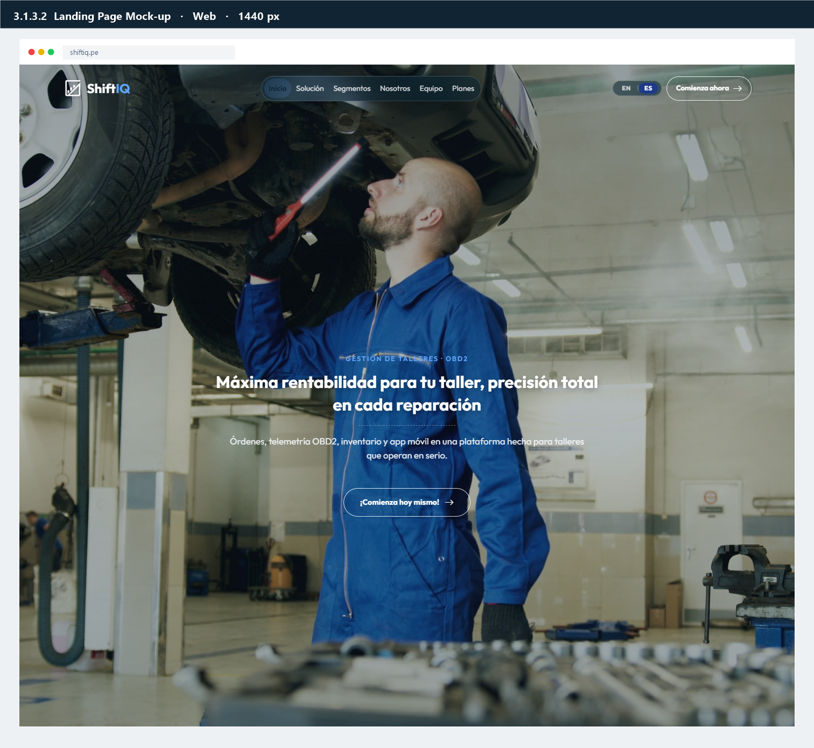

**Figura 123.** Mockup Web — Header / Navbar y Hero en navegador.

##### 2. Marco regulatorio

En la **Figura 124** se muestra el marco regulatorio con logotipos reales y fondos institucionales:

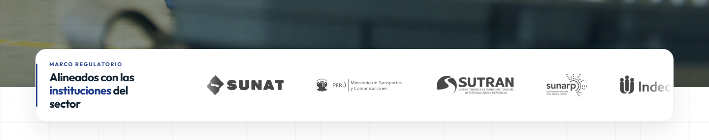

**Figura 124.** Mockup Web — Marco regulatorio.

##### 3. Los retos del taller

Tal como se ilustra en la **Figura 125**, el acordeón interactivo despliega las problemáticas del sector con contrastes WCAG AA:

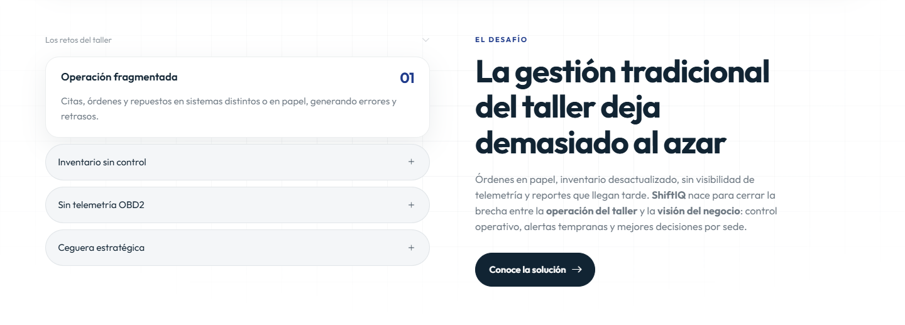

**Figura 125.** Mockup Web — Los retos del taller.

##### 4. Video

De acuerdo con la **Figura 126**, se integra el reproductor multimedia sobre fondo oscuro:

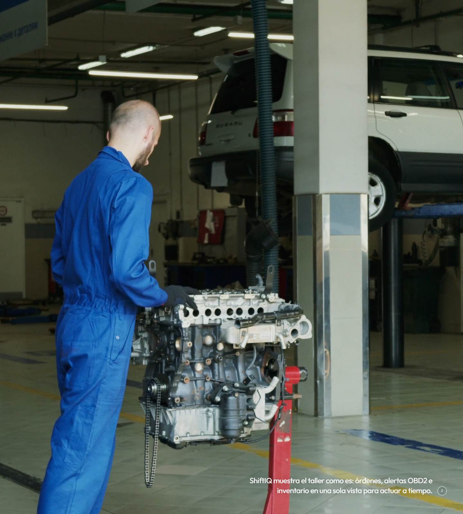

**Figura 126.** Mockup Web — Video.

##### 5. Solución

Como se esquematiza en la **Figura 127**, las tarjetas de producto aplican la paleta Primary Blue y Severity tokens:

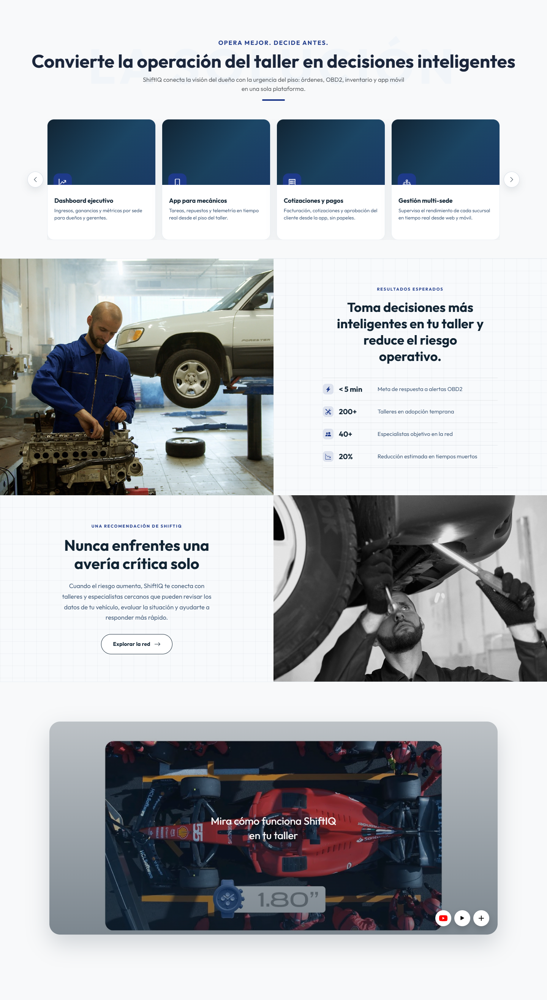

**Figura 127.** Mockup Web — Solución.

##### 6. Segmentos

En la **Figura 128** se diferencian las interfaces del conductor y del dueño de taller:

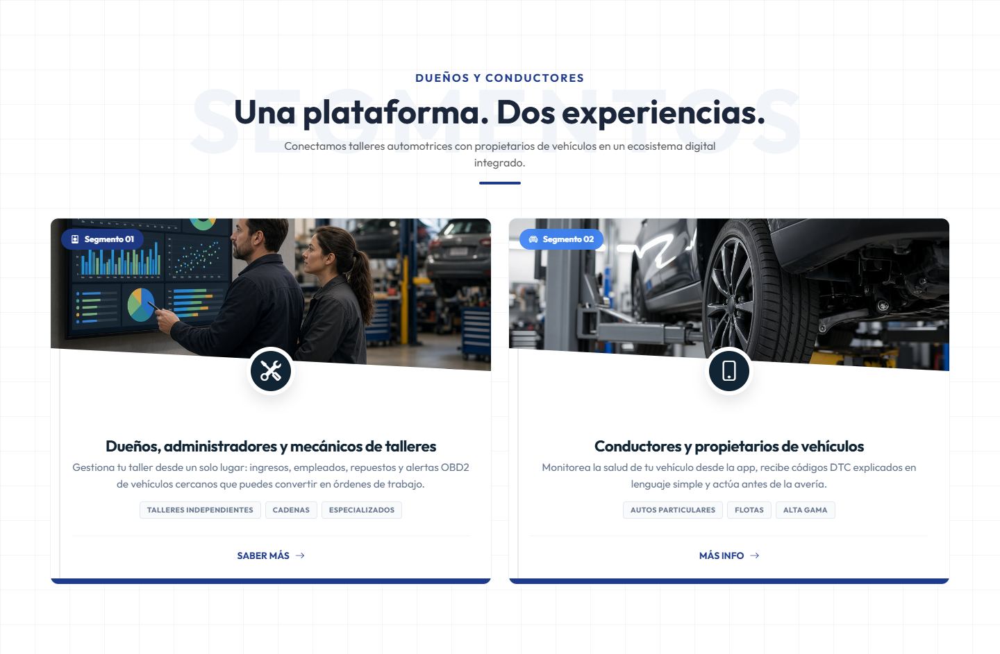

**Figura 128.** Mockup Web — Segmentos.

##### 7. Historia

Tal como se detalla en la **Figura 129**, se expone la narrativa de valor y evolución tecnológica de ShiftIQ:

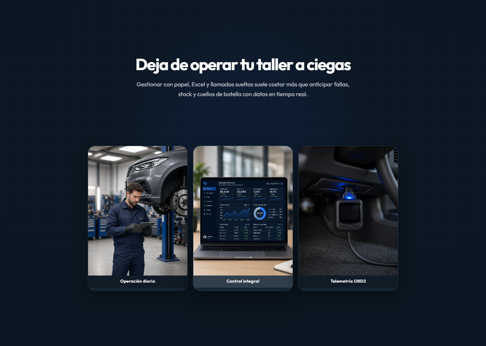

**Figura 129.** Mockup Web — Historia.

##### 8. Equipo

De acuerdo con la **Figura 130**, se presentan las fotografías y perfiles profesionales del equipo TuxLogic:

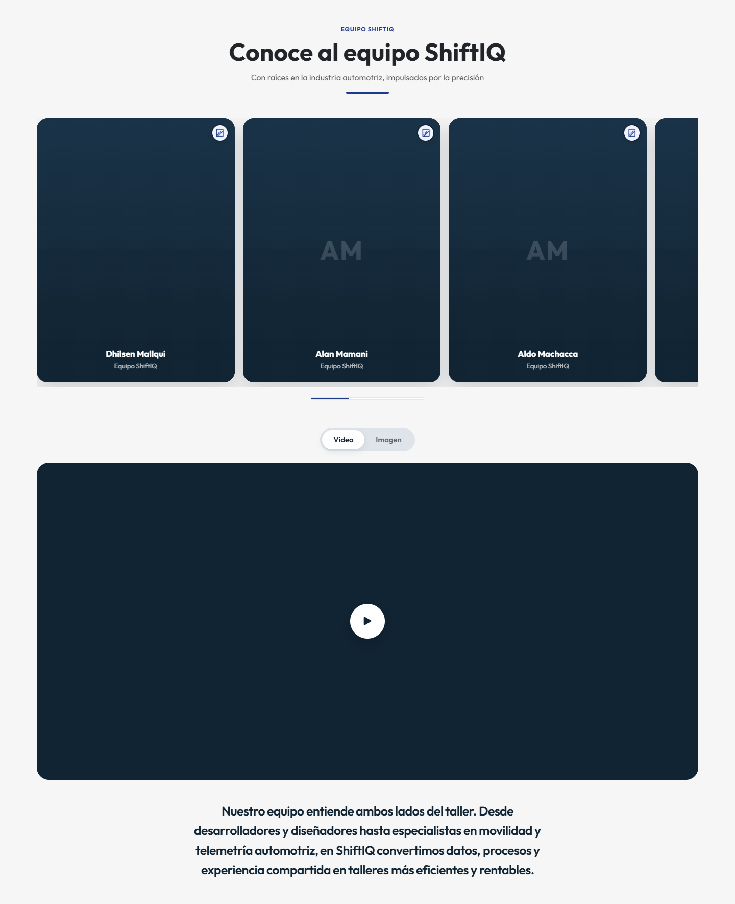

**Figura 130.** Mockup Web — Equipo.

##### 9. Perspectiva

Como se observa en la **Figura 131**, se refuerza el compromiso con la eficiencia y el diagnóstico en tiempo real:

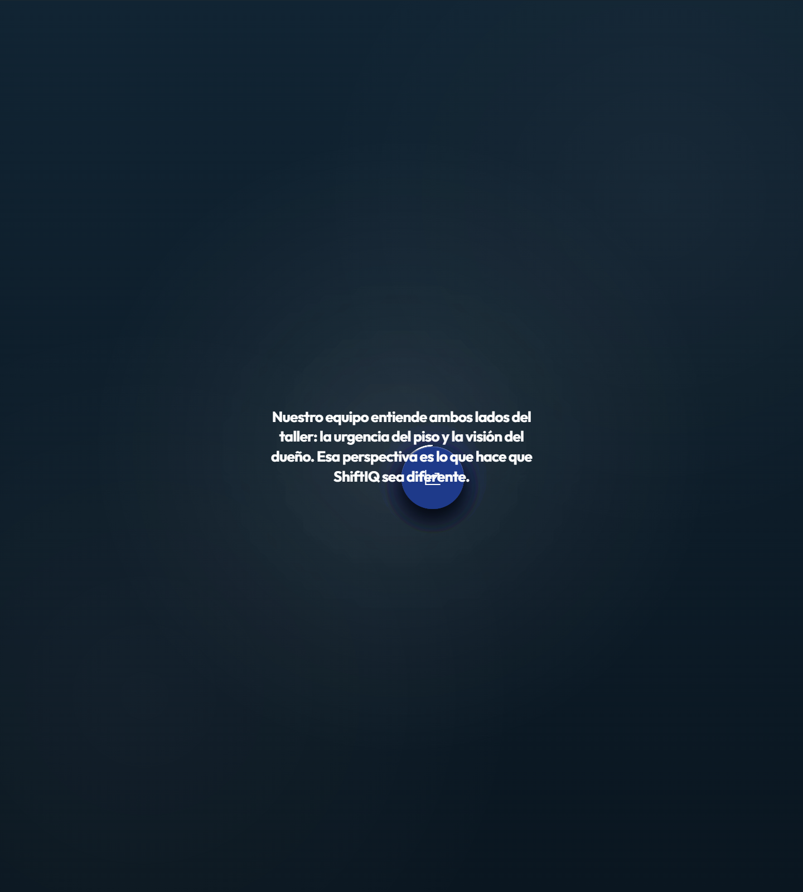

**Figura 131.** Mockup Web — Perspectiva.

##### 10. Planes

En la **Figura 132** se muestra el comparador de precios destacando el plan Profesional como opción recomendada:

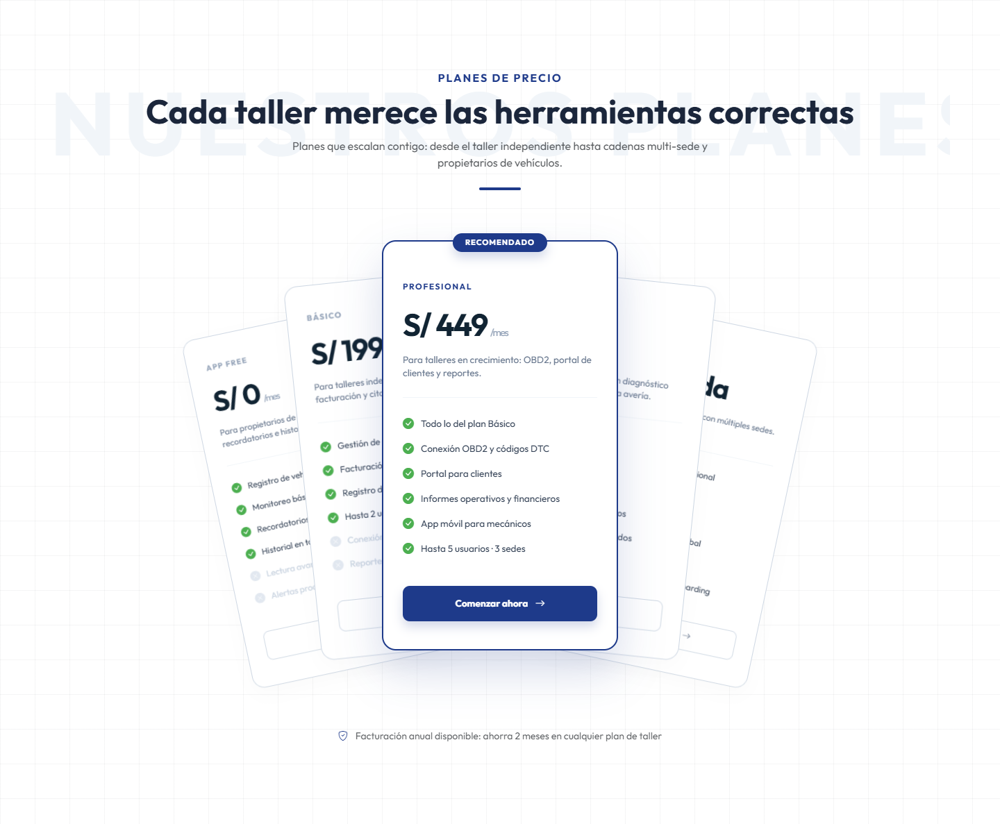

**Figura 132.** Mockup Web — Planes.

##### 11. Contacto

Tal como se aprecia en la **Figura 133**, se incluye el formulario de conversión final con validaciones visibles:

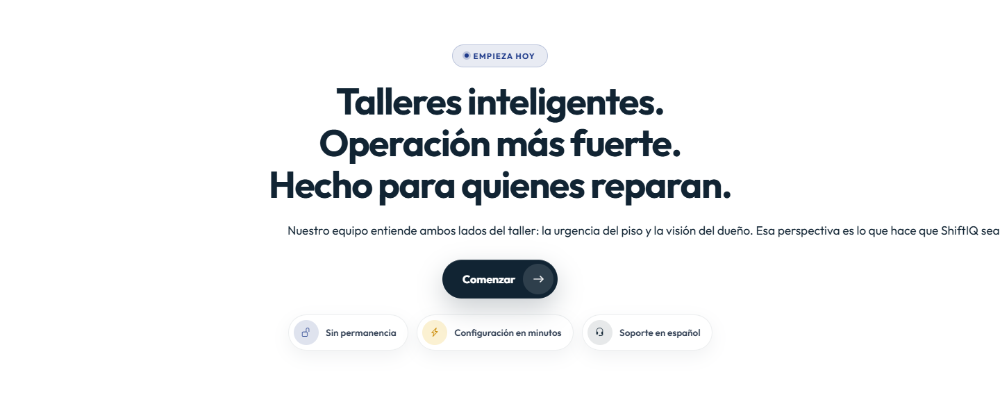

**Figura 133.** Mockup Web — Contacto.

##### 12. Pie de página

En la **Figura 134** se presenta el pie de página con enlaces legales, copyright e integración interactiva:

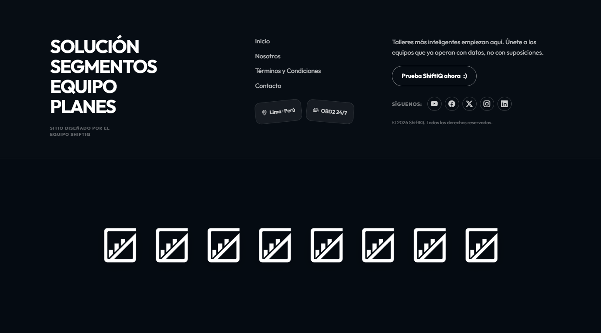

**Figura 134.** Mockup Web — Pie de página.

#### Mobile Web Browser

Esta versión es el navegador web en móvil. La landing es responsive: el menú se colapsa y cada sección se apila en una sola columna, con el mismo contenido de la versión web. El primer pantallazo se muestra dentro del marco del teléfono.

##### 1. Header / Navbar y Hero

Como se visualiza en la **Figura 135**, el mockup móvil enmarca el Hero en un dispositivo telefónico representativo:

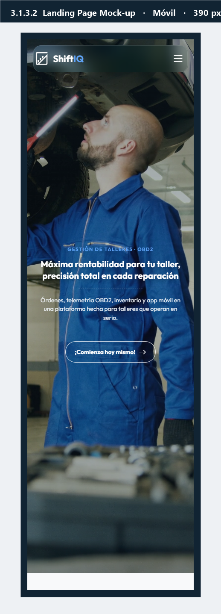

**Figura 135.** Mockup Móvil — Header / Navbar y Hero en teléfono.

##### 2. Marco regulatorio

En la **Figura 136** se exhibe la sección de instituciones reguladoras en vista móvil:

**Figura 136.** Mockup Móvil — Marco regulatorio.

##### 3. Los retos del taller

Tal como se ilustra en la **Figura 137**, los acordeones adaptados permiten consultar los retos mediante interacción táctil:

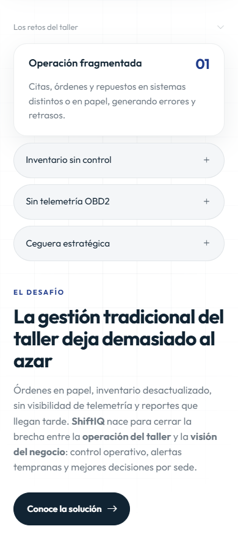

**Figura 137.** Mockup Móvil — Los retos del taller.

##### 4. Video

De acuerdo con la **Figura 138**, la cápsula de video se ajusta al ancho completo del visor móvil:

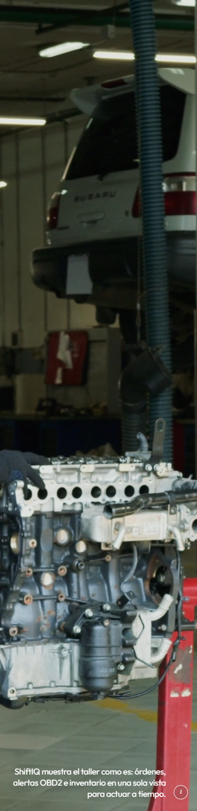

**Figura 138.** Mockup Móvil — Video.

##### 5. Solución

Como se muestra en la **Figura 139**, las tarjetas de características se apilan secuencialmente:

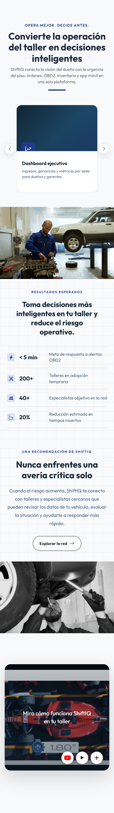

**Figura 139.** Mockup Móvil — Solución.

##### 6. Segmentos

En la **Figura 140** se exponen los perfiles de usuario en tarjetas deslizables:

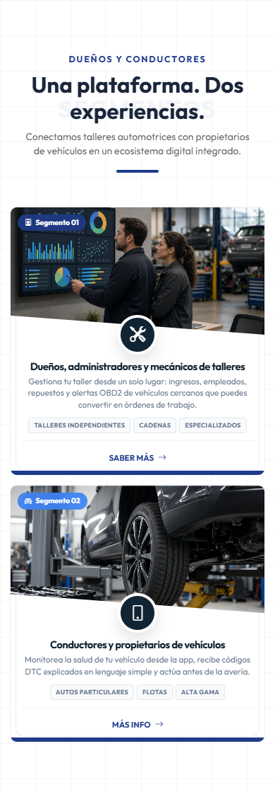

**Figura 140.** Mockup Móvil — Segmentos.

##### 7. Historia

Tal como se detalla en la **Figura 141**, los hitos narrativos de la plataforma se leen de forma fluida en pantalla pequeña:

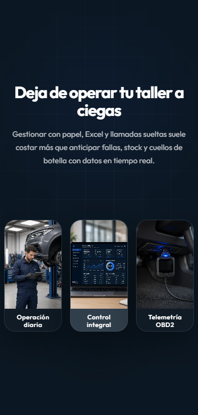

**Figura 141.** Mockup Móvil — Historia.

##### 8. Equipo

De acuerdo con la **Figura 142**, las tarjetas de los ingenieros de TuxLogic se adaptan para navegación táctil:

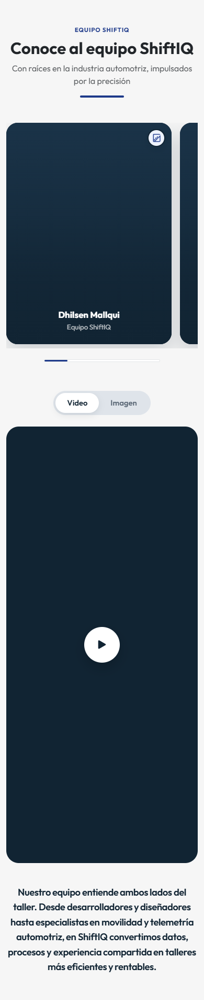

**Figura 142.** Mockup Móvil — Equipo.

##### 9. Perspectiva

Como se esquematiza en la **Figura 143**, la propuesta de innovación automotriz se resume en una columna:

**Figura 143.** Mockup Móvil — Perspectiva.

##### 10. Planes

En la **Figura 144** se presentan las opciones de facturación y paquetes de suscripción optimizados para móviles:

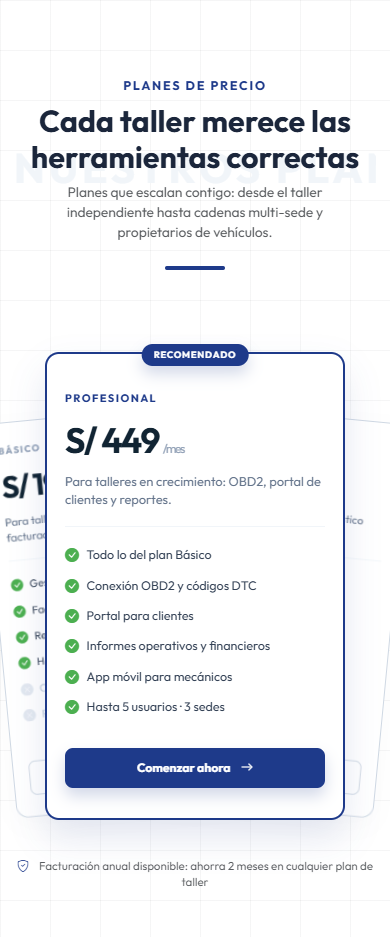

**Figura 144.** Mockup Móvil — Planes.

##### 11. Contacto

Tal como se aprecia en la **Figura 145**, el formulario de captación optimiza los campos para teclado virtual:

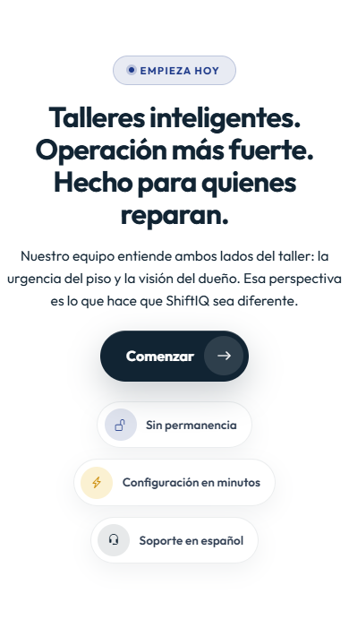

**Figura 145.** Mockup Móvil — Contacto.

##### 12. Pie de página

En la **Figura 146** se concluye con los enlaces de navegación, redes sociales y créditos de autoría:

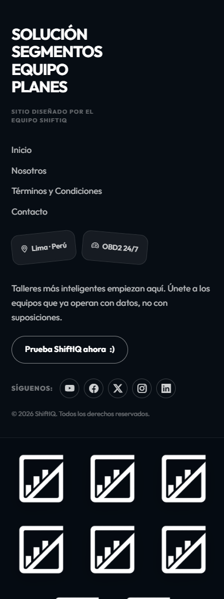

**Figura 146.** Mockup Móvil — Pie de página.
