## 3.1.3. Landing Page UI Design

### 3.1.3.1. Landing Page Wireframe

El wireframe fija la estructura de la landing page de ShiftIQ antes de aplicar color de marca, fotografía y tipografía final. La versión web recorre la página en secciones. La versión móvil usa el mismo contenido en una sola columna, porque la landing es responsive.

#### Landing Page

##### 1. Header / Navbar y Hero

La barra de navegación queda sobre el primer pantallazo: marca, enlaces, idioma y llamado a la acción. Debajo está el mensaje principal del taller.

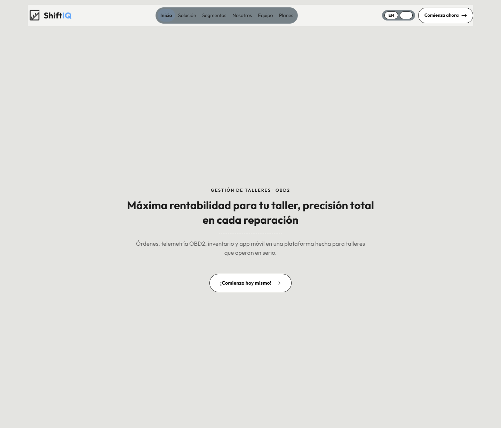

##### 2. Marco regulatorio

Franja de instituciones del sector, alineada con el contexto de la operación automotriz.

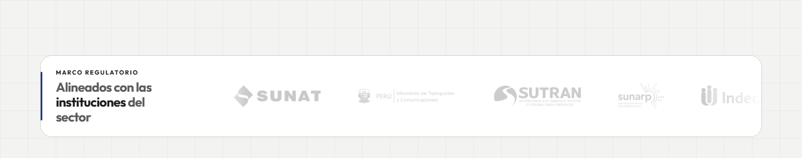

##### 3. Los retos del taller

Acordeón de problemas operativos junto al texto del desafío.

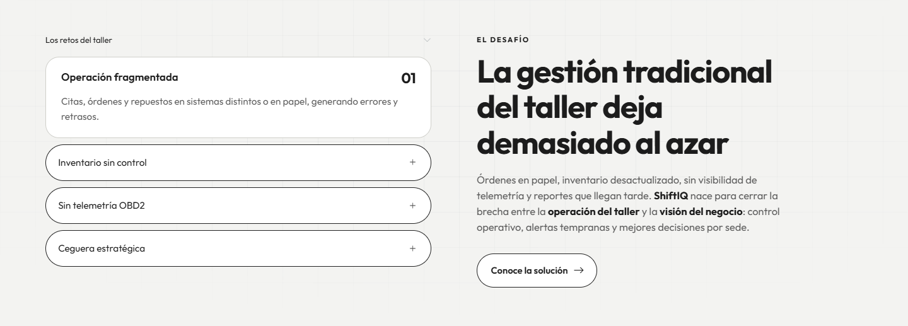

##### 4. Video

Bloque de contexto visual antes de entrar al detalle de la solución.

##### 5. Solución

Tarjetas de capacidades, resultados esperados y el bloque de recomendación.

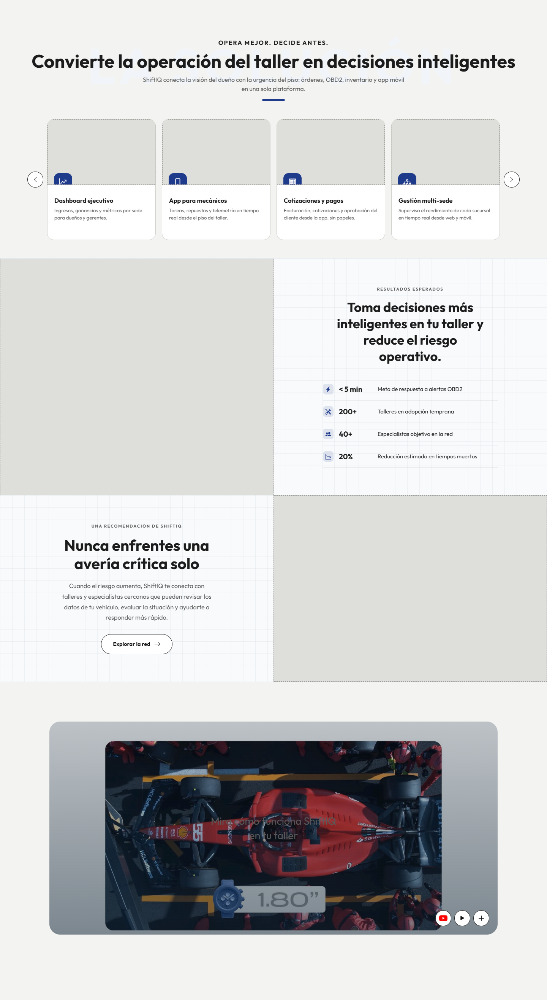

##### 6. Segmentos

Las dos experiencias de la plataforma: taller y conductor.

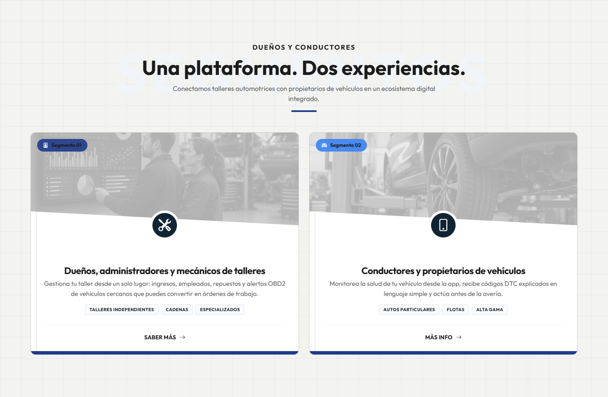

##### 7. Historia

Tres momentos de la propuesta: operación, control y telemetría.

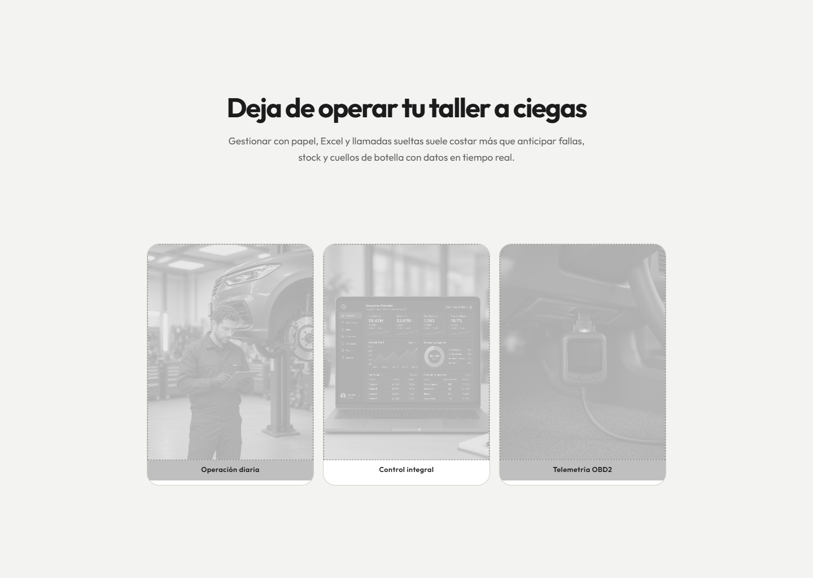

##### 8. Equipo

Carrusel de las personas que construyen ShiftIQ.

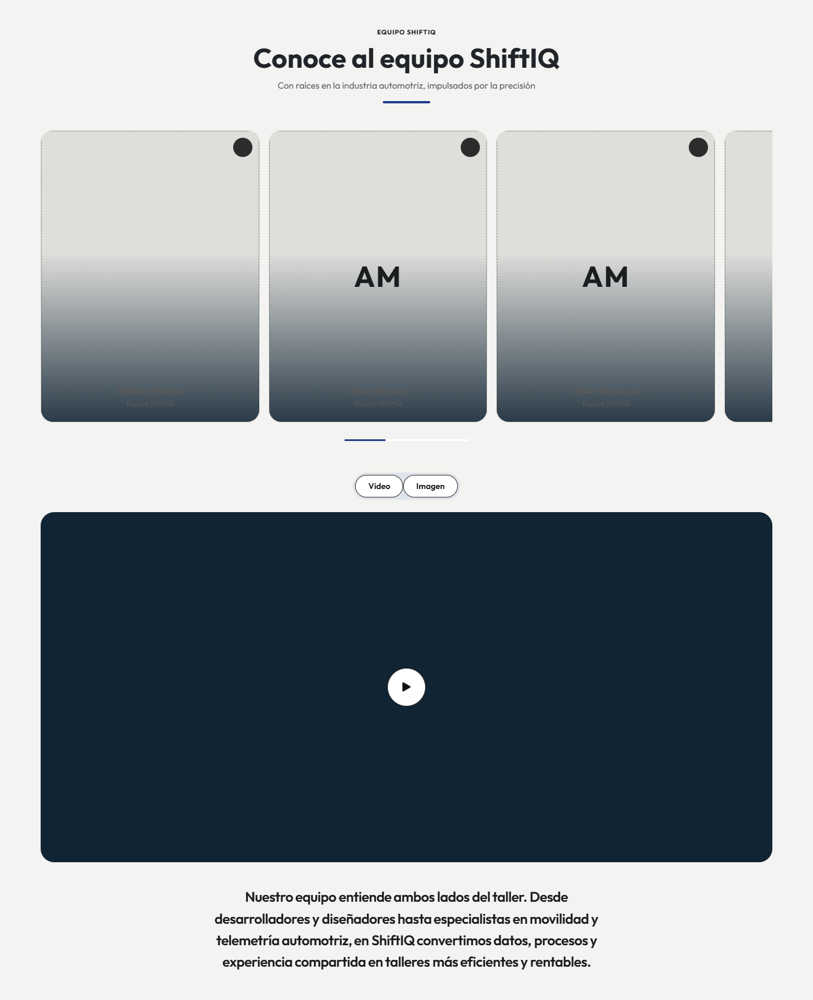

##### 9. Perspectiva

Cierre de la mirada del producto antes de los planes.

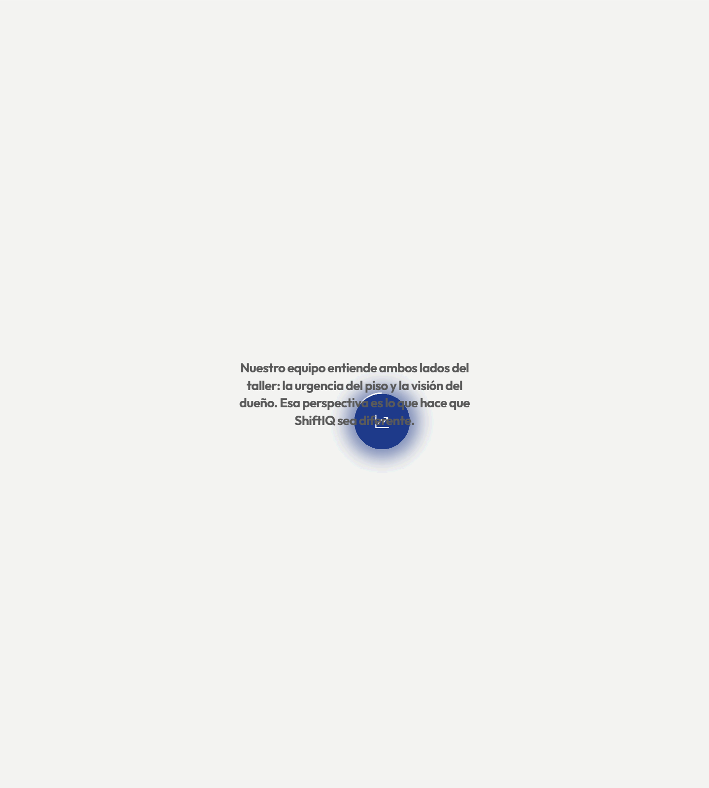

##### 10. Planes

Comparación de planes, con el plan recomendado al centro.

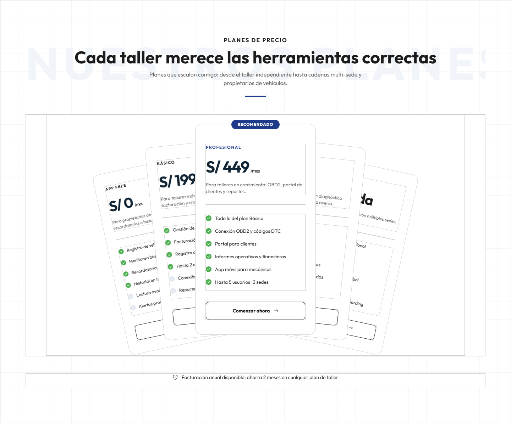

##### 11. Contacto

Llamado final para empezar con ShiftIQ.

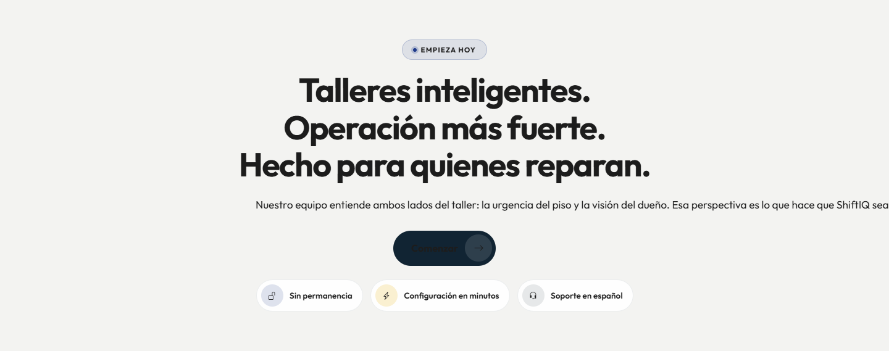

##### 12. Pie de página

Enlaces, redes y datos de cierre.

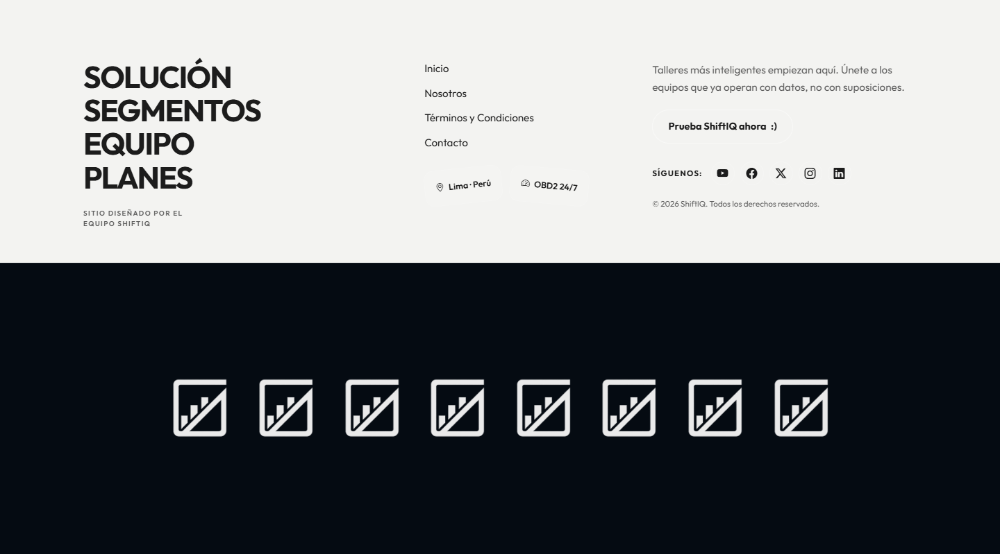

#### Mobile Web Browser

En el navegador móvil el menú se colapsa y cada sección pasa a una columna. El contenido es el mismo que en la versión web.

##### 1. Header / Navbar y Hero

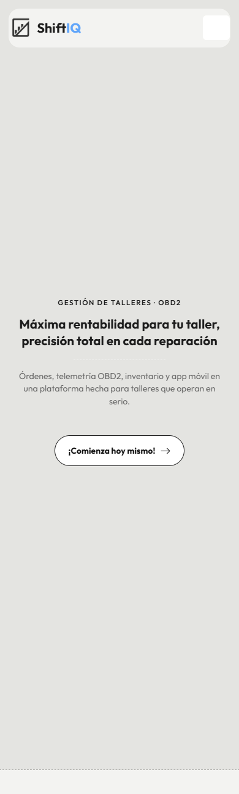

##### 2. Marco regulatorio

##### 3. Los retos del taller

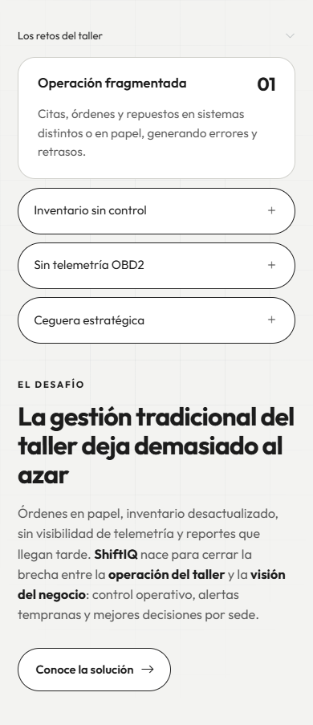

##### 4. Video

##### 5. Solución

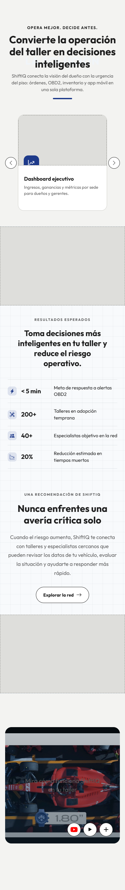

##### 6. Segmentos

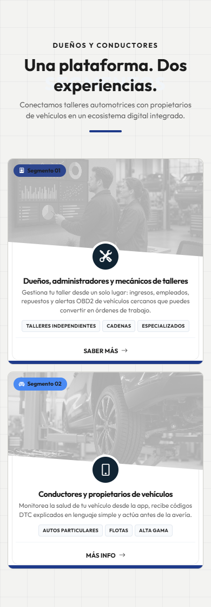

##### 7. Historia

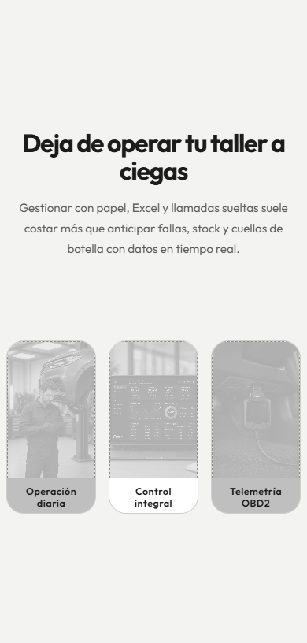

##### 8. Equipo

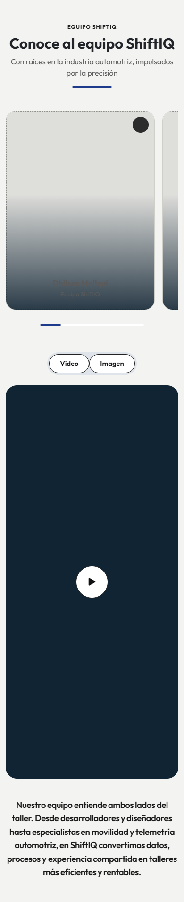

##### 9. Perspectiva

##### 10. Planes

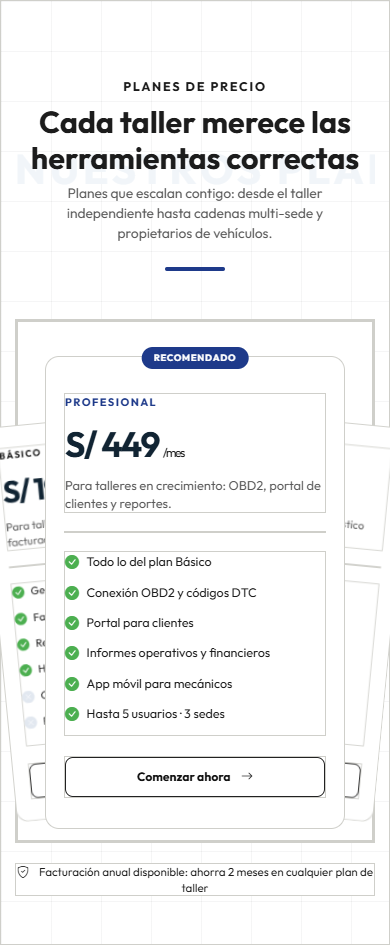

##### 11. Contacto

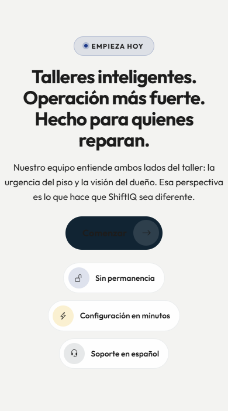

##### 12. Pie de página

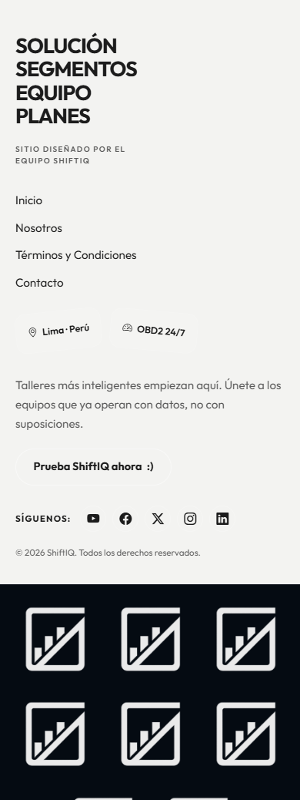

### 3.1.3.2. Landing Page Mock-up
