## 3.1.4. Mobile Applications UX/UI Design

El diseño de la experiencia e interfaz de usuario (UX/UI) móvil para **ShiftIQ** se fundamenta en un enfoque *Mobile-First*, diseñado para satisfacer los requerimientos operativos de dos audiencias diferenciadas pero interconectadas: los administradores, dueños y mecánicos de talleres automotrices (**Segmento B2B**) y los conductores o propietarios de flotas de vehículos particulares (**Segmento B2C**). Las pantallas han sido concebidas para optimizar tiempos de respuesta, garantizar legibilidad en entornos exigentes (como el taller automotriz bajo condiciones de alta luminosidad o suciedad) y asegurar una navegación intuitiva y reactiva según los principios de diseño de interacción moderna.

---

### 3.1.4.1. Mobile Applications Wireframes

Los wireframes representan la estructura esquemática y funcional de baja a media fidelidad de la aplicación móvil de ShiftIQ. Su propósito es definir la jerarquía visual, la distribución de componentes táctiles, los flujos de navegación y la correspondencia directa con cada una de las Historias de Usuario (User Stories) especificadas en el capítulo 2.

A continuación, se presentan los wireframes agrupados por módulos funcionales del dominio de la solución, referenciando en cada caso la historia de usuario correspondiente, sus criterios de aceptación y los componentes clave de la interfaz.

#### Módulo 1: Identidad, Autenticación y Perfil de Usuario (IAM)

Este módulo abarca los flujos de registro, inicio de sesión, recuperación de credenciales y administración de datos personales del usuario, asegurando el cumplimiento de las políticas de seguridad y validación OTP.

##### US001: Registro de taller y dueño (B2B Onboarding)

Tal como se observa en la **Figura 44**, la pantalla de registro B2B guía al dueño de taller mediante un formulario que captura la razón social del taller automotriz, identificador fiscal (RUC), dirección física de la sede central y los datos personales y de acceso del propietario. La interfaz cuenta con validaciones de campos obligatorios en tiempo real y prevención de duplicidad de correo electrónico.

  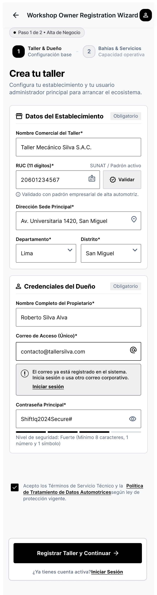
  
<b>Figura 44.</b> Wireframe de formulario de registro de taller y dueño B2B (US001).

Como se aprecia en la **Figura 45**, el flujo secuencial de bienvenida segmenta el registro inicial, solicitando en su primer paso la identificación formal del conductor o dueño, incluyendo nombres, apellidos, teléfono de contacto y correo corporativo.

  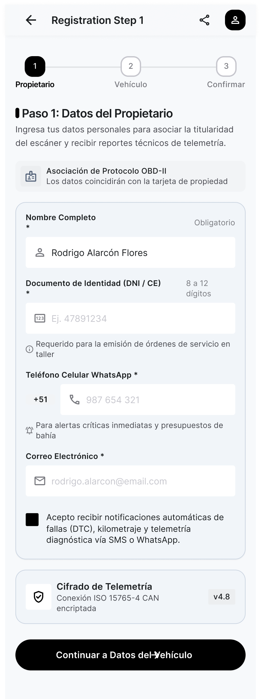
  
<b>Figura 45.</b> Wireframe de registro paso 1: Datos del propietario (US001).

Como se ilustra en la **Figura 46**, el segundo paso del onboarding permite el enrolamiento inicial del vehículo automotriz mediante la captura del número de placa y el escaneo opcional del código QR o Bluetooth del adaptador telemático OBD-II provisto por ShiftIQ.

  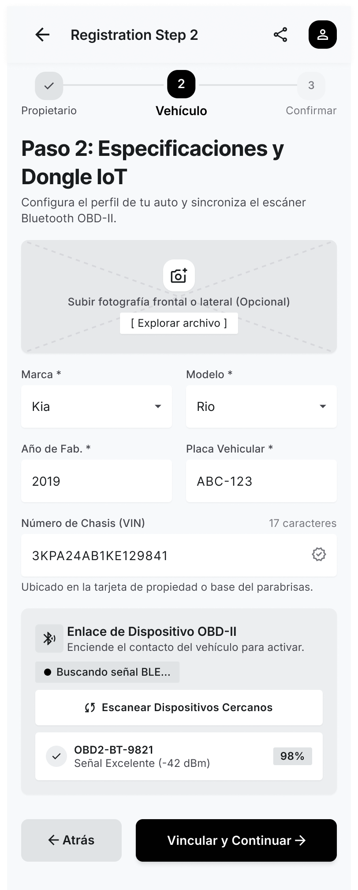
  
<b>Figura 46.</b> Wireframe de registro paso 2: Vinculación vehicular y OBD-II (US001).

Tal como se observa en la **Figura 47**, la vista de confirmación del onboarding resume los parámetros registrados y notifica la correcta inicialización del perfil, habilitando el botón de acción principal para ingresar directamente al espacio de trabajo.

  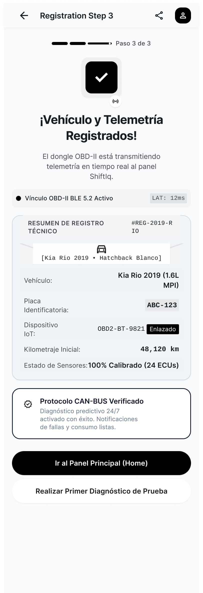
  
<b>Figura 47.</b> Wireframe de registro paso 3: Confirmación y resumen de alta (US001).

##### US002: Inicio de sesión (B2B y B2C)

Tal como se evidencia en la **Figura 48**, la interfaz de inicio de sesión B2B proporciona accesos diferenciados para el personal técnico y administrativo del taller, con campos de correo corporativo, contraseña encriptada, opción de recordar sesión y acceso rápido para federación de identidad OAuth2 con Google.

  
  
<b>Figura 48.</b> Wireframe de inicio de sesión para talleres y mecánicos B2B (US002).

Como se observa en la **Figura 49**, la vista de inicio de sesión B2C ofrece una experiencia simplificada para los propietarios vehiculares, priorizando el ingreso mediante credenciales personales, autenticación biométrica y recuperación expedita de cuenta.

  
  
<b>Figura 49.</b> Wireframe de inicio de sesión para conductores y clientes B2C (US002).

##### US004: Recuperación de contraseña con verificación OTP

Tal como se detalla en la **Figura 50**, el usuario ingresa su dirección de correo electrónico institucional asociada al taller para iniciar el procedimiento seguro de restablecimiento de contraseña.

  
  
<b>Figura 50.</b> Wireframe B2B de solicitud de código de recuperación (US004).

Como se observa en la **Figura 51**, la pantalla presenta un conjunto de celdas numéricas para la digitación del código OTP de 6 dígitos enviado por correo, incorporando un temporizador regresivo para reenviar el token en caso de expiración.

  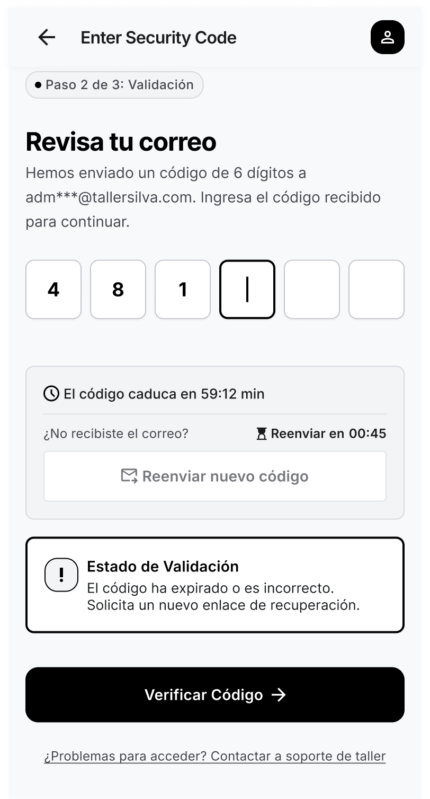
  
<b>Figura 51.</b> Wireframe B2B de ingreso y validación de código OTP (US004).

Tal como se aprecia en la **Figura 52**, la interfaz requiere el ingreso y reconfirmación de la nueva clave de acceso, evaluando la robustez de la contraseña según las políticas de complejidad criptográfica (longitud mínima, mayúsculas, dígitos y símbolos).

  
  
<b>Figura 52.</b> Wireframe B2B de establecimiento de nueva contraseña (US004).

Como se comprueba en la **Figura 53**, un modal informativo notifica al operador que las credenciales han sido actualizadas satisfactoriamente en el servidor de identidades, redirigiendo de inmediato a la pantalla de login.

  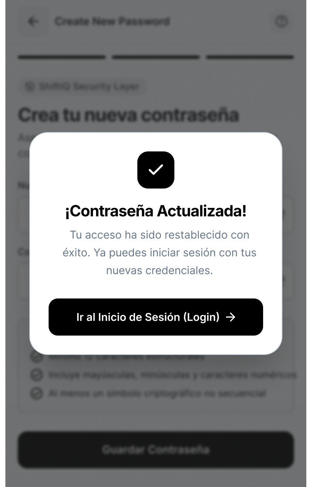
  
<b>Figura 53.</b> Wireframe modal B2B de restablecimiento exitoso (US004).

Tal como se observa en la **Figura 54**, el flujo B2C para conductores solicita el correo registrado del propietario particular para la emisión del desafío OTP.

  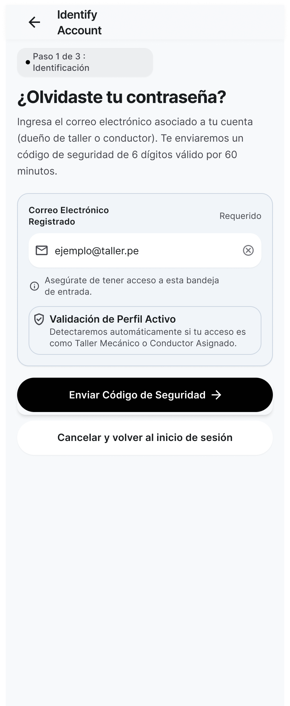
  
<b>Figura 54.</b> Wireframe B2C de solicitud de código de recuperación (US004).

Como se puede ver en la **Figura 55**, el conductor verifica su identidad ingresando el código de un solo uso recibido en su bandeja de entrada móvil.

  
  
<b>Figura 55.</b> Wireframe B2C de validación de token de seguridad OTP (US004).

Tal como se refleja en la **Figura 56**, la interfaz orientada al cliente particular permite definir la nueva contraseña con retroalimentación visual interactiva sobre los requisitos de seguridad.

  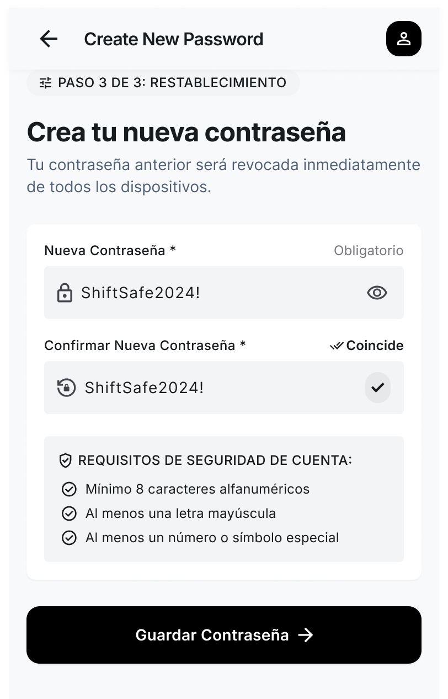
  
<b>Figura 56.</b> Wireframe B2C de cambio y confirmación de contraseña (US004).

Como se aprecia en la **Figura 57**, el diálogo modal confirma el restablecimiento exitoso de la cuenta particular del conductor.

  
  
<b>Figura 57.</b> Wireframe modal B2C de contraseña actualizada (US004).

##### US035: Actualización de correo electrónico de cuenta

Tal como se observa en la **Figura 58**, la pantalla de perfil centraliza la gestión de información personal, preferencias de idioma, estado de suscripción y acceso a la modificación de correo y contraseña.

  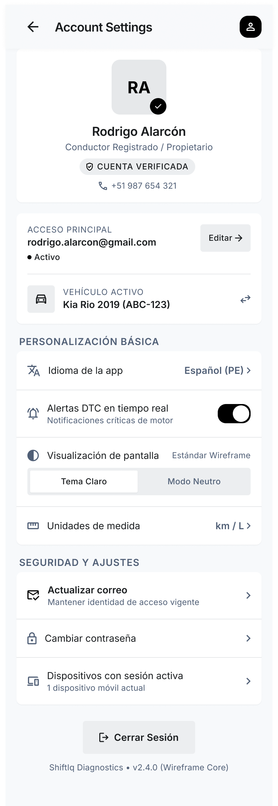
  
<b>Figura 58.</b> Wireframe de perfil de usuario y ajustes de cuenta (US035).

Como se ilustra en la **Figura 59**, el formulario solicita el ingreso del nuevo correo electrónico corporativo o personal, validando la estructura de formato antes de emitir el código de validación.

  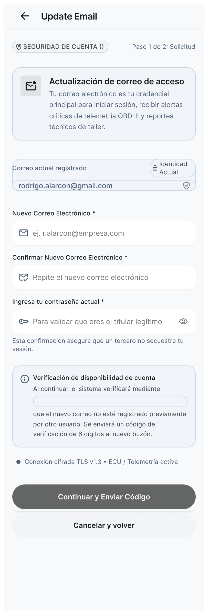
  
<b>Figura 59.</b> Wireframe de solicitud de nuevo correo electrónico (US035).

Tal como se muestra en la **Figura 60**, el sistema exige confirmar la titularidad del nuevo buzón mediante la validación del token numérico recibido antes de alterar la entidad en base de datos.

  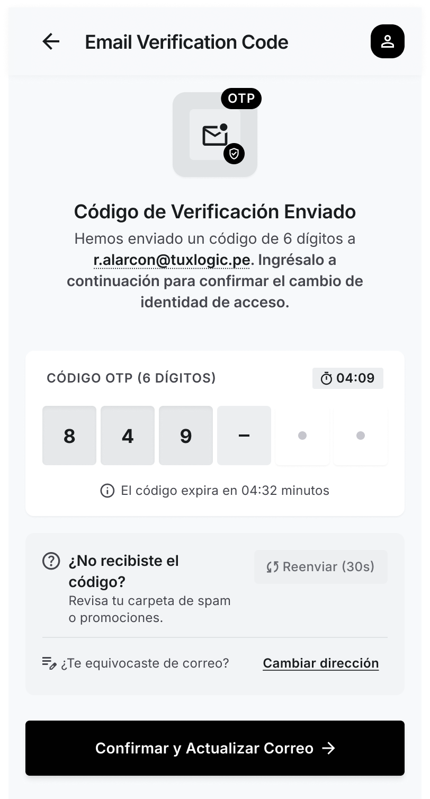
  
<b>Figura 60.</b> Wireframe de validación OTP para nuevo correo (US035).

Como se observa en la **Figura 61**, el modal de éxito ratifica la sincronización del nuevo correo en el directorio de identidades.

  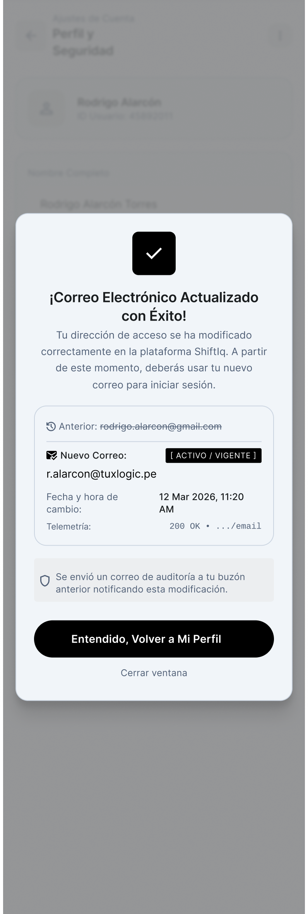
  
<b>Figura 61.</b> Wireframe modal de éxito en actualización de correo (US035).

Tal como se evidencia en la **Figura 62**, en caso de conflicto con una cuenta previamente registrada (HTTP 409), la interfaz advierte explícitamente el impedimento y preserva el correo original del usuario.

  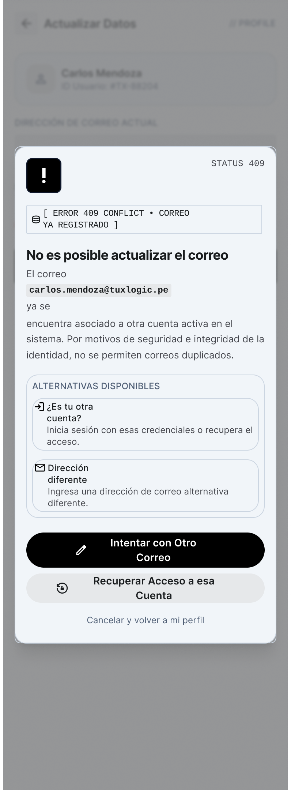
  
<b>Figura 62.</b> Wireframe modal de error por correo duplicado (US035).

##### US036: Cambio de contraseña autenticado

Tal como se observa en la **Figura 63**, la pantalla permite al usuario autenticado modificar su clave actual solicitando la verificación de la contraseña previa y la doble confirmación del nuevo valor.

  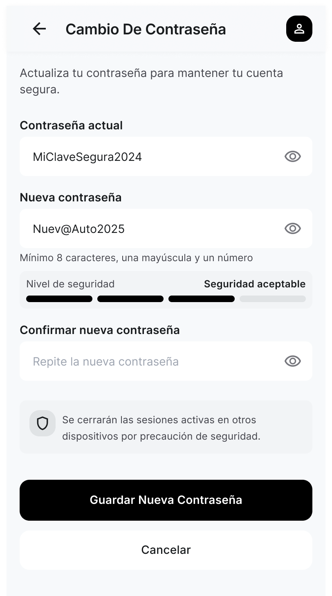
  
<b>Figura 63.</b> Wireframe de formulario de cambio de contraseña autenticado (US036).

Como se aprecia en la **Figura 64**, una alerta modal confirma el cambio de clave y recomienda mantener la confidencialidad de la nueva credencial.

  
  
<b>Figura 64.</b> Wireframe modal de cambio de contraseña exitoso (US036).

Tal como se muestra en la **Figura 65**, la interfaz notifica de inmediato cualquier inconsistencia, ya sea contraseña actual errónea o discrepancia en el campo de confirmación.

  
  
<b>Figura 65.</b> Wireframe modal de error de validación en cambio de contraseña (US036).

---

#### Módulo 2: Gestión de Talleres y Suscripciones (Workshop Management)

Este módulo gestiona la infraestructura organizativa del taller, sus sucursales operativas, el directorio de técnicos y el esquema de licenciamiento SaaS por sucursal.

##### US005: Directorio de empleados, asignación de roles y revocación de accesos

Como se observa en la **Figura 66**, la pantalla principal del módulo de personal lista a todos los colaboradores del taller con su nombre completo, cargo asignado (Mecánico, Cajero, Administrador), estado de actividad y sucursal de pertenencia.

  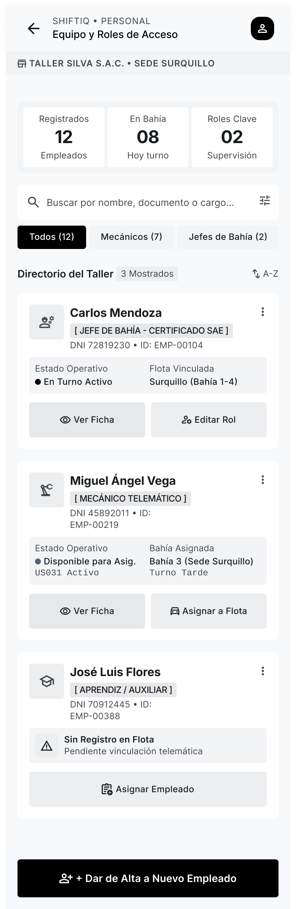
  
<b>Figura 66.</b> Wireframe de directorio de personal y asignación de roles (US005).

Tal como se ilustra en la **Figura 67**, el dueño de taller completa el alta ingresando el documento de identidad, nombre, correo, selección de rol operativo y sede asignada.

  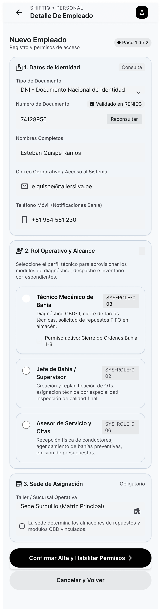
  
<b>Figura 67.</b> Wireframe de formulario de alta de nuevo empleado (US005).

Como se aprecia en la **Figura 68**, la ficha individual detalla los permisos concedidos al colaborador, historial de intervenciones y opciones para reasignar su rol o congelar su usuario.

  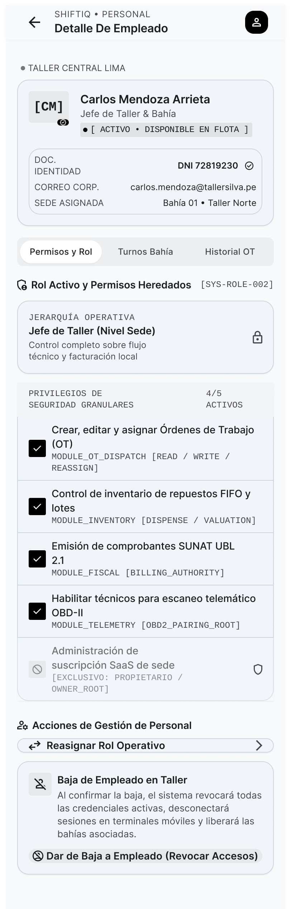
  
<b>Figura 68.</b> Wireframe de ficha detallada y permisos de empleado (US005).

Tal como se observa en la **Figura 69**, el sistema requiere una confirmación explícita mediante un modal destructivo antes de desvincular a un empleado, garantizando que sus tokens de acceso sean invalidados instantáneamente.

  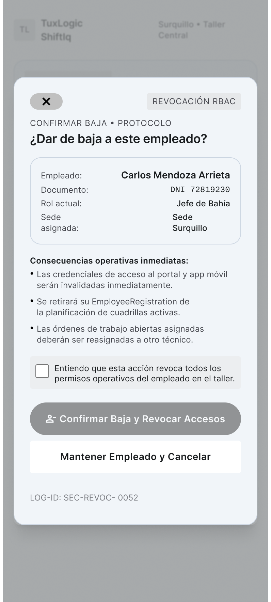
  
<b>Figura 69.</b> Wireframe modal de confirmación de baja y revocación de accesos (US005).

##### US006: Gestión y detalle de sucursales

Como se muestra en la **Figura 70**, la vista presenta la información operacional de la sede física: dirección, teléfono, cantidad de bahías de servicio habilitadas y capacidad de atención diaria.

  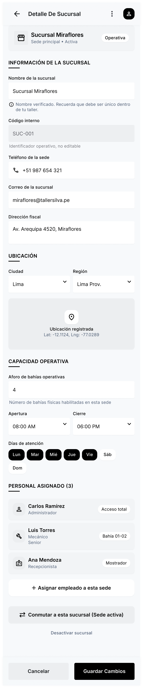
  
<b>Figura 70.</b> Wireframe de detalle operativo y capacidad de sucursal (US006).

Tal como se observa en la **Figura 71**, en caso de mantenimientos preventivos o cierre temporal de una sucursal, la aplicación visualiza un estado bloqueante amigable evitando asignaciones erróneas.

  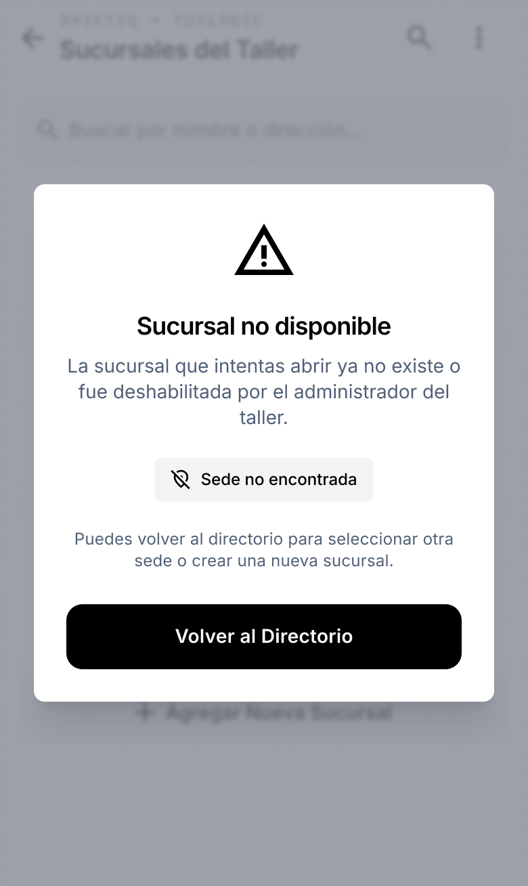
  
<b>Figura 71.</b> Wireframe de notificación de sucursal inactiva o sin cobertura (US006).

##### US007: Suscripción por sucursal, activación de módulos y modo solo lectura

Como se evidencia en la **Figura 72**, el administrador visualiza el plan vigente de cada sucursal (Básico, Profesional, Enterprise), fecha de vencimiento y módulos telemáticos activos.

  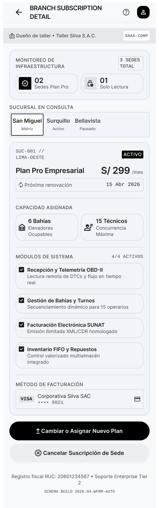
  
<b>Figura 72.</b> Wireframe de estado de suscripción por sucursal (US007).

Tal como se aprecia en la **Figura 73**, el dueño compara los niveles de suscripción disponibles con detalle de costos mensuales y capacidades operativas para actualizar la sede seleccionada.

  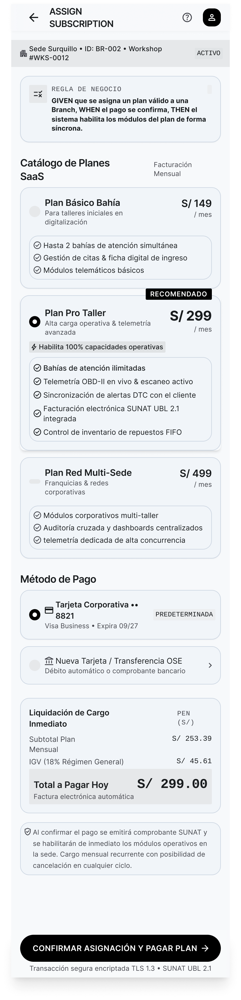
  
<b>Figura 73.</b> Wireframe de selección y asignación de plan SaaS (US007).

Como se observa en la **Figura 74**, el sistema confirma la habilitación inmediata de los nuevos módulos de telemetría y facturación para la sucursal elegida.

  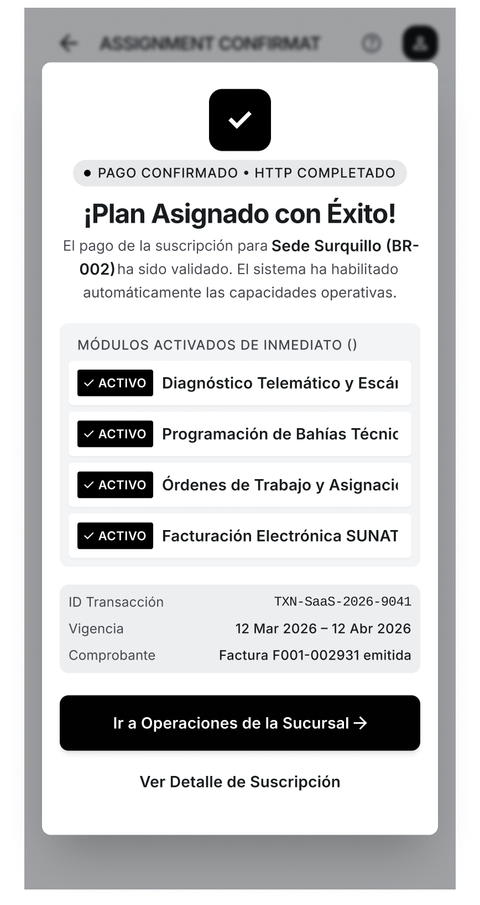
  
<b>Figura 74.</b> Wireframe modal de confirmación de activación de módulos (US007).

Tal como se detalla en la **Figura 75**, en caso de no renovación o baja del plan, la pantalla advierte que la sucursal operará en modo de solo lectura para consulta histórica de órdenes previas, sin admitir nuevas aperturas técnicas.

  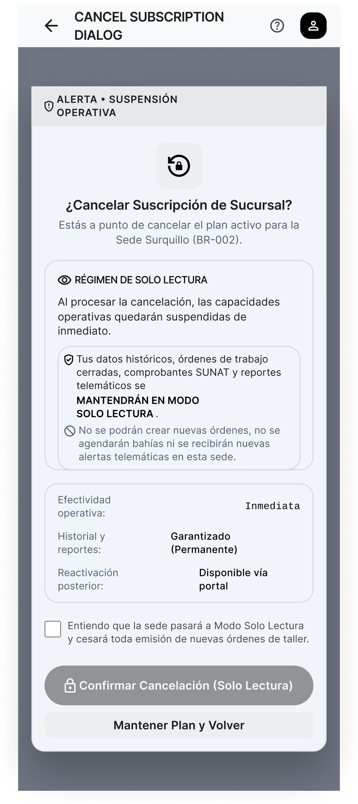
  
<b>Figura 75.</b> Wireframe de advertencia de cancelación y degradación a modo solo lectura (US007).

---

#### Módulo 3: Inteligencia Vehicular y Diagnóstico OBD-II (Vehicle Intelligence & Diagnostics)

Este módulo constituye el núcleo tecnológico del producto, encargándose de la ingesta de telemetría automotriz, diagnóstico en vivo de códigos DTC y gestión física de dongles telemáticos.

##### US017 / US025: Registro de vehículo y ficha técnica automotriz

Como se observa en la **Figura 76**, la interfaz de registro automotriz captura la placa de rodaje, marca, modelo, año de fabricación, tipo de combustible, kilometraje actual y número de chasis (VIN).

  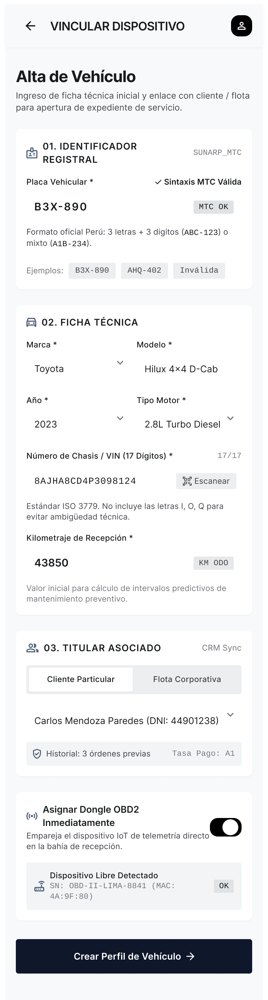
  
<b>Figura 76.</b> Wireframe de formulario de registro de vehículo (US017).

Tal como se ilustra en la **Figura 77**, la ficha del vehículo reúne en una sola tarjeta el historial de servicios, propietario actual, estado de salud de la batería y el estado de sincronización del adaptador telemático.

  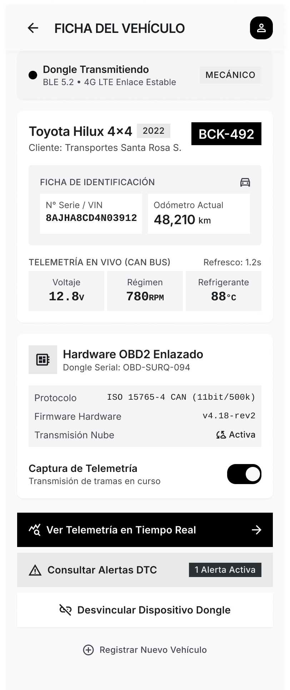
  
<b>Figura 77.</b> Wireframe de ficha vehicular y estado de conexión OBD-II (US017/US025).

##### US018 / US020: Vinculación y desvinculación de dispositivos OBD-II

Como se aprecia en la **Figura 78**, el mecánico selecciona el dongle telemático disponible mediante búsqueda por número de serie o escaneo de código de barras para asociarlo al vehículo.

  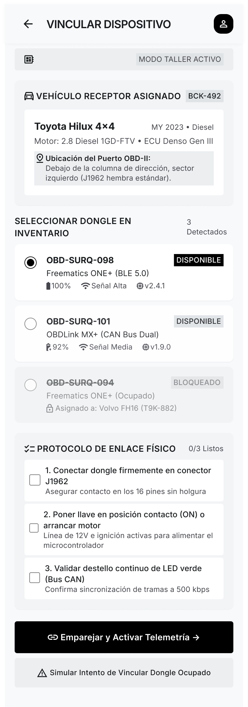
  
<b>Figura 78.</b> Wireframe de vinculación de dispositivo OBD-II al vehículo (US018).

Tal como se observa en la **Figura 79**, un componente emergente tipo bottom sheet despliega los dispositivos detectados en el radio Bluetooth del taller para enlace instantáneo.

  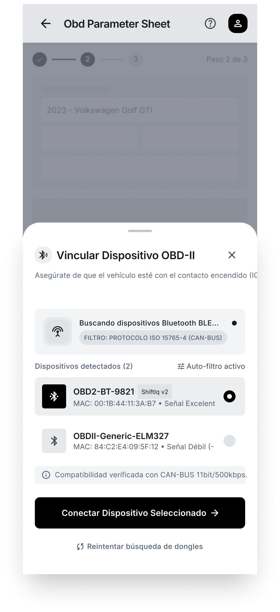
  
<b>Figura 79.</b> Wireframe de bottom sheet para enlace telemático rápido (US018).

Como se muestra en la **Figura 80**, el sistema previene asociaciones conflictivas indicando si el escáner ya se encuentra asignado a otra unidad activa.

  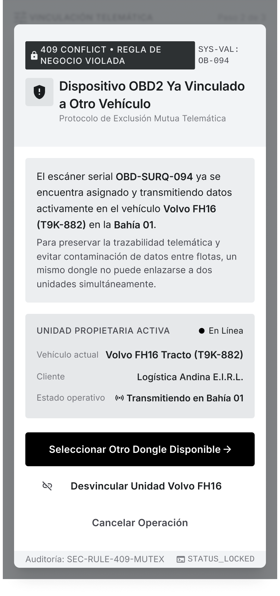
  
<b>Figura 80.</b> Wireframe modal de alerta de dispositivo previamente asociado.

Tal como se observa en la **Figura 81**, el modal requiere la confirmación técnica del mecánico antes de liberar el dongle OBD-II del inventario vehicular del cliente.

  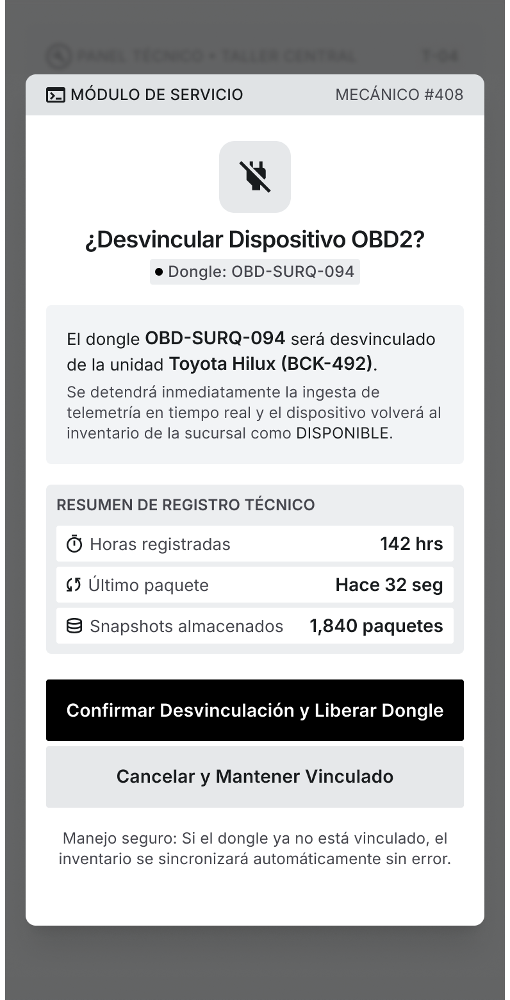
  
<b>Figura 81.</b> Wireframe modal de confirmación de desvinculación OBD-II (US020).

Como se verifica en la **Figura 82**, en caso de pérdida de enlace durante la operación, la interfaz brinda un protocolo de reintento para garantizar la consistencia del registro.

  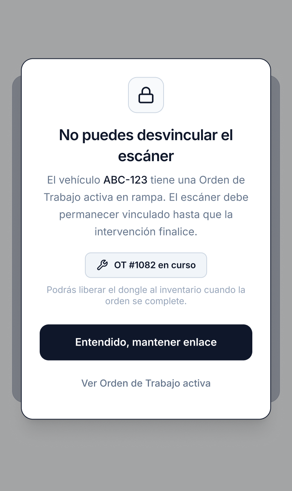
  
<b>Figura 82.</b> Wireframe de error durante la desvinculación del escáner.

##### US019 / US025: Telemetría automotriz en tiempo real y modo offline

Como se observa en la **Figura 83**, la consola telemática muestra en indicadores digitales las RPM del motor, velocidad instantánea, temperatura del refrigerante, presión barométrica y nivel de combustible en vivo.

  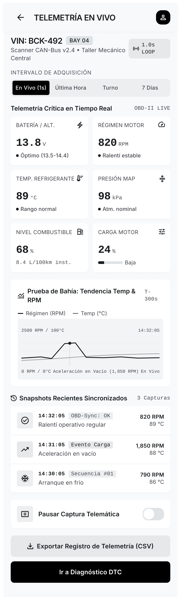
  
<b>Figura 83.</b> Wireframe de consulta de parámetros telemáticos en tiempo real (US019).

Tal como se detalla en la **Figura 84**, una barra de progreso circular anima el sondeo de protocolos CAN Bus mientras la aplicación recupera la trama completa de sensores.

  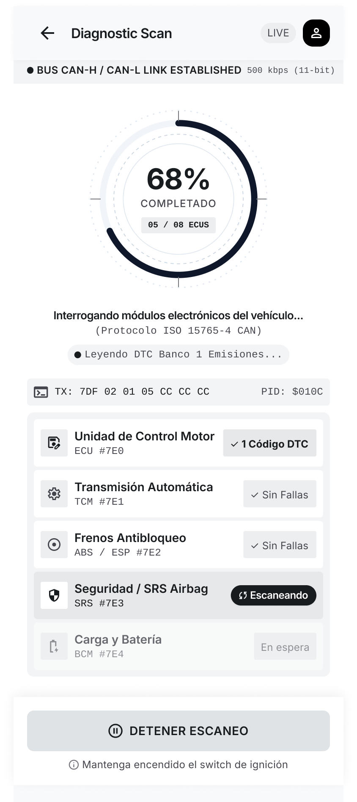
  
<b>Figura 84.</b> Wireframe de ejecución de diagnóstico y escaneo OBD-II en curso.

Como se evidencia en la **Figura 85**, el operador puede suspender o dar por concluido el ciclo de lectura para consolidar las métricas obtenidas.

  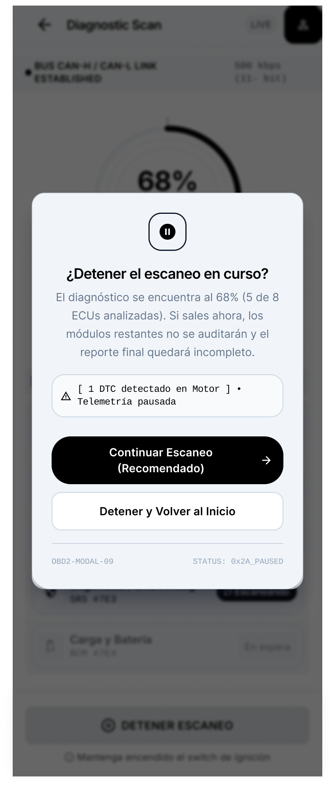
  
<b>Figura 85.</b> Wireframe de control y detención de escaneo telemático.

Tal como se aprecia en la **Figura 86**, la vista técnica presenta los paquetes de datos almacenados localmente en buffer SQLite a la espera de confirmación de entrega en el servidor.

  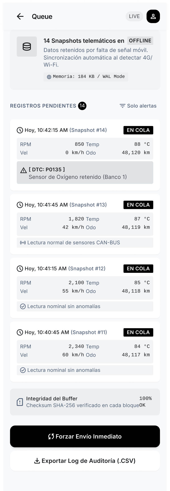
  
<b>Figura 86.</b> Wireframe de cola de paquetes de telemetría en cola local.

Como se observa en la **Figura 87**, cuando el vehículo o el taller pierde conectividad celular o Wi-Fi, la interfaz notifica el estado offline y garantiza la persistencia local de lecturas telemáticas sin pérdida de información.

  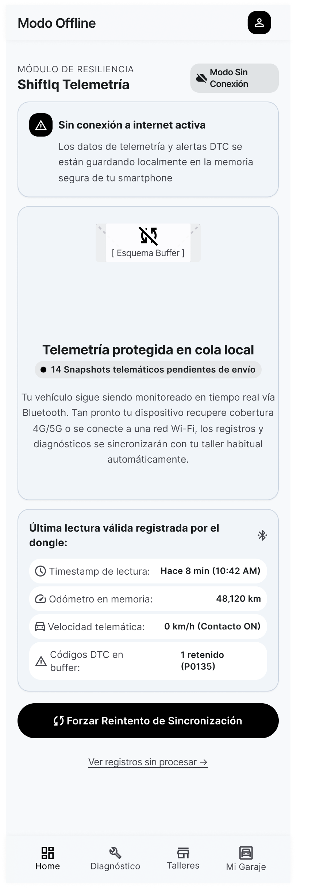
  
<b>Figura 87.</b> Wireframe de banner y modo offline con sincronización diferida (US025).

##### US021: Inventario y alta de dispositivos OBD-II

Tal como se ilustra en la **Figura 88**, el encargado de almacén gestiona el stock de hardware telemático, registrando nuevos dispositivos por código MAC y verificando qué unidades están en bodega o instaladas.

  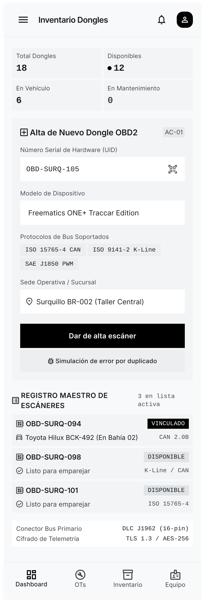
  
<b>Figura 88.</b> Wireframe de inventario y alta de dongles OBD-II en sucursal (US021).

##### US023: Diagnóstico de códigos DTC y traducción simple

Como se observa en la **Figura 89**, la pantalla lista las anomalías electrónicas detectadas (ej. P0300, P0420) categorizadas por severidad (Crítica, Advertencia, Informativa).

  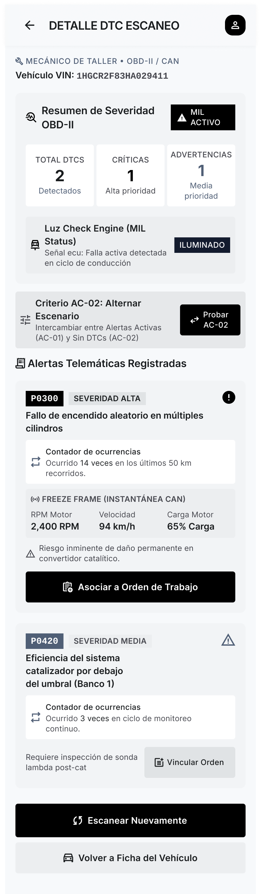
  
<b>Figura 89.</b> Wireframe de listado de fallas y códigos de diagnóstico DTC (US023).

Tal como se muestra en la **Figura 90**, ShiftIQ traduce el código técnico SAE a una explicación didáctica en lenguaje natural para que el conductor comprenda el riesgo, el síntoma vehicular y la recomendación técnica.

  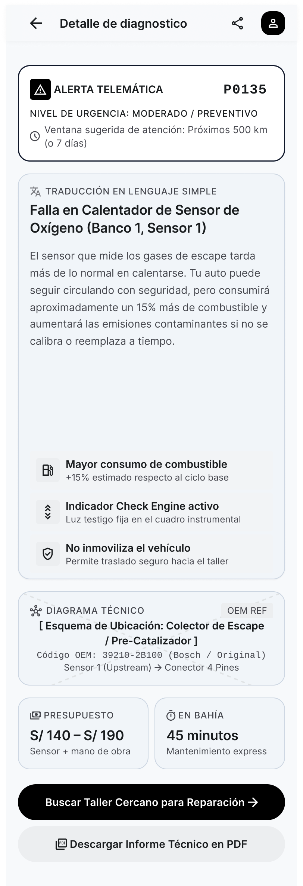
  
<b>Figura 90.</b> Wireframe de explicación comprensible de falla DTC para el conductor (US023).

Como se aprecia en la **Figura 91**, el documento formal de diagnóstico puede ser previsualizado directamente en el dispositivo móvil y exportado o compartido mediante mensajería instantánea.

  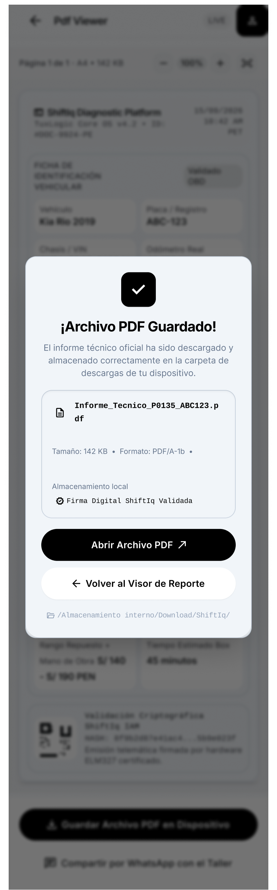
  
<b>Figura 91.</b> Wireframe de visor embebido de reporte técnico de escaneo en PDF.

---

#### Módulo 4: Flotas y Agenda de Citas Técnicas (Fleet & Appointments)

Este módulo gestiona el calendario de bahías del taller automotriz, la concertación de citas preventivas y correctivas, y la administración de vehículos corporativos para flotas.

##### US026 / US029: Agenda de citas y reserva de bahía técnica

Tal como se observa en la **Figura 92**, la agenda centralizada permite al personal de recepción consultar los turnos del día, filtrar por bahía técnica disponible y visualizar el estado de llegada de cada vehículo.

  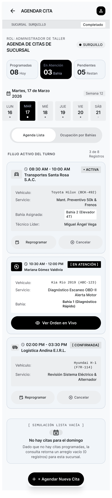
  
<b>Figura 92.</b> Wireframe de calendario y agenda diaria de citas de la sucursal (US029).

Como se aprecia en la **Figura 93**, el usuario o recepcionista selecciona la fecha, franja horaria disponible, bahía técnica requerida (elevador, fosa o diagnóstico) y el servicio automotriz solicitado.

  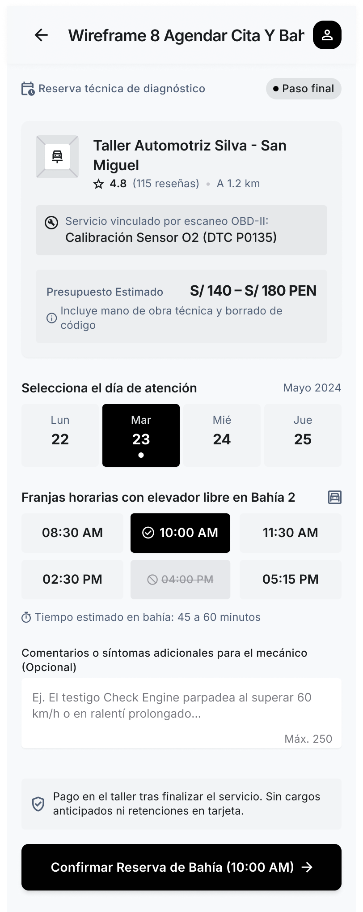
  
<b>Figura 93.</b> Wireframe de formulario de reserva de turno y bahía técnica (US026).

Tal como se ilustra en la **Figura 94**, el jefe de taller supervisa la disponibilidad de elevadores en paralelo para evitar sobrecargas horarias o solapamientos de turnos.

  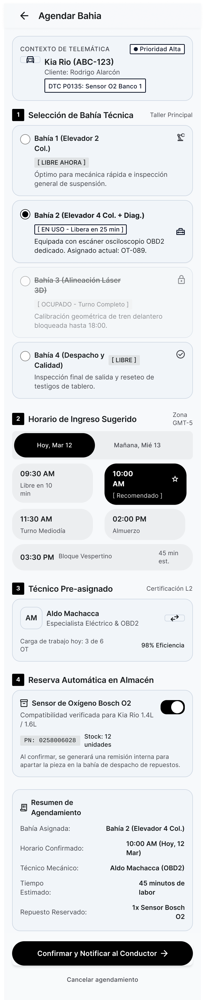
  
<b>Figura 94.</b> Wireframe de vista avanzada de asignación de bahía B2B (US026).

Como se muestra en la **Figura 95**, un resumen confirma la fecha, hora, sucursal y placa vehicular, enviando un recordatorio automatizado al cliente.

  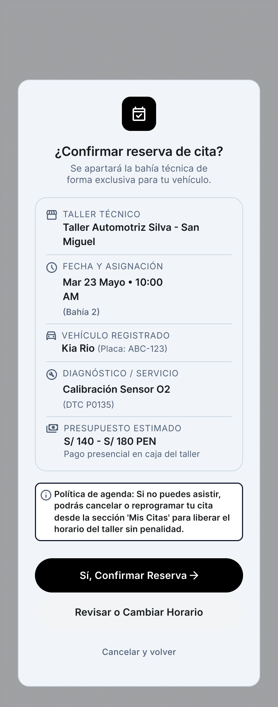
  
<b>Figura 95.</b> Wireframe modal de confirmación de cita agendada.

Tal como se observa en la **Figura 96**, en caso de conflicto horario, el sistema informa la indisponibilidad de la bahía y sugiere el siguiente bloque disponible más cercano.

  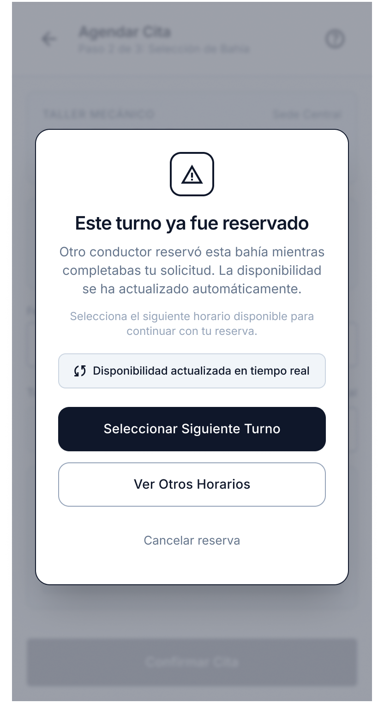
  
<b>Figura 96.</b> Wireframe de alerta ante bahía ocupada o turno no disponible.

##### US028: Cancelación y gestión de citas activas

Como se evidencia en la **Figura 97**, la pantalla permite al usuario revisar sus citas programadas y solicitar la cancelación oportuna indicando el motivo.

  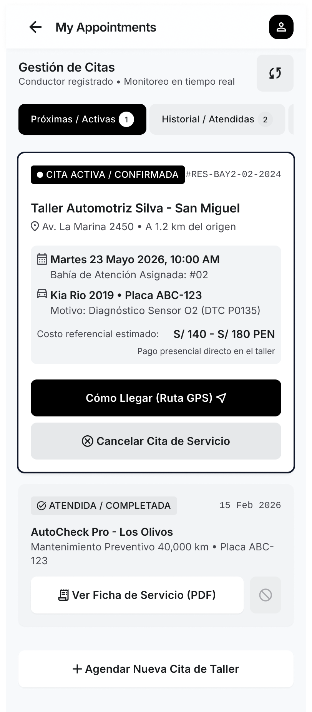
  
<b>Figura 97.</b> Wireframe de listado de citas y opción de cancelación (US028).

Tal como se observa en la **Figura 98**, un diálogo de confirmación asegura que la bahía sea liberada inmediatamente en el sistema para permitir nuevas reservas.

  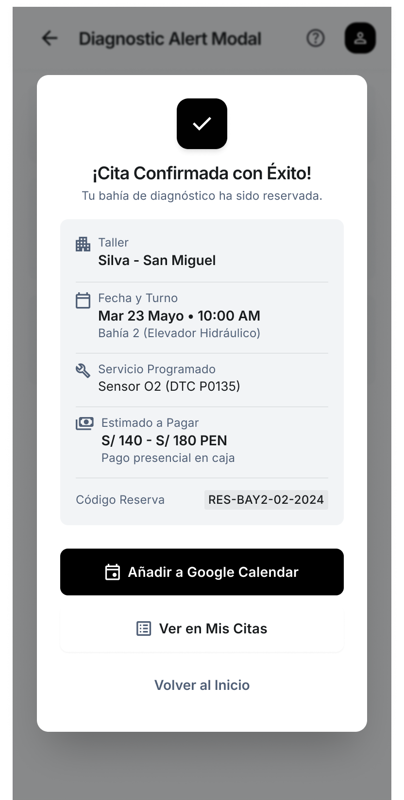
  
<b>Figura 98.</b> Wireframe modal de confirmación de anulación de turno (US028).

##### US030 / US031 / US032: Directorio de clientes y registro de personal de flota

Como se observa en la **Figura 99**, el recepcionista accede al registro unificado de clientes particulares y empresas de flotas, visualizando historial de visitas y saldo de cuenta corriente.

  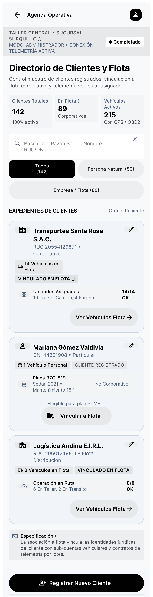
  
<b>Figura 99.</b> Wireframe de directorio de clientes particulares y corporativos (US032/US030).

Tal como se aprecia en la **Figura 100**, el administrador de flota enrola a los choferes autorizados vinculándolos a las unidades automotrices asignadas a su turno de trabajo.

  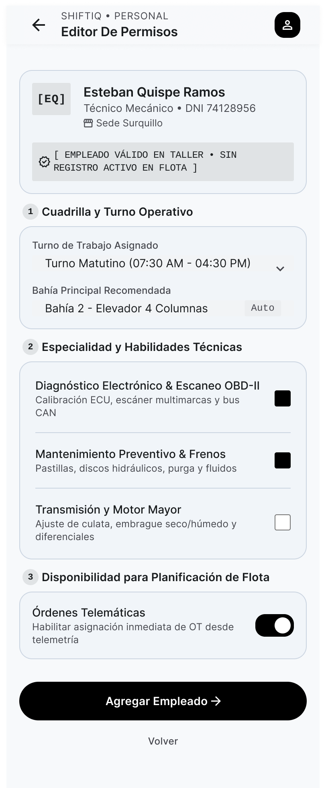
  
<b>Figura 100.</b> Wireframe de asignación de chofer o empleado a flota vehicular (US031).

Como se detalla en la **Figura 101**, el sistema previene la doble asignación de choferes en flotas concurrentes mostrando una alerta de conflicto.

  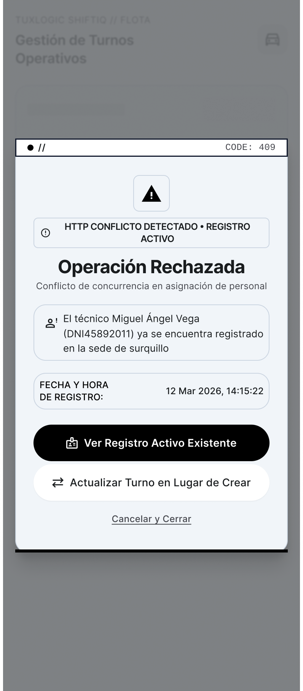
  
<b>Figura 101.</b> Wireframe modal de error 409 por conductor ya asignado a flota activa (US031).

---

#### Módulo 5: Gestión de Inventario y Control de Repuestos (Inventory Management)

Este módulo controla las existencias físicas de repuestos y lubricantes, implementando costeo FIFO, alertas de stock mínimo y bloqueos ante intentos de saldos negativos.

##### US008 / US009: Catálogo de repuestos y ficha técnica de producto

Tal como se observa en la **Figura 102**, el panel de repuestos presenta el catálogo de piezas con código SKU, descripción, marca, stock actual disponible y precio de venta al público.

  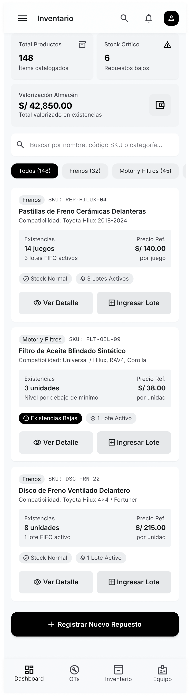
  
<b>Figura 102.</b> Wireframe de inventario y catálogo maestro de repuestos (US008).

Como se aprecia en la **Figura 103**, el responsable de compras registra nuevos artículos especificando categoría, unidad de medida, umbral mínimo de alerta y proveedor sugerido.

  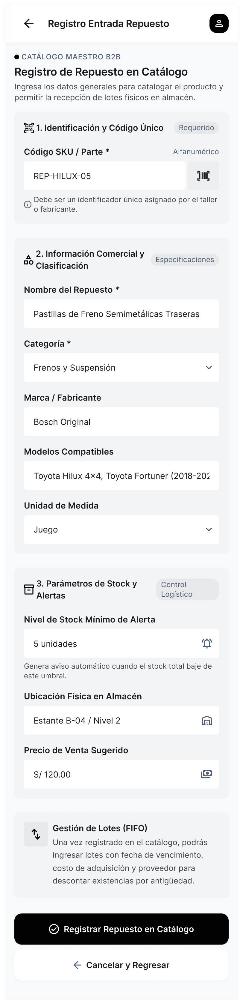
  
<b>Figura 103.</b> Wireframe de formulario de alta de nuevo repuesto (US008).

Tal como se ilustra en la **Figura 104**, la ficha del artículo exhibe el desglose de lotes vigentes, trazabilidad de ingresos y salidas, y compatibilidad vehicular de la pieza.

  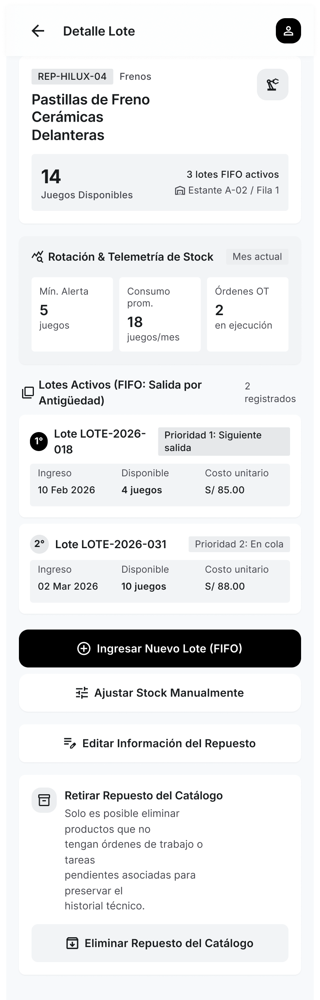
  
<b>Figura 104.</b> Wireframe de ficha detallada y movimientos de repuesto (US009).

##### US010: Ingreso de lote FIFO y ajuste manual de existencias

Como se muestra en la **Figura 105**, el ingreso de nueva mercadería registra el número de factura de compra, cantidad de unidades, costo unitario y fecha de recepción para el cálculo estricto de costeo FIFO.

  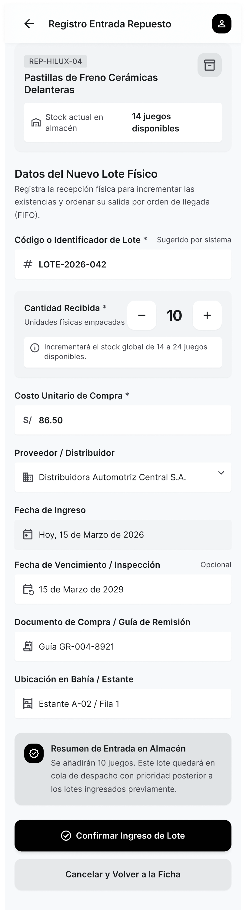
  
<b>Figura 105.</b> Wireframe de registro de lote de repuestos con costeo FIFO (US010).

Tal como se evidencia en la **Figura 106**, la pantalla permite realizar correcciones de stock justificadas (daño de pieza, inventario cíclico o merma técnica) con registro de auditoría.

  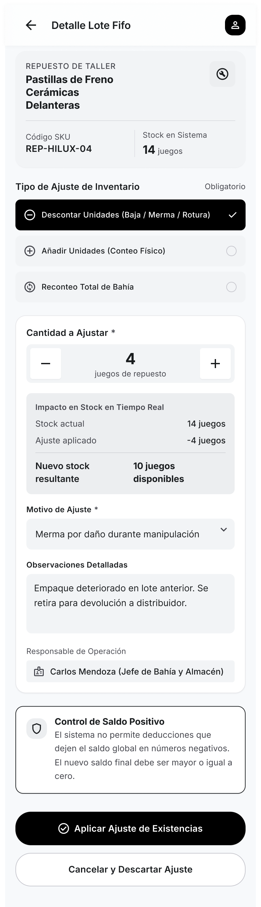
  
<b>Figura 106.</b> Wireframe de ajuste manual por inventario físico o merma (US010).

##### Validaciones y restricciones de inventario

Como se observa en la **Figura 107**, el sistema impide despachar o consumir repuestos sin inventario físico disponible en el almacén de la sucursal.

  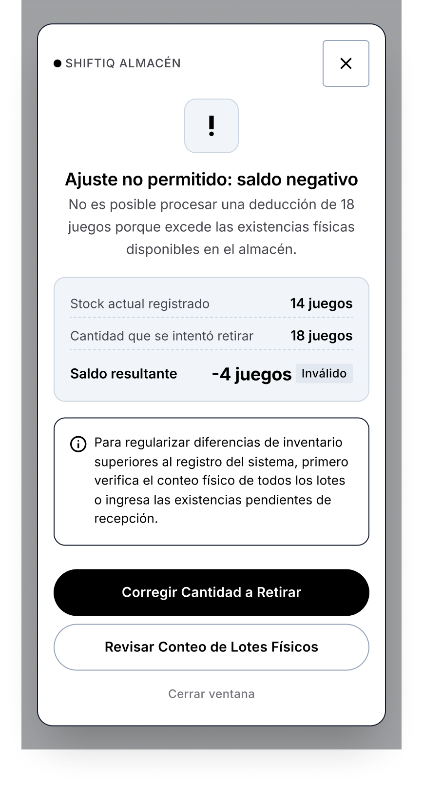
  
<b>Figura 107.</b> Wireframe de bloqueo por saldo de stock negativo.

Tal como se aprecia en la **Figura 108**, una alerta contextual previene registrar un artículo con un código de identificación interna previamente asignado.

  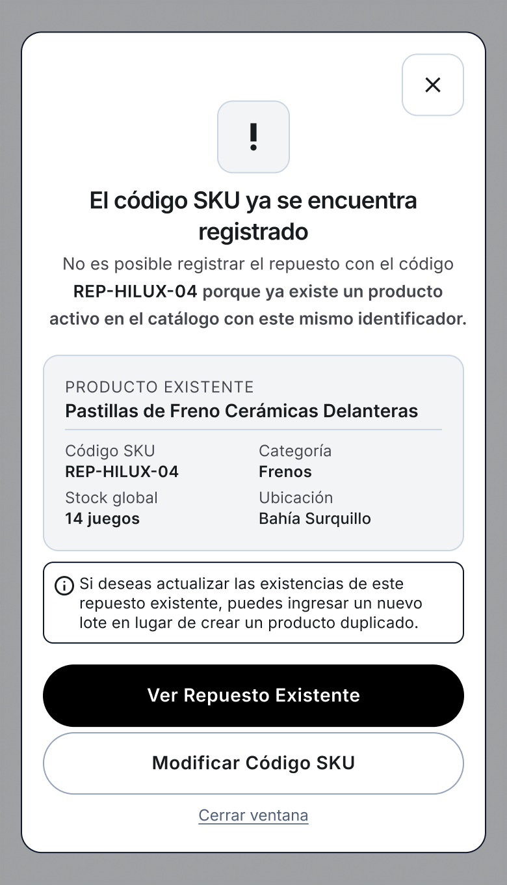
  
<b>Figura 108.</b> Wireframe de validación ante código SKU duplicado.

Como se muestra en la **Figura 109**, el software prohíbe eliminar piezas que cuenten con movimientos históricos en órdenes de trabajo previas para preservar la trazabilidad contable.

  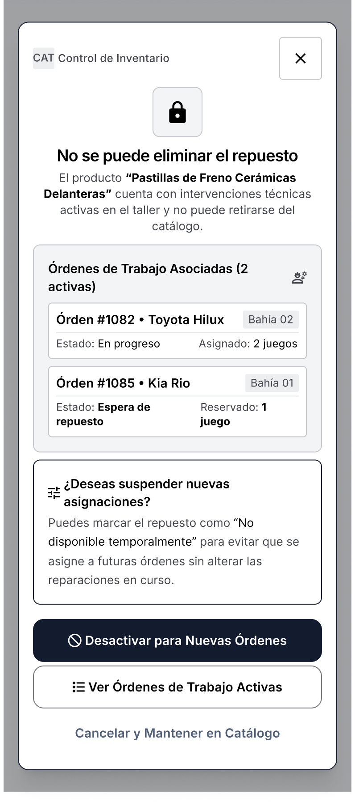
  
<b>Figura 109.</b> Wireframe de bloqueo al intentar eliminar un repuesto con historial.

---

#### Módulo 6: Operaciones de Servicio y Órdenes de Trabajo (Service Operations)

Este módulo gestiona la ejecución técnica dentro del taller, desde la definición del catálogo de servicios hasta el ciclo de vida completo de las Órdenes de Trabajo (OT).

##### US011: Catálogo maestro de servicios automotrices

Tal como se observa en la **Figura 110**, la pantalla centraliza los servicios ofrecidos por el taller (mantenimiento preventivo, frenos, afinamiento electrónico), indicando duración estimada y costo estándar de mano de obra.

  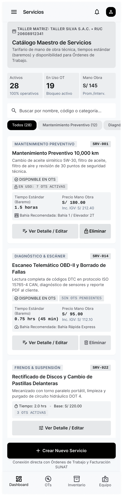
  
<b>Figura 110.</b> Wireframe de catálogo maestro de servicios del taller (US011).

Como se aprecia en la **Figura 111**, el formulario valida que el precio de mano de obra sea estrictamente mayor a cero y que se definan las operaciones técnicas incluidas.

  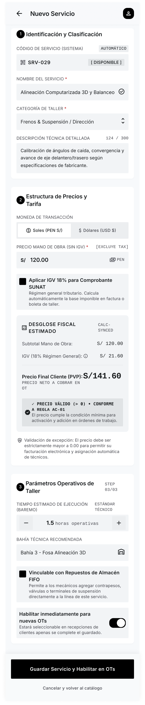
  
<b>Figura 111.</b> Wireframe de alta de servicio con precio y tiempo base (US011).

Tal como se ilustra en la **Figura 112**, la vista permite actualizar las especificaciones operativas del servicio y gestionar su disponibilidad por sucursal.

  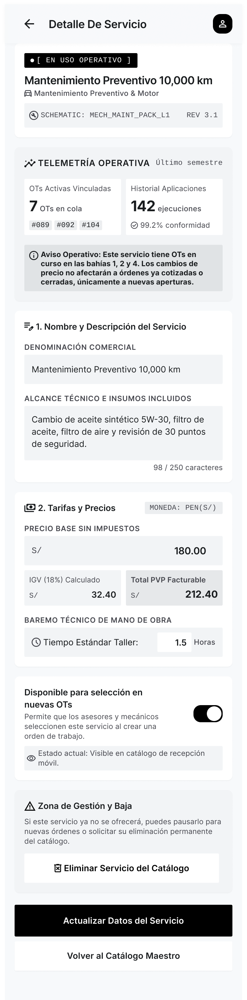
  
<b>Figura 112.</b> Wireframe de edición y tarifas de servicio automotriz (US011).

Como se observa en la **Figura 113**, el sistema advierte si el servicio se encuentra activo en órdenes en curso para evitar inconsistencias en la liquidación.

  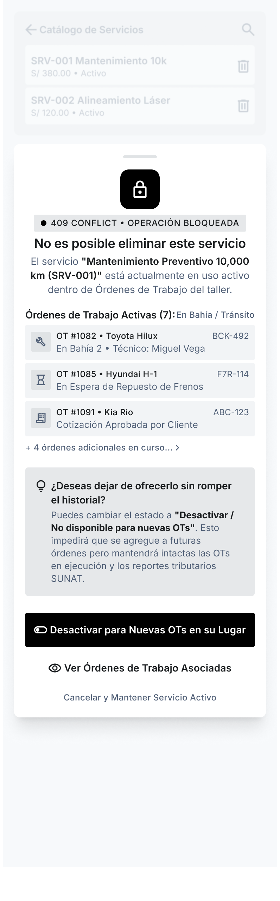
  
<b>Figura 113.</b> Wireframe de advertencia al modificar un servicio asignado a órdenes abiertas.

##### US012 / US050: Creación y consulta de Órdenes de Trabajo (OT)

Tal como se observa en la **Figura 114**, el tablero operativo organiza las órdenes en columnas por estado (*Creada*, *En Diagnóstico*, *En Ejecución*, *En Espera de Repuestos*, *Completada*), permitiendo búsquedas rápidas por placa y número de orden.

  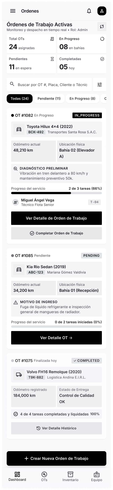
  
<b>Figura 114.</b> Wireframe de consulta y tablero kanban de Órdenes de Trabajo (US050).

Como se muestra en la **Figura 115**, la pantalla de recepción registra el cliente, vehículo, kilometraje de entrada, nivel de combustible y los síntomas o requerimientos manifestados por el usuario.

  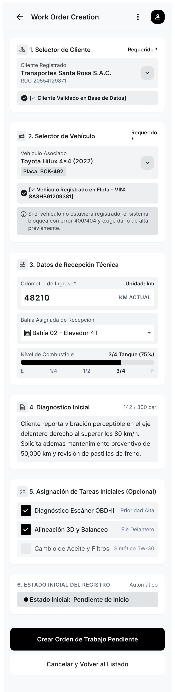
  
<b>Figura 115.</b> Wireframe de apertura y creación de nueva Orden de Trabajo (US012).

Tal como se aprecia en la **Figura 116**, un diálogo valida el resumen de ingreso antes de comprometer los recursos del taller y generar el número correlativo de OT.

  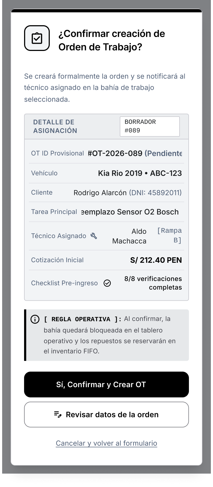
  
<b>Figura 116.</b> Wireframe modal de confirmación de apertura de OT (US012).

Como se evidencia en la **Figura 117**, la interfaz confirma el número único asignado a la orden y permite imprimir de inmediato el resguardo técnico de recepción.

  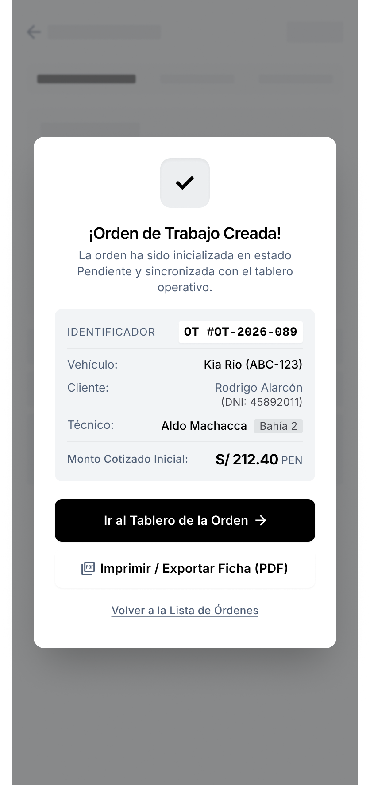
  
<b>Figura 117.</b> Wireframe modal de orden de trabajo generada con éxito (US012).

Tal como se observa en la **Figura 118**, el documento generado resume la inspección visual de 360 grados del automóvil, pertenencias a bordo y firma de conformidad del cliente.

  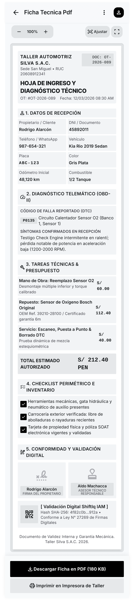
  
<b>Figura 118.</b> Wireframe de visor de ficha técnica de ingreso vehicular en PDF.

##### US013 / US014 / US015 / US048 / US049: Ejecución técnica de tareas y consumo de repuestos

Como se observa en la **Figura 119**, la ficha de la orden agrupa las tareas asignadas, diagnóstico técnico, repuestos solicitados, tiempos registrados y balance económico acumulado.

  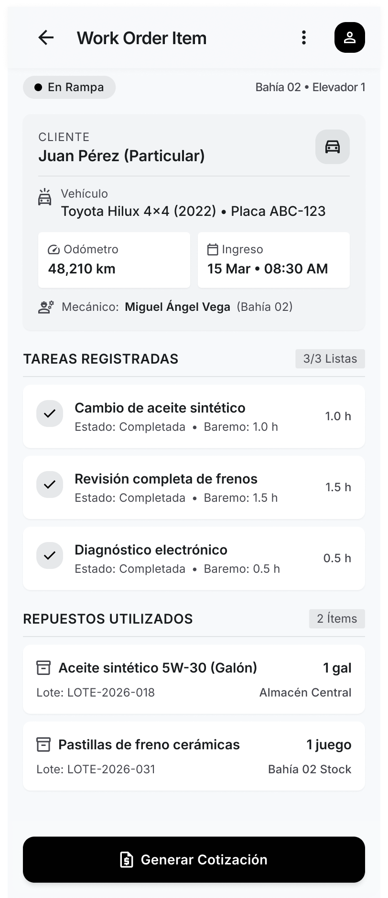
  
<b>Figura 119.</b> Wireframe de ficha detallada de Orden de Trabajo activa.

Tal como se aprecia en la **Figura 120**, el mecánico documenta las causas raíz de la falla, observaciones mecánicas y lecturas DTC capturadas antes de iniciar reparaciones.

  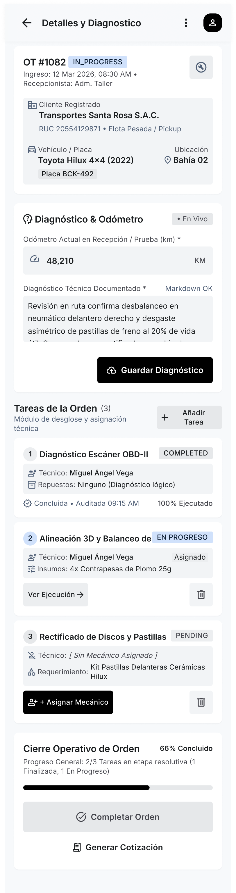
  
<b>Figura 120.</b> Wireframe de registro de diagnóstico técnico preliminar.

Como se muestra en la **Figura 121**, el administrador añade labores específicas a la orden indicando tipo de trabajo, mecánico responsable y tiempo asignado.

  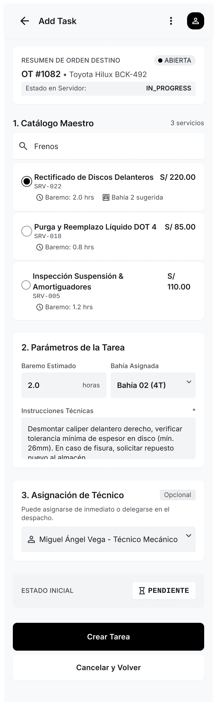
  
<b>Figura 121.</b> Wireframe de agregar nueva tarea a la Orden de Trabajo (US048).

Tal como se ilustra en la **Figura 122**, se selecciona al especialista según carga de trabajo disponible y especialidad requerida (motor, frenos, suspensión o electrónica).

  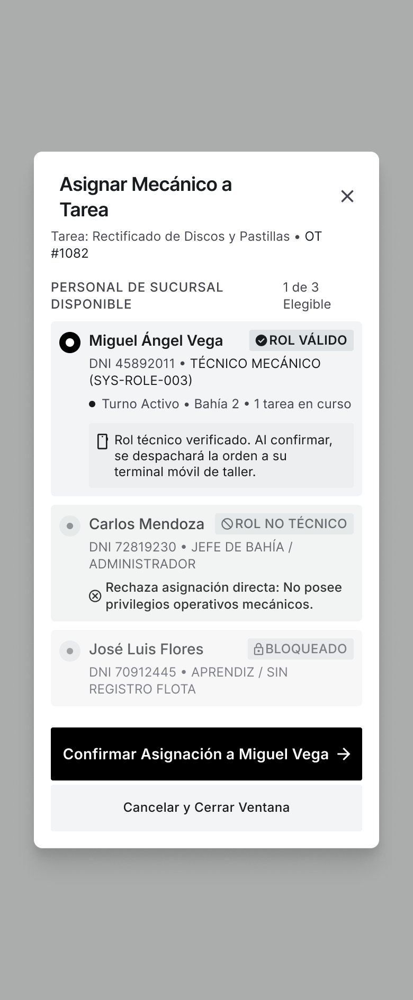
  
<b>Figura 122.</b> Wireframe de asignación de mecánico técnico a labor (US013).

Como se evidencia en la **Figura 123**, la interfaz simplificada para el mecánico en bahía permite iniciar el cronómetro de la labor, reportar avances y solicitar insumos del almacén.

  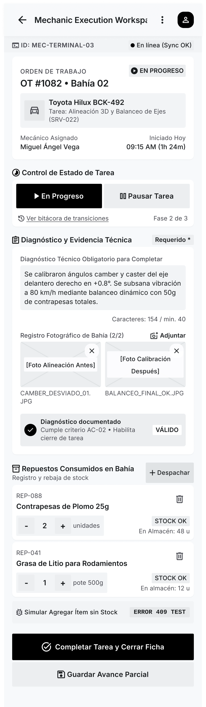
  
<b>Figura 123.</b> Wireframe de espacio de trabajo técnico del mecánico (US014/US015).

Tal como se aprecia en la **Figura 124**, el sistema exige obligatoriamente ingresar las conclusiones técnicas antes de permitir dar por cerrada la tarea.

  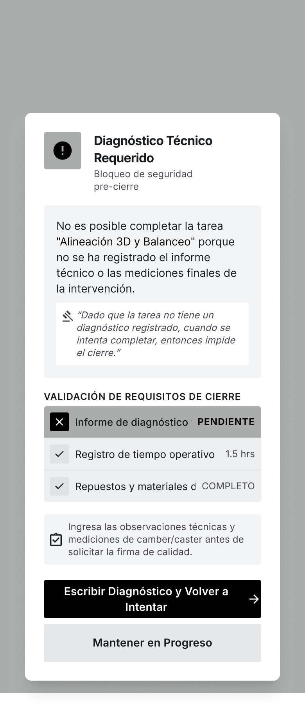
  
<b>Figura 124.</b> Wireframe de bloqueo al intentar finalizar tarea sin diagnóstico registrado (US014).

Como se observa en la **Figura 125**, las tareas que registran tiempos de ejecución o piezas despachadas no pueden ser eliminadas, garantizando la auditoría operativa.

  
  
<b>Figura 125.</b> Wireframe de restricción al intentar suprimir una tarea ya iniciada (US049).

Tal como se muestra en la **Figura 126**, si un mecánico requiere piezas no disponibles en bodega, el sistema genera una requisición urgente sin permitir cerrar la orden hasta su regularización.

  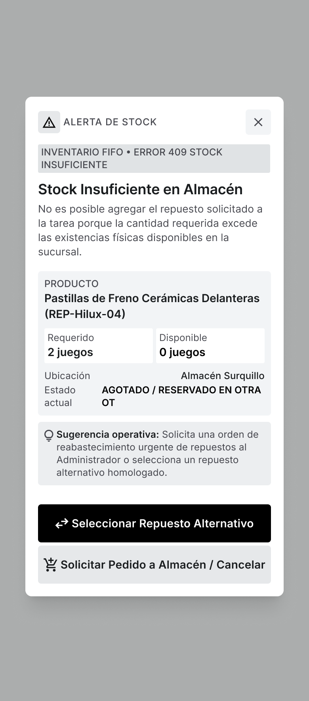
  
<b>Figura 126.</b> Wireframe de advertencia de stock insuficiente para repuestos de tarea (US015).

Como se verifica en la **Figura 127**, una orden de trabajo no puede pasar a liquidación si contiene labores inconclusas en las bahías técnicas.

  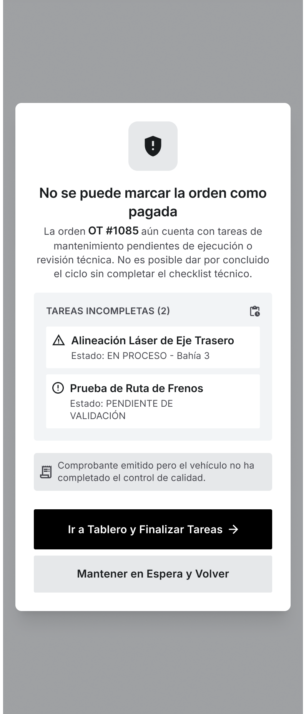
  
<b>Figura 127.</b> Wireframe de bloqueo de cierre de OT con tareas abiertas.

---

#### Módulo 7: Facturación, Cotizaciones y Pagos (Billing & Payments)

Este módulo gestiona la liquidación económica del servicio, aprobación de cotizaciones por el cliente, integración de pasarela de pago digital y emisión de comprobantes.

##### US037 / US038 / US039: Creación, aprobación DRAFT y cancelación de cotizaciones

Tal como se observa en la **Figura 128**, el asesor de servicio consolida los costos de mano de obra y piezas requeridas, calculando automáticamente subtotal, descuentos e impuestos aplicables.

  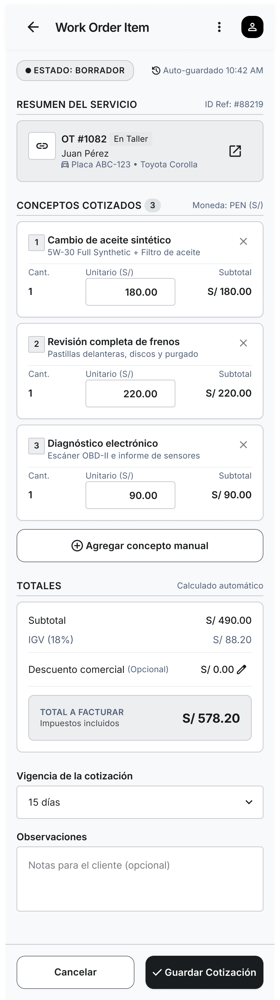
  
<b>Figura 128.</b> Wireframe de confección de presupuesto y cotización técnica (US037).

Como se aprecia en la **Figura 129**, la pantalla revisa los importes calculados antes de remitir la propuesta en formato digital al dispositivo móvil del cliente.

  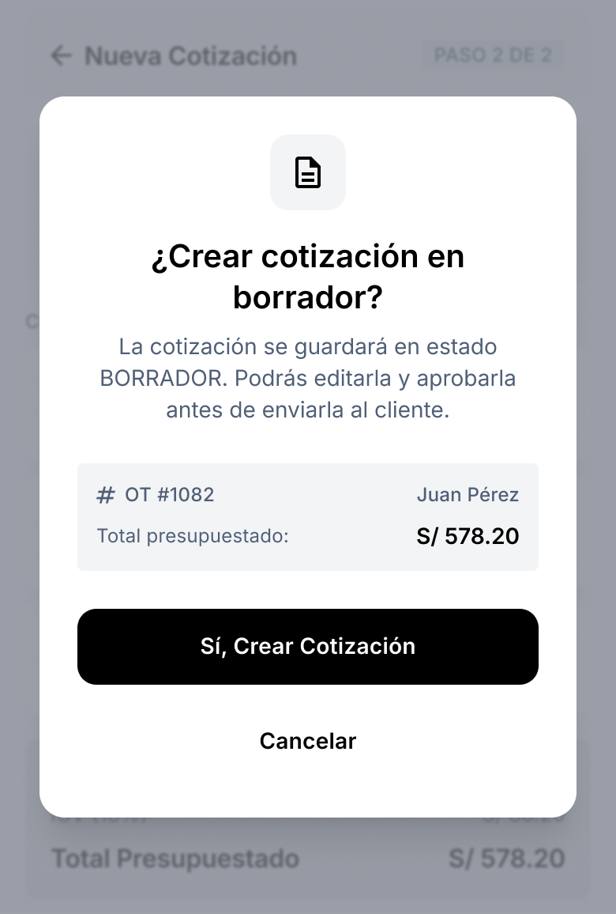
  
<b>Figura 129.</b> Wireframe de confirmación de envío de cotización al cliente.

Tal como se evidencia en la **Figura 130**, se notifica que la cotización ha quedado en estado *DRAFT* pendiente de la venia formal del propietario.

  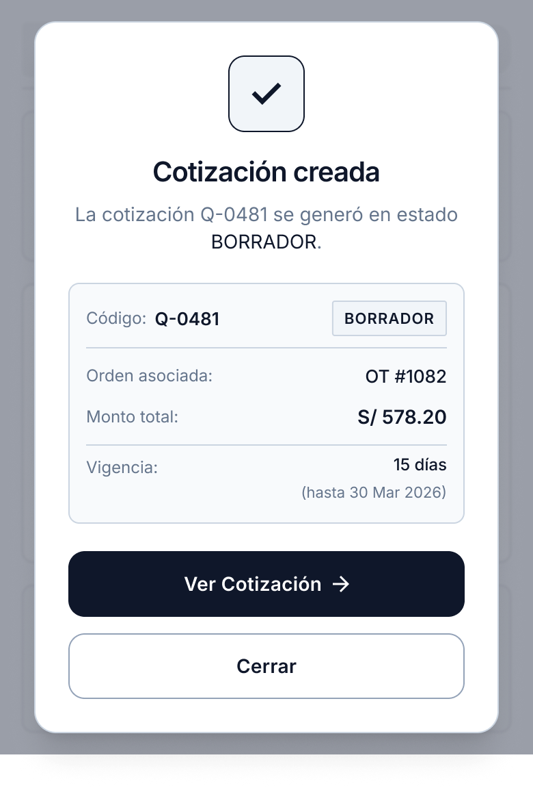
  
<b>Figura 130.</b> Wireframe de confirmación de cotización registrada.

Como se muestra en la **Figura 131**, el cliente o conductor revisa cada ítem presupuestado en su teléfono y autoriza el presupuesto con su firma digital.

  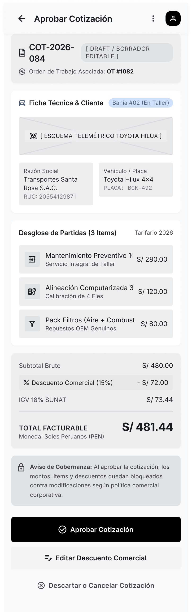
  
<b>Figura 131.</b> Wireframe de aprobación digital de cotización por el cliente (US038).

Tal como se aprecia en la **Figura 132**, en caso de disconformidad, el usuario puede descartar la cotización registrando la causal de rechazo.

  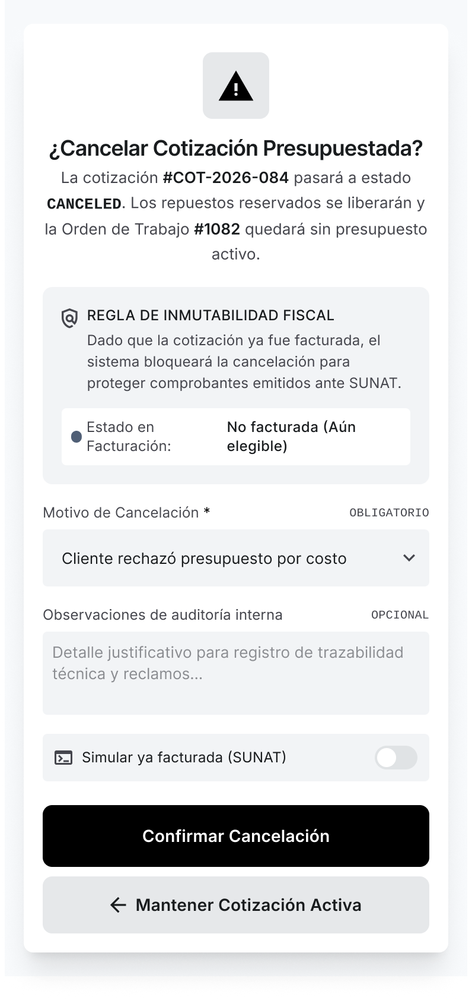
  
<b>Figura 132.</b> Wireframe de rechazo o cancelación de cotización (US039).

##### US041 / US045: Comprobantes electrónicos de servicio y consultas

Como se observa en la **Figura 133**, el cajero consulta boletas y facturas electrónicas emitidas, filtrando por estado de cobro y fecha contable.

  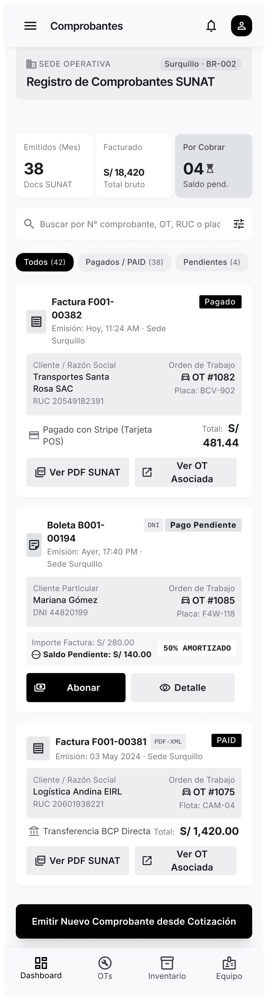
  
<b>Figura 133.</b> Wireframe de listado de comprobantes emitidos en la sucursal (US045).

Tal como se detalla en la **Figura 134**, se configuran los datos tributarios del receptor (DNI o RUC) y se confirma la emisión fiscal del documento.

  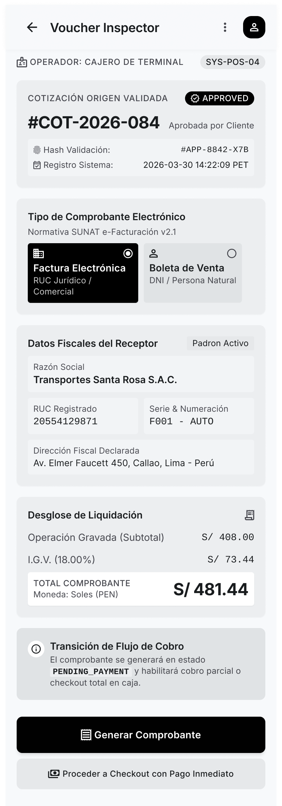
  
<b>Figura 134.</b> Wireframe de emisión de boleta o factura electrónica (US041).

Como se ilustra en la **Figura 135**, el comprobante cumple con los estándares tributarios requeridos y presenta el código QR de validación fiscal.

  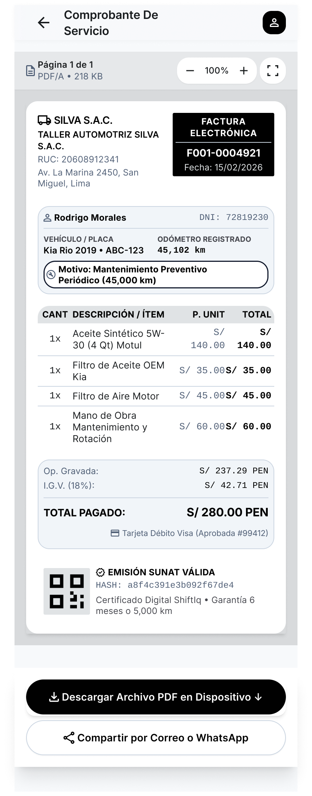
  
<b>Figura 135.</b> Wireframe de vista preliminar de comprobante fiscal en PDF (US041).

Tal como se aprecia en la **Figura 136**, el comprobante es remitido al correo electrónico del cliente y archivado en su garaje digital.

  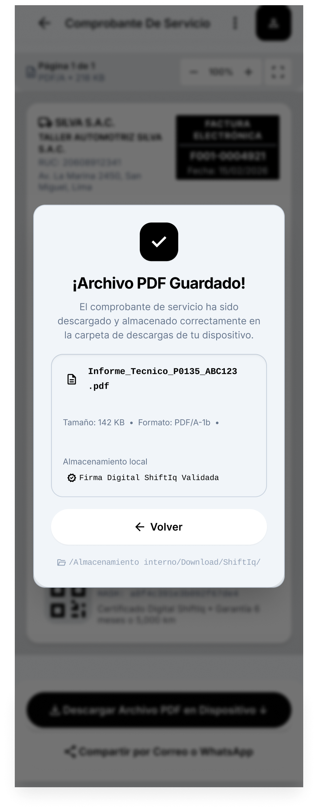
  
<b>Figura 136.</b> Wireframe de confirmación de comprobante archivado y remitido.

##### US042 / US044 / US043 / US016: Pasarela de pagos, abonos parciales y liquidación

Como se observa en la **Figura 137**, la orden de pago resume el saldo a cancelar y los métodos de pago habilitados (tarjeta, transferencia, efectivo o pasarela online).

  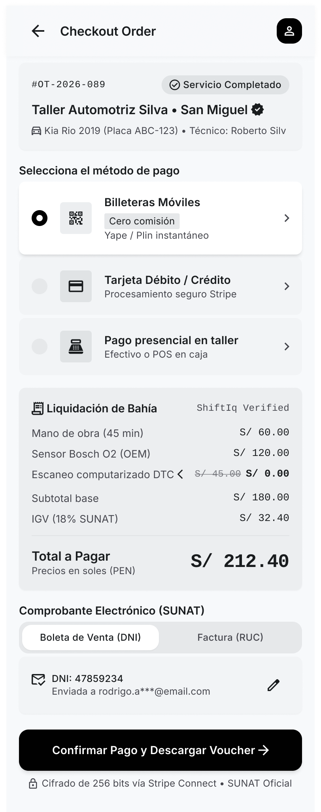
  
<b>Figura 137.</b> Wireframe de desglose de orden de pago antes de checkout.

Tal como se muestra en la **Figura 138**, el formulario seguro de Stripe Elements captura los datos de tarjeta de crédito o débito con tokenización criptográfica.

  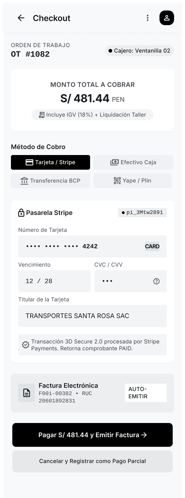
  
<b>Figura 138.</b> Wireframe de pasarela de pago digital integrada con Stripe (US044).

Como se evidencia en la **Figura 139**, una animación informa que la transacción bancaria está en proceso de autorización en la pasarela.

  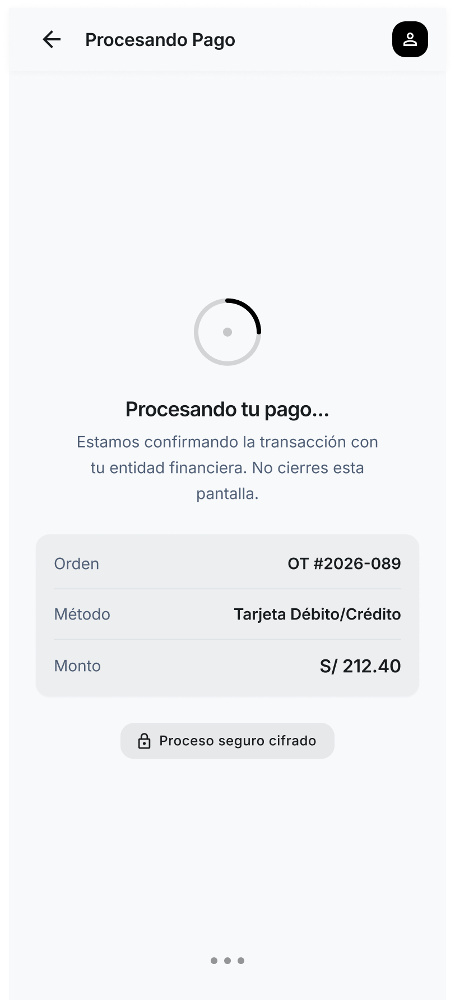
  
<b>Figura 139.</b> Wireframe de estado de espera mientras se procesa la transacción.

Tal como se observa en la **Figura 140**, la pantalla felicita al usuario, muestra el código de autorización bancaria y libera la entrega del automóvil.

  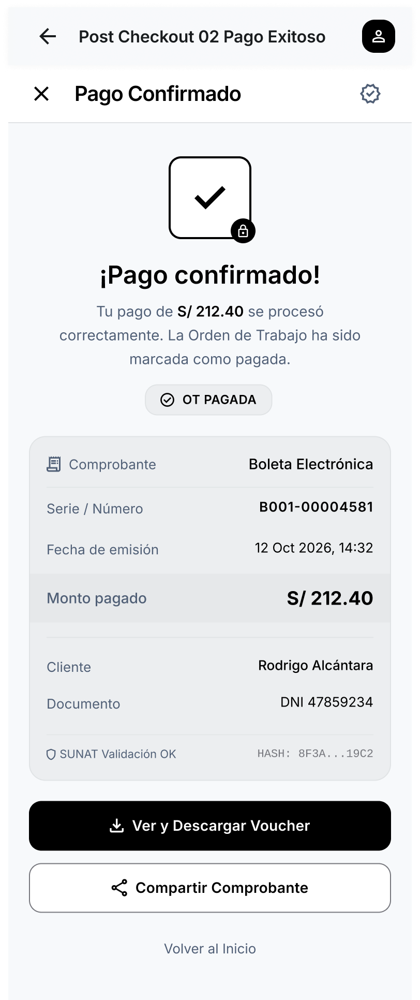
  
<b>Figura 140.</b> Wireframe de confirmación de pago procesado exitosamente (US042).

Como se aprecia en la **Figura 141**, el cliente puede guardar el comprobante de liquidación bancaria directamente en el almacenamiento de su teléfono.

  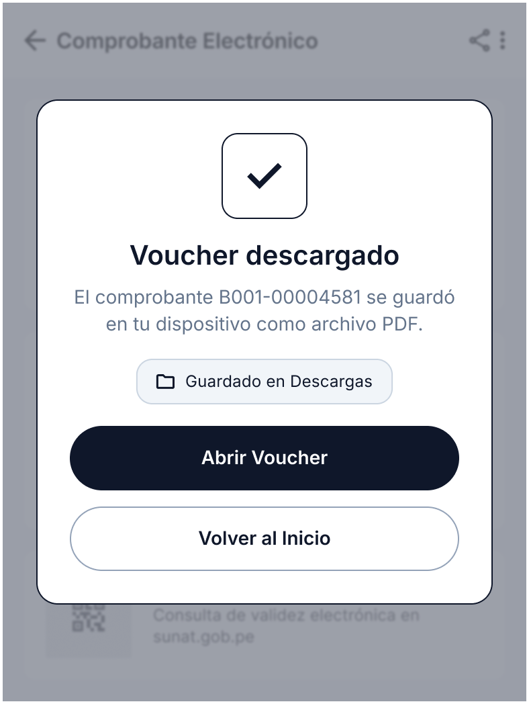
  
<b>Figura 141.</b> Wireframe de descarga de comprobante y voucher digital de pago.

Tal como se muestra en la **Figura 142**, el cajero puede registrar pagos en múltiples cuotas o métodos mixtos, recalculando el saldo pendiente de cobro.

  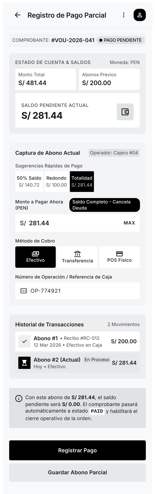
  
<b>Figura 142.</b> Wireframe de registro de pago a cuenta o abono parcial (US043).

Como se comprueba en la **Figura 143**, una vez cubierto el total del saldo, el cajero liquida definitivamente la orden de trabajo habilitando la salida del automóvil.

  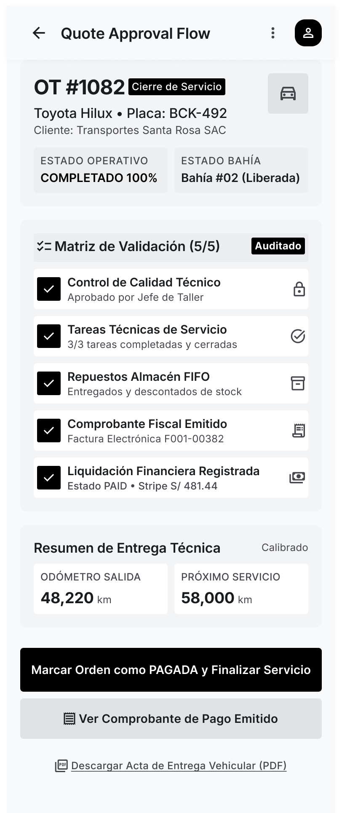
  
<b>Figura 143.</b> Wireframe de liquidación y marcado de OT como pagada (US016).

Tal como se observa en la **Figura 144**, en caso de rechazo del banco emisor, la pantalla explica el motivo del fallo y ofrece reintentar o cambiar de método de pago.

  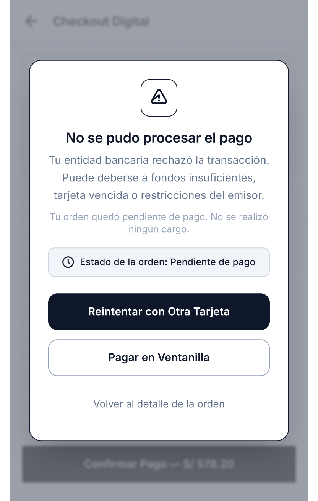
  
<b>Figura 144.</b> Wireframe de alerta ante rechazo o fondos insuficientes en pago.

---

#### Módulo 8: Experiencia del Conductor (Driver B2C Experience)

Este módulo optimiza la experiencia del cliente final de ShiftIQ, brindándole visibilidad en tiempo real de su unidad, historial de reparaciones y acceso a la red de talleres certificados.

Tal como se observa en la **Figura 145**, el panel inicial del conductor proporciona acceso inmediato al estado telemático del vehículo, kilometraje actual, salud de la batería, alertas preventivas y acceso rápido para reservar turnos.

  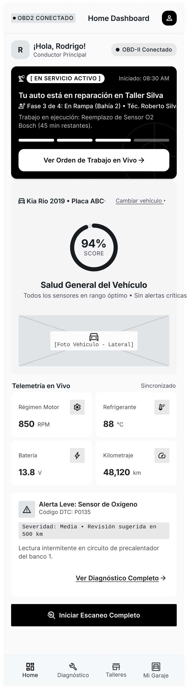
  
<b>Figura 145.</b> Wireframe de panel principal del conductor (ShiftIQ Driver Home).

Como se aprecia en la **Figura 146**, el conductor consulta la bitácora completa de servicios realizados, comprobantes tributarios asociados y recomendaciones para el siguiente cambio de aceite o pastillas de freno.

  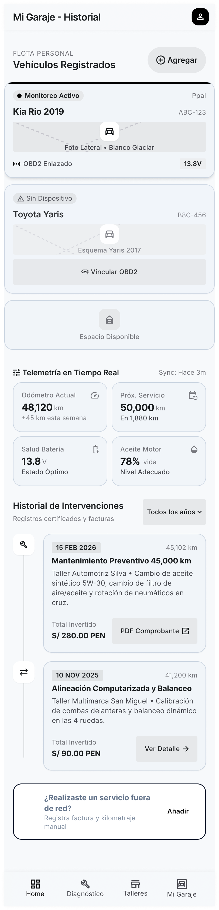
  
<b>Figura 146.</b> Wireframe de garaje virtual y bitácora de mantenimientos.

Tal como se muestra en la **Figura 147**, el usuario puede monitorear en vivo qué tarea está ejecutando el mecánico en ese instante, proporcionando absoluta transparencia en el servicio.

  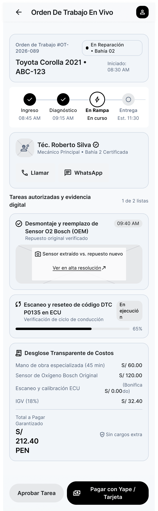
  
<b>Figura 147.</b> Wireframe de seguimiento en tiempo real de la orden de trabajo en taller.

Como se evidencia en la **Figura 148**, si durante la intervención el técnico descubre un desgaste imprevisto, envía una solicitud con foto y presupuesto que el cliente aprueba desde su móvil sin desplazarse físicamente.

  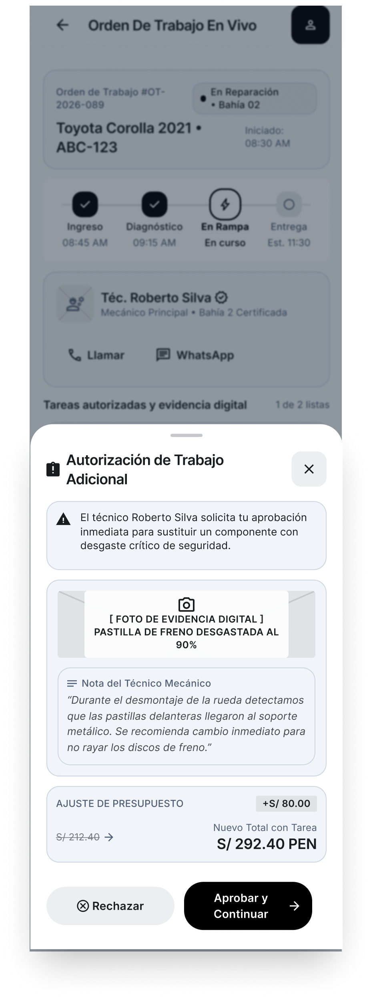
  
<b>Figura 148.</b> Wireframe de autorización remota de hallazgos y trabajos adicionales.

Tal como se observa en la **Figura 149**, el conductor busca talleres cercanos a su ubicación con filtros por especialidad, calificación de clientes y disponibilidad de bahías.

  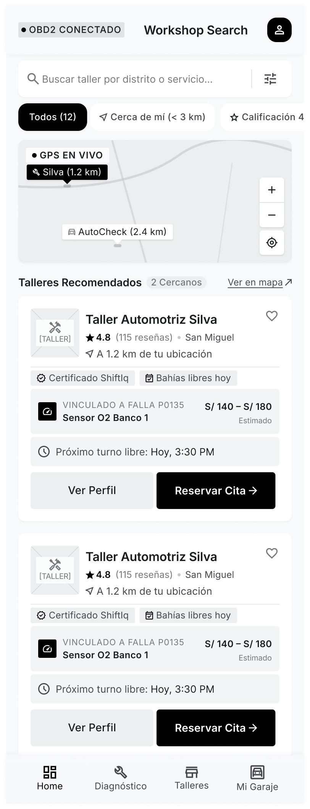
  
<b>Figura 149.</b> Wireframe de directorio geolocalizado de talleres afiliados a la red ShiftIQ.

Como se aprecia en la **Figura 150**, la ficha del taller exhibe horarios de atención, certificaciones técnicas, bahías habilitadas y botón para agendar un turno directo.

  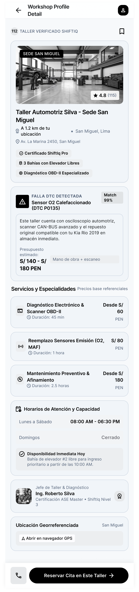
  
<b>Figura 150.</b> Wireframe de perfil detallado, certificaciones y opiniones del taller.

Tal como se detalla en la **Figura 151**, el menú lateral facilita el salto ergonómico entre el tablero de órdenes, inventario, citas, personal y reportes analíticos.

  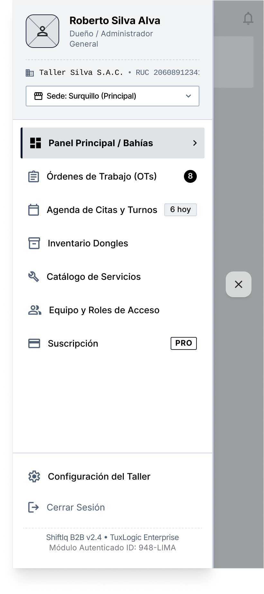
  
<b>Figura 151.</b> Wireframe de menú de navegación lateral para talleres B2B.

Como se observa en la **Figura 152**, el panel operacional del taller resume en indicadores clave las bahías ocupadas, órdenes con entrega comprometida hoy, alertas OBD-II entrantes y recaudación acumulada.

  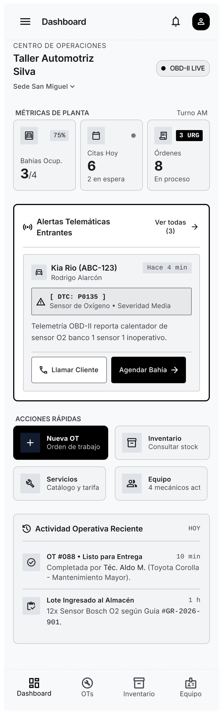
  
<b>Figura 152.</b> Wireframe de tablero operativo general de la sucursal del taller.

---

### 3.1.4.2. Mobile Applications Wireflow Diagrams

Los diagramas de Wireflow integran los esquemas estructurales de los wireframes con flechas y condiciones de transición, ilustrando cómo el usuario navega entre pantallas para satisfacer las Historias de Usuario más representativas.

A continuación, se describen los principales wireflows de la aplicación móvil de ShiftIQ:

#### Wireflow 1: Flujo de Gestión y Diagnóstico de Vehículo en Taller (US012, US017, US018, US023)
Este flujo describe la interacción del asesor y mecánico desde la recepción de la unidad hasta su escaneo telemático:
1. **Recepción y Registro:** El recepcionista ingresa a la lista de órdenes y selecciona *Nueva OT* (**Creación de Orden de Trabajo**).
2. **Identificación Vehicular:** Si la unidad es nueva en la base de datos, se despliega la pantalla de **Registro de Vehículo**, vinculando la placa al cliente.
3. **Inspección y Dongle:** El mecánico accede a la ficha del vehículo y mediante el botón flotante abre el **Bottom Sheet Vincular OBD2**. Al detectar la MAC del dongle, confirma el enlace.
4. **Escaneo Telemático:** Se ejecuta la rutina de escaneo (**Escaneo OBD-II en curso**). Al culminar, la pantalla navega hacia la **Consulta de Alertas DTC** y muestra la **Traducción Simple DTC** para el diagnóstico.

#### Wireflow 2: Flujo de Ejecución Técnica y Despacho de Repuestos (US014, US015, US048)
1. **Asignación de Bahía:** El jefe de taller abre la orden y presiona *Agregar Tarea*, asignando al técnico especialista.
2. **Espacio de Trabajo del Mecánico:** El técnico abre su espacio en tableta/móvil, presiona *Iniciar Labor* e ingresa sus hallazgos en la vista de *Detalles y Diagnóstico*.
3. **Solicitud de Piezas:** Al requerir repuestos, el mecánico busca en el *Catálogo de Repuestos*. Si el stock en almacén es suficiente, las piezas quedan comprometidas y se descuentan por lógica FIFO. Si no hay existencias, el sistema detiene el cierre mediante la alerta de *Stock Insuficiente*.
4. **Finalización de Labor:** Con el diagnóstico completado y piezas registradas, el técnico pulsa *Completar Tarea*, pasando la OT a estado listo para liquidación.

#### Wireflow 3: Flujo de Aprobación, Liquidación y Checkout Digital (US037, US038, US041, US044)
1. **Generación de Presupuesto:** El asesor genera la cotización técnica a partir de las tareas culminadas (**Crear Cotización**).
2. **Visto Bueno del Conductor:** El conductor recibe la notificación push en su teléfono y visualiza la propuesta en la pantalla de **Aprobación de Cotización DRAFT**, firmando su conformidad.
3. **Checkout con Stripe:** El cliente o cajero pulsa *Pagar con Tarjeta*, cargando la interfaz de **Checkout Inmediato con Stripe**. Tras ingresar el token criptográfico bancario, la pasarela transiciona a **Procesando Pago** y culmina en **Pago Exitoso**.
4. **Comprobante y Salida:** El sistema emite la **Boleta Electrónica PDF**, archiva el voucher en el garaje digital del conductor y actualiza la orden como **Pagada**, liberando la bahía para la siguiente atención.

---

### 3.1.4.3. Mobile Applications Mock-ups

Los mockups de la aplicación móvil de ShiftIQ traducen los esquemas de alambre a representaciones visuales de alta fidelidad, aplicando rigurosamente el sistema de diseño y la guía de estilos establecida en la sección 3.1.1:
- **Paleta Cromática de Marca:** Uso consistente del azul institucional (*Navy Primary* `#1E3A8A`) para cabeceras y elementos de navegación principal, complementado con acentos azul cielo (`#60A5FA`) para estados interactivos y naranja automotriz (`#C94A0E`) para llamadas a la acción (CTAs) de alta prioridad y alertas críticas de telemetría.
- **Tipografía y Legibilidad:** Jerarquía basada en la familia tipográfica *Inter*, seleccionada por su óptima legibilidad en pantallas móviles de diversa densidad de píxeles (desde 320dp hasta paneles tablet de 600dp+).
- **Componentes Táctiles y Accesibilidad:** Botones con áreas táctiles mínimas de 48x48dp, contrastes conformes al estándar WCAG 2.1 AA y espaciados modulares de 8pt.

*(Las pantallas mock-up en alta fidelidad correspondientes a la totalidad de estos wireframes se encuentran modeladas en la página `Mockups` del archivo oficial de diseño y se documentan en las siguientes iteraciones).*

---

### 3.1.4.4. Mobile Applications User Flow Diagrams

Los diagramas de User Flow modelan el trayecto integral de los usuarios en la aplicación a través de caminos de decisión lógica, validaciones y puntos de retroalimentación:

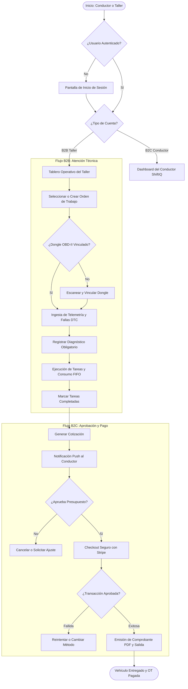
```mermaid
flowchart TD
    Start([Inicio: Conductor o Taller]) --> AuthCheck{¿Usuario Autenticado?}
    AuthCheck -- No --> Login[Pantalla de Inicio de Sesión]
    Login --> RoleChoice{¿Tipo de Cuenta?}
    RoleChoice -- B2B Taller --> B2BDash[Tablero Operativo del Taller]
    RoleChoice -- B2C Conductor --> B2CDash[Dashboard del Conductor ShiftIQ]
    
    AuthCheck -- Sí --> RoleChoice
    
    subgraph Flujo B2B: Atención Técnica
        B2BDash --> SelectOT[Seleccionar o Crear Orden de Trabajo]
        SelectOT --> OBDCheck{¿Dongle OBD-II Vinculado?}
        OBDCheck -- No --> ScanDongle[Escanear y Vincular Dongle]
        OBDCheck -- Sí --> ReadTelemetria[Ingesta de Telemetría y Fallas DTC]
        ScanDongle --> ReadTelemetria
        ReadTelemetria --> DiagTech[Registrar Diagnóstico Obligatorio]
        DiagTech --> WorkExecution[Ejecución de Tareas y Consumo FIFO]
        WorkExecution --> CloseWork[Marcar Tareas Completadas]
    end
    
    subgraph Flujo B2C: Aprobación y Pago
        CloseWork --> GenQuote[Generar Cotización]
        GenQuote --> DriverNotify[Notificación Push al Conductor]
        DriverNotify --> DriverReview{¿Aprueba Presupuesto?}
        DriverReview -- No --> CancelQuote[Cancelar o Solicitar Ajuste]
        DriverReview -- Sí --> StripePay[Checkout Seguro con Stripe]
        StripePay --> PayStatus{¿Transacción Aprobada?}
        PayStatus -- Fallida --> RetryPay[Reintentar o Cambiar Método]
        PayStatus -- Exitosa --> GetInvoice[Emisión de Comprobante PDF y Salida]
    end
    
    GetInvoice --> EndSuccess([Vehículo Entregado y OT Pagada])
```

---

### 3.1.4.5. Mobile Applications Prototyping

Para verificar de manera interactiva la usabilidad, fluidez de transiciones y coherencia visual del producto móvil, se ha desarrollado un prototipo interactivo en Figma accesible para revisión técnica y validación con usuarios.

- **Herramienta de Prototipado:** Figma.
- **Enlace al archivo de diseño y prototipo:** [Shift IQ Wireframes – Figma](https://www.figma.com/design/Vi2I1dal5Ifx52U1Z00qf3/Shift-IQ-Wireframes?node-id=0-1&t=vsBCs3oHJjYhHEmB-0)
- **Escenarios de Navegación Clave en el Prototipo:**
  1. *Escenario 1 (IAM y Seguridad):* Recorrido de onboarding y recuperación de credenciales mediante el flujo de desafío OTP.
  2. *Escenario 2 (Diagnóstico Vehicular en Bahía):* Recepción de vehículo, lectura de fallas OBD-II y revisión de traducción de códigos DTC.
  3. *Escenario 3 (Operación Técnica de Taller):* Creación de orden de trabajo, asignación de tareas a mecánicos y consulta de stock en almacén con validaciones FIFO.
  4. *Escenario 4 (Liquidación y Pasarela):* Aprobación de cotización desde la perspectiva del conductor y pasarela de pago digital con confirmación de voucher.
