## 3.1.4. Mobile Applications UX/UI Design

El diseño de la experiencia e interfaz de usuario (UX/UI) móvil para **ShiftIQ** se ha concebido bajo los principios del diseño de interacción *Mobile-First*, optimizando las tareas de dos actores fundamentales: el personal técnico y administrativo de talleres mecánicos (**Segmento B2B**) y los conductores particulares (**Segmento B2C**).

Para garantizar una lectura ordenada y alineada con los principios de **Domain-Driven Design (DDD)** del capítulo 2, las pantallas del aplicativo móvil se organizan en **ocho módulos funcionales**. Cada módulo se presenta como una **secuencia estructurada paso a paso (lado a lado)**, exponiendo primero los esquemas de alambre (**Wireframes**) y posteriormente su concreción en alta fidelidad (**Mock-ups**), documentando el trayecto del usuario, la paleta cromática, los componentes interactivos y el cumplimiento de cada Historia de Usuario (US).

---

### 3.1.4.1. Mobile Applications Wireframes

Los wireframes representan la estructura esquemática y funcional de baja a media fidelidad de la aplicación móvil de ShiftIQ. Su propósito es definir la jerarquía visual, distribución táctil y los flujos de navegación sin distracciones de estilo final.

A continuación, se presentan los wireframes organizados como **secuencias lado a lado** para cada uno de los 8 módulos del sistema:

#### Módulo 1: Identidad, Autenticación y Seguridad (IAM) - Secuencia de Wireframes
*Historias de Usuario cubiertas: US001, US002, US004, US035, US036*

Este módulo cubre la incorporación de talleres y clientes, autenticación segura con doble factor OTP y control de credenciales de acceso. Tal como se observa en la secuencia interactiva de las **Figuras 44 a 48**, el flujo operativo del módulo guía al usuario a través de los siguientes pasos consecutivos:

<table align="center" style="border: none; border-collapse: collapse; margin: 16px auto; width: 100%;">
  <tr style="border: none;">
    <td align="center" style="border: none; padding: 6px; vertical-align: top; width: 20%;">
       
      <small><b>Figura 44.</b> Paso 1: Registro B2B (US001)</small>
    </td>
    <td align="center" style="border: none; padding: 6px; vertical-align: top; width: 20%;">
       
      <small><b>Figura 45.</b> Paso 2: Inicio de Sesión (US002)</small>
    </td>
    <td align="center" style="border: none; padding: 6px; vertical-align: top; width: 20%;">
       
      <small><b>Figura 46.</b> Paso 3: Validación OTP (US004)</small>
    </td>
    <td align="center" style="border: none; padding: 6px; vertical-align: top; width: 20%;">
      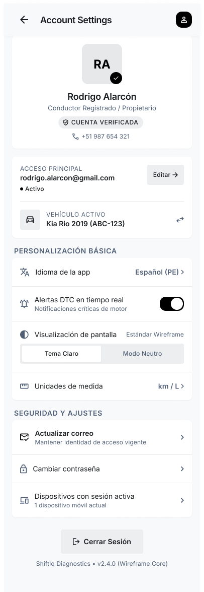 
      <small><b>Figura 47.</b> Paso 4: Perfil y Ajustes (US035)</small>
    </td>
    <td align="center" style="border: none; padding: 6px; vertical-align: top; width: 20%;">
       
      <small><b>Figura 48.</b> Paso 5: Cambio de Clave (US036)</small>
    </td>
  </tr>
</table>

**Detalle analítico de la secuencia de wireframes:**
- **Paso 1 (Paso 1: Registro B2B - US001):** Captura de razón social, RUC tributario, dirección física y credenciales iniciales con validación de duplicidad.
- **Paso 2 (Paso 2: Inicio de Sesión - US002):** Ingreso con credenciales corporativas o autenticación federada con Google OAuth2.
- **Paso 3 (Paso 3: Validación OTP - US004):** Desafío de seguridad numérico de 6 dígitos con temporizador de expiración regresivo para restablecimiento.
- **Paso 4 (Paso 4: Perfil y Ajustes - US035):** Administración de datos del operador, insignia de verificación de rol y actualización de correo.
- **Paso 5 (Paso 5: Cambio de Clave - US036):** Modificación autenticada de clave con lista de chequeo de seguridad criptográfica en tiempo real.

#### Módulo 2: Gestión de Talleres, Sucursales y Licenciamiento (Workshop Management) - Secuencia de Wireframes
*Historias de Usuario cubiertas: US005, US006, US007*

Administra la operación general del taller, capacidad de bahías, directorio de técnicos y licenciamiento SaaS multitenant por sede. Tal como se observa en la secuencia interactiva de las **Figuras 49 a 53**, el flujo operativo del módulo guía al usuario a través de los siguientes pasos consecutivos:

<table align="center" style="border: none; border-collapse: collapse; margin: 16px auto; width: 100%;">
  <tr style="border: none;">
    <td align="center" style="border: none; padding: 6px; vertical-align: top; width: 20%;">
       
      <small><b>Figura 49.</b> Paso 1: Dashboard de Planta (US006)</small>
    </td>
    <td align="center" style="border: none; padding: 6px; vertical-align: top; width: 20%;">
      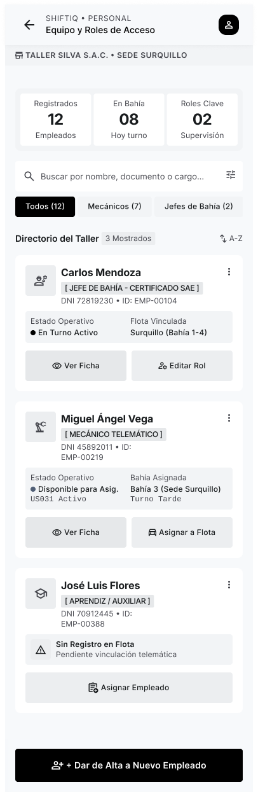 
      <small><b>Figura 50.</b> Paso 2: Personal y Roles (US005)</small>
    </td>
    <td align="center" style="border: none; padding: 6px; vertical-align: top; width: 20%;">
      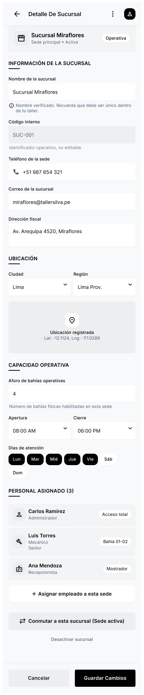 
      <small><b>Figura 51.</b> Paso 3: Ficha de Sucursal (US006)</small>
    </td>
    <td align="center" style="border: none; padding: 6px; vertical-align: top; width: 20%;">
       
      <small><b>Figura 52.</b> Paso 4: Suscripción SaaS (US007)</small>
    </td>
    <td align="center" style="border: none; padding: 6px; vertical-align: top; width: 20%;">
       
      <small><b>Figura 53.</b> Paso 5: Menú Lateral (US005)</small>
    </td>
  </tr>
</table>

**Detalle analítico de la secuencia de wireframes:**
- **Paso 1 (Paso 1: Dashboard de Planta - US006):** Consola de operaciones con métricas de ocupación de bahías (75%), órdenes en proceso y alertas telemáticas entrantes.
- **Paso 2 (Paso 2: Personal y Roles - US005):** Padrón del equipo técnico con asignación de roles operativos (Mecánico, Administrador, Cajero) y sucursales.
- **Paso 3 (Paso 3: Ficha de Sucursal - US006):** Información operativa de la sede física: dirección, teléfono, cantidad de elevadores habilitados y capacidad diaria.
- **Paso 4 (Paso 4: Suscripción SaaS - US007):** Control del plan contratado (Profesional), renovación automática y activación de módulos telemáticos.
- **Paso 5 (Paso 5: Menú Lateral - US005):** Navegación ergonómica tipo Drawer entre órdenes de trabajo, inventario, citas, equipo y analíticas.

#### Módulo 3: Inteligencia Vehicular y Diagnóstico OBD-II (Vehicle Intelligence & Diagnostics) - Secuencia de Wireframes
*Historias de Usuario cubiertas: US017, US018, US019, US020, US021, US023, US025*

Núcleo telemático de ShiftIQ para la captura en vivo de sensores automotrices, detección de fallas DTC y gestión de hardware OBD-II. Tal como se observa en la secuencia interactiva de las **Figuras 54 a 59**, el flujo operativo del módulo guía al usuario a través de los siguientes pasos consecutivos:

<table align="center" style="border: none; border-collapse: collapse; margin: 16px auto; width: 100%;">
  <tr style="border: none;">
    <td align="center" style="border: none; padding: 6px; vertical-align: top; width: 16%;">
       
      <small><b>Figura 54.</b> Paso 1: Enrolamiento Vehicular (US017)</small>
    </td>
    <td align="center" style="border: none; padding: 6px; vertical-align: top; width: 16%;">
       
      <small><b>Figura 55.</b> Paso 2: Enlace de Dongle OBD-II (US018)</small>
    </td>
    <td align="center" style="border: none; padding: 6px; vertical-align: top; width: 16%;">
       
      <small><b>Figura 56.</b> Paso 3: Telemetría en Tiempo Real (US019)</small>
    </td>
    <td align="center" style="border: none; padding: 6px; vertical-align: top; width: 16%;">
       
      <small><b>Figura 57.</b> Paso 4: Escaneo Electrónico (US023)</small>
    </td>
    <td align="center" style="border: none; padding: 6px; vertical-align: top; width: 16%;">
      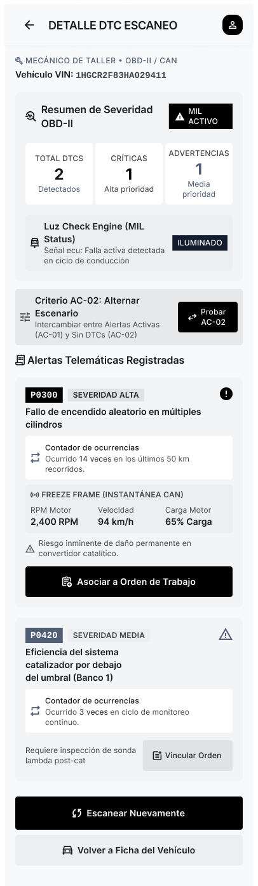 
      <small><b>Figura 58.</b> Paso 5: Diagnóstico y Traducción DTC (US023)</small>
    </td>
    <td align="center" style="border: none; padding: 6px; vertical-align: top; width: 16%;">
       
      <small><b>Figura 59.</b> Paso 6: Modo Offline y Buffer (US025)</small>
    </td>
  </tr>
</table>

**Detalle analítico de la secuencia de wireframes:**
- **Paso 1 (Paso 1: Enrolamiento Vehicular - US017):** Registro de placa peruana, marca, modelo, año, kilometraje de entrada y número VIN.
- **Paso 2 (Paso 2: Enlace de Dongle OBD-II - US018):** Búsqueda y emparejamiento Bluetooth del escáner telemático por dirección MAC con confirmación táctil.
- **Paso 3 (Paso 3: Telemetría en Tiempo Real - US019):** Tacómetros digitales en vivo para RPM del motor, velocidad, temperatura del refrigerante y voltaje de alternador.
- **Paso 4 (Paso 4: Escaneo Electrónico - US023):** Sondeo interactivo de protocolos CAN Bus por subsistemas (Motor, Transmisión, Frenos ABS, Emisiones).
- **Paso 5 (Paso 5: Diagnóstico y Traducción DTC - US023):** Listado de códigos SAE (P0135) con severidad cromática y traducción didáctica del síntoma para el usuario.
- **Paso 6 (Paso 6: Modo Offline y Buffer - US025):** Almacenamiento persistente en base SQLite local ante pérdida de red y sincronización automática al reconectar.

#### Módulo 4: Flotas y Agenda de Citas Técnicas (Fleet & Appointments) - Secuencia de Wireframes
*Historias de Usuario cubiertas: US026, US028, US029, US030, US031, US032*

Controla la ocupación de bahías en taller, concertación de turnos sin solapamientos y la gestión de unidades corporativas. Tal como se observa en la secuencia interactiva de las **Figuras 60 a 64**, el flujo operativo del módulo guía al usuario a través de los siguientes pasos consecutivos:

<table align="center" style="border: none; border-collapse: collapse; margin: 16px auto; width: 100%;">
  <tr style="border: none;">
    <td align="center" style="border: none; padding: 6px; vertical-align: top; width: 20%;">
       
      <small><b>Figura 60.</b> Paso 1: Agenda Diaria por Bahía (US029)</small>
    </td>
    <td align="center" style="border: none; padding: 6px; vertical-align: top; width: 20%;">
       
      <small><b>Figura 61.</b> Paso 2: Reserva de Bahía y Turno (US026)</small>
    </td>
    <td align="center" style="border: none; padding: 6px; vertical-align: top; width: 20%;">
       
      <small><b>Figura 62.</b> Paso 3: Cancelación y Liberación (US028)</small>
    </td>
    <td align="center" style="border: none; padding: 6px; vertical-align: top; width: 20%;">
      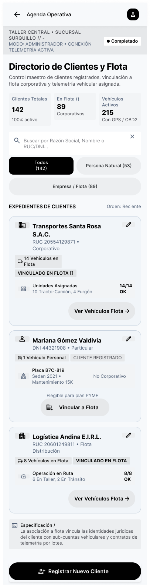 
      <small><b>Figura 63.</b> Paso 4: Directorio de Clientes (US032)</small>
    </td>
    <td align="center" style="border: none; padding: 6px; vertical-align: top; width: 20%;">
       
      <small><b>Figura 64.</b> Paso 5: Padrón de Flotas (US024)</small>
    </td>
  </tr>
</table>

**Detalle analítico de la secuencia de wireframes:**
- **Paso 1 (Paso 1: Agenda Diaria por Bahía - US029):** Programación horaria de citas con codificación de color por estado (Confirmada, En Rampa, Concluida).
- **Paso 2 (Paso 2: Reserva de Bahía y Turno - US026):** Selector gráfico de elevadores mecánicos y bahías especializadas para evitar solapamientos de atención.
- **Paso 3 (Paso 3: Cancelación y Liberación - US028):** Anulación de turno con registro de causal y liberación inmediata del cupo en la agenda de la sucursal.
- **Paso 4 (Paso 4: Directorio de Clientes - US032):** Padrón unificado de clientes particulares y corporativos con historial de visitas y contacto telefónico.
- **Paso 5 (Paso 5: Padrón de Flotas - US024):** Monitoreo de unidades de flota comercial con placa, chofer asignado y fecha de próximo mantenimiento.

#### Módulo 5: Inventario y Control de Repuestos FIFO (Inventory Management) - Secuencia de Wireframes
*Historias de Usuario cubiertas: US008, US009, US010*

Garantiza la trazabilidad del stock físico de insumos, costeo FIFO estricto y prevención de despachos con saldos negativos. Tal como se observa en la secuencia interactiva de las **Figuras 65 a 69**, el flujo operativo del módulo guía al usuario a través de los siguientes pasos consecutivos:

<table align="center" style="border: none; border-collapse: collapse; margin: 16px auto; width: 100%;">
  <tr style="border: none;">
    <td align="center" style="border: none; padding: 6px; vertical-align: top; width: 20%;">
      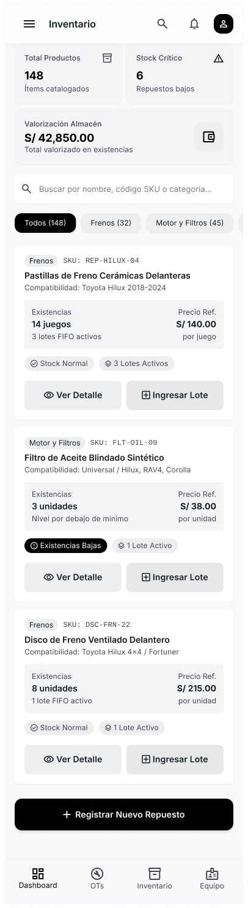 
      <small><b>Figura 65.</b> Paso 1: Catálogo de Repuestos (US008)</small>
    </td>
    <td align="center" style="border: none; padding: 6px; vertical-align: top; width: 20%;">
      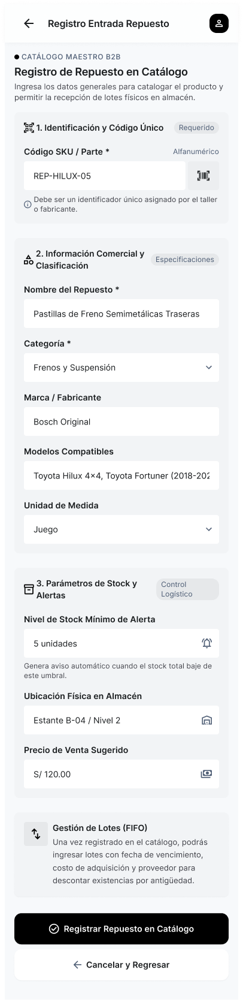 
      <small><b>Figura 66.</b> Paso 2: Alta de Repuesto (US008)</small>
    </td>
    <td align="center" style="border: none; padding: 6px; vertical-align: top; width: 20%;">
       
      <small><b>Figura 67.</b> Paso 3: Ingreso de Lote FIFO (US010)</small>
    </td>
    <td align="center" style="border: none; padding: 6px; vertical-align: top; width: 20%;">
      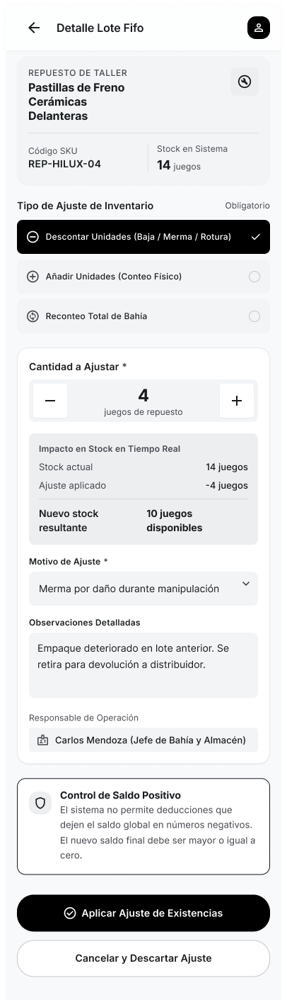 
      <small><b>Figura 68.</b> Paso 4: Ajuste Manual de Stock (US010)</small>
    </td>
    <td align="center" style="border: none; padding: 6px; vertical-align: top; width: 20%;">
      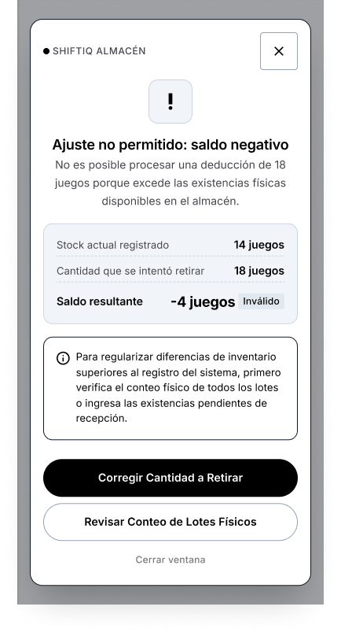 
      <small><b>Figura 69.</b> Paso 5: Bloqueo de Stock Negativo (US010)</small>
    </td>
  </tr>
</table>

**Detalle analítico de la secuencia de wireframes:**
- **Paso 1 (Paso 1: Catálogo de Repuestos - US008):** Buscador predictivo de repuestos por código SKU, marca, cantidad disponible en almacén y precio de venta.
- **Paso 2 (Paso 2: Alta de Repuesto - US008):** Registro de artículo con escaneo de código de barras, categoría, aplicación vehicular y umbral de alerta mínima.
- **Paso 3 (Paso 3: Ingreso de Lote FIFO - US010):** Recepción de factura del proveedor, registro de costo unitario y fecha para rotación según el orden de llegada.
- **Paso 4 (Paso 4: Ajuste Manual de Stock - US010):** Corrección de cantidades por conteo físico o mermas con justificación formal y firma de auditoría.
- **Paso 5 (Paso 5: Bloqueo de Stock Negativo - US010):** Validación del sistema que prohíbe el despacho o imputación de piezas sin disponibilidad física en bodega.

#### Módulo 6: Operaciones de Taller y Órdenes de Trabajo (Service Operations) - Secuencia de Wireframes
*Historias de Usuario cubiertas: US011, US012, US013, US014, US015, US048, US049, US050*

Gestiona el ciclo de vida de las reparaciones, apertura de órdenes, espacio del mecánico con diagnóstico fotográfico y tareas. Tal como se observa en la secuencia interactiva de las **Figuras 70 a 74**, el flujo operativo del módulo guía al usuario a través de los siguientes pasos consecutivos:

<table align="center" style="border: none; border-collapse: collapse; margin: 16px auto; width: 100%;">
  <tr style="border: none;">
    <td align="center" style="border: none; padding: 6px; vertical-align: top; width: 20%;">
       
      <small><b>Figura 70.</b> Paso 1: Catálogo de Servicios (US011)</small>
    </td>
    <td align="center" style="border: none; padding: 6px; vertical-align: top; width: 20%;">
       
      <small><b>Figura 71.</b> Paso 2: Tablero Kanban de OTs (US050)</small>
    </td>
    <td align="center" style="border: none; padding: 6px; vertical-align: top; width: 20%;">
       
      <small><b>Figura 72.</b> Paso 3: Apertura de Orden (US012)</small>
    </td>
    <td align="center" style="border: none; padding: 6px; vertical-align: top; width: 20%;">
       
      <small><b>Figura 73.</b> Paso 4: Terminal del Mecánico (US014)</small>
    </td>
    <td align="center" style="border: none; padding: 6px; vertical-align: top; width: 20%;">
      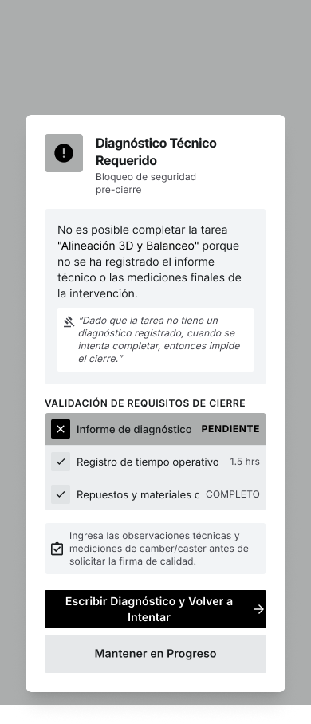 
      <small><b>Figura 74.</b> Paso 5: Validación de Diagnóstico (US014)</small>
    </td>
  </tr>
</table>

**Detalle analítico de la secuencia de wireframes:**
- **Paso 1 (Paso 1: Catálogo de Servicios - US011):** Definición de paquetes de mantenimiento, tiempos estándar de labor y tarifas de mano de obra en Soles.
- **Paso 2 (Paso 2: Tablero Kanban de OTs - US050):** Visualización de flujo por estados (Creada, En Diagnóstico, En Proceso, Completada) con alertas de demora.
- **Paso 3 (Paso 3: Apertura de Orden - US012):** Recepción de vehículo, kilometraje, combustible, checklist gráfico de carrocería y motivos del cliente.
- **Paso 4 (Paso 4: Terminal del Mecánico - US014):** Terminal de bahía con cronómetro, fotos antes/después, diagnóstico obligatorio con contador de caracteres y consumo FIFO.
- **Paso 5 (Paso 5: Validación de Diagnóstico - US014):** Restricción que bloquea el cierre de la labor si no se documenta formalmente la conclusión técnica y evidencia.

#### Módulo 7: Facturación, Cotizaciones y Pasarela de Pagos (Billing & Payments) - Secuencia de Wireframes
*Historias de Usuario cubiertas: US016, US037, US038, US039, US041, US042, US043, US044, US045*

Liquidación del servicio, aprobación remota de presupuesto, pasarela Stripe, emisión de comprobantes fiscales y cierre de OT. Tal como se observa en la secuencia interactiva de las **Figuras 75 a 79**, el flujo operativo del módulo guía al usuario a través de los siguientes pasos consecutivos:

<table align="center" style="border: none; border-collapse: collapse; margin: 16px auto; width: 100%;">
  <tr style="border: none;">
    <td align="center" style="border: none; padding: 6px; vertical-align: top; width: 20%;">
       
      <small><b>Figura 75.</b> Paso 1: Generación de Cotización (US037)</small>
    </td>
    <td align="center" style="border: none; padding: 6px; vertical-align: top; width: 20%;">
      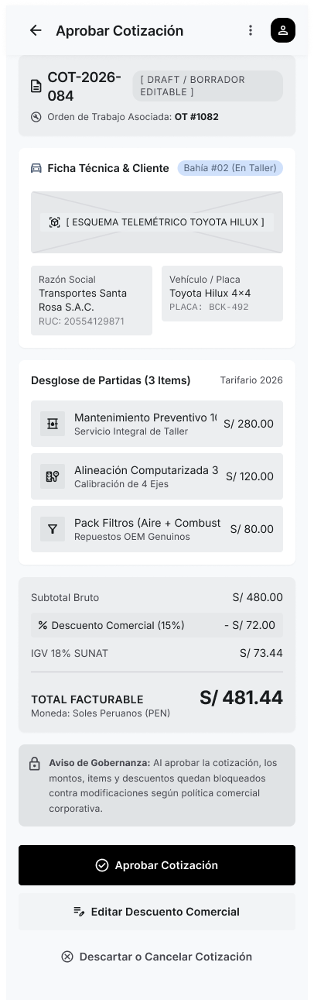 
      <small><b>Figura 76.</b> Paso 2: Aprobación Digital DRAFT (US038)</small>
    </td>
    <td align="center" style="border: none; padding: 6px; vertical-align: top; width: 20%;">
       
      <small><b>Figura 77.</b> Paso 3: Checkout con Stripe (US044)</small>
    </td>
    <td align="center" style="border: none; padding: 6px; vertical-align: top; width: 20%;">
       
      <small><b>Figura 78.</b> Paso 4: Comprobante Fiscal PDF (US041)</small>
    </td>
    <td align="center" style="border: none; padding: 6px; vertical-align: top; width: 20%;">
       
      <small><b>Figura 79.</b> Paso 5: Liquidación y Salida (US016)</small>
    </td>
  </tr>
</table>

**Detalle analítico de la secuencia de wireframes:**
- **Paso 1 (Paso 1: Generación de Cotización - US037):** Cálculo de mano de obra y repuestos en Soles PEN con desglose de impuestos (18% IGV) y descuentos aplicables.
- **Paso 2 (Paso 2: Aprobación Digital DRAFT - US038):** Revisión remota del presupuesto por el conductor desde su smartphone y autorización con firma digital.
- **Paso 3 (Paso 3: Checkout con Stripe - US044):** Pasarela digital segura (monto S/ 481.44 PEN), medios de pago (Tarjeta, BCP, Yape) y casilla de Facturación Electrónica.
- **Paso 4 (Paso 4: Comprobante Fiscal PDF - US041):** Emisión de boleta o factura digital con código QR según normativa tributaria SUNAT y firma digital.
- **Paso 5 (Paso 5: Liquidación y Salida - US016):** Marcado de orden como pagada tras validación bancaria, autorizando la salida del vehículo y liberando la bahía.

#### Módulo 8: Experiencia Digital del Conductor (Driver B2C Experience) - Secuencia de Wireframes
*Historias de Usuario cubiertas: Dashboard, Garaje, Monitoreo en Vivo*

Proporciona al conductor transparencia sobre la salud de su automóvil, bitácora histórica y seguimiento del taller en vivo. Tal como se observa en la secuencia interactiva de las **Figuras 80 a 83**, el flujo operativo del módulo guía al usuario a través de los siguientes pasos consecutivos:

<table align="center" style="border: none; border-collapse: collapse; margin: 16px auto; width: 100%;">
  <tr style="border: none;">
    <td align="center" style="border: none; padding: 6px; vertical-align: top; width: 25%;">
       
      <small><b>Figura 80.</b> Paso 1: Driver Home Dashboard (Driver)</small>
    </td>
    <td align="center" style="border: none; padding: 6px; vertical-align: top; width: 25%;">
       
      <small><b>Figura 81.</b> Paso 2: Mi Garaje e Historial (Driver)</small>
    </td>
    <td align="center" style="border: none; padding: 6px; vertical-align: top; width: 25%;">
      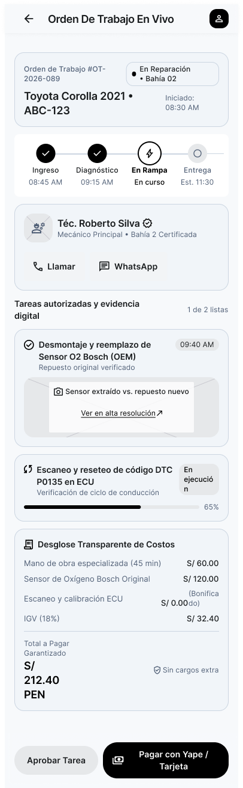 
      <small><b>Figura 82.</b> Paso 3: Monitoreo en Vivo (Driver)</small>
    </td>
    <td align="center" style="border: none; padding: 6px; vertical-align: top; width: 25%;">
      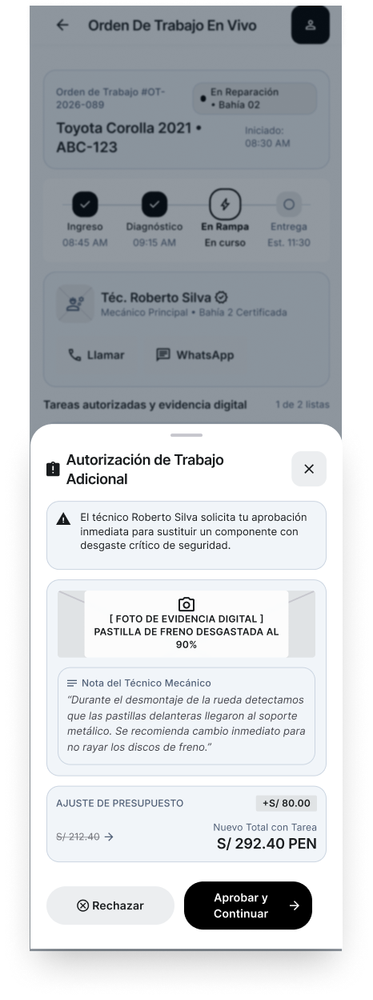 
      <small><b>Figura 83.</b> Paso 4: Hallazgos Adicionales (Driver)</small>
    </td>
  </tr>
</table>

**Detalle analítico de la secuencia de wireframes:**
- **Paso 1 (Paso 1: Driver Home Dashboard - Driver):** Consola del conductor con score de salud (94%), conexión OBD-II, 4 lecturas telemáticas en vivo y tarjeta de alerta O2.
- **Paso 2 (Paso 2: Mi Garaje e Historial - Driver):** Bitácora cronológica de reparaciones realizadas, kilometraje, comprobantes descargables y recordatorios de servicio.
- **Paso 3 (Paso 3: Monitoreo en Vivo - Driver):** Seguimiento en tiempo real de la fase técnica activa en bahía (En Rampa), técnico asignado y tiempo estimado.
- **Paso 4 (Paso 4: Hallazgos Adicionales - Driver):** Notificación con foto de bahía de piezas desgastadas y presupuesto adicional para aprobación táctil remota.

---

### 3.1.4.2. Mobile Applications Wireflow Diagrams

Los diagramas de Wireflow integran los esquemas estructurales con transiciones y lógica de navegación para ilustrar cómo el usuario recorre los flujos esenciales del producto:

#### Wireflow 1: Recepción, Enrolamiento y Diagnóstico OBD-II en Bahía (US012, US017, US018, US023)
1. **Apertura de Orden:** El recepcionista ingresa al *Dashboard Operativo* y pulsa *Nueva OT*.
2. **Enrolamiento Vehicular:** Si la placa no existe en la base de datos, el sistema navega a *Registro de Vehículo* vinculando placa, marca y kilometraje.
3. **Enlace Telemático:** En la bahía, el mecánico abre el *Bottom Sheet Vincular OBD2*, detecta el dongle Bluetooth y pulsa conectar. Al enlazar, transiciona a *Escaneo OBD-II en Curso*.
4. **Interpretación Técnica:** Tras leer la ECU, se despliega la *Consulta de Alertas DTC* y la *Traducción Simple DTC* con la recomendación técnica.

#### Wireflow 2: Asignación, Ejecución Técnica y Despacho FIFO (US014, US015, US048)
1. **Asignación de Tareas:** En el detalle de la OT, el jefe de taller añade la labor y asigna al especialista.
2. **Bahía Técnica:** El técnico abre su *Terminal del Mecánico*, inicia el cronómetro e ingresa sus hallazgos en *Detalles y Diagnóstico*.
3. **Despacho FIFO:** Al requerir repuestos, busca en el *Catálogo de Repuestos*. Si el stock es suficiente, las piezas se despachan bajo costeo FIFO. En caso de rotura, el modal *Stock Insuficiente* detiene el despacho.
4. **Cierre de Labor:** Con el diagnóstico obligatorio y fotos documentadas, el mecánico pulsa *Completar Tarea*, pasando la orden a liquidación.

#### Wireflow 3: Cotización, Checkout Digital con Stripe y Entrega (US037, US038, US041, US044)
1. **Elaboración de Presupuesto:** El asesor emite la cotización en *Crear Cotización* en estado *DRAFT*.
2. **Autorización Remota:** El conductor recibe la notificación push en su teléfono móvil, revisa la propuesta en *Aprobación de Cotización DRAFT* y firma digitalmente.
3. **Pasarela Stripe:** En ventanilla o desde el app, se selecciona *Tarjeta / Stripe* en la pantalla de *Checkout*. Al procesar la tarjeta, transiciona a *Procesando Pago* y concluye en *Pago Exitoso*.
4. **Comprobante y Salida:** Se emite la *Boleta Electrónica PDF*, se archiva el voucher en el garaje del cliente y la OT pasa a estado *Pagada*, liberando la unidad vehicular.

---

### 3.1.4.3. Mobile Applications Mock-ups

Los mockups de la aplicación móvil de ShiftIQ plasman la versión en alta fidelidad de las interfaces, aplicando de forma estricta el sistema visual, componentes de UI y tokens de estilo documentados en la sección 3.1.1:
- **Paleta Cromática de Marca:** Uso predominante del azul corporativo *Navy Primary* (`#1E3A8A`) en barras de navegación, encabezados y botones primarios; azul cielo *Accent Sky Blue* (`#60A5FA`) para estados interactivos y enlaces; naranja automotriz *Severity Orange* (`#C94A0E`) para alertas de severidad y llamadas a la acción prioritarias; y verde esmeralda (`#3DBE6C`) para estados conectados y transacciones exitosas.
- **Tipografía Institucional:** Familia *Inter*, con jerarquías claras desde títulos semibold (18-20sp), subtítulos (14-16sp) hasta textos auxiliares y etiquetas (12sp).
- **Componentes Nativos y Accesibilidad:** Contenedores de tarjeta (*Cards*) con esquinas redondeadas de 12px, sombras difusas (*elevation*), botones táctiles de al menos 48dp de altura y contrastes conformes a WCAG 2.1 AA.

A continuación, se presentan los mockups organizados como **secuencias lado a lado** para cada uno de los 8 módulos del sistema:

#### Módulo 1: Identidad, Autenticación y Seguridad (IAM) - Secuencia de Mockups (Alta Fidelidad)
*Historias de Usuario cubiertas: US001, US002, US004, US035, US036*

Como se aprecia en la secuencia visual de alta fidelidad de las **Figuras 84 a 88**, el diseño final incorpora la identidad cromática de ShiftIQ (`#1E3A8A`), componentes táctiles enriquecidos y microinteracciones de estado a lo largo del flujo:

<table align="center" style="border: none; border-collapse: collapse; margin: 16px auto; width: 100%;">
  <tr style="border: none;">
    <td align="center" style="border: none; padding: 6px; vertical-align: top; width: 20%;">
      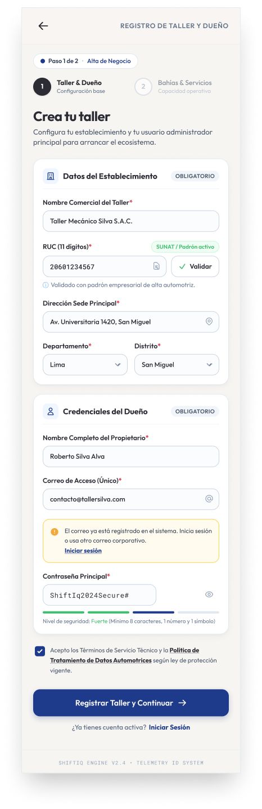 
      <small><b>Figura 84.</b> Mockup Paso 1: Registro B2B (US001)</small>
    </td>
    <td align="center" style="border: none; padding: 6px; vertical-align: top; width: 20%;">
       
      <small><b>Figura 85.</b> Mockup Paso 2: Inicio de Sesión (US002)</small>
    </td>
    <td align="center" style="border: none; padding: 6px; vertical-align: top; width: 20%;">
      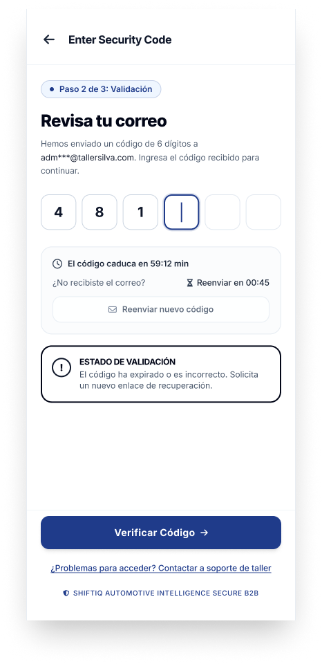 
      <small><b>Figura 86.</b> Mockup Paso 3: Validación OTP (US004)</small>
    </td>
    <td align="center" style="border: none; padding: 6px; vertical-align: top; width: 20%;">
      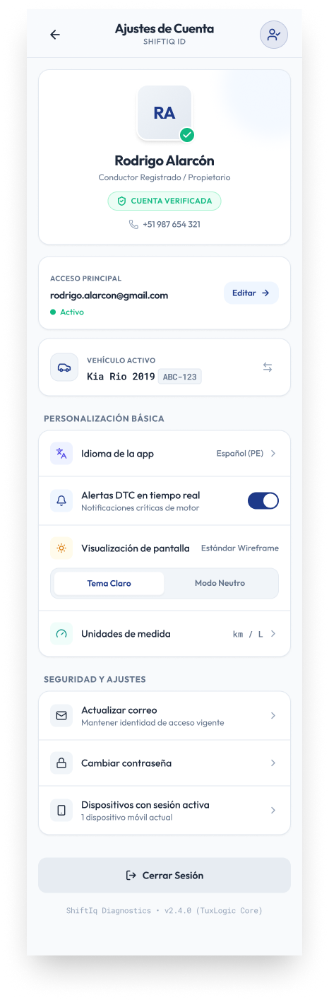 
      <small><b>Figura 87.</b> Mockup Paso 4: Perfil y Ajustes (US035)</small>
    </td>
    <td align="center" style="border: none; padding: 6px; vertical-align: top; width: 20%;">
      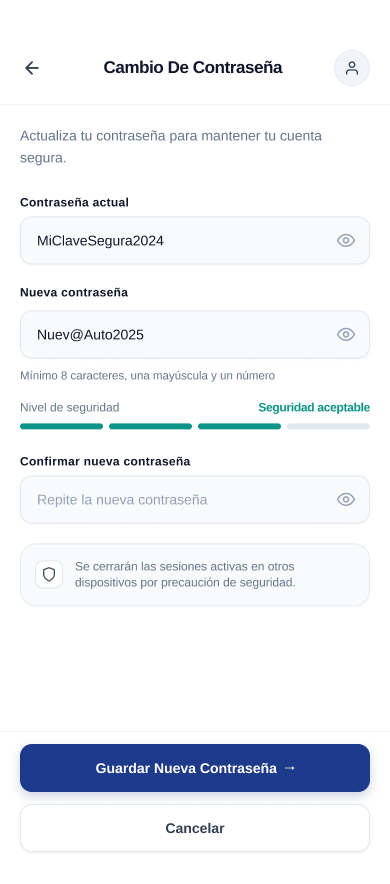 
      <small><b>Figura 88.</b> Mockup Paso 5: Cambio de Clave (US036)</small>
    </td>
  </tr>
</table>

**Análisis visual y componentes UI de la secuencia de mockups:**
- **Paso 1 (Paso 1: Registro B2B - US001):** Captura de razón social, RUC tributario, dirección física y credenciales iniciales con validación de duplicidad.
- **Paso 2 (Paso 2: Inicio de Sesión - US002):** Ingreso con credenciales corporativas o autenticación federada con Google OAuth2.
- **Paso 3 (Paso 3: Validación OTP - US004):** Desafío de seguridad numérico de 6 dígitos con temporizador de expiración regresivo para restablecimiento.
- **Paso 4 (Paso 4: Perfil y Ajustes - US035):** Administración de datos del operador, insignia de verificación de rol y actualización de correo.
- **Paso 5 (Paso 5: Cambio de Clave - US036):** Modificación autenticada de clave con lista de chequeo de seguridad criptográfica en tiempo real.

#### Módulo 2: Gestión de Talleres, Sucursales y Licenciamiento (Workshop Management) - Secuencia de Mockups (Alta Fidelidad)
*Historias de Usuario cubiertas: US005, US006, US007*

Como se aprecia en la secuencia visual de alta fidelidad de las **Figuras 89 a 93**, el diseño final incorpora la identidad cromática de ShiftIQ (`#1E3A8A`), componentes táctiles enriquecidos y microinteracciones de estado a lo largo del flujo:

<table align="center" style="border: none; border-collapse: collapse; margin: 16px auto; width: 100%;">
  <tr style="border: none;">
    <td align="center" style="border: none; padding: 6px; vertical-align: top; width: 20%;">
      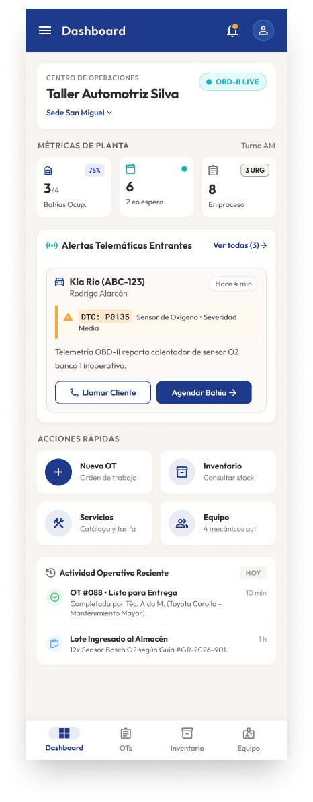 
      <small><b>Figura 89.</b> Mockup Paso 1: Dashboard de Planta (US006)</small>
    </td>
    <td align="center" style="border: none; padding: 6px; vertical-align: top; width: 20%;">
      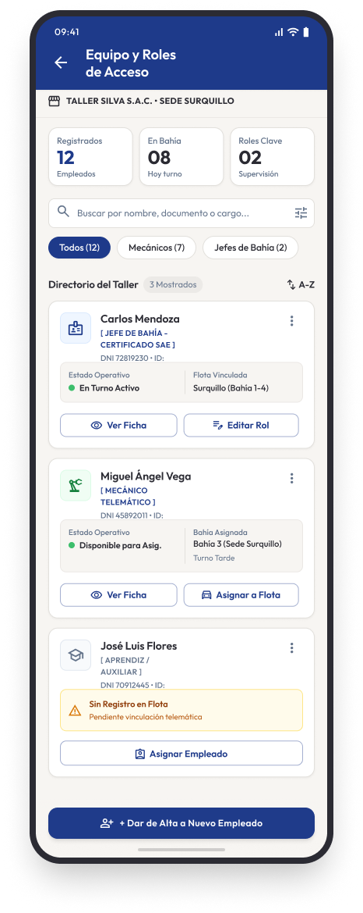 
      <small><b>Figura 90.</b> Mockup Paso 2: Personal y Roles (US005)</small>
    </td>
    <td align="center" style="border: none; padding: 6px; vertical-align: top; width: 20%;">
       
      <small><b>Figura 91.</b> Mockup Paso 3: Ficha de Sucursal (US006)</small>
    </td>
    <td align="center" style="border: none; padding: 6px; vertical-align: top; width: 20%;">
       
      <small><b>Figura 92.</b> Mockup Paso 4: Suscripción SaaS (US007)</small>
    </td>
    <td align="center" style="border: none; padding: 6px; vertical-align: top; width: 20%;">
       
      <small><b>Figura 93.</b> Mockup Paso 5: Menú Lateral (US005)</small>
    </td>
  </tr>
</table>

**Análisis visual y componentes UI de la secuencia de mockups:**
- **Paso 1 (Paso 1: Dashboard de Planta - US006):** Consola de operaciones con métricas de ocupación de bahías (75%), órdenes en proceso y alertas telemáticas entrantes.
- **Paso 2 (Paso 2: Personal y Roles - US005):** Padrón del equipo técnico con asignación de roles operativos (Mecánico, Administrador, Cajero) y sucursales.
- **Paso 3 (Paso 3: Ficha de Sucursal - US006):** Información operativa de la sede física: dirección, teléfono, cantidad de elevadores habilitados y capacidad diaria.
- **Paso 4 (Paso 4: Suscripción SaaS - US007):** Control del plan contratado (Profesional), renovación automática y activación de módulos telemáticos.
- **Paso 5 (Paso 5: Menú Lateral - US005):** Navegación ergonómica tipo Drawer entre órdenes de trabajo, inventario, citas, equipo y analíticas.

#### Módulo 3: Inteligencia Vehicular y Diagnóstico OBD-II (Vehicle Intelligence & Diagnostics) - Secuencia de Mockups (Alta Fidelidad)
*Historias de Usuario cubiertas: US017, US018, US019, US020, US021, US023, US025*

Como se aprecia en la secuencia visual de alta fidelidad de las **Figuras 94 a 99**, el diseño final incorpora la identidad cromática de ShiftIQ (`#1E3A8A`), componentes táctiles enriquecidos y microinteracciones de estado a lo largo del flujo:

<table align="center" style="border: none; border-collapse: collapse; margin: 16px auto; width: 100%;">
  <tr style="border: none;">
    <td align="center" style="border: none; padding: 6px; vertical-align: top; width: 16%;">
       
      <small><b>Figura 94.</b> Mockup Paso 1: Enrolamiento Vehicular (US017)</small>
    </td>
    <td align="center" style="border: none; padding: 6px; vertical-align: top; width: 16%;">
       
      <small><b>Figura 95.</b> Mockup Paso 2: Enlace de Dongle OBD-II (US018)</small>
    </td>
    <td align="center" style="border: none; padding: 6px; vertical-align: top; width: 16%;">
      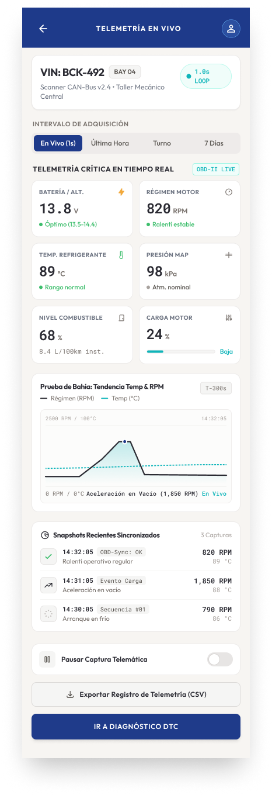 
      <small><b>Figura 96.</b> Mockup Paso 3: Telemetría en Tiempo Real (US019)</small>
    </td>
    <td align="center" style="border: none; padding: 6px; vertical-align: top; width: 16%;">
       
      <small><b>Figura 97.</b> Mockup Paso 4: Escaneo Electrónico (US023)</small>
    </td>
    <td align="center" style="border: none; padding: 6px; vertical-align: top; width: 16%;">
      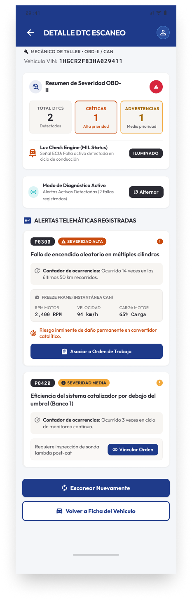 
      <small><b>Figura 98.</b> Mockup Paso 5: Diagnóstico y Traducción DTC (US023)</small>
    </td>
    <td align="center" style="border: none; padding: 6px; vertical-align: top; width: 16%;">
       
      <small><b>Figura 99.</b> Mockup Paso 6: Modo Offline y Buffer (US025)</small>
    </td>
  </tr>
</table>

**Análisis visual y componentes UI de la secuencia de mockups:**
- **Paso 1 (Paso 1: Enrolamiento Vehicular - US017):** Registro de placa peruana, marca, modelo, año, kilometraje de entrada y número VIN.
- **Paso 2 (Paso 2: Enlace de Dongle OBD-II - US018):** Búsqueda y emparejamiento Bluetooth del escáner telemático por dirección MAC con confirmación táctil.
- **Paso 3 (Paso 3: Telemetría en Tiempo Real - US019):** Tacómetros digitales en vivo para RPM del motor, velocidad, temperatura del refrigerante y voltaje de alternador.
- **Paso 4 (Paso 4: Escaneo Electrónico - US023):** Sondeo interactivo de protocolos CAN Bus por subsistemas (Motor, Transmisión, Frenos ABS, Emisiones).
- **Paso 5 (Paso 5: Diagnóstico y Traducción DTC - US023):** Listado de códigos SAE (P0135) con severidad cromática y traducción didáctica del síntoma para el usuario.
- **Paso 6 (Paso 6: Modo Offline y Buffer - US025):** Almacenamiento persistente en base SQLite local ante pérdida de red y sincronización automática al reconectar.

#### Módulo 4: Flotas y Agenda de Citas Técnicas (Fleet & Appointments) - Secuencia de Mockups (Alta Fidelidad)
*Historias de Usuario cubiertas: US026, US028, US029, US030, US031, US032*

Como se aprecia en la secuencia visual de alta fidelidad de las **Figuras 100 a 104**, el diseño final incorpora la identidad cromática de ShiftIQ (`#1E3A8A`), componentes táctiles enriquecidos y microinteracciones de estado a lo largo del flujo:

<table align="center" style="border: none; border-collapse: collapse; margin: 16px auto; width: 100%;">
  <tr style="border: none;">
    <td align="center" style="border: none; padding: 6px; vertical-align: top; width: 20%;">
       
      <small><b>Figura 100.</b> Mockup Paso 1: Agenda Diaria por Bahía (US029)</small>
    </td>
    <td align="center" style="border: none; padding: 6px; vertical-align: top; width: 20%;">
       
      <small><b>Figura 101.</b> Mockup Paso 2: Reserva de Bahía y Turno (US026)</small>
    </td>
    <td align="center" style="border: none; padding: 6px; vertical-align: top; width: 20%;">
      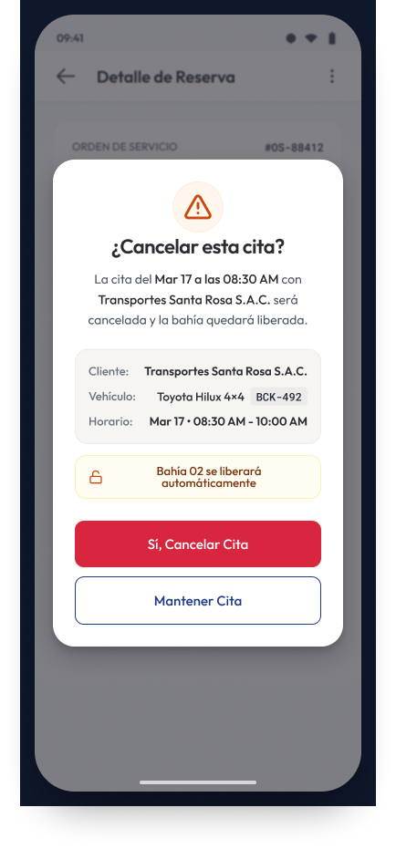 
      <small><b>Figura 102.</b> Mockup Paso 3: Cancelación y Liberación (US028)</small>
    </td>
    <td align="center" style="border: none; padding: 6px; vertical-align: top; width: 20%;">
      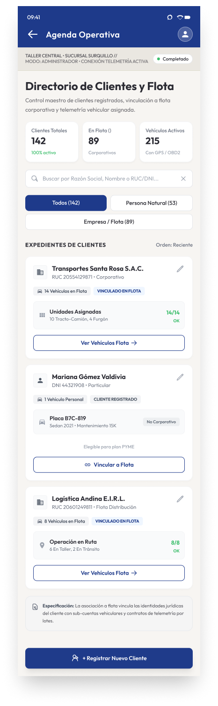 
      <small><b>Figura 103.</b> Mockup Paso 4: Directorio de Clientes (US032)</small>
    </td>
    <td align="center" style="border: none; padding: 6px; vertical-align: top; width: 20%;">
       
      <small><b>Figura 104.</b> Mockup Paso 5: Padrón de Flotas (US024)</small>
    </td>
  </tr>
</table>

**Análisis visual y componentes UI de la secuencia de mockups:**
- **Paso 1 (Paso 1: Agenda Diaria por Bahía - US029):** Programación horaria de citas con codificación de color por estado (Confirmada, En Rampa, Concluida).
- **Paso 2 (Paso 2: Reserva de Bahía y Turno - US026):** Selector gráfico de elevadores mecánicos y bahías especializadas para evitar solapamientos de atención.
- **Paso 3 (Paso 3: Cancelación y Liberación - US028):** Anulación de turno con registro de causal y liberación inmediata del cupo en la agenda de la sucursal.
- **Paso 4 (Paso 4: Directorio de Clientes - US032):** Padrón unificado de clientes particulares y corporativos con historial de visitas y contacto telefónico.
- **Paso 5 (Paso 5: Padrón de Flotas - US024):** Monitoreo de unidades de flota comercial con placa, chofer asignado y fecha de próximo mantenimiento.

#### Módulo 5: Inventario y Control de Repuestos FIFO (Inventory Management) - Secuencia de Mockups (Alta Fidelidad)
*Historias de Usuario cubiertas: US008, US009, US010*

Como se aprecia en la secuencia visual de alta fidelidad de las **Figuras 105 a 109**, el diseño final incorpora la identidad cromática de ShiftIQ (`#1E3A8A`), componentes táctiles enriquecidos y microinteracciones de estado a lo largo del flujo:

<table align="center" style="border: none; border-collapse: collapse; margin: 16px auto; width: 100%;">
  <tr style="border: none;">
    <td align="center" style="border: none; padding: 6px; vertical-align: top; width: 20%;">
      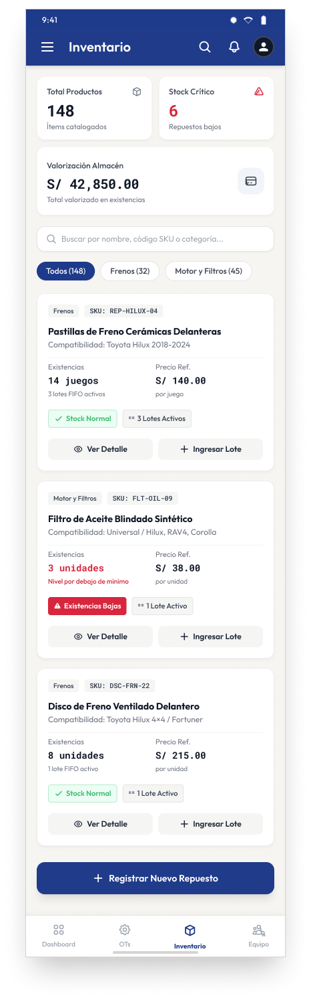 
      <small><b>Figura 105.</b> Mockup Paso 1: Catálogo de Repuestos (US008)</small>
    </td>
    <td align="center" style="border: none; padding: 6px; vertical-align: top; width: 20%;">
       
      <small><b>Figura 106.</b> Mockup Paso 2: Alta de Repuesto (US008)</small>
    </td>
    <td align="center" style="border: none; padding: 6px; vertical-align: top; width: 20%;">
       
      <small><b>Figura 107.</b> Mockup Paso 3: Ingreso de Lote FIFO (US010)</small>
    </td>
    <td align="center" style="border: none; padding: 6px; vertical-align: top; width: 20%;">
       
      <small><b>Figura 108.</b> Mockup Paso 4: Ajuste Manual de Stock (US010)</small>
    </td>
    <td align="center" style="border: none; padding: 6px; vertical-align: top; width: 20%;">
       
      <small><b>Figura 109.</b> Mockup Paso 5: Bloqueo de Stock Negativo (US010)</small>
    </td>
  </tr>
</table>

**Análisis visual y componentes UI de la secuencia de mockups:**
- **Paso 1 (Paso 1: Catálogo de Repuestos - US008):** Buscador predictivo de repuestos por código SKU, marca, cantidad disponible en almacén y precio de venta.
- **Paso 2 (Paso 2: Alta de Repuesto - US008):** Registro de artículo con escaneo de código de barras, categoría, aplicación vehicular y umbral de alerta mínima.
- **Paso 3 (Paso 3: Ingreso de Lote FIFO - US010):** Recepción de factura del proveedor, registro de costo unitario y fecha para rotación según el orden de llegada.
- **Paso 4 (Paso 4: Ajuste Manual de Stock - US010):** Corrección de cantidades por conteo físico o mermas con justificación formal y firma de auditoría.
- **Paso 5 (Paso 5: Bloqueo de Stock Negativo - US010):** Validación del sistema que prohíbe el despacho o imputación de piezas sin disponibilidad física en bodega.

#### Módulo 6: Operaciones de Taller y Órdenes de Trabajo (Service Operations) - Secuencia de Mockups (Alta Fidelidad)
*Historias de Usuario cubiertas: US011, US012, US013, US014, US015, US048, US049, US050*

Como se aprecia en la secuencia visual de alta fidelidad de las **Figuras 110 a 114**, el diseño final incorpora la identidad cromática de ShiftIQ (`#1E3A8A`), componentes táctiles enriquecidos y microinteracciones de estado a lo largo del flujo:

<table align="center" style="border: none; border-collapse: collapse; margin: 16px auto; width: 100%;">
  <tr style="border: none;">
    <td align="center" style="border: none; padding: 6px; vertical-align: top; width: 20%;">
       
      <small><b>Figura 110.</b> Mockup Paso 1: Catálogo de Servicios (US011)</small>
    </td>
    <td align="center" style="border: none; padding: 6px; vertical-align: top; width: 20%;">
       
      <small><b>Figura 111.</b> Mockup Paso 2: Tablero Kanban de OTs (US050)</small>
    </td>
    <td align="center" style="border: none; padding: 6px; vertical-align: top; width: 20%;">
       
      <small><b>Figura 112.</b> Mockup Paso 3: Apertura de Orden (US012)</small>
    </td>
    <td align="center" style="border: none; padding: 6px; vertical-align: top; width: 20%;">
       
      <small><b>Figura 113.</b> Mockup Paso 4: Terminal del Mecánico (US014)</small>
    </td>
    <td align="center" style="border: none; padding: 6px; vertical-align: top; width: 20%;">
       
      <small><b>Figura 114.</b> Mockup Paso 5: Validación de Diagnóstico (US014)</small>
    </td>
  </tr>
</table>

**Análisis visual y componentes UI de la secuencia de mockups:**
- **Paso 1 (Paso 1: Catálogo de Servicios - US011):** Definición de paquetes de mantenimiento, tiempos estándar de labor y tarifas de mano de obra en Soles.
- **Paso 2 (Paso 2: Tablero Kanban de OTs - US050):** Visualización de flujo por estados (Creada, En Diagnóstico, En Proceso, Completada) con alertas de demora.
- **Paso 3 (Paso 3: Apertura de Orden - US012):** Recepción de vehículo, kilometraje, combustible, checklist gráfico de carrocería y motivos del cliente.
- **Paso 4 (Paso 4: Terminal del Mecánico - US014):** Terminal de bahía con cronómetro, fotos antes/después, diagnóstico obligatorio con contador de caracteres y consumo FIFO.
- **Paso 5 (Paso 5: Validación de Diagnóstico - US014):** Restricción que bloquea el cierre de la labor si no se documenta formalmente la conclusión técnica y evidencia.

#### Módulo 7: Facturación, Cotizaciones y Pasarela de Pagos (Billing & Payments) - Secuencia de Mockups (Alta Fidelidad)
*Historias de Usuario cubiertas: US016, US037, US038, US039, US041, US042, US043, US044, US045*

Como se aprecia en la secuencia visual de alta fidelidad de las **Figuras 115 a 119**, el diseño final incorpora la identidad cromática de ShiftIQ (`#1E3A8A`), componentes táctiles enriquecidos y microinteracciones de estado a lo largo del flujo:

<table align="center" style="border: none; border-collapse: collapse; margin: 16px auto; width: 100%;">
  <tr style="border: none;">
    <td align="center" style="border: none; padding: 6px; vertical-align: top; width: 20%;">
       
      <small><b>Figura 115.</b> Mockup Paso 1: Generación de Cotización (US037)</small>
    </td>
    <td align="center" style="border: none; padding: 6px; vertical-align: top; width: 20%;">
       
      <small><b>Figura 116.</b> Mockup Paso 2: Aprobación Digital DRAFT (US038)</small>
    </td>
    <td align="center" style="border: none; padding: 6px; vertical-align: top; width: 20%;">
       
      <small><b>Figura 117.</b> Mockup Paso 3: Checkout con Stripe (US044)</small>
    </td>
    <td align="center" style="border: none; padding: 6px; vertical-align: top; width: 20%;">
      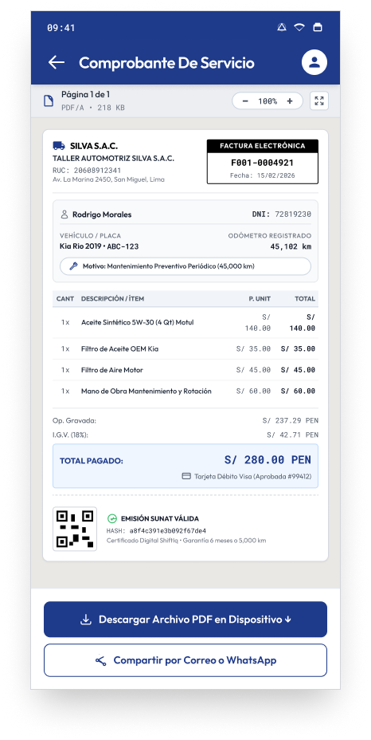 
      <small><b>Figura 118.</b> Mockup Paso 4: Comprobante Fiscal PDF (US041)</small>
    </td>
    <td align="center" style="border: none; padding: 6px; vertical-align: top; width: 20%;">
       
      <small><b>Figura 119.</b> Mockup Paso 5: Liquidación y Salida (US016)</small>
    </td>
  </tr>
</table>

**Análisis visual y componentes UI de la secuencia de mockups:**
- **Paso 1 (Paso 1: Generación de Cotización - US037):** Cálculo de mano de obra y repuestos en Soles PEN con desglose de impuestos (18% IGV) y descuentos aplicables.
- **Paso 2 (Paso 2: Aprobación Digital DRAFT - US038):** Revisión remota del presupuesto por el conductor desde su smartphone y autorización con firma digital.
- **Paso 3 (Paso 3: Checkout con Stripe - US044):** Pasarela digital segura (monto S/ 481.44 PEN), medios de pago (Tarjeta, BCP, Yape) y casilla de Facturación Electrónica.
- **Paso 4 (Paso 4: Comprobante Fiscal PDF - US041):** Emisión de boleta o factura digital con código QR según normativa tributaria SUNAT y firma digital.
- **Paso 5 (Paso 5: Liquidación y Salida - US016):** Marcado de orden como pagada tras validación bancaria, autorizando la salida del vehículo y liberando la bahía.

#### Módulo 8: Experiencia Digital del Conductor (Driver B2C Experience) - Secuencia de Mockups (Alta Fidelidad)
*Historias de Usuario cubiertas: Dashboard, Garaje, Monitoreo en Vivo*

Como se aprecia en la secuencia visual de alta fidelidad de las **Figuras 120 a 123**, el diseño final incorpora la identidad cromática de ShiftIQ (`#1E3A8A`), componentes táctiles enriquecidos y microinteracciones de estado a lo largo del flujo:

<table align="center" style="border: none; border-collapse: collapse; margin: 16px auto; width: 100%;">
  <tr style="border: none;">
    <td align="center" style="border: none; padding: 6px; vertical-align: top; width: 25%;">
       
      <small><b>Figura 120.</b> Mockup Paso 1: Driver Home Dashboard (Driver)</small>
    </td>
    <td align="center" style="border: none; padding: 6px; vertical-align: top; width: 25%;">
       
      <small><b>Figura 121.</b> Mockup Paso 2: Mi Garaje e Historial (Driver)</small>
    </td>
    <td align="center" style="border: none; padding: 6px; vertical-align: top; width: 25%;">
       
      <small><b>Figura 122.</b> Mockup Paso 3: Monitoreo en Vivo (Driver)</small>
    </td>
    <td align="center" style="border: none; padding: 6px; vertical-align: top; width: 25%;">
       
      <small><b>Figura 123.</b> Mockup Paso 4: Hallazgos Adicionales (Driver)</small>
    </td>
  </tr>
</table>

**Análisis visual y componentes UI de la secuencia de mockups:**
- **Paso 1 (Paso 1: Driver Home Dashboard - Driver):** Consola del conductor con score de salud (94%), conexión OBD-II, 4 lecturas telemáticas en vivo y tarjeta de alerta O2.
- **Paso 2 (Paso 2: Mi Garaje e Historial - Driver):** Bitácora cronológica de reparaciones realizadas, kilometraje, comprobantes descargables y recordatorios de servicio.
- **Paso 3 (Paso 3: Monitoreo en Vivo - Driver):** Seguimiento en tiempo real de la fase técnica activa en bahía (En Rampa), técnico asignado y tiempo estimado.
- **Paso 4 (Paso 4: Hallazgos Adicionales - Driver):** Notificación con foto de bahía de piezas desgastadas y presupuesto adicional para aprobación táctil remota.

---

### 3.1.4.4. Mobile Applications User Flow Diagrams

Los diagramas de User Flow describen el trayecto integral de los actores del sistema (conductores y operadores de taller) a lo largo de las decisiones de negocio y validaciones del software:

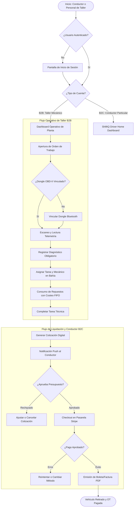

---

### 3.1.4.5. Mobile Applications Prototyping

Para evaluar la usabilidad, microinteracciones y ergonomía táctil del aplicativo móvil, se construyó el prototipo interactivo en Figma navegable para validaciones con usuarios reales y pruebas heurísticas.

- **Herramienta de Prototipado:** Figma.
- **Enlace al archivo de diseño y prototipo navegable:** [Shift IQ Wireframes y Prototipo Interactivo – Figma](https://www.figma.com/design/Vi2I1dal5Ifx52U1Z00qf3/Shift-IQ-Wireframes?node-id=0-1&t=vsBCs3oHJjYhHEmB-0)
- **Escenarios de Navegación Interactiva Clave:**
  1. *Escenario 1 (IAM y Seguridad):* Flujo de inicio de sesión B2B/B2C, recuperación de cuenta mediante desafío OTP de 6 dígitos y cambio de contraseña autenticado.
  2. *Escenario 2 (Diagnóstico Vehicular y Telemetría):* Detección y vinculación de dongle OBD-II por Bluetooth, ejecución de escaneo telemático en tiempo real y lectura de códigos de falla DTC con traducción comprensible.
  3. *Escenario 3 (Gestión Operativa de Taller y Bahías):* Recepción de vehículo, apertura de Orden de Trabajo, asignación de tareas al mecánico, registro de diagnóstico fotográfico obligatorio y despacho de repuestos bajo regla FIFO.
  4. *Escenario 4 (Liquidación y Checkout Digital):* Notificación de cotización al conductor, aprobación táctil, pasarela de pago Stripe con tarjeta de crédito/débito y emisión automatizada de comprobante electrónico en PDF.
