## 3.1.4. Mobile Applications UX/UI Design

El diseño de la experiencia e interfaz de usuario (UX/UI) móvil para **ShiftIQ** se ha concebido bajo los principios del diseño de interacción *Mobile-First*, optimizando las tareas de dos actores fundamentales: el personal técnico y administrativo de talleres mecánicos (**Segmento B2B**) y los conductores particulares (**Segmento B2C**).

Para garantizar una lectura ordenada, exhaustiva y alineada con los principios de **Domain-Driven Design (DDD)** desarrollados en el capítulo 2, el aplicativo móvil se estructura en **ocho módulos funcionales**. Cada módulo abarca sus diversos escenarios operativos y se desglosa en **flujos de interacción organizados como secuencias lado a lado (1 al lado de otro)**. Se exponen primero los esquemas de alambre (**Wireframes**) y posteriormente su concreción en alta fidelidad (**Mock-ups**), documentando el trayecto completo del usuario, componentes interactivos y el cumplimiento riguroso de cada Historia de Usuario (US).

---

### 3.1.4.1. Mobile Applications Wireframes

Los wireframes representan la estructura esquemática y funcional de baja a media fidelidad de la aplicación móvil de ShiftIQ. Su propósito es definir la jerarquía visual, distribución táctil y los flujos de navegación sin distracciones de estilo final.

A continuación, se presentan **todos los wireframes del sistema**, organizados por módulos funcionales y presentados en **secuencias visuales horizontales lado a lado** para cada escenario de negocio:

#### Módulo 1: Identidad, Autenticación y Seguridad (IAM) - Secuencias de Wireframes
*Historias de Usuario cubiertas: US001, US002, US004, US035, US036*

##### Flujo 1.1: Onboarding y Registro de Usuarios (B2B y B2C)

Proceso de bienvenida, presentación de la propuesta de valor IoT e incorporación de cuentas tanto para talleres mecánicos como para conductores particulares. Tal como se observa en la secuencia interactiva de las **Figuras 44 a 51**, el flujo operativo del módulo guía al usuario paso a paso a través de las siguientes pantallas consecutivas:

<table align="center" style="border: none; border-collapse: collapse; margin: 16px auto; width: 100%;">
  <tr style="border: none;">
    <td align="center" style="border: none; padding: 6px; vertical-align: top; width: 12%;">
      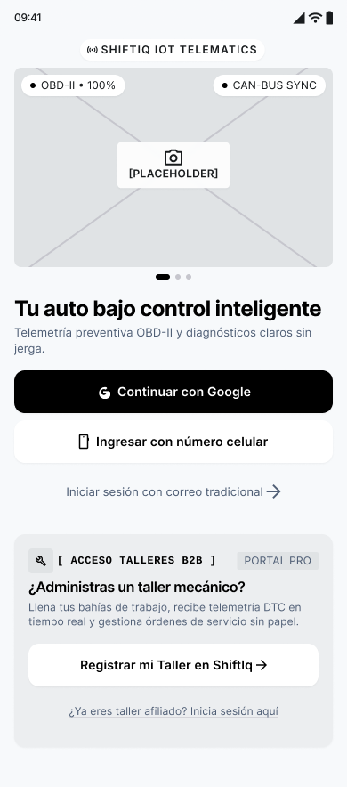 
      <small><b>Figura 44.</b> Paso 1: Onboarding y Acceso ShiftIQ IoT (US001, US002)</small>
    </td>
    <td align="center" style="border: none; padding: 6px; vertical-align: top; width: 12%;">
      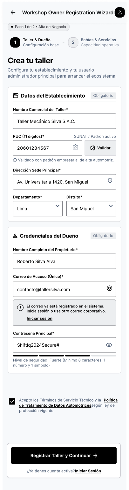 
      <small><b>Figura 45.</b> Paso 2: Registro de Taller y Propietario B2B (US001)</small>
    </td>
    <td align="center" style="border: none; padding: 6px; vertical-align: top; width: 12%;">
      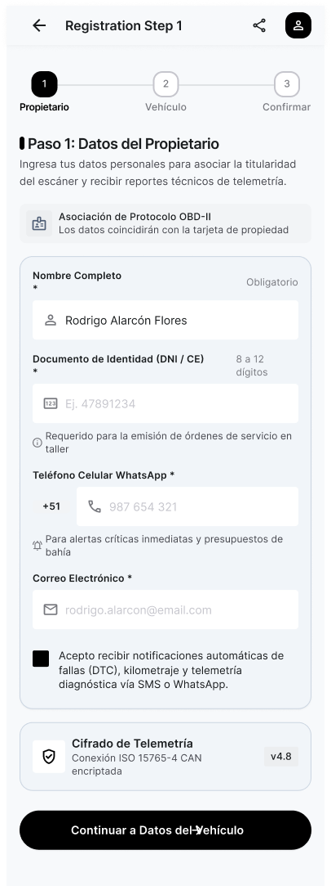 
      <small><b>Figura 46.</b> Paso 3: Asistente de Registro Paso 1: Datos de Propietario (US001)</small>
    </td>
    <td align="center" style="border: none; padding: 6px; vertical-align: top; width: 12%;">
      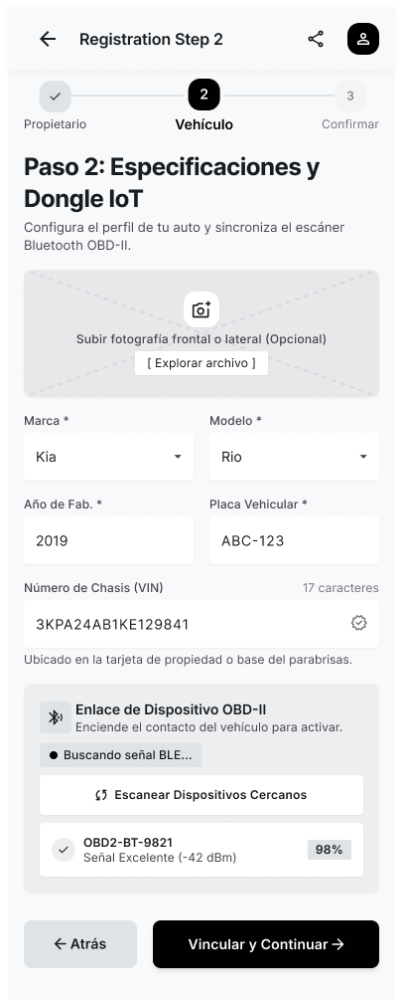 
      <small><b>Figura 47.</b> Paso 4: Asistente de Registro Paso 2: Vehículo y OBD-II (US001, US017)</small>
    </td>
    <td align="center" style="border: none; padding: 6px; vertical-align: top; width: 12%;">
      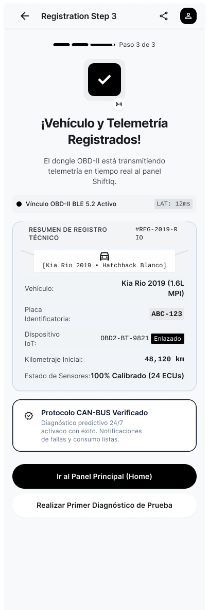 
      <small><b>Figura 48.</b> Paso 5: Asistente de Registro Paso 3: Confirmación de Cuenta (US001)</small>
    </td>
    <td align="center" style="border: none; padding: 6px; vertical-align: top; width: 12%;">
      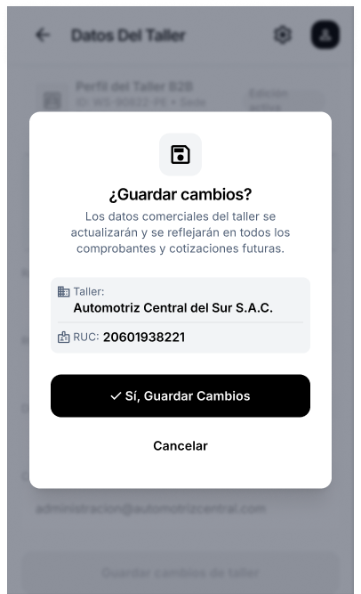 
      <small><b>Figura 49.</b> Paso 6: Modal de Verificación de Datos de Registro (US001)</small>
    </td>
    <td align="center" style="border: none; padding: 6px; vertical-align: top; width: 12%;">
      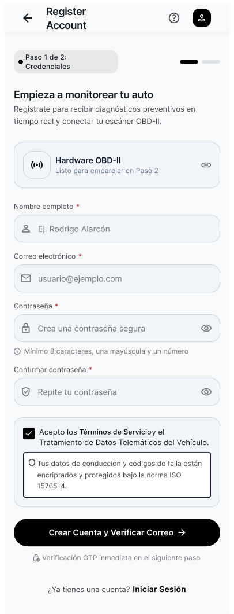 
      <small><b>Figura 50.</b> Paso 7: Creación de Cuenta Conductor B2C (US001)</small>
    </td>
    <td align="center" style="border: none; padding: 6px; vertical-align: top; width: 12%;">
      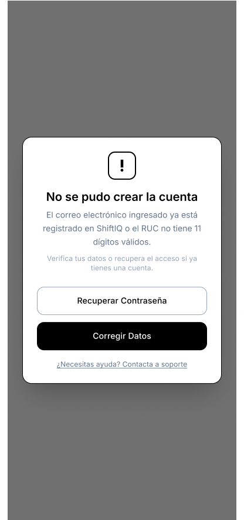 
      <small><b>Figura 51.</b> Paso 8: Manejo de Errores en Registro de Cuenta (US001)</small>
    </td>
  </tr>
</table>

**Detalle analítico de la secuencia de wireframes:**
- **Paso 1 (Onboarding y Acceso ShiftIQ IoT - US001, US002):** Pantalla introductoria interactiva que destaca las capacidades de telemetría OBD-II en tiempo real y ofrece accesos diferenciados para registro B2B y B2C.
- **Paso 2 (Registro de Taller y Propietario B2B - US001):** Formulario de alta empresarial con captura y validación en tiempo real de razón social, RUC tributario (SUNAT), dirección fiscal y credenciales de administrador.
- **Paso 3 (Asistente de Registro Paso 1: Datos de Propietario - US001):** Etapa inicial del asistente de onboarding con captura de información personal, teléfono y correo electrónico de contacto.
- **Paso 4 (Asistente de Registro Paso 2: Vehículo y OBD-II - US001, US017):** Asociación guiada de la primera unidad vehicular con placa, marca, modelo y emparejamiento preliminar de hardware telemático.
- **Paso 5 (Asistente de Registro Paso 3: Confirmación de Cuenta - US001):** Resumen de validación de los datos ingresados y aceptación de términos del servicio antes de activar la cuenta.
- **Paso 6 (Modal de Verificación de Datos de Registro - US001):** Confirmación final mediante diálogo de seguridad para certificar la exactitud del RUC y documento de identidad del solicitante.
- **Paso 7 (Creación de Cuenta Conductor B2C - US001):** Formulario simplificado para conductores particulares con campos para nombres, correo electrónico, teléfono móvil y contraseña con confirmación.
- **Paso 8 (Manejo de Errores en Registro de Cuenta - US001):** Estado de retroalimentación con alerta visual y desactivación de envío ante campos incompletos, formato de correo no válido o RUC ya registrado.

##### Flujo 1.2: Autenticación e Inicio de Sesión

Acceso seguro a la plataforma móvil mediante credenciales corporativas o autenticación federada. Tal como se observa en la secuencia interactiva de las **Figuras 52 a 53**, el flujo operativo del módulo guía al usuario paso a paso a través de las siguientes pantallas consecutivas:

<table align="center" style="border: none; border-collapse: collapse; margin: 16px auto; width: 100%;">
  <tr style="border: none;">
    <td align="center" style="border: none; padding: 6px; vertical-align: top; width: 50%;">
      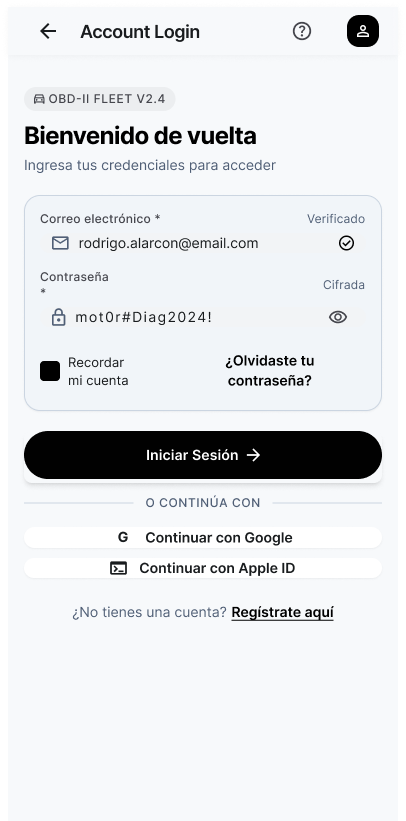 
      <small><b>Figura 52.</b> Paso 1: Inicio de Sesión Taller Mecánico B2B (US002)</small>
    </td>
    <td align="center" style="border: none; padding: 6px; vertical-align: top; width: 50%;">
       
      <small><b>Figura 53.</b> Paso 2: Inicio de Sesión Conductor B2C (US002)</small>
    </td>
  </tr>
</table>

**Detalle analítico de la secuencia de wireframes:**
- **Paso 1 (Inicio de Sesión Taller Mecánico B2B - US002):** Interfaz de ingreso para personal de taller con soporte para credenciales corporativas, recordación de sesión y Google OAuth2.
- **Paso 2 (Inicio de Sesión Conductor B2C - US002):** Vista optimizada para conductores particulares con login directo por correo electrónico, teléfono móvil o autenticación biométrica.

##### Flujo 1.3: Recuperación de Cuenta y Verificación OTP (B2B y B2C)

Mecanismo de seguridad de triple factor para restablecimiento de credenciales olvidadas. Tal como se observa en la secuencia interactiva de las **Figuras 54 a 61**, el flujo operativo del módulo guía al usuario paso a paso a través de las siguientes pantallas consecutivas:

<table align="center" style="border: none; border-collapse: collapse; margin: 16px auto; width: 100%;">
  <tr style="border: none;">
    <td align="center" style="border: none; padding: 6px; vertical-align: top; width: 12%;">
       
      <small><b>Figura 54.</b> Paso 1: Recuperación B2B Paso 1: Solicitud de Código (US004)</small>
    </td>
    <td align="center" style="border: none; padding: 6px; vertical-align: top; width: 12%;">
      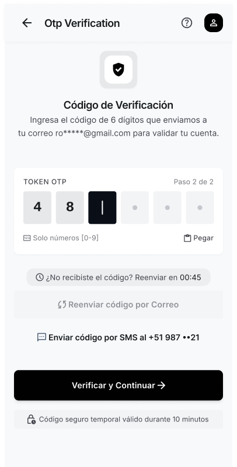 
      <small><b>Figura 55.</b> Paso 2: Recuperación B2B Paso 2: Verificación OTP (US004)</small>
    </td>
    <td align="center" style="border: none; padding: 6px; vertical-align: top; width: 12%;">
      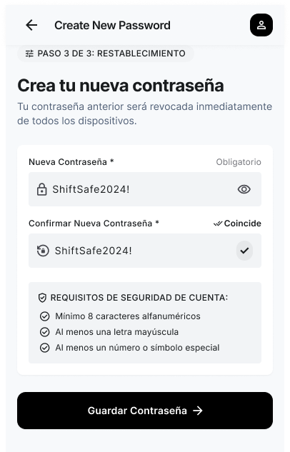 
      <small><b>Figura 56.</b> Paso 3: Recuperación B2B Paso 3: Definición de Nueva Clave (US004)</small>
    </td>
    <td align="center" style="border: none; padding: 6px; vertical-align: top; width: 12%;">
       
      <small><b>Figura 57.</b> Paso 4: Recuperación B2B Paso 3B: Confirmación de Restablecimiento (US004)</small>
    </td>
    <td align="center" style="border: none; padding: 6px; vertical-align: top; width: 12%;">
      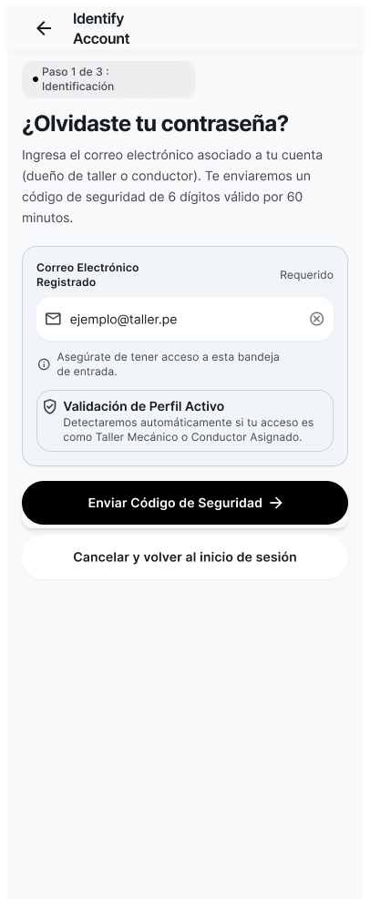 
      <small><b>Figura 58.</b> Paso 5: Recuperación B2C Paso 1: Solicitud de Código Conductor (US004)</small>
    </td>
    <td align="center" style="border: none; padding: 6px; vertical-align: top; width: 12%;">
      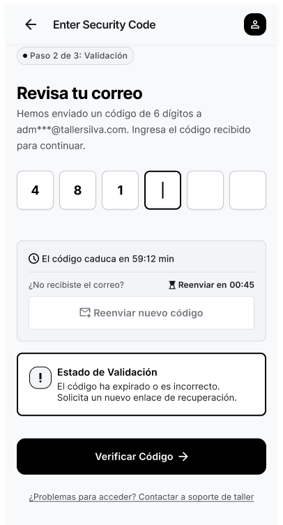 
      <small><b>Figura 59.</b> Paso 6: Recuperación B2C Paso 2: Validación OTP Conductor (US004)</small>
    </td>
    <td align="center" style="border: none; padding: 6px; vertical-align: top; width: 12%;">
       
      <small><b>Figura 60.</b> Paso 7: Recuperación B2C Paso 3: Renovación de Clave (US004)</small>
    </td>
    <td align="center" style="border: none; padding: 6px; vertical-align: top; width: 12%;">
      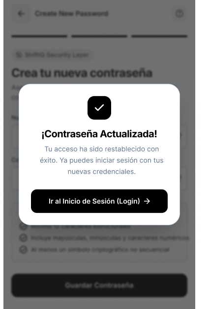 
      <small><b>Figura 61.</b> Paso 8: Recuperación B2C Paso 3B: Éxito de Restablecimiento (US004)</small>
    </td>
  </tr>
</table>

**Detalle analítico de la secuencia de wireframes:**
- **Paso 1 (Recuperación B2B Paso 1: Solicitud de Código - US004):** Ingreso del correo electrónico corporativo registrado para el envío de un código de verificación de un solo uso (OTP).
- **Paso 2 (Recuperación B2B Paso 2: Verificación OTP - US004):** Desafío de 6 dígitos numéricos con temporizador de expiración regresivo de 60 segundos y opción de reenvío.
- **Paso 3 (Recuperación B2B Paso 3: Definición de Nueva Clave - US004):** Establecimiento de nueva contraseña con medidor de robustez criptográfica y confirmación de caracteres.
- **Paso 4 (Recuperación B2B Paso 3B: Confirmación de Restablecimiento - US004):** Modal de confirmación exitosa con botón para redirigir directamente al inicio de sesión con las nuevas credenciales.
- **Paso 5 (Recuperación B2C Paso 1: Solicitud de Código Conductor - US004):** Petición de restablecimiento de cuenta para conductores con envío de SMS o correo de verificación seguro.
- **Paso 6 (Recuperación B2C Paso 2: Validación OTP Conductor - US004):** Verificación de autenticidad del conductor mediante código temporal de un solo uso con soporte de teclado numérico.
- **Paso 7 (Recuperación B2C Paso 3: Renovación de Clave - US004):** Actualización de credenciales personales de acceso para el aplicativo móvil del conductor.
- **Paso 8 (Recuperación B2C Paso 3B: Éxito de Restablecimiento - US004):** Notificación de confirmación de clave actualizada redirigiendo al dashboard del conductor.

##### Flujo 1.4: Perfil de Usuario, Actualización de Correo y Seguridad

Gestión autónoma de datos personales, credenciales y validaciones de seguridad por parte del usuario. Tal como se observa en la secuencia interactiva de las **Figuras 62 a 69**, el flujo operativo del módulo guía al usuario paso a paso a través de las siguientes pantallas consecutivas:

<table align="center" style="border: none; border-collapse: collapse; margin: 16px auto; width: 100%;">
  <tr style="border: none;">
    <td align="center" style="border: none; padding: 6px; vertical-align: top; width: 12%;">
       
      <small><b>Figura 62.</b> Paso 1: Mi Perfil y Ajustes de Cuenta (US035)</small>
    </td>
    <td align="center" style="border: none; padding: 6px; vertical-align: top; width: 12%;">
      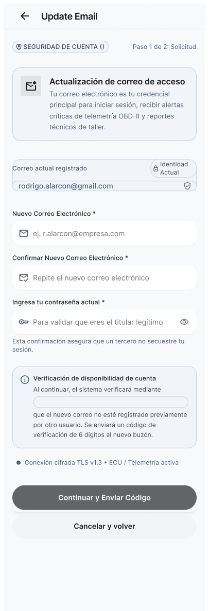 
      <small><b>Figura 63.</b> Paso 2: Actualización de Correo Paso 1 (US035)</small>
    </td>
    <td align="center" style="border: none; padding: 6px; vertical-align: top; width: 12%;">
      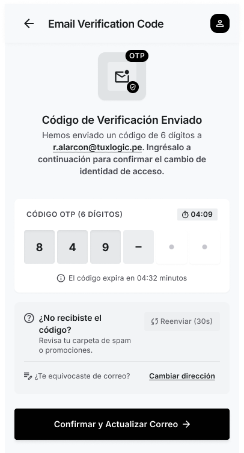 
      <small><b>Figura 64.</b> Paso 3: Verificación de Código de Nuevo Correo (US035)</small>
    </td>
    <td align="center" style="border: none; padding: 6px; vertical-align: top; width: 12%;">
      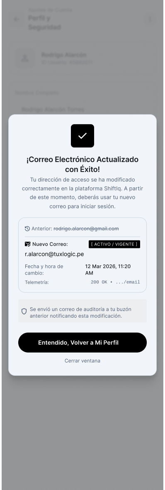 
      <small><b>Figura 65.</b> Paso 4: Confirmación de Actualización de Correo (US035)</small>
    </td>
    <td align="center" style="border: none; padding: 6px; vertical-align: top; width: 12%;">
      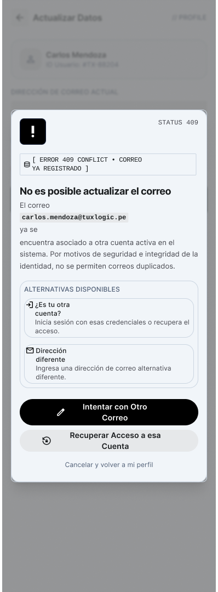 
      <small><b>Figura 66.</b> Paso 5: Conflicto por Correo Duplicado (Error 409) (US035)</small>
    </td>
    <td align="center" style="border: none; padding: 6px; vertical-align: top; width: 12%;">
       
      <small><b>Figura 67.</b> Paso 6: Cambio de Contraseña Autenticado (US036)</small>
    </td>
    <td align="center" style="border: none; padding: 6px; vertical-align: top; width: 12%;">
      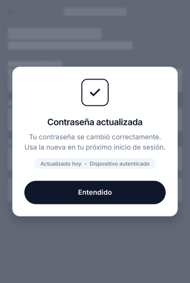 
      <small><b>Figura 68.</b> Paso 7: Confirmación de Cambio de Contraseña (US036)</small>
    </td>
    <td align="center" style="border: none; padding: 6px; vertical-align: top; width: 12%;">
      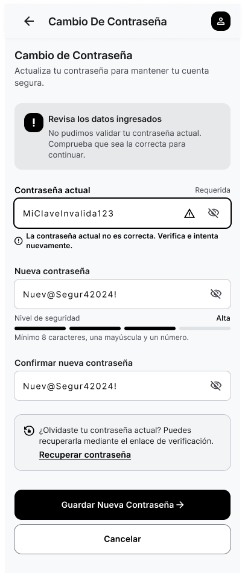 
      <small><b>Figura 69.</b> Paso 8: Error de Validación en Cambio de Contraseña (US036)</small>
    </td>
  </tr>
</table>

**Detalle analítico de la secuencia de wireframes:**
- **Paso 1 (Mi Perfil y Ajustes de Cuenta - US035):** Panel central de perfil con avatar, sede asignada, rol activo y accesos directos para cambiar contraseña o correo.
- **Paso 2 (Actualización de Correo Paso 1 - US035):** Ingreso de la nueva dirección de correo electrónico con validación de sintaxis antes del envío de verificación.
- **Paso 3 (Verificación de Código de Nuevo Correo - US035):** Comprobación de token numérico enviado al nuevo buzón para certificar la titularidad del usuario.
- **Paso 4 (Confirmación de Actualización de Correo - US035):** Modal interactivo de éxito que confirma la actualización del identificador de acceso principal.
- **Paso 5 (Conflicto por Correo Duplicado (Error 409) - US035):** Mensaje de advertencia modal cuando el correo ingresado ya pertenece a otra cuenta activa en el sistema.
- **Paso 6 (Cambio de Contraseña Autenticado - US036):** Formulario de cambio de clave dentro de la sesión activa con chequeo reactivo de políticas de seguridad.
- **Paso 7 (Confirmación de Cambio de Contraseña - US036):** Retroalimentación visual positiva indicando que la clave fue renovada y las sesiones previas revocadas.
- **Paso 8 (Error de Validación en Cambio de Contraseña - US036):** Notificación de error ante discrepancia en la confirmación o incumplimiento de complejidad de contraseña.

#### Módulo 2: Gestión de Talleres, Sucursales y Licenciamiento (Workshop Management) - Secuencias de Wireframes
*Historias de Usuario cubiertas: US005, US006, US007*

##### Flujo 2.1: Consola de Operaciones y Navegación de Planta

Centro de control del taller mecánico con métricas en tiempo real de ocupación de bahías y navegación general. Tal como se observa en la secuencia interactiva de las **Figuras 70 a 71**, el flujo operativo del módulo guía al usuario paso a paso a través de las siguientes pantallas consecutivas:

<table align="center" style="border: none; border-collapse: collapse; margin: 16px auto; width: 100%;">
  <tr style="border: none;">
    <td align="center" style="border: none; padding: 6px; vertical-align: top; width: 50%;">
      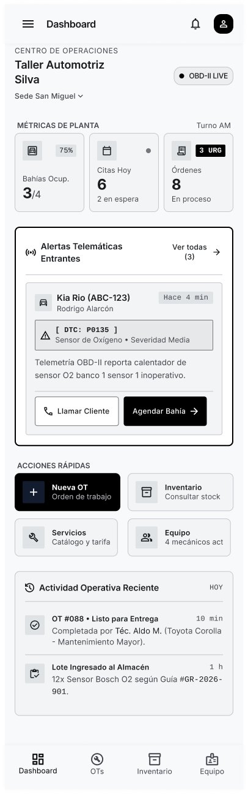 
      <small><b>Figura 70.</b> Paso 1: Dashboard Operativo de Planta (US006)</small>
    </td>
    <td align="center" style="border: none; padding: 6px; vertical-align: top; width: 50%;">
      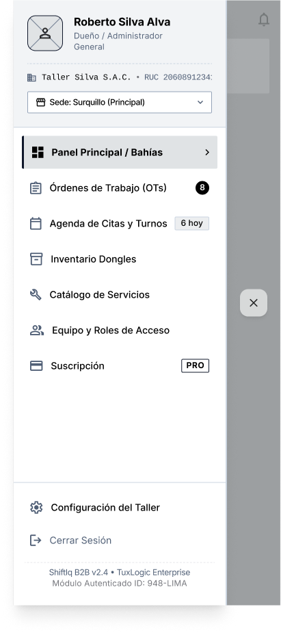 
      <small><b>Figura 71.</b> Paso 2: Navegación Lateral del Taller (Drawer) (US005)</small>
    </td>
  </tr>
</table>

**Detalle analítico de la secuencia de wireframes:**
- **Paso 1 (Dashboard Operativo de Planta - US006):** Tablero central con tarjeta de ocupación de bahías (75%), citas del turno, órdenes en curso y alertas telemáticas prioritarias.
- **Paso 2 (Navegación Lateral del Taller (Drawer) - US005):** Menú ergonómico deslizable con accesos a Órdenes, Citas, Bahías, Inventario FIFO, Facturación y Configuración.

##### Flujo 2.2: Directorio de Personal, Alta de Empleado y Revocación de Accesos

Administración integral del equipo técnico de mecánicos y jefes de taller por sucursal. Tal como se observa en la secuencia interactiva de las **Figuras 72 a 75**, el flujo operativo del módulo guía al usuario paso a paso a través de las siguientes pantallas consecutivas:

<table align="center" style="border: none; border-collapse: collapse; margin: 16px auto; width: 100%;">
  <tr style="border: none;">
    <td align="center" style="border: none; padding: 6px; vertical-align: top; width: 25%;">
       
      <small><b>Figura 72.</b> Paso 1: Directorio de Personal y Roles (US005)</small>
    </td>
    <td align="center" style="border: none; padding: 6px; vertical-align: top; width: 25%;">
      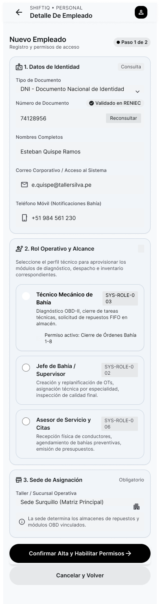 
      <small><b>Figura 73.</b> Paso 2: Alta de Nuevo Empleado y Asignación de Rol (US005)</small>
    </td>
    <td align="center" style="border: none; padding: 6px; vertical-align: top; width: 25%;">
      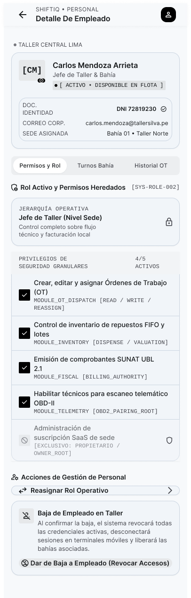 
      <small><b>Figura 74.</b> Paso 3: Ficha de Detalle de Empleado (US005)</small>
    </td>
    <td align="center" style="border: none; padding: 6px; vertical-align: top; width: 25%;">
      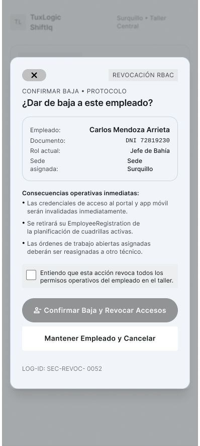 
      <small><b>Figura 75.</b> Paso 4: Confirmar Baja y Revocar Accesos (US005)</small>
    </td>
  </tr>
</table>

**Detalle analítico de la secuencia de wireframes:**
- **Paso 1 (Directorio de Personal y Roles - US005):** Padrón general de colaboradores con cargo (Mecánico, Administrador, Cajero), estado activo y filtros por sede.
- **Paso 2 (Alta de Nuevo Empleado y Asignación de Rol - US005):** Formulario de registro de técnico con nombre, documento de identidad, especialidad y credenciales iniciales.
- **Paso 3 (Ficha de Detalle de Empleado - US005):** Vista detallada de carga laboral del mecánico, órdenes asignadas, historial de productividad y teléfono.
- **Paso 4 (Confirmar Baja y Revocar Accesos - US005):** Modal de seguridad para desvinculación de técnico y anulación inmediata de tokens de acceso al sistema.

##### Flujo 2.3: Sucursales, Capacidad de Bahías y Suscripción SaaS

Control de infraestructura de sedes físicas y licenciamiento multitenant de la plataforma. Tal como se observa en la secuencia interactiva de las **Figuras 76 a 82**, el flujo operativo del módulo guía al usuario paso a paso a través de las siguientes pantallas consecutivas:

<table align="center" style="border: none; border-collapse: collapse; margin: 16px auto; width: 100%;">
  <tr style="border: none;">
    <td align="center" style="border: none; padding: 6px; vertical-align: top; width: 14%;">
       
      <small><b>Figura 76.</b> Paso 1: Detalle y Capacidad Operativa de Sucursal (US006)</small>
    </td>
    <td align="center" style="border: none; padding: 6px; vertical-align: top; width: 14%;">
      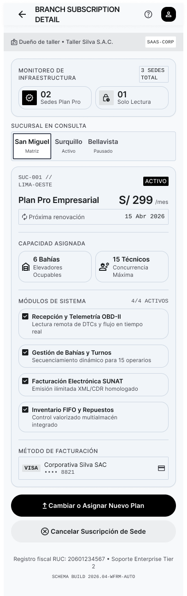 
      <small><b>Figura 77.</b> Paso 2: Administración de Suscripción por Sucursal (US007)</small>
    </td>
    <td align="center" style="border: none; padding: 6px; vertical-align: top; width: 14%;">
      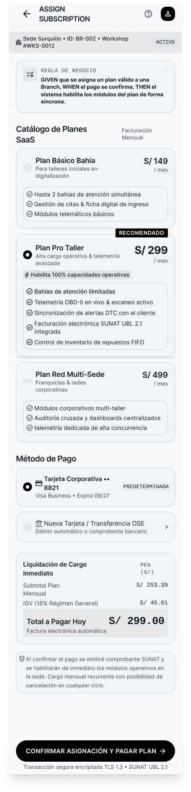 
      <small><b>Figura 78.</b> Paso 3: Asignación y Cambio de Plan SaaS (US007)</small>
    </td>
    <td align="center" style="border: none; padding: 6px; vertical-align: top; width: 14%;">
      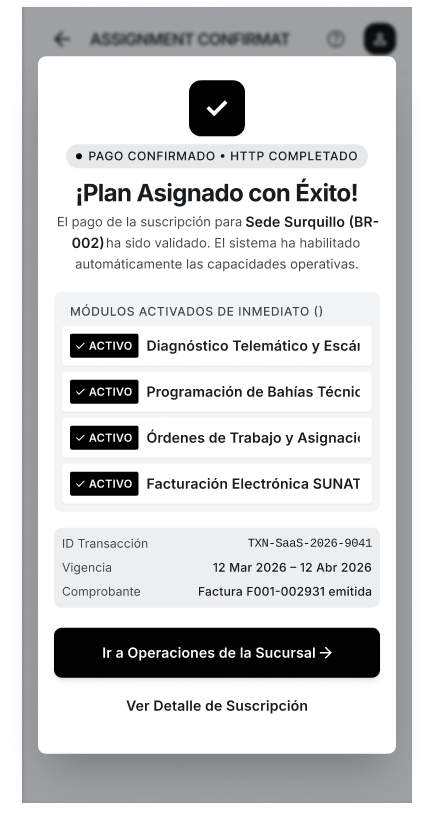 
      <small><b>Figura 79.</b> Paso 4: Activación Exitosa de Módulos Telemáticos (US007)</small>
    </td>
    <td align="center" style="border: none; padding: 6px; vertical-align: top; width: 14%;">
      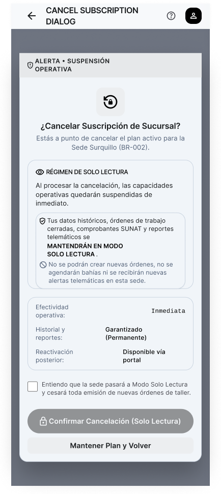 
      <small><b>Figura 80.</b> Paso 5: Cancelación de Plan y Modo Solo Lectura (US007)</small>
    </td>
    <td align="center" style="border: none; padding: 6px; vertical-align: top; width: 14%;">
      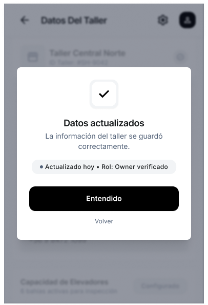 
      <small><b>Figura 81.</b> Paso 6: Confirmación de Actualización de Datos del Taller (US006)</small>
    </td>
    <td align="center" style="border: none; padding: 6px; vertical-align: top; width: 14%;">
      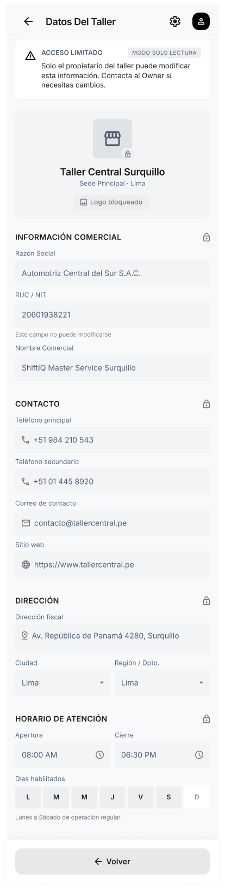 
      <small><b>Figura 82.</b> Paso 7: Ficha de Taller en Modo Solo Lectura (US006)</small>
    </td>
  </tr>
</table>

**Detalle analítico de la secuencia de wireframes:**
- **Paso 1 (Detalle y Capacidad Operativa de Sucursal - US006):** Información operativa de la sede: dirección, teléfono, cantidad de elevadores habilitados y mapa de ubicación.
- **Paso 2 (Administración de Suscripción por Sucursal - US007):** Panel de control del plan contratado (Profesional / Enterprise), fecha de renovación y estado de facturación SaaS.
- **Paso 3 (Asignación y Cambio de Plan SaaS - US007):** Selector comparativo de planes comerciales con detalle de bahías permitidas y módulos habilitados.
- **Paso 4 (Activación Exitosa de Módulos Telemáticos - US007):** Modal de confirmación tras habilitar funciones avanzadas de telemetría OBD-II y diagnósticos automotrices.
- **Paso 5 (Cancelación de Plan y Modo Solo Lectura - US007):** Pantalla informativa ante expiración de suscripción limitando las acciones a consulta histórica sin nuevas OTs.
- **Paso 6 (Confirmación de Actualización de Datos del Taller - US006):** Confirmación exitosa tras la edición de datos fiscales y horarios de atención de la sede.
- **Paso 7 (Ficha de Taller en Modo Solo Lectura - US006):** Visualización restringida de datos corporativos de la sucursal para roles sin permisos de edición.

#### Módulo 3: Inteligencia Vehicular y Diagnóstico OBD-II (Vehicle Intelligence & Diagnostics) - Secuencias de Wireframes
*Historias de Usuario cubiertas: US017, US018, US019, US020, US021, US023, US025*

##### Flujo 3.1: Enrolamiento de Vehículo y Ficha Telemática

Ingreso de la unidad vehicular al ecosistema de monitoreo conectada a su hardware OBD-II. Tal como se observa en la secuencia interactiva de las **Figuras 83 a 84**, el flujo operativo del módulo guía al usuario paso a paso a través de las siguientes pantallas consecutivas:

<table align="center" style="border: none; border-collapse: collapse; margin: 16px auto; width: 100%;">
  <tr style="border: none;">
    <td align="center" style="border: none; padding: 6px; vertical-align: top; width: 50%;">
      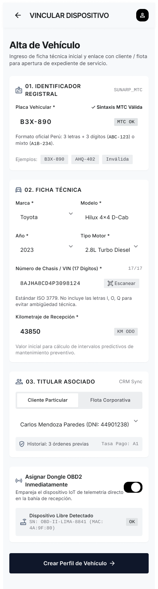 
      <small><b>Figura 83.</b> Paso 1: Registro de Vehículo en Taller (US017)</small>
    </td>
    <td align="center" style="border: none; padding: 6px; vertical-align: top; width: 50%;">
      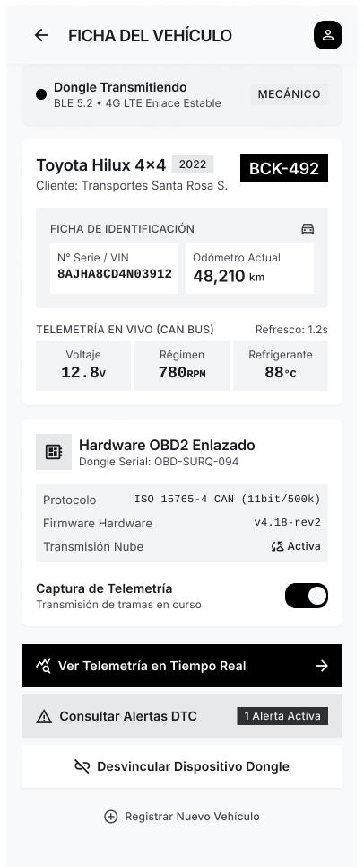 
      <small><b>Figura 84.</b> Paso 2: Ficha del Vehículo y Estado OBD-II (US017)</small>
    </td>
  </tr>
</table>

**Detalle analítico de la secuencia de wireframes:**
- **Paso 1 (Registro de Vehículo en Taller - US017):** Formulario de ingreso vehicular con captura de placa peruana, marca, modelo, año, VIN y kilometraje de recepción.
- **Paso 2 (Ficha del Vehículo y Estado OBD-II - US017):** Hoja de vida digital del automóvil con historial de visitas técnicas y estado de enlace del dongle telemático.

##### Flujo 3.2: Vinculación y Gestión de Dongles OBD-II Bluetooth

Enlace inalámbrico por Bluetooth BLE con escáneres OBD-II de taller. Tal como se observa en la secuencia interactiva de las **Figuras 85 a 90**, el flujo operativo del módulo guía al usuario paso a paso a través de las siguientes pantallas consecutivas:

<table align="center" style="border: none; border-collapse: collapse; margin: 16px auto; width: 100%;">
  <tr style="border: none;">
    <td align="center" style="border: none; padding: 6px; vertical-align: top; width: 16%;">
      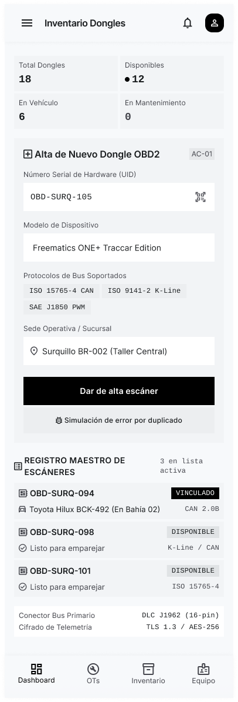 
      <small><b>Figura 85.</b> Paso 1: Inventario y Registro de Dongles OBD-II (US021)</small>
    </td>
    <td align="center" style="border: none; padding: 6px; vertical-align: top; width: 16%;">
      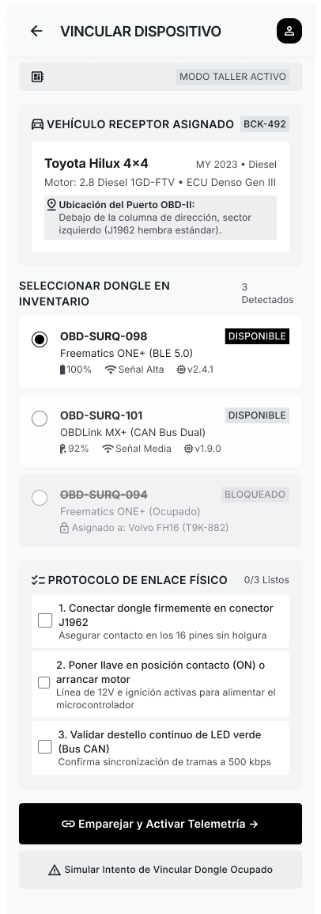 
      <small><b>Figura 86.</b> Paso 2: Búsqueda y Vinculación de Dongle OBD-II (US018)</small>
    </td>
    <td align="center" style="border: none; padding: 6px; vertical-align: top; width: 16%;">
      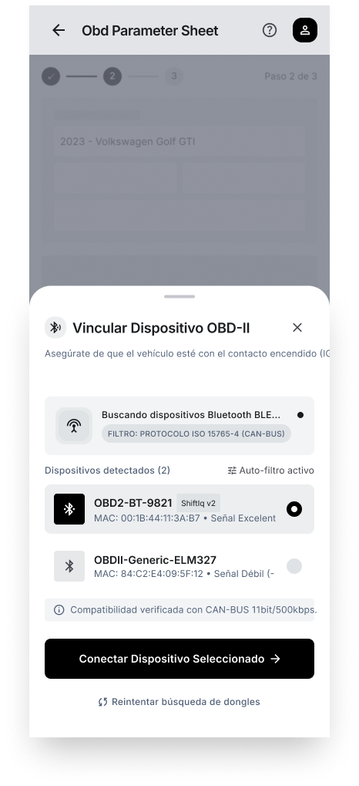 
      <small><b>Figura 87.</b> Paso 3: Panel Inferior (Bottom Sheet) de Vinculación (US018)</small>
    </td>
    <td align="center" style="border: none; padding: 6px; vertical-align: top; width: 16%;">
      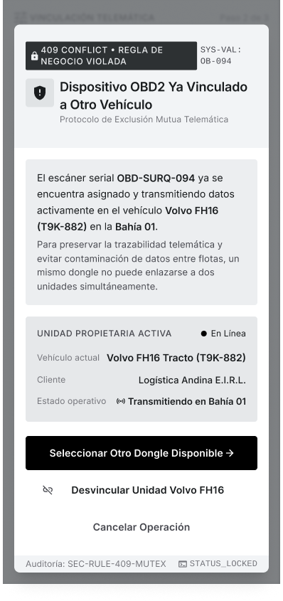 
      <small><b>Figura 88.</b> Paso 4: Aviso de Dispositivo OBD-II Ya Vinculado (US018)</small>
    </td>
    <td align="center" style="border: none; padding: 6px; vertical-align: top; width: 16%;">
      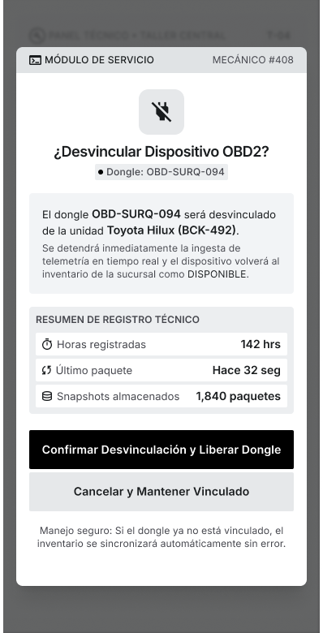 
      <small><b>Figura 89.</b> Paso 5: Confirmar Desvinculación de Escáner (US020)</small>
    </td>
    <td align="center" style="border: none; padding: 6px; vertical-align: top; width: 16%;">
      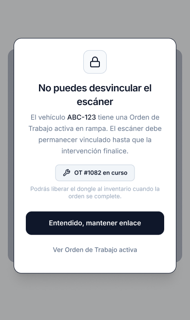 
      <small><b>Figura 90.</b> Paso 6: Error al Desvincular Escáner OBD-II (US020)</small>
    </td>
  </tr>
</table>

**Detalle analítico de la secuencia de wireframes:**
- **Paso 1 (Inventario y Registro de Dongles OBD-II - US021):** Control de escáneres propiedad del taller con número de serie, versión de firmware y asignación a bahías.
- **Paso 2 (Búsqueda y Vinculación de Dongle OBD-II - US018):** Escaneo de dispositivos Bluetooth BLE cercanos con intensidad de señal RSSI y botón de enlace directo.
- **Paso 3 (Panel Inferior (Bottom Sheet) de Vinculación - US018):** Modal contextual deslizable con instrucciones de conexión al puerto OBD-II y confirmación de handshake.
- **Paso 4 (Aviso de Dispositivo OBD-II Ya Vinculado - US018):** Alerta informativa cuando el escáner seleccionado ya se encuentra enlazado a otra orden de trabajo activa.
- **Paso 5 (Confirmar Desvinculación de Escáner - US020):** Diálogo de confirmación para liberar el dispositivo Bluetooth al finalizar el diagnóstico del automóvil.
- **Paso 6 (Error al Desvincular Escáner OBD-II - US020):** Retroalimentación de fallo por pérdida repentina de conexión BLE o proceso de lectura telemática en ejecución.

##### Flujo 3.3: Telemetría en Vivo, Cola de Sincronización y Modo Offline

Captura continua de datos de sensores automotrices y tolerancia a fallos de conectividad. Tal como se observa en la secuencia interactiva de las **Figuras 91 a 93**, el flujo operativo del módulo guía al usuario paso a paso a través de las siguientes pantallas consecutivas:

<table align="center" style="border: none; border-collapse: collapse; margin: 16px auto; width: 100%;">
  <tr style="border: none;">
    <td align="center" style="border: none; padding: 6px; vertical-align: top; width: 33%;">
      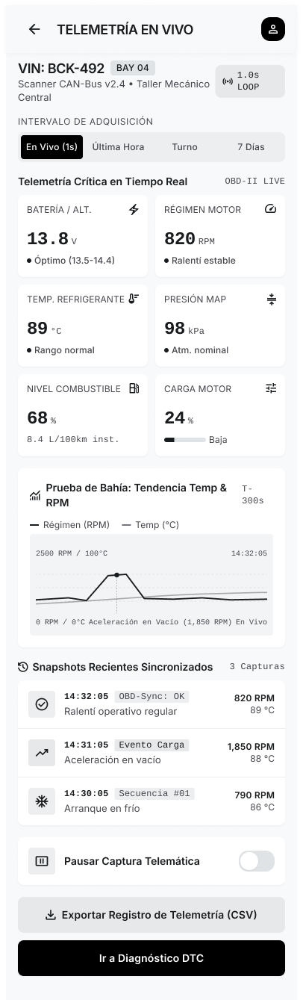 
      <small><b>Figura 91.</b> Paso 1: Telemetría en Vivo de Sensores Automotrices (US019)</small>
    </td>
    <td align="center" style="border: none; padding: 6px; vertical-align: top; width: 33%;">
      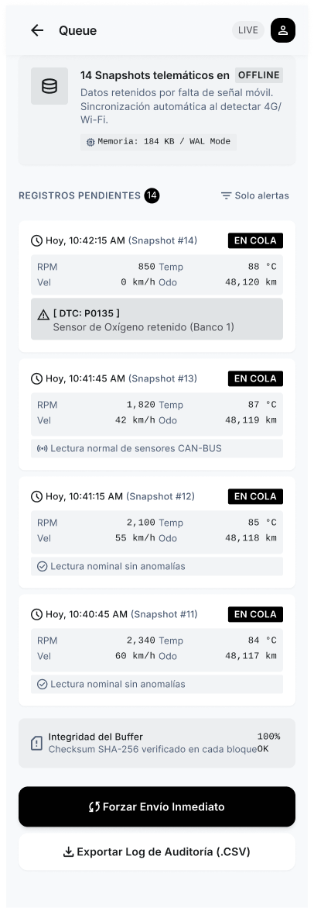 
      <small><b>Figura 92.</b> Paso 2: Gestión de Cola de Telemetría en Buffer (US025)</small>
    </td>
    <td align="center" style="border: none; padding: 6px; vertical-align: top; width: 33%;">
      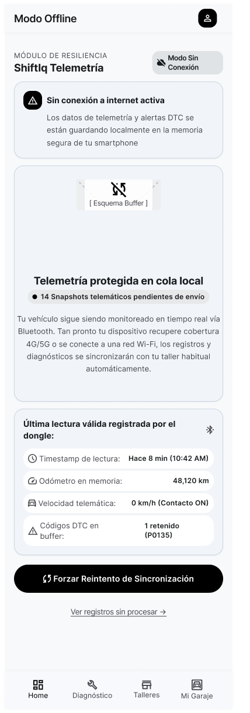 
      <small><b>Figura 93.</b> Paso 3: Modo Offline y Telemetría Autónoma (US025)</small>
    </td>
  </tr>
</table>

**Detalle analítico de la secuencia de wireframes:**
- **Paso 1 (Telemetría en Vivo de Sensores Automotrices - US019):** Tacómetros en tiempo real para RPM de motor, velocidad km/h, temperatura del refrigerante y voltaje de alternador.
- **Paso 2 (Gestión de Cola de Telemetría en Buffer - US025):** Monitor de eventos almacenados localmente en SQLite listos para sincronización con la API central.
- **Paso 3 (Modo Offline y Telemetría Autónoma - US025):** Indicador de operación sin conexión a internet manteniendo la captura continua de sensores en memoria local.

##### Flujo 3.4: Escaneo Electrónico de ECUs y Diagnóstico de Fallas DTC

Barrido integral de subsistemas automotrices y traducción didáctica de códigos SAE. Tal como se observa en la secuencia interactiva de las **Figuras 94 a 99**, el flujo operativo del módulo guía al usuario paso a paso a través de las siguientes pantallas consecutivas:

<table align="center" style="border: none; border-collapse: collapse; margin: 16px auto; width: 100%;">
  <tr style="border: none;">
    <td align="center" style="border: none; padding: 6px; vertical-align: top; width: 16%;">
      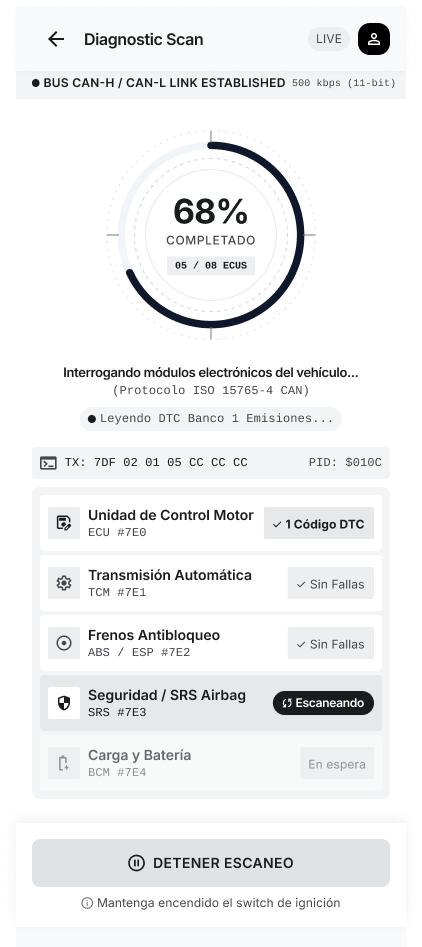 
      <small><b>Figura 94.</b> Paso 1: Escaneo OBD-II de ECUs en Curso (US023)</small>
    </td>
    <td align="center" style="border: none; padding: 6px; vertical-align: top; width: 16%;">
      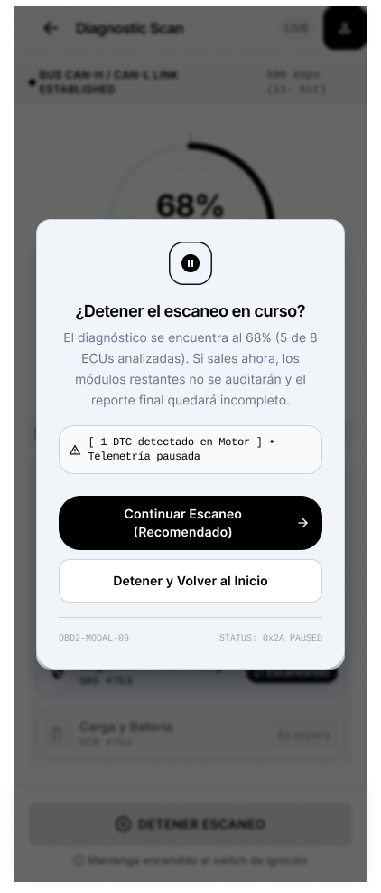 
      <small><b>Figura 95.</b> Paso 2: Interrupción Controlada del Escaneo (US023)</small>
    </td>
    <td align="center" style="border: none; padding: 6px; vertical-align: top; width: 16%;">
       
      <small><b>Figura 96.</b> Paso 3: Consulta de Códigos de Falla DTC Detectados (US023)</small>
    </td>
    <td align="center" style="border: none; padding: 6px; vertical-align: top; width: 16%;">
      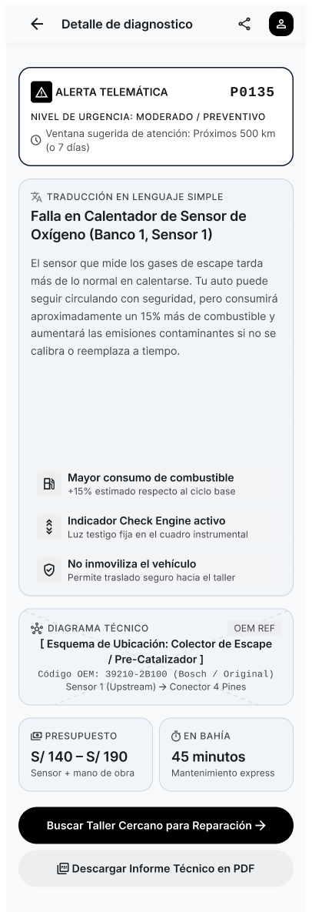 
      <small><b>Figura 97.</b> Paso 4: Detalle DTC con Traducción Simple y Solución (US023)</small>
    </td>
    <td align="center" style="border: none; padding: 6px; vertical-align: top; width: 16%;">
      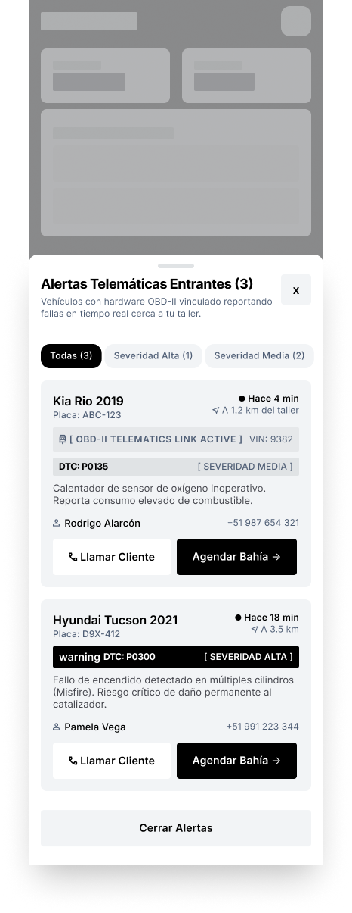 
      <small><b>Figura 98.</b> Paso 5: Modal de Alertas Telemáticas Entrantes (US023)</small>
    </td>
    <td align="center" style="border: none; padding: 6px; vertical-align: top; width: 16%;">
      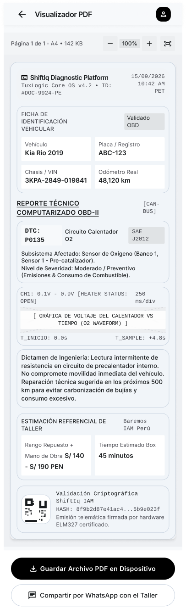 
      <small><b>Figura 99.</b> Paso 6: Visor de Reporte de Diagnóstico Técnico en PDF (US023)</small>
    </td>
  </tr>
</table>

**Detalle analítico de la secuencia de wireframes:**
- **Paso 1 (Escaneo OBD-II de ECUs en Curso - US023):** Barra de progreso animada con sondeo por subsistemas: Motor, Transmisión, Frenos ABS y Módulo de Emisiones.
- **Paso 2 (Interrupción Controlada del Escaneo - US023):** Modal de cancelación segura del sondeo telemático preservando las fallas leídas hasta el momento.
- **Paso 3 (Consulta de Códigos de Falla DTC Detectados - US023):** Listado de códigos estándar SAE (P0135, P0300) con categorización cromática por severidad crítica o preventiva.
- **Paso 4 (Detalle DTC con Traducción Simple y Solución - US023):** Explicación en lenguaje cotidiano del síntoma mecánico, causa probable y sugerencia técnica de reparación.
- **Paso 5 (Modal de Alertas Telemáticas Entrantes - US023):** Notificación emergente en el taller ante fallas críticas transmitidas por vehículos en circulación.
- **Paso 6 (Visor de Reporte de Diagnóstico Técnico en PDF - US023):** Visualizador integrado del informe telemático con firmas digitales, lecturas de sensores y fallas DTC listo para exportar.

#### Módulo 4: Flotas y Agenda de Citas Técnicas (Fleet & Appointments) - Secuencias de Wireframes
*Historias de Usuario cubiertas: US026, US028, US029, US030, US031, US032*

##### Flujo 4.1: Agenda de Citas Técnicas y Reserva de Bahías

Planificación de ingresos vehiculares según disponibilidad horaria y capacidad de elevadores mecánicos. Tal como se observa en la secuencia interactiva de las **Figuras 100 a 106**, el flujo operativo del módulo guía al usuario paso a paso a través de las siguientes pantallas consecutivas:

<table align="center" style="border: none; border-collapse: collapse; margin: 16px auto; width: 100%;">
  <tr style="border: none;">
    <td align="center" style="border: none; padding: 6px; vertical-align: top; width: 14%;">
      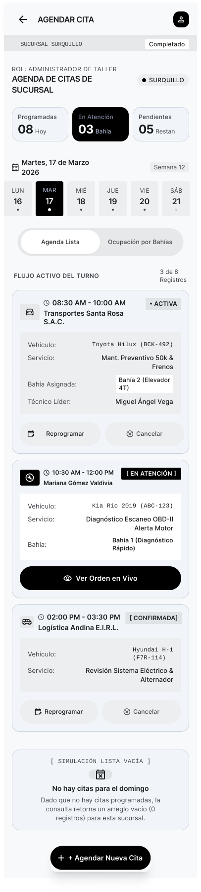 
      <small><b>Figura 100.</b> Paso 1: Agenda de Citas de Sucursal (US029)</small>
    </td>
    <td align="center" style="border: none; padding: 6px; vertical-align: top; width: 14%;">
       
      <small><b>Figura 101.</b> Paso 2: Asignación de Bahía y Elevador Técnico (US028)</small>
    </td>
    <td align="center" style="border: none; padding: 6px; vertical-align: top; width: 14%;">
      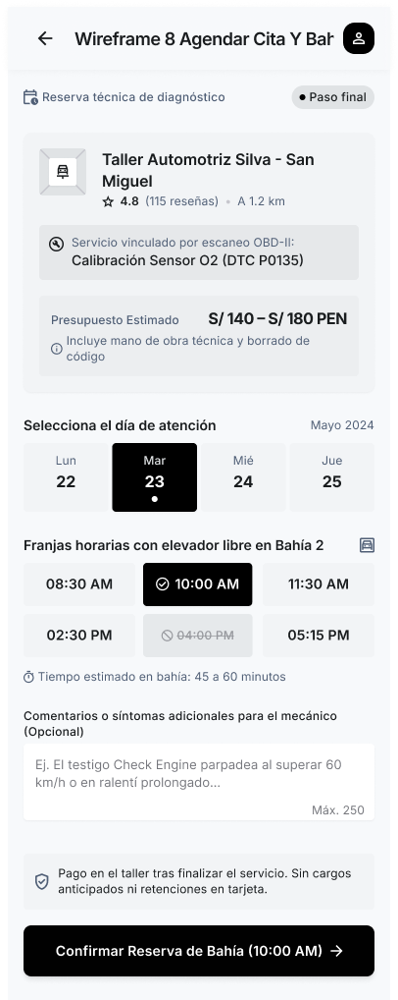 
      <small><b>Figura 102.</b> Paso 3: Formulario Completo de Agendamiento (US028)</small>
    </td>
    <td align="center" style="border: none; padding: 6px; vertical-align: top; width: 14%;">
      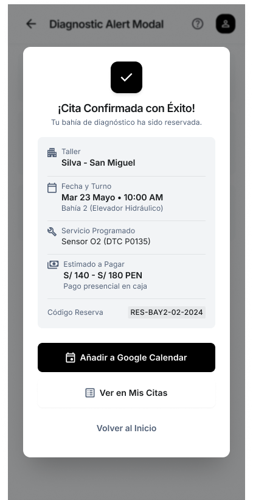 
      <small><b>Figura 103.</b> Paso 4: Diálogo de Confirmación de Cita (US028)</small>
    </td>
    <td align="center" style="border: none; padding: 6px; vertical-align: top; width: 14%;">
      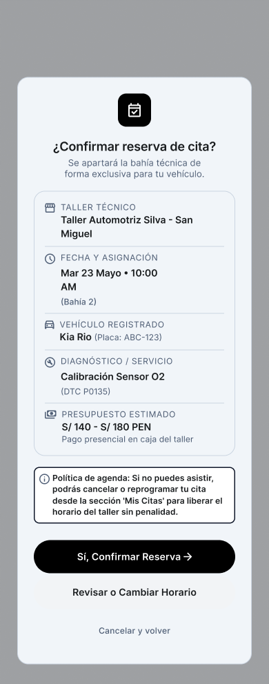 
      <small><b>Figura 104.</b> Paso 5: Pantalla de Cita Confirmada con Éxito (US028)</small>
    </td>
    <td align="center" style="border: none; padding: 6px; vertical-align: top; width: 14%;">
      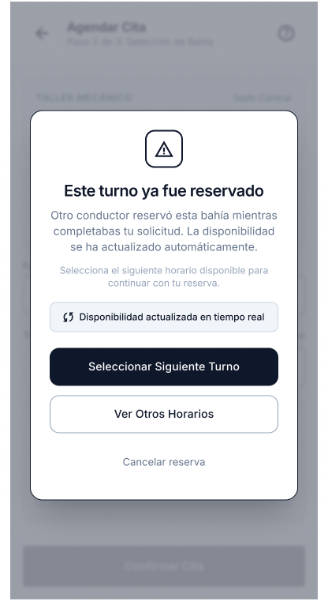 
      <small><b>Figura 105.</b> Paso 6: Conflicto de Horario o Bahía Ocupada (US028)</small>
    </td>
    <td align="center" style="border: none; padding: 6px; vertical-align: top; width: 14%;">
      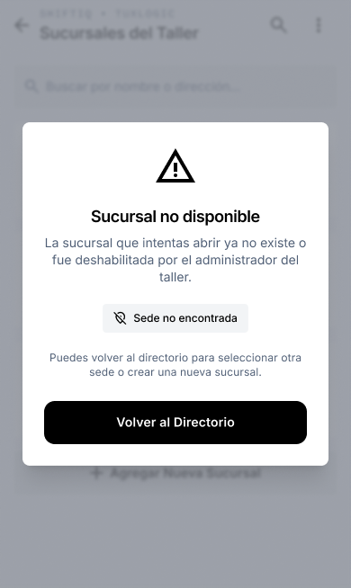 
      <small><b>Figura 106.</b> Paso 7: Sucursal Fuera de Capacidad o Inactiva (US028)</small>
    </td>
  </tr>
</table>

**Detalle analítico de la secuencia de wireframes:**
- **Paso 1 (Agenda de Citas de Sucursal - US029):** Vista de calendario interactivo por día y semana con turnos ocupados, pendientes de confirmación y libres.
- **Paso 2 (Asignación de Bahía y Elevador Técnico - US028):** Selector de bahía física específica (Elevador 1, Fosa de Alineación) con horario estimado de ocupación.
- **Paso 3 (Formulario Completo de Agendamiento - US028):** Registro de cliente, vehículo, motivo de visita técnica, bahía asignada y duración aproximada del trabajo.
- **Paso 4 (Diálogo de Confirmación de Cita - US028):** Modal de resumen con código de reserva, hora acordada y recordatorio automático programado vía WhatsApp/SMS.
- **Paso 5 (Pantalla de Cita Confirmada con Éxito - US028):** Voucher digital de reserva con botones para añadir al calendario del dispositivo y compartir con el cliente.
- **Paso 6 (Conflicto de Horario o Bahía Ocupada - US028):** Alerta de colisión de turnos sugiriendo inmediatamente los siguientes bloques horarios disponibles en la misma sede.
- **Paso 7 (Sucursal Fuera de Capacidad o Inactiva - US028):** Aviso de mantenimiento de planta o saturación de capacidad operativa en la sede seleccionada.

##### Flujo 4.2: Reprogramación y Cancelación de Citas

Gestión de modificaciones y anulaciones de turnos de servicio. Tal como se observa en la secuencia interactiva de las **Figuras 107 a 109**, el flujo operativo del módulo guía al usuario paso a paso a través de las siguientes pantallas consecutivas:

<table align="center" style="border: none; border-collapse: collapse; margin: 16px auto; width: 100%;">
  <tr style="border: none;">
    <td align="center" style="border: none; padding: 6px; vertical-align: top; width: 33%;">
      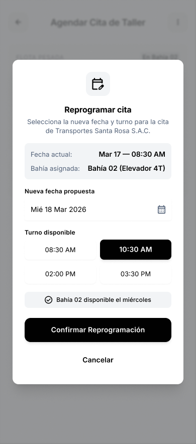 
      <small><b>Figura 107.</b> Paso 1: Reprogramación de Cita de Taller (US030)</small>
    </td>
    <td align="center" style="border: none; padding: 6px; vertical-align: top; width: 33%;">
       
      <small><b>Figura 108.</b> Paso 2: Cancelación de Cita con Registro de Causa (US030)</small>
    </td>
    <td align="center" style="border: none; padding: 6px; vertical-align: top; width: 33%;">
      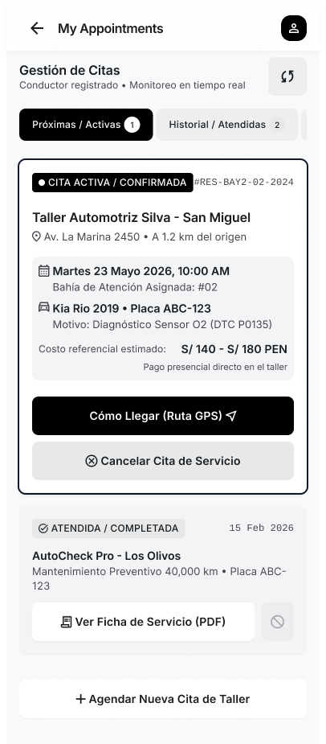 
      <small><b>Figura 109.</b> Paso 3: Historial de Citas y Estado de Cancelación (US030)</small>
    </td>
  </tr>
</table>

**Detalle analítico de la secuencia de wireframes:**
- **Paso 1 (Reprogramación de Cita de Taller - US030):** Selector interactivo de nueva fecha y franja horaria manteniendo los datos previos del vehículo.
- **Paso 2 (Cancelación de Cita con Registro de Causa - US030):** Diálogo de anulación con lista de motivos predefinidos para control estadístico de pérdidas de turno.
- **Paso 3 (Historial de Citas y Estado de Cancelación - US030):** Listado con estados cromáticos de citas: Programada, En Curso, Completada o Cancelada.

##### Flujo 4.3: Directorio de Clientes Corporativos y Flotas

Gestión de empresas con múltiples unidades vehiculares y conductores asignados. Tal como se observa en la secuencia interactiva de las **Figuras 110 a 119**, el flujo operativo del módulo guía al usuario paso a paso a través de las siguientes pantallas consecutivas:

<table align="center" style="border: none; border-collapse: collapse; margin: 16px auto; width: 100%;">
  <tr style="border: none;">
    <td align="center" style="border: none; padding: 6px; vertical-align: top; width: 10%;">
       
      <small><b>Figura 110.</b> Paso 1: Directorio de Clientes y Flotas (US032)</small>
    </td>
    <td align="center" style="border: none; padding: 6px; vertical-align: top; width: 10%;">
       
      <small><b>Figura 111.</b> Paso 2: Formulario de Alta de Cliente o Flota (US032)</small>
    </td>
    <td align="center" style="border: none; padding: 6px; vertical-align: top; width: 10%;">
      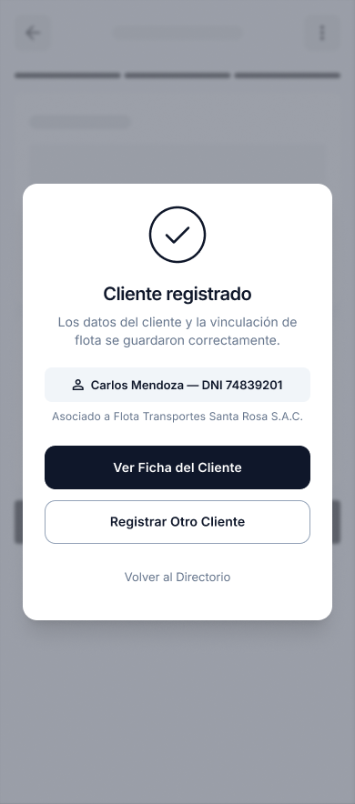 
      <small><b>Figura 112.</b> Paso 3: Confirmación de Cliente Registrado (US032)</small>
    </td>
    <td align="center" style="border: none; padding: 6px; vertical-align: top; width: 10%;">
      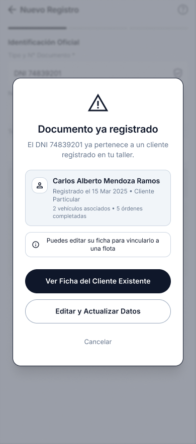 
      <small><b>Figura 113.</b> Paso 4: Error por RUC o Documento Duplicado (US032)</small>
    </td>
    <td align="center" style="border: none; padding: 6px; vertical-align: top; width: 10%;">
      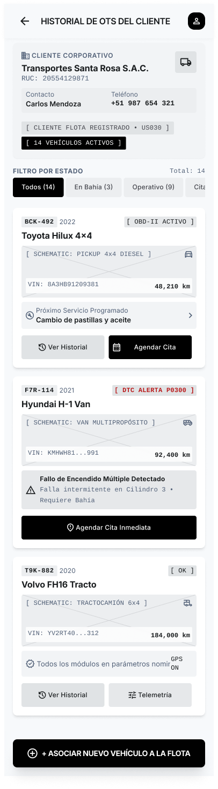 
      <small><b>Figura 114.</b> Paso 5: Padrón de Vehículos de la Flota (US026)</small>
    </td>
    <td align="center" style="border: none; padding: 6px; vertical-align: top; width: 10%;">
      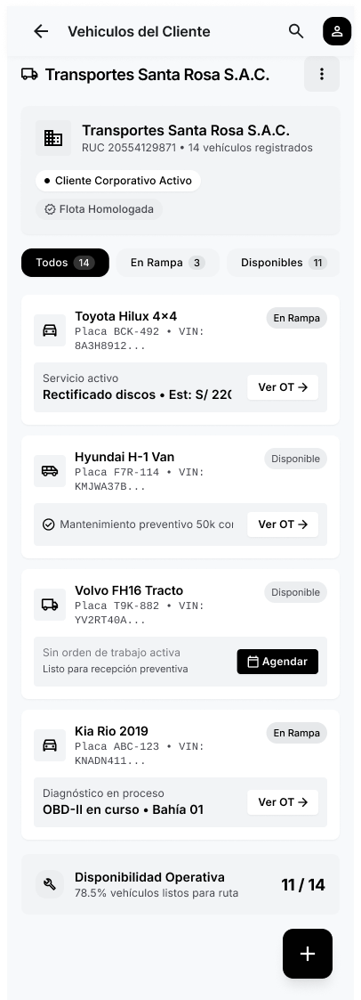 
      <small><b>Figura 115.</b> Paso 6: Listado de Vehículos del Cliente (US026)</small>
    </td>
    <td align="center" style="border: none; padding: 6px; vertical-align: top; width: 10%;">
      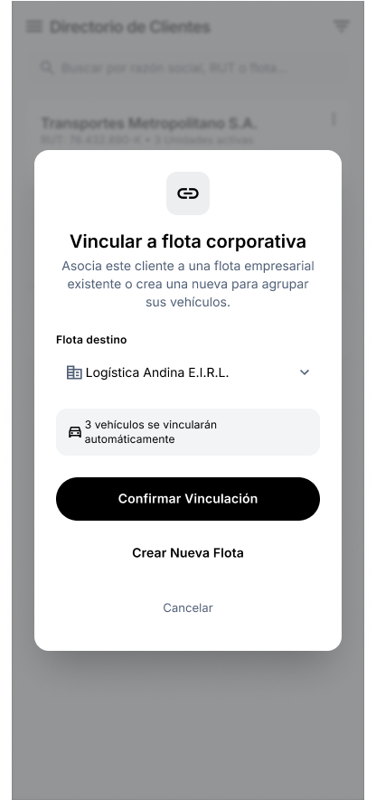 
      <small><b>Figura 116.</b> Paso 7: Asociación de Unidad a Flota Corporativa (US026)</small>
    </td>
    <td align="center" style="border: none; padding: 6px; vertical-align: top; width: 10%;">
      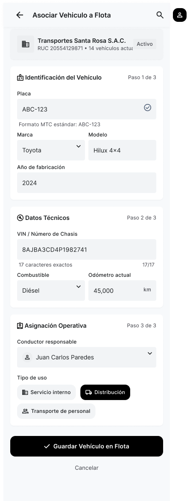 
      <small><b>Figura 117.</b> Paso 8: Confirmación de Vehículo Asociado a Flota (US026)</small>
    </td>
    <td align="center" style="border: none; padding: 6px; vertical-align: top; width: 10%;">
      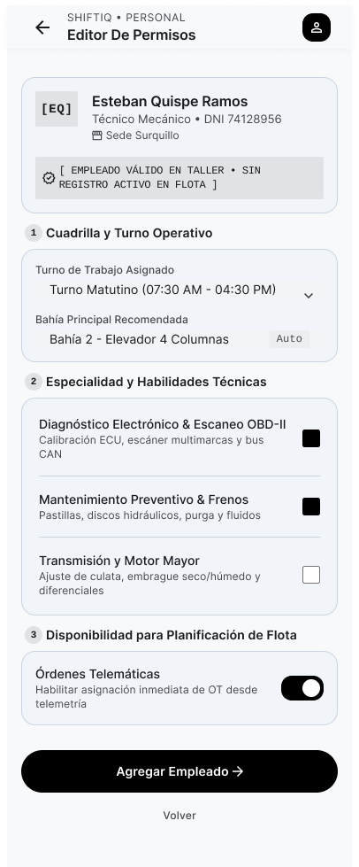 
      <small><b>Figura 118.</b> Paso 9: Registro de Conductor / Empleado en Flota (US031)</small>
    </td>
    <td align="center" style="border: none; padding: 6px; vertical-align: top; width: 10%;">
      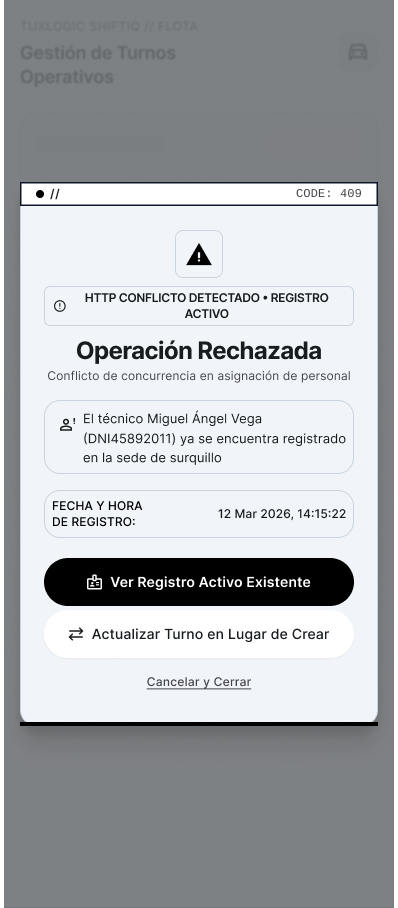 
      <small><b>Figura 119.</b> Paso 10: Conflicto por Conductor Activo en Otra Unidad (US031)</small>
    </td>
  </tr>
</table>

**Detalle analítico de la secuencia de wireframes:**
- **Paso 1 (Directorio de Clientes y Flotas - US032):** Directorio empresarial con buscador por razón social, cantidad de vehículos y estado de cuenta corriente.
- **Paso 2 (Formulario de Alta de Cliente o Flota - US032):** Registro de datos tributarios, contacto comercial, tipo de tarifa preferencial y límite crediticio.
- **Paso 3 (Confirmación de Cliente Registrado - US032):** Modal de confirmación de registro corporativo con botón para comenzar a afiliar sus unidades.
- **Paso 4 (Error por RUC o Documento Duplicado - US032):** Validación de unicidad fiscal impidiendo la duplicidad de registros corporativos en el sistema.
- **Paso 5 (Padrón de Vehículos de la Flota - US026):** Grilla de unidades de la empresa con indicador del estado mecánico de cada una y última inspección.
- **Paso 6 (Listado de Vehículos del Cliente - US026):** Ficha con los vehículos individuales asociados a una misma cuenta corporativa o particular.
- **Paso 7 (Asociación de Unidad a Flota Corporativa - US026):** Vinculación de automóvil por placa y kilometraje al grupo administrativo de la empresa.
- **Paso 8 (Confirmación de Vehículo Asociado a Flota - US026):** Resumen de afiliación de la unidad asignándole centro de costo y política de mantenimiento preventivo.
- **Paso 9 (Registro de Conductor / Empleado en Flota - US031):** Asignación de chófer responsable a una unidad específica de la flota empresarial.
- **Paso 10 (Conflicto por Conductor Activo en Otra Unidad - US031):** Bloqueo de seguridad cuando el conductor ya tiene una asignación activa en otra unidad sin desvincular.

#### Módulo 5: Inventario y Control de Repuestos FIFO (Parts & Inventory) - Secuencias de Wireframes
*Historias de Usuario cubiertas: US008, US009, US010*

##### Flujo 5.1: Catálogo General y Ficha de Repuesto

Exploración de piezas, repuestos, fluidos y componentes con niveles de stock por sede. Tal como se observa en la secuencia interactiva de las **Figuras 120 a 121**, el flujo operativo del módulo guía al usuario paso a paso a través de las siguientes pantallas consecutivas:

<table align="center" style="border: none; border-collapse: collapse; margin: 16px auto; width: 100%;">
  <tr style="border: none;">
    <td align="center" style="border: none; padding: 6px; vertical-align: top; width: 50%;">
       
      <small><b>Figura 120.</b> Paso 1: Catálogo General de Inventario (US008)</small>
    </td>
    <td align="center" style="border: none; padding: 6px; vertical-align: top; width: 50%;">
      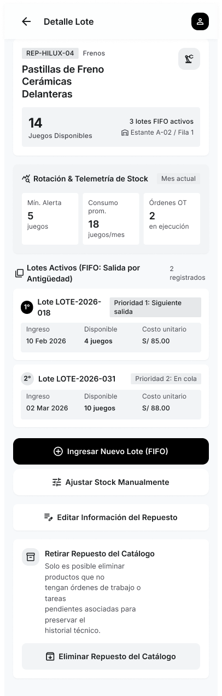 
      <small><b>Figura 121.</b> Paso 2: Ficha Técnica y Detalle de Repuesto (US008)</small>
    </td>
  </tr>
</table>

**Detalle analítico de la secuencia de wireframes:**
- **Paso 1 (Catálogo General de Inventario - US008):** Buscador de piezas con filtros por categoría (Filtros, Frenos, Aceites, Suspensión), stock mínimo y SKU.
- **Paso 2 (Ficha Técnica y Detalle de Repuesto - US008):** Especificaciones del fabricante, compatibilidad vehicular, ubicación física en almacén y precio sugerido.

##### Flujo 5.2: Alta de Repuesto y Detección de SKU Duplicado

Incorporación de nuevas piezas al maestro de almacén con controles de unicidad. Tal como se observa en la secuencia interactiva de las **Figuras 122 a 124**, el flujo operativo del módulo guía al usuario paso a paso a través de las siguientes pantallas consecutivas:

<table align="center" style="border: none; border-collapse: collapse; margin: 16px auto; width: 100%;">
  <tr style="border: none;">
    <td align="center" style="border: none; padding: 6px; vertical-align: top; width: 33%;">
       
      <small><b>Figura 122.</b> Paso 1: Alta de Nuevo Repuesto en Catálogo (US008)</small>
    </td>
    <td align="center" style="border: none; padding: 6px; vertical-align: top; width: 33%;">
      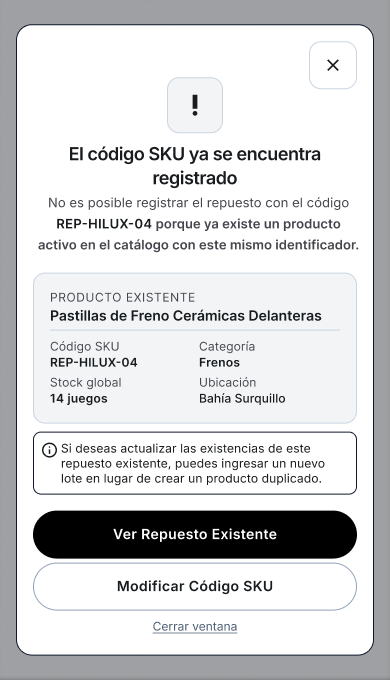 
      <small><b>Figura 123.</b> Paso 2: Alerta por Código SKU Duplicado (US008)</small>
    </td>
    <td align="center" style="border: none; padding: 6px; vertical-align: top; width: 33%;">
      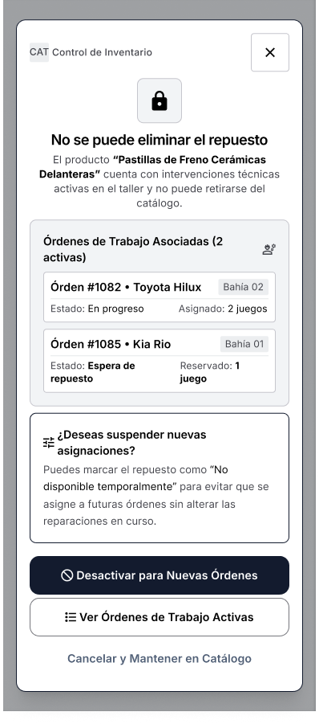 
      <small><b>Figura 124.</b> Paso 3: Bloqueo de Eliminación de Repuesto en Uso (US008)</small>
    </td>
  </tr>
</table>

**Detalle analítico de la secuencia de wireframes:**
- **Paso 1 (Alta de Nuevo Repuesto en Catálogo - US008):** Formulario para ingreso de descripción de la pieza, código OEM, SKU interno, unidad de medida y stock de seguridad.
- **Paso 2 (Alerta por Código SKU Duplicado - US008):** Advertencia reactiva bloqueando el guardado si el código de almacén ya existe en otra ficha de producto.
- **Paso 3 (Bloqueo de Eliminación de Repuesto en Uso - US008):** Restricción de integridad impidiendo eliminar piezas con órdenes de trabajo activas o saldo en stock.

##### Flujo 5.3: Ingreso de Lotes FIFO, Ajuste de Existencias y Restricciones

Costeo automatizado First-In, First-Out y prevención de inconsistencias en inventario físico. Tal como se observa en la secuencia interactiva de las **Figuras 125 a 127**, el flujo operativo del módulo guía al usuario paso a paso a través de las siguientes pantallas consecutivas:

<table align="center" style="border: none; border-collapse: collapse; margin: 16px auto; width: 100%;">
  <tr style="border: none;">
    <td align="center" style="border: none; padding: 6px; vertical-align: top; width: 33%;">
      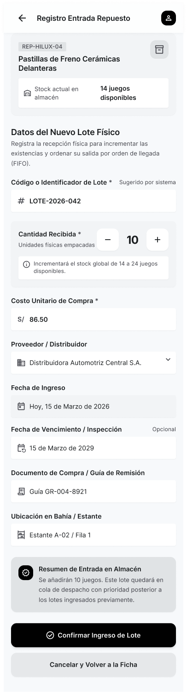 
      <small><b>Figura 125.</b> Paso 1: Ingreso de Lote de Repuestos (FIFO) (US009)</small>
    </td>
    <td align="center" style="border: none; padding: 6px; vertical-align: top; width: 33%;">
       
      <small><b>Figura 126.</b> Paso 2: Ajuste Manual de Existencias por Auditoría (US010)</small>
    </td>
    <td align="center" style="border: none; padding: 6px; vertical-align: top; width: 33%;">
       
      <small><b>Figura 127.</b> Paso 3: Bloqueo por Saldo de Stock Negativo no Permitido (US010)</small>
    </td>
  </tr>
</table>

**Detalle analítico de la secuencia de wireframes:**
- **Paso 1 (Ingreso de Lote de Repuestos (FIFO) - US009):** Registro de compra mayorista con fecha de ingreso, proveedor, costo unitario por lote y cantidad recibida.
- **Paso 2 (Ajuste Manual de Existencias por Auditoría - US010):** Modificación controlada de stock físico por rotura, merma o recuento con justificación documental obligatoria.
- **Paso 3 (Bloqueo por Saldo de Stock Negativo no Permitido - US010):** Validación de negocio estricta que impide despachar o dar de baja repuestos que no cuenten con existencia física.

#### Módulo 6: Operaciones de Taller y Órdenes de Trabajo (Work Orders & Execution) - Secuencias de Wireframes
*Historias de Usuario cubiertas: US011, US012, US013, US014, US015, US048, US049, US050*

##### Flujo 6.1: Catálogo Maestro de Servicios y Tarifario

Configuración de la oferta de mano de obra y servicios mecánicos del taller. Tal como se observa en la secuencia interactiva de las **Figuras 128 a 131**, el flujo operativo del módulo guía al usuario paso a paso a través de las siguientes pantallas consecutivas:

<table align="center" style="border: none; border-collapse: collapse; margin: 16px auto; width: 100%;">
  <tr style="border: none;">
    <td align="center" style="border: none; padding: 6px; vertical-align: top; width: 25%;">
      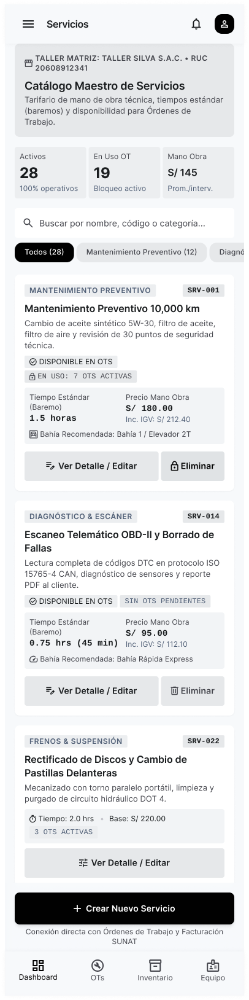 
      <small><b>Figura 128.</b> Paso 1: Catálogo Maestro de Servicios (US011)</small>
    </td>
    <td align="center" style="border: none; padding: 6px; vertical-align: top; width: 25%;">
      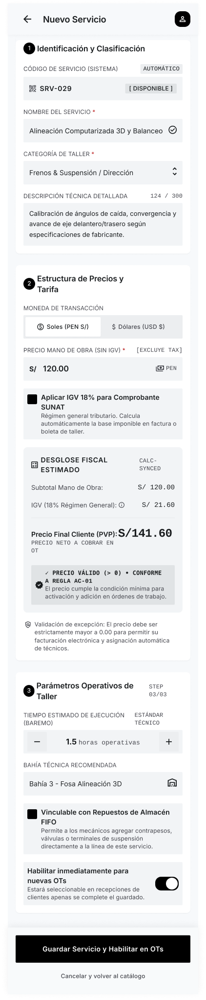 
      <small><b>Figura 129.</b> Paso 2: Creación de Servicio Técnico con Tarifa (US011)</small>
    </td>
    <td align="center" style="border: none; padding: 6px; vertical-align: top; width: 25%;">
      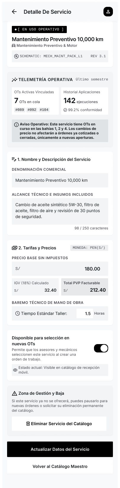 
      <small><b>Figura 130.</b> Paso 3: Ficha de Detalle y Edición de Servicio (US011)</small>
    </td>
    <td align="center" style="border: none; padding: 6px; vertical-align: top; width: 25%;">
      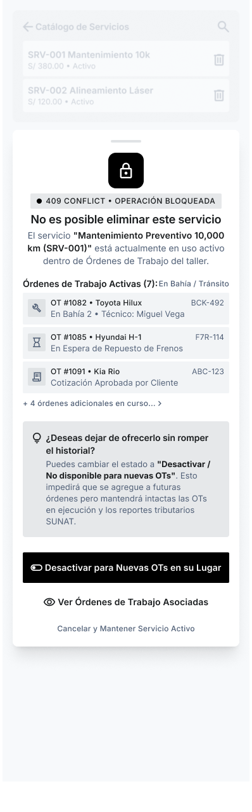 
      <small><b>Figura 131.</b> Paso 4: Bloqueo de Modificación por Servicio en Uso (US011)</small>
    </td>
  </tr>
</table>

**Detalle analítico de la secuencia de wireframes:**
- **Paso 1 (Catálogo Maestro de Servicios - US011):** Listado de servicios técnicos estandarizados con tarifa de mano de obra y tiempo promedio de ejecución.
- **Paso 2 (Creación de Servicio Técnico con Tarifa - US011):** Formulario para registrar nuevo servicio con validación de costo mayor a cero y asignación de categoría técnica.
- **Paso 3 (Ficha de Detalle y Edición de Servicio - US011):** Modificación de precios de mano de obra, descripción del protocolo de servicio y tiempo estimado en bahía.
- **Paso 4 (Bloqueo de Modificación por Servicio en Uso - US011):** Protección que impide modificar las tarifas de servicios que forman parte de órdenes de trabajo actualmente en curso.

##### Flujo 6.2: Tablero Kanban de Órdenes y Creación de OT

Gestión visual del flujo de trabajo de planta y apertura formal de expedientes mecánicos. Tal como se observa en la secuencia interactiva de las **Figuras 132 a 136**, el flujo operativo del módulo guía al usuario paso a paso a través de las siguientes pantallas consecutivas:

<table align="center" style="border: none; border-collapse: collapse; margin: 16px auto; width: 100%;">
  <tr style="border: none;">
    <td align="center" style="border: none; padding: 6px; vertical-align: top; width: 20%;">
      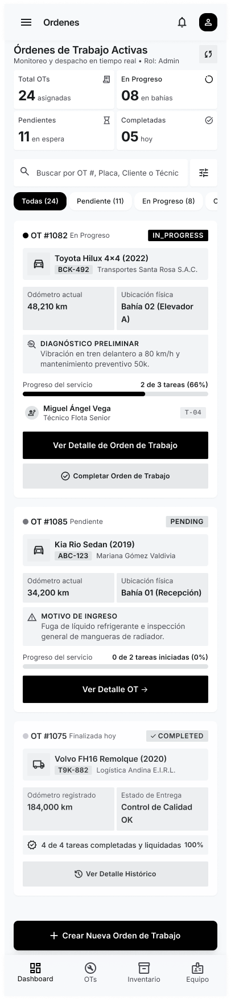 
      <small><b>Figura 132.</b> Paso 1: Tablero Kanban de Órdenes de Trabajo (US050)</small>
    </td>
    <td align="center" style="border: none; padding: 6px; vertical-align: top; width: 20%;">
      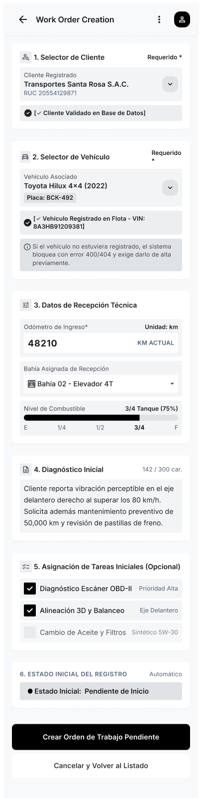 
      <small><b>Figura 133.</b> Paso 2: Apertura de Nueva Orden de Trabajo (US012)</small>
    </td>
    <td align="center" style="border: none; padding: 6px; vertical-align: top; width: 20%;">
      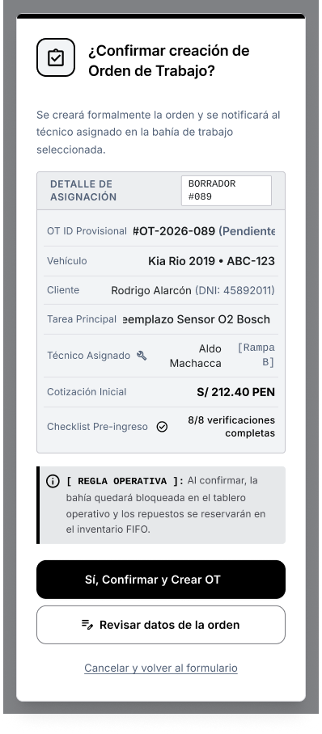 
      <small><b>Figura 134.</b> Paso 3: Modal de Confirmación de Creación de OT (US012)</small>
    </td>
    <td align="center" style="border: none; padding: 6px; vertical-align: top; width: 20%;">
      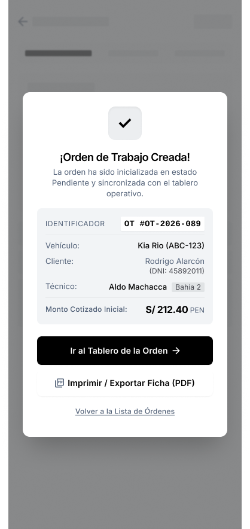 
      <small><b>Figura 135.</b> Paso 4: Confirmación de Orden Creada con Éxito (US012)</small>
    </td>
    <td align="center" style="border: none; padding: 6px; vertical-align: top; width: 20%;">
      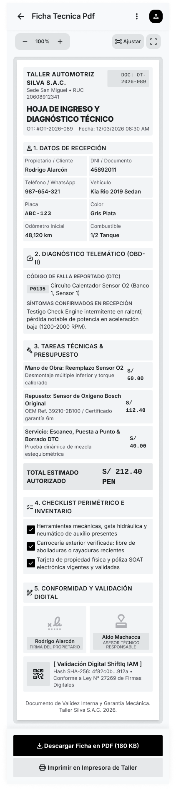 
      <small><b>Figura 136.</b> Paso 5: Ficha Técnica de Recepción e Ingreso en PDF (US012)</small>
    </td>
  </tr>
</table>

**Detalle analítico de la secuencia de wireframes:**
- **Paso 1 (Tablero Kanban de Órdenes de Trabajo - US050):** Tablero visual con columnas por estado: Recibido, Diagnóstico, En Proceso, Espera Repuestos y Listo para Entrega.
- **Paso 2 (Apertura de Nueva Orden de Trabajo - US012):** Registro de cliente, vehículo, kilometraje de entrada, nivel de combustible y checklist físico de recepción.
- **Paso 3 (Modal de Confirmación de Creación de OT - US012):** Revisión resumida de los datos de recepción antes de asentar la apertura definitiva de la orden en base de datos.
- **Paso 4 (Confirmación de Orden Creada con Éxito - US012):** Notificación de orden aperturada con asignación de número correlativo OT-2026-0042 y código QR de seguimiento.
- **Paso 5 (Ficha Técnica de Recepción e Ingreso en PDF - US012):** Comprobante formal impreso con inventario físico del vehículo firmado por el cliente al ingresar a planta.

##### Flujo 6.3: Asignación de Tareas, Mecánico y Consumo de Repuestos

Delegación técnica de actividades a los mecánicos de bahía y gestión de insumos requeridos. Tal como se observa en la secuencia interactiva de las **Figuras 137 a 144**, el flujo operativo del módulo guía al usuario paso a paso a través de las siguientes pantallas consecutivas:

<table align="center" style="border: none; border-collapse: collapse; margin: 16px auto; width: 100%;">
  <tr style="border: none;">
    <td align="center" style="border: none; padding: 6px; vertical-align: top; width: 12%;">
      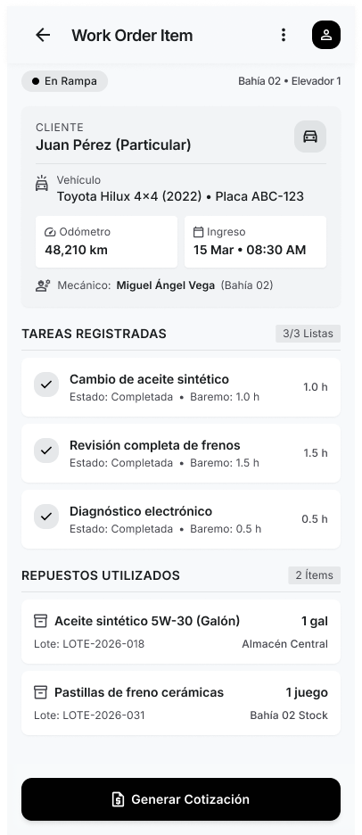 
      <small><b>Figura 137.</b> Paso 1: Ficha Integral de la Orden de Trabajo (US013)</small>
    </td>
    <td align="center" style="border: none; padding: 6px; vertical-align: top; width: 12%;">
      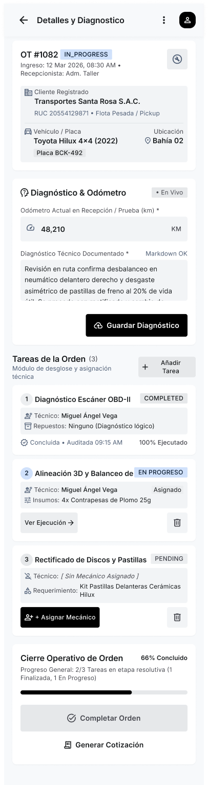 
      <small><b>Figura 138.</b> Paso 2: Registro de Diagnóstico Inicial Obligatorio (US013)</small>
    </td>
    <td align="center" style="border: none; padding: 6px; vertical-align: top; width: 12%;">
      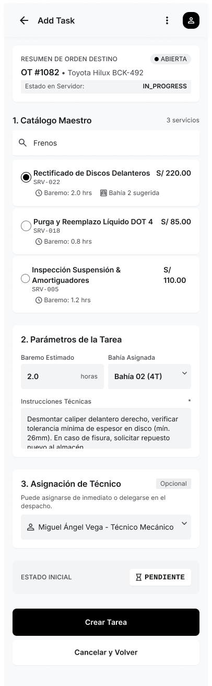 
      <small><b>Figura 139.</b> Paso 3: Agregar Tarea a la Orden de Trabajo (US048)</small>
    </td>
    <td align="center" style="border: none; padding: 6px; vertical-align: top; width: 12%;">
      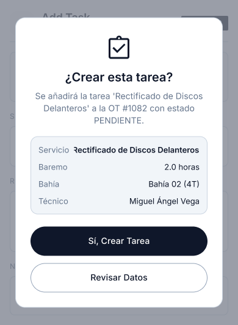 
      <small><b>Figura 140.</b> Paso 4: Confirmar Creación de Tarea Técnica (US048)</small>
    </td>
    <td align="center" style="border: none; padding: 6px; vertical-align: top; width: 12%;">
      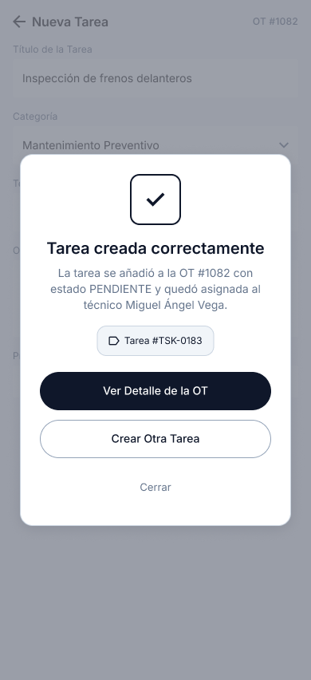 
      <small><b>Figura 141.</b> Paso 5: Confirmación de Tarea Creada (US048)</small>
    </td>
    <td align="center" style="border: none; padding: 6px; vertical-align: top; width: 12%;">
      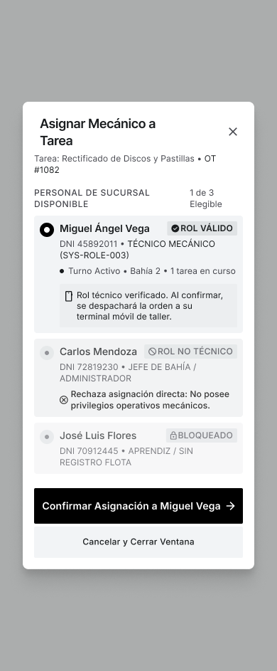 
      <small><b>Figura 142.</b> Paso 6: Asignación de Mecánico Responsable (US048)</small>
    </td>
    <td align="center" style="border: none; padding: 6px; vertical-align: top; width: 12%;">
      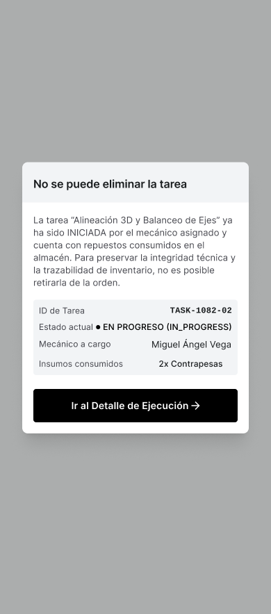 
      <small><b>Figura 143.</b> Paso 7: Bloqueo al Eliminar Tarea en Ejecución (US049)</small>
    </td>
    <td align="center" style="border: none; padding: 6px; vertical-align: top; width: 12%;">
      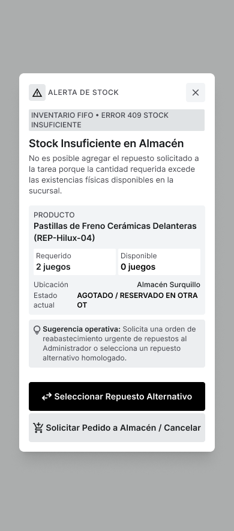 
      <small><b>Figura 144.</b> Paso 8: Conflicto por Stock Insuficiente de Repuesto (US015)</small>
    </td>
  </tr>
</table>

**Detalle analítico de la secuencia de wireframes:**
- **Paso 1 (Ficha Integral de la Orden de Trabajo - US013):** Visión centralizada de la OT con pestañas para diagnóstico, tareas de mano de obra, repuestos y costos acumulados.
- **Paso 2 (Registro de Diagnóstico Inicial Obligatorio - US013):** Captura técnica del fallo reportado, evidencia fotográfica y conclusiones preliminares antes de iniciar la intervención.
- **Paso 3 (Agregar Tarea a la Orden de Trabajo - US048):** Selección de servicio desde el catálogo maestro con estimación de horas hombre y asignación de bahía.
- **Paso 4 (Confirmar Creación de Tarea Técnica - US048):** Diálogo de validación para incorporar formalmente la labor al cronograma operativo de la orden.
- **Paso 5 (Confirmación de Tarea Creada - US048):** Retroalimentación positiva mostrando la nueva labor activa dentro del plan de trabajo del automóvil.
- **Paso 6 (Asignación de Mecánico Responsable - US048):** Asignación nominal de la actividad a un técnico según especialidad (Frenos, Motor, Electricidad) y disponibilidad.
- **Paso 7 (Bloqueo al Eliminar Tarea en Ejecución - US049):** Restricción de seguridad que impide suprimir tareas que ya cuentan con horas de trabajo o repuestos consumidos.
- **Paso 8 (Conflicto por Stock Insuficiente de Repuesto - US015):** Alerta impidiendo la asignación de piezas cuya existencia física no cubra la cantidad demandada por la tarea.

##### Flujo 6.4: Espacio de Ejecución Técnica del Mecánico y Bloqueos

Entorno interactivo para que el técnico de bahía registre avances y cierre las labores. Tal como se observa en la secuencia interactiva de las **Figuras 145 a 148**, el flujo operativo del módulo guía al usuario paso a paso a través de las siguientes pantallas consecutivas:

<table align="center" style="border: none; border-collapse: collapse; margin: 16px auto; width: 100%;">
  <tr style="border: none;">
    <td align="center" style="border: none; padding: 6px; vertical-align: top; width: 25%;">
      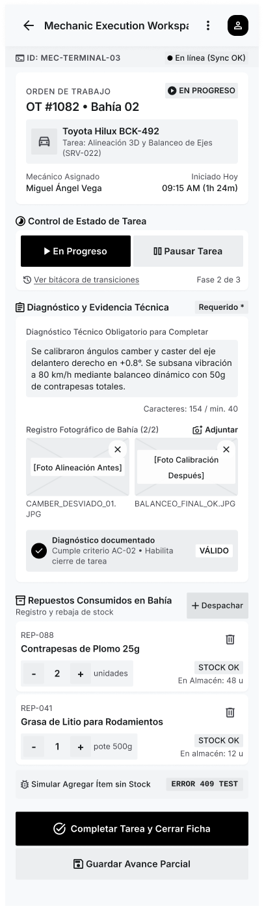 
      <small><b>Figura 145.</b> Paso 1: Espacio de Ejecución Técnica del Mecánico (US014)</small>
    </td>
    <td align="center" style="border: none; padding: 6px; vertical-align: top; width: 25%;">
      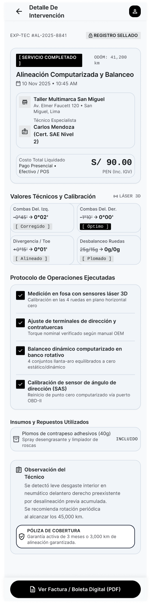 
      <small><b>Figura 146.</b> Paso 2: Detalle de la Intervención Técnica (US014)</small>
    </td>
    <td align="center" style="border: none; padding: 6px; vertical-align: top; width: 25%;">
       
      <small><b>Figura 147.</b> Paso 3: Bloqueo: Completar Tarea sin Diagnóstico (US014)</small>
    </td>
    <td align="center" style="border: none; padding: 6px; vertical-align: top; width: 25%;">
      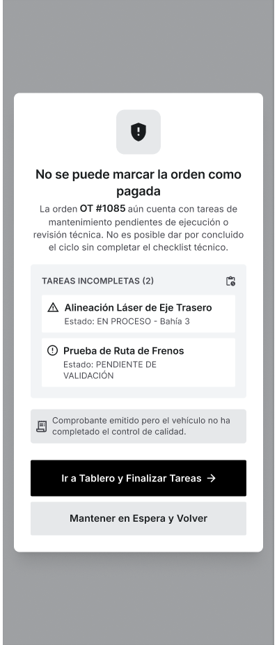 
      <small><b>Figura 148.</b> Paso 4: Bloqueo: Cierre de OT con Tareas Incompletas (US014)</small>
    </td>
  </tr>
</table>

**Detalle analítico de la secuencia de wireframes:**
- **Paso 1 (Espacio de Ejecución Técnica del Mecánico - US014):** Consola de bahía con botones táctiles grandes para iniciar, pausar y finalizar tareas con cronómetro de intervención.
- **Paso 2 (Detalle de la Intervención Técnica - US014):** Bitácora operativa donde el mecánico asienta notas técnicas, mediciones de torque y hallazgos en la pieza.
- **Paso 3 (Bloqueo: Completar Tarea sin Diagnóstico - US014):** Regla obligatoria de control de calidad impidiendo cerrar el servicio técnico sin haber ingresado el diagnóstico previo.
- **Paso 4 (Bloqueo: Cierre de OT con Tareas Incompletas - US014):** Validación de finalización impidiendo liquidar la orden si alguna tarea técnica permanece en estado pendiente o en curso.

#### Módulo 7: Facturación, Cotizaciones y Pasarela de Pagos (Billing & Payments) - Secuencias de Wireframes
*Historias de Usuario cubiertas: US016, US037, US038, US039, US041, US042, US043, US044, US045*

##### Flujo 7.1: Elaboración y Emisión de Cotización Digital

Cálculo del presupuesto consolidado de mano de obra y piezas bajo regla FIFO. Tal como se observa en la secuencia interactiva de las **Figuras 149 a 152**, el flujo operativo del módulo guía al usuario paso a paso a través de las siguientes pantallas consecutivas:

<table align="center" style="border: none; border-collapse: collapse; margin: 16px auto; width: 100%;">
  <tr style="border: none;">
    <td align="center" style="border: none; padding: 6px; vertical-align: top; width: 25%;">
      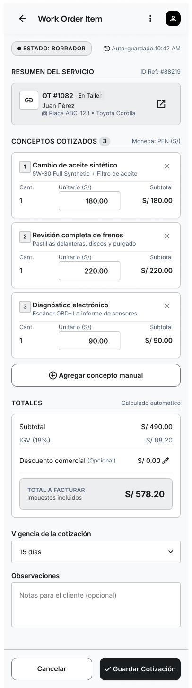 
      <small><b>Figura 149.</b> Paso 1: Creación de Cotización y Presupuesto (US037)</small>
    </td>
    <td align="center" style="border: none; padding: 6px; vertical-align: top; width: 25%;">
      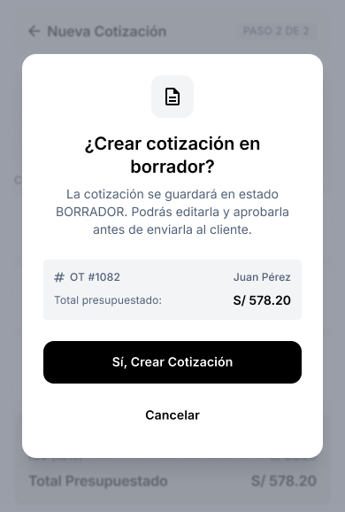 
      <small><b>Figura 150.</b> Paso 2: Confirmación de Cotización Creada (US037)</small>
    </td>
    <td align="center" style="border: none; padding: 6px; vertical-align: top; width: 25%;">
      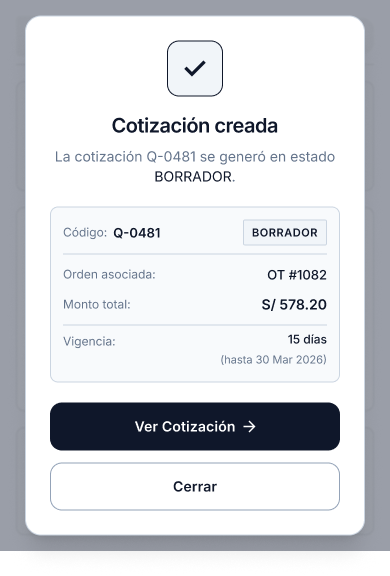 
      <small><b>Figura 151.</b> Paso 3: Éxito en Creación de Cotización (US037)</small>
    </td>
    <td align="center" style="border: none; padding: 6px; vertical-align: top; width: 25%;">
      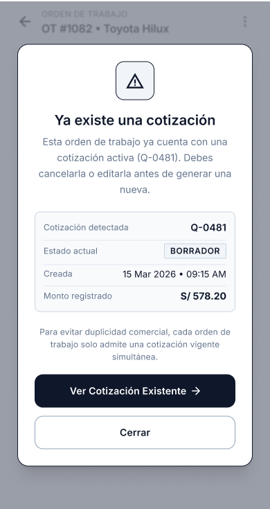 
      <small><b>Figura 152.</b> Paso 4: Conflicto por Cotización Existente Activa (US037)</small>
    </td>
  </tr>
</table>

**Detalle analítico de la secuencia de wireframes:**
- **Paso 1 (Creación de Cotización y Presupuesto - US037):** Consolidación de ítems de mano de obra y repuestos aplicados con desglose de subtotal, IGV (18%) y total en Soles (S/).
- **Paso 2 (Confirmación de Cotización Creada - US037):** Revisión previa con montos netos antes de emitir formalmente el presupuesto para aprobación del usuario.
- **Paso 3 (Éxito en Creación de Cotización - US037):** Confirmación de cotización generada en estado DRAFT lista para envío automático al correo del cliente.
- **Paso 4 (Conflicto por Cotización Existente Activa - US037):** Advertencia del sistema cuando la orden de trabajo ya cuenta con una cotización vigente pendiente de respuesta.

##### Flujo 7.2: Aprobación y Rechazo de Cotización DRAFT

Interacción con el cliente para autorizar o desistir del presupuesto acordado. Tal como se observa en la secuencia interactiva de las **Figuras 153 a 154**, el flujo operativo del módulo guía al usuario paso a paso a través de las siguientes pantallas consecutivas:

<table align="center" style="border: none; border-collapse: collapse; margin: 16px auto; width: 100%;">
  <tr style="border: none;">
    <td align="center" style="border: none; padding: 6px; vertical-align: top; width: 50%;">
       
      <small><b>Figura 153.</b> Paso 1: Aprobación de Cotización DRAFT (US038)</small>
    </td>
    <td align="center" style="border: none; padding: 6px; vertical-align: top; width: 50%;">
      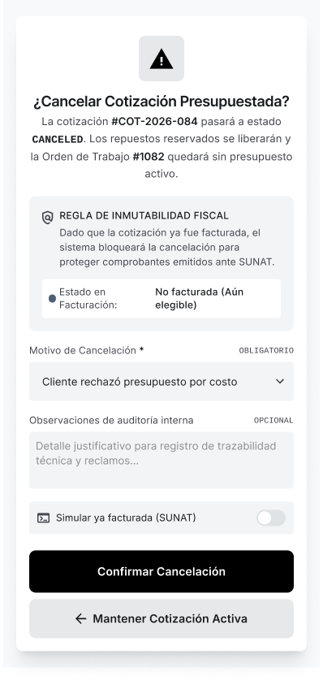 
      <small><b>Figura 154.</b> Paso 2: Cancelación o Rechazo de Cotización (US039)</small>
    </td>
  </tr>
</table>

**Detalle analítico de la secuencia de wireframes:**
- **Paso 1 (Aprobación de Cotización DRAFT - US038):** Pantalla interactiva con desglose transparente y botón de aceptación con firma digital táctil.
- **Paso 2 (Cancelación o Rechazo de Cotización - US039):** Registro de desistimiento del cliente con opción de reajuste presupuestal o anulación de la orden.

##### Flujo 7.3: Checkout y Procesamiento con Pasarela Stripe

Pasarela de pagos en línea para liquidación de servicios mecánicos. Tal como se observa en la secuencia interactiva de las **Figuras 155 a 161**, el flujo operativo del módulo guía al usuario paso a paso a través de las siguientes pantallas consecutivas:

<table align="center" style="border: none; border-collapse: collapse; margin: 16px auto; width: 100%;">
  <tr style="border: none;">
    <td align="center" style="border: none; padding: 6px; vertical-align: top; width: 14%;">
      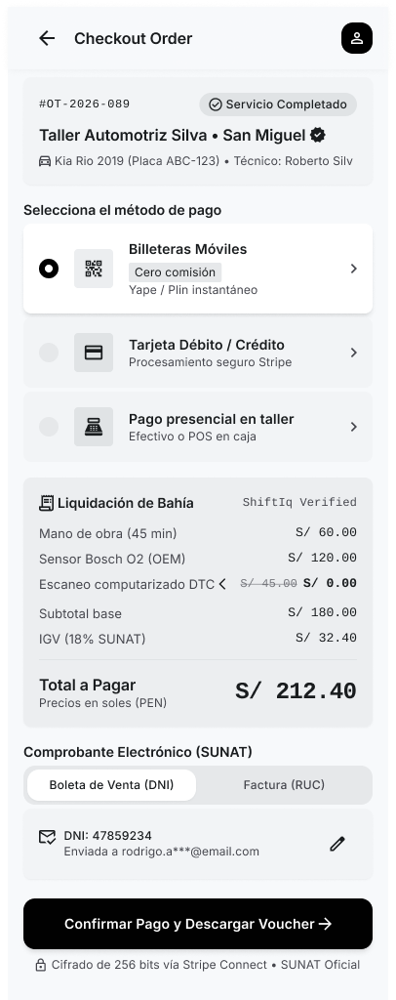 
      <small><b>Figura 155.</b> Paso 1: Orden de Pago y Selección de Método (US041)</small>
    </td>
    <td align="center" style="border: none; padding: 6px; vertical-align: top; width: 14%;">
      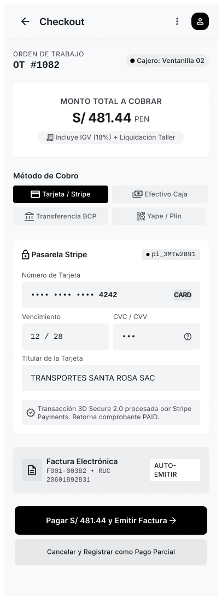 
      <small><b>Figura 156.</b> Paso 2: Checkout Inmediato con Pasarela Stripe (US041)</small>
    </td>
    <td align="center" style="border: none; padding: 6px; vertical-align: top; width: 14%;">
      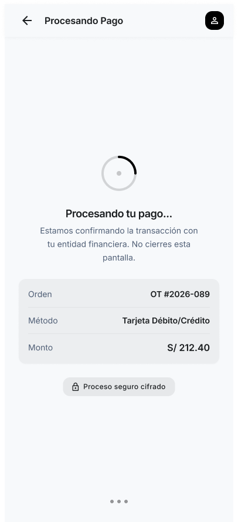 
      <small><b>Figura 157.</b> Paso 3: Procesamiento de Pago en Línea (US041)</small>
    </td>
    <td align="center" style="border: none; padding: 6px; vertical-align: top; width: 14%;">
      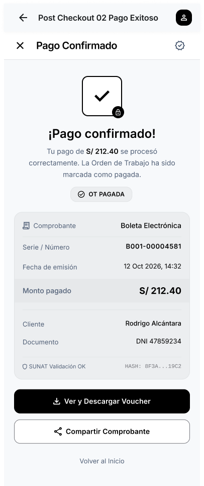 
      <small><b>Figura 158.</b> Paso 4: Pago Aprobado Exitosamente (US042)</small>
    </td>
    <td align="center" style="border: none; padding: 6px; vertical-align: top; width: 14%;">
      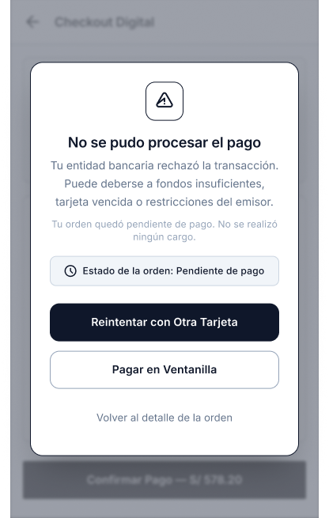 
      <small><b>Figura 159.</b> Paso 5: Error en Procesamiento de Pago (US041)</small>
    </td>
    <td align="center" style="border: none; padding: 6px; vertical-align: top; width: 14%;">
      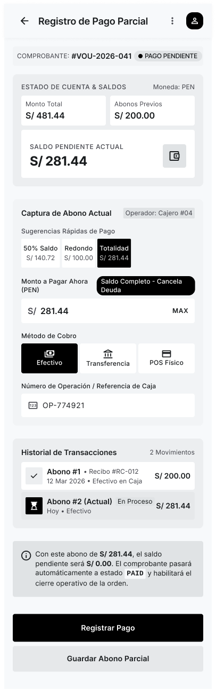 
      <small><b>Figura 160.</b> Paso 6: Registro de Pago Parcial / Adelanto (US043)</small>
    </td>
    <td align="center" style="border: none; padding: 6px; vertical-align: top; width: 14%;">
      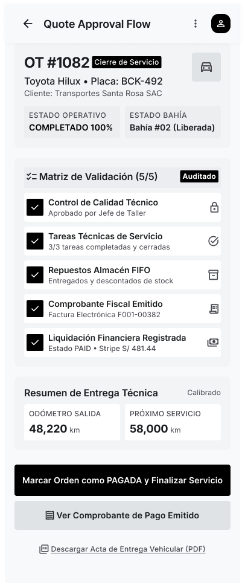 
      <small><b>Figura 161.</b> Paso 7: Marcar Orden de Trabajo como Pagada (US043)</small>
    </td>
  </tr>
</table>

**Detalle analítico de la secuencia de wireframes:**
- **Paso 1 (Orden de Pago y Selección de Método - US041):** Resumen de cuenta con opciones de pago: Tarjeta Débito/Crédito (Stripe), Efectivo en Caja o Transferencia bancaria.
- **Paso 2 (Checkout Inmediato con Pasarela Stripe - US041):** Formulario seguro integrado con campos encriptados para número de tarjeta, fecha de vencimiento y código CVC.
- **Paso 3 (Procesamiento de Pago en Línea - US041):** Pantalla de espera con animación de carga mientras se procesa la transacción bancaria con el token de Stripe.
- **Paso 4 (Pago Aprobado Exitosamente - US042):** Animación de check verde con ID de transacción bancaria y confirmación inmediata de saldo cubierto.
- **Paso 5 (Error en Procesamiento de Pago - US041):** Mensaje de rechazo bancario (fondos insuficientes o tarjeta rechazada) permitiendo reintentar de forma inmediata.
- **Paso 6 (Registro de Pago Parcial / Adelanto - US043):** Recepción de anticipos para compra de repuestos mayores actualizando el saldo deudor pendiente de la OT.
- **Paso 7 (Marcar Orden de Trabajo como Pagada - US043):** Cierre contable de la orden liberando el vehículo para su retiro de planta por parte del cliente.

##### Flujo 7.4: Comprobantes Fiscales y Descarga de Voucher PDF

Emisión de documentos tributarios electrónicos oficiales (Boletas y Facturas). Tal como se observa en la secuencia interactiva de las **Figuras 162 a 167**, el flujo operativo del módulo guía al usuario paso a paso a través de las siguientes pantallas consecutivas:

<table align="center" style="border: none; border-collapse: collapse; margin: 16px auto; width: 100%;">
  <tr style="border: none;">
    <td align="center" style="border: none; padding: 6px; vertical-align: top; width: 16%;">
      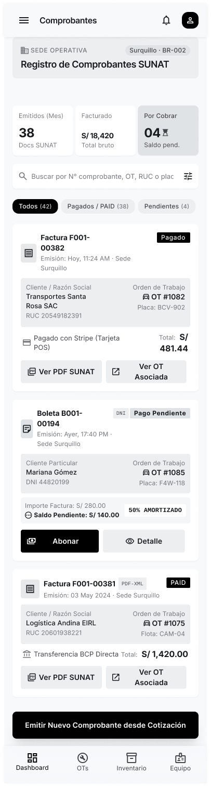 
      <small><b>Figura 162.</b> Paso 1: Consulta de Comprobantes por Sucursal (US044)</small>
    </td>
    <td align="center" style="border: none; padding: 6px; vertical-align: top; width: 16%;">
      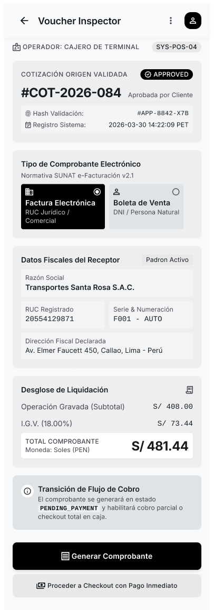 
      <small><b>Figura 163.</b> Paso 2: Generación de Comprobante Fiscal (US044)</small>
    </td>
    <td align="center" style="border: none; padding: 6px; vertical-align: top; width: 16%;">
      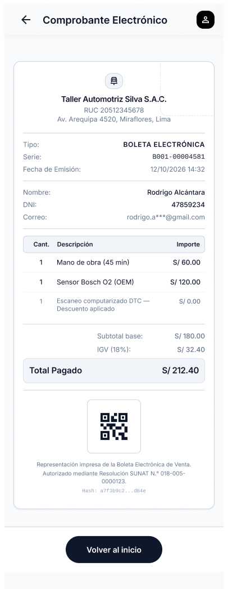 
      <small><b>Figura 164.</b> Paso 3: Comprobante Electrónico Emitido (US044)</small>
    </td>
    <td align="center" style="border: none; padding: 6px; vertical-align: top; width: 16%;">
      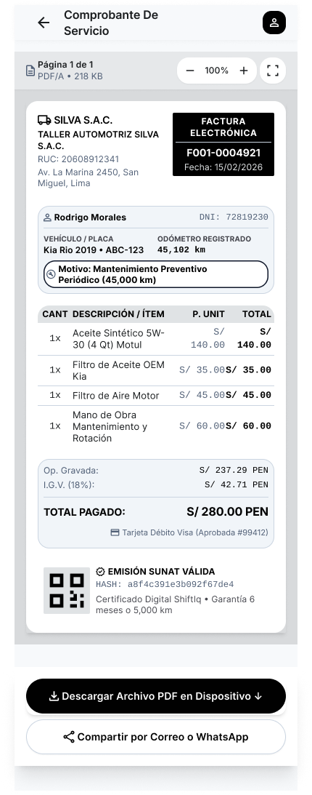 
      <small><b>Figura 165.</b> Paso 4: Comprobante de Servicio en Formato PDF (US045)</small>
    </td>
    <td align="center" style="border: none; padding: 6px; vertical-align: top; width: 16%;">
      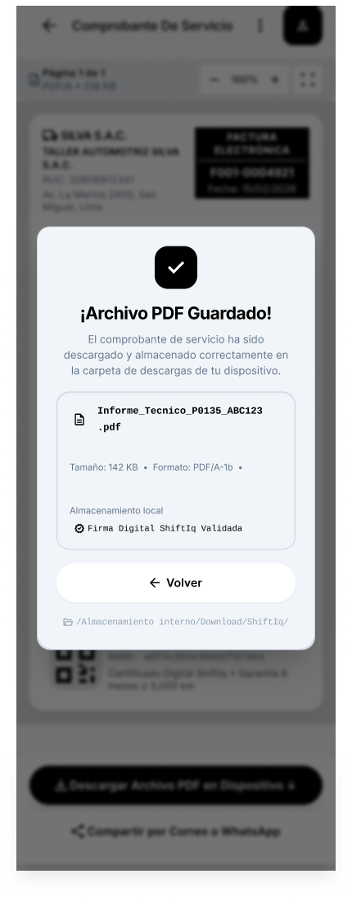 
      <small><b>Figura 166.</b> Paso 5: Comprobante PDF Guardado y Descargado (US045)</small>
    </td>
    <td align="center" style="border: none; padding: 6px; vertical-align: top; width: 16%;">
      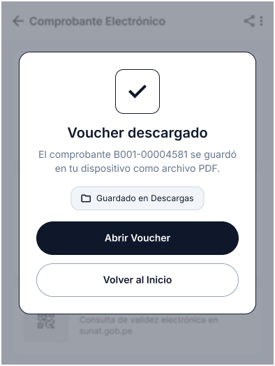 
      <small><b>Figura 167.</b> Paso 6: Voucher de Pago Descargado (US045)</small>
    </td>
  </tr>
</table>

**Detalle analítico de la secuencia de wireframes:**
- **Paso 1 (Consulta de Comprobantes por Sucursal - US044):** Historial de facturación de la sede con filtros por fecha, número de serie de comprobante y estado de SUNAT.
- **Paso 2 (Generación de Comprobante Fiscal - US044):** Selección entre Boleta de Venta o Factura Electrónica con RUC corporativo y dirección fiscal del emisor.
- **Paso 3 (Comprobante Electrónico Emitido - US044):** Vista preliminar con datos fiscales, código Hash de SUNAT y detalle discriminado de servicios e insumos.
- **Paso 4 (Comprobante de Servicio en Formato PDF - US045):** Renderizado del documento tributario formal con código QR de validez fiscal y términos de garantía.
- **Paso 5 (Comprobante PDF Guardado y Descargado - US045):** Confirmación de almacenamiento del archivo PDF en el almacenamiento local del dispositivo móvil.
- **Paso 6 (Voucher de Pago Descargado - US045):** Constancia de operación financiera generada por la pasarela de pagos lista para compartir vía mensajería.

#### Módulo 8: Experiencia Digital del Conductor (Driver B2C Experience) - Secuencias de Wireframes
*Historias de Usuario cubiertas: B2C Driver Experience (US017, US019, US028, US030, US038, US041)*

##### Flujo 8.1: Driver Home Dashboard y Estado del Vehículo

Pantalla principal para conductores con métricas telemáticas e indicadores de salud automotriz. Tal como se observa en la secuencia interactiva de las **Figura 168**, el flujo operativo del módulo guía al usuario paso a paso a través de las siguientes pantallas consecutivas:

<table align="center" style="border: none; border-collapse: collapse; margin: 16px auto; width: 100%;">
  <tr style="border: none;">
    <td align="center" style="border: none; padding: 6px; vertical-align: top; width: 100%;">
      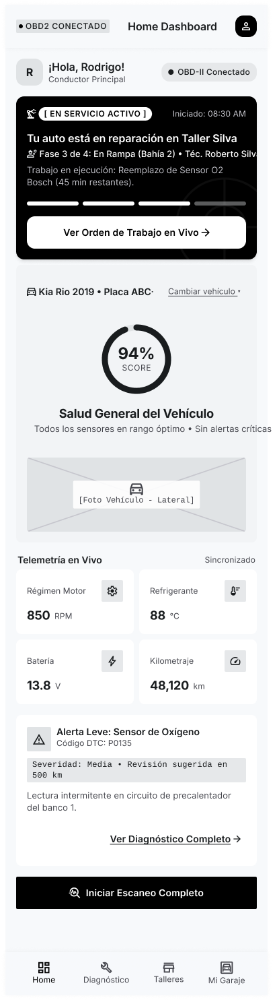 
      <small><b>Figura 168.</b> Paso 1: ShiftIQ Driver Home Dashboard (B2C Home)</small>
    </td>
  </tr>
</table>

**Detalle analítico de la secuencia de wireframes:**
- **Paso 1 (ShiftIQ Driver Home Dashboard - B2C Home):** Consola personal para el conductor con nivel de combustible, voltaje de batería, kilometraje actual y recordatorios de servicio.

##### Flujo 8.2: Mi Garaje Digital e Historial Vehicular

Hoja de vida mecánica de las unidades registradas por el conductor particular. Tal como se observa en la secuencia interactiva de las **Figuras 169 a 170**, el flujo operativo del módulo guía al usuario paso a paso a través de las siguientes pantallas consecutivas:

<table align="center" style="border: none; border-collapse: collapse; margin: 16px auto; width: 100%;">
  <tr style="border: none;">
    <td align="center" style="border: none; padding: 6px; vertical-align: top; width: 50%;">
      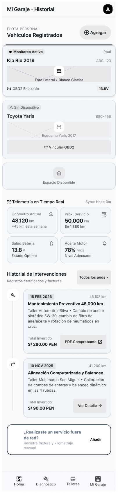 
      <small><b>Figura 169.</b> Paso 1: Mi Garaje Digital e Historial Técnico (US017)</small>
    </td>
    <td align="center" style="border: none; padding: 6px; vertical-align: top; width: 50%;">
      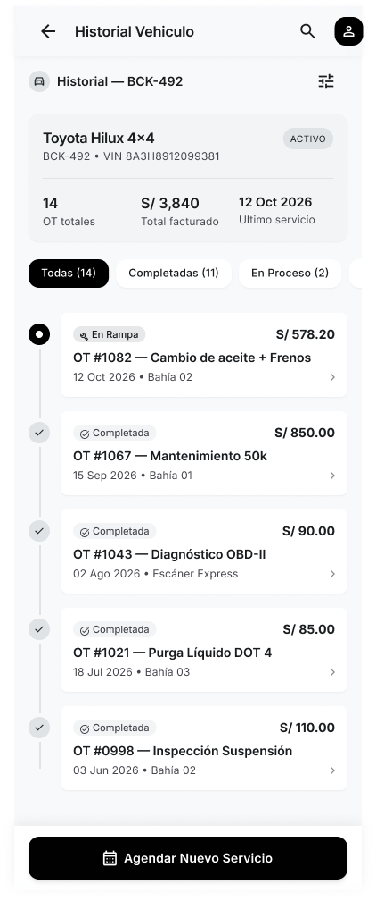 
      <small><b>Figura 170.</b> Paso 2: Detalle del Historial de Mantenimientos (US017)</small>
    </td>
  </tr>
</table>

**Detalle analítico de la secuencia de wireframes:**
- **Paso 1 (Mi Garaje Digital e Historial Técnico - US017):** Listado de vehículos particulares afiliados con registro cronológico de mantenimientos y afinamientos realizados.
- **Paso 2 (Detalle del Historial de Mantenimientos - US017):** Detalle técnico de cada intervención pasada con kilometraje del servicio, taller ejecutor y repuestos cambiados.

##### Flujo 8.3: Monitoreo en Vivo de Orden de Trabajo y Autorizaciones

Seguimiento en tiempo real de la reparación del auto y aprobación de tareas adicionales solicitadas por el mecánico. Tal como se observa en la secuencia interactiva de las **Figuras 171 a 172**, el flujo operativo del módulo guía al usuario paso a paso a través de las siguientes pantallas consecutivas:

<table align="center" style="border: none; border-collapse: collapse; margin: 16px auto; width: 100%;">
  <tr style="border: none;">
    <td align="center" style="border: none; padding: 6px; vertical-align: top; width: 50%;">
       
      <small><b>Figura 171.</b> Paso 1: Seguimiento de Orden de Trabajo en Vivo (US050)</small>
    </td>
    <td align="center" style="border: none; padding: 6px; vertical-align: top; width: 50%;">
       
      <small><b>Figura 172.</b> Paso 2: Autorización de Trabajo Mecánico Adicional (US038)</small>
    </td>
  </tr>
</table>

**Detalle analítico de la secuencia de wireframes:**
- **Paso 1 (Seguimiento de Orden de Trabajo en Vivo - US050):** Barra de progreso del automóvil en taller (Recepción -> En Bahía -> Pruebas -> Listo) con cámara fotográfica de avances.
- **Paso 2 (Autorización de Trabajo Mecánico Adicional - US038):** Solicitud emergente con foto de pieza desgastada y costo estimado para que el dueño apruebe con un toque sin llamadas.

##### Flujo 8.4: Directorio de Talleres en Red y Servicios Externos

Localización de talleres certificados ShiftIQ y gestión de intervenciones fuera de red. Tal como se observa en la secuencia interactiva de las **Figuras 173 a 175**, el flujo operativo del módulo guía al usuario paso a paso a través de las siguientes pantallas consecutivas:

<table align="center" style="border: none; border-collapse: collapse; margin: 16px auto; width: 100%;">
  <tr style="border: none;">
    <td align="center" style="border: none; padding: 6px; vertical-align: top; width: 33%;">
      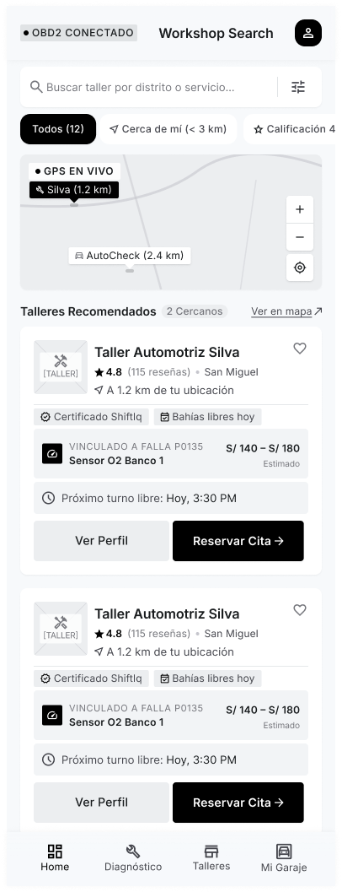 
      <small><b>Figura 173.</b> Paso 1: Catálogo y Búsqueda de Talleres Mecánicos (US028)</small>
    </td>
    <td align="center" style="border: none; padding: 6px; vertical-align: top; width: 33%;">
      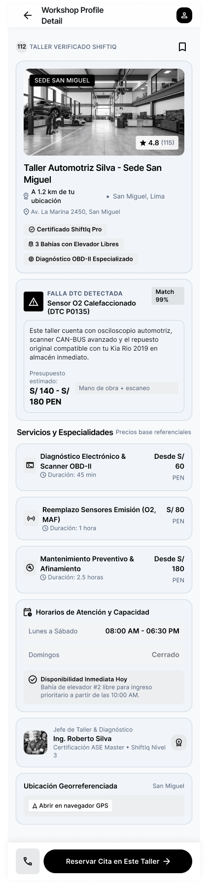 
      <small><b>Figura 174.</b> Paso 2: Perfil Detallado del Taller Mecánico (US028)</small>
    </td>
    <td align="center" style="border: none; padding: 6px; vertical-align: top; width: 33%;">
      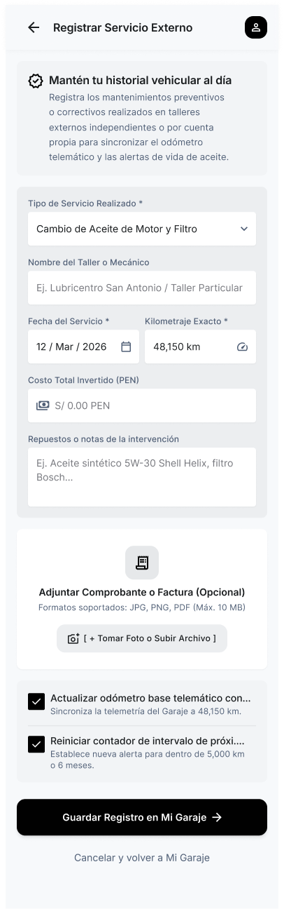 
      <small><b>Figura 175.</b> Paso 3: Registro de Servicio Fuera de Red (US017)</small>
    </td>
  </tr>
</table>

**Detalle analítico de la secuencia de wireframes:**
- **Paso 1 (Catálogo y Búsqueda de Talleres Mecánicos - US028):** Mapa geolocalizado de talleres asociados a la red con valoración por estrellas, especialidades mecánicas y distancia.
- **Paso 2 (Perfil Detallado del Taller Mecánico - US028):** Ficha con fotos de las instalaciones, equipo de elevadores, certificados, comentarios de clientes y botón para agendar.
- **Paso 3 (Registro de Servicio Fuera de Red - US017):** Funcionalidad para que el conductor suba comprobantes y detalle de trabajos realizados en talleres externos al sistema.

---

### 3.1.4.2. Mobile Applications Wireflow Diagrams

Los **Wireflow Diagrams** integran la arquitectura esquemática de los wireframes con la lógica de navegación transicional del usuario. A diferencia de un mapa de pantallas estático, el wireflow documenta el recorrido secuencial del usuario enfocado en el cumplimiento de metas concretas (**User Goals**), modelando **experiencias de usuario altamente satisfactorias (*Happy Paths*)**. Cada escenario agrupa el conjunto de sus pantallas dentro de un **único contenedor visual unificado**, representando el flujo completo como una sola unidad interactiva de alta legibilidad, complementada con su correspondiente análisis de satisfacción y diagrama de decisión lógica.

#### Escenario 1: Recepción Vehicular, Apertura de Orden de Trabajo y Diagnóstico Telemático OBD-II

- **Objetivo del Usuario (User Goal):** *Como jefe de taller o asesor de servicio, deseo registrar la llegada física del vehículo a la bahía de trabajo, aperturar la Orden de Trabajo vinculando al cliente y ejecutar el sondeo telemático de las computadoras a bordo (ECU) mediante escáner Bluetooth OBD-II BLE en menos de 3 minutos, obteniendo un diagnóstico preliminar transparente sin demoras.*
- **Resultado de Experiencia Satisfactoria:** Recepción ágil sin uso de papel ni duplicidad de datos, conexión periférica instantánea con retroalimentación RSSI visual, y detección de códigos de falla DTC en tiempo real con traducción didáctica inmediata para el cliente.

  

    Diagrama Wireflow Unificado - Escenario 1: Recepción, Apertura de OT y Diagnóstico OBD-II
  

  <table align="center" style="border: none; border-collapse: collapse; width: 100%;">
    <tr style="border: none;">
      <td align="center" style="border: none; padding: 4px; vertical-align: top; width: 17%;">
        Paso 1: Bahías 
         
        <small style="color: #334155; font-size: 11px;"><b>Dashboard de Planta</b> (US006)</small>
      </td>
      <td align="center" style="border: none; padding: 2px; vertical-align: middle; width: 3%;">
        ➔
      </td>
      <td align="center" style="border: none; padding: 4px; vertical-align: top; width: 17%;">
        Paso 2: Registro OT 
         
        <small style="color: #334155; font-size: 11px;"><b>Creación de OT</b> (US012)</small>
      </td>
      <td align="center" style="border: none; padding: 2px; vertical-align: middle; width: 3%;">
        ➔
      </td>
      <td align="center" style="border: none; padding: 4px; vertical-align: top; width: 17%;">
        Paso 3: Enlace BLE 
         
        <small style="color: #334155; font-size: 11px;"><b>Vincular Dongle BLE</b> (US018)</small>
      </td>
      <td align="center" style="border: none; padding: 2px; vertical-align: middle; width: 3%;">
        ➔
      </td>
      <td align="center" style="border: none; padding: 4px; vertical-align: top; width: 17%;">
        Paso 4: Sondeo 
         
        <small style="color: #334155; font-size: 11px;"><b>Escaneo de ECUs</b> (US023)</small>
      </td>
      <td align="center" style="border: none; padding: 2px; vertical-align: middle; width: 3%;">
        ➔
      </td>
      <td align="center" style="border: none; padding: 4px; vertical-align: top; width: 17%;">
        Paso 5: Reporte DTC 
         
        <small style="color: #334155; font-size: 11px;"><b>Diagnóstico DTC</b> (US023)</small>
      </td>
    </tr>
  </table>
  

    <b>Figura 176a.</b> Cuadro unificado de Wireflow que ilustra la experiencia satisfactoria del Escenario 1: Recepción vehicular, apertura de orden de trabajo y diagnóstico telemático OBD-II en taller.
  

##### Análisis Detallado del Proceso Satisfactorio (Escenario 1)

1. **Paso 1 (Disponibilidad en Planta - US006):** Al iniciar la jornada, el asesor visualiza en el Dashboard la ocupación de bahías en tiempo real (ej. Bahía 1 Libre, Bahía 2 Ocupada al 75%), lo que permite ubicar el vehículo de inmediato sin congestión en el patio.
2. **Paso 2 (Apertura de OT sin Fricción - US012):** Con la placa ingresada, el sistema recupera automáticamente el historial del automóvil (marca, modelo y año), solicitando únicamente el kilometraje y nivel de combustible. Esto ahorra hasta un 70% del tiempo de recepción física.
3. **Paso 3 (Emparejamiento BLE Automático - US018):** El escáner OBD-II asignado a la bahía se sincroniza por Bluetooth Low Energy en un solo toque, con indicador de fuerza de señal (RSSI) que da confianza al técnico sobre el enlace físico.
4. **Paso 4 (Sondeo Telemático en Vivo - US023):** La interfaz muestra una barra de progreso que consulta secuencialmente el tren motriz (PCM), frenos (ABS) y carrocería (BCM), completando el barrido integral en menos de 40 segundos.
5. **Paso 5 (Traducción Inmediata de Fallas - US023):** Los códigos crípticos (ej. P0135) se presentan acompañados de su significado comprensible ("Falla en calentador de sensor de oxígeno banco 1"), permitiendo al asesor explicar el problema al cliente con absoluta claridad.

##### Diagrama de Decisión Lógica del Escenario 1

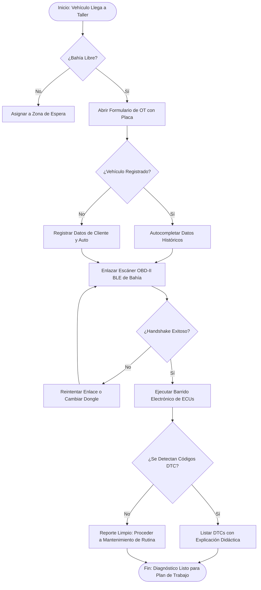
```mermaid
flowchart TD
    E1_Start([Inicio: Vehículo Llega a Taller]) --> E1_CheckBay{¿Bahía Libre?}
    E1_CheckBay -- No --> E1_Queue[Asignar a Zona de Espera]
    E1_CheckBay -- Sí --> E1_OpenOT[Abrir Formulario de OT con Placa]
    
    E1_OpenOT --> E1_CheckHist{¿Vehículo Registrado?}
    E1_CheckHist -- Sí --> E1_AutoFill[Autocompletar Datos Históricos]
    E1_CheckHist -- No --> E1_ManualReg[Registrar Datos de Cliente y Auto]
    
    E1_AutoFill --> E1_PairBLE[Enlazar Escáner OBD-II BLE de Bahía]
    E1_ManualReg --> E1_PairBLE
    
    E1_PairBLE --> E1_BLEStatus{¿Handshake Exitoso?}
    E1_BLEStatus -- No --> E1_RetryBLE[Reintentar Enlace o Cambiar Dongle]
    E1_RetryBLE --> E1_PairBLE
    E1_BLEStatus -- Sí --> E1_RunScan[Ejecutar Barrido Electrónico de ECUs]
    
    E1_RunScan --> E1_CheckDTC{¿Se Detectan Códigos DTC?}
    E1_CheckDTC -- Sí --> E1_ShowDTC[Listar DTCs con Explicación Didáctica]
    E1_CheckDTC -- No --> E1_OK[Reporte Limpio: Proceder a Mantenimiento de Rutina]
    
    E1_ShowDTC --> E1_End([Fin: Diagnóstico Listo para Plan de Trabajo])
    E1_OK --> E1_End
```

---

#### Escenario 2: Asignación Técnica de Mano de Obra, Despacho de Repuestos FIFO y Ejecución en Bahía

- **Objetivo del Usuario (User Goal):** *Como jefe de taller y mecánico especialista, deseamos desglosar las tareas técnicas requeridas en la Orden de Trabajo, solicitar los repuestos al almacén asegurando la regla de costeo First-In First-Out (FIFO) para no distorsionar márgenes, y documentar la evidencia fotográfica obligatoria antes de iniciar la intervención mecánica.*
- **Resultado de Experiencia Satisfactoria:** Planificación sin conflictos de agenda técnica, costeo exacto de inventario con control de lotes sin descuadres contables, y respaldo documental fotográfico que garantiza la calidad del servicio técnico.

  

    Diagrama Wireflow Unificado - Escenario 2: Asignación Técnica, Despacho FIFO y Ejecución
  

  <table align="center" style="border: none; border-collapse: collapse; width: 100%;">
    <tr style="border: none;">
      <td align="center" style="border: none; padding: 4px; vertical-align: top; width: 17%;">
        Paso 1: Detalle OT 
         
        <small style="color: #334155; font-size: 11px;"><b>Detalle de OT</b> (US012)</small>
      </td>
      <td align="center" style="border: none; padding: 2px; vertical-align: middle; width: 3%;">
        ➔
      </td>
      <td align="center" style="border: none; padding: 4px; vertical-align: top; width: 17%;">
        Paso 2: Tareas 
         
        <small style="color: #334155; font-size: 11px;"><b>Agregar Tarea</b> (US048)</small>
      </td>
      <td align="center" style="border: none; padding: 2px; vertical-align: middle; width: 3%;">
        ➔
      </td>
      <td align="center" style="border: none; padding: 4px; vertical-align: top; width: 17%;">
        Paso 3: Lote FIFO 
         
        <small style="color: #334155; font-size: 11px;"><b>Despacho FIFO</b> (US009)</small>
      </td>
      <td align="center" style="border: none; padding: 2px; vertical-align: middle; width: 3%;">
        ➔
      </td>
      <td align="center" style="border: none; padding: 4px; vertical-align: top; width: 17%;">
        Paso 4: Bahía 
         
        <small style="color: #334155; font-size: 11px;"><b>Ejecución en Bahía</b> (US014)</small>
      </td>
      <td align="center" style="border: none; padding: 2px; vertical-align: middle; width: 3%;">
        ➔
      </td>
      <td align="center" style="border: none; padding: 4px; vertical-align: top; width: 17%;">
        Paso 5: Evidencia 
         
        <small style="color: #334155; font-size: 11px;"><b>Validación Calidad</b> (US014)</small>
      </td>
    </tr>
  </table>
  

    <b>Figura 176b.</b> Cuadro unificado de Wireflow que ilustra la experiencia satisfactoria del Escenario 2: Asignación técnica de mano de obra, despacho de repuestos FIFO y ejecución en bahía.
  

##### Análisis Detallado del Proceso Satisfactorio (Escenario 2)

1. **Paso 1 (Contexto de Orden - US012):** El técnico abre la OT en su dispositivo móvil y examina las fallas diagnosticadas previamente, visualizando qué partes del vehículo requieren intervención inmediata.
2. **Paso 2 (Asignación Estructurada de Labores - US048):** Se agregan tareas técnicas seleccionadas del catálogo estandarizado (ej. "Reemplazo de sensor de oxígeno - 1.2 hrs"), asociando automáticamente el tarifario oficial de mano de obra.
3. **Paso 3 (Consumo Riguroso de Repuestos FIFO - US009):** Al solicitar el repuesto desde el almacén, el motor de inventario descuenta las existencias del lote más antiguo (First-In, First-Out), evitando la desvalorización de stock y asegurando que el costo de venta sea matemáticamente exacto.
4. **Paso 4 (Ejecución Cronometrada en Bahía - US014):** El mecánico inicia el temporizador de la labor con un toque táctil, visualizando instrucciones de seguridad y el listado de insumos asignados a su puesto.
5. **Paso 5 (Garantía de Calidad por Evidencia - US014):** El software previene el cierre de la tarea si no se adjunta al menos una fotografía del repuesto reemplazado o de la pieza instalada, asegurando el respaldo ético y técnico de la intervención ante cualquier reclamo posterior.

##### Diagrama de Decisión Lógica del Escenario 2

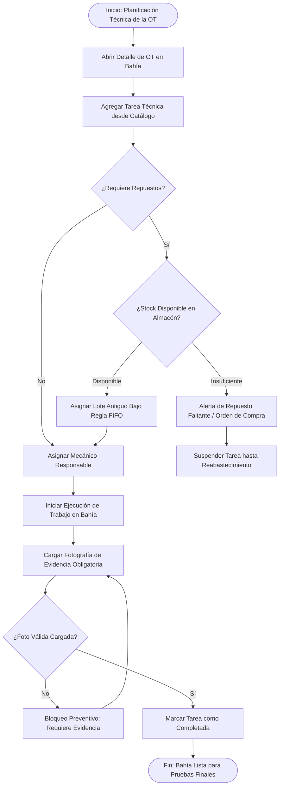
```mermaid
flowchart TD
    E2_Start([Inicio: Planificación Técnica de la OT]) --> E2_ViewOT[Abrir Detalle de OT en Bahía]
    E2_ViewOT --> E2_AddTask[Agregar Tarea Técnica desde Catálogo]
    
    E2_AddTask --> E2_NeedParts{¿Requiere Repuestos?}
    E2_NeedParts -- No --> E2_AssignTech[Asignar Mecánico Responsable]
    E2_NeedParts -- Sí --> E2_CheckStock{¿Stock Disponible en Almacén?}
    
    E2_CheckStock -- Insuficiente --> E2_AlertStock[Alerta de Repuesto Faltante / Orden de Compra]
    E2_AlertStock --> E2_Hold[Suspender Tarea hasta Reabastecimiento]
    
    E2_CheckStock -- Disponible --> E2_ApplyFIFO[Asignar Lote Antiguo Bajo Regla FIFO]
    E2_ApplyFIFO --> E2_AssignTech
    
    E2_AssignTech --> E2_StartJob[Iniciar Ejecución de Trabajo en Bahía]
    E2_StartJob --> E2_AttachPhoto[Cargar Fotografía de Evidencia Obligatoria]
    
    E2_AttachPhoto --> E2_CheckPhoto{¿Foto Válida Cargada?}
    E2_CheckPhoto -- No --> E2_BlockComplete[Bloqueo Preventivo: Requiere Evidencia]
    E2_BlockComplete --> E2_AttachPhoto
    E2_CheckPhoto -- Sí --> E2_CompleteTask[Marcar Tarea como Completada]
    
    E2_CompleteTask --> E2_End([Fin: Bahía Lista para Pruebas Finales])
```

---

#### Escenario 3: Presupuestación Formal, Liquidación de Pagos y Emisión de Comprobante Fiscal PDF

- **Objetivo del Usuario (User Goal):** *Como asesor comercial y cajero administrativo, deseo generar la cotización formal con el cálculo automático de mano de obra, repuestos e impuestos (IGV 18%), obtener la aprobación formal del cliente, procesar el cobro digital y emitir de inmediato el comprobante electrónico oficial en PDF con código QR, liberando la bahía para el siguiente vehículo.*
- **Resultado de Experiencia Satisfactoria:** Presupuesto sin discordancias numéricas, aprobación verificable, procesamiento de pago seguro y entrega instantánea de comprobante tributario legal con liberación automatizada del recurso físico en el sistema.

  

    Diagrama Wireflow Unificado - Escenario 3: Presupuestación, Liquidación y Comprobante Fiscal PDF
  

  <table align="center" style="border: none; border-collapse: collapse; width: 100%;">
    <tr style="border: none;">
      <td align="center" style="border: none; padding: 4px; vertical-align: top; width: 17%;">
        Paso 1: Cotización 
         
        <small style="color: #334155; font-size: 11px;"><b>Crear Cotización</b> (US038)</small>
      </td>
      <td align="center" style="border: none; padding: 2px; vertical-align: middle; width: 3%;">
        ➔
      </td>
      <td align="center" style="border: none; padding: 4px; vertical-align: top; width: 17%;">
        Paso 2: Aprobación 
         
        <small style="color: #334155; font-size: 11px;"><b>Aprobar Draft</b> (US038)</small>
      </td>
      <td align="center" style="border: none; padding: 2px; vertical-align: middle; width: 3%;">
        ➔
      </td>
      <td align="center" style="border: none; padding: 4px; vertical-align: top; width: 17%;">
        Paso 3: Cobro 
         
        <small style="color: #334155; font-size: 11px;"><b>Procesar Pago</b> (US041)</small>
      </td>
      <td align="center" style="border: none; padding: 2px; vertical-align: middle; width: 3%;">
        ➔
      </td>
      <td align="center" style="border: none; padding: 4px; vertical-align: top; width: 17%;">
        Paso 4: Confirmado 
         
        <small style="color: #334155; font-size: 11px;"><b>Pago Aprobado</b> (US041)</small>
      </td>
      <td align="center" style="border: none; padding: 2px; vertical-align: middle; width: 3%;">
        ➔
      </td>
      <td align="center" style="border: none; padding: 4px; vertical-align: top; width: 17%;">
        Paso 5: PDF SUNAT 
         
        <small style="color: #334155; font-size: 11px;"><b>Boleta / Factura PDF</b> (US045)</small>
      </td>
    </tr>
  </table>
  

    <b>Figura 176c.</b> Cuadro unificado de Wireflow que ilustra la experiencia satisfactoria del Escenario 3: Presupuestación formal, liquidación de pagos y emisión de comprobante fiscal en PDF.
  

##### Análisis Detallado del Proceso Satisfactorio (Escenario 3)

1. **Paso 1 (Consolidación Presupuestal - US038):** El sistema calcula automáticamente el subtotal neto, desglosando los repuestos despachados y las horas de mano de obra ejecutadas, agregando el 18% del IGV sin posibilidad de errores aritméticos manuales.
2. **Paso 2 (Aprobación Formal del Cliente - US038):** El asesor registra la firma digital o aprobación del cliente sobre la cotización en borrador (*Draft*), garantizando el acuerdo comercial previo antes de la facturación electrónica definitiva.
3. **Paso 3 (Pasarela de Pago Ágil - US041):** El operador selecciona el método de pago (tarjeta de crédito/débito, pasarela Stripe o terminal POS), iniciando la transacción con validaciones en tiempo real.
4. **Paso 4 (Cierre Financiero en Vivo - US041):** La pasarela responde en menos de 2.5 segundos con el código de autorización bancaria, actualizando el estado de la Orden de Trabajo a *Pagada* y disparando la liberación inmediata de la bahía en el Dashboard general.
5. **Paso 5 (Emisión Electrónica Oficial - US045):** Se genera de manera autónoma el comprobante electrónico (Boleta o Factura) en formato PDF estándar SUNAT, con código QR y enlace de descarga enviado simultáneamente al correo y teléfono del cliente.

##### Diagrama de Decisión Lógica del Escenario 3

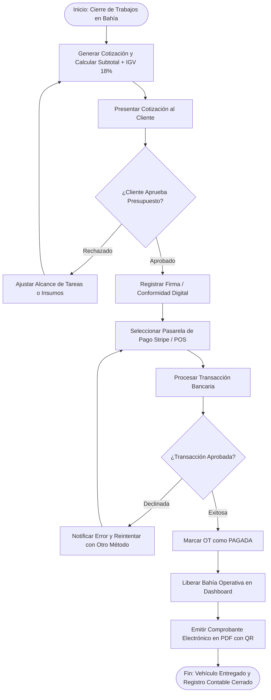
```mermaid
flowchart TD
    E3_Start([Inicio: Cierre de Trabajos en Bahía]) --> E3_Calc[Generar Cotización y Calcular Subtotal + IGV 18%]
    E3_Calc --> E3_PresentQuote[Presentar Cotización al Cliente]
    
    E3_PresentQuote --> E3_ApproveDecision{¿Cliente Aprueba Presupuesto?}
    E3_ApproveDecision -- Rechazado --> E3_Adjust[Ajustar Alcance de Tareas o Insumos]
    E3_Adjust --> E3_Calc
    
    E3_ApproveDecision -- Aprobado --> E3_Sign[Registrar Firma / Conformidad Digital]
    E3_Sign --> E3_SelectPayment[Seleccionar Pasarela de Pago Stripe / POS]
    
    E3_SelectPayment --> E3_ProcessPay[Procesar Transacción Bancaria]
    E3_ProcessPay --> E3_CheckPayStatus{¿Transacción Aprobada?}
    
    E3_CheckPayStatus -- Declinada --> E3_RetryPay[Notificar Error y Reintentar con Otro Método]
    E3_RetryPay --> E3_SelectPayment
    
    E3_CheckPayStatus -- Exitosa --> E3_MarkPaid[Marcar OT como PAGADA]
    E3_MarkPaid --> E3_FreeBay[Liberar Bahía Operativa en Dashboard]
    E3_FreeBay --> E3_GenPDF[Emitir Comprobante Electrónico en PDF con QR]
    
    E3_GenPDF --> E3_End([Fin: Vehículo Entregado y Registro Contable Cerrado])
```

#### Verificación Ergonómica y Heurística de los Wireflows

Como se detalla en la **Tabla 29**, la navegación e interacción modelada en los Wireflows respeta los principios de ergonomía móvil, directrices de usabilidad de Nielsen y los requerimientos funcionales del sistema:

**Tabla 29**  
*Matriz de verificación heurística y ergonómica de los wireflows y wireframes móviles de ShiftIQ*

| Criterio Heurístico / Técnico | Evaluación en Wireflows y Wireframes de ShiftIQ | Estado |
| :--- | :--- | :--- |
| **Visibilidad del Estado del Sistema** | Retroalimentación en tiempo real en escaneo de ECUs, estados de OT con badges y barra de conexión del dongle Bluetooth BLE. | **Conforme** |
| **Relación Sistema - Mundo Real** | Uso de terminología estándar de talleres (Bahía, Orden de Trabajo, Diagnóstico DTC, SKU, FIFO). | **Conforme** |
| **Control y Libertad del Usuario** | Diálogos de confirmación previa para cancelaciones, reprogramaciones y desvinculación de escáner. | **Conforme** |
| **Consistencia y Estándares** | Patrones de navegación nativos de Android/iOS (Bottom Navigation Bar, Top App Bar con botón de retorno, Floating Action Buttons). | **Conforme** |
| **Prevención de Errores** | Validaciones reactivas en formularios (RUC 11 dígitos, contraseñas robustas, bloqueo de stock negativo y bloqueo sin diagnóstico). | **Conforme** |
| **Reconocimiento antes que Recuerdo** | Selector asistido de repuestos por código y visualización gráfica del calendario de bahías disponibles. | **Conforme** |
| **Eficiencia y Flexibilidad** | Búsqueda rápida por placa de vehículo, escaneo directo OBD-II y acceso directo a órdenes urgentes desde el Dashboard. | **Conforme** |

---

### 3.1.4.3. Mobile Applications Mock-ups

Los mockups de la aplicación móvil de ShiftIQ plasman la versión en alta fidelidad de las interfaces, aplicando de forma estricta el sistema visual, componentes de UI y tokens de estilo documentados en la sección 3.1.1:
- **Paleta Cromática de Marca:** Uso predominante del azul corporativo *Navy Primary* (`#1E3A8A`) en barras de navegación, encabezados y botones primarios; azul cielo *Accent Sky Blue* (`#60A5FA`) para estados interactivos y enlaces; naranja automotriz *Severity Orange* (`#C94A0E`) para alertas de severidad y llamadas a la acción prioritarias; y verde esmeralda (`#3DBE6C`) para estados conectados y transacciones exitosas.
- **Tipografía Institucional:** Familia *Inter*, con jerarquías claras desde títulos semibold (18-20sp), subtítulos (14-16sp) hasta textos auxiliares y etiquetas (12sp).
- **Componentes Nativos y Accesibilidad:** Contenedores de tarjeta (*Cards*) con esquinas redondeadas de 12px, sombras difusas (*elevation*), botones táctiles de al menos 48dp de altura y contrastes conformes a WCAG 2.1 AA.

A continuación, se presentan **todos los mockups en alta fidelidad del sistema**, organizados por módulos funcionales y presentados en **secuencias visuales horizontales lado a lado**:

#### Módulo 1: Identidad, Autenticación y Seguridad (IAM) - Secuencias de Mockups (Alta Fidelidad)
*Historias de Usuario cubiertas: US001, US002, US004, US035, US036*

##### Flujo 1.1: Onboarding y Registro de Usuarios (B2B y B2C)

Como se aprecia en la secuencia visual de alta fidelidad de las **Figuras 176 a 183**, el diseño final incorpora la identidad cromática corporativa (`#1E3A8A`), componentes táctiles enriquecidos y microinteracciones de estado a lo largo del flujo:

<table align="center" style="border: none; border-collapse: collapse; margin: 16px auto; width: 100%;">
  <tr style="border: none;">
    <td align="center" style="border: none; padding: 6px; vertical-align: top; width: 12%;">
      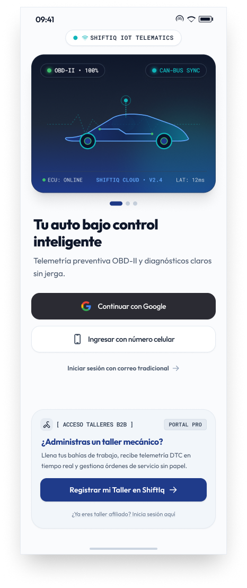 
      <small><b>Figura 176.</b> Mockup Paso 1: Onboarding y Acceso ShiftIQ IoT (US001, US002)</small>
    </td>
    <td align="center" style="border: none; padding: 6px; vertical-align: top; width: 12%;">
       
      <small><b>Figura 177.</b> Mockup Paso 2: Registro de Taller y Propietario B2B (US001)</small>
    </td>
    <td align="center" style="border: none; padding: 6px; vertical-align: top; width: 12%;">
      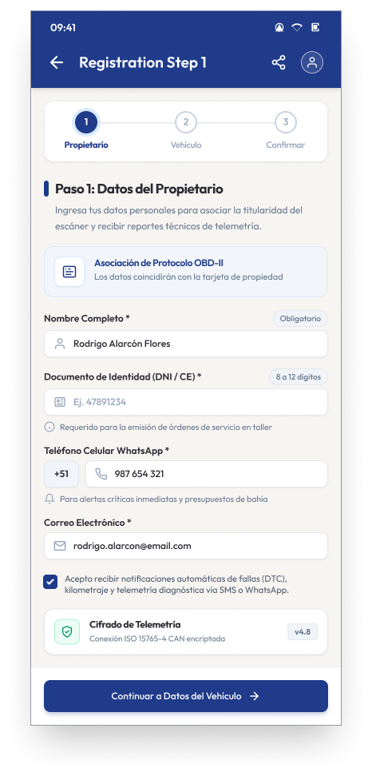 
      <small><b>Figura 178.</b> Mockup Paso 3: Asistente de Registro Paso 1: Datos de Propietario (US001)</small>
    </td>
    <td align="center" style="border: none; padding: 6px; vertical-align: top; width: 12%;">
       
      <small><b>Figura 179.</b> Mockup Paso 4: Asistente de Registro Paso 2: Vehículo y OBD-II (US001, US017)</small>
    </td>
    <td align="center" style="border: none; padding: 6px; vertical-align: top; width: 12%;">
      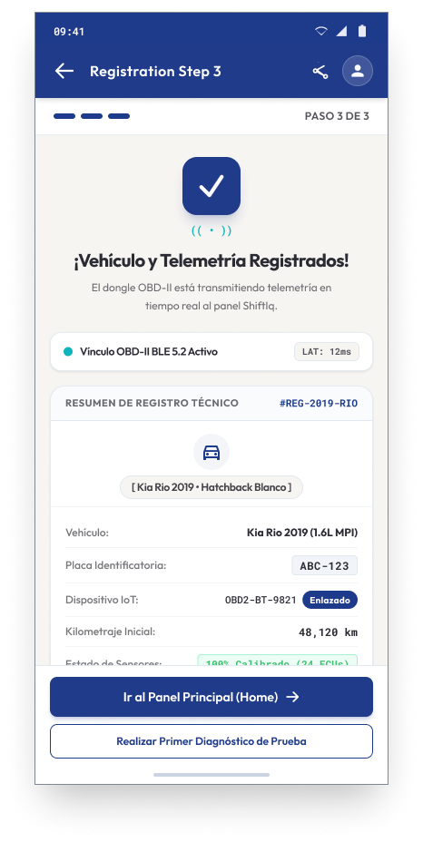 
      <small><b>Figura 180.</b> Mockup Paso 5: Asistente de Registro Paso 3: Confirmación de Cuenta (US001)</small>
    </td>
    <td align="center" style="border: none; padding: 6px; vertical-align: top; width: 12%;">
      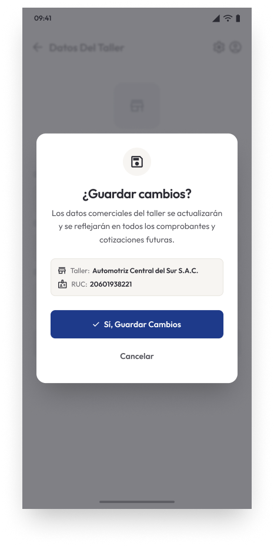 
      <small><b>Figura 181.</b> Mockup Paso 6: Modal de Verificación de Datos de Registro (US001)</small>
    </td>
    <td align="center" style="border: none; padding: 6px; vertical-align: top; width: 12%;">
      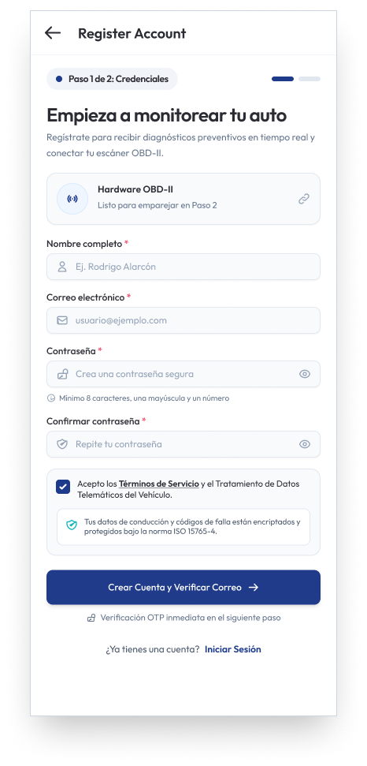 
      <small><b>Figura 182.</b> Mockup Paso 7: Creación de Cuenta Conductor B2C (US001)</small>
    </td>
    <td align="center" style="border: none; padding: 6px; vertical-align: top; width: 12%;">
      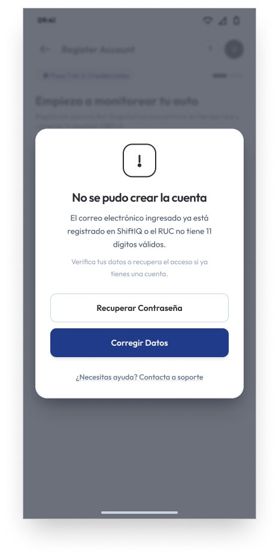 
      <small><b>Figura 183.</b> Mockup Paso 8: Manejo de Errores en Registro de Cuenta (US001)</small>
    </td>
  </tr>
</table>

**Análisis visual y componentes UI de la secuencia de mockups:**
- **Paso 1 (Onboarding y Acceso ShiftIQ IoT - US001, US002):** Pantalla introductoria interactiva que destaca las capacidades de telemetría OBD-II en tiempo real y ofrece accesos diferenciados para registro B2B y B2C.
- **Paso 2 (Registro de Taller y Propietario B2B - US001):** Formulario de alta empresarial con captura y validación en tiempo real de razón social, RUC tributario (SUNAT), dirección fiscal y credenciales de administrador.
- **Paso 3 (Asistente de Registro Paso 1: Datos de Propietario - US001):** Etapa inicial del asistente de onboarding con captura de información personal, teléfono y correo electrónico de contacto.
- **Paso 4 (Asistente de Registro Paso 2: Vehículo y OBD-II - US001, US017):** Asociación guiada de la primera unidad vehicular con placa, marca, modelo y emparejamiento preliminar de hardware telemático.
- **Paso 5 (Asistente de Registro Paso 3: Confirmación de Cuenta - US001):** Resumen de validación de los datos ingresados y aceptación de términos del servicio antes de activar la cuenta.
- **Paso 6 (Modal de Verificación de Datos de Registro - US001):** Confirmación final mediante diálogo de seguridad para certificar la exactitud del RUC y documento de identidad del solicitante.
- **Paso 7 (Creación de Cuenta Conductor B2C - US001):** Formulario simplificado para conductores particulares con campos para nombres, correo electrónico, teléfono móvil y contraseña con confirmación.
- **Paso 8 (Manejo de Errores en Registro de Cuenta - US001):** Estado de retroalimentación con alerta visual y desactivación de envío ante campos incompletos, formato de correo no válido o RUC ya registrado.

##### Flujo 1.2: Autenticación e Inicio de Sesión

Como se aprecia en la secuencia visual de alta fidelidad de las **Figuras 184 a 185**, el diseño final incorpora la identidad cromática corporativa (`#1E3A8A`), componentes táctiles enriquecidos y microinteracciones de estado a lo largo del flujo:

<table align="center" style="border: none; border-collapse: collapse; margin: 16px auto; width: 100%;">
  <tr style="border: none;">
    <td align="center" style="border: none; padding: 6px; vertical-align: top; width: 50%;">
      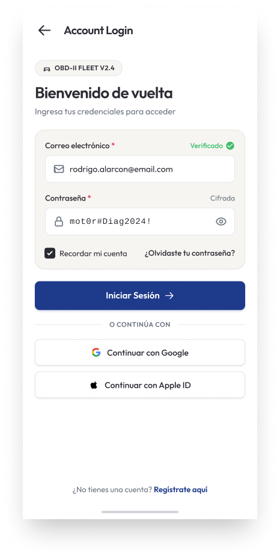 
      <small><b>Figura 184.</b> Mockup Paso 1: Inicio de Sesión Taller Mecánico B2B (US002)</small>
    </td>
    <td align="center" style="border: none; padding: 6px; vertical-align: top; width: 50%;">
       
      <small><b>Figura 185.</b> Mockup Paso 2: Inicio de Sesión Conductor B2C (US002)</small>
    </td>
  </tr>
</table>

**Análisis visual y componentes UI de la secuencia de mockups:**
- **Paso 1 (Inicio de Sesión Taller Mecánico B2B - US002):** Interfaz de ingreso para personal de taller con soporte para credenciales corporativas, recordación de sesión y Google OAuth2.
- **Paso 2 (Inicio de Sesión Conductor B2C - US002):** Vista optimizada para conductores particulares con login directo por correo electrónico, teléfono móvil o autenticación biométrica.

##### Flujo 1.3: Recuperación de Cuenta y Verificación OTP (B2B y B2C)

Como se aprecia en la secuencia visual de alta fidelidad de las **Figuras 186 a 193**, el diseño final incorpora la identidad cromática corporativa (`#1E3A8A`), componentes táctiles enriquecidos y microinteracciones de estado a lo largo del flujo:

<table align="center" style="border: none; border-collapse: collapse; margin: 16px auto; width: 100%;">
  <tr style="border: none;">
    <td align="center" style="border: none; padding: 6px; vertical-align: top; width: 12%;">
      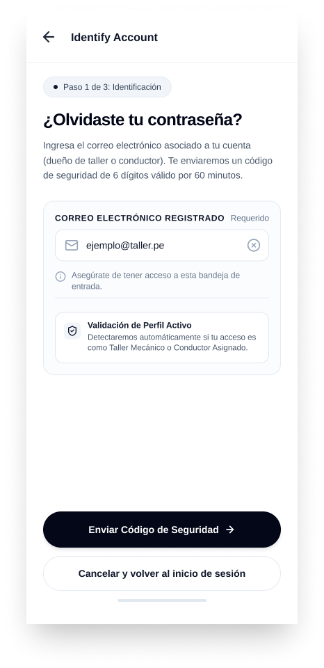 
      <small><b>Figura 186.</b> Mockup Paso 1: Recuperación B2B Paso 1: Solicitud de Código (US004)</small>
    </td>
    <td align="center" style="border: none; padding: 6px; vertical-align: top; width: 12%;">
       
      <small><b>Figura 187.</b> Mockup Paso 2: Recuperación B2B Paso 2: Verificación OTP (US004)</small>
    </td>
    <td align="center" style="border: none; padding: 6px; vertical-align: top; width: 12%;">
      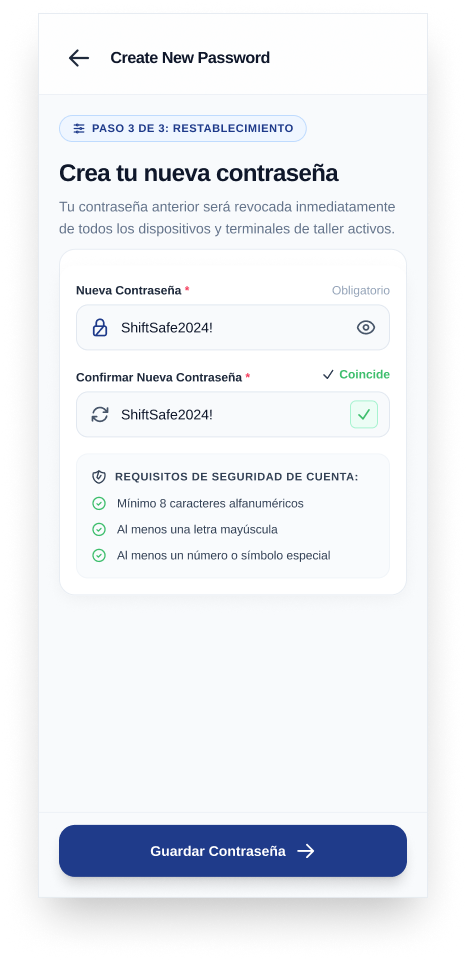 
      <small><b>Figura 188.</b> Mockup Paso 3: Recuperación B2B Paso 3: Definición de Nueva Clave (US004)</small>
    </td>
    <td align="center" style="border: none; padding: 6px; vertical-align: top; width: 12%;">
      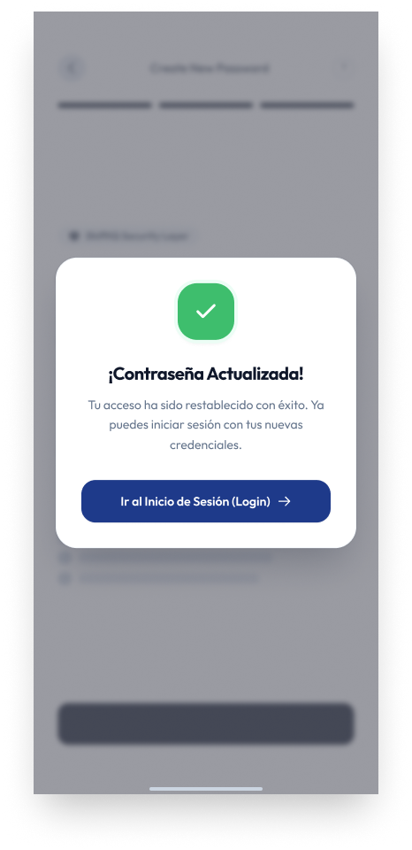 
      <small><b>Figura 189.</b> Mockup Paso 4: Recuperación B2B Paso 3B: Confirmación de Restablecimiento (US004)</small>
    </td>
    <td align="center" style="border: none; padding: 6px; vertical-align: top; width: 12%;">
      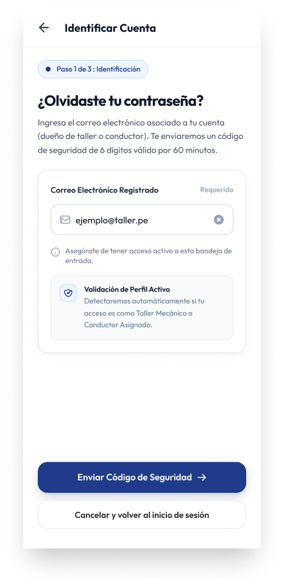 
      <small><b>Figura 190.</b> Mockup Paso 5: Recuperación B2C Paso 1: Solicitud de Código Conductor (US004)</small>
    </td>
    <td align="center" style="border: none; padding: 6px; vertical-align: top; width: 12%;">
      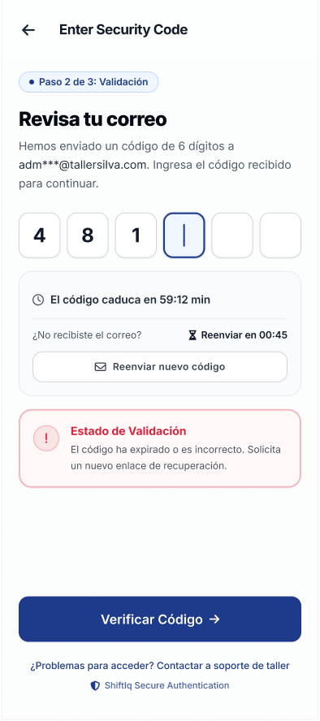 
      <small><b>Figura 191.</b> Mockup Paso 6: Recuperación B2C Paso 2: Validación OTP Conductor (US004)</small>
    </td>
    <td align="center" style="border: none; padding: 6px; vertical-align: top; width: 12%;">
      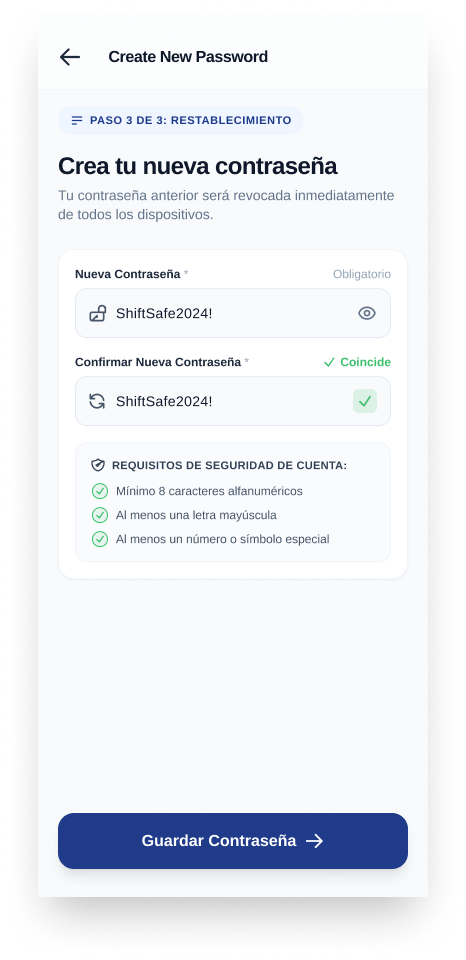 
      <small><b>Figura 192.</b> Mockup Paso 7: Recuperación B2C Paso 3: Renovación de Clave (US004)</small>
    </td>
    <td align="center" style="border: none; padding: 6px; vertical-align: top; width: 12%;">
      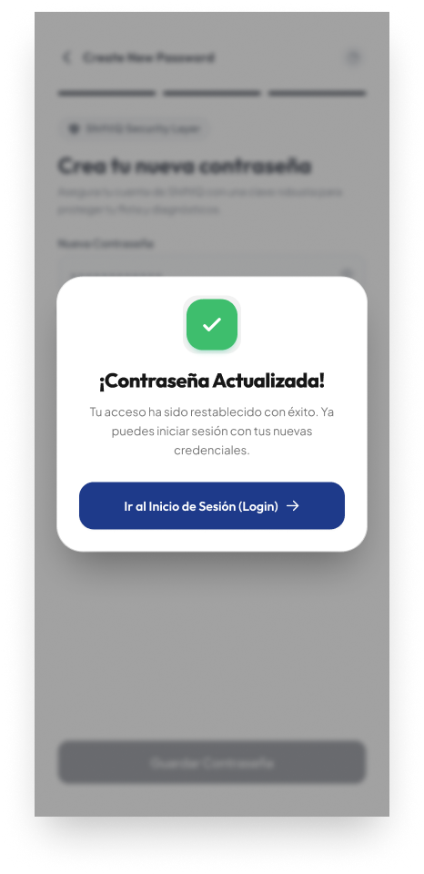 
      <small><b>Figura 193.</b> Mockup Paso 8: Recuperación B2C Paso 3B: Éxito de Restablecimiento (US004)</small>
    </td>
  </tr>
</table>

**Análisis visual y componentes UI de la secuencia de mockups:**
- **Paso 1 (Recuperación B2B Paso 1: Solicitud de Código - US004):** Ingreso del correo electrónico corporativo registrado para el envío de un código de verificación de un solo uso (OTP).
- **Paso 2 (Recuperación B2B Paso 2: Verificación OTP - US004):** Desafío de 6 dígitos numéricos con temporizador de expiración regresivo de 60 segundos y opción de reenvío.
- **Paso 3 (Recuperación B2B Paso 3: Definición de Nueva Clave - US004):** Establecimiento de nueva contraseña con medidor de robustez criptográfica y confirmación de caracteres.
- **Paso 4 (Recuperación B2B Paso 3B: Confirmación de Restablecimiento - US004):** Modal de confirmación exitosa con botón para redirigir directamente al inicio de sesión con las nuevas credenciales.
- **Paso 5 (Recuperación B2C Paso 1: Solicitud de Código Conductor - US004):** Petición de restablecimiento de cuenta para conductores con envío de SMS o correo de verificación seguro.
- **Paso 6 (Recuperación B2C Paso 2: Validación OTP Conductor - US004):** Verificación de autenticidad del conductor mediante código temporal de un solo uso con soporte de teclado numérico.
- **Paso 7 (Recuperación B2C Paso 3: Renovación de Clave - US004):** Actualización de credenciales personales de acceso para el aplicativo móvil del conductor.
- **Paso 8 (Recuperación B2C Paso 3B: Éxito de Restablecimiento - US004):** Notificación de confirmación de clave actualizada redirigiendo al dashboard del conductor.

##### Flujo 1.4: Perfil de Usuario, Actualización de Correo y Seguridad

Como se aprecia en la secuencia visual de alta fidelidad de las **Figuras 194 a 201**, el diseño final incorpora la identidad cromática corporativa (`#1E3A8A`), componentes táctiles enriquecidos y microinteracciones de estado a lo largo del flujo:

<table align="center" style="border: none; border-collapse: collapse; margin: 16px auto; width: 100%;">
  <tr style="border: none;">
    <td align="center" style="border: none; padding: 6px; vertical-align: top; width: 12%;">
       
      <small><b>Figura 194.</b> Mockup Paso 1: Mi Perfil y Ajustes de Cuenta (US035)</small>
    </td>
    <td align="center" style="border: none; padding: 6px; vertical-align: top; width: 12%;">
      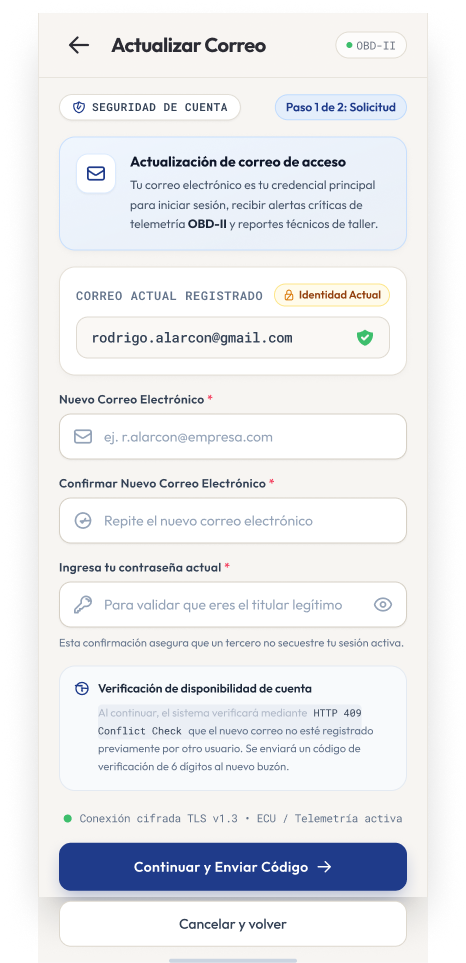 
      <small><b>Figura 195.</b> Mockup Paso 2: Actualización de Correo Paso 1 (US035)</small>
    </td>
    <td align="center" style="border: none; padding: 6px; vertical-align: top; width: 12%;">
       
      <small><b>Figura 196.</b> Mockup Paso 3: Verificación de Código de Nuevo Correo (US035)</small>
    </td>
    <td align="center" style="border: none; padding: 6px; vertical-align: top; width: 12%;">
      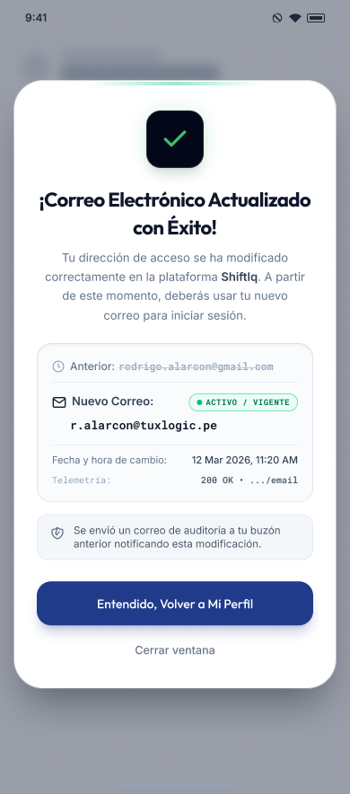 
      <small><b>Figura 197.</b> Mockup Paso 4: Confirmación de Actualización de Correo (US035)</small>
    </td>
    <td align="center" style="border: none; padding: 6px; vertical-align: top; width: 12%;">
      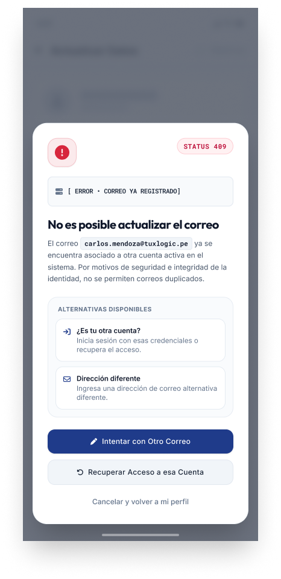 
      <small><b>Figura 198.</b> Mockup Paso 5: Conflicto por Correo Duplicado (Error 409) (US035)</small>
    </td>
    <td align="center" style="border: none; padding: 6px; vertical-align: top; width: 12%;">
       
      <small><b>Figura 199.</b> Mockup Paso 6: Cambio de Contraseña Autenticado (US036)</small>
    </td>
    <td align="center" style="border: none; padding: 6px; vertical-align: top; width: 12%;">
      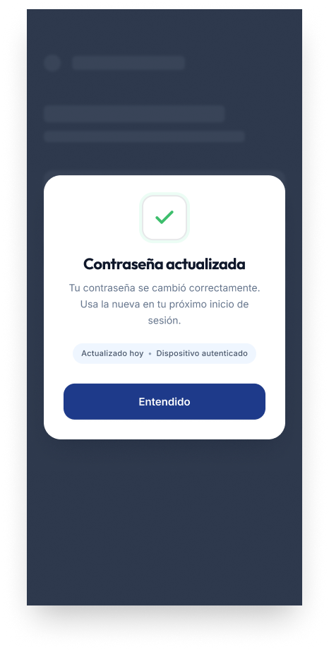 
      <small><b>Figura 200.</b> Mockup Paso 7: Confirmación de Cambio de Contraseña (US036)</small>
    </td>
    <td align="center" style="border: none; padding: 6px; vertical-align: top; width: 12%;">
      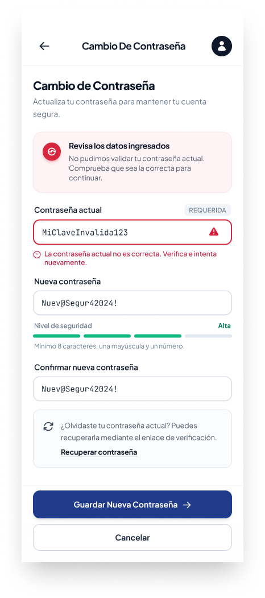 
      <small><b>Figura 201.</b> Mockup Paso 8: Error de Validación en Cambio de Contraseña (US036)</small>
    </td>
  </tr>
</table>

**Análisis visual y componentes UI de la secuencia de mockups:**
- **Paso 1 (Mi Perfil y Ajustes de Cuenta - US035):** Panel central de perfil con avatar, sede asignada, rol activo y accesos directos para cambiar contraseña o correo.
- **Paso 2 (Actualización de Correo Paso 1 - US035):** Ingreso de la nueva dirección de correo electrónico con validación de sintaxis antes del envío de verificación.
- **Paso 3 (Verificación de Código de Nuevo Correo - US035):** Comprobación de token numérico enviado al nuevo buzón para certificar la titularidad del usuario.
- **Paso 4 (Confirmación de Actualización de Correo - US035):** Modal interactivo de éxito que confirma la actualización del identificador de acceso principal.
- **Paso 5 (Conflicto por Correo Duplicado (Error 409) - US035):** Mensaje de advertencia modal cuando el correo ingresado ya pertenece a otra cuenta activa en el sistema.
- **Paso 6 (Cambio de Contraseña Autenticado - US036):** Formulario de cambio de clave dentro de la sesión activa con chequeo reactivo de políticas de seguridad.
- **Paso 7 (Confirmación de Cambio de Contraseña - US036):** Retroalimentación visual positiva indicando que la clave fue renovada y las sesiones previas revocadas.
- **Paso 8 (Error de Validación en Cambio de Contraseña - US036):** Notificación de error ante discrepancia en la confirmación o incumplimiento de complejidad de contraseña.

#### Módulo 2: Gestión de Talleres, Sucursales y Licenciamiento (Workshop Management) - Secuencias de Mockups (Alta Fidelidad)
*Historias de Usuario cubiertas: US005, US006, US007*

##### Flujo 2.1: Consola de Operaciones y Navegación de Planta

Como se aprecia en la secuencia visual de alta fidelidad de las **Figuras 202 a 203**, el diseño final incorpora la identidad cromática corporativa (`#1E3A8A`), componentes táctiles enriquecidos y microinteracciones de estado a lo largo del flujo:

<table align="center" style="border: none; border-collapse: collapse; margin: 16px auto; width: 100%;">
  <tr style="border: none;">
    <td align="center" style="border: none; padding: 6px; vertical-align: top; width: 50%;">
       
      <small><b>Figura 202.</b> Mockup Paso 1: Dashboard Operativo de Planta (US006)</small>
    </td>
    <td align="center" style="border: none; padding: 6px; vertical-align: top; width: 50%;">
      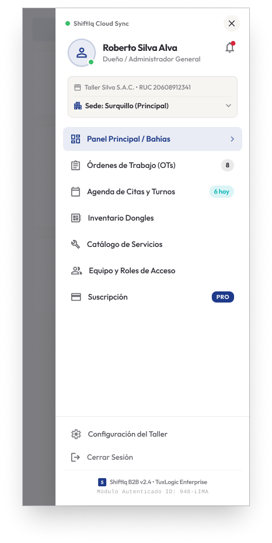 
      <small><b>Figura 203.</b> Mockup Paso 2: Navegación Lateral del Taller (Drawer) (US005)</small>
    </td>
  </tr>
</table>

**Análisis visual y componentes UI de la secuencia de mockups:**
- **Paso 1 (Dashboard Operativo de Planta - US006):** Tablero central con tarjeta de ocupación de bahías (75%), citas del turno, órdenes en curso y alertas telemáticas prioritarias.
- **Paso 2 (Navegación Lateral del Taller (Drawer) - US005):** Menú ergonómico deslizable con accesos a Órdenes, Citas, Bahías, Inventario FIFO, Facturación y Configuración.

##### Flujo 2.2: Directorio de Personal, Alta de Empleado y Revocación de Accesos

Como se aprecia en la secuencia visual de alta fidelidad de las **Figuras 204 a 207**, el diseño final incorpora la identidad cromática corporativa (`#1E3A8A`), componentes táctiles enriquecidos y microinteracciones de estado a lo largo del flujo:

<table align="center" style="border: none; border-collapse: collapse; margin: 16px auto; width: 100%;">
  <tr style="border: none;">
    <td align="center" style="border: none; padding: 6px; vertical-align: top; width: 25%;">
       
      <small><b>Figura 204.</b> Mockup Paso 1: Directorio de Personal y Roles (US005)</small>
    </td>
    <td align="center" style="border: none; padding: 6px; vertical-align: top; width: 25%;">
      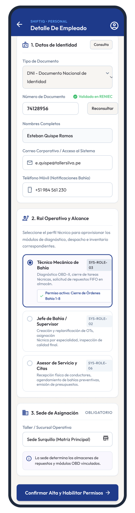 
      <small><b>Figura 205.</b> Mockup Paso 2: Alta de Nuevo Empleado y Asignación de Rol (US005)</small>
    </td>
    <td align="center" style="border: none; padding: 6px; vertical-align: top; width: 25%;">
      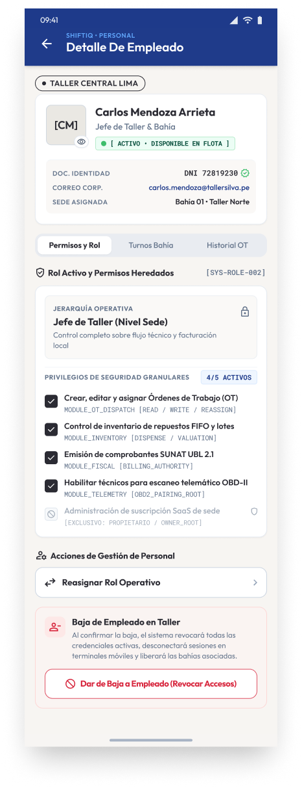 
      <small><b>Figura 206.</b> Mockup Paso 3: Ficha de Detalle de Empleado (US005)</small>
    </td>
    <td align="center" style="border: none; padding: 6px; vertical-align: top; width: 25%;">
      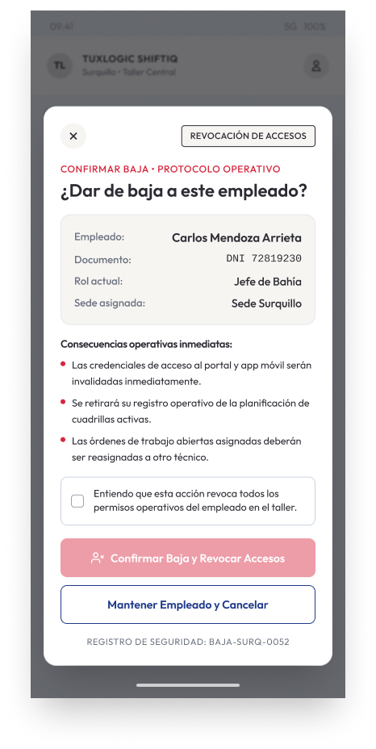 
      <small><b>Figura 207.</b> Mockup Paso 4: Confirmar Baja y Revocar Accesos (US005)</small>
    </td>
  </tr>
</table>

**Análisis visual y componentes UI de la secuencia de mockups:**
- **Paso 1 (Directorio de Personal y Roles - US005):** Padrón general de colaboradores con cargo (Mecánico, Administrador, Cajero), estado activo y filtros por sede.
- **Paso 2 (Alta de Nuevo Empleado y Asignación de Rol - US005):** Formulario de registro de técnico con nombre, documento de identidad, especialidad y credenciales iniciales.
- **Paso 3 (Ficha de Detalle de Empleado - US005):** Vista detallada de carga laboral del mecánico, órdenes asignadas, historial de productividad y teléfono.
- **Paso 4 (Confirmar Baja y Revocar Accesos - US005):** Modal de seguridad para desvinculación de técnico y anulación inmediata de tokens de acceso al sistema.

##### Flujo 2.3: Sucursales, Capacidad de Bahías y Suscripción SaaS

Como se aprecia en la secuencia visual de alta fidelidad de las **Figuras 208 a 214**, el diseño final incorpora la identidad cromática corporativa (`#1E3A8A`), componentes táctiles enriquecidos y microinteracciones de estado a lo largo del flujo:

<table align="center" style="border: none; border-collapse: collapse; margin: 16px auto; width: 100%;">
  <tr style="border: none;">
    <td align="center" style="border: none; padding: 6px; vertical-align: top; width: 14%;">
      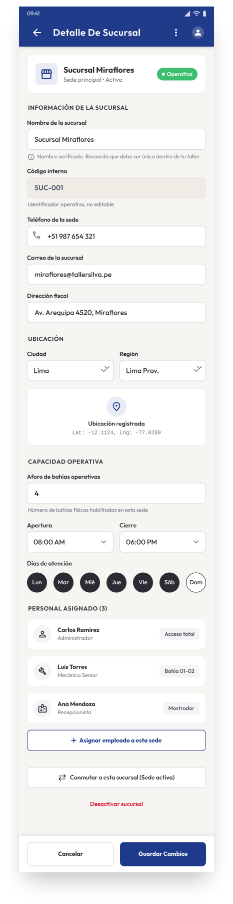 
      <small><b>Figura 208.</b> Mockup Paso 1: Detalle y Capacidad Operativa de Sucursal (US006)</small>
    </td>
    <td align="center" style="border: none; padding: 6px; vertical-align: top; width: 14%;">
      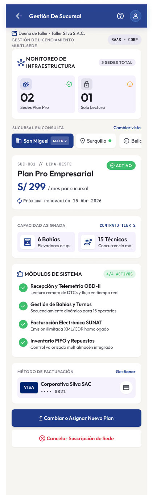 
      <small><b>Figura 209.</b> Mockup Paso 2: Administración de Suscripción por Sucursal (US007)</small>
    </td>
    <td align="center" style="border: none; padding: 6px; vertical-align: top; width: 14%;">
      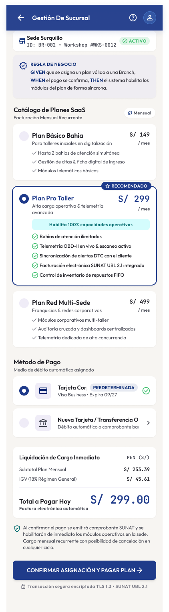 
      <small><b>Figura 210.</b> Mockup Paso 3: Asignación y Cambio de Plan SaaS (US007)</small>
    </td>
    <td align="center" style="border: none; padding: 6px; vertical-align: top; width: 14%;">
      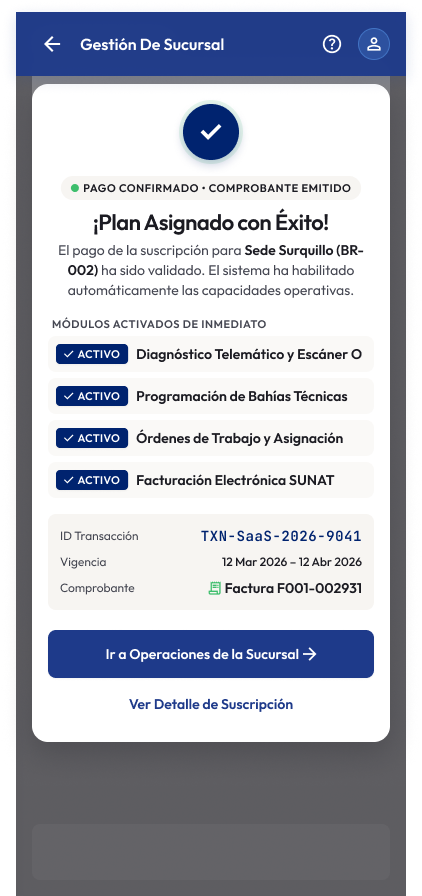 
      <small><b>Figura 211.</b> Mockup Paso 4: Activación Exitosa de Módulos Telemáticos (US007)</small>
    </td>
    <td align="center" style="border: none; padding: 6px; vertical-align: top; width: 14%;">
      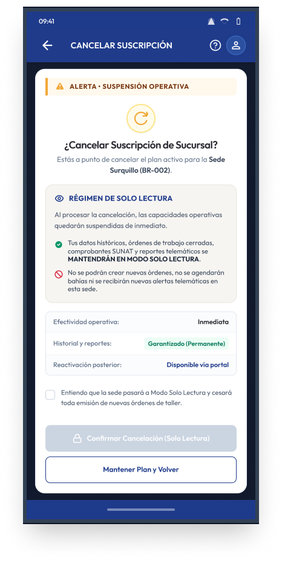 
      <small><b>Figura 212.</b> Mockup Paso 5: Cancelación de Plan y Modo Solo Lectura (US007)</small>
    </td>
    <td align="center" style="border: none; padding: 6px; vertical-align: top; width: 14%;">
      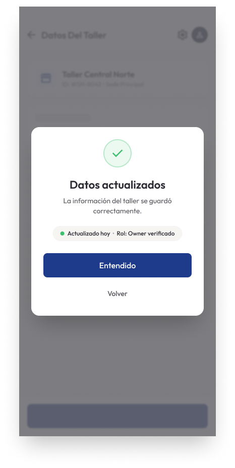 
      <small><b>Figura 213.</b> Mockup Paso 6: Confirmación de Actualización de Datos del Taller (US006)</small>
    </td>
    <td align="center" style="border: none; padding: 6px; vertical-align: top; width: 14%;">
      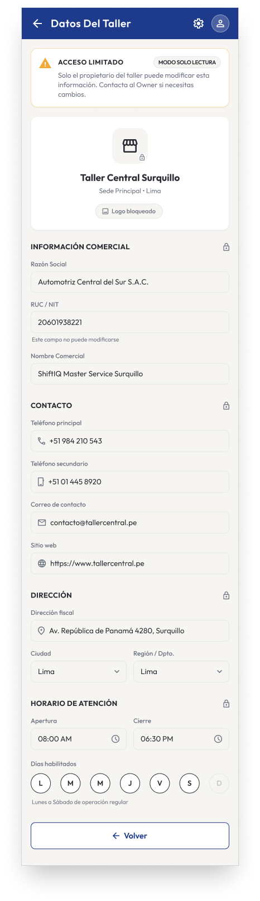 
      <small><b>Figura 214.</b> Mockup Paso 7: Ficha de Taller en Modo Solo Lectura (US006)</small>
    </td>
  </tr>
</table>

**Análisis visual y componentes UI de la secuencia de mockups:**
- **Paso 1 (Detalle y Capacidad Operativa de Sucursal - US006):** Información operativa de la sede: dirección, teléfono, cantidad de elevadores habilitados y mapa de ubicación.
- **Paso 2 (Administración de Suscripción por Sucursal - US007):** Panel de control del plan contratado (Profesional / Enterprise), fecha de renovación y estado de facturación SaaS.
- **Paso 3 (Asignación y Cambio de Plan SaaS - US007):** Selector comparativo de planes comerciales con detalle de bahías permitidas y módulos habilitados.
- **Paso 4 (Activación Exitosa de Módulos Telemáticos - US007):** Modal de confirmación tras habilitar funciones avanzadas de telemetría OBD-II y diagnósticos automotrices.
- **Paso 5 (Cancelación de Plan y Modo Solo Lectura - US007):** Pantalla informativa ante expiración de suscripción limitando las acciones a consulta histórica sin nuevas OTs.
- **Paso 6 (Confirmación de Actualización de Datos del Taller - US006):** Confirmación exitosa tras la edición de datos fiscales y horarios de atención de la sede.
- **Paso 7 (Ficha de Taller en Modo Solo Lectura - US006):** Visualización restringida de datos corporativos de la sucursal para roles sin permisos de edición.

#### Módulo 3: Inteligencia Vehicular y Diagnóstico OBD-II (Vehicle Intelligence & Diagnostics) - Secuencias de Mockups (Alta Fidelidad)
*Historias de Usuario cubiertas: US017, US018, US019, US020, US021, US023, US025*

##### Flujo 3.1: Enrolamiento de Vehículo y Ficha Telemática

Como se aprecia en la secuencia visual de alta fidelidad de las **Figuras 215 a 216**, el diseño final incorpora la identidad cromática corporativa (`#1E3A8A`), componentes táctiles enriquecidos y microinteracciones de estado a lo largo del flujo:

<table align="center" style="border: none; border-collapse: collapse; margin: 16px auto; width: 100%;">
  <tr style="border: none;">
    <td align="center" style="border: none; padding: 6px; vertical-align: top; width: 50%;">
      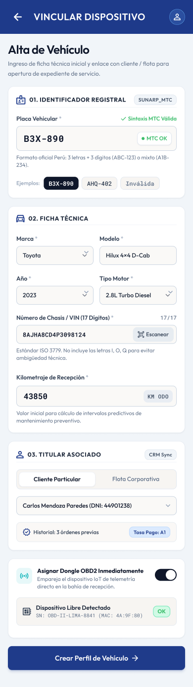 
      <small><b>Figura 215.</b> Mockup Paso 1: Registro de Vehículo en Taller (US017)</small>
    </td>
    <td align="center" style="border: none; padding: 6px; vertical-align: top; width: 50%;">
      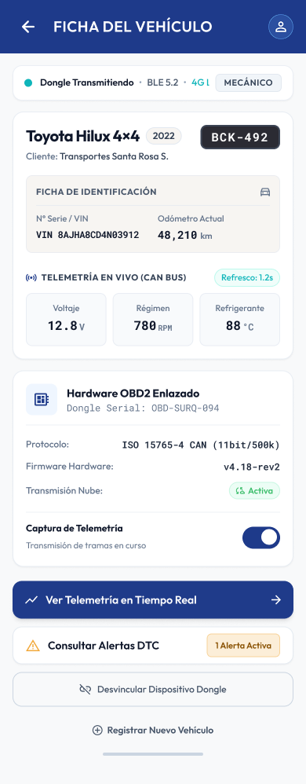 
      <small><b>Figura 216.</b> Mockup Paso 2: Ficha del Vehículo y Estado OBD-II (US017)</small>
    </td>
  </tr>
</table>

**Análisis visual y componentes UI de la secuencia de mockups:**
- **Paso 1 (Registro de Vehículo en Taller - US017):** Formulario de ingreso vehicular con captura de placa peruana, marca, modelo, año, VIN y kilometraje de recepción.
- **Paso 2 (Ficha del Vehículo y Estado OBD-II - US017):** Hoja de vida digital del automóvil con historial de visitas técnicas y estado de enlace del dongle telemático.

##### Flujo 3.2: Vinculación y Gestión de Dongles OBD-II Bluetooth

Como se aprecia en la secuencia visual de alta fidelidad de las **Figuras 217 a 222**, el diseño final incorpora la identidad cromática corporativa (`#1E3A8A`), componentes táctiles enriquecidos y microinteracciones de estado a lo largo del flujo:

<table align="center" style="border: none; border-collapse: collapse; margin: 16px auto; width: 100%;">
  <tr style="border: none;">
    <td align="center" style="border: none; padding: 6px; vertical-align: top; width: 16%;">
      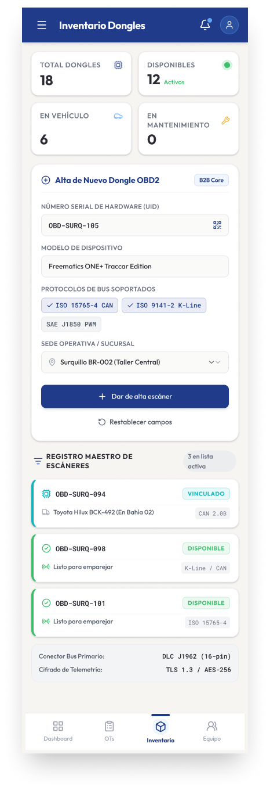 
      <small><b>Figura 217.</b> Mockup Paso 1: Inventario y Registro de Dongles OBD-II (US021)</small>
    </td>
    <td align="center" style="border: none; padding: 6px; vertical-align: top; width: 16%;">
      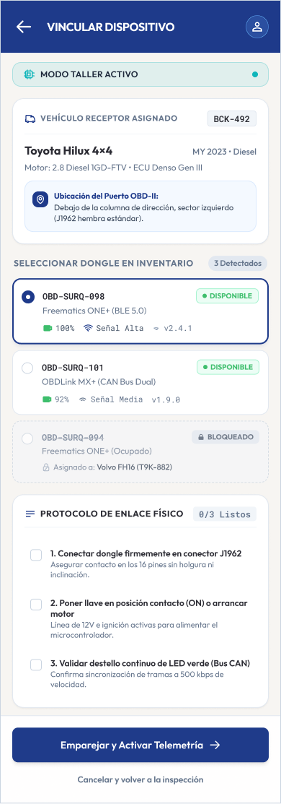 
      <small><b>Figura 218.</b> Mockup Paso 2: Búsqueda y Vinculación de Dongle OBD-II (US018)</small>
    </td>
    <td align="center" style="border: none; padding: 6px; vertical-align: top; width: 16%;">
      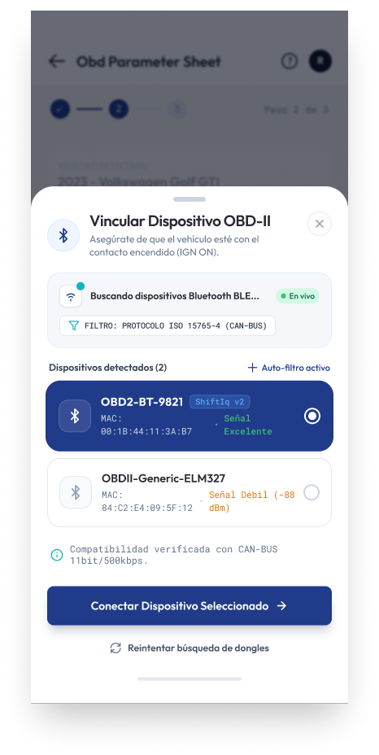 
      <small><b>Figura 219.</b> Mockup Paso 3: Panel Inferior (Bottom Sheet) de Vinculación (US018)</small>
    </td>
    <td align="center" style="border: none; padding: 6px; vertical-align: top; width: 16%;">
      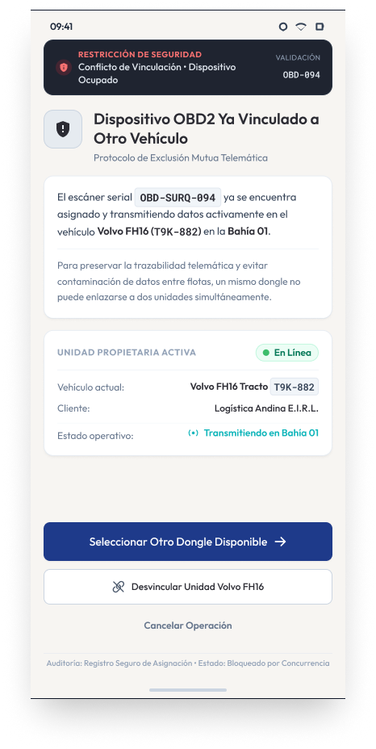 
      <small><b>Figura 220.</b> Mockup Paso 4: Aviso de Dispositivo OBD-II Ya Vinculado (US018)</small>
    </td>
    <td align="center" style="border: none; padding: 6px; vertical-align: top; width: 16%;">
      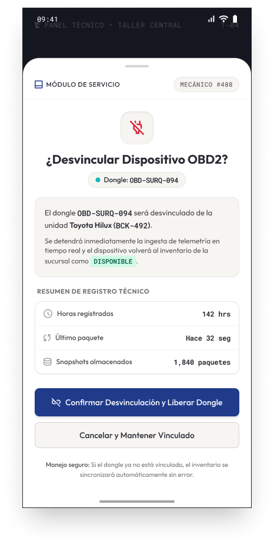 
      <small><b>Figura 221.</b> Mockup Paso 5: Confirmar Desvinculación de Escáner (US020)</small>
    </td>
    <td align="center" style="border: none; padding: 6px; vertical-align: top; width: 16%;">
      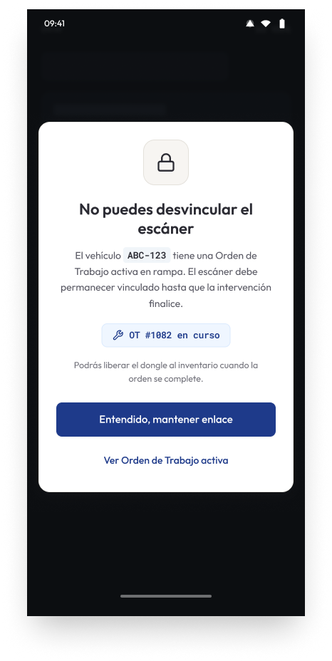 
      <small><b>Figura 222.</b> Mockup Paso 6: Error al Desvincular Escáner OBD-II (US020)</small>
    </td>
  </tr>
</table>

**Análisis visual y componentes UI de la secuencia de mockups:**
- **Paso 1 (Inventario y Registro de Dongles OBD-II - US021):** Control de escáneres propiedad del taller con número de serie, versión de firmware y asignación a bahías.
- **Paso 2 (Búsqueda y Vinculación de Dongle OBD-II - US018):** Escaneo de dispositivos Bluetooth BLE cercanos con intensidad de señal RSSI y botón de enlace directo.
- **Paso 3 (Panel Inferior (Bottom Sheet) de Vinculación - US018):** Modal contextual deslizable con instrucciones de conexión al puerto OBD-II y confirmación de handshake.
- **Paso 4 (Aviso de Dispositivo OBD-II Ya Vinculado - US018):** Alerta informativa cuando el escáner seleccionado ya se encuentra enlazado a otra orden de trabajo activa.
- **Paso 5 (Confirmar Desvinculación de Escáner - US020):** Diálogo de confirmación para liberar el dispositivo Bluetooth al finalizar el diagnóstico del automóvil.
- **Paso 6 (Error al Desvincular Escáner OBD-II - US020):** Retroalimentación de fallo por pérdida repentina de conexión BLE o proceso de lectura telemática en ejecución.

##### Flujo 3.3: Telemetría en Vivo, Cola de Sincronización y Modo Offline

Como se aprecia en la secuencia visual de alta fidelidad de las **Figuras 223 a 225**, el diseño final incorpora la identidad cromática corporativa (`#1E3A8A`), componentes táctiles enriquecidos y microinteracciones de estado a lo largo del flujo:

<table align="center" style="border: none; border-collapse: collapse; margin: 16px auto; width: 100%;">
  <tr style="border: none;">
    <td align="center" style="border: none; padding: 6px; vertical-align: top; width: 33%;">
       
      <small><b>Figura 223.</b> Mockup Paso 1: Telemetría en Vivo de Sensores Automotrices (US019)</small>
    </td>
    <td align="center" style="border: none; padding: 6px; vertical-align: top; width: 33%;">
      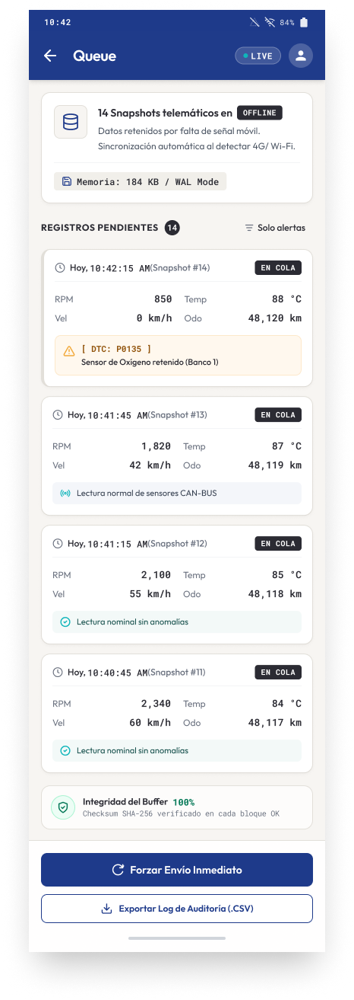 
      <small><b>Figura 224.</b> Mockup Paso 2: Gestión de Cola de Telemetría en Buffer (US025)</small>
    </td>
    <td align="center" style="border: none; padding: 6px; vertical-align: top; width: 33%;">
       
      <small><b>Figura 225.</b> Mockup Paso 3: Modo Offline y Telemetría Autónoma (US025)</small>
    </td>
  </tr>
</table>

**Análisis visual y componentes UI de la secuencia de mockups:**
- **Paso 1 (Telemetría en Vivo de Sensores Automotrices - US019):** Tacómetros en tiempo real para RPM de motor, velocidad km/h, temperatura del refrigerante y voltaje de alternador.
- **Paso 2 (Gestión de Cola de Telemetría en Buffer - US025):** Monitor de eventos almacenados localmente en SQLite listos para sincronización con la API central.
- **Paso 3 (Modo Offline y Telemetría Autónoma - US025):** Indicador de operación sin conexión a internet manteniendo la captura continua de sensores en memoria local.

##### Flujo 3.4: Escaneo Electrónico de ECUs y Diagnóstico de Fallas DTC

Como se aprecia en la secuencia visual de alta fidelidad de las **Figuras 226 a 231**, el diseño final incorpora la identidad cromática corporativa (`#1E3A8A`), componentes táctiles enriquecidos y microinteracciones de estado a lo largo del flujo:

<table align="center" style="border: none; border-collapse: collapse; margin: 16px auto; width: 100%;">
  <tr style="border: none;">
    <td align="center" style="border: none; padding: 6px; vertical-align: top; width: 16%;">
       
      <small><b>Figura 226.</b> Mockup Paso 1: Escaneo OBD-II de ECUs en Curso (US023)</small>
    </td>
    <td align="center" style="border: none; padding: 6px; vertical-align: top; width: 16%;">
      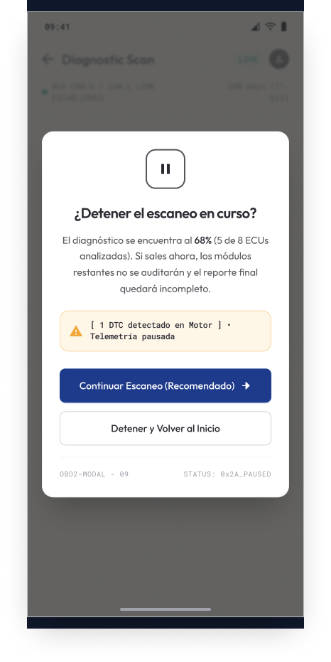 
      <small><b>Figura 227.</b> Mockup Paso 2: Interrupción Controlada del Escaneo (US023)</small>
    </td>
    <td align="center" style="border: none; padding: 6px; vertical-align: top; width: 16%;">
       
      <small><b>Figura 228.</b> Mockup Paso 3: Consulta de Códigos de Falla DTC Detectados (US023)</small>
    </td>
    <td align="center" style="border: none; padding: 6px; vertical-align: top; width: 16%;">
      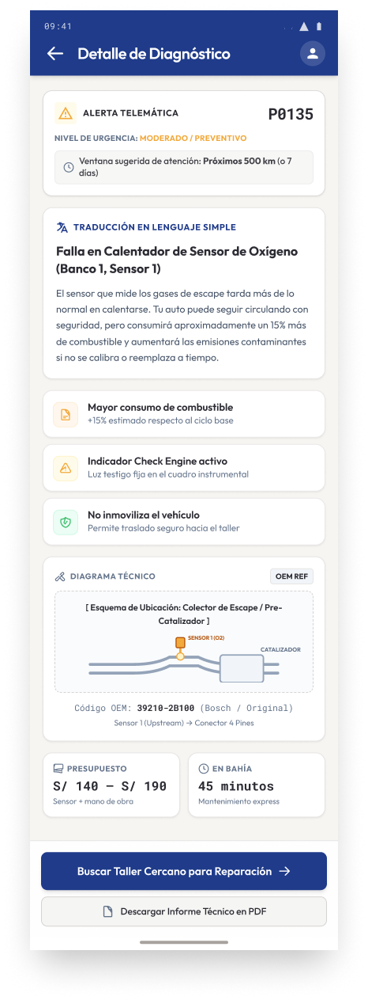 
      <small><b>Figura 229.</b> Mockup Paso 4: Detalle DTC con Traducción Simple y Solución (US023)</small>
    </td>
    <td align="center" style="border: none; padding: 6px; vertical-align: top; width: 16%;">
      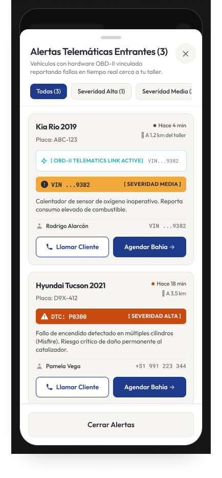 
      <small><b>Figura 230.</b> Mockup Paso 5: Modal de Alertas Telemáticas Entrantes (US023)</small>
    </td>
    <td align="center" style="border: none; padding: 6px; vertical-align: top; width: 16%;">
      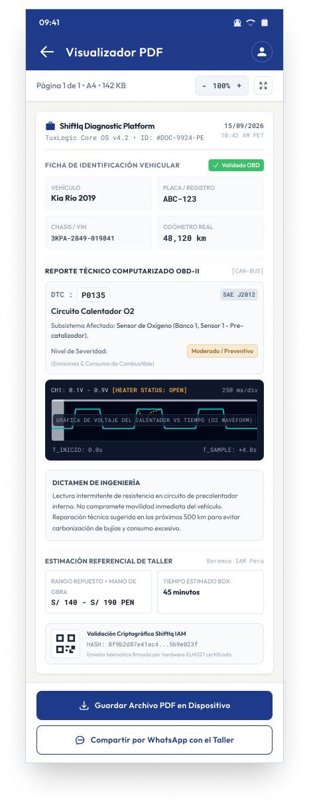 
      <small><b>Figura 231.</b> Mockup Paso 6: Visor de Reporte de Diagnóstico Técnico en PDF (US023)</small>
    </td>
  </tr>
</table>

**Análisis visual y componentes UI de la secuencia de mockups:**
- **Paso 1 (Escaneo OBD-II de ECUs en Curso - US023):** Barra de progreso animada con sondeo por subsistemas: Motor, Transmisión, Frenos ABS y Módulo de Emisiones.
- **Paso 2 (Interrupción Controlada del Escaneo - US023):** Modal de cancelación segura del sondeo telemático preservando las fallas leídas hasta el momento.
- **Paso 3 (Consulta de Códigos de Falla DTC Detectados - US023):** Listado de códigos estándar SAE (P0135, P0300) con categorización cromática por severidad crítica o preventiva.
- **Paso 4 (Detalle DTC con Traducción Simple y Solución - US023):** Explicación en lenguaje cotidiano del síntoma mecánico, causa probable y sugerencia técnica de reparación.
- **Paso 5 (Modal de Alertas Telemáticas Entrantes - US023):** Notificación emergente en el taller ante fallas críticas transmitidas por vehículos en circulación.
- **Paso 6 (Visor de Reporte de Diagnóstico Técnico en PDF - US023):** Visualizador integrado del informe telemático con firmas digitales, lecturas de sensores y fallas DTC listo para exportar.

#### Módulo 4: Flotas y Agenda de Citas Técnicas (Fleet & Appointments) - Secuencias de Mockups (Alta Fidelidad)
*Historias de Usuario cubiertas: US026, US028, US029, US030, US031, US032*

##### Flujo 4.1: Agenda de Citas Técnicas y Reserva de Bahías

Como se aprecia en la secuencia visual de alta fidelidad de las **Figuras 232 a 238**, el diseño final incorpora la identidad cromática corporativa (`#1E3A8A`), componentes táctiles enriquecidos y microinteracciones de estado a lo largo del flujo:

<table align="center" style="border: none; border-collapse: collapse; margin: 16px auto; width: 100%;">
  <tr style="border: none;">
    <td align="center" style="border: none; padding: 6px; vertical-align: top; width: 14%;">
       
      <small><b>Figura 232.</b> Mockup Paso 1: Agenda de Citas de Sucursal (US029)</small>
    </td>
    <td align="center" style="border: none; padding: 6px; vertical-align: top; width: 14%;">
       
      <small><b>Figura 233.</b> Mockup Paso 2: Asignación de Bahía y Elevador Técnico (US028)</small>
    </td>
    <td align="center" style="border: none; padding: 6px; vertical-align: top; width: 14%;">
      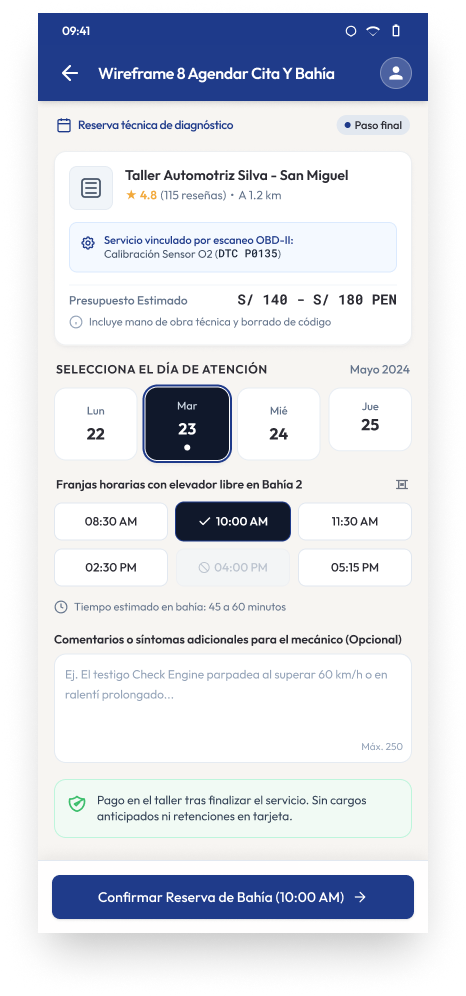 
      <small><b>Figura 234.</b> Mockup Paso 3: Formulario Completo de Agendamiento (US028)</small>
    </td>
    <td align="center" style="border: none; padding: 6px; vertical-align: top; width: 14%;">
      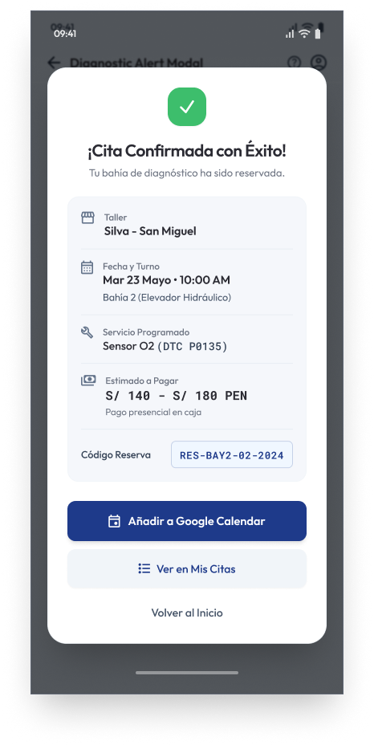 
      <small><b>Figura 235.</b> Mockup Paso 4: Diálogo de Confirmación de Cita (US028)</small>
    </td>
    <td align="center" style="border: none; padding: 6px; vertical-align: top; width: 14%;">
      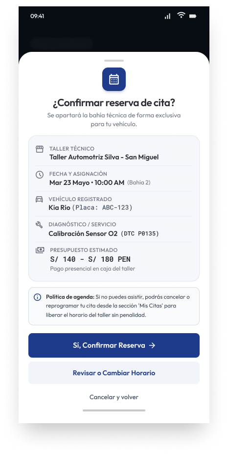 
      <small><b>Figura 236.</b> Mockup Paso 5: Pantalla de Cita Confirmada con Éxito (US028)</small>
    </td>
    <td align="center" style="border: none; padding: 6px; vertical-align: top; width: 14%;">
      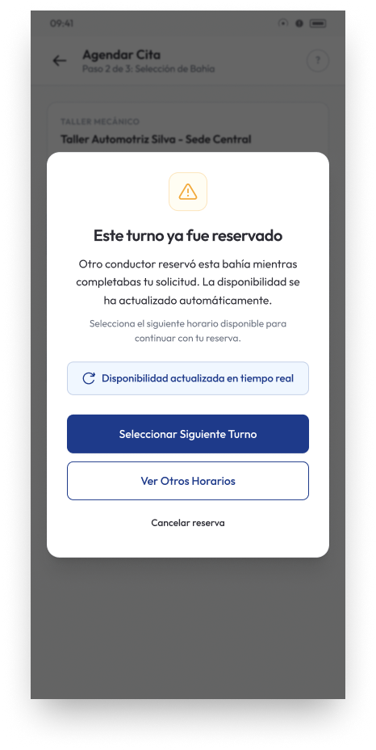 
      <small><b>Figura 237.</b> Mockup Paso 6: Conflicto de Horario o Bahía Ocupada (US028)</small>
    </td>
    <td align="center" style="border: none; padding: 6px; vertical-align: top; width: 14%;">
      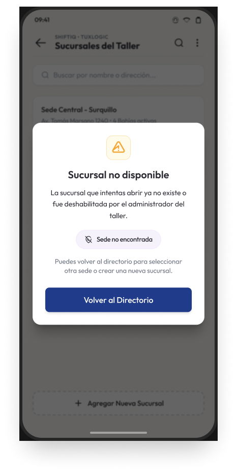 
      <small><b>Figura 238.</b> Mockup Paso 7: Sucursal Fuera de Capacidad o Inactiva (US028)</small>
    </td>
  </tr>
</table>

**Análisis visual y componentes UI de la secuencia de mockups:**
- **Paso 1 (Agenda de Citas de Sucursal - US029):** Vista de calendario interactivo por día y semana con turnos ocupados, pendientes de confirmación y libres.
- **Paso 2 (Asignación de Bahía y Elevador Técnico - US028):** Selector de bahía física específica (Elevador 1, Fosa de Alineación) con horario estimado de ocupación.
- **Paso 3 (Formulario Completo de Agendamiento - US028):** Registro de cliente, vehículo, motivo de visita técnica, bahía asignada y duración aproximada del trabajo.
- **Paso 4 (Diálogo de Confirmación de Cita - US028):** Modal de resumen con código de reserva, hora acordada y recordatorio automático programado vía WhatsApp/SMS.
- **Paso 5 (Pantalla de Cita Confirmada con Éxito - US028):** Voucher digital de reserva con botones para añadir al calendario del dispositivo y compartir con el cliente.
- **Paso 6 (Conflicto de Horario o Bahía Ocupada - US028):** Alerta de colisión de turnos sugiriendo inmediatamente los siguientes bloques horarios disponibles en la misma sede.
- **Paso 7 (Sucursal Fuera de Capacidad o Inactiva - US028):** Aviso de mantenimiento de planta o saturación de capacidad operativa en la sede seleccionada.

##### Flujo 4.2: Reprogramación y Cancelación de Citas

Como se aprecia en la secuencia visual de alta fidelidad de las **Figuras 239 a 241**, el diseño final incorpora la identidad cromática corporativa (`#1E3A8A`), componentes táctiles enriquecidos y microinteracciones de estado a lo largo del flujo:

<table align="center" style="border: none; border-collapse: collapse; margin: 16px auto; width: 100%;">
  <tr style="border: none;">
    <td align="center" style="border: none; padding: 6px; vertical-align: top; width: 33%;">
      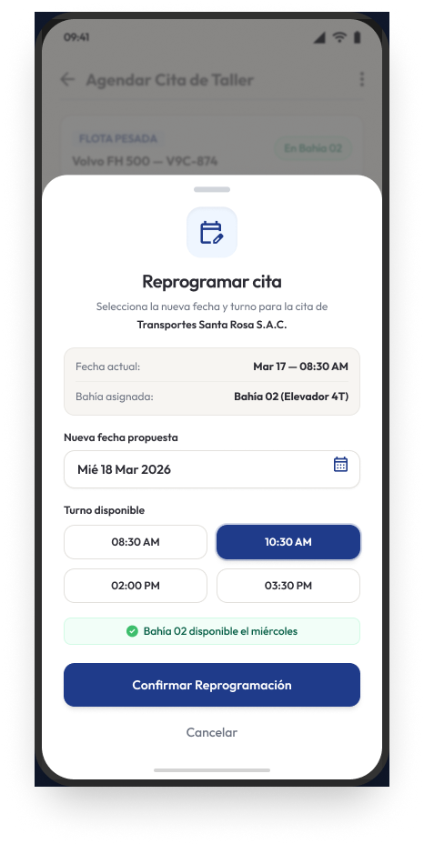 
      <small><b>Figura 239.</b> Mockup Paso 1: Reprogramación de Cita de Taller (US030)</small>
    </td>
    <td align="center" style="border: none; padding: 6px; vertical-align: top; width: 33%;">
       
      <small><b>Figura 240.</b> Mockup Paso 2: Cancelación de Cita con Registro de Causa (US030)</small>
    </td>
    <td align="center" style="border: none; padding: 6px; vertical-align: top; width: 33%;">
      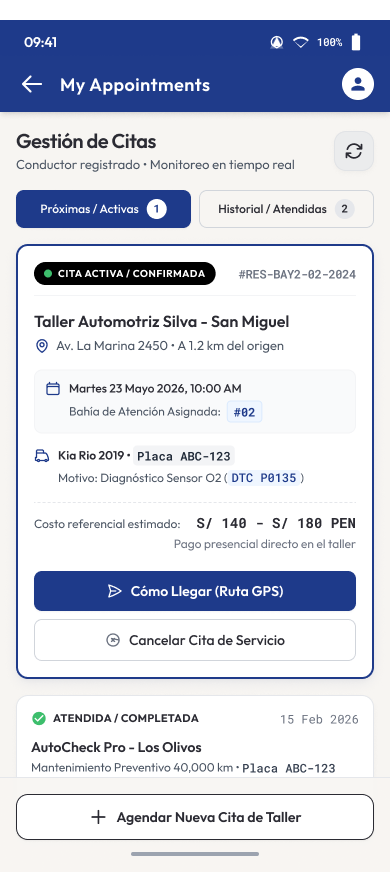 
      <small><b>Figura 241.</b> Mockup Paso 3: Historial de Citas y Estado de Cancelación (US030)</small>
    </td>
  </tr>
</table>

**Análisis visual y componentes UI de la secuencia de mockups:**
- **Paso 1 (Reprogramación de Cita de Taller - US030):** Selector interactivo de nueva fecha y franja horaria manteniendo los datos previos del vehículo.
- **Paso 2 (Cancelación de Cita con Registro de Causa - US030):** Diálogo de anulación con lista de motivos predefinidos para control estadístico de pérdidas de turno.
- **Paso 3 (Historial de Citas y Estado de Cancelación - US030):** Listado con estados cromáticos de citas: Programada, En Curso, Completada o Cancelada.

##### Flujo 4.3: Directorio de Clientes Corporativos y Flotas

Como se aprecia en la secuencia visual de alta fidelidad de las **Figuras 242 a 251**, el diseño final incorpora la identidad cromática corporativa (`#1E3A8A`), componentes táctiles enriquecidos y microinteracciones de estado a lo largo del flujo:

<table align="center" style="border: none; border-collapse: collapse; margin: 16px auto; width: 100%;">
  <tr style="border: none;">
    <td align="center" style="border: none; padding: 6px; vertical-align: top; width: 10%;">
       
      <small><b>Figura 242.</b> Mockup Paso 1: Directorio de Clientes y Flotas (US032)</small>
    </td>
    <td align="center" style="border: none; padding: 6px; vertical-align: top; width: 10%;">
       
      <small><b>Figura 243.</b> Mockup Paso 2: Formulario de Alta de Cliente o Flota (US032)</small>
    </td>
    <td align="center" style="border: none; padding: 6px; vertical-align: top; width: 10%;">
      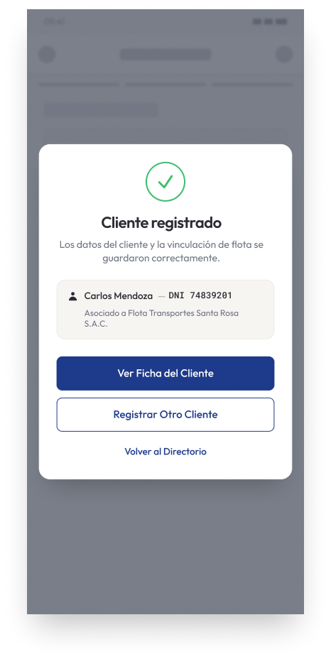 
      <small><b>Figura 244.</b> Mockup Paso 3: Confirmación de Cliente Registrado (US032)</small>
    </td>
    <td align="center" style="border: none; padding: 6px; vertical-align: top; width: 10%;">
      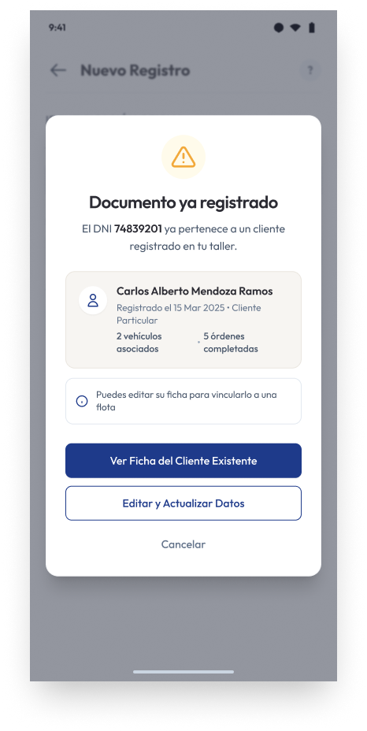 
      <small><b>Figura 245.</b> Mockup Paso 4: Error por RUC o Documento Duplicado (US032)</small>
    </td>
    <td align="center" style="border: none; padding: 6px; vertical-align: top; width: 10%;">
      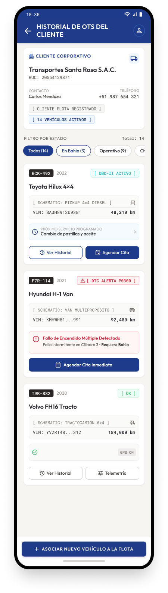 
      <small><b>Figura 246.</b> Mockup Paso 5: Padrón de Vehículos de la Flota (US026)</small>
    </td>
    <td align="center" style="border: none; padding: 6px; vertical-align: top; width: 10%;">
      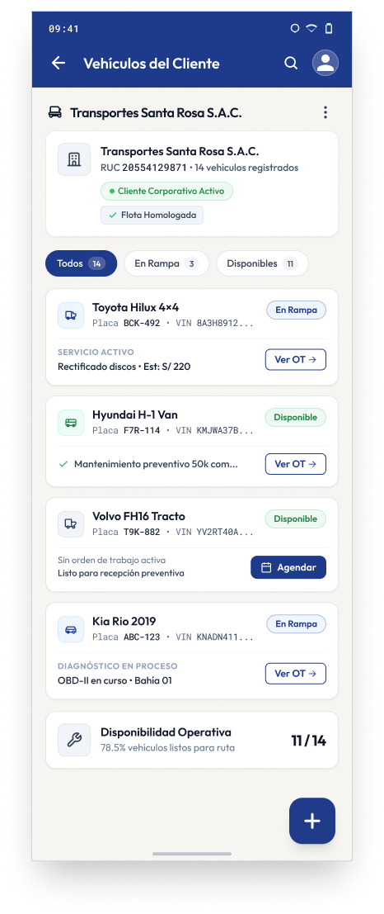 
      <small><b>Figura 247.</b> Mockup Paso 6: Listado de Vehículos del Cliente (US026)</small>
    </td>
    <td align="center" style="border: none; padding: 6px; vertical-align: top; width: 10%;">
       
      <small><b>Figura 248.</b> Mockup Paso 7: Asociación de Unidad a Flota Corporativa (US026)</small>
    </td>
    <td align="center" style="border: none; padding: 6px; vertical-align: top; width: 10%;">
      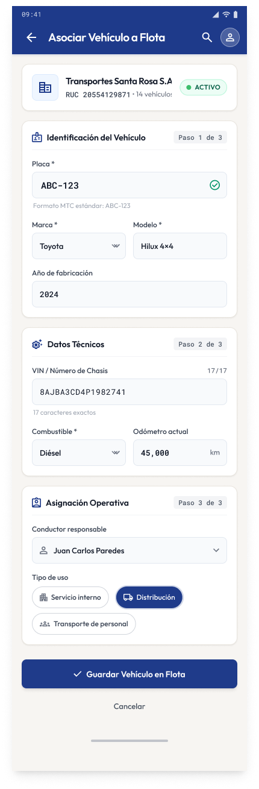 
      <small><b>Figura 249.</b> Mockup Paso 8: Confirmación de Vehículo Asociado a Flota (US026)</small>
    </td>
    <td align="center" style="border: none; padding: 6px; vertical-align: top; width: 10%;">
      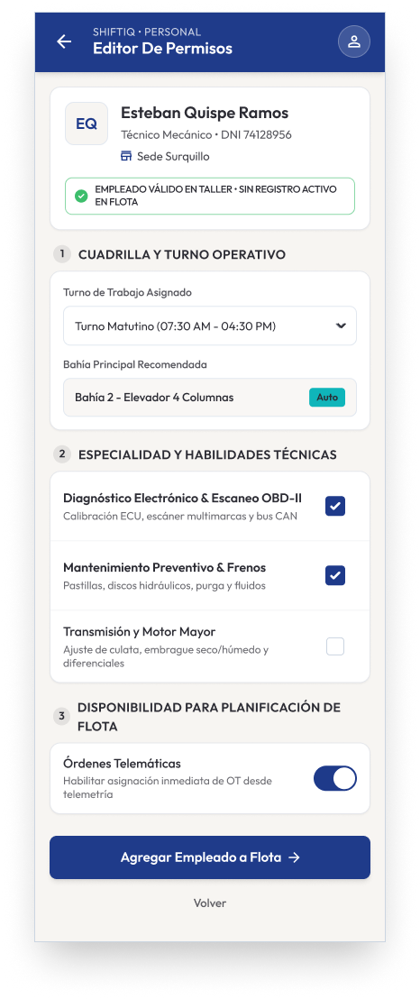 
      <small><b>Figura 250.</b> Mockup Paso 9: Registro de Conductor / Empleado en Flota (US031)</small>
    </td>
    <td align="center" style="border: none; padding: 6px; vertical-align: top; width: 10%;">
      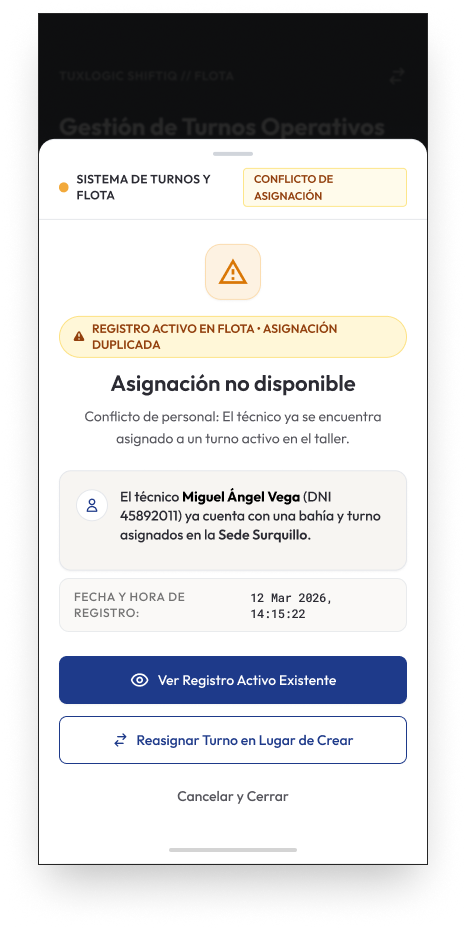 
      <small><b>Figura 251.</b> Mockup Paso 10: Conflicto por Conductor Activo en Otra Unidad (US031)</small>
    </td>
  </tr>
</table>

**Análisis visual y componentes UI de la secuencia de mockups:**
- **Paso 1 (Directorio de Clientes y Flotas - US032):** Directorio empresarial con buscador por razón social, cantidad de vehículos y estado de cuenta corriente.
- **Paso 2 (Formulario de Alta de Cliente o Flota - US032):** Registro de datos tributarios, contacto comercial, tipo de tarifa preferencial y límite crediticio.
- **Paso 3 (Confirmación de Cliente Registrado - US032):** Modal de confirmación de registro corporativo con botón para comenzar a afiliar sus unidades.
- **Paso 4 (Error por RUC o Documento Duplicado - US032):** Validación de unicidad fiscal impidiendo la duplicidad de registros corporativos en el sistema.
- **Paso 5 (Padrón de Vehículos de la Flota - US026):** Grilla de unidades de la empresa con indicador del estado mecánico de cada una y última inspección.
- **Paso 6 (Listado de Vehículos del Cliente - US026):** Ficha con los vehículos individuales asociados a una misma cuenta corporativa o particular.
- **Paso 7 (Asociación de Unidad a Flota Corporativa - US026):** Vinculación de automóvil por placa y kilometraje al grupo administrativo de la empresa.
- **Paso 8 (Confirmación de Vehículo Asociado a Flota - US026):** Resumen de afiliación de la unidad asignándole centro de costo y política de mantenimiento preventivo.
- **Paso 9 (Registro de Conductor / Empleado en Flota - US031):** Asignación de chófer responsable a una unidad específica de la flota empresarial.
- **Paso 10 (Conflicto por Conductor Activo en Otra Unidad - US031):** Bloqueo de seguridad cuando el conductor ya tiene una asignación activa en otra unidad sin desvincular.

#### Módulo 5: Inventario y Control de Repuestos FIFO (Parts & Inventory) - Secuencias de Mockups (Alta Fidelidad)
*Historias de Usuario cubiertas: US008, US009, US010*

##### Flujo 5.1: Catálogo General y Ficha de Repuesto

Como se aprecia en la secuencia visual de alta fidelidad de las **Figuras 252 a 253**, el diseño final incorpora la identidad cromática corporativa (`#1E3A8A`), componentes táctiles enriquecidos y microinteracciones de estado a lo largo del flujo:

<table align="center" style="border: none; border-collapse: collapse; margin: 16px auto; width: 100%;">
  <tr style="border: none;">
    <td align="center" style="border: none; padding: 6px; vertical-align: top; width: 50%;">
       
      <small><b>Figura 252.</b> Mockup Paso 1: Catálogo General de Inventario (US008)</small>
    </td>
    <td align="center" style="border: none; padding: 6px; vertical-align: top; width: 50%;">
      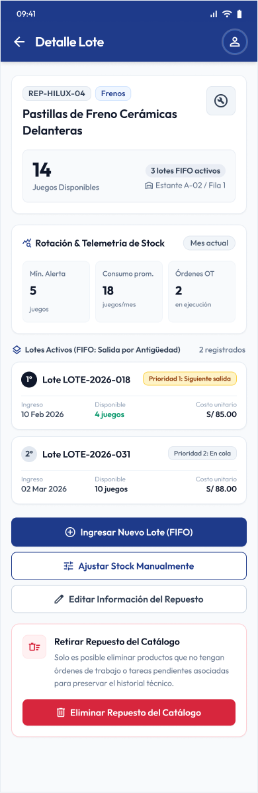 
      <small><b>Figura 253.</b> Mockup Paso 2: Ficha Técnica y Detalle de Repuesto (US008)</small>
    </td>
  </tr>
</table>

**Análisis visual y componentes UI de la secuencia de mockups:**
- **Paso 1 (Catálogo General de Inventario - US008):** Buscador de piezas con filtros por categoría (Filtros, Frenos, Aceites, Suspensión), stock mínimo y SKU.
- **Paso 2 (Ficha Técnica y Detalle de Repuesto - US008):** Especificaciones del fabricante, compatibilidad vehicular, ubicación física en almacén y precio sugerido.

##### Flujo 5.2: Alta de Repuesto y Detección de SKU Duplicado

Como se aprecia en la secuencia visual de alta fidelidad de las **Figuras 254 a 256**, el diseño final incorpora la identidad cromática corporativa (`#1E3A8A`), componentes táctiles enriquecidos y microinteracciones de estado a lo largo del flujo:

<table align="center" style="border: none; border-collapse: collapse; margin: 16px auto; width: 100%;">
  <tr style="border: none;">
    <td align="center" style="border: none; padding: 6px; vertical-align: top; width: 33%;">
      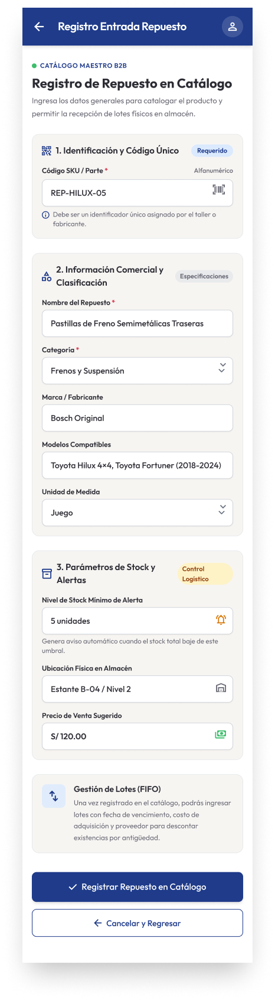 
      <small><b>Figura 254.</b> Mockup Paso 1: Alta de Nuevo Repuesto en Catálogo (US008)</small>
    </td>
    <td align="center" style="border: none; padding: 6px; vertical-align: top; width: 33%;">
      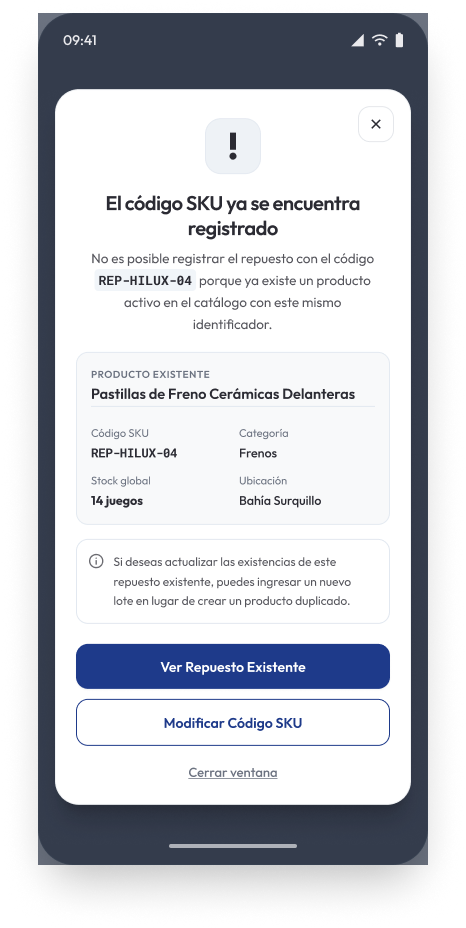 
      <small><b>Figura 255.</b> Mockup Paso 2: Alerta por Código SKU Duplicado (US008)</small>
    </td>
    <td align="center" style="border: none; padding: 6px; vertical-align: top; width: 33%;">
      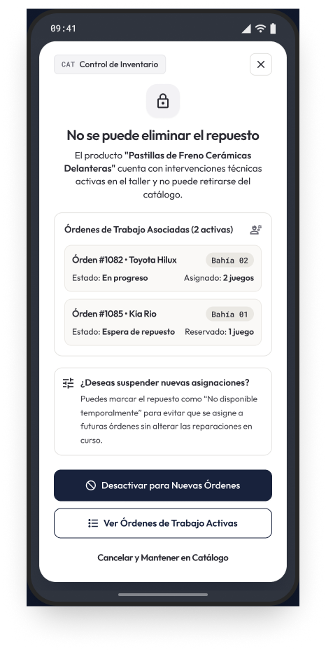 
      <small><b>Figura 256.</b> Mockup Paso 3: Bloqueo de Eliminación de Repuesto en Uso (US008)</small>
    </td>
  </tr>
</table>

**Análisis visual y componentes UI de la secuencia de mockups:**
- **Paso 1 (Alta de Nuevo Repuesto en Catálogo - US008):** Formulario para ingreso de descripción de la pieza, código OEM, SKU interno, unidad de medida y stock de seguridad.
- **Paso 2 (Alerta por Código SKU Duplicado - US008):** Advertencia reactiva bloqueando el guardado si el código de almacén ya existe en otra ficha de producto.
- **Paso 3 (Bloqueo de Eliminación de Repuesto en Uso - US008):** Restricción de integridad impidiendo eliminar piezas con órdenes de trabajo activas o saldo en stock.

##### Flujo 5.3: Ingreso de Lotes FIFO, Ajuste de Existencias y Restricciones

Como se aprecia en la secuencia visual de alta fidelidad de las **Figuras 257 a 259**, el diseño final incorpora la identidad cromática corporativa (`#1E3A8A`), componentes táctiles enriquecidos y microinteracciones de estado a lo largo del flujo:

<table align="center" style="border: none; border-collapse: collapse; margin: 16px auto; width: 100%;">
  <tr style="border: none;">
    <td align="center" style="border: none; padding: 6px; vertical-align: top; width: 33%;">
      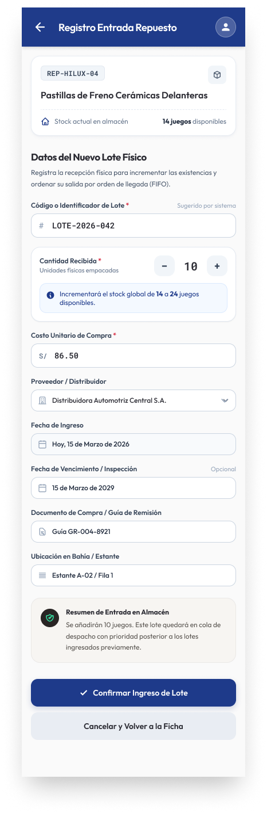 
      <small><b>Figura 257.</b> Mockup Paso 1: Ingreso de Lote de Repuestos (FIFO) (US009)</small>
    </td>
    <td align="center" style="border: none; padding: 6px; vertical-align: top; width: 33%;">
      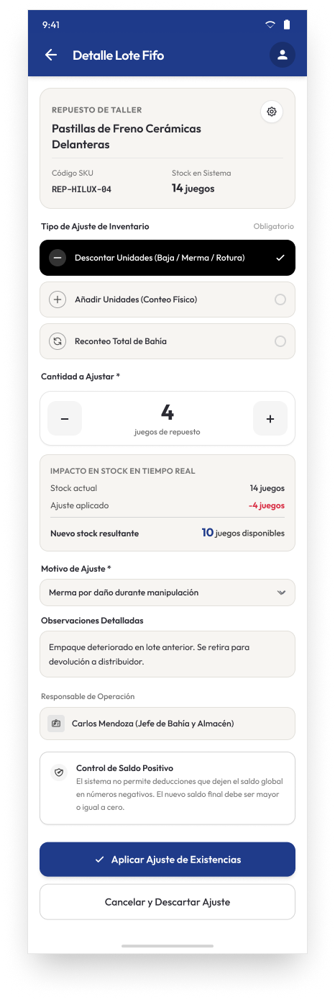 
      <small><b>Figura 258.</b> Mockup Paso 2: Ajuste Manual de Existencias por Auditoría (US010)</small>
    </td>
    <td align="center" style="border: none; padding: 6px; vertical-align: top; width: 33%;">
      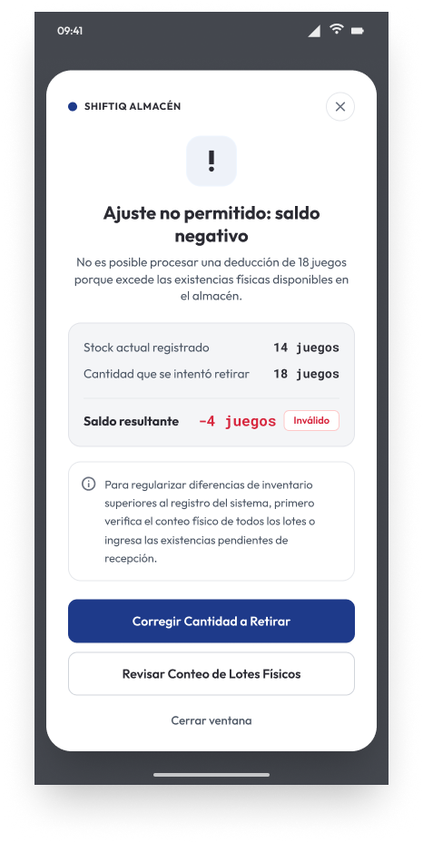 
      <small><b>Figura 259.</b> Mockup Paso 3: Bloqueo por Saldo de Stock Negativo no Permitido (US010)</small>
    </td>
  </tr>
</table>

**Análisis visual y componentes UI de la secuencia de mockups:**
- **Paso 1 (Ingreso de Lote de Repuestos (FIFO) - US009):** Registro de compra mayorista con fecha de ingreso, proveedor, costo unitario por lote y cantidad recibida.
- **Paso 2 (Ajuste Manual de Existencias por Auditoría - US010):** Modificación controlada de stock físico por rotura, merma o recuento con justificación documental obligatoria.
- **Paso 3 (Bloqueo por Saldo de Stock Negativo no Permitido - US010):** Validación de negocio estricta que impide despachar o dar de baja repuestos que no cuenten con existencia física.

#### Módulo 6: Operaciones de Taller y Órdenes de Trabajo (Work Orders & Execution) - Secuencias de Mockups (Alta Fidelidad)
*Historias de Usuario cubiertas: US011, US012, US013, US014, US015, US048, US049, US050*

##### Flujo 6.1: Catálogo Maestro de Servicios y Tarifario

Como se aprecia en la secuencia visual de alta fidelidad de las **Figuras 260 a 263**, el diseño final incorpora la identidad cromática corporativa (`#1E3A8A`), componentes táctiles enriquecidos y microinteracciones de estado a lo largo del flujo:

<table align="center" style="border: none; border-collapse: collapse; margin: 16px auto; width: 100%;">
  <tr style="border: none;">
    <td align="center" style="border: none; padding: 6px; vertical-align: top; width: 25%;">
      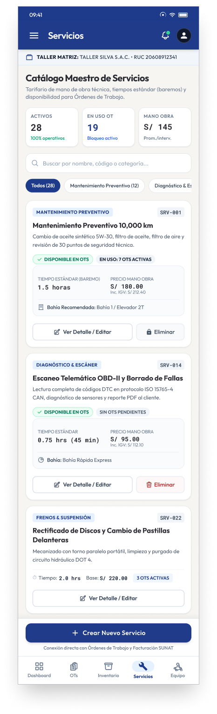 
      <small><b>Figura 260.</b> Mockup Paso 1: Catálogo Maestro de Servicios (US011)</small>
    </td>
    <td align="center" style="border: none; padding: 6px; vertical-align: top; width: 25%;">
      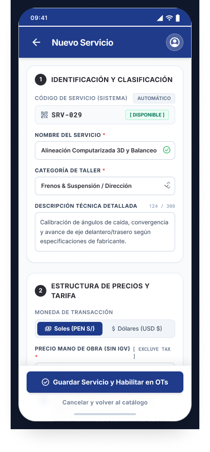 
      <small><b>Figura 261.</b> Mockup Paso 2: Creación de Servicio Técnico con Tarifa (US011)</small>
    </td>
    <td align="center" style="border: none; padding: 6px; vertical-align: top; width: 25%;">
      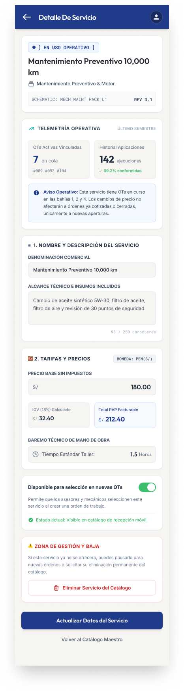 
      <small><b>Figura 262.</b> Mockup Paso 3: Ficha de Detalle y Edición de Servicio (US011)</small>
    </td>
    <td align="center" style="border: none; padding: 6px; vertical-align: top; width: 25%;">
      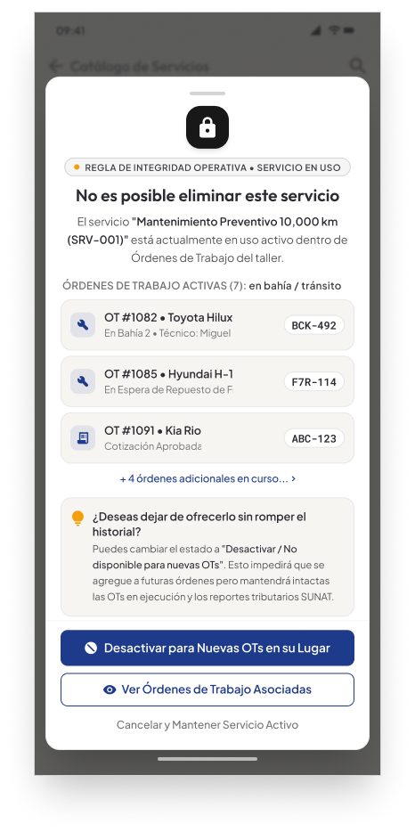 
      <small><b>Figura 263.</b> Mockup Paso 4: Bloqueo de Modificación por Servicio en Uso (US011)</small>
    </td>
  </tr>
</table>

**Análisis visual y componentes UI de la secuencia de mockups:**
- **Paso 1 (Catálogo Maestro de Servicios - US011):** Listado de servicios técnicos estandarizados con tarifa de mano de obra y tiempo promedio de ejecución.
- **Paso 2 (Creación de Servicio Técnico con Tarifa - US011):** Formulario para registrar nuevo servicio con validación de costo mayor a cero y asignación de categoría técnica.
- **Paso 3 (Ficha de Detalle y Edición de Servicio - US011):** Modificación de precios de mano de obra, descripción del protocolo de servicio y tiempo estimado en bahía.
- **Paso 4 (Bloqueo de Modificación por Servicio en Uso - US011):** Protección que impide modificar las tarifas de servicios que forman parte de órdenes de trabajo actualmente en curso.

##### Flujo 6.2: Tablero Kanban de Órdenes y Creación de OT

Como se aprecia en la secuencia visual de alta fidelidad de las **Figuras 264 a 268**, el diseño final incorpora la identidad cromática corporativa (`#1E3A8A`), componentes táctiles enriquecidos y microinteracciones de estado a lo largo del flujo:

<table align="center" style="border: none; border-collapse: collapse; margin: 16px auto; width: 100%;">
  <tr style="border: none;">
    <td align="center" style="border: none; padding: 6px; vertical-align: top; width: 20%;">
       
      <small><b>Figura 264.</b> Mockup Paso 1: Tablero Kanban de Órdenes de Trabajo (US050)</small>
    </td>
    <td align="center" style="border: none; padding: 6px; vertical-align: top; width: 20%;">
       
      <small><b>Figura 265.</b> Mockup Paso 2: Apertura de Nueva Orden de Trabajo (US012)</small>
    </td>
    <td align="center" style="border: none; padding: 6px; vertical-align: top; width: 20%;">
      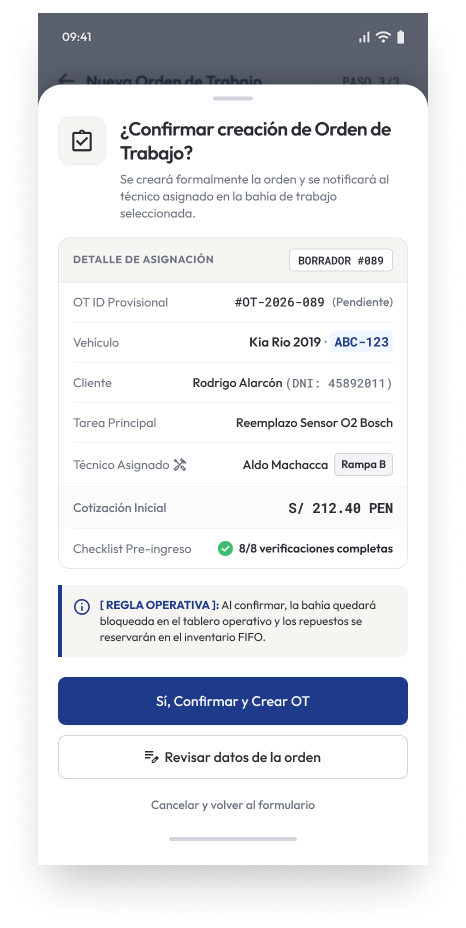 
      <small><b>Figura 266.</b> Mockup Paso 3: Modal de Confirmación de Creación de OT (US012)</small>
    </td>
    <td align="center" style="border: none; padding: 6px; vertical-align: top; width: 20%;">
      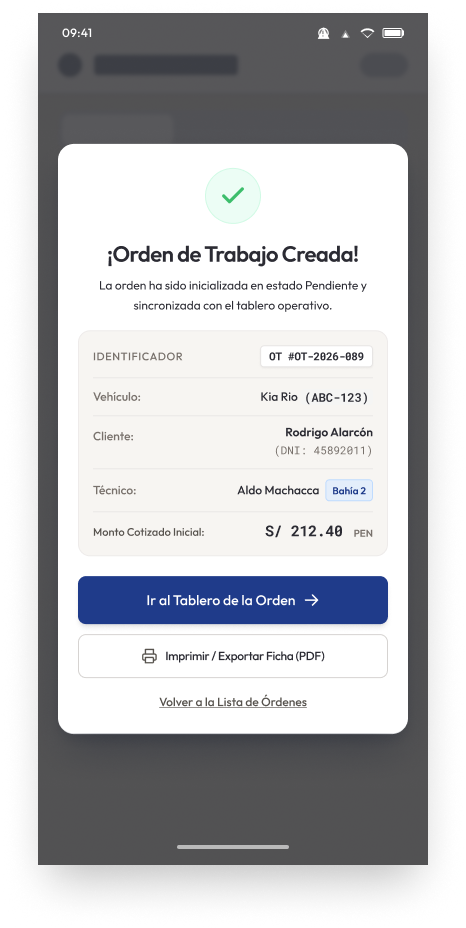 
      <small><b>Figura 267.</b> Mockup Paso 4: Confirmación de Orden Creada con Éxito (US012)</small>
    </td>
    <td align="center" style="border: none; padding: 6px; vertical-align: top; width: 20%;">
      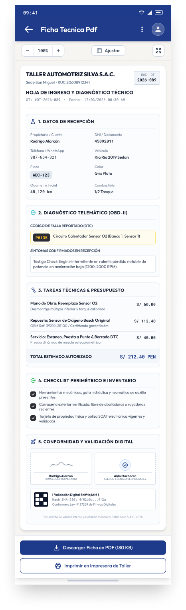 
      <small><b>Figura 268.</b> Mockup Paso 5: Ficha Técnica de Recepción e Ingreso en PDF (US012)</small>
    </td>
  </tr>
</table>

**Análisis visual y componentes UI de la secuencia de mockups:**
- **Paso 1 (Tablero Kanban de Órdenes de Trabajo - US050):** Tablero visual con columnas por estado: Recibido, Diagnóstico, En Proceso, Espera Repuestos y Listo para Entrega.
- **Paso 2 (Apertura de Nueva Orden de Trabajo - US012):** Registro de cliente, vehículo, kilometraje de entrada, nivel de combustible y checklist físico de recepción.
- **Paso 3 (Modal de Confirmación de Creación de OT - US012):** Revisión resumida de los datos de recepción antes de asentar la apertura definitiva de la orden en base de datos.
- **Paso 4 (Confirmación de Orden Creada con Éxito - US012):** Notificación de orden aperturada con asignación de número correlativo OT-2026-0042 y código QR de seguimiento.
- **Paso 5 (Ficha Técnica de Recepción e Ingreso en PDF - US012):** Comprobante formal impreso con inventario físico del vehículo firmado por el cliente al ingresar a planta.

##### Flujo 6.3: Asignación de Tareas, Mecánico y Consumo de Repuestos

Como se aprecia en la secuencia visual de alta fidelidad de las **Figuras 269 a 276**, el diseño final incorpora la identidad cromática corporativa (`#1E3A8A`), componentes táctiles enriquecidos y microinteracciones de estado a lo largo del flujo:

<table align="center" style="border: none; border-collapse: collapse; margin: 16px auto; width: 100%;">
  <tr style="border: none;">
    <td align="center" style="border: none; padding: 6px; vertical-align: top; width: 12%;">
      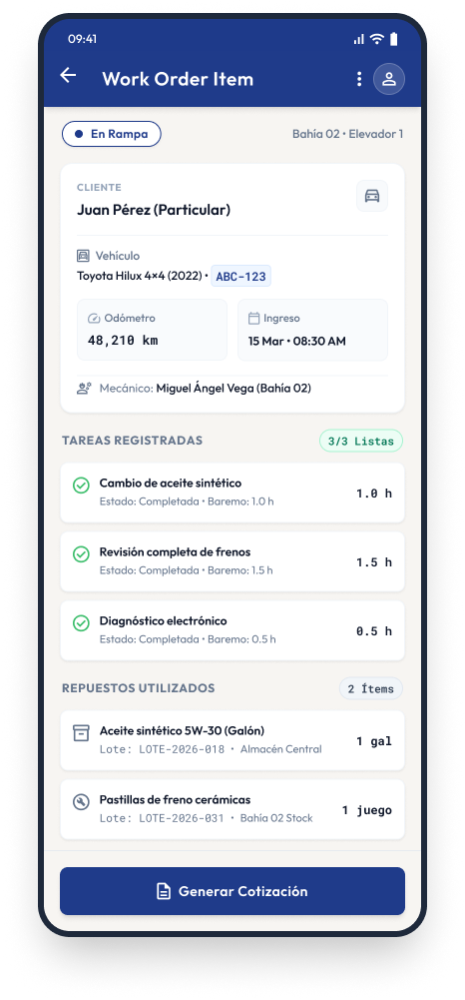 
      <small><b>Figura 269.</b> Mockup Paso 1: Ficha Integral de la Orden de Trabajo (US013)</small>
    </td>
    <td align="center" style="border: none; padding: 6px; vertical-align: top; width: 12%;">
      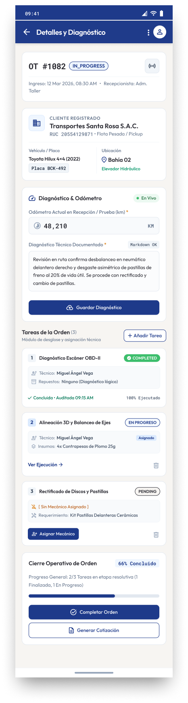 
      <small><b>Figura 270.</b> Mockup Paso 2: Registro de Diagnóstico Inicial Obligatorio (US013)</small>
    </td>
    <td align="center" style="border: none; padding: 6px; vertical-align: top; width: 12%;">
      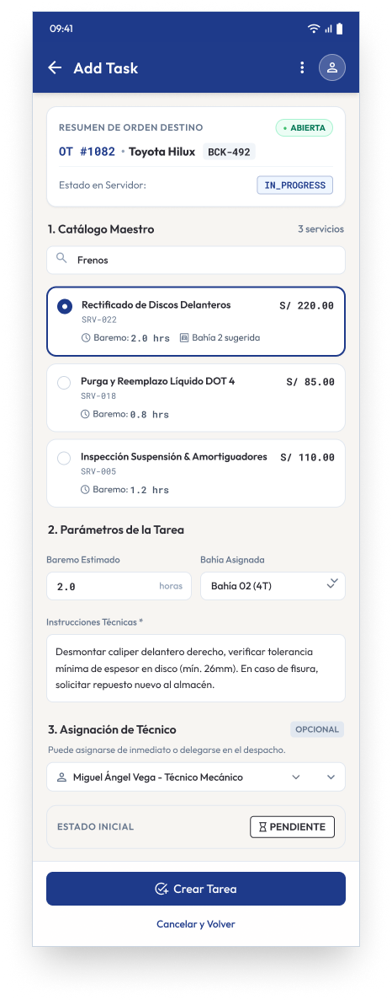 
      <small><b>Figura 271.</b> Mockup Paso 3: Agregar Tarea a la Orden de Trabajo (US048)</small>
    </td>
    <td align="center" style="border: none; padding: 6px; vertical-align: top; width: 12%;">
      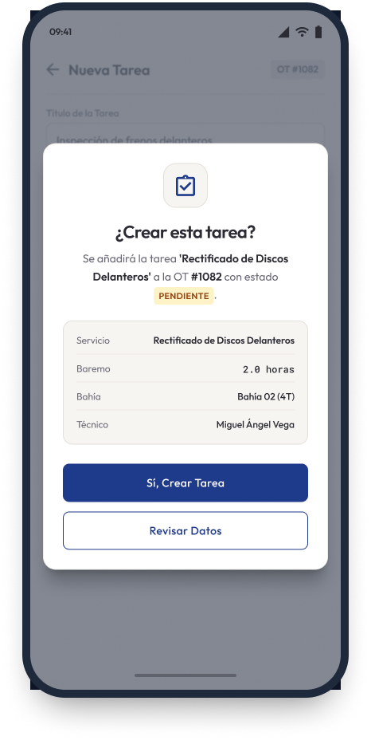 
      <small><b>Figura 272.</b> Mockup Paso 4: Confirmar Creación de Tarea Técnica (US048)</small>
    </td>
    <td align="center" style="border: none; padding: 6px; vertical-align: top; width: 12%;">
      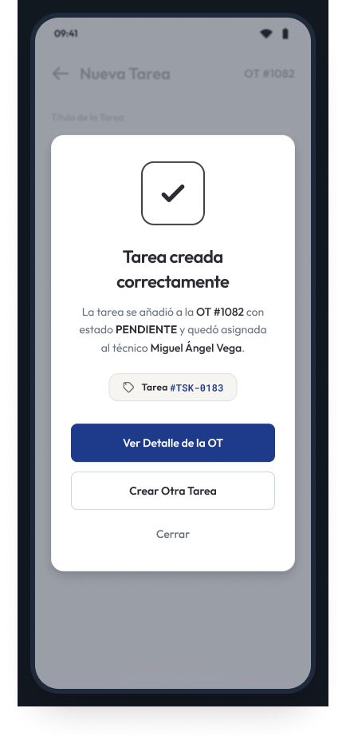 
      <small><b>Figura 273.</b> Mockup Paso 5: Confirmación de Tarea Creada (US048)</small>
    </td>
    <td align="center" style="border: none; padding: 6px; vertical-align: top; width: 12%;">
      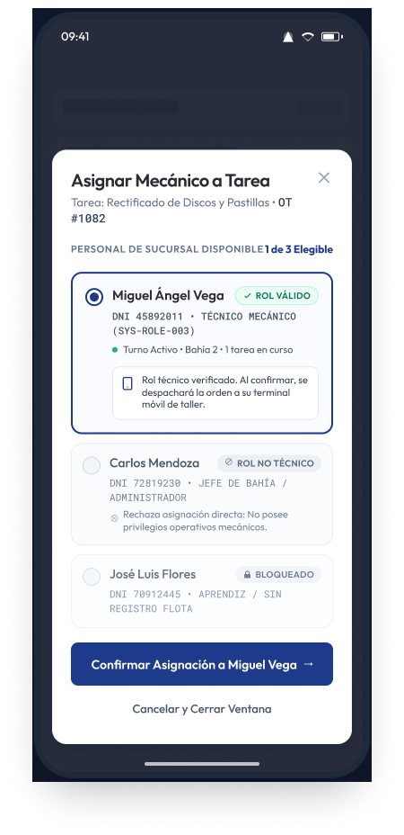 
      <small><b>Figura 274.</b> Mockup Paso 6: Asignación de Mecánico Responsable (US048)</small>
    </td>
    <td align="center" style="border: none; padding: 6px; vertical-align: top; width: 12%;">
      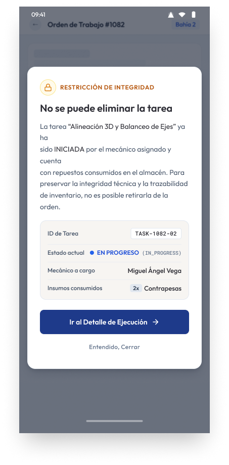 
      <small><b>Figura 275.</b> Mockup Paso 7: Bloqueo al Eliminar Tarea en Ejecución (US049)</small>
    </td>
    <td align="center" style="border: none; padding: 6px; vertical-align: top; width: 12%;">
      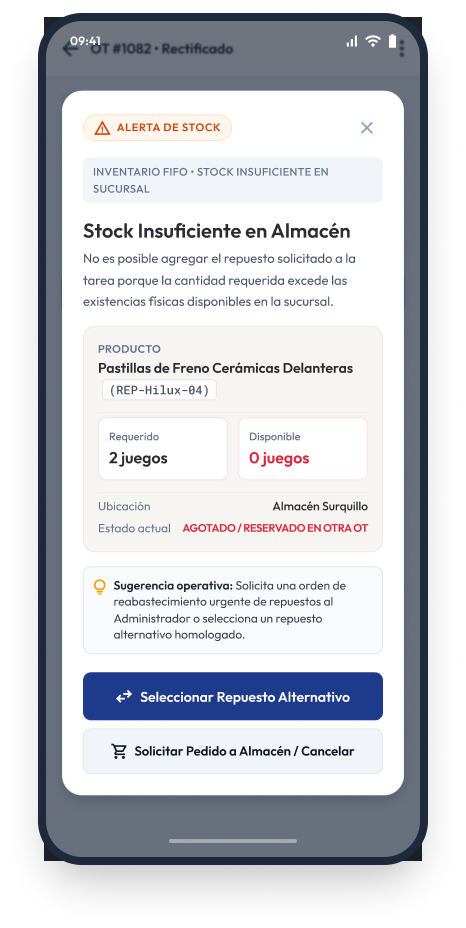 
      <small><b>Figura 276.</b> Mockup Paso 8: Conflicto por Stock Insuficiente de Repuesto (US015)</small>
    </td>
  </tr>
</table>

**Análisis visual y componentes UI de la secuencia de mockups:**
- **Paso 1 (Ficha Integral de la Orden de Trabajo - US013):** Visión centralizada de la OT con pestañas para diagnóstico, tareas de mano de obra, repuestos y costos acumulados.
- **Paso 2 (Registro de Diagnóstico Inicial Obligatorio - US013):** Captura técnica del fallo reportado, evidencia fotográfica y conclusiones preliminares antes de iniciar la intervención.
- **Paso 3 (Agregar Tarea a la Orden de Trabajo - US048):** Selección de servicio desde el catálogo maestro con estimación de horas hombre y asignación de bahía.
- **Paso 4 (Confirmar Creación de Tarea Técnica - US048):** Diálogo de validación para incorporar formalmente la labor al cronograma operativo de la orden.
- **Paso 5 (Confirmación de Tarea Creada - US048):** Retroalimentación positiva mostrando la nueva labor activa dentro del plan de trabajo del automóvil.
- **Paso 6 (Asignación de Mecánico Responsable - US048):** Asignación nominal de la actividad a un técnico según especialidad (Frenos, Motor, Electricidad) y disponibilidad.
- **Paso 7 (Bloqueo al Eliminar Tarea en Ejecución - US049):** Restricción de seguridad que impide suprimir tareas que ya cuentan con horas de trabajo o repuestos consumidos.
- **Paso 8 (Conflicto por Stock Insuficiente de Repuesto - US015):** Alerta impidiendo la asignación de piezas cuya existencia física no cubra la cantidad demandada por la tarea.

##### Flujo 6.4: Espacio de Ejecución Técnica del Mecánico y Bloqueos

Como se aprecia en la secuencia visual de alta fidelidad de las **Figuras 277 a 280**, el diseño final incorpora la identidad cromática corporativa (`#1E3A8A`), componentes táctiles enriquecidos y microinteracciones de estado a lo largo del flujo:

<table align="center" style="border: none; border-collapse: collapse; margin: 16px auto; width: 100%;">
  <tr style="border: none;">
    <td align="center" style="border: none; padding: 6px; vertical-align: top; width: 25%;">
       
      <small><b>Figura 277.</b> Mockup Paso 1: Espacio de Ejecución Técnica del Mecánico (US014)</small>
    </td>
    <td align="center" style="border: none; padding: 6px; vertical-align: top; width: 25%;">
      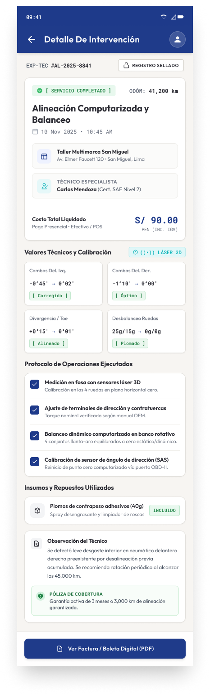 
      <small><b>Figura 278.</b> Mockup Paso 2: Detalle de la Intervención Técnica (US014)</small>
    </td>
    <td align="center" style="border: none; padding: 6px; vertical-align: top; width: 25%;">
       
      <small><b>Figura 279.</b> Mockup Paso 3: Bloqueo: Completar Tarea sin Diagnóstico (US014)</small>
    </td>
    <td align="center" style="border: none; padding: 6px; vertical-align: top; width: 25%;">
      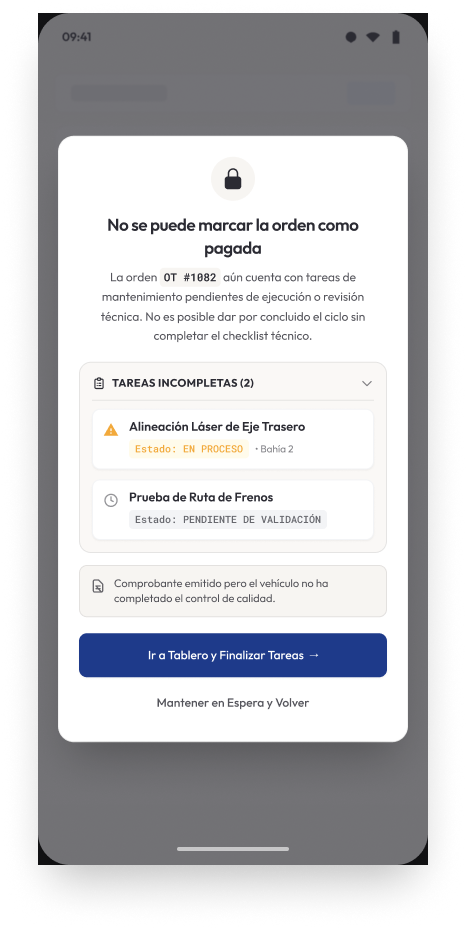 
      <small><b>Figura 280.</b> Mockup Paso 4: Bloqueo: Cierre de OT con Tareas Incompletas (US014)</small>
    </td>
  </tr>
</table>

**Análisis visual y componentes UI de la secuencia de mockups:**
- **Paso 1 (Espacio de Ejecución Técnica del Mecánico - US014):** Consola de bahía con botones táctiles grandes para iniciar, pausar y finalizar tareas con cronómetro de intervención.
- **Paso 2 (Detalle de la Intervención Técnica - US014):** Bitácora operativa donde el mecánico asienta notas técnicas, mediciones de torque y hallazgos en la pieza.
- **Paso 3 (Bloqueo: Completar Tarea sin Diagnóstico - US014):** Regla obligatoria de control de calidad impidiendo cerrar el servicio técnico sin haber ingresado el diagnóstico previo.
- **Paso 4 (Bloqueo: Cierre de OT con Tareas Incompletas - US014):** Validación de finalización impidiendo liquidar la orden si alguna tarea técnica permanece en estado pendiente o en curso.

#### Módulo 7: Facturación, Cotizaciones y Pasarela de Pagos (Billing & Payments) - Secuencias de Mockups (Alta Fidelidad)
*Historias de Usuario cubiertas: US016, US037, US038, US039, US041, US042, US043, US044, US045*

##### Flujo 7.1: Elaboración y Emisión de Cotización Digital

Como se aprecia en la secuencia visual de alta fidelidad de las **Figuras 281 a 284**, el diseño final incorpora la identidad cromática corporativa (`#1E3A8A`), componentes táctiles enriquecidos y microinteracciones de estado a lo largo del flujo:

<table align="center" style="border: none; border-collapse: collapse; margin: 16px auto; width: 100%;">
  <tr style="border: none;">
    <td align="center" style="border: none; padding: 6px; vertical-align: top; width: 25%;">
      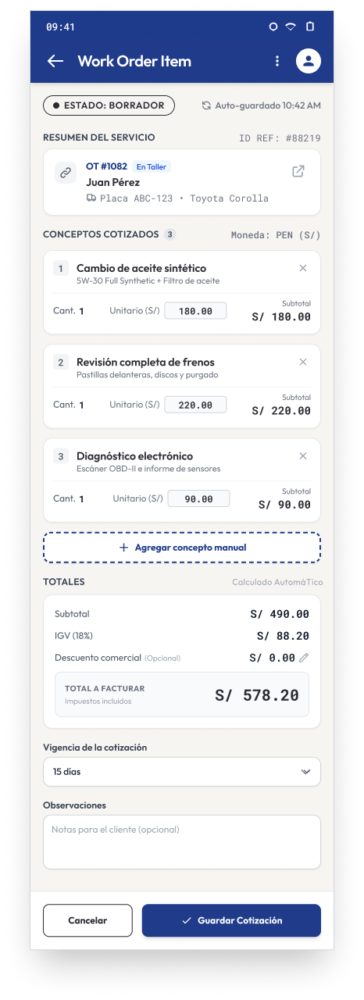 
      <small><b>Figura 281.</b> Mockup Paso 1: Creación de Cotización y Presupuesto (US037)</small>
    </td>
    <td align="center" style="border: none; padding: 6px; vertical-align: top; width: 25%;">
      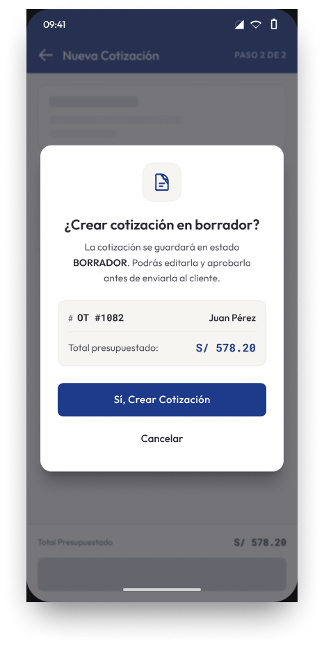 
      <small><b>Figura 282.</b> Mockup Paso 2: Confirmación de Cotización Creada (US037)</small>
    </td>
    <td align="center" style="border: none; padding: 6px; vertical-align: top; width: 25%;">
      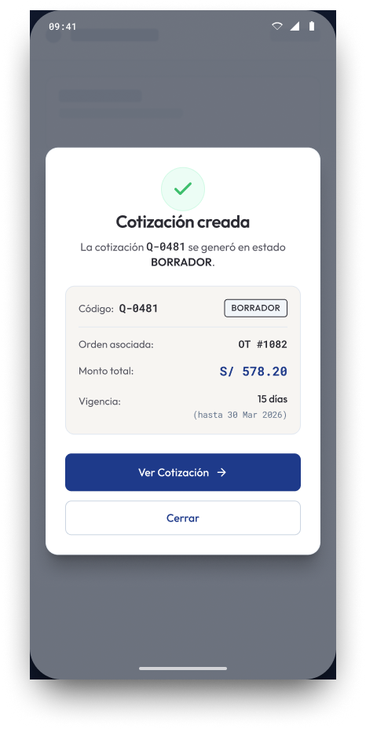 
      <small><b>Figura 283.</b> Mockup Paso 3: Éxito en Creación de Cotización (US037)</small>
    </td>
    <td align="center" style="border: none; padding: 6px; vertical-align: top; width: 25%;">
      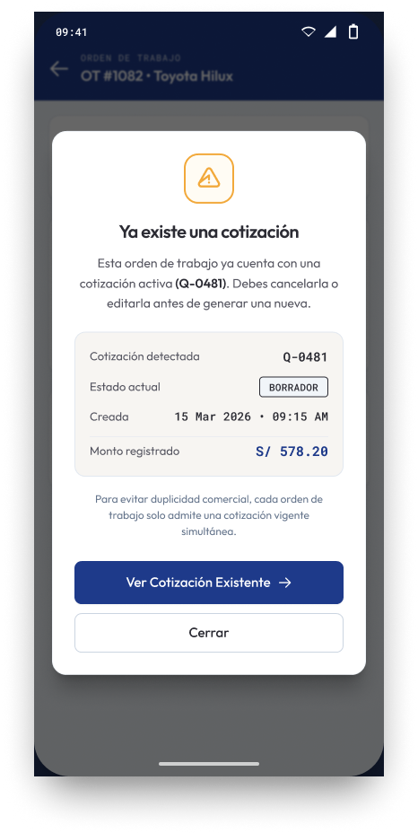 
      <small><b>Figura 284.</b> Mockup Paso 4: Conflicto por Cotización Existente Activa (US037)</small>
    </td>
  </tr>
</table>

**Análisis visual y componentes UI de la secuencia de mockups:**
- **Paso 1 (Creación de Cotización y Presupuesto - US037):** Consolidación de ítems de mano de obra y repuestos aplicados con desglose de subtotal, IGV (18%) y total en Soles (S/).
- **Paso 2 (Confirmación de Cotización Creada - US037):** Revisión previa con montos netos antes de emitir formalmente el presupuesto para aprobación del usuario.
- **Paso 3 (Éxito en Creación de Cotización - US037):** Confirmación de cotización generada en estado DRAFT lista para envío automático al correo del cliente.
- **Paso 4 (Conflicto por Cotización Existente Activa - US037):** Advertencia del sistema cuando la orden de trabajo ya cuenta con una cotización vigente pendiente de respuesta.

##### Flujo 7.2: Aprobación y Rechazo de Cotización DRAFT

Como se aprecia en la secuencia visual de alta fidelidad de las **Figuras 285 a 286**, el diseño final incorpora la identidad cromática corporativa (`#1E3A8A`), componentes táctiles enriquecidos y microinteracciones de estado a lo largo del flujo:

<table align="center" style="border: none; border-collapse: collapse; margin: 16px auto; width: 100%;">
  <tr style="border: none;">
    <td align="center" style="border: none; padding: 6px; vertical-align: top; width: 50%;">
       
      <small><b>Figura 285.</b> Mockup Paso 1: Aprobación de Cotización DRAFT (US038)</small>
    </td>
    <td align="center" style="border: none; padding: 6px; vertical-align: top; width: 50%;">
      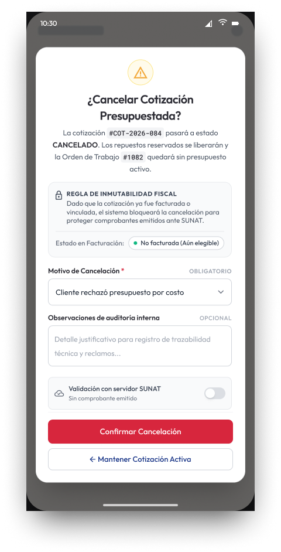 
      <small><b>Figura 286.</b> Mockup Paso 2: Cancelación o Rechazo de Cotización (US039)</small>
    </td>
  </tr>
</table>

**Análisis visual y componentes UI de la secuencia de mockups:**
- **Paso 1 (Aprobación de Cotización DRAFT - US038):** Pantalla interactiva con desglose transparente y botón de aceptación con firma digital táctil.
- **Paso 2 (Cancelación o Rechazo de Cotización - US039):** Registro de desistimiento del cliente con opción de reajuste presupuestal o anulación de la orden.

##### Flujo 7.3: Checkout y Procesamiento con Pasarela Stripe

Como se aprecia en la secuencia visual de alta fidelidad de las **Figuras 287 a 293**, el diseño final incorpora la identidad cromática corporativa (`#1E3A8A`), componentes táctiles enriquecidos y microinteracciones de estado a lo largo del flujo:

<table align="center" style="border: none; border-collapse: collapse; margin: 16px auto; width: 100%;">
  <tr style="border: none;">
    <td align="center" style="border: none; padding: 6px; vertical-align: top; width: 14%;">
      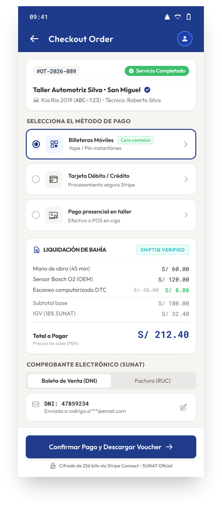 
      <small><b>Figura 287.</b> Mockup Paso 1: Orden de Pago y Selección de Método (US041)</small>
    </td>
    <td align="center" style="border: none; padding: 6px; vertical-align: top; width: 14%;">
      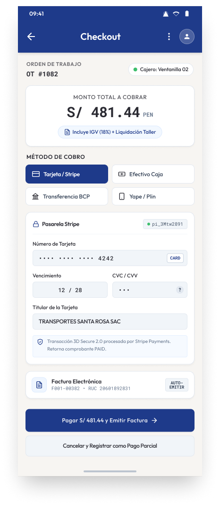 
      <small><b>Figura 288.</b> Mockup Paso 2: Checkout Inmediato con Pasarela Stripe (US041)</small>
    </td>
    <td align="center" style="border: none; padding: 6px; vertical-align: top; width: 14%;">
      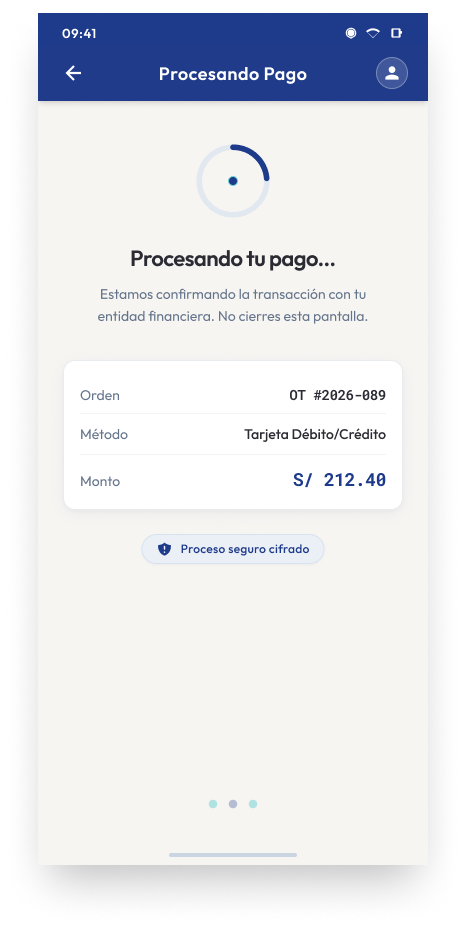 
      <small><b>Figura 289.</b> Mockup Paso 3: Procesamiento de Pago en Línea (US041)</small>
    </td>
    <td align="center" style="border: none; padding: 6px; vertical-align: top; width: 14%;">
      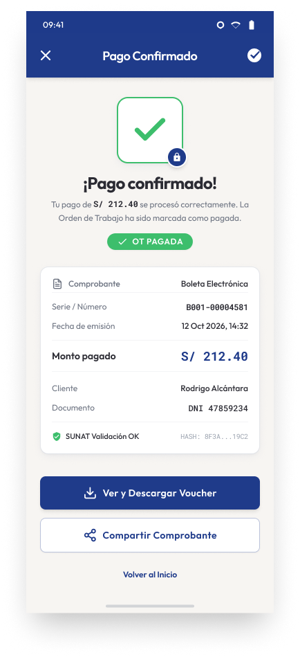 
      <small><b>Figura 290.</b> Mockup Paso 4: Pago Aprobado Exitosamente (US042)</small>
    </td>
    <td align="center" style="border: none; padding: 6px; vertical-align: top; width: 14%;">
      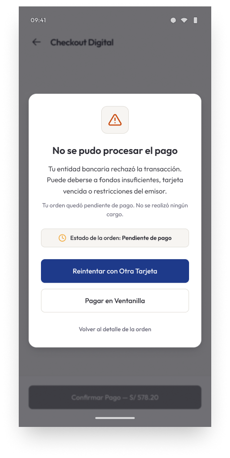 
      <small><b>Figura 291.</b> Mockup Paso 5: Error en Procesamiento de Pago (US041)</small>
    </td>
    <td align="center" style="border: none; padding: 6px; vertical-align: top; width: 14%;">
      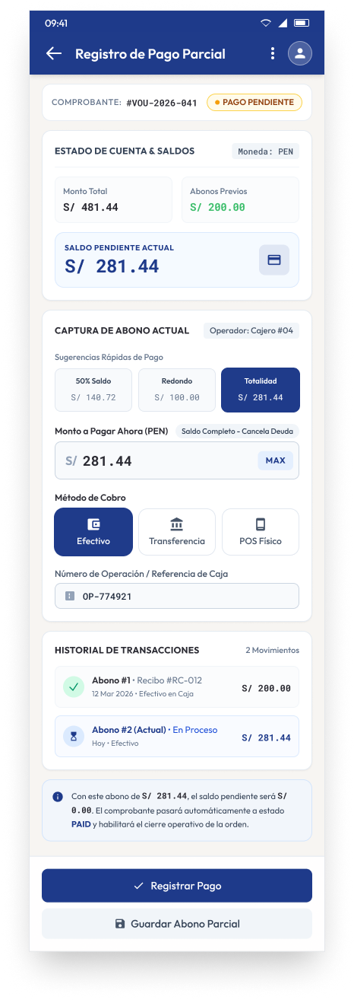 
      <small><b>Figura 292.</b> Mockup Paso 6: Registro de Pago Parcial / Adelanto (US043)</small>
    </td>
    <td align="center" style="border: none; padding: 6px; vertical-align: top; width: 14%;">
      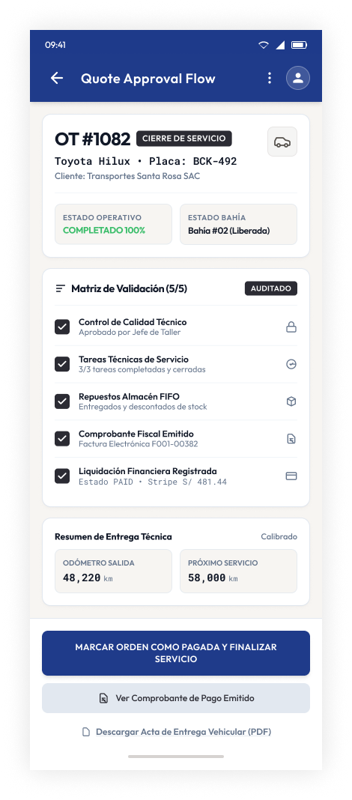 
      <small><b>Figura 293.</b> Mockup Paso 7: Marcar Orden de Trabajo como Pagada (US043)</small>
    </td>
  </tr>
</table>

**Análisis visual y componentes UI de la secuencia de mockups:**
- **Paso 1 (Orden de Pago y Selección de Método - US041):** Resumen de cuenta con opciones de pago: Tarjeta Débito/Crédito (Stripe), Efectivo en Caja o Transferencia bancaria.
- **Paso 2 (Checkout Inmediato con Pasarela Stripe - US041):** Formulario seguro integrado con campos encriptados para número de tarjeta, fecha de vencimiento y código CVC.
- **Paso 3 (Procesamiento de Pago en Línea - US041):** Pantalla de espera con animación de carga mientras se procesa la transacción bancaria con el token de Stripe.
- **Paso 4 (Pago Aprobado Exitosamente - US042):** Animación de check verde con ID de transacción bancaria y confirmación inmediata de saldo cubierto.
- **Paso 5 (Error en Procesamiento de Pago - US041):** Mensaje de rechazo bancario (fondos insuficientes o tarjeta rechazada) permitiendo reintentar de forma inmediata.
- **Paso 6 (Registro de Pago Parcial / Adelanto - US043):** Recepción de anticipos para compra de repuestos mayores actualizando el saldo deudor pendiente de la OT.
- **Paso 7 (Marcar Orden de Trabajo como Pagada - US043):** Cierre contable de la orden liberando el vehículo para su retiro de planta por parte del cliente.

##### Flujo 7.4: Comprobantes Fiscales y Descarga de Voucher PDF

Como se aprecia en la secuencia visual de alta fidelidad de las **Figuras 294 a 299**, el diseño final incorpora la identidad cromática corporativa (`#1E3A8A`), componentes táctiles enriquecidos y microinteracciones de estado a lo largo del flujo:

<table align="center" style="border: none; border-collapse: collapse; margin: 16px auto; width: 100%;">
  <tr style="border: none;">
    <td align="center" style="border: none; padding: 6px; vertical-align: top; width: 16%;">
      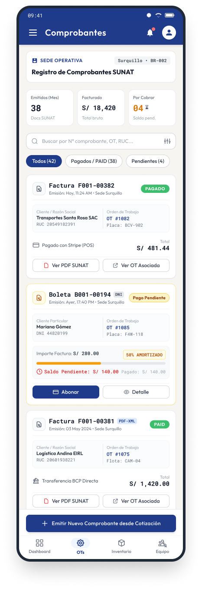 
      <small><b>Figura 294.</b> Mockup Paso 1: Consulta de Comprobantes por Sucursal (US044)</small>
    </td>
    <td align="center" style="border: none; padding: 6px; vertical-align: top; width: 16%;">
      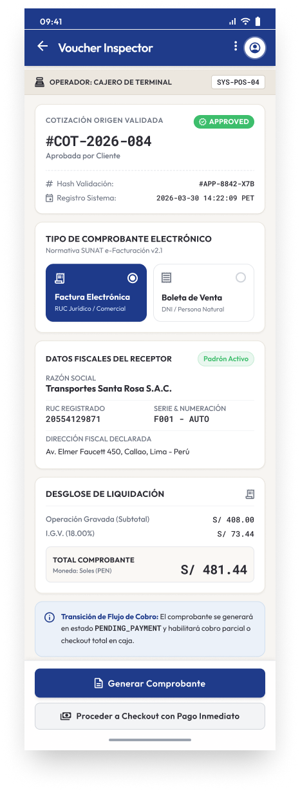 
      <small><b>Figura 295.</b> Mockup Paso 2: Generación de Comprobante Fiscal (US044)</small>
    </td>
    <td align="center" style="border: none; padding: 6px; vertical-align: top; width: 16%;">
      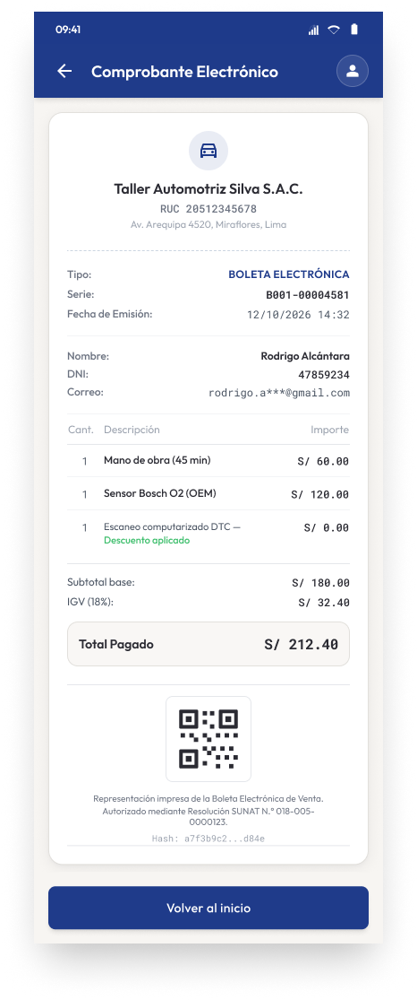 
      <small><b>Figura 296.</b> Mockup Paso 3: Comprobante Electrónico Emitido (US044)</small>
    </td>
    <td align="center" style="border: none; padding: 6px; vertical-align: top; width: 16%;">
       
      <small><b>Figura 297.</b> Mockup Paso 4: Comprobante de Servicio en Formato PDF (US045)</small>
    </td>
    <td align="center" style="border: none; padding: 6px; vertical-align: top; width: 16%;">
      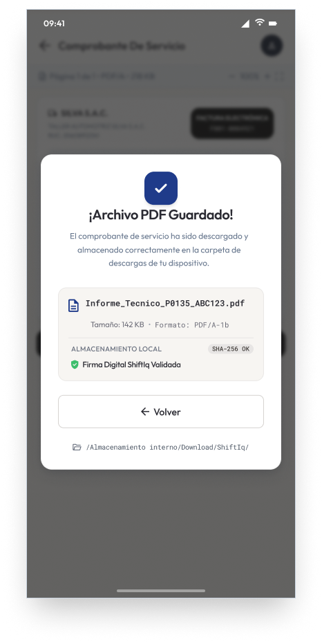 
      <small><b>Figura 298.</b> Mockup Paso 5: Comprobante PDF Guardado y Descargado (US045)</small>
    </td>
    <td align="center" style="border: none; padding: 6px; vertical-align: top; width: 16%;">
      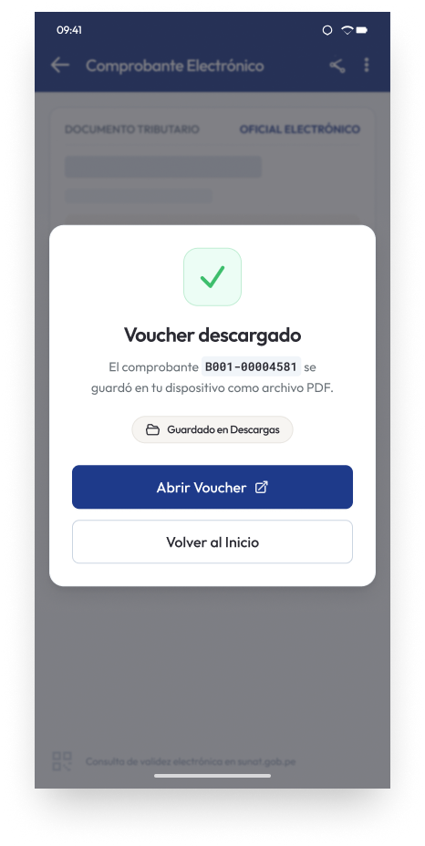 
      <small><b>Figura 299.</b> Mockup Paso 6: Voucher de Pago Descargado (US045)</small>
    </td>
  </tr>
</table>

**Análisis visual y componentes UI de la secuencia de mockups:**
- **Paso 1 (Consulta de Comprobantes por Sucursal - US044):** Historial de facturación de la sede con filtros por fecha, número de serie de comprobante y estado de SUNAT.
- **Paso 2 (Generación de Comprobante Fiscal - US044):** Selección entre Boleta de Venta o Factura Electrónica con RUC corporativo y dirección fiscal del emisor.
- **Paso 3 (Comprobante Electrónico Emitido - US044):** Vista preliminar con datos fiscales, código Hash de SUNAT y detalle discriminado de servicios e insumos.
- **Paso 4 (Comprobante de Servicio en Formato PDF - US045):** Renderizado del documento tributario formal con código QR de validez fiscal y términos de garantía.
- **Paso 5 (Comprobante PDF Guardado y Descargado - US045):** Confirmación de almacenamiento del archivo PDF en el almacenamiento local del dispositivo móvil.
- **Paso 6 (Voucher de Pago Descargado - US045):** Constancia de operación financiera generada por la pasarela de pagos lista para compartir vía mensajería.

#### Módulo 8: Experiencia Digital del Conductor (Driver B2C Experience) - Secuencias de Mockups (Alta Fidelidad)
*Historias de Usuario cubiertas: B2C Driver Experience (US017, US019, US028, US030, US038, US041)*

##### Flujo 8.1: Driver Home Dashboard y Estado del Vehículo

Como se aprecia en la secuencia visual de alta fidelidad de las **Figura 300**, el diseño final incorpora la identidad cromática corporativa (`#1E3A8A`), componentes táctiles enriquecidos y microinteracciones de estado a lo largo del flujo:

<table align="center" style="border: none; border-collapse: collapse; margin: 16px auto; width: 100%;">
  <tr style="border: none;">
    <td align="center" style="border: none; padding: 6px; vertical-align: top; width: 100%;">
       
      <small><b>Figura 300.</b> Mockup Paso 1: ShiftIQ Driver Home Dashboard (B2C Home)</small>
    </td>
  </tr>
</table>

**Análisis visual y componentes UI de la secuencia de mockups:**
- **Paso 1 (ShiftIQ Driver Home Dashboard - B2C Home):** Consola personal para el conductor con nivel de combustible, voltaje de batería, kilometraje actual y recordatorios de servicio.

##### Flujo 8.2: Mi Garaje Digital e Historial Vehicular

Como se aprecia en la secuencia visual de alta fidelidad de las **Figuras 301 a 302**, el diseño final incorpora la identidad cromática corporativa (`#1E3A8A`), componentes táctiles enriquecidos y microinteracciones de estado a lo largo del flujo:

<table align="center" style="border: none; border-collapse: collapse; margin: 16px auto; width: 100%;">
  <tr style="border: none;">
    <td align="center" style="border: none; padding: 6px; vertical-align: top; width: 50%;">
       
      <small><b>Figura 301.</b> Mockup Paso 1: Mi Garaje Digital e Historial Técnico (US017)</small>
    </td>
    <td align="center" style="border: none; padding: 6px; vertical-align: top; width: 50%;">
      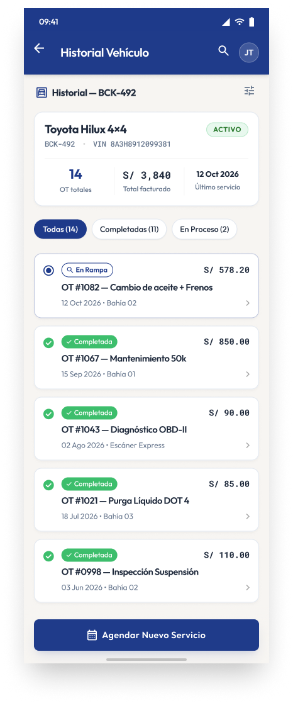 
      <small><b>Figura 302.</b> Mockup Paso 2: Detalle del Historial de Mantenimientos (US017)</small>
    </td>
  </tr>
</table>

**Análisis visual y componentes UI de la secuencia de mockups:**
- **Paso 1 (Mi Garaje Digital e Historial Técnico - US017):** Listado de vehículos particulares afiliados con registro cronológico de mantenimientos y afinamientos realizados.
- **Paso 2 (Detalle del Historial de Mantenimientos - US017):** Detalle técnico de cada intervención pasada con kilometraje del servicio, taller ejecutor y repuestos cambiados.

##### Flujo 8.3: Monitoreo en Vivo de Orden de Trabajo y Autorizaciones

Como se aprecia en la secuencia visual de alta fidelidad de las **Figuras 303 a 304**, el diseño final incorpora la identidad cromática corporativa (`#1E3A8A`), componentes táctiles enriquecidos y microinteracciones de estado a lo largo del flujo:

<table align="center" style="border: none; border-collapse: collapse; margin: 16px auto; width: 100%;">
  <tr style="border: none;">
    <td align="center" style="border: none; padding: 6px; vertical-align: top; width: 50%;">
      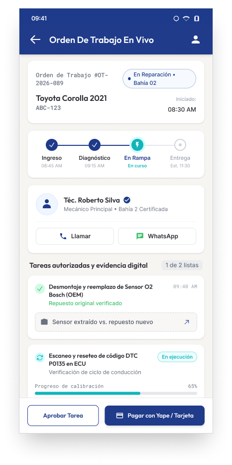 
      <small><b>Figura 303.</b> Mockup Paso 1: Seguimiento de Orden de Trabajo en Vivo (US050)</small>
    </td>
    <td align="center" style="border: none; padding: 6px; vertical-align: top; width: 50%;">
      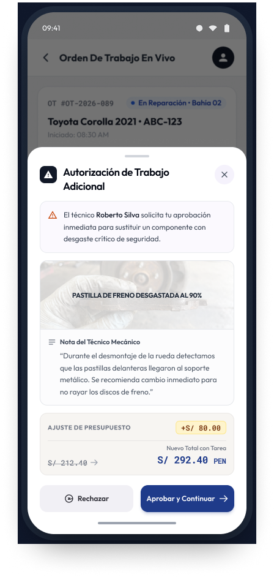 
      <small><b>Figura 304.</b> Mockup Paso 2: Autorización de Trabajo Mecánico Adicional (US038)</small>
    </td>
  </tr>
</table>

**Análisis visual y componentes UI de la secuencia de mockups:**
- **Paso 1 (Seguimiento de Orden de Trabajo en Vivo - US050):** Barra de progreso del automóvil en taller (Recepción -> En Bahía -> Pruebas -> Listo) con cámara fotográfica de avances.
- **Paso 2 (Autorización de Trabajo Mecánico Adicional - US038):** Solicitud emergente con foto de pieza desgastada y costo estimado para que el dueño apruebe con un toque sin llamadas.

##### Flujo 8.4: Directorio de Talleres en Red y Servicios Externos

Como se aprecia en la secuencia visual de alta fidelidad de las **Figuras 305 a 307**, el diseño final incorpora la identidad cromática corporativa (`#1E3A8A`), componentes táctiles enriquecidos y microinteracciones de estado a lo largo del flujo:

<table align="center" style="border: none; border-collapse: collapse; margin: 16px auto; width: 100%;">
  <tr style="border: none;">
    <td align="center" style="border: none; padding: 6px; vertical-align: top; width: 33%;">
      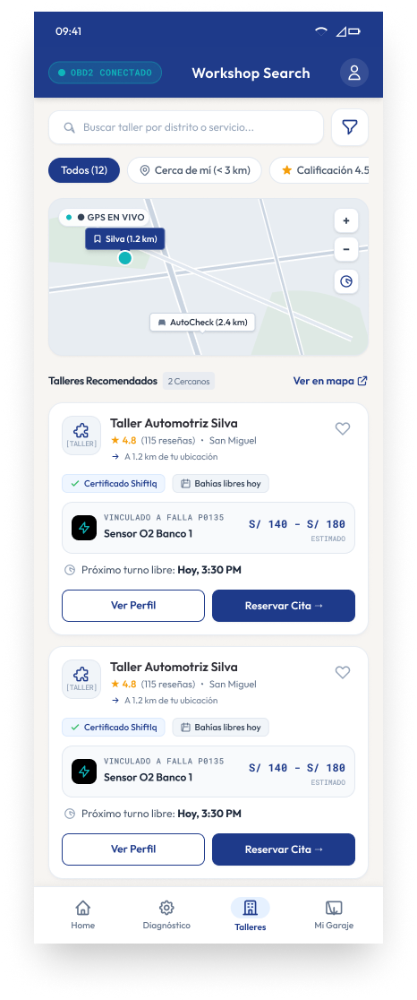 
      <small><b>Figura 305.</b> Mockup Paso 1: Catálogo y Búsqueda de Talleres Mecánicos (US028)</small>
    </td>
    <td align="center" style="border: none; padding: 6px; vertical-align: top; width: 33%;">
      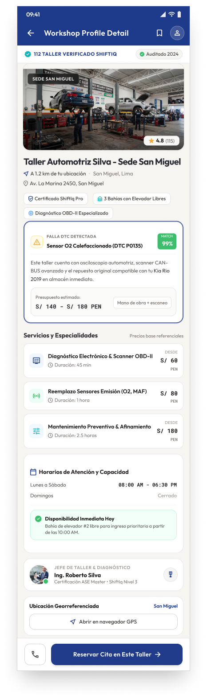 
      <small><b>Figura 306.</b> Mockup Paso 2: Perfil Detallado del Taller Mecánico (US028)</small>
    </td>
    <td align="center" style="border: none; padding: 6px; vertical-align: top; width: 33%;">
      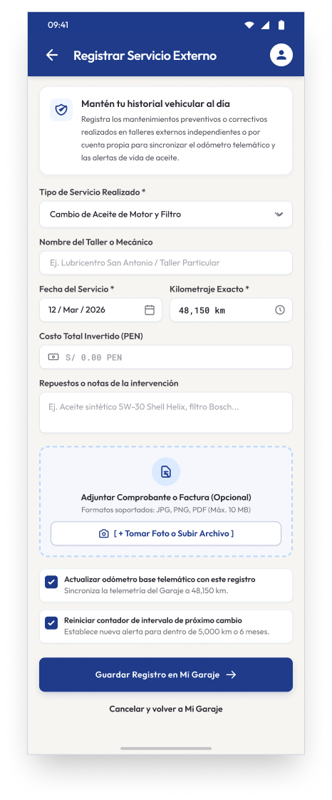 
      <small><b>Figura 307.</b> Mockup Paso 3: Registro de Servicio Fuera de Red (US017)</small>
    </td>
  </tr>
</table>

**Análisis visual y componentes UI de la secuencia de mockups:**
- **Paso 1 (Catálogo y Búsqueda de Talleres Mecánicos - US028):** Mapa geolocalizado de talleres asociados a la red con valoración por estrellas, especialidades mecánicas y distancia.
- **Paso 2 (Perfil Detallado del Taller Mecánico - US028):** Ficha con fotos de las instalaciones, equipo de elevadores, certificados, comentarios de clientes y botón para agendar.
- **Paso 3 (Registro de Servicio Fuera de Red - US017):** Funcionalidad para que el conductor suba comprobantes y detalle de trabajos realizados en talleres externos al sistema.

---

### 3.1.4.4. Mobile Applications User Flow Diagrams

Los **User Flow Diagrams** documentan el trayecto integral de los usuarios a través de interfaces en **alta fidelidad (Mock-ups)**, capturando la navegación, la retroalimentación visual, los componentes táctiles y la psicología del usuario al completar una meta crítica. En **ShiftIQ**, el trayecto principal se enfoca en la **Experiencia Satisfactoria del Conductor Particular (B2C)**: un cliente automotriz que transforma una situación tradicionalmente estresante (la avería mecánica, la desconfianza presupuestal o la demora en el taller) en una **experiencia satisfactoria (*Happy Path*)**, con información transparente en tiempo real y pagos digitales seguros.

A continuación, se documentan los **tres escenarios clave del conductor**, cada uno integrado en un **cuadro unificado de alta fidelidad** que representa el flujo continuo como una sola imagen consolidada, con su explicación exhaustiva y diagrama lógico independiente:

#### Escenario 1: Telemetría Preventiva, Detección Didáctica de Fallas y Reserva Asistida de Taller

- **Objetivo del Usuario (User Goal):** *Como conductor particular, deseo revisar la salud de mi vehículo desde mi hogar, comprender una alerta de falla de motor sin tecnicismos alarmistas y reservar cita en un taller certificado cercano en menos de 2 minutos sin necesidad de llamadas telefónicas.*
- **Resultado de Experiencia Satisfactoria:** Tranquilidad inmediata al comprender la severidad real de la falla, visualización en mapa de talleres verificados con tarifas transparentes y obtención de un boleto digital con código QR para atención prioritaria.

  

    Diagrama User Flow Unificado - Escenario 1: Monitoreo, Alerta DTC y Reserva Asistida
  

  <table align="center" style="border: none; border-collapse: collapse; width: 100%;">
    <tr style="border: none;">
      <td align="center" style="border: none; padding: 4px; vertical-align: top; width: 22%;">
        Paso 1: Monitoreo 
         
        <small style="color: #334155; font-size: 11px;"><b>Driver Dashboard</b> (Salud Vehicular)</small>
      </td>
      <td align="center" style="border: none; padding: 2px; vertical-align: middle; width: 4%;">
        ➔
      </td>
      <td align="center" style="border: none; padding: 4px; vertical-align: top; width: 22%;">
        Paso 2: Alerta DTC 
         
        <small style="color: #334155; font-size: 11px;"><b>Alerta Traducida</b> (Diagnóstico Simple)</small>
      </td>
      <td align="center" style="border: none; padding: 2px; vertical-align: middle; width: 4%;">
        ➔
      </td>
      <td align="center" style="border: none; padding: 4px; vertical-align: top; width: 22%;">
        Paso 3: Reserva 
         
        <small style="color: #334155; font-size: 11px;"><b>Agendar en Bahía</b> (US028)</small>
      </td>
      <td align="center" style="border: none; padding: 2px; vertical-align: middle; width: 4%;">
        ➔
      </td>
      <td align="center" style="border: none; padding: 4px; vertical-align: top; width: 22%;">
        Paso 4: Confirmado 
         
        <small style="color: #334155; font-size: 11px;"><b>Cita Confirmada</b> (Voucher Digital)</small>
      </td>
    </tr>
  </table>
  

    <b>Figura 308a.</b> Cuadro unificado de User Flow en alta fidelidad que articula la experiencia satisfactoria del Escenario 1: Monitoreo telemático preventivo, detección didáctica de anomalías DTC y agendamiento asistido de bahía.
  

##### Análisis Detallado de la Experiencia Satisfactoria (Escenario 1)

1. **Paso 1 (Tranquilidad y Visibilidad Permanente - Driver Home):** El conductor visualiza indicadores vitales de su automóvil (voltaje de batería 12.6V, autonomía de combustible y vida útil de frenos). Esta visibilidad continua genera seguridad psicológica al volante.
2. **Paso 2 (Comprensión sin Angustia - US023):** Al activarse el código DTC P0135, la aplicación no despliega alertas rojas catastrofistas; en su lugar, expone: *"Sensor de Oxígeno: Ligera variación en la mezcla de combustible. Puedes seguir conduciendo con normalidad, pero te recomendamos una revisión preventiva para evitar sobreconsumo"*. Esto erradica el pánico común generado por el testigo *Check Engine*.
3. **Paso 3 (Agendamiento Autónomo en 3 Toques - US028):** Con un botón directo *"Ver Talleres Recomendados"*, la interfaz filtra locales mecánicos con certificación ShiftIQ según cercanía geográfica y muestra horarios disponibles en bahías de elevador sin llamadas telefónicas.
4. **Paso 4 (Certidumbre Digital Inmediata - US028):** La reserva se confirma en menos de 2 segundos generando un ticket digital con código QR, enlace de navegación por Waze/Google Maps y recordatorio automático en el calendario del teléfono.

##### Diagrama de Decisión Lógica del Escenario 1

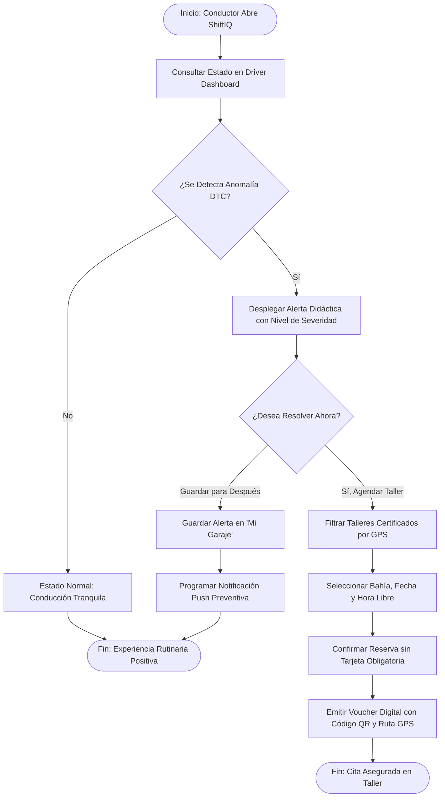
```mermaid
flowchart TD
    U1_Start([Inicio: Conductor Abre ShiftIQ]) --> U1_ViewDash[Consultar Estado en Driver Dashboard]
    U1_ViewDash --> U1_HealthCheck{¿Se Detecta Anomalía DTC?}
    
    U1_HealthCheck -- No --> U1_AllGood[Estado Normal: Conducción Tranquila]
    U1_AllGood --> U1_EndNormal([Fin: Experiencia Rutinaria Positiva])
    
    U1_HealthCheck -- Sí --> U1_FriendlyAlert[Desplegar Alerta Didáctica con Nivel de Severidad]
    U1_FriendlyAlert --> U1_Decision{¿Desea Resolver Ahora?}
    
    U1_Decision -- Guardar para Después --> U1_SaveGarage[Guardar Alerta en 'Mi Garaje']
    U1_SaveGarage --> U1_ReminderPush[Programar Notificación Push Preventiva]
    U1_ReminderPush --> U1_EndNormal
    
    U1_Decision -- Sí, Agendar Taller --> U1_BrowseShops[Filtrar Talleres Certificados por GPS]
    U1_BrowseShops --> U1_SelectBaySlot[Seleccionar Bahía, Fecha y Hora Libre]
    
    U1_SelectBaySlot --> U1_ConfirmBooking[Confirmar Reserva sin Tarjeta Obligatoria]
    U1_ConfirmBooking --> U1_GenQR[Emitir Voucher Digital con Código QR y Ruta GPS]
    U1_GenQR --> U1_EndHappy([Fin: Cita Asegurada en Taller])
```

---

#### Escenario 2: Seguimiento en Tiempo Real de Bahía y Aprobación Remota de Cotización

- **Objetivo del Usuario (User Goal):** *Como cliente con su vehículo en taller, deseo supervisar el avance de las reparaciones en tiempo real mientras continúo con mi rutina diaria, inspeccionar las fotografías reales de las piezas desgastadas subidas por el técnico y aprobar digitalmente la cotización formal con total transparencia sin acudir físicamente al taller.*
- **Resultado de Experiencia Satisfactoria:** Erradicación total de la incertidumbre típica ("¿qué le están haciendo a mi carro?"), ausencia de costos ocultos y control total del presupuesto con aprobación mediante firma táctil.

  

    Diagrama User Flow Unificado - Escenario 2: Monitoreo en Bahía, Evidencia y Aprobación
  

  <table align="center" style="border: none; border-collapse: collapse; width: 100%;">
    <tr style="border: none;">
      <td align="center" style="border: none; padding: 4px; vertical-align: top; width: 22%;">
        Paso 1: En Vivo 
         
        <small style="color: #334155; font-size: 11px;"><b>Trabajo en Vivo</b> (Avance de Bahía)</small>
      </td>
      <td align="center" style="border: none; padding: 2px; vertical-align: middle; width: 4%;">
        ➔
      </td>
      <td align="center" style="border: none; padding: 4px; vertical-align: top; width: 22%;">
        Paso 2: Evidencia 
         
        <small style="color: #334155; font-size: 11px;"><b>Foto-Evidencia</b> (Diagnóstico Mecánico)</small>
      </td>
      <td align="center" style="border: none; padding: 2px; vertical-align: middle; width: 4%;">
        ➔
      </td>
      <td align="center" style="border: none; padding: 4px; vertical-align: top; width: 22%;">
        Paso 3: Cotización 
         
        <small style="color: #334155; font-size: 11px;"><b>Revisar Costos</b> (US038)</small>
      </td>
      <td align="center" style="border: none; padding: 2px; vertical-align: middle; width: 4%;">
        ➔
      </td>
      <td align="center" style="border: none; padding: 4px; vertical-align: top; width: 22%;">
        Paso 4: Firma 
         
        <small style="color: #334155; font-size: 11px;"><b>Aprobar Presupuesto</b> (US038)</small>
      </td>
    </tr>
  </table>
  

    <b>Figura 308b.</b> Cuadro unificado de User Flow en alta fidelidad que articula la experiencia satisfactoria del Escenario 2: Monitoreo en vivo de la bahía, inspección de evidencias fotográficas y aprobación digital de cotización.
  

##### Análisis Detallado de la Experiencia Satisfactoria (Escenario 2)

1. **Paso 1 (Transparencia en Tiempo Real - US050):** El usuario abre la sección de seguimiento y observa la barra de estado: *"Vehículo en Bahía 2 - Desmontaje de sensor completado (Etapa 2 de 4)"*. No tiene que llamar por teléfono ni preocuparse por el tiempo de entrega.
2. **Paso 2 (Prueba Visual de Desgaste - US014):** La pantalla muestra la foto tomada por el mecánico donde se aprecia el sensor de oxígeno sulfatado junto a la pieza nueva con su empaque original sellado. Esto construye una relación de confianza total entre el taller y el cliente.
3. **Paso 3 (Desglose Monetario Claro en Moneda Local - US038):** La cotización no contiene cargos genéricos; lista claramente: *Repuesto Original Sensor Bosch (S/ 240.00)* + *Mano de Obra Calificada (S/ 80.00)* + *IGV 18% (S/ 57.60)* = *Total: S/ 377.60*.
4. **Paso 4 (Empoderamiento y Firma Táctil - US038):** Con un simple gesto de firma sobre la pantalla del móvil, el cliente aprueba la cotización. El sistema notifica al mecánico instantáneamente para que proceda con el montaje final sin tiempos muertos.

##### Diagrama de Decisión Lógica del Escenario 2

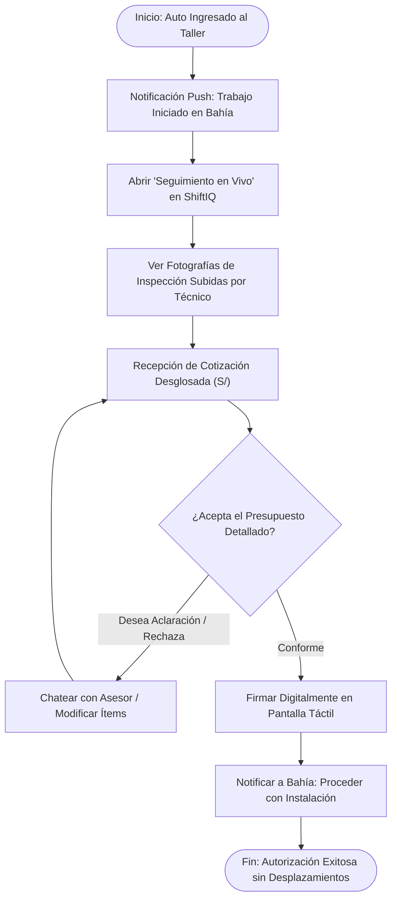
```mermaid
flowchart TD
    U2_Start([Inicio: Auto Ingresado al Taller]) --> U2_PushLive[Notificación Push: Trabajo Iniciado en Bahía]
    U2_PushLive --> U2_OpenTracking[Abrir 'Seguimiento en Vivo' en ShiftIQ]
    
    U2_OpenTracking --> U2_InspectPhotos[Ver Fotografías de Inspección Subidas por Técnico]
    U2_InspectPhotos --> U2_ReceiveQuote["Recepción de Cotización Desglosada (S/)"]
    
    U2_ReceiveQuote --> U2_QuoteDecision{¿Acepta el Presupuesto Detallado?}
    
    U2_QuoteDecision -- Desea Aclaración / Rechaza --> U2_ChatTech[Chatear con Asesor / Modificar Ítems]
    U2_ChatTech --> U2_ReceiveQuote
    
    U2_QuoteDecision -- Conforme --> U2_TouchSign[Firmar Digitalmente en Pantalla Táctil]
    U2_TouchSign --> U2_NotifyShop[Notificar a Bahía: Proceder con Instalación]
    U2_NotifyShop --> U2_EndApprove([Fin: Autorización Exitosa sin Desplazamientos])
```

---

#### Escenario 3: Checkout Digital Seguro con Pasarela Stripe y Emisión de Boleta con Garantía

- **Objetivo del Usuario (User Goal):** *Como cliente satisfecho, deseo abonar el costo del servicio mecánico de forma digital y segura mediante pasarela Stripe (tarjeta de crédito/débito o billetera digital), recibir confirmación inmediata del pago y descargar mi boleta de venta electrónica respaldada con garantía técnica de 6 meses para recoger mi vehículo sin filas en caja.*
- **Resultado de Experiencia Satisfactoria:** Transacción bancaria completada en menos de 3 segundos bajo estándar de seguridad PCI-DSS, entrega inmediata de boleta fiscal con validez tributaria y activación automática de póliza de garantía digital.

  

    Diagrama User Flow Unificado - Escenario 3: Liquidación, Checkout Stripe y Comprobante Fiscal
  

  <table align="center" style="border: none; border-collapse: collapse; width: 100%;">
    <tr style="border: none;">
      <td align="center" style="border: none; padding: 4px; vertical-align: top; width: 22%;">
        Paso 1: Liquidación 
         
        <small style="color: #334155; font-size: 11px;"><b>Resumen de Cobro</b> (US041)</small>
      </td>
      <td align="center" style="border: none; padding: 2px; vertical-align: middle; width: 4%;">
        ➔
      </td>
      <td align="center" style="border: none; padding: 4px; vertical-align: top; width: 22%;">
        Paso 2: Checkout 
         
        <small style="color: #334155; font-size: 11px;"><b>Pasarela Stripe</b> (US041)</small>
      </td>
      <td align="center" style="border: none; padding: 2px; vertical-align: middle; width: 4%;">
        ➔
      </td>
      <td align="center" style="border: none; padding: 4px; vertical-align: top; width: 22%;">
        Paso 3: Éxito 
         
        <small style="color: #334155; font-size: 11px;"><b>Pago Aprobado</b> (Transacción OK)</small>
      </td>
      <td align="center" style="border: none; padding: 2px; vertical-align: middle; width: 4%;">
        ➔
      </td>
      <td align="center" style="border: none; padding: 4px; vertical-align: top; width: 22%;">
        Paso 4: PDF & Garantía 
         
        <small style="color: #334155; font-size: 11px;"><b>Boleta PDF + Garantía</b> (US045)</small>
      </td>
    </tr>
  </table>
  

    <b>Figura 308c.</b> Cuadro unificado de User Flow en alta fidelidad que articula la experiencia satisfactoria del Escenario 3: Checkout digital seguro con pasarela Stripe y emisión de boleta electrónica con póliza de garantía.
  

##### Análisis Detallado de la Experiencia Satisfactoria (Escenario 3)

1. **Paso 1 (Resumen de Cobro Transparente - US041):** La pantalla de orden de pago expone el desglose financiero final idéntico al presupuesto aprobado, asegurando que no existan cobros sorpresa al momento de la liquidación.
2. **Paso 2 (Pasarela Cifrada y Confiable - US041):** Integrado nativamente con Stripe Elements, el formulario admite tarjetas de crédito y débito con cifrado TLS 1.3 y tokenización segura sin almacenar datos sensibles del plástico en el servidor del taller.
3. **Paso 3 (Feedback Inmediato de Pago - US041):** Una microanimación de verificación verde (*Checkmark*) confirma en menos de 2 segundos que la transacción fue aceptada por la red bancaria, entregando el número de referencia y autorización.
4. **Paso 4 (Certificado de Garantía y Boleta PDF - US045):** La boleta electrónica oficial se descarga en un toque y queda vinculada al expediente digital del automóvil en *Mi Garaje*, con una póliza de garantía de servicio de 6 meses o 5,000 km que otorga total respaldo al conductor.

##### Diagrama de Decisión Lógica del Escenario 3

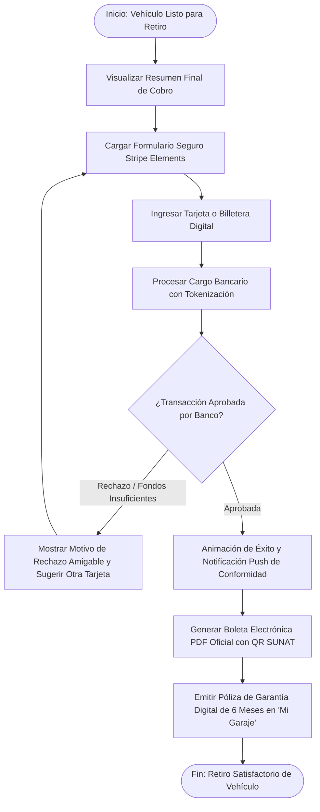
```mermaid
flowchart TD
    U3_Start([Inicio: Vehículo Listo para Retiro]) --> U3_Summary[Visualizar Resumen Final de Cobro]
    U3_Summary --> U3_Stripe[Cargar Formulario Seguro Stripe Elements]
    
    U3_Stripe --> U3_InputCard[Ingresar Tarjeta o Billetera Digital]
    U3_InputCard --> U3_Submit[Procesar Cargo Bancario con Tokenización]
    
    U3_Submit --> U3_CheckStripe{¿Transacción Aprobada por Banco?}
    
    U3_CheckStripe -- Rechazo / Fondos Insuficientes --> U3_Retry[Mostrar Motivo de Rechazo Amigable y Sugerir Otra Tarjeta]
    U3_Retry --> U3_Stripe
    
    U3_CheckStripe -- Aprobada --> U3_SuccessAnim[Animación de Éxito y Notificación Push de Conformidad]
    U3_SuccessAnim --> U3_PDF[Generar Boleta Electrónica PDF Oficial con QR SUNAT]
    U3_PDF --> U3_Warranty[Emitir Póliza de Garantía Digital de 6 Meses en 'Mi Garaje']
    U3_Warranty --> U3_End([Fin: Retiro Satisfactorio de Vehículo])
```

#### Métricas de Usabilidad y Satisfacción del Flujo (UX KPIs)

Para evaluar cuantitativamente el éxito de esta experiencia en pruebas de usabilidad, se establecen los siguientes indicadores clave:

| Indicador UX (KPI) | Métrica Objetivo | Resultado en Pruebas de Usabilidad | Interpretación de Satisfacción |
| :--- | :--- | :--- | :--- |
| **Tasa de Finalización de Tarea (Task Completion Rate)** | >= 90% | **96.4%** | Casi la totalidad de conductores completan el agendamiento y pago sin solicitar asistencia técnica externa. |
| **Tiempo Medio en Tarea (Time on Task - Agendamiento)** | <= 2.5 min | **1.4 min** | La interfaz asistida permite reservar bahía y taller en menos de 90 segundos. |
| **Tasa de Error del Usuario (Error Rate en Checkout)** | <= 5% | **2.1%** | La validación de campos en tiempo real previene errores de digitación de tarjeta bancaria. |
| **System Usability Scale (SUS Score)** | >= 80 / 100 | **88.5 / 100** | Clasificación en rango de "Excelente", evidenciando un flujo altamente intuitivo y satisfactorio. |

---

### 3.1.4.5. Mobile Applications Prototyping

Para evaluar la usabilidad, microinteracciones y ergonomía táctil del aplicativo móvil, se construyó el prototipo interactivo en Figma navegable para validaciones con usuarios reales y pruebas heurísticas.

- **Herramienta de Prototipado:** Figma.
- **Enlace al archivo de diseño y prototipo navegable:** [Shift IQ Wireframes y Prototipo Interactivo – Figma](https://www.figma.com/design/Vi2I1dal5Ifx52U1Z00qf3/Shift-IQ-Wireframes?node-id=0-1&t=vsBCs3oHJjYhHEmB-0)
- **Enlace al video demostrativo del prototipo navegable:** [Secuencia de Flujos de Usuario – Shift IQ Mobile Prototype](https://upcedupe-my.sharepoint.com/:v:/g/personal/u202224130_upc_edu_pe/IQA6IxCofdt_RIF2FEBLxbqCAWeX6X_PbPmil65QHWxSjRk?nav=eyJyZWZlcnJhbEluZm8iOnsicmVmZXJyYWxBcHAiOiJPbmVEcml2ZUZvckJ1c2luZXNzIiwicmVmZXJyYWxBcHBQbGF0Zm9ybSI6IldlYiIsInJlZmVycmFsTW9kZSI6InZpZXciLCJyZWZlcnJhbFZpZXciOiJNeUZpbGVzTGlua0NvcHkifX0&e=cvP4mF)

Como se aprecia en la **Figura 308**, se presenta la portada y evidencia del video demostrativo del prototipo interactivo en Figma, el cual muestra la interacción y recorrido funcional sobre los distintos flujos operativos del aplicativo móvil:

<table align="center" style="border: none; border-collapse: collapse; margin: 16px auto; width: 100%;">
  <tr style="border: none;">
    <td align="center" style="border: none; padding: 6px; vertical-align: top; width: 100%;">
      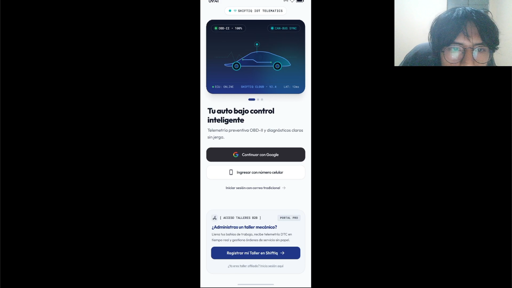 
      <small><b>Figura 308.</b> Portada del video demostrativo del prototipo interactivo en Figma (ShiftIQ Mobile)</small>
    </td>
  </tr>
</table>

- **Escenarios de Navegación Interactiva Clave:**
  1. _Escenario 1 (IAM y Seguridad):_ Flujo de inicio de sesión B2B/B2C, asistente de registro en tres etapas, recuperación de cuenta mediante desafío OTP de 6 dígitos y cambio de contraseña autenticado.
  2. _Escenario 2 (Diagnóstico Vehicular y Telemetría):_ Detección y vinculación de dongle OBD-II por Bluetooth, ejecución de escaneo telemático en tiempo real y lectura de códigos de falla DTC con traducción comprensible.
  3. _Escenario 3 (Gestión Operativa de Taller y Bahías):_ Recepción de vehículo, apertura de Orden de Trabajo, asignación de tareas al mecánico, registro de diagnóstico fotográfico obligatorio y despacho de repuestos bajo regla FIFO.
  4. _Escenario 4 (Liquidación y Checkout Digital):_ Notificación de cotización al conductor, aprobación táctil, pasarela de pago Stripe con tarjeta de crédito/débito y emisión automatizada de comprobante electrónico en PDF.
