## 3.1.4. Mobile Applications UX/UI Design

El diseño de la experiencia e interfaz de usuario (UX/UI) móvil para **ShiftIQ** se ha estructurado bajo un enfoque *Mobile-First*, optimizado para dos tipos de usuarios operativos: el personal técnico y administrativo de talleres mecánicos (**Segmento B2B**) y los conductores o propietarios particulares (**Segmento B2C**). 

Para garantizar una lectura ordenada, coherente y alineada con la arquitectura de **Domain-Driven Design (DDD)** definida en el capítulo 2, las pantallas del aplicativo móvil se organizan en **ocho módulos funcionales**. Cada módulo agrupa los esquemas de baja y media fidelidad (**Wireframes**) y su correspondiente concreción visual en alta fidelidad (**Mock-ups**), detallando el flujo de navegación, los componentes de interfaz, la paleta cromática corporativa y el cumplimiento de los criterios de aceptación de cada Historia de Usuario (US).

---

### 3.1.4.1. Mobile Applications Wireframes

Los wireframes definen la arquitectura de información, distribución espacial y componentes interactivos sin distracciones cromáticas o tipográficas finales, priorizando la ergonomía táctil en entornos de taller automotriz.

A continuación, se presentan los wireframes agrupados en los 8 módulos del sistema:

#### Módulo 1: Identidad, Autenticación y Seguridad (IAM) - Wireframes
*Historias de Usuario cubiertas: US001, US002, US004, US035, US036*

##### Registro de Taller y Dueño B2B

Tal como se observa en la Figura 44, la interfaz esquemática de registro B2B guía al dueño de taller en el ingreso de la razón social, RUC tributario, dirección de la sede principal y credenciales de acceso con validaciones reactivas.

  
  
<b>Figura 44.</b> Wireframe de registro de taller y dueño B2B (US001).

##### Inicio de Sesión B2B

Como se ilustra en la Figura 45, la vista esquemática de login organiza los accesos para el personal de taller mediante correo corporativo, contraseña encriptada y opción de recordar sesión.

  
  
<b>Figura 45.</b> Wireframe de inicio de sesión para talleres mecánicos B2B (US002).

##### Verificación de Seguridad con Código OTP

Tal como se evidencia en la Figura 46, la pantalla de validación presenta 6 casillas numéricas para ingresar el código de seguridad recibido por correo junto con un temporizador regresivo de expiración.

  
  
<b>Figura 46.</b> Wireframe de verificación OTP de 6 dígitos (US004).

##### Perfil de Usuario y Ajustes de Cuenta

Como se observa en la Figura 47, el panel de perfil agrupa la información del operador, sede asociada, rol activo y accesos directos para actualizar el correo o cambiar la contraseña.

  
  
<b>Figura 47.</b> Wireframe de perfil y personalización de cuenta (US035).

##### Cambio de Contraseña Autenticado

Tal como se ilustra en la Figura 48, la pantalla solicita la clave actual y el nuevo valor con doble confirmación para prevenir inconsistencias.

  
  
<b>Figura 48.</b> Wireframe de cambio de contraseña autenticado (US036).

#### Módulo 2: Gestión de Talleres, Sucursales y Licenciamiento (Workshop Management) - Wireframes
*Historias de Usuario cubiertas: US005, US006, US007*

##### Dashboard Operativo de Planta

Tal como se observa en la Figura 49, el wireframe esquemático del dashboard consolida las métricas de planta: porcentaje de bahías ocupadas, citas programadas para el turno, órdenes activas y accesos directos.

  
  
<b>Figura 49.</b> Wireframe de tablero operativo del taller mecánico.

##### Directorio de Personal y Asignación de Roles

Como se ilustra en la Figura 50, el directorio organiza a los colaboradores del taller con su nombre, cargo asignado (Mecánico, Cajero, Administrador) y sede de pertenencia.

  
  
<b>Figura 50.</b> Wireframe de directorio de personal y roles (US005).

##### Detalle y Capacidad Operativa de Sucursal

Tal como se evidencia en la Figura 51, la vista esquemática describe la dirección física, teléfono, cantidad de elevadores mecánicos habilitados y horario de atención.

  
  
<b>Figura 51.</b> Wireframe de ficha operativa de sucursal (US006).

##### Administración de Suscripción por Sede

Como se muestra en la Figura 52, el wireframe permite al dueño revisar el plan contratado por sede, fecha de renovación y módulos habilitados.

  
  
<b>Figura 52.</b> Wireframe de estado de suscripción por sucursal (US007).

##### Navegación Lateral del Taller (Navigation Drawer)

Tal como se observa en la Figura 53, el menú lateral permite saltos directos y ergonómicos entre los módulos de órdenes de trabajo, inventario, citas, personal y reportes.

  
  
<b>Figura 53.</b> Wireframe de menú lateral de navegación B2B.

#### Módulo 3: Inteligencia Vehicular y Diagnóstico OBD-II (Vehicle Intelligence & Diagnostics) - Wireframes
*Historias de Usuario cubiertas: US017, US018, US019, US020, US021, US023, US025*

##### Registro de Vehículo Automotriz

Tal como se observa en la Figura 54, la pantalla captura la placa de rodaje, marca, modelo, año de fabricación, kilometraje y número VIN del automóvil.

  
  
<b>Figura 54.</b> Wireframe de registro de vehículo automotriz (US017).

##### Vinculación Bluetooth de Dongle OBD-II

Como se ilustra en la Figura 55, el bottom sheet interactivo despliega los adaptadores Bluetooth detectados en el radio del taller para un enlace con un solo toque.

  
  
<b>Figura 55.</b> Wireframe de bottom sheet para vinculación rápida de OBD-II (US018).

##### Consola de Telemetría en Tiempo Real

Tal como se muestra en la Figura 56, la vista técnica despliega indicadores numéricos de RPM, velocidad instantánea, temperatura del refrigerante y voltaje de batería.

  
  
<b>Figura 56.</b> Wireframe de telemetría automotriz en vivo (US019).

##### Escaneo Electrónico y Sondeo de Sensores

Como se observa en la Figura 57, un indicador de progreso circular comunica el estado de la comunicación serie CAN Bus con los controladores del vehículo.

  
  
<b>Figura 57.</b> Wireframe de proceso de escaneo telemático en curso.

##### Diagnóstico de Fallas DTC y Traducción Didáctica

Tal como se evidencia en la Figura 58, la pantalla lista los códigos de avería (DTC) registrados por la ECU, categorizándolos por su criticidad técnica.

  
  
<b>Figura 58.</b> Wireframe de consulta de alertas de códigos de falla DTC (US023).

##### Modo Offline y Cola de Sincronización Local

Como se ilustra en la Figura 59, ante caídas de conectividad en taller o ruta, la interfaz advierte el estado offline y almacena las lecturas en buffer SQLite local.

  
  
<b>Figura 59.</b> Wireframe de modo offline y persistencia local (US025).

#### Módulo 4: Flotas y Agenda de Citas Técnicas (Fleet & Appointments) - Wireframes
*Historias de Usuario cubiertas: US026, US028, US029, US030, US031, US032*

##### Agenda Diaria de Citas por Bahía

Tal como se observa en la Figura 60, la agenda organiza las citas por columnas de tiempo y bahías asignadas, permitiendo identificar rápidamente los turnos libres.

  
  
<b>Figura 60.</b> Wireframe de calendario de citas por bahía (US029).

##### Reserva de Turno y Asignación de Bahía

Como se muestra en la Figura 61, el formulario permite seleccionar fecha, franja horaria, bahía especializada (mecánica, elevador o alineación) y motivo de ingreso.

  
  
<b>Figura 61.</b> Wireframe de formulario de reserva de turno y bahía (US026).

##### Cancelación y Gestión de Citas

Tal como se evidencia en la Figura 62, el usuario o recepcionista selecciona la cita agendada y documenta la razón de cancelación para liberar el turno.

  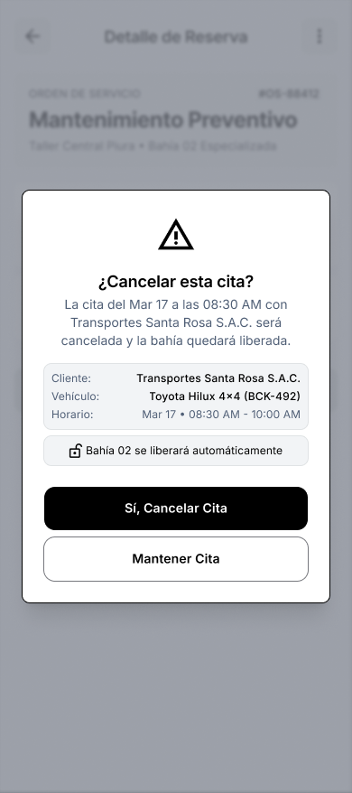
  
<b>Figura 62.</b> Wireframe de flujo de cancelación de cita (US028).

##### Directorio de Clientes y Flotas Comerciales

Como se observa en la Figura 63, el registro consolida clientes particulares y empresas de flotas con su razón social, unidades activas y contacto.

  
  
<b>Figura 63.</b> Wireframe de directorio de clientes y flotas (US032/US030).

##### Padrón de Unidades de Flota

Tal como se detalla en la Figura 64, la lista de vehículos de flota indica la placa de cada unidad, chofer asignado y estado operativo.

  
  
<b>Figura 64.</b> Wireframe de listado de unidades de flota (US024).

#### Módulo 5: Inventario y Control de Repuestos FIFO (Inventory Management) - Wireframes
*Historias de Usuario cubiertas: US008, US009, US010*

##### Catálogo e Inventario General de Repuestos

Tal como se observa en la Figura 65, el catálogo lista cada artículo con código SKU, descripción, marca, stock actual disponible y precio de venta.

  
  
<b>Figura 65.</b> Wireframe de catálogo e inventario general de repuestos (US008).

##### Alta de Repuesto en Catálogo

Como se muestra en la Figura 66, el formulario solicita datos técnicos del producto, compatibilidad vehicular, categoría y umbral mínimo de alerta de reposición.

  
  
<b>Figura 66.</b> Wireframe de alta de repuesto con stock mínimo (US008).

##### Ingreso de Lote con Costeo FIFO

Tal como se evidencia en la Figura 67, el registro de mercadería captura la guía de compra, costo unitario por lote y fecha de ingreso para el cálculo estricto FIFO.

  
  
<b>Figura 67.</b> Wireframe de ingreso de lote de repuestos FIFO (US010).

##### Ajuste Manual de Existencias y Mermas

Como se observa en la Figura 68, la pantalla permite modificar cantidades por inventario físico o piezas dañadas con justificativo formal.

  
  
<b>Figura 68.</b> Wireframe de ajuste manual de existencias (US010).

##### Bloqueo por Saldo de Stock Negativo

Tal como se muestra en la Figura 69, el sistema bloquea cualquier solicitud de despacho que supere la cantidad física en almacén.

  
  
<b>Figura 69.</b> Wireframe de alerta de stock negativo bloqueante.

#### Módulo 6: Operaciones de Taller y Órdenes de Trabajo (Service Operations) - Wireframes
*Historias de Usuario cubiertas: US011, US012, US013, US014, US015, US048, US049, US050*

##### Catálogo Maestro de Servicios

Tal como se observa en la Figura 70, el catálogo maestro define los servicios del taller, duración estimada y tarifas estándar de mano de obra.

  
  
<b>Figura 70.</b> Wireframe de catálogo maestro de servicios del taller (US011).

##### Tablero Kanban de Órdenes de Trabajo

Como se ilustra en la Figura 71, el tablero organiza las órdenes por columnas de estado (Creada, En Diagnóstico, En Proceso, Completada) con buscador predictivo.

  
  
<b>Figura 71.</b> Wireframe de tablero kanban de Órdenes de Trabajo (US050).

##### Creación y Recepción de Orden de Trabajo

Tal como se evidencia en la Figura 72, la pantalla de recepción registra el cliente, vehículo, kilometraje, nivel de combustible y los síntomas manifestados por el usuario.

  
  
<b>Figura 72.</b> Wireframe de apertura y recepción de Orden de Trabajo (US012).

##### Espacio de Ejecución Técnica del Mecánico

Como se observa en la Figura 73, el espacio de trabajo del técnico en bahía permite cronometrar la labor, adjuntar fotos de evidencia, ingresar diagnóstico y despachar repuestos.

  
  
<b>Figura 73.</b> Wireframe de espacio técnico del mecánico en bahía (US014/US015).

##### Bloqueo por Falta de Diagnóstico Obligatorio

Tal como se muestra en la Figura 74, el software bloquea el cierre de la labor si el técnico no ha documentado el diagnóstico técnico formal.

  
  
<b>Figura 74.</b> Wireframe de bloqueo al completar labor sin diagnóstico (US014).

#### Módulo 7: Facturación, Cotizaciones y Pasarela de Pagos (Billing & Payments) - Wireframes
*Historias de Usuario cubiertas: US016, US037, US038, US039, US041, US042, US043, US044, US045*

##### Creación y Liquidación de Cotización

Tal como se observa en la Figura 75, el asesor consolida mano de obra y repuestos en la cotización, calculando subtotal, 18% de IGV y descuentos aplicables.

  
  
<b>Figura 75.</b> Wireframe de generación de cotización técnica (US037).

##### Aprobación Digital de Cotización DRAFT

Como se ilustra en la Figura 76, el conductor revisa el presupuesto ítem por ítem en su teléfono móvil y autoriza los trabajos con su firma digital.

  
  
<b>Figura 76.</b> Wireframe de aprobación digital de cotización (US038).

##### Pasarela de Pago Digital con Stripe

Tal como se evidencia en la Figura 77, el formulario seguro captura número de tarjeta, expiración y código de seguridad CVV con tokenización bancaria.

  
  
<b>Figura 77.</b> Wireframe de pasarela de checkout con tarjeta (US044).

##### Emisión de Comprobante Fiscal en PDF

Como se muestra en la Figura 78, el sistema genera el documento tributario en PDF con los datos fiscales de emisor y receptor.

  
  
<b>Figura 78.</b> Wireframe de visor de comprobante electrónico en PDF (US041).

##### Liquidación Definitiva de Orden de Trabajo

Tal como se observa en la Figura 79, una vez cubierto el saldo, el cajero liquida formalmente la orden en el sistema.

  
  
<b>Figura 79.</b> Wireframe de liquidación y marcado de OT como pagada (US016).

#### Módulo 8: Experiencia Digital del Conductor (Driver B2C Experience) - Wireframes
*Historias de Usuario cubiertas: Dashboard, Garaje, Monitoreo en Vivo*

##### Dashboard Principal del Conductor (ShiftIQ Driver Home)

Tal como se observa en la Figura 80, el dashboard esquemático del conductor reúne el score de salud general del vehículo, estado de conexión OBD-II, kilometraje actual, alertas preventivas y accesos rápidos.

  
  
<b>Figura 80.</b> Wireframe de panel principal del conductor.

##### Mi Garaje e Historial de Reparaciones

Como se ilustra en la Figura 81, la sección Mi Garaje archiva las intervenciones pasadas del vehículo, comprobantes tributarios asociados y sugerencias de mantenimiento preventivo.

  
  
<b>Figura 81.</b> Wireframe de garaje virtual y bitácora de mantenimientos.

##### Monitoreo en Tiempo Real de la Orden de Trabajo

Tal como se evidencia en la Figura 82, el propietario visualiza en vivo qué tarea está ejecutando el mecánico en ese momento y el tiempo estimado para la conclusión.

  
  
<b>Figura 82.</b> Wireframe de seguimiento en tiempo real de la orden en taller.

##### Autorización Remota de Trabajos Adicionales

Como se observa en la Figura 83, si durante la intervención el técnico descubre una falla imprevista, envía una solicitud con foto y presupuesto que el cliente aprueba desde su móvil.

  
  
<b>Figura 83.</b> Wireframe de autorización remota de trabajos o repuestos adicionales.

---

### 3.1.4.2. Mobile Applications Wireflow Diagrams

Los diagramas de Wireflow conectan las pantallas de alambre mediante caminos de decisión y transiciones lógicas para ilustrar la navegación en los tres flujos críticos del producto:

#### Wireflow 1: Recepción, Enrolamiento y Diagnóstico OBD-II en Taller
1. **Apertura de Orden:** El recepcionista pulsa *Nueva OT* en el **Dashboard Operativo** e ingresa los datos de recepción.
2. **Enrolamiento:** Si la placa no existe en la base de datos, el sistema transiciona a **Registro de Vehículo**.
3. **Escaneo Telemático:** En la bahía, el mecánico abre el **Bottom Sheet Vincular OBD2** y selecciona el dongle Bluetooth detectado. Al conectarse, la vista avanza a **Escaneo OBD-II en curso**.
4. **Interpretación:** Finalizado el escaneo, la pantalla transiciona a **Consulta de Alertas DTC** y muestra la **Traducción Simple DTC** con la recomendación técnica.

#### Wireflow 2: Asignación, Ejecución Técnica y Despacho FIFO
1. **Asignación de Tareas:** En el detalle de la OT, el jefe de taller pulsa *Agregar Tarea* y asigna al técnico responsable.
2. **Bahía Técnica:** El mecánico abre su **Espacio de Ejecución Técnica**, pulsa *Iniciar Labor* y documenta los hallazgos en *Detalles y Diagnóstico*.
3. **Despacho FIFO:** Al requerir repuestos, el técnico solicita piezas en *Catálogo de Repuestos*. Si el stock es suficiente, se aplican salidas por costeo FIFO. En caso contrario, el modal *Stock Insuficiente* impide la salida.
4. **Cierre de Labor:** Con el diagnóstico redactado y las piezas asignadas, se pulsa *Completar Tarea*, pasando la OT a liquidación.

#### Wireflow 3: Cotización, Checkout Digital con Stripe y Entrega
1. **Presupuesto:** El asesor emite la cotización en **Crear Cotización** en estado *DRAFT*.
2. **Visto Bueno Digital:** El cliente recibe la alerta en su móvil, abre **Aprobación de Cotización DRAFT** y firma digitalmente.
3. **Pasarela de Pago:** En ventanilla o desde el app, se selecciona *Tarjeta / Stripe* en la pantalla de **Checkout**. Al procesar la tarjeta, la pantalla transiciona a **Procesando Pago** y confirma con **Pago Exitoso**.
4. **Comprobante y Salida:** Se emite la **Boleta Electrónica PDF**, el voucher se archiva en el garaje del cliente y la OT se marca como **Pagada**, liberando la bahía.

---

### 3.1.4.3. Mobile Applications Mock-ups

Los mockups de la aplicación móvil de ShiftIQ plasman la versión en alta fidelidad de las interfaces, aplicando de forma estricta el sistema visual, componentes de UI y tokens de estilo documentados en la sección 3.1.1:
- **Paleta Cromática de Marca:** Uso predominante del azul corporativo *Navy Primary* (`#1E3A8A`) en barras de navegación, encabezados y botones primarios; azul cielo *Accent Sky Blue* (`#60A5FA`) para estados interactivos y enlaces; naranja automotriz *Severity Orange* (`#C94A0E`) para alertas de severidad y llamadas a la acción prioritarias; y verde esmeralda (`#3DBE6C`) para estados conectados y transacciones exitosas.
- **Tipografía Institucional:** Familia *Inter*, con jerarquías claras desde títulos semibold (18-20sp), subtítulos (14-16sp) hasta textos auxiliares y etiquetas (12sp).
- **Componentes Nativos y Accesibilidad:** Contenedores de tarjeta (*Cards*) con esquinas redondeadas de 12px, sombras difusas (*elevation*), botones táctiles de al menos 48dp de altura y contrastes conformes a WCAG 2.1 AA.

A continuación, se presentan los mockups organizados en los mismos 8 módulos del sistema:

#### Módulo 1: Identidad, Autenticación y Seguridad (IAM) - Mockups
*Historias de Usuario cubiertas: US001, US002, US004, US035, US036*

##### Registro de Taller y Dueño B2B

Como se aprecia en la Figura 84, el mockup en alta fidelidad aplica la identidad corporativa de ShiftIQ con el azul Navy Primary (`#1E3A8A`), campos con esquinas redondeadas, selector de tipo de taller y botones táctiles optimizados.

  
  
<b>Figura 84.</b> Mockup de registro de taller y dueño B2B en alta fidelidad (US001).

##### Inicio de Sesión B2B

Tal como se visualiza en la Figura 85, el diseño final de alta fidelidad incorpora el isotipo oficial de ShiftIQ IoT, selector de idioma, botón principal en Navy Primary y acceso federado con Google OAuth2.

  
  
<b>Figura 85.</b> Mockup de inicio de sesión B2B para talleres mecánicos (US002).

##### Verificación de Seguridad con Código OTP

Como se comprueba en la Figura 86, el mockup implementa microinteracciones de foco en cada celda, teclado numérico nativo y enlace destacado para reenvío del desafío de autenticación.

  
  
<b>Figura 86.</b> Mockup de verificación OTP de seguridad (US004).

##### Perfil de Usuario y Ajustes de Cuenta

Tal como se aprecia en la Figura 87, la interfaz final exhibe el avatar del usuario con insignia de verificación, estado de suscripción y botones de acción con contrastes conformes a WCAG 2.1 AA.

  
  
<b>Figura 87.</b> Mockup de perfil de usuario y configuración de seguridad (US035).

##### Cambio de Contraseña Autenticado

Como se evidencia en la Figura 88, el mockup ofrece una lista de chequeo dinámica con indicadores verdes que validan en tiempo real mayúsculas, dígitos y símbolos requeridos.

  
  
<b>Figura 88.</b> Mockup de cambio de contraseña con retroalimentación de seguridad (US036).

#### Módulo 2: Gestión de Talleres, Sucursales y Licenciamiento (Workshop Management) - Mockups
*Historias de Usuario cubiertas: US005, US006, US007*

##### Dashboard Operativo de Planta

Como se aprecia en la Figura 89, el mockup en alta fidelidad destaca el badge verde `OBD-II LIVE`, las 3 métricas de turno AM (Bahías 75%, 6 en espera, 8 en proceso con 3 urgentes), la tarjeta de alerta de sensor O2 con botones para llamar o agendar bahía, y la grilla de acciones rápidas.

  
  
<b>Figura 89.</b> Mockup de Dashboard Operativo del Taller B2B en alta fidelidad.

##### Directorio de Personal y Asignación de Roles

Tal como se muestra en la Figura 90, el diseño visual incluye avatares coloreados según especialidad técnica, filtros por sucursal y botón flotante de alta de nuevo técnico.

  
  
<b>Figura 90.</b> Mockup de directorio de personal técnico y roles (US005).

##### Detalle y Capacidad Operativa de Sucursal

Como se observa en la Figura 91, el mockup añade un mapa de geolocalización, indicadores de capacidad en tiempo real y el botón para editar la infraestructura de bahías.

  
  
<b>Figura 91.</b> Mockup de capacidad operativa y bahías de sucursal (US006).

##### Administración de Suscripción por Sede

Tal como se comprueba en la Figura 92, la interfaz final presenta tarjetas de suscripción estilizadas (Plan Profesional), estado del ciclo de facturación y botón de upgrade de capacidades.

  
  
<b>Figura 92.</b> Mockup de administración de plan SaaS por sucursal (US007).

##### Navegación Lateral del Taller (Navigation Drawer)

Como se aprecia en la Figura 93, el drawer en alta fidelidad exhibe el imagotipo de ShiftIQ, datos de la sede activa y enlaces destacados con iconografía FontAwesome consistente.

  
  
<b>Figura 93.</b> Mockup de Navigation Drawer para talleres mecánicos.

#### Módulo 3: Inteligencia Vehicular y Diagnóstico OBD-II (Vehicle Intelligence & Diagnostics) - Mockups
*Historias de Usuario cubiertas: US017, US018, US019, US020, US021, US023, US025*

##### Registro de Vehículo Automotriz

Como se aprecia en la Figura 94, el mockup en alta fidelidad incorpora validación visual del formato de placa peruana y asociación simultánea del número de serie del escáner OBD-II.

  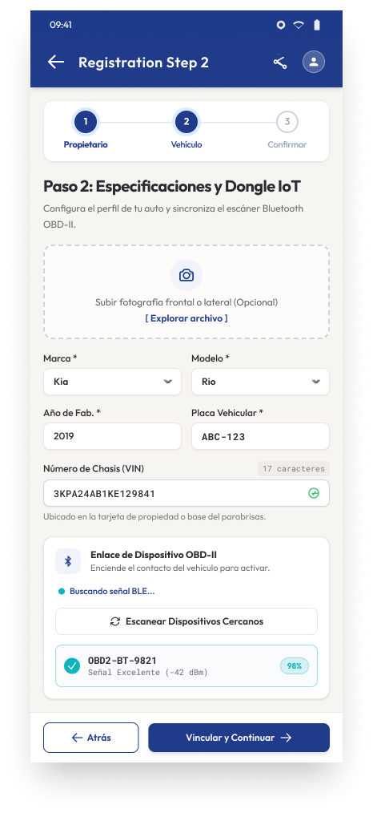
  
<b>Figura 94.</b> Mockup de enrolamiento vehicular y adaptador OBD-II (US017).

##### Vinculación Bluetooth de Dongle OBD-II

Tal como se evidencia en la Figura 95, el mockup en alta fidelidad confirma el estado de enlace con el dongle, indicando la dirección MAC, intensidad de señal y opciones seguras de desvinculación.

  
  
<b>Figura 95.</b> Mockup de gestión y confirmación de enlace de dongle OBD-II (US018/US020).

##### Consola de Telemetría en Tiempo Real

Como se aprecia en la Figura 96, el mockup final transforma los datos brutos en tacómetros circulares de alta precisión con rangos de tolerancia y alertas por color (verde para óptimo, ámbar para advertencia).

  
  
<b>Figura 96.</b> Mockup de consola telemática con medidores digitales (US019).

##### Escaneo Electrónico y Sondeo de Sensores

Tal como se comprueba en la Figura 97, el mockup exhibe el escaneo por subsistemas (Motor, Transmisión, Frenos ABS, Emisiones) con barras porcentuales dinámicas en Navy Primary.

  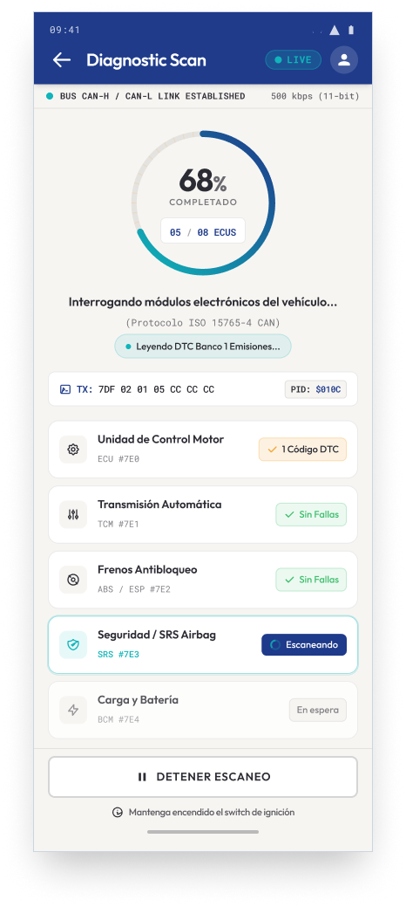
  
<b>Figura 97.</b> Mockup de escaneo activo con barras de progreso de ECU.

##### Diagnóstico de Fallas DTC y Traducción Didáctica

Como se observa en la Figura 98, el mockup presenta tarjetas de falla con bordes de severidad cromática (ámbar para media, rojo para crítica) y traducción amigable del significado de la avería para el cliente.

  
  
<b>Figura 98.</b> Mockup de visualización y severidad de alertas DTC (US023).

##### Modo Offline y Cola de Sincronización Local

Tal como se aprecia en la Figura 99, el diseño visual en alta fidelidad incorpora un banner superior de advertencia no invasivo que indica el número de paquetes pendientes de sincronización al restablecerse la red.

  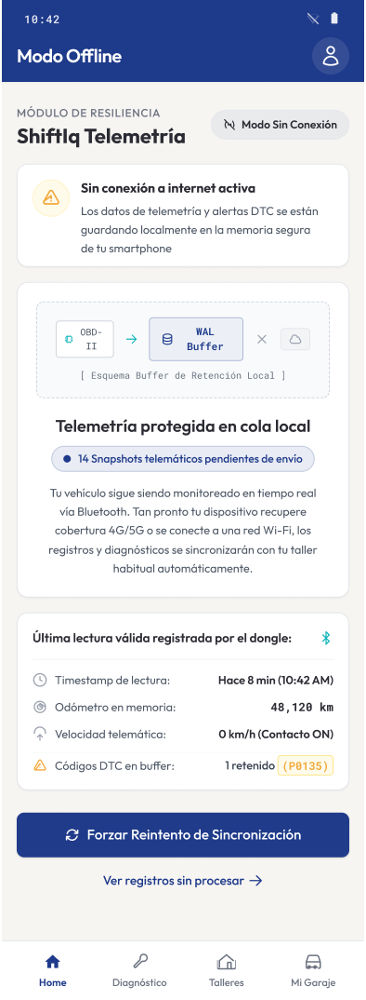
  
<b>Figura 99.</b> Mockup de banner offline y cola de sincronización de telemetría (US025).

#### Módulo 4: Flotas y Agenda de Citas Técnicas (Fleet & Appointments) - Mockups
*Historias de Usuario cubiertas: US026, US028, US029, US030, US031, US032*

##### Agenda Diaria de Citas por Bahía

Como se aprecia en la Figura 100, el mockup en alta fidelidad utiliza colores de estado para distinguir citas confirmadas (verde), vehículos en rampa (azul) y turnos completados.

  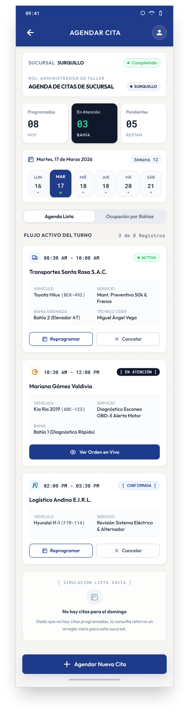
  
<b>Figura 100.</b> Mockup de agenda técnica y estado de turnos por bahía (US029).

##### Reserva de Turno y Asignación de Bahía

Tal como se comprueba en la Figura 101, el mockup presenta un selector gráfico de elevadores mecánicos que previene solapamientos o sobrecargas en la sede.

  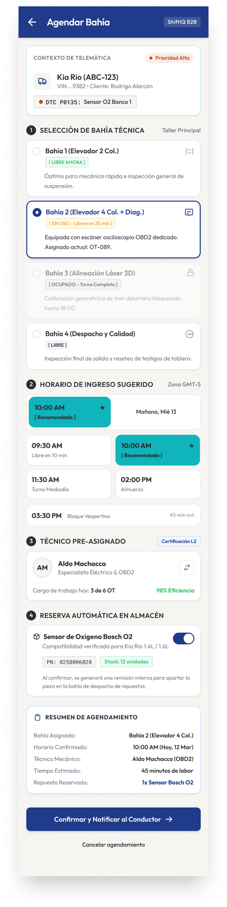
  
<b>Figura 101.</b> Mockup de selección interactiva de bahía técnica (US026).

##### Cancelación y Gestión de Citas

Como se aprecia en la Figura 102, un diálogo modal de confirmación advierte sobre la liberación inmediata del espacio en la agenda del taller.

  
  
<b>Figura 102.</b> Mockup de confirmación de anulación y liberación de bahía (US028).

##### Directorio de Clientes y Flotas Comerciales

Tal como se ilustra en la Figura 103, el diseño visual añade pestañas de segmentación (Particulares / Flotas), historial de consumo y accesos rápidos de contacto telefónico y WhatsApp.

  
  
<b>Figura 103.</b> Mockup de directorio de clientes particulares y corporativos (US032/US030).

##### Padrón de Unidades de Flota

Como se evidencia en la Figura 104, el mockup muestra tarjetas vehiculares con indicadores telemáticos en vivo, kilometraje actual y fecha límite para el próximo mantenimiento preventivo.

  
  
<b>Figura 104.</b> Mockup de padrón vehicular de flota comercial (US024).

#### Módulo 5: Inventario y Control de Repuestos FIFO (Inventory Management) - Mockups
*Historias de Usuario cubiertas: US008, US009, US010*

##### Catálogo e Inventario General de Repuestos

Como se aprecia en la Figura 105, el mockup incorpora buscador predictivo, categorización por familias de piezas (Frenos, Sensores, Suspensión) y etiquetas de alerta de stock crítico en rojo.

  
  
<b>Figura 105.</b> Mockup de catálogo e inventario de repuestos en alta fidelidad (US008).

##### Alta de Repuesto en Catálogo

Tal como se visualiza en la Figura 106, el diseño en alta fidelidad cuenta con lector de código de barras para el campo SKU y cálculo automático de márgenes de ganancia sobre el costo de adquisición.

  
  
<b>Figura 106.</b> Mockup de formulario de alta de nuevo repuesto (US008).

##### Ingreso de Lote con Costeo FIFO

Como se aprecia en la Figura 107, el mockup final muestra la tabla cronológica de lotes activos con su costo histórico para garantizar la valuación exacta de existencias.

  
  
<b>Figura 107.</b> Mockup de recepción de lote con trazabilidad FIFO (US010).

##### Ajuste Manual de Existencias y Mermas

Tal como se comprueba en la Figura 108, el formulario final exige ingresar el motivo del ajuste y genera un comprobante de auditoría firmado electrónicamente por el jefe de almacén.

  
  
<b>Figura 108.</b> Mockup de ajuste manual de stock y justificación (US010).

##### Bloqueo por Saldo de Stock Negativo

Como se aprecia en la Figura 109, una ventana modal con borde carmesí advierte la imposibilidad del consumo y ofrece crear una orden de compra urgente.

  
  
<b>Figura 109.</b> Mockup de validación de bloqueo ante falta de existencias.

#### Módulo 6: Operaciones de Taller y Órdenes de Trabajo (Service Operations) - Mockups
*Historias de Usuario cubiertas: US011, US012, US013, US014, US015, US048, US049, US050*

##### Catálogo Maestro de Servicios

Como se aprecia en la Figura 110, el diseño visual categoriza las labores por especialidad (Mantenimiento Periódico, Frenos, Electrónica) con precios visibles en Soles.

  
  
<b>Figura 110.</b> Mockup de catálogo maestro de servicios automotrices (US011).

##### Tablero Kanban de Órdenes de Trabajo

Tal como se visualiza en la Figura 111, el mockup en alta fidelidad muestra tarjetas de trabajo ricas con placa, fotografía del vehículo, mecánico a cargo, tiempo acumulado e insignia de urgencia.

  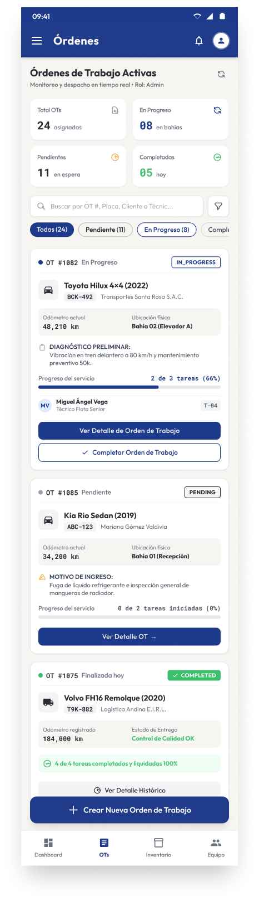
  
<b>Figura 111.</b> Mockup de tablero kanban operativo de Órdenes de Trabajo (US050).

##### Creación y Recepción de Orden de Trabajo

Como se comprueba en la Figura 112, el diseño final incluye checklist gráfico interactivo de daños exteriores de carrocería y captura de firma digital del cliente.

  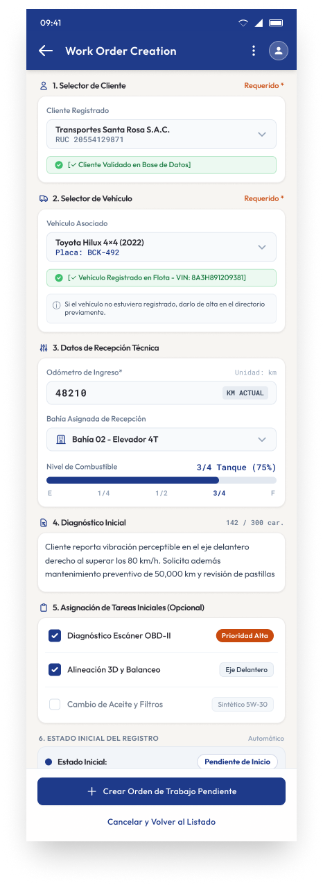
  
<b>Figura 112.</b> Mockup de recepción técnica y apertura de Orden de Trabajo (US012).

##### Espacio de Ejecución Técnica del Mecánico

Tal como se aprecia en la Figura 113, el mockup final exhibe el terminal del mecánico (OT #1082 Bahía 02, Toyota Hilux), controles de estado de tarea (En Progreso / Pausar), campo obligatorio de diagnóstico con contador de caracteres (154 / mín. 40), registro fotográfico con miniaturas de antes/después, despacho de repuestos con verificación de stock de almacén y botón principal de completar tarea.

  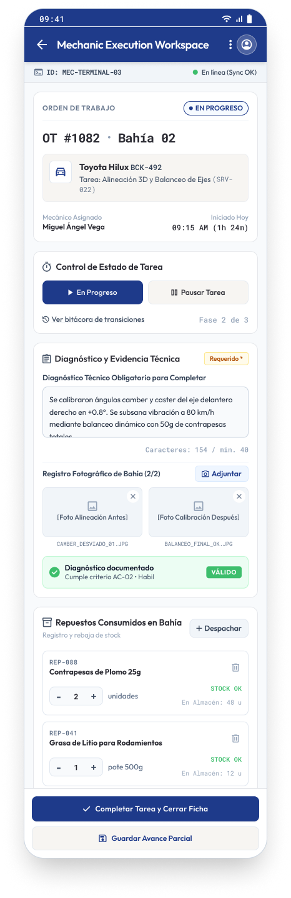
  
<b>Figura 113.</b> Mockup de terminal de ejecución del mecánico (Mechanic Workspace).

##### Bloqueo por Falta de Diagnóstico Obligatorio

Como se comprueba en la Figura 114, un diálogo contextual resalta el campo de observaciones en rojo y orienta al mecánico sobre los datos requeridos.

  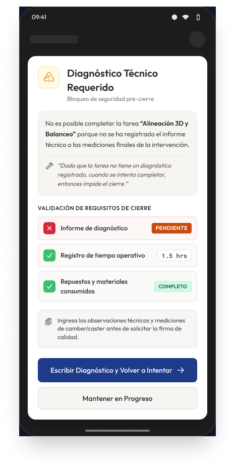
  
<b>Figura 114.</b> Mockup de validación de diagnóstico técnico obligatorio (US014).

#### Módulo 7: Facturación, Cotizaciones y Pasarela de Pagos (Billing & Payments) - Mockups
*Historias de Usuario cubiertas: US016, US037, US038, US039, US041, US042, US043, US044, US045*

##### Creación y Liquidación de Cotización

Como se aprecia en la Figura 115, el diseño visual en alta fidelidad desglosa de forma clara los importes en moneda nacional (PEN) con botón para remitir la propuesta digital al móvil del cliente.

  
  
<b>Figura 115.</b> Mockup de elaboración de presupuesto y cotización (US037).

##### Aprobación Digital de Cotización DRAFT

Tal como se comprueba en la Figura 116, el mockup final muestra la propuesta con desglose de repuestos y servicios aprobados, condiciones de garantía y botón de autorización inmediata.

  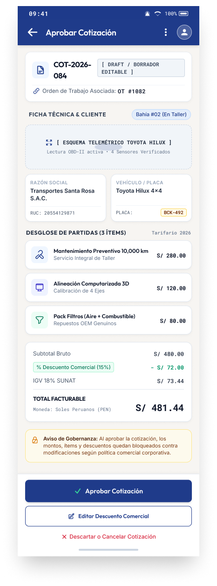
  
<b>Figura 116.</b> Mockup de visto bueno y firma de cotización por el cliente (US038).

##### Pasarela de Pago Digital con Stripe

Como se aprecia en la Figura 117, el mockup en alta fidelidad expone el monto total a cobrar (S/ 481.44 PEN con IGV 18%), selector de métodos (Tarjeta / Stripe, Efectivo Caja, Transferencia BCP, Yape / Plin), formulario Stripe Elements con tarjeta de crédito/débito y casilla de auto-emisión de Factura Electrónica.

  
  
<b>Figura 117.</b> Mockup de pasarela de pago digital integrada con Stripe (US044).

##### Emisión de Comprobante Fiscal en PDF

Tal como se comprueba en la Figura 118, la factura final en PDF contiene código QR tributario según normativa SUNAT, número correlativo oficial, desglose de ítems y firma digital.

  
  
<b>Figura 118.</b> Mockup de boleta o factura electrónica emitida (US041).

##### Liquidación Definitiva de Orden de Trabajo

Como se aprecia en la Figura 119, la vista final confirma el cierre económico de la orden de trabajo, liberando la unidad vehicular para su retiro y la bahía para una nueva atención.

  
  
<b>Figura 119.</b> Mockup de confirmación de orden pagada y salida de vehículo (US016).

#### Módulo 8: Experiencia Digital del Conductor (Driver B2C Experience) - Mockups
*Historias de Usuario cubiertas: Dashboard, Garaje, Monitoreo en Vivo*

##### Dashboard Principal del Conductor (ShiftIQ Driver Home)

Como se aprecia en la Figura 120, el mockup en alta fidelidad despliega el estado `OBD-II Conectado`, la tarjeta de servicio activo en Taller Silva con barra de progreso, medidor circular con score de salud del 94%, cuadrícula de 4 lecturas de telemetría en tiempo real (RPM 850, Refrigerante 88 °C, Batería 13.8 V, Kilometraje 48,120 km), tarjeta de alerta leve de sensor O2 y barra inferior de navegación.

  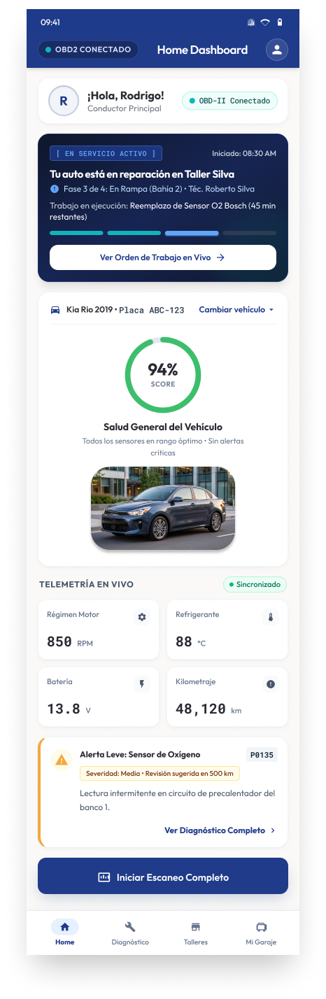
  
<b>Figura 120.</b> Mockup de panel principal del conductor (ShiftIQ Driver Home) en alta fidelidad.

##### Mi Garaje e Historial de Reparaciones

Tal como se visualiza en la Figura 121, el diseño final lista las atenciones históricas con fecha, kilometraje registrado, taller ejecutor, costo total y acceso a la descarga del informe técnico.

  
  
<b>Figura 121.</b> Mockup de bitácora histórica y garaje digital del conductor.

##### Monitoreo en Tiempo Real de la Orden de Trabajo

Como se muestra en la Figura 122, el mockup en alta fidelidad exhibe una línea de tiempo dinámica con la fase activa de trabajo (En Rampa), nombre del técnico a cargo y botón de contacto directo.

  
  
<b>Figura 122.</b> Mockup de seguimiento en vivo de la orden de trabajo en bahía.

##### Autorización Remota de Trabajos Adicionales

Tal como se comprueba en la Figura 123, el mockup final exhibe la fotografía de la pieza desgastada tomada en bahía por el mecánico, costo del repuesto de reemplazo y botones interactivos para autorizar o rechazar la labor adicional.

  
  
<b>Figura 123.</b> Mockup de aprobación remota de hallazgos adicionales con evidencia fotográfica.

---

### 3.1.4.4. Mobile Applications User Flow Diagrams

Los diagramas de User Flow describen el trayecto integral de los actores del sistema (conductores y operadores de taller) a lo largo de las decisiones de negocio y validaciones del software:

---

### 3.1.4.5. Mobile Applications Prototyping

Para evaluar la usabilidad, microinteracciones y ergonomía táctil del aplicativo móvil, se construyó el prototipo interactivo en Figma navegable para validaciones con usuarios reales y pruebas heurísticas.

- **Herramienta de Prototipado:** Figma.
- **Enlace al archivo de diseño y prototipo navegable:** [Shift IQ Wireframes y Prototipo Interactivo – Figma](https://www.figma.com/design/Vi2I1dal5Ifx52U1Z00qf3/Shift-IQ-Wireframes?node-id=0-1&t=vsBCs3oHJjYhHEmB-0)
- **Escenarios de Navegación Interactiva Clave:**
  1. *Escenario 1 (IAM y Seguridad):* Flujo de inicio de sesión B2B/B2C, recuperación de cuenta mediante desafío OTP de 6 dígitos y cambio de contraseña autenticado.
  2. *Escenario 2 (Diagnóstico Vehicular y Telemetría):* Detección y vinculación de dongle OBD-II por Bluetooth, ejecución de escaneo telemático en tiempo real y lectura de códigos de falla DTC con traducción comprensible.
  3. *Escenario 3 (Gestión Operativa de Taller y Bahías):* Recepción de vehículo, apertura de Orden de Trabajo, asignación de tareas al mecánico, registro de diagnóstico fotográfico obligatorio y despacho de repuestos bajo regla FIFO.
  4. *Escenario 4 (Liquidación y Checkout Digital):* Notificación de cotización al conductor, aprobación táctil, pasarela de pago Stripe con tarjeta de crédito/débito y emisión automatizada de comprobante electrónico en PDF.
