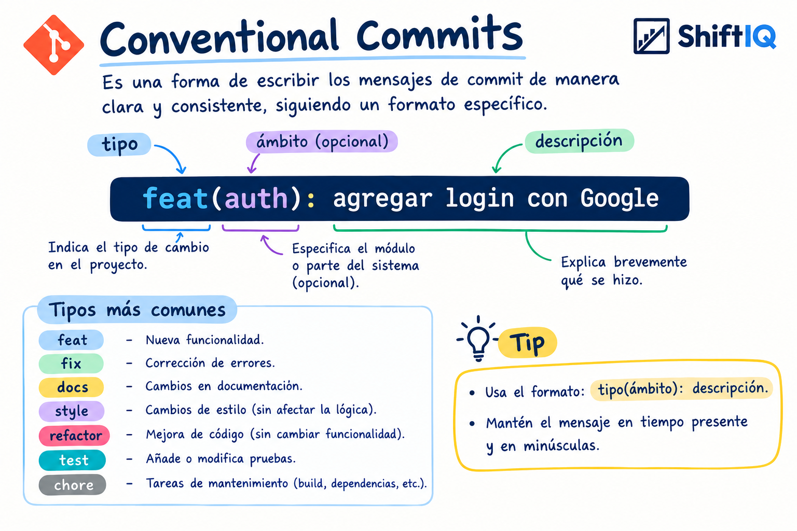

# 4.1. Software Configuration Management

## 4.1.2. Source Code Management

En esta sección se describe cómo el equipo TuxLogic organiza y controla los cambios en el código fuente de los productos de ShiftIQ (Landing Page, Web Services y aplicaciones cliente). Todo se versiona con Git y se aloja en GitHub, dentro de la organización del proyecto. Para el trabajo en paralelo se usa GitFlow como flujo de trabajo, con ramas diferenciadas por propósito.

**Organización en GitHub:** [https://github.com/tux-logic](https://github.com/tux-logic)

### Repositorios

Como se detalla en la **Tabla 30**, a continuación se listan los repositorios públicos donde se almacenan los archivos y avances de cada producto:

**Tabla 30**  
*Repositorios oficiales de los componentes de ShiftIQ*

| Producto | Repositorio |
| --- | --- |
| Landing Page | [https://github.com/tux-logic/Shiftiq-Landing-Page](https://github.com/tux-logic/Shiftiq-Landing-Page) |
| Web Services (Backend API) | [https://github.com/tux-logic/shiftiq-platform](https://github.com/tux-logic/shiftiq-platform) |
| Aplicación Móvil (Mobile App) | [https://github.com/tux-logic/shiftiq-mobile-app](https://github.com/tux-logic/shiftiq-mobile-app) |
| Documentación (Project Report) | [https://github.com/tux-logic/upc-pre-202620-1acc0238-13981-TuxLogic-report](https://github.com/tux-logic/upc-pre-202620-1acc0238-13981-TuxLogic-report) |

Los repositorios de la aplicación web y de la aplicación móvil forman parte de la misma organización oficial `tux-logic` en GitHub, rigiéndose bajo el estándar GitFlow y las convenciones descritas a continuación.

### GitFlow

ShiftIQ evoluciona por sprints y varios integrantes trabajan al mismo tiempo sobre distintas partes del producto. Por eso se adopta el modelo de ramas GitFlow (Driessen, 2010): permite gestionar las versiones de cada producto durante su ciclo de vida y separar el trabajo para que se realice en paralelo sin pisarse.

#### Ramas principales

* **`main`:** contiene la versión estable en producción, es decir, la que usan los talleres y conductores. Solo recibe cambios desde una rama `release` o `hotfix`, siempre mediante Pull Request. No se hacen commits directos sobre ella.
* **`develop`:** es la rama de integración del desarrollo y funciona como preproducción. Reúne las funcionalidades terminadas en las ramas `feature` y las correcciones de las ramas `bugfix`. Tampoco recibe commits directos.

#### Ramas de soporte

* **`feature/<tema>`:** se crea desde `develop`, una por funcionalidad, y vuelve a `develop` por Pull Request cuando la funcionalidad está terminada y probada. El nombre depende del producto:
  * **Web Services:** el Bounded Context o la funcionalidad principal. Ejemplos reales: `feature/core`, `feature/hierarchical-staff-and-specialties`, `feature/billing-stripe-payment`.
  * **Landing Page:** la sección del sitio. Ejemplos: `feature/hero`, `feature/plans`, `feature/team`.
  * **Aplicaciones web y móvil:** la pantalla o el flujo del usuario. Ejemplos: `feature/appointments`, `feature/work-orders`, `feature/vehicle-diagnostics`.
  * **Documentación:** la sección del informe. Ejemplos reales: `feature/requirements`, `feature/team-members-photos`, `feature/fix-c4-diagram-html-labels`.
* **`release/v<X.Y.Z>`:** se crea desde `develop` al cerrar un sprint para preparar la entrega. Solo admite ajustes menores y el número de versión. Al terminar se integra en `main`, donde se etiqueta, y también en `develop`.
* **`hotfix/<descripcion>`:** se crea desde `main` para corregir un error crítico en producción sin esperar al siguiente sprint. Se integra en `main` y en `develop`. Ejemplo: `hotfix/jwt-refresh-expiration`.
* **`bugfix/<descripcion>`:** se crea desde `develop` para corregir un error encontrado antes del despliegue y vuelve a `develop`. Ejemplo: `bugfix/appointment-date-validation`.

Todo Pull Request hacia `develop` o `main` lo revisa al menos otro integrante. En el backend, además, `./mvnw test` debe terminar sin fallos, y en el informe el PDF debe compilar con Typst.

### Release Versioning Conventions

Las versiones de cada producto siguen Semantic Versioning 2.0.0 (Preston-Werner, s.f.), con el formato `vMAYOR.MENOR.PARCHE`:

* **MAYOR:** aumenta cuando la entrega rompe la compatibilidad con la anterior, por ejemplo, si cambia el contrato de un endpoint que ya consumen los clientes.
* **MENOR:** aumenta cuando se agregan funcionalidades compatibles con la versión anterior.
* **PARCHE:** aumenta cuando solo se corrigen errores o detalles visuales.

En ShiftIQ, la primera entrega estable de cada producto será `v1.0.0`, al cerrar su primer sprint de implementación. Cada sprint siguiente que agregue funcionalidades sumará uno al número menor (`v1.1.0`, `v1.2.0`), y cada hotfix sumará uno al parche (`v1.1.1`). La etiqueta se crea en `main` al integrar la rama `release` o `hotfix`. Hasta ese momento, el artefacto Maven del backend se mantiene en `0.0.1-SNAPSHOT`. El informe lleva su propio registro de versiones desde `v1.0`.

### Commits Conventions

Los mensajes de commit siguen la especificación Conventional Commits 1.0.0 (Conventional Commits, s.f.), tal como se ilustra en la **Figura 308**. Su objetivo es que cualquier integrante entienda qué cambió con solo leer el historial.



**Figura 308.** Guía visual de Conventional Commits adoptada por el equipo de ShiftIQ.

La estructura de un mensaje es la siguiente:

```text
<tipo>(<ámbito>): <descripción>

<cuerpo opcional>
```

* **Tipo:** indica la clase de cambio realizado.
  * `feat`: nueva funcionalidad o sección.
  * `fix`: corrección de errores.
  * `docs`: cambios en la documentación.
  * `style`: cambios de formato o estilo que no afectan la lógica.
  * `refactor`: mejora interna del código sin cambiar su funcionalidad.
  * `test`: adición o modificación de pruebas.
  * `chore`: tareas de mantenimiento, como actualizar dependencias o la configuración de compilación.
* **Ámbito (opcional):** indica el módulo o la parte del sistema que se modifica. En el backend es el Bounded Context (`iam`, `core`, `fleet`, `operations`, `billing`, `security`, `database`); en la landing, la sección (`hero`, `plans`); y en el informe, el capítulo o tema (`requirements`, `scm`).
* **Descripción:** resume en una línea qué se hizo. Se escribe en tiempo presente, en minúsculas y sin punto final.
* **Cuerpo (opcional):** explica con más detalle qué cambió y por qué.

Ejemplos tomados de los repositorios del proyecto:

```text
feat(core): implement workshop specialties aggregate, persistence, services and REST controller
feat(database): add migration V14 for workshop specialties and hierarchical staff roles
fix(security): restrict customer and employee profile writes to admin or self
docs(style-guidelines): enhance branding and typography guidelines with color palette and iconography details
style(typst): restore rounded table corners (radius: 5pt) and clean sans-serif typography stack
chore(assets): add 1E2A78 color swatch for chapter 4
```
