# 4.1. Software Configuration Management

## 4.1.4. Software Deployment Configuration

En esta sección se especifica la configuración y los pasos seguidos para desplegar los productos de ShiftIQ a partir de sus repositorios en GitHub. La Landing Page se despliega en **Vercel** como sitio estático. La aplicación Backend (Web Services) se empaqueta como contenedor **Docker** junto con una base de datos **PostgreSQL**, y sus endpoints se verifican con **Swagger UI**.

### Despliegue de la Landing Page con Vercel

#### Paso 1: Creación del repositorio

Como primer paso, se crea el repositorio en GitHub dentro de la organización `tux-logic`. En él se aloja todo lo relacionado con la Landing Page.

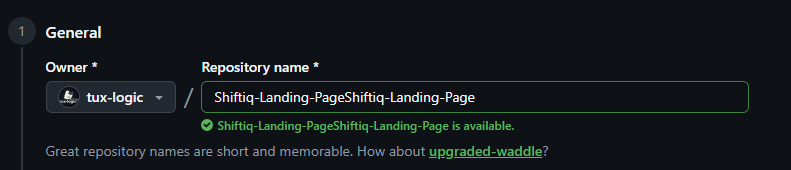

*Creación del repositorio de la Landing Page en la organización tux-logic.*

#### Paso 2: Creación del proyecto en WebStorm

Como segundo paso, se crea el proyecto en WebStorm con la opción **Create Git repository** activada y JavaScript como lenguaje, para luego vincularlo con el repositorio remoto.

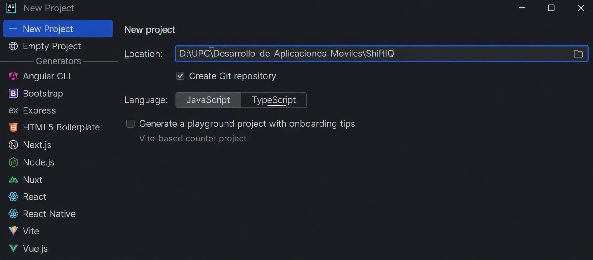

*Creación del proyecto de la Landing Page en WebStorm.*

#### Paso 3: Carga de archivos necesarios

Como tercer paso, se incorporan los archivos necesarios para la Landing Page: las páginas HTML, la hoja de estilos, los scripts de JavaScript (incluido el archivo de traducciones `i18n.js`) y los recursos gráficos.

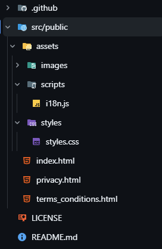

*Estructura de archivos de la Landing Page.*

#### Paso 4: Preparar el lanzamiento

Como cuarto paso, se integran todas las funcionalidades en la rama principal `main` y se verifica que el repositorio contenga los archivos que se publicarán: `index.html`, `terminos.html`, las carpetas `css`, `js`, `Imagenes` y `Videos`, y el archivo `vercel.json`, que configura el despliegue.

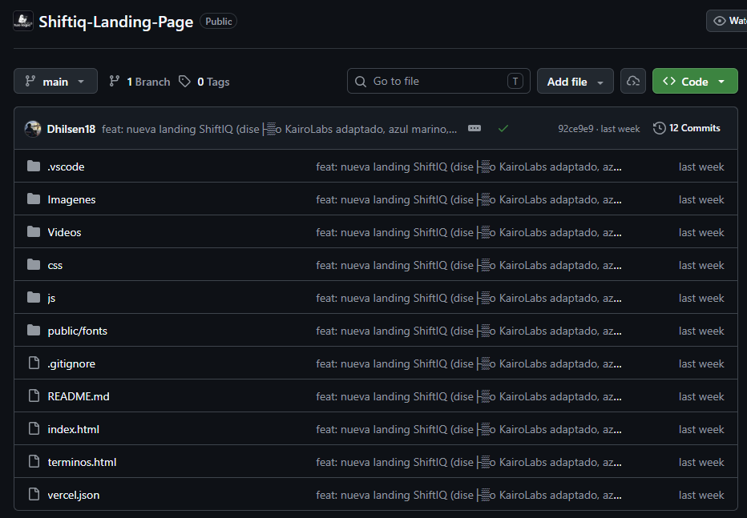

*Repositorio de la Landing Page listo para el despliegue en la rama main.*

El archivo `vercel.json` declara que el proyecto es un sitio estático:

```json
{
  "$schema": "https://openapi.vercel.sh/vercel.json",
  "framework": null,
  "buildCommand": null,
  "outputDirectory": ".",
  "cleanUrls": true,
  "trailingSlash": false
}
```

* `framework` y `buildCommand` en `null`: no hay paso de compilación.
* `outputDirectory: "."`: se publica la raíz del repositorio.
* `cleanUrls: true`: las páginas se sirven sin la extensión `.html`.
* `trailingSlash: false`: las URLs no terminan en `/`.

#### Paso 5: Desplegar la Landing Page

Como quinto paso, se inicia sesión en Vercel con la cuenta de GitHub, se selecciona **Add New → Project** y se importa el repositorio `Shiftiq-Landing-Page`. Vercel detecta el `vercel.json` y publica la rama `main` como **Production Deployment**. Desde ese momento, cada push a `main` genera un nuevo despliegue de forma automática.

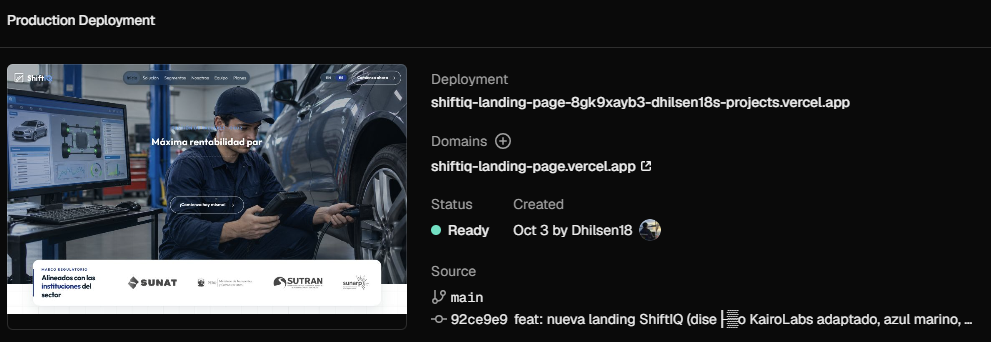

*Despliegue de producción de la Landing Page en Vercel, en estado Ready, desde la rama main.*

#### Paso 6: Acceder a la Landing Page

Como paso final, Vercel asigna el dominio público desde el cual se accede a la Landing Page desplegada: [https://shiftiq-landing-page.vercel.app](https://shiftiq-landing-page.vercel.app).

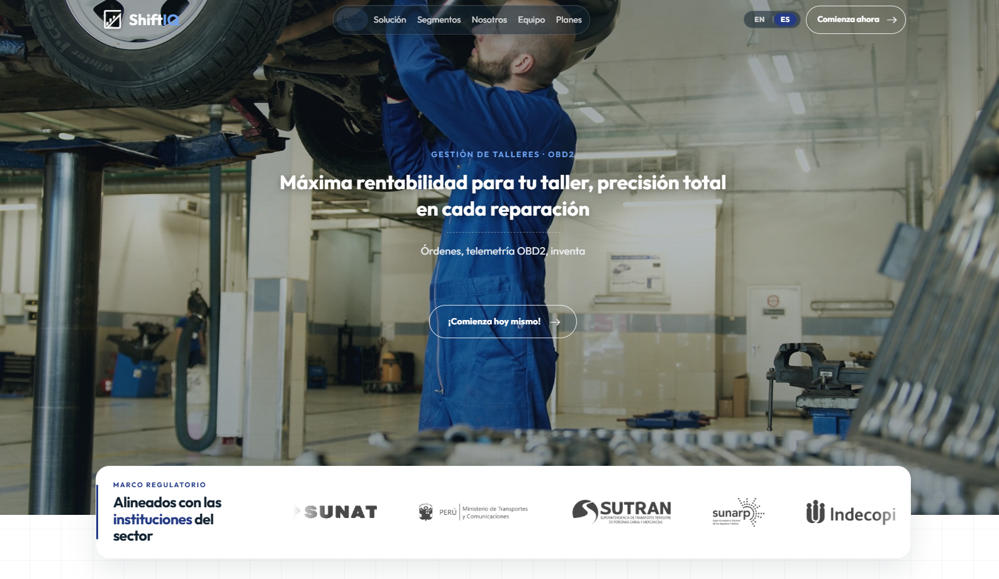

*Landing Page de ShiftIQ publicada en Vercel.*

### Despliegue de la Aplicación Backend con Docker y PostgreSQL

#### Paso 1: Creación del repositorio

Como primer paso, se crea el repositorio en GitHub dentro de la organización `tux-logic`. En él se aloja todo lo relacionado con la aplicación Backend: [shiftiq-platform](https://github.com/tux-logic/shiftiq-platform).

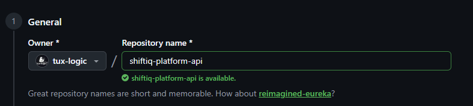

*Creación del repositorio de la aplicación Backend en la organización tux-logic.*

#### Paso 2: Estructura y carga de archivos necesarios

Como segundo paso, se crea el proyecto Spring Boot con Java 26 y Maven, y se cargan los archivos necesarios:

* El código fuente en `src/main/java`, organizado por Bounded Context: `analytics`, `billing`, `core`, `fleet`, `iam`, `inventory`, `iot`, `operations` y `shared`.
* Las configuraciones y migraciones en `src/main/resources`.
* Las pruebas en `src/test`.
* Los archivos de despliegue: `Dockerfile`, `docker-compose.yml`, `.env.template` y el Maven Wrapper (`mvnw`, `mvnw.cmd`).

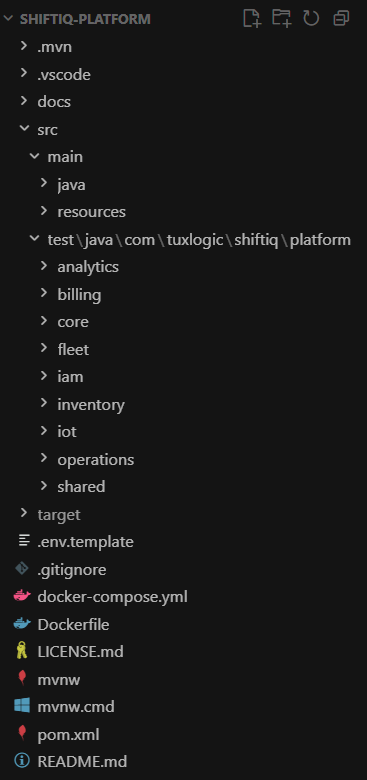

*Estructura de archivos de la aplicación Backend.*

#### Paso 3: Construcción de la imagen Docker

Como tercer paso, la aplicación se empaqueta con el `Dockerfile` del repositorio, que trabaja en dos etapas:

1. **Etapa de construcción** (`maven:3.9.16-eclipse-temurin-26`): descarga las dependencias y genera el JAR con `./mvnw clean package -DskipTests`.
2. **Etapa de ejecución** (`eclipse-temurin:26-jre`): copia solo el JAR, activa el perfil `prod` y expone el puerto `8080`.

Así, la imagen final no incluye Maven ni el código fuente, lo que reduce su tamaño.

#### Paso 4: Configuración de la base de datos PostgreSQL

Como cuarto paso, se configura la base de datos PostgreSQL 16. En el entorno local, `docker-compose.yml` levanta el servicio `postgres-db` (imagen `postgres:16-alpine`) con la base `shiftiq_db` en el puerto `5432` y un volumen persistente.

En producción, el perfil `prod` se conecta con SSL obligatorio (`sslmode=require`). Al arrancar, **Flyway** aplica en orden las migraciones de `src/main/resources/db/migration` (de `V1__baseline.sql` a `V14__create_workshop_specialties_and_staff_roles.sql`), y Hibernate solo valida que las entidades coincidan con el esquema.

#### Paso 5: Configuración de variables de entorno

Como quinto paso, se definen las variables de entorno que necesita la aplicación. Ningún secreto se guarda en el código: el repositorio solo incluye la plantilla `.env.template`, y el archivo `.env` real está excluido mediante `.gitignore`.

| Grupo | Variables |
| --- | --- |
| Base de datos | `DATABASE_URL`, `DATABASE_PORT`, `DATABASE_NAME`, `DATABASE_USER`, `DATABASE_PASSWORD` |
| Servidor | `PORT`, `SPRING_PROFILES_ACTIVE` (`prod`) |
| Seguridad | `JWT_SECRET` (mínimo 32 bytes en Base64), `GOOGLE_CLIENT_ID` |
| Correo SMTP | `MAIL_USERNAME`, `MAIL_PASSWORD` |
| Pagos | `MERCADOPAGO_ACCESS_TOKEN`, `MERCADOPAGO_WEBHOOK_SECRET` |
| Facturación electrónica (SUNAT) | `FACTOS_API_URL`, `FACTOS_API_KEY` |
| Imágenes | `CLOUDINARY_CLOUD_NAME`, `CLOUDINARY_API_KEY`, `CLOUDINARY_API_SECRET` |

#### Paso 6: Levantamiento de los servicios

Como sexto paso, se levantan la base de datos y la API con Docker Compose:

```bash
export JWT_SECRET=$(openssl rand -base64 32)
docker compose up -d
```

El contenedor `shiftiq-app` se conecta a `shiftiq-postgres`, aplica las migraciones y queda disponible en el puerto `8080`.

#### Paso 7: Verificación de los endpoints en Swagger UI

Como último paso, se accede a la documentación interactiva de la API agregando `/swagger-ui/index.html` a la URL del servicio. En ella se verifica que los endpoints de todos los Bounded Contexts estén publicados bajo `/api/v1/` y protegidos con JWT (ícono de candado).

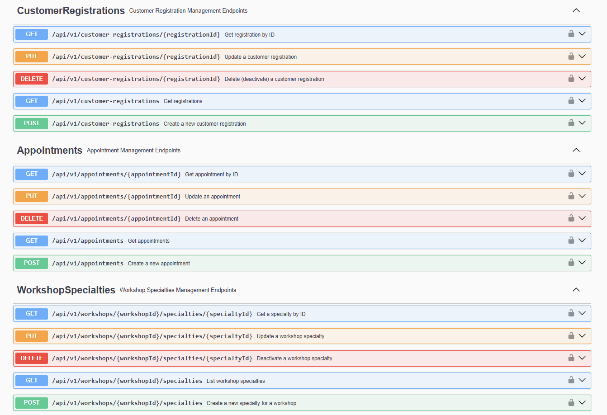

*Endpoints de Customer Registrations, Appointments y Workshop Specialties.*

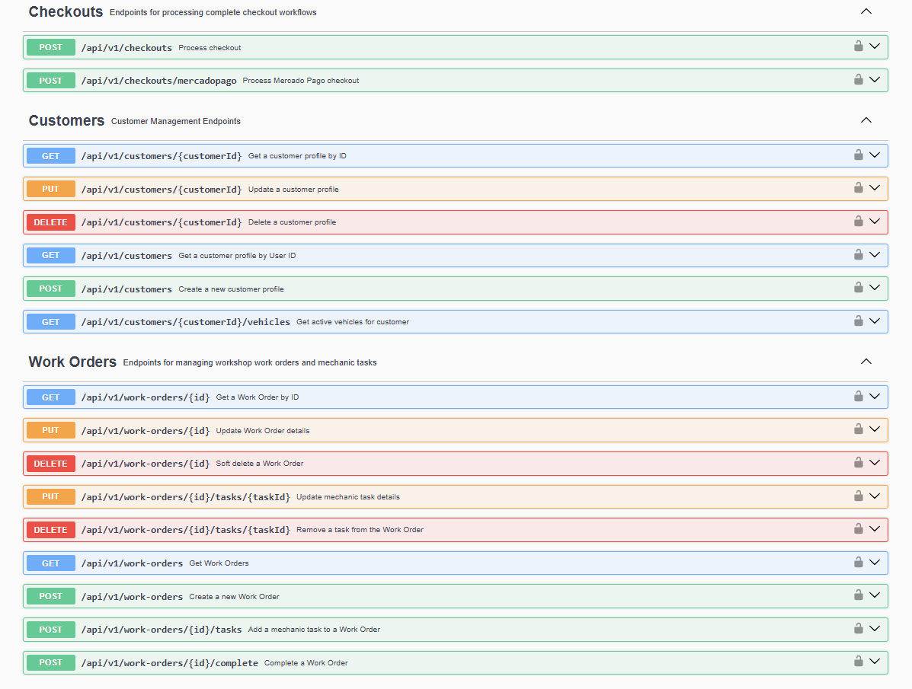

*Endpoints de Checkouts, Customers y Work Orders.*

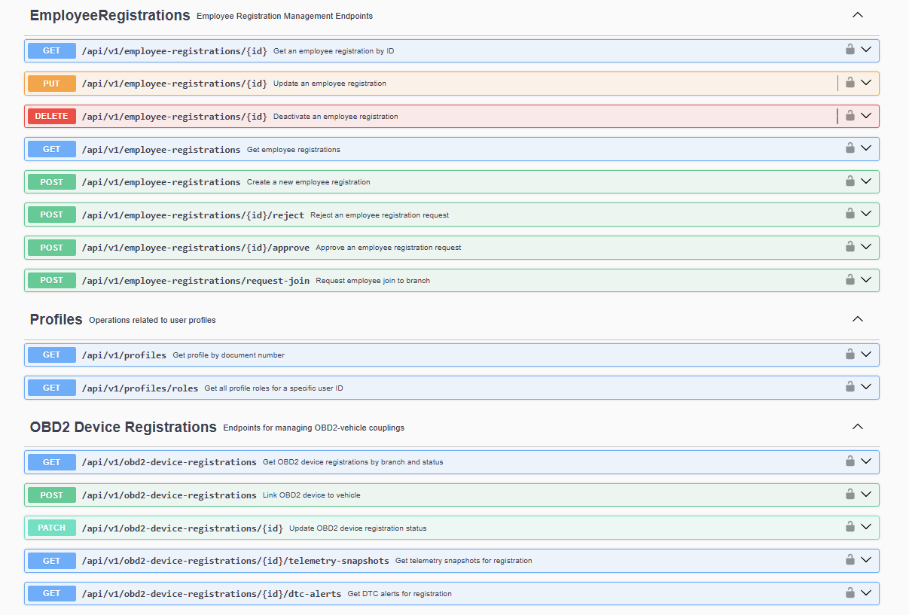

*Endpoints de Employee Registrations, Profiles y OBD2 Device Registrations.*

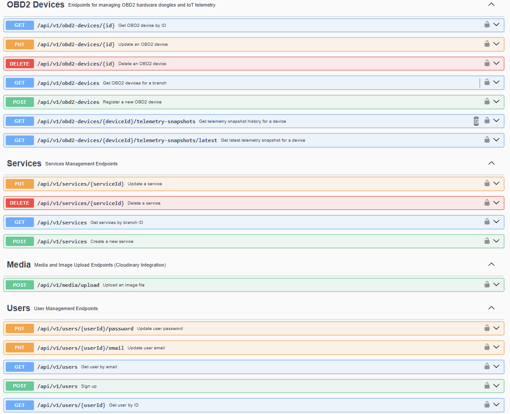

*Endpoints de OBD2 Devices, Services, Media (Cloudinary) y Users.*

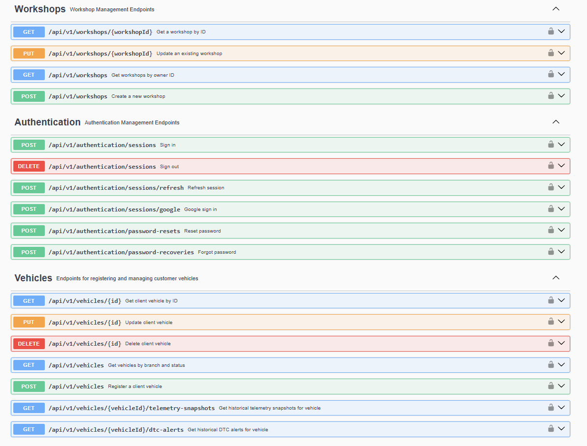

*Endpoints de Workshops, Authentication y Vehicles.*

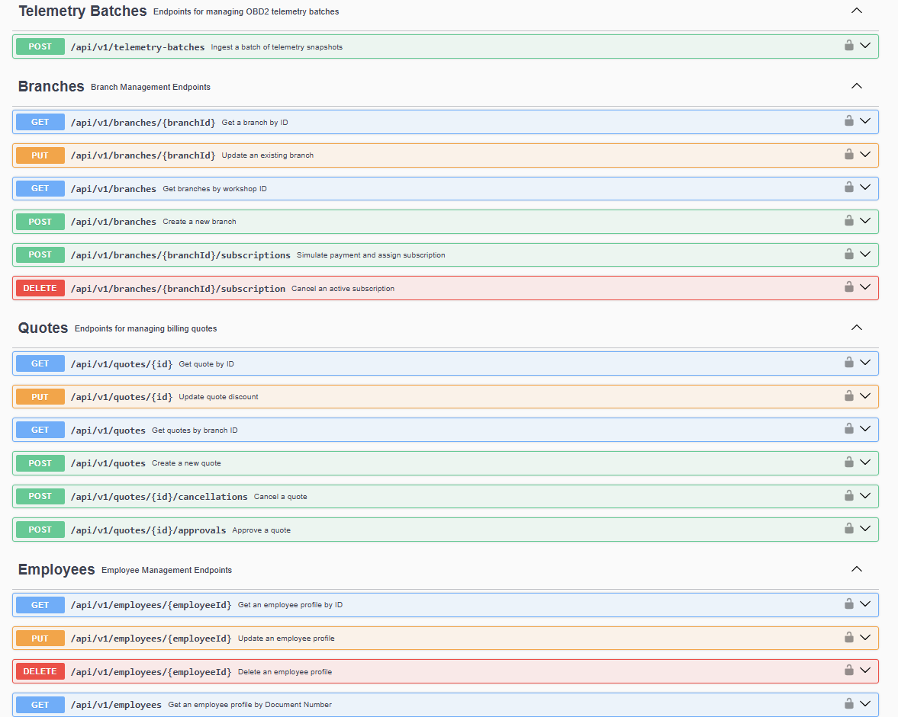

*Endpoints de Telemetry Batches, Branches, Quotes y Employees.*

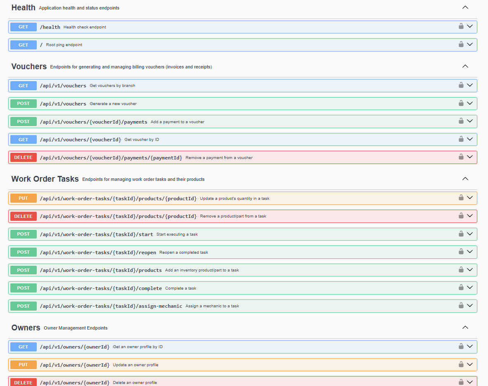

*Endpoints de Health, Vouchers, Work Order Tasks y Owners.*

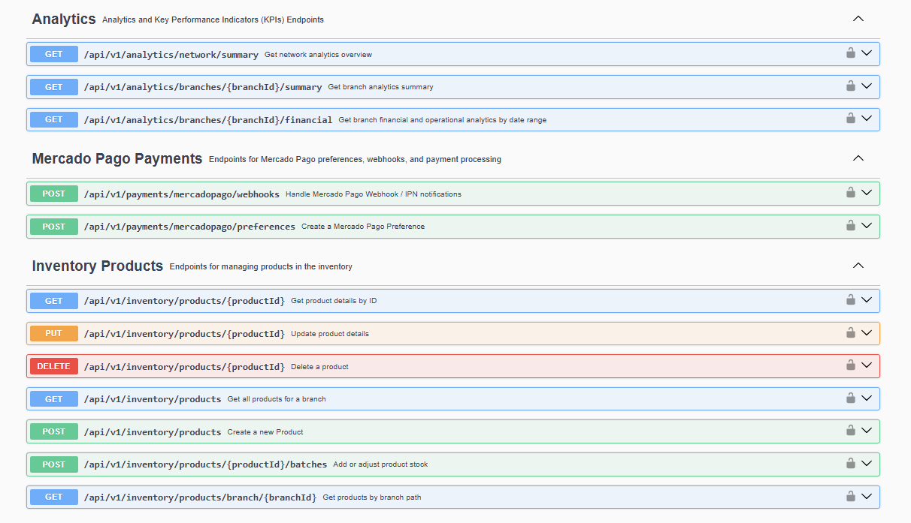

*Endpoints de Analytics, Mercado Pago Payments e Inventory Products.*

### Servicios externos

La aplicación Backend se integra con los siguientes servicios externos, configurados mediante las variables de entorno del paso 5:

| Servicio | Propósito |
| --- | --- |
| [Mercado Pago](https://www.mercadopago.com.pe/developers) | Cobro de suscripciones y pagos en línea, con verificación HMAC-SHA256 de los webhooks. |
| Factos | Emisión de comprobantes electrónicos (boletas y facturas) ante SUNAT. |
| [Cloudinary](https://cloudinary.com/) | Almacenamiento y entrega de imágenes. |
| [Gmail SMTP](https://support.google.com/a/answer/176600) | Correos de recuperación de contraseña y notificaciones. |
| [Google Identity](https://developers.google.com/identity) | Inicio de sesión con cuenta de Google. |

### Despliegue de la Aplicación Web y la Aplicación Móvil

La aplicación web (Angular) y la aplicación móvil (Android con Kotlin) se implementarán en los siguientes sprints, y sus pasos de despliegue se documentarán en esta sección con la misma estructura:

* **Aplicación web:** el build de producción se publicará en Vercel, igual que la Landing Page.
* **Aplicación móvil:** Android Studio generará el APK firmado, que se distribuirá mediante GitHub Releases. El enlace de descarga se publicará en la Landing Page.
