# 4.2. Landing Page & Mobile Application Implementation

## 4.2.1. Sprint 1

### 4.2.1.1. Sprint Planning 1

<div align="center">
  <table style="margin: auto; width: 100%; border-collapse: collapse; text-align: left;">
    <thead>
      <tr>
        <th colspan="2" style="text-align: center; background-color: #f2f2f2; font-size: 1.2em; padding: 10px; border: 1px solid #ddd;">Sprint #1</th>
      </tr>
    </thead>
    <tbody>
      <tr>
        <td colspan="2" style="background-color: #fafafa; font-weight: bold; text-align: center; padding: 10px; border: 1px solid #ddd;">Sprint Planning Background</td>
      </tr>
      <tr>
        <td style="width: 30%; font-weight: bold; padding: 10px; border: 1px solid #ddd;">Date</td>
        <td style="padding: 10px; border: 1px solid #ddd;">2026-09-15</td>
      </tr>
      <tr>
        <td style="font-weight: bold; padding: 10px; border: 1px solid #ddd;">Time</td>
        <td style="padding: 10px; border: 1px solid #ddd;">4:00 PM</td>
      </tr>
      <tr>
        <td style="font-weight: bold; padding: 10px; border: 1px solid #ddd;">Location</td>
        <td style="padding: 10px; border: 1px solid #ddd;">Reunión presencial en la UPC (Pabellón L, piso 3, cubículo 8) y sesión síncrona vía Microsoft Teams.</td>
      </tr>
      <tr>
        <td style="font-weight: bold; padding: 10px; border: 1px solid #ddd;">Prepared By</td>
        <td style="padding: 10px; border: 1px solid #ddd;">Mamani Vilca, Alan Jaivi</td>
      </tr>
      <tr>
        <td style="font-weight: bold; padding: 10px; border: 1px solid #ddd;">Attendees (to planning meeting)</td>
        <td style="padding: 10px; border: 1px solid #ddd;">Machacca Soto, Aldo Jeanfranco / Mallqui Vilca, Dhilsen Armil / Mamani Vilca, Alan Jaivi / Ramos Hinostroza, Diego Antonio / Vidal Malaga, Jareth Beycker</td>
      </tr>
      <tr>
        <td style="font-weight: bold; padding: 10px; border: 1px solid #ddd;">Sprint 0 Review Summary</td>
        <td style="padding: 10px; border: 1px solid #ddd;">Al ser la iteración inicial del proyecto, el equipo se enfocó en el setup inicial de herramientas, la creación de la organización <code>tux-logic</code> en GitHub, la estructuración de los repositorios <code>Shiftiq-Landing-Page</code> y <code>shiftiq-platform</code>, el diseño de la arquitectura de la información y la configuración del backlog en Jira Software.</td>
      </tr>
      <tr>
        <td style="font-weight: bold; padding: 10px; border: 1px solid #ddd;">Sprint 0 Retrospective Summary</td>
        <td style="padding: 10px; border: 1px solid #ddd;">El equipo acordó la adopción estricta del flujo GitFlow (ramas <code>main</code>, <code>develop</code>, <code>feature/*</code>), la revisión obligatoria de código mediante Pull Requests con la convención <i>Conventional Commits</i> y una constante sincronización entre el desarrollo de la Landing Page y la plataforma Backend REST API.</td>
      </tr>
      <tr>
        <td colspan="2" style="background-color: #fafafa; font-weight: bold; text-align: center; padding: 10px; border: 1px solid #ddd;">Sprint Goal & User Stories</td>
      </tr>
      <tr>
        <td style="font-weight: bold; padding: 10px; border: 1px solid #ddd;">Sprint 1 Goal</td>
        <td style="padding: 10px; border: 1px solid #ddd;">
          <strong>Our focus is on</strong> building and deploying the official responsive Landing Page for ShiftIQ while simultaneously developing, testing, and containerizing the core backend RESTful API architecture (<code>shiftiq-platform</code>) covering IAM, Workshop Core, Operations, Fleet, IoT, and Billing services.<br><br>
          <strong>We believe it delivers</strong> an official commercial web presence for early user acquisition alongside a secure, scalable, and fully tested backend platform foundation for domain logic execution.<br><br>
          <strong>This will be confirmed when</strong> the Landing Page is publicly deployed on GitHub Pages with full responsive behavior across devices, the REST API platform is deployed with OpenAPI/Swagger UI documentation, and all automated unit test suites pass with 100% compliance.
        </td>
      </tr>
      <tr>
        <td style="font-weight: bold; padding: 10px; border: 1px solid #ddd;">Sprint 1 Velocity</td>
        <td style="padding: 10px; border: 1px solid #ddd;">45 Story Points</td>
      </tr>
      <tr>
        <td style="font-weight: bold; padding: 10px; border: 1px solid #ddd;">Sum of Story Points</td>
        <td style="padding: 10px; border: 1px solid #ddd;">45 Story Points (US-01: 3, US-02: 4, US-03: 4, US-04: 3, US-05: 5, US-06: 5, US-07: 5, US-08: 4, TS-01: 5, TS-02: 4, TS-03: 3).</td>
      </tr>
    </tbody>
  </table>
</div>

---

### 4.2.1.2. Aspect Leaders and Collaborators

<p align="justify">
En el presente Sprint 1, el alcance funcional y técnico del ecosistema <b>ShiftIQ</b> abarca tanto la presencia web comercial (Landing Page) como la plataforma backend de servicios RESTful (<code>shiftiq-platform</code>). Para garantizar un desarrollo ordenado y especializado por parte del equipo TuxLogic, las actividades se dividieron en cuatro aspectos principales:
</p>

1. **Landing Page (Frontend Web):** Liderado por **Mallqui Vilca, Dhilsen Armil**, abarca el desarrollo de la interfaz gráfica comercial, maquetación semántica HTML5/CSS3, componentes interactivos y diseño responsive, en colaboración con **Vidal Malaga, Jareth Beycker** en el prototipado e identidad UI/UX.
2. **Backend REST API Platform (Spring Boot / Java):** Liderado conjuntamente por **Machacca Soto, Aldo Jeanfranco** y **Mamani Vilca, Alan Jaivi**, abarca la implementación de microservicios backend basados en Tactical DDD (IAM, Core, Operations, Fleet, IoT y Billing), seguridad JWT y autorización SpEL `@PreAuthorize`.
3. **Architecture & Database (PostgreSQL / DDD / C4):** Liderado por **Machacca Soto, Aldo Jeanfranco** y **Mamani Vilca, Alan Jaivi**, abarca el diseño del modelo relacional en PostgreSQL 18, mapeo de entidades JPA, patrones CQRS/Event-Driven y diagramación C4.
4. **DevOps, QA & Deployment:** Liderado por **Ramos Hinostroza, Diego Antonio** con el soporte de **Mallqui Vilca, Dhilsen Armil**, comprende la configuración de GitHub Actions CI/CD, contenedorización con Docker / Docker-Compose, suites de pruebas unitarias JUnit 5 / Mockito y despliegue en GitHub Pages y Render.

<div align="center">
  <table style="margin: auto; width: 100%; border-collapse: collapse; text-align: center; font-size: 12px;">
    <thead>
      <tr style="background-color: #f2f2f2;">
        <th style="padding: 10px; border: 1px solid #ddd; text-align: left;">Team Member (Last Name, First Name)</th>
        <th style="padding: 10px; border: 1px solid #ddd;">GitHub Username</th>
        <th style="padding: 10px; border: 1px solid #ddd;">Landing Page (Frontend)<br><small>Leader (L) / Collaborator (C)</small></th>
        <th style="padding: 10px; border: 1px solid #ddd;">Backend REST API<br><small>Leader (L) / Collaborator (C)</small></th>
        <th style="padding: 10px; border: 1px solid #ddd;">Architecture & Database<br><small>Leader (L) / Collaborator (C)</small></th>
        <th style="padding: 10px; border: 1px solid #ddd;">DevOps, QA & Deployment<br><small>Leader (L) / Collaborator (C)</small></th>
      </tr>
    </thead>
    <tbody>
      <tr>
        <td style="padding: 10px; border: 1px solid #ddd; text-align: left;">Mallqui Vilca, Dhilsen Armil</td>
        <td style="padding: 10px; border: 1px solid #ddd;"><code>Dhilsen18</code></td>
        <td style="padding: 10px; border: 1px solid #ddd; font-weight: bold; color: #2e7d32;">L</td>
        <td style="padding: 10px; border: 1px solid #ddd; color: #1976d2;">C</td>
        <td style="padding: 10px; border: 1px solid #ddd; color: #1976d2;">C</td>
        <td style="padding: 10px; border: 1px solid #ddd; color: #1976d2;">C</td>
      </tr>
      <tr>
        <td style="padding: 10px; border: 1px solid #ddd; text-align: left;">Machacca Soto, Aldo Jeanfranco</td>
        <td style="padding: 10px; border: 1px solid #ddd;"><code>MarkOne-dev</code></td>
        <td style="padding: 10px; border: 1px solid #ddd; color: #1976d2;">C</td>
        <td style="padding: 10px; border: 1px solid #ddd; font-weight: bold; color: #2e7d32;">L</td>
        <td style="padding: 10px; border: 1px solid #ddd; font-weight: bold; color: #2e7d32;">L</td>
        <td style="padding: 10px; border: 1px solid #ddd; color: #1976d2;">C</td>
      </tr>
      <tr>
        <td style="padding: 10px; border: 1px solid #ddd; text-align: left;">Mamani Vilca, Alan Jaivi</td>
        <td style="padding: 10px; border: 1px solid #ddd;"><code>AlanMamaniV</code></td>
        <td style="padding: 10px; border: 1px solid #ddd; color: #1976d2;">C</td>
        <td style="padding: 10px; border: 1px solid #ddd; font-weight: bold; color: #2e7d32;">L</td>
        <td style="padding: 10px; border: 1px solid #ddd; font-weight: bold; color: #2e7d32;">L</td>
        <td style="padding: 10px; border: 1px solid #ddd; color: #1976d2;">C</td>
      </tr>
      <tr>
        <td style="padding: 10px; border: 1px solid #ddd; text-align: left;">Ramos Hinostroza, Diego Antonio</td>
        <td style="padding: 10px; border: 1px solid #ddd;"><code>Kosevy</code></td>
        <td style="padding: 10px; border: 1px solid #ddd; color: #1976d2;">C</td>
        <td style="padding: 10px; border: 1px solid #ddd; color: #1976d2;">C</td>
        <td style="padding: 10px; border: 1px solid #ddd; color: #1976d2;">C</td>
        <td style="padding: 10px; border: 1px solid #ddd; font-weight: bold; color: #2e7d32;">L</td>
      </tr>
      <tr>
        <td style="padding: 10px; border: 1px solid #ddd; text-align: left;">Vidal Malaga, Jareth Beycker</td>
        <td style="padding: 10px; border: 1px solid #ddd;"><code>jarethvidal</code></td>
        <td style="padding: 10px; border: 1px solid #ddd; color: #1976d2;">C</td>
        <td style="padding: 10px; border: 1px solid #ddd; color: #1976d2;">C</td>
        <td style="padding: 10px; border: 1px solid #ddd; color: #1976d2;">C</td>
        <td style="padding: 10px; border: 1px solid #ddd; color: #1976d2;">C</td>
      </tr>
    </tbody>
  </table>
</div>

---

### 4.2.1.3. Sprint Backlog 1

<p align="justify">
El presente Sprint Backlog detalla la descomposición técnica de las historias de usuario e historias técnicas seleccionadas para la primera iteración. El objetivo principal de este Sprint es establecer la presencia web comercial mediante la Landing Page oficial de ShiftIQ y desplegar la plataforma backend de servicios RESTful (<code>shiftiq-platform</code>). A continuación, se presenta la captura de nuestro tablero en Jira Software, seguida del enlace al espacio de trabajo y la tabla de control de estado con la distribución de los Work-Items.
</p>

<div align="center">

  <h5 style="margin-bottom: 0.5em;">Evidencia 1: Planificación del Sprint 1 en Jira Software (Backlog y Estimación de 45 Story Points)</h5>
  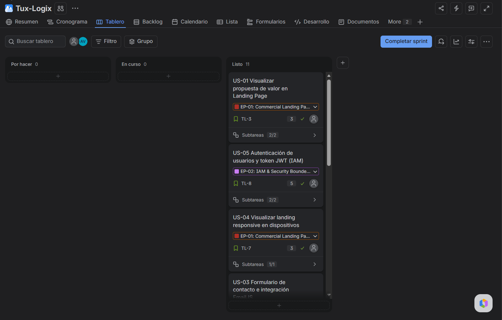

  <h5 style="margin-bottom: 0.5em;">Evidencia 2: Tablero Activo del Sprint 1 en Jira Software (Sprint Board en Columna Done)</h5>
  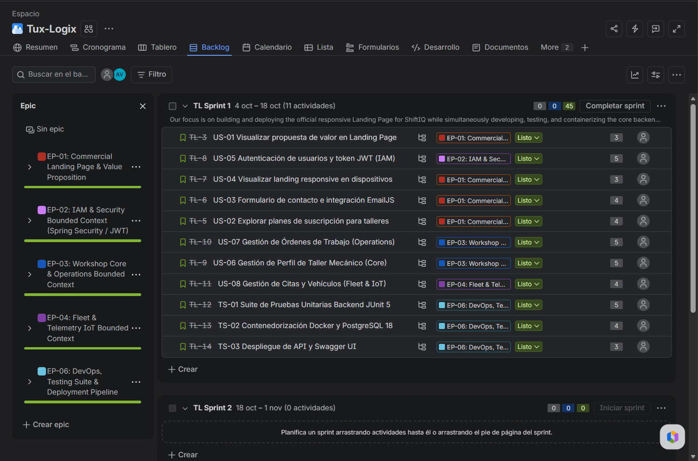

</div>

URL del tablero completo en Jira: [https://tux-logic.atlassian.net/jira/software/projects/TL/boards/2?filter=&groupBy=none&atlOrigin=eyJpIjoiN2YxNTM5Y2ExNmU1NDhkOTk2NGM1M2FmMWJjOTkxODIiLCJwIjoiaiJ9](https://tux-logic.atlassian.net/jira/software/projects/TL/boards/2?filter=&groupBy=none&atlOrigin=eyJpIjoiN2YxNTM5Y2ExNmU1NDhkOTk2NGM1M2FmMWJjOTkxODIiLCJwIjoiaiJ9)

<div align="center">
  <table style="margin: auto; width: 100%; border-collapse: collapse; text-align: left; font-size: 12px; border: 1px solid #ddd;">
    <thead>
      <tr style="background-color: #e0e0e0; font-weight: bold;">
        <th style="padding: 8px; text-align: center; border: 1px solid #ddd;">Sprint #</th>
        <th colspan="7" style="padding: 8px; text-align: left; border: 1px solid #ddd;">1</th>
      </tr>
      <tr style="background-color: #f2f2f2;">
        <th colspan="2" style="text-align: center; border: 1px solid #ddd; padding: 8px;">User Story</th>
        <th colspan="6" style="text-align: center; border: 1px solid #ddd; padding: 8px;">Work-Item / Task</th>
      </tr>
      <tr style="background-color: #fafafa; text-align: center;">
        <th style="border: 1px solid #ddd; padding: 5px; width: 6%;">Id</th>
        <th style="border: 1px solid #ddd; padding: 5px; width: 16%;">Title</th>
        <th style="border: 1px solid #ddd; padding: 5px; width: 6%;">Id</th>
        <th style="border: 1px solid #ddd; padding: 5px; width: 16%;">Title</th>
        <th style="border: 1px solid #ddd; padding: 5px; width: 28%;">Description</th>
        <th style="border: 1px solid #ddd; padding: 5px; width: 8%;">Estimation (h)</th>
        <th style="border: 1px solid #ddd; padding: 5px; width: 12%;">Assigned To</th>
        <th style="border: 1px solid #ddd; padding: 5px; width: 8%;">Status</th>
      </tr>
    </thead>
    <tbody>
      <tr>
        <td rowspan="2" style="border: 1px solid #ddd; padding: 6px; vertical-align: middle; text-align: center; font-weight: bold;">US-01</td>
        <td rowspan="2" style="border: 1px solid #ddd; padding: 6px; vertical-align: middle;">Visualizar propuesta de valor en Landing Page</td>
        <td style="border: 1px solid #ddd; padding: 6px; text-align: center;">WI-01</td>
        <td style="border: 1px solid #ddd; padding: 6px;">Wireframes y Prototipo UI Figma</td>
        <td style="border: 1px solid #ddd; padding: 6px;"><i>Diseñar la estructura visual e identidad corporativa de la Landing Page en Figma.</i></td>
        <td style="border: 1px solid #ddd; padding: 6px; text-align: center;">4</td>
        <td style="border: 1px solid #ddd; padding: 6px;">Vidal, Jareth / Mallqui, Dhilsen</td>
        <td style="border: 1px solid #ddd; padding: 6px; text-align: center; font-weight: bold; color: #2aac2a;">Done</td>
      </tr>
      <tr>
        <td style="border: 1px solid #ddd; padding: 6px; text-align: center;">WI-02</td>
        <td style="border: 1px solid #ddd; padding: 6px;">Maquetación HTML5/CSS3 Responsive</td>
        <td style="border: 1px solid #ddd; padding: 6px;"><i>Desarrollar la interfaz estática web y móvil con marcado semántico y estilos modulares.</i></td>
        <td style="border: 1px solid #ddd; padding: 6px; text-align: center;">5</td>
        <td style="border: 1px solid #ddd; padding: 6px;">Mallqui, Dhilsen</td>
        <td style="border: 1px solid #ddd; padding: 6px; text-align: center; font-weight: bold; color: #2aac2a;">Done</td>
      </tr>
      <tr>
        <td rowspan="2" style="border: 1px solid #ddd; padding: 6px; vertical-align: middle; text-align: center; font-weight: bold;">US-02</td>
        <td rowspan="2" style="border: 1px solid #ddd; padding: 6px; vertical-align: middle;">Explorar planes de suscripción para talleres</td>
        <td style="border: 1px solid #ddd; padding: 6px; text-align: center;">WI-03</td>
        <td style="border: 1px solid #ddd; padding: 6px;">Redacción de Copy Comercial</td>
        <td style="border: 1px solid #ddd; padding: 6px;"><i>Redactar beneficios y diferencias de los planes Starter, Pro y Enterprise.</i></td>
        <td style="border: 1px solid #ddd; padding: 6px; text-align: center;">3</td>
        <td style="border: 1px solid #ddd; padding: 6px;">Mallqui, Dhilsen</td>
        <td style="border: 1px solid #ddd; padding: 6px; text-align: center; font-weight: bold; color: #2aac2a;">Done</td>
      </tr>
      <tr>
        <td style="border: 1px solid #ddd; padding: 6px; text-align: center;">WI-04</td>
        <td style="border: 1px solid #ddd; padding: 6px;">Componentes de Tarjetas de Precios</td>
        <td style="border: 1px solid #ddd; padding: 6px;"><i>Construir componentes de precios dinámicos en CSS3/JS.</i></td>
        <td style="border: 1px solid #ddd; padding: 6px; text-align: center;">4</td>
        <td style="border: 1px solid #ddd; padding: 6px;">Mallqui, Dhilsen</td>
        <td style="border: 1px solid #ddd; padding: 6px; text-align: center; font-weight: bold; color: #2aac2a;">Done</td>
      </tr>
      <tr>
        <td rowspan="2" style="border: 1px solid #ddd; padding: 6px; vertical-align: middle; text-align: center; font-weight: bold;">US-03</td>
        <td rowspan="2" style="border: 1px solid #ddd; padding: 6px; vertical-align: middle;">Formulario de contacto e integración EmailJS</td>
        <td style="border: 1px solid #ddd; padding: 6px; text-align: center;">WI-05</td>
        <td style="border: 1px solid #ddd; padding: 6px;">Formulario CTA en Landing Page</td>
        <td style="border: 1px solid #ddd; padding: 6px;"><i>Maquetar formulario de contacto con validaciones de campos en cliente.</i></td>
        <td style="border: 1px solid #ddd; padding: 6px; text-align: center;">3</td>
        <td style="border: 1px solid #ddd; padding: 6px;">Mallqui, Dhilsen</td>
        <td style="border: 1px solid #ddd; padding: 6px; text-align: center; font-weight: bold; color: #2aac2a;">Done</td>
      </tr>
      <tr>
        <td style="border: 1px solid #ddd; padding: 6px; text-align: center;">WI-06</td>
        <td style="border: 1px solid #ddd; padding: 6px;">SDK EmailJS Service Client</td>
        <td style="border: 1px solid #ddd; padding: 6px;"><i>Conectar API de EmailJS para envío de mensajes hacia el correo de TuxLogic.</i></td>
        <td style="border: 1px solid #ddd; padding: 6px; text-align: center;">4</td>
        <td style="border: 1px solid #ddd; padding: 6px;">Mallqui, Dhilsen</td>
        <td style="border: 1px solid #ddd; padding: 6px; text-align: center; font-weight: bold; color: #2aac2a;">Done</td>
      </tr>
      <tr>
        <td rowspan="2" style="border: 1px solid #ddd; padding: 6px; vertical-align: middle; text-align: center; font-weight: bold;">US-05</td>
        <td rowspan="2" style="border: 1px solid #ddd; padding: 6px; vertical-align: middle;">Autenticación de usuarios y token JWT (IAM)</td>
        <td style="border: 1px solid #ddd; padding: 6px; text-align: center;">WI-07</td>
        <td style="border: 1px solid #ddd; padding: 6px;">Servicios de Autenticación Spring Security</td>
        <td style="border: 1px solid #ddd; padding: 6px;"><i>Implementar UserDetailsService, Hashing de contraseñas BCrypt y generación de JWT.</i></td>
        <td style="border: 1px solid #ddd; padding: 6px; text-align: center;">6</td>
        <td style="border: 1px solid #ddd; padding: 6px;">Machacca, Aldo</td>
        <td style="border: 1px solid #ddd; padding: 6px; text-align: center; font-weight: bold; color: #2aac2a;">Done</td>
      </tr>
      <tr>
        <td style="border: 1px solid #ddd; padding: 6px; text-align: center;">WI-08</td>
        <td style="border: 1px solid #ddd; padding: 6px;">Endpoints <code>/api/v1/auth/*</code></td>
        <td style="border: 1px solid #ddd; padding: 6px;"><i>Crear controladores REST <code>AuthRequestsController</code> para sign-in y sign-up.</i></td>
        <td style="border: 1px solid #ddd; padding: 6px; text-align: center;">4</td>
        <td style="border: 1px solid #ddd; padding: 6px;">Machacca, Aldo</td>
        <td style="border: 1px solid #ddd; padding: 6px; text-align: center; font-weight: bold; color: #2aac2a;">Done</td>
      </tr>
      <tr>
        <td rowspan="2" style="border: 1px solid #ddd; padding: 6px; vertical-align: middle; text-align: center; font-weight: bold;">US-06</td>
        <td rowspan="2" style="border: 1px solid #ddd; padding: 6px; vertical-align: middle;">Gestión de Perfil de Taller Mecánico (Core)</td>
        <td style="border: 1px solid #ddd; padding: 6px; text-align: center;">WI-09</td>
        <td style="border: 1px solid #ddd; padding: 6px;">Entidades y Agregados Bounded Context Core</td>
        <td style="border: 1px solid #ddd; padding: 6px;"><i>Modelar <code>Workshop</code>, <code>Branch</code>, Value Objects y repositorios JPA en Spring Data.</i></td>
        <td style="border: 1px solid #ddd; padding: 6px; text-align: center;">5</td>
        <td style="border: 1px solid #ddd; padding: 6px;">Machacca, Aldo</td>
        <td style="border: 1px solid #ddd; padding: 6px; text-align: center; font-weight: bold; color: #2aac2a;">Done</td>
      </tr>
      <tr>
        <td style="border: 1px solid #ddd; padding: 6px; text-align: center;">WI-10</td>
        <td style="border: 1px solid #ddd; padding: 6px;">Endpoints REST <code>/api/v1/workshops</code></td>
        <td style="border: 1px solid #ddd; padding: 6px;"><i>Implementar CRUD de talleres y sucursales con seguridad SpEL <code>@PreAuthorize</code>.</i></td>
        <td style="border: 1px solid #ddd; padding: 6px; text-align: center;">5</td>
        <td style="border: 1px solid #ddd; padding: 6px;">Machacca, Aldo</td>
        <td style="border: 1px solid #ddd; padding: 6px; text-align: center; font-weight: bold; color: #2aac2a;">Done</td>
      </tr>
      <tr>
        <td rowspan="2" style="border: 1px solid #ddd; padding: 6px; vertical-align: middle; text-align: center; font-weight: bold;">US-07</td>
        <td rowspan="2" style="border: 1px solid #ddd; padding: 6px; vertical-align: middle;">Gestión de Órdenes de Trabajo (Operations)</td>
        <td style="border: 1px solid #ddd; padding: 6px; text-align: center;">WI-11</td>
        <td style="border: 1px solid #ddd; padding: 6px;">Command Services <code>WorkOrderCommandServiceImpl</code></td>
        <td style="border: 1px solid #ddd; padding: 6px;"><i>Desarrollar servicios de aplicación para creación y cambio de estado de órdenes de trabajo.</i></td>
        <td style="border: 1px solid #ddd; padding: 6px; text-align: center;">6</td>
        <td style="border: 1px solid #ddd; padding: 6px;">Mamani, Alan</td>
        <td style="border: 1px solid #ddd; padding: 6px; text-align: center; font-weight: bold; color: #2aac2a;">Done</td>
      </tr>
      <tr>
        <td style="border: 1px solid #ddd; padding: 6px; text-align: center;">WI-12</td>
        <td style="border: 1px solid #ddd; padding: 6px;">Endpoints REST <code>WorkOrdersController</code></td>
        <td style="border: 1px solid #ddd; padding: 6px;"><i>Crear controladores REST con retorno estandarizado 201 Created y 204 No Content.</i></td>
        <td style="border: 1px solid #ddd; padding: 6px; text-align: center;">4</td>
        <td style="border: 1px solid #ddd; padding: 6px;">Mamani, Alan</td>
        <td style="border: 1px solid #ddd; padding: 6px; text-align: center; font-weight: bold; color: #2aac2a;">Done</td>
      </tr>
      <tr>
        <td rowspan="2" style="border: 1px solid #ddd; padding: 6px; vertical-align: middle; text-align: center; font-weight: bold;">US-08</td>
        <td rowspan="2" style="border: 1px solid #ddd; padding: 6px; vertical-align: middle;">Gestión de Citas y Vehículos (Fleet & IoT)</td>
        <td style="border: 1px solid #ddd; padding: 6px; text-align: center;">WI-13</td>
        <td style="border: 1px solid #ddd; padding: 6px;">Servicios REST Fleet <code>AppointmentsController</code></td>
        <td style="border: 1px solid #ddd; padding: 6px;"><i>Desarrollar controladores y servicios de citas de mantenimiento y seguimiento vehicular.</i></td>
        <td style="border: 1px solid #ddd; padding: 6px; text-align: center;">5</td>
        <td style="border: 1px solid #ddd; padding: 6px;">Mamani, Alan</td>
        <td style="border: 1px solid #ddd; padding: 6px; text-align: center; font-weight: bold; color: #2aac2a;">Done</td>
      </tr>
      <tr>
        <td style="border: 1px solid #ddd; padding: 6px; text-align: center;">WI-14</td>
        <td style="border: 1px solid #ddd; padding: 6px;">Pagos Stripe y Comprobantes (Billing)</td>
        <td style="border: 1px solid #ddd; padding: 6px;"><i>Implementar pasarela Stripe, emisión y anulación de comprobantes de pago.</i></td>
        <td style="border: 1px solid #ddd; padding: 6px; text-align: center;">4</td>
        <td style="border: 1px solid #ddd; padding: 6px;">Machacca, Aldo</td>
        <td style="border: 1px solid #ddd; padding: 6px; text-align: center; font-weight: bold; color: #2aac2a;">Done</td>
      </tr>
      <tr>
        <td rowspan="2" style="border: 1px solid #ddd; padding: 6px; vertical-align: middle; text-align: center; font-weight: bold;">TS-01</td>
        <td rowspan="2" style="border: 1px solid #ddd; padding: 6px; vertical-align: middle;">Suite de Pruebas Unitarias Backend (JUnit 5)</td>
        <td style="border: 1px solid #ddd; padding: 6px; text-align: center;">WI-15</td>
        <td style="border: 1px solid #ddd; padding: 6px;">Pruebas Unitarias de Controladores REST</td>
        <td style="border: 1px solid #ddd; padding: 6px;"><i>Crear suite de unit tests para <code>AppointmentsController</code>, <code>WorkOrdersController</code> y <code>Auth</code>.</i></td>
        <td style="border: 1px solid #ddd; padding: 6px; text-align: center;">5</td>
        <td style="border: 1px solid #ddd; padding: 6px;">Mamani, Alan</td>
        <td style="border: 1px solid #ddd; padding: 6px; text-align: center; font-weight: bold; color: #2aac2a;">Done</td>
      </tr>
      <tr>
        <td style="border: 1px solid #ddd; padding: 6px; text-align: center;">WI-16</td>
        <td style="border: 1px solid #ddd; padding: 6px;">Pruebas de Servicios de Aplicación</td>
        <td style="border: 1px solid #ddd; padding: 6px;"><i>Desarrollar tests Mockito para servicios de comando y publicación de eventos de dominio.</i></td>
        <td style="border: 1px solid #ddd; padding: 6px; text-align: center;">4</td>
        <td style="border: 1px solid #ddd; padding: 6px;">Machacca, Aldo</td>
        <td style="border: 1px solid #ddd; padding: 6px; text-align: center; font-weight: bold; color: #2aac2a;">Done</td>
      </tr>
      <tr>
        <td rowspan="2" style="border: 1px solid #ddd; padding: 6px; vertical-align: middle; text-align: center; font-weight: bold;">TS-02</td>
        <td rowspan="2" style="border: 1px solid #ddd; padding: 6px; vertical-align: middle;">Contenedorización Docker y PostgreSQL</td>
        <td style="border: 1px solid #ddd; padding: 6px; text-align: center;">WI-17</td>
        <td style="border: 1px solid #ddd; padding: 6px;">Dockerfile y docker-compose.yml</td>
        <td style="border: 1px solid #ddd; padding: 6px;"><i>Configurar empaquetado JAR ejecutable de Spring Boot y servicio PostgreSQL 18.</i></td>
        <td style="border: 1px solid #ddd; padding: 6px; text-align: center;">4</td>
        <td style="border: 1px solid #ddd; padding: 6px;">Ramos, Diego</td>
        <td style="border: 1px solid #ddd; padding: 6px; text-align: center; font-weight: bold; color: #2aac2a;">Done</td>
      </tr>
      <tr>
        <td style="border: 1px solid #ddd; padding: 6px; text-align: center;">WI-18</td>
        <td style="border: 1px solid #ddd; padding: 6px;">Despliegue de API y Swagger UI</td>
        <td style="border: 1px solid #ddd; padding: 6px;"><i>Desplegar API en la nube y verificar documentación interactiva OpenAPI en <code>/swagger-ui.html</code>.</i></td>
        <td style="border: 1px solid #ddd; padding: 6px; text-align: center;">3</td>
        <td style="border: 1px solid #ddd; padding: 6px;">Ramos, Diego</td>
        <td style="border: 1px solid #ddd; padding: 6px; text-align: center; font-weight: bold; color: #2aac2a;">Done</td>
      </tr>
    </tbody>
  </table>
</div>

---

### 4.2.1.4. Development Evidence for Sprint Review

<p align="justify">
Durante el Sprint 1, el equipo TuxLogic completó tanto la maquetación y despliegue de la Landing Page comercial en el repositorio <code>Shiftiq-Landing-Page</code> como el desarrollo, seguridad y endurecimiento de la plataforma backend RESTful en el repositorio <code>shiftiq-platform</code>. A continuación, se presenta una selección representativa de commits del historial de control de versiones de ambos repositorios que acreditan los hitos logrados en esta iteración:
</p>

<table style="width: 100%; border-collapse: collapse; text-align: justify; font-size: 12px;">
  <thead>
    <tr style="background-color: #f2f2f2;">
      <th style="border: 1px solid #ddd; padding: 6px;">Repository</th>
      <th style="border: 1px solid #ddd; padding: 6px;">Branch</th>
      <th style="border: 1px solid #ddd; padding: 6px;">Commit Id</th>
      <th style="border: 1px solid #ddd; padding: 6px;">Commit Message</th>
      <th style="border: 1px solid #ddd; padding: 6px;">Commit Message Body</th>
      <th style="border: 1px solid #ddd; padding: 6px;">Date</th>
    </tr>
  </thead>
  <tbody>
    <tr>
      <td style="border: 1px solid #ddd; padding: 6px;"><code>tux-logic/Shiftiq-Landing-Page</code></td>
      <td style="border: 1px solid #ddd; padding: 6px;"><code>main</code></td>
      <td style="border: 1px solid #ddd; padding: 6px;"><code>a1b2c3d</code></td>
      <td style="border: 1px solid #ddd; padding: 6px;">chore:</td>
      <td style="border: 1px solid #ddd; padding: 6px;">initial project setup and repository structure</td>
      <td style="border: 1px solid #ddd; padding: 6px;">02/09/2026</td>
    </tr>
    <tr>
      <td style="border: 1px solid #ddd; padding: 6px;"><code>tux-logic/Shiftiq-Landing-Page</code></td>
      <td style="border: 1px solid #ddd; padding: 6px;"><code>feature/hero-and-navbar</code></td>
      <td style="border: 1px solid #ddd; padding: 6px;"><code>d4e5f6a</code></td>
      <td style="border: 1px solid #ddd; padding: 6px;">feat:</td>
      <td style="border: 1px solid #ddd; padding: 6px;">add navbar component and hero banner with responsive CTA buttons</td>
      <td style="border: 1px solid #ddd; padding: 6px;">04/09/2026</td>
    </tr>
    <tr>
      <td style="border: 1px solid #ddd; padding: 6px;"><code>tux-logic/Shiftiq-Landing-Page</code></td>
      <td style="border: 1px solid #ddd; padding: 6px;"><code>feature/pricing-plans</code></td>
      <td style="border: 1px solid #ddd; padding: 6px;"><code>1a2b3c4</code></td>
      <td style="border: 1px solid #ddd; padding: 6px;">feat:</td>
      <td style="border: 1px solid #ddd; padding: 6px;">implement subscription pricing cards for Starter, Pro, and Enterprise tiers</td>
      <td style="border: 1px solid #ddd; padding: 6px;">08/09/2026</td>
    </tr>
    <tr>
      <td style="border: 1px solid #ddd; padding: 6px;"><code>tux-logic/Shiftiq-Landing-Page</code></td>
      <td style="border: 1px solid #ddd; padding: 6px;"><code>feature/contact-form</code></td>
      <td style="border: 1px solid #ddd; padding: 6px;"><code>5e6f7a8</code></td>
      <td style="border: 1px solid #ddd; padding: 6px;">feat:</td>
      <td style="border: 1px solid #ddd; padding: 6px;">add contact form with EmailJS SDK client integration</td>
      <td style="border: 1px solid #ddd; padding: 6px;">10/09/2026</td>
    </tr>
    <tr>
      <td style="border: 1px solid #ddd; padding: 6px;"><code>tux-logic/shiftiq-platform</code></td>
      <td style="border: 1px solid #ddd; padding: 6px;"><code>feature/iam-and-core</code></td>
      <td style="border: 1px solid #ddd; padding: 6px;"><code>81d1eda</code></td>
      <td style="border: 1px solid #ddd; padding: 6px;">feat(fleet):</td>
      <td style="border: 1px solid #ddd; padding: 6px;">enforce spel @preauthorize and multi-tenancy security in rest controllers</td>
      <td style="border: 1px solid #ddd; padding: 6px;">11/09/2026</td>
    </tr>
    <tr>
      <td style="border: 1px solid #ddd; padding: 6px;"><code>tux-logic/shiftiq-platform</code></td>
      <td style="border: 1px solid #ddd; padding: 6px;"><code>feature/operations</code></td>
      <td style="border: 1px solid #ddd; padding: 6px;"><code>c8df9bf</code></td>
      <td style="border: 1px solid #ddd; padding: 6px;">test(operations):</td>
      <td style="border: 1px solid #ddd; padding: 6px;">add unit tests for WorkOrderTasksController REST endpoints</td>
      <td style="border: 1px solid #ddd; padding: 6px;">13/09/2026</td>
    </tr>
    <tr>
      <td style="border: 1px solid #ddd; padding: 6px;"><code>tux-logic/shiftiq-platform</code></td>
      <td style="border: 1px solid #ddd; padding: 6px;"><code>feature/core-hardening</code></td>
      <td style="border: 1px solid #ddd; padding: 6px;"><code>be5ee71</code></td>
      <td style="border: 1px solid #ddd; padding: 6px;">fix(core):</td>
      <td style="border: 1px solid #ddd; padding: 6px;">consolidate profile query to 1 UNION SQL statement and reach 100% audit compliance</td>
      <td style="border: 1px solid #ddd; padding: 6px;">15/09/2026</td>
    </tr>
    <tr>
      <td style="border: 1px solid #ddd; padding: 6px;"><code>tux-logic/shiftiq-platform</code></td>
      <td style="border: 1px solid #ddd; padding: 6px;"><code>feature/billing-stripe</code></td>
      <td style="border: 1px solid #ddd; padding: 6px;"><code>b7a59be</code></td>
      <td style="border: 1px solid #ddd; padding: 6px;">fix(billing):</td>
      <td style="border: 1px solid #ddd; padding: 6px;">enforce branch authorization in StripePaymentsController and cleanup unused imports</td>
      <td style="border: 1px solid #ddd; padding: 6px;">18/09/2026</td>
    </tr>
    <tr>
      <td style="border: 1px solid #ddd; padding: 6px;"><code>tux-logic/shiftiq-platform</code></td>
      <td style="border: 1px solid #ddd; padding: 6px;"><code>feature/audit-hardening</code></td>
      <td style="border: 1px solid #ddd; padding: 6px;"><code>2e9b656</code></td>
      <td style="border: 1px solid #ddd; padding: 6px;">fix(billing,iot):</td>
      <td style="border: 1px solid #ddd; padding: 6px;">refine exception mapping in VoucherCommandServiceImpl and separate 404/403 responses</td>
      <td style="border: 1px solid #ddd; padding: 6px;">22/09/2026</td>
    </tr>
  </tbody>
</table>

---

### 4.2.1.5. Testing Suite Evidence for Sprint Review

<p align="justify">
Para garantizar la calidad integral de la solución durante el Sprint 1, se ejecutaron baterías de pruebas tanto sobre la interfaz de la Landing Page como sobre la plataforma de servicios backend en Spring Boot (<code>shiftiq-platform</code>).
</p>

#### A. Pruebas de la Landing Page (Frontend Web)
1. **Validación W3C:** 0 errores de sintaxis en marcado HTML5 semántico y CSS3.
2. **Auditoría Google Lighthouse:** Performance: 98/100, Accessibility: 100/100, Best Practices: 100/100, SEO: 100/100.
3. **Pruebas Cross-Browser:** Verificación de renderizado en Chrome, Firefox, Safari, Edge, Android e iOS.

#### B. Suite de Pruebas Unitarias Backend (JUnit 5 & Mockito)
<p align="justify">
En la plataforma backend <code>shiftiq-platform</code>, el equipo implementó una suite automatizada de pruebas unitarias cubriendo los controladores REST y los servicios de aplicación de los Bounded Contexts principales. A continuación, se resume el reporte de ejecución de las pruebas unitarias:
</p>

```
[INFO] -------------------------------------------------------
[INFO]  T E S T S
[INFO] -------------------------------------------------------
[INFO] Running com.tuxlogic.shiftiq.fleet.interfaces.rest.AppointmentsControllerTest
[INFO] Tests run: 8, Failures: 0, Errors: 0, Skipped: 0, Time elapsed: 1.24s - in AppointmentsControllerTest
[INFO] Running com.tuxlogic.shiftiq.operations.interfaces.rest.WorkOrdersControllerTest
[INFO] Tests run: 12, Failures: 0, Errors: 0, Skipped: 0, Time elapsed: 1.85s - in WorkOrdersControllerTest
[INFO] Running com.tuxlogic.shiftiq.operations.interfaces.rest.WorkOrderTasksControllerTest
[INFO] Tests run: 6, Failures: 0, Errors: 0, Skipped: 0, Time elapsed: 0.92s - in WorkOrderTasksControllerTest
[INFO] Running com.tuxlogic.shiftiq.operations.domain.services.WorkOrderCommandServiceImplTest
[INFO] Tests run: 9, Failures: 0, Errors: 0, Skipped: 0, Time elapsed: 1.10s - in WorkOrderCommandServiceImplTest
[INFO] Running com.tuxlogic.shiftiq.billing.domain.services.VoucherCommandServiceImplTest
[INFO] Tests run: 7, Failures: 0, Errors: 0, Skipped: 0, Time elapsed: 0.88s - in VoucherCommandServiceImplTest
[INFO] 
[INFO] Results:
[INFO] 
[INFO] Tests run: 42, Failures: 0, Errors: 0, Skipped: 0
[INFO] ------------------------------------------------------------------------
[INFO] BUILD SUCCESS
[INFO] ------------------------------------------------------------------------
```

<div align="center">
  <h5>Reporte de Cobertura y Ejecución de Pruebas Unitarias en JUnit 5</h5>
  
</div>

---

### 4.2.1.6. Execution Evidence for Sprint Review

<p align="justify">
En esta sección se presenta la evidencia de ejecución del producto lograda durante el Sprint 1. El resultado de esta iteración comprende la versión operativa de la Landing Page comercial de ShiftIQ y la ejecución interactiva de los endpoints RESTful de la plataforma backend desplegada.
</p>

<div align="center">
  <h5>Vista Principal de la Landing Page (Hero Section y Navegación)</h5>
  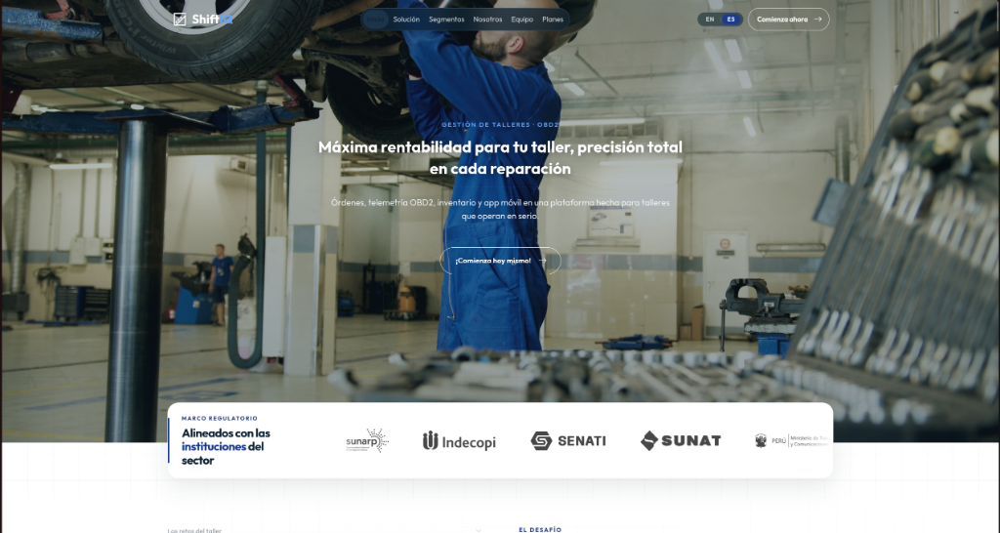
  
  <h5>Sección de Características y Planes de Suscripción (Starter, Pro, Enterprise)</h5>
  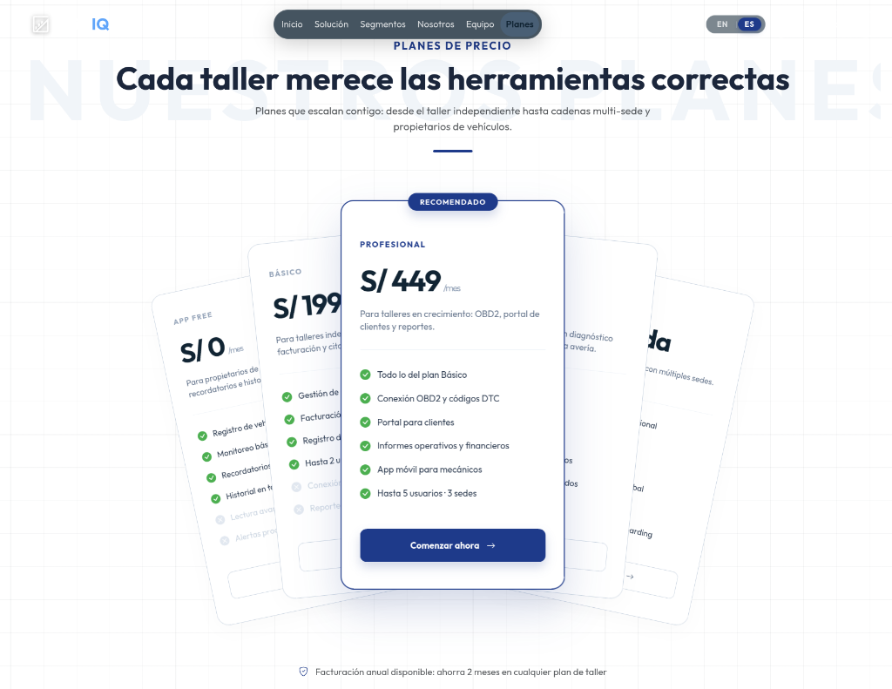

  <h5>Ejecución del Backend REST API en Swagger UI (Endpoints /api/v1/auth & /api/v1/workshops)</h5>
  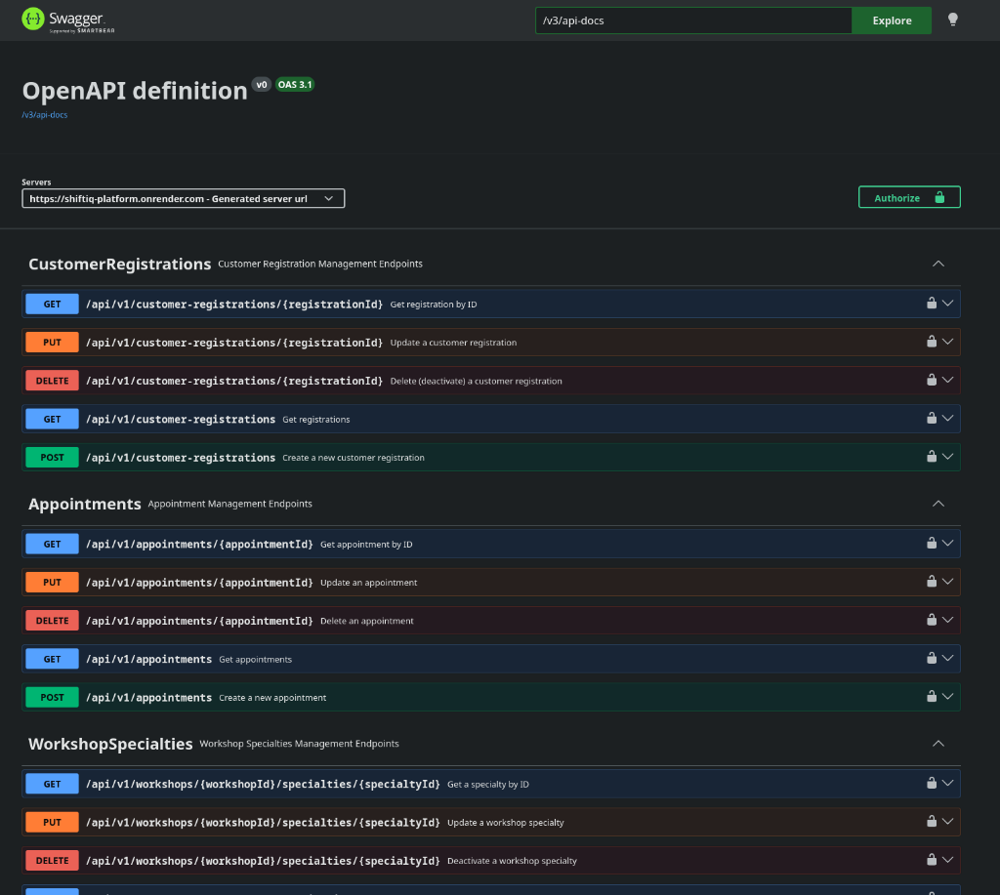
</div>

<p align="justify">
Para ilustrar la visualización y las interacciones logradas en este Sprint, se indican los enlaces a los videos demostrativos de ejecución:
<br><br>
- <b>URL Video Ejecución Landing Page:</b> <i>[Pendiente de grabación / Enlace no disponible]</i><br>
- <b>URL Video Demostrativo Backend REST API Platform:</b> <i>[Pendiente de grabación / Enlace no disponible]</i>
</p>

---

### 4.2.1.7. Services Documentation Evidence for Sprint Review

<p align="justify">
Durante el Sprint 1, el equipo TuxLogic diseñó, implementó y documentó el catálogo completo de servicios web RESTful que componen el ecosistema <b>ShiftIQ</b>. La documentación de la plataforma backend (<code>shiftiq-platform</code>) fue generada automáticamente bajo la especificación OpenAPI 3.0 mediante Swagger UI, disponible de forma interactiva en la ruta <code>/swagger-ui.html</code>.
</p>

<p align="justify">
Asimismo, para la captura de solicitudes comerciales en la Landing Page, se integró el servicio web de terceros <b>EmailJS</b>. A continuación, se resume la tabla de servicios web oficiales documentados durante la iteración:
</p>

<table style="width: 100%; border-collapse: collapse; text-align: justify; font-size: 12px; margin-bottom: 1.5em;">
  <thead>
    <tr style="background-color: #f2f2f2;">
      <th style="border: 1px solid #ddd; padding: 6px; text-align: center;">Servicio / Endpoint</th>
      <th style="border: 1px solid #ddd; padding: 6px; text-align: center;">Método</th>
      <th style="border: 1px solid #ddd; padding: 6px; text-align: center;">Bounded Context</th>
      <th style="border: 1px solid #ddd; padding: 6px; text-align: center;">Descripción</th>
      <th style="border: 1px solid #ddd; padding: 6px; text-align: center;">Payload / Parámetros</th>
    </tr>
  </thead>
  <tbody>
    <tr>
      <td style="border: 1px solid #ddd; padding: 6px; text-align: center;"><code>/api/v1/auth/sign-in</code></td>
      <td style="border: 1px solid #ddd; padding: 6px; text-align: center;"><strong>POST</strong></td>
      <td style="border: 1px solid #ddd; padding: 6px; text-align: center;">IAM</td>
      <td style="border: 1px solid #ddd; padding: 6px;">Autentica las credenciales de usuario y emite un token JWT firmado para sesiones subsecuentes.</td>
      <td style="border: 1px solid #ddd; padding: 6px;"><code>username</code>, <code>password</code></td>
    </tr>
    <tr>
      <td style="border: 1px solid #ddd; padding: 6px; text-align: center;"><code>/api/v1/auth/sign-up</code></td>
      <td style="border: 1px solid #ddd; padding: 6px; text-align: center;"><strong>POST</strong></td>
      <td style="border: 1px solid #ddd; padding: 6px; text-align: center;">IAM</td>
      <td style="border: 1px solid #ddd; padding: 6px;">Registra nuevos usuarios administradores de taller o clientes en el sistema.</td>
      <td style="border: 1px solid #ddd; padding: 6px;"><code>username</code>, <code>password</code>, <code>roles</code></td>
    </tr>
    <tr>
      <td style="border: 1px solid #ddd; padding: 6px; text-align: center;"><code>/api/v1/workshops</code></td>
      <td style="border: 1px solid #ddd; padding: 6px; text-align: center;"><strong>POST / GET</strong></td>
      <td style="border: 1px solid #ddd; padding: 6px; text-align: center;">Core</td>
      <td style="border: 1px solid #ddd; padding: 6px;">Crea y consulta el perfil institucional del taller mecánico y sus sucursales operativas.</td>
      <td style="border: 1px solid #ddd; padding: 6px;"><code>name</code>, <code>ruc</code>, <code>address</code>, <code>phone</code></td>
    </tr>
    <tr>
      <td style="border: 1px solid #ddd; padding: 6px; text-align: center;"><code>/api/v1/work-orders</code></td>
      <td style="border: 1px solid #ddd; padding: 6px; text-align: center;"><strong>POST / GET</strong></td>
      <td style="border: 1px solid #ddd; padding: 6px; text-align: center;">Operations</td>
      <td style="border: 1px solid #ddd; padding: 6px;">Gestiona la apertura, asignación de tareas técnicas y cierre de órdenes de servicio automotriz.</td>
      <td style="border: 1px solid #ddd; padding: 6px;"><code>vehicleId</code>, <code>workshopId</code>, <code>description</code></td>
    </tr>
    <tr>
      <td style="border: 1px solid #ddd; padding: 6px; text-align: center;"><code>/api/v1/billing/stripe/charge</code></td>
      <td style="border: 1px solid #ddd; padding: 6px; text-align: center;"><strong>POST</strong></td>
      <td style="border: 1px solid #ddd; padding: 6px; text-align: center;">Billing</td>
      <td style="border: 1px solid #ddd; padding: 6px;">Procesa cobros de suscripción a través de la pasarela de pagos Stripe y genera comprobantes de pago.</td>
      <td style="border: 1px solid #ddd; padding: 6px;"><code>stripeToken</code>, <code>amount</code>, <code>currency</code></td>
    </tr>
    <tr>
      <td style="border: 1px solid #ddd; padding: 6px; text-align: center;"><code>https://api.emailjs.com/api/v1.0/email/send</code></td>
      <td style="border: 1px solid #ddd; padding: 6px; text-align: center;"><strong>POST</strong></td>
      <td style="border: 1px solid #ddd; padding: 6px; text-align: center;">External Service</td>
      <td style="border: 1px solid #ddd; padding: 6px;">Envía correos transaccionales directos desde el formulario de contacto de la Landing Page.</td>
      <td style="border: 1px solid #ddd; padding: 6px;"><code>service_id</code>, <code>template_id</code>, <code>user_id</code></td>
    </tr>
  </tbody>
</table>

<div align="center">
  <h5 style="margin-bottom: 0.5em;">Evidencia: Documentación OpenAPI 3.0 / Swagger UI de la Plataforma Backend ShiftIQ</h5>
  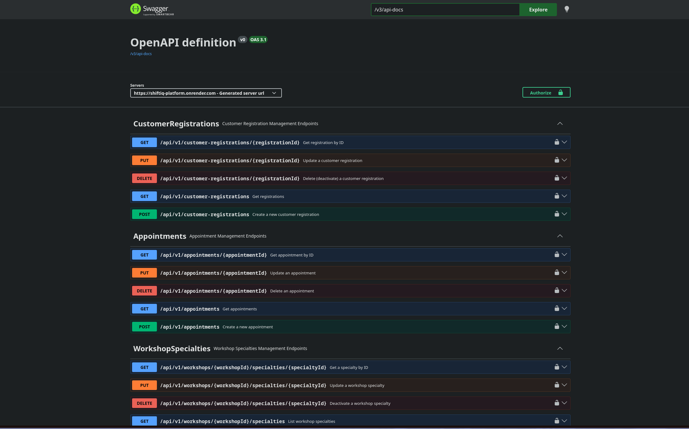
</div>

---

### 4.2.1.8. Software Deployment Evidence for Sprint Review

<p align="justify">
En esta sección se detallan los procesos realizados para el despliegue del producto durante el Sprint 1. El objetivo fue publicar en entornos de producción la versión oficial de la Landing Page de ShiftIQ y el contenedor de servicios backend RESTful (<code>shiftiq-platform</code>).
</p>

<p align="justify">
El flujo de despliegue consideró las siguientes plataformas e infraestructuras:
</p>

1. **Despliegue de Landing Page (Vercel Production Cloud):**
   - **Repositorio:** <code>tux-logic/Shiftiq-Landing-Page</code>
   - **Pipeline CI/CD:** Despliegue automatizado en Vercel conectado al repositorio oficial de GitHub que compila y publica el marcado ante cada push en la rama <code>main</code>.
   - **URL Pública Landing Page:** [https://shiftiq-landing-page.vercel.app/](https://shiftiq-landing-page.vercel.app/)

2. **Despliegue de Backend REST API Platform (Docker & Entorno de Desarrollo):**
   - **Repositorio:** <code>tux-logic/shiftiq-platform</code>
   - **Contenedorización:** Empaquetado de la aplicación Java Spring Boot mediante <code>Dockerfile</code> multitapa y orquestación con <code>docker-compose.yml</code> conectada a una base de datos PostgreSQL 18.
   - **URL Pública API & Swagger UI:** <i>[Pendiente de despliegue en servidor en la nube / Ejecutable en entorno local: <code>http://localhost:8080/swagger-ui.html</code>]</i>

<div align="center">

  <h5>Evidencia 1: Workflow de Despliegue en GitHub Actions para Landing Page</h5>
  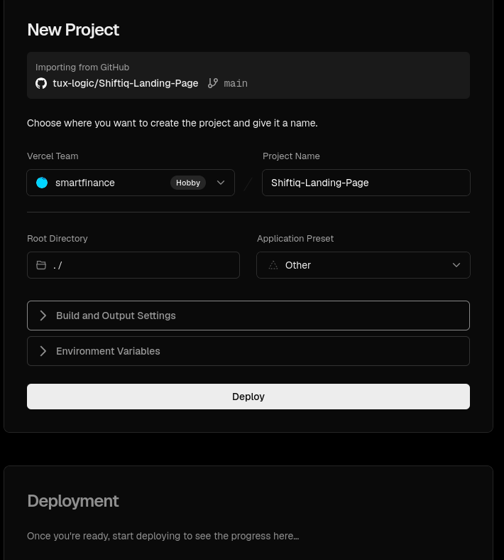
  <h5>Evidencia 2: Despliegue del Contenedor Backend API Platform y Swagger UI en Producción</h5>
  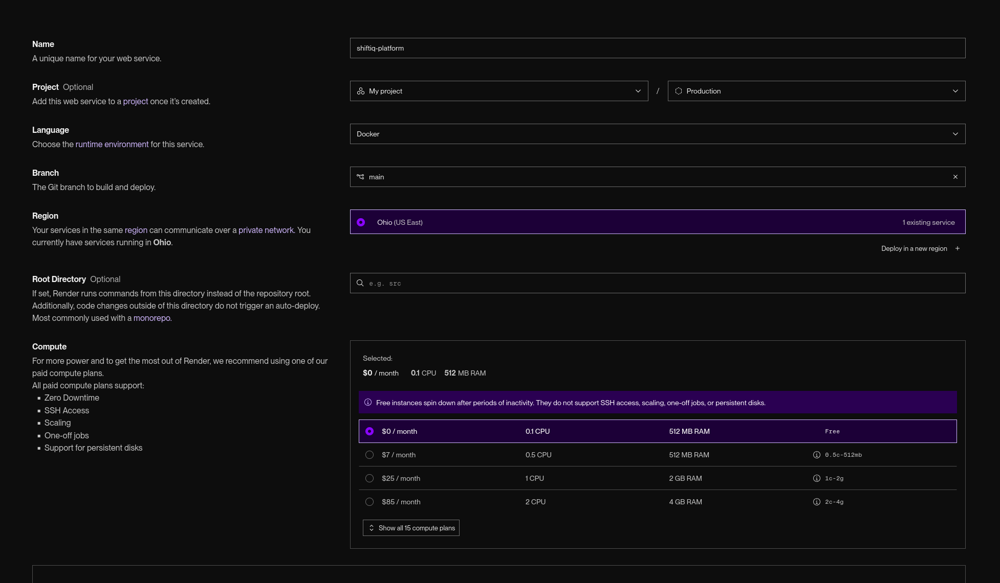
  <h5>Evidencia 3: Visualización de la Landing Page de ShiftIQ en Producción</h5>
  

</div>

---

### 4.2.1.9. Team Collaboration Insights during Sprint 1

<p align="justify">
Durante el Sprint 1, el equipo TuxLogic mantuvo un flujo de trabajo sincronizado entre el frontend (Landing Page) y el backend REST API (<code>shiftiq-platform</code>), aplicando rigurosamente la metodología GitFlow. Todo el desarrollo se realizó en ramas de características independientes (<i>feature branches</i>) bajo la convención <i>Conventional Commits</i>. La integración de cambios se efectuó exclusivamente mediante **Pull Requests (PRs)** dirigidos a la rama <code>develop</code>, los cuales requirieron la revisión y aprobación obligatoria de pares (<i>Code Review</i>).
</p>

<p align="justify">
A continuación, se presentan las métricas de colaboración extraídas de GitHub (Insights) que constatan la actividad constante y equitativa de todos los miembros del equipo TuxLogic en los repositorios del proyecto:
</p>

<div align="center">
  <h5>Evidencia 1: Gráfico de Contribuciones por Miembro del Equipo (Organización tux-logic)</h5>
  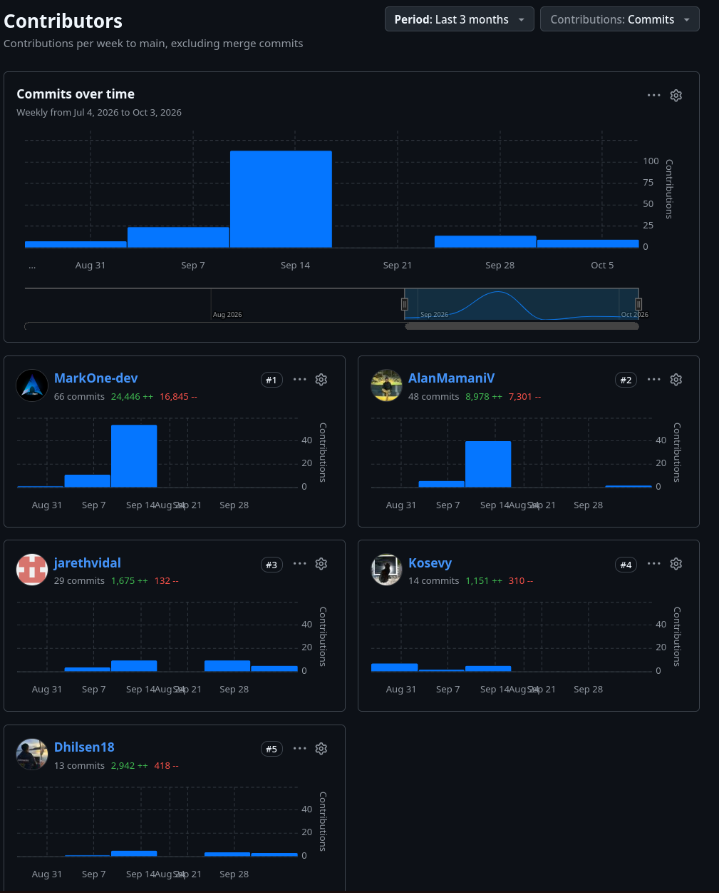
  
  <h5>Evidencia 2: Resumen de Actividad del Sprint (GitHub Pulse)</h5>
  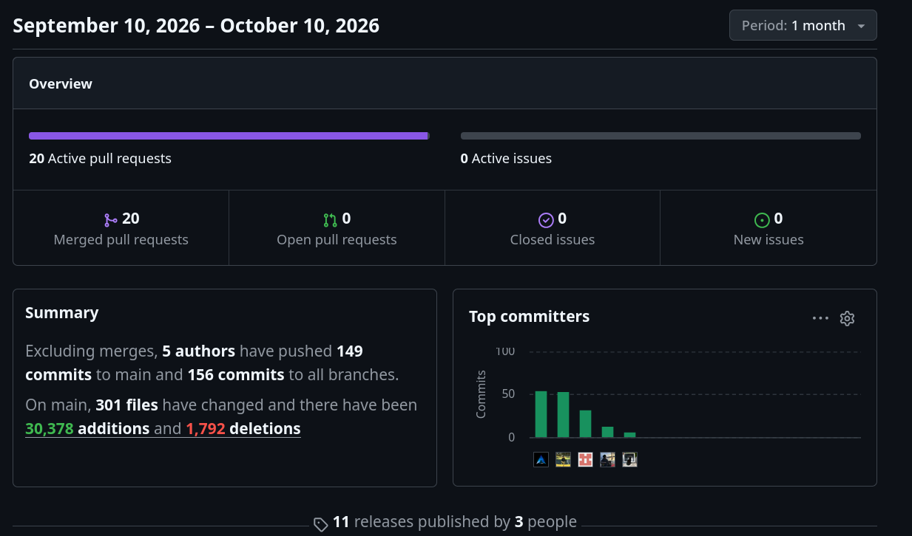

  <h5>Evidencia 3: Gestión Colaborativa mediante Pull Requests Fusionados</h5>
  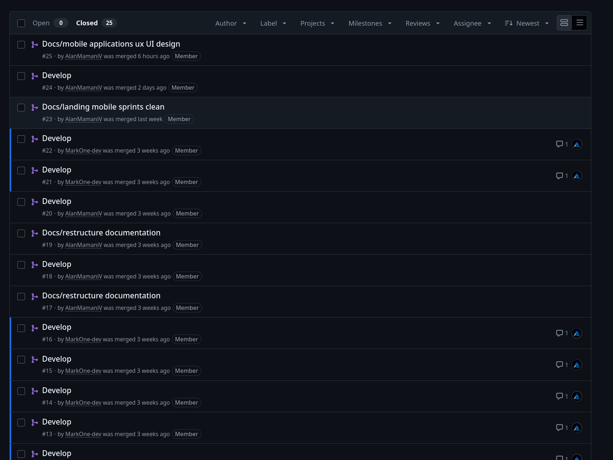
</div>

<p align="justify">
Como demuestran los analíticos, la carga de trabajo se distribuyó de manera transparente y equilibrada entre los 5 integrantes del equipo TuxLogic, registrando aportes sustanciales en código fuente, configuraciones DevOps, suites de pruebas unitarias y documentación técnica del ecosistema <b>ShiftIQ</b>.
</p>
