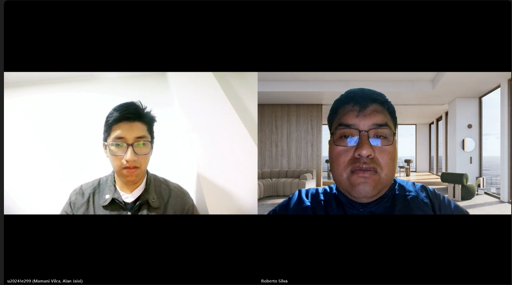

## 2.2. Entrevistas

### 2.2.1. Diseño de entrevistas

El diseño metodológico de las entrevistas semiestructuradas desarrolladas por TuxLogic responde a la necesidad de investigar a profundidad las dinámicas operativas, hábitos, fricciones y expectativas de los dos actores clave del modelo de mercado bilateral (*two-sided market*) de **ShiftIQ**: el segmento oferente (Dueños o Administradores de Talleres Automotrices Independientes en Lima) y el segmento demandante (Conductores de Vehículos Particulares en Lima Metropolitana).

Para garantizar la rigurosidad científica y la validez empírica del estudio cualitativo, el guion de entrevista se formuló aplicando las siguientes buenas prácticas metodológicas:
* **Preguntas Abiertas y No Inducidas:** Se diseñaron interrogantes orientadas a la exploración narrativa (*"¿Cómo maneja actualmente...?"*, *"Describa la última vez que..."*), evitando sesgar las respuestas del entrevistado o forzar la validación prematura de la propuesta de valor.
* **Enfoque en Comportamientos Pasados y Presentes Reales (*The Mom Test*):** Se priorizó indagar sobre acciones, decisiones y costos reales experimentados en los últimos 6 a 12 meses, restringiendo las especulaciones futuras u opiniones hipotéticas sobre funcionalidades no construidas.
* **Secuencia Gradual de Entrevista:** El flujo conversacional se estructuró en cuatro fases sucesivas: (*Rapport* y datos demográficos, Hábitos y rutina diaria, Dolores, frustraciones y barreras, Disposición al cambio y evaluación de canales digitales/IoT).
* **Trazabilidad para la Construcción de Arquetipos (*User Personas*):** Cada bloque de preguntas está directamente calibrado para recolectar las dimensiones de información requeridas para los artefactos de Needfinding: variables demográficas (género, edad, distrito, estado civil, familia, ocupación), aspectos psicográficos (personalidad, metas, frustraciones), capacidades tecnológicas (habilidades digitales, dispositivos preferidos, aplicaciones en uso), influencias y afinidad de marcas (marcas de escáneres, vehículos, apps de banca o navegación) y biografía operativa.

---

#### a. Matriz de Información Requerida para Arquetipos de Usuarios

La siguiente matriz delimita el propósito de indagación de cada variable requerida para modelar los arquetipos de usuario de ShiftIQ (*Felipe Hernández* para el Taller y *Raúl Jiménez* para el Conductor):

| Dimensión del Arquetipo | Componentes Específicos a Recolectar | Propósito de Indagación en la Entrevista |
| :--- | :--- | :--- |
| **Datos Demográficos y Biografía** | Edad, género, distrito de residencia, estado civil, carga familiar, ocupación actual y años de experiencia en el rubro/manejo. | Delimitar el perfil sociocultural, nivel socioeconómico y contexto de vida cotidiana que enmarca las decisiones financieras y de gestión. |
| **Personalidad y Actitudes** | Tendencia pragmática, adversión al riesgo, apertura a la innovación, nivel de cautela en el gasto, nivel de desconfianza comercial. | Comprender la postura mental frente al cambio digital en la administración del taller o ante los diagnósticos mecánicos tradicionales. |
| **Habilidades y Competencias** | Habilidad en diagnóstico mecánico/empírico, nivel de alfabetización digital, experiencia en uso de smartphones y computadoras. | Diseñar interfaces de usuario (móvil y web) con la densidad de información y nivel de complejidad adecuados a su competencia real. |
| **Dispositivos y Canales Digitales** | Tipo de smartphone (Android/iOS), laptop/PC, aplicaciones de uso diario (WhatsApp, Chrome, Yape, Plin, Waze, Google Maps). | Identificar los ecosistemas de hardware y software donde el usuario pasa su tiempo para integrar notificaciones push y flujos de interacción naturales. |
| **Afinidad por Marcas e Influencias** | Marcas de vehículos (Toyota, Hyundai, Nissan), herramientas de diagnóstico (Autel, Launch, Bosch), marcas de repuestos y referencias de confianza. | Establecer el lenguaje visual, las alianzas de hardware (conectores OBD2 compatibles) y el posicionamiento de marca de ShiftIQ. |
| **Objetivos y Motivaciones** | Llenar agenda diaria, reducir tiempos muertos, prevenir averías críticas en ruta, transparencia presupuestal, mantener valor de reventa. | Diseñar las funcionalidades principales (*core features*) que entregan valor directo percibido en los primeros 14 a 30 días. |
| **Frustraciones y Dolores (*Pains*)** | Pérdidas del 30-40% por ineficiencia, cobros excesivos por sorpresa, desconfianza en la jerga técnica, desorden en WhatsApp y papel. | Justificar los requerimientos funcionales del MVP (alertas DTC en lenguaje natural, agendamiento in-app, orden de trabajo digital). |

---

#### b. Preguntas de Entrevistas dirigidas al Segmento Objetivo 1: Dueños o Administradores de Talleres Automotrices Independientes (B2B)

Este cuestionario busca comprender a fondo la dinámica administrativa y técnica de los microempresarios mecánicos, evaluando cómo gestionan sus clientes, citas, presupuestos e inventarios en su operación diaria en Lima.

##### Bloque 1: Perfil Demográfico, Biografía y Entorno Operativo (Arquetipo: Felipe Hernández)
* **Pregunta Principal 1.1:** Para comenzar, coméntenos sobre usted: ¿cuál es su edad, en qué distrito reside, su estado civil y qué rol desempeña actualmente en el taller?
  * *Pregunta Complementaria 1.1a:* ¿Cuántos años de experiencia tiene en el rubro automotriz y cómo se constituyó su taller?
  * *Pregunta Complementaria 1.1b:* ¿Cuántas personas integran su núcleo familiar y cómo equilibra el tiempo de trabajo en el taller con su vida personal?
* **Pregunta Principal 1.2:** Describa la estructura y capacidad operativa de su establecimiento.
  * *Pregunta Complementaria 1.2a:* ¿Con cuántos mecánicos o técnicos cuenta y cuántas bahías o rampas de atención tiene habilitadas?
  * *Pregunta Complementaria 1.2b:* En promedio, ¿cuántos vehículos atienden a la semana y cuáles son los servicios de mayor demanda?

##### Bloque 2: Procesos de Gestión, Dispositivos y Canales de Interacción
* **Pregunta Principal 2.1:** ¿Cómo organiza actualmente el flujo diario de trabajo, la asignación de citas y el seguimiento de los vehículos atendidos?
  * *Pregunta Complementaria 2.1a:* ¿Qué herramientas utiliza para registrar la información del cliente y la orden de servicio (cuaderno físico, hojas de cálculo, WhatsApp, software de gestión)?
  * *Pregunta Complementaria 2.1b:* ¿Qué dispositivos tecnológicos utiliza personalmente durante la jornada de trabajo (smartphone Android/iOS, tablet, laptop, PC de escritorio)?
* **Pregunta Principal 2.2:** ¿Qué canales de comunicación digital utiliza de forma habitual para interactuar con sus clientes y proveedores?
  * *Pregunta Complementaria 2.2a:* ¿Cómo gestiona la recepción de solicitudes por WhatsApp y qué problemas encuentra al coordinar por este medio?
  * *Pregunta Complementaria 2.2b:* ¿Qué aplicaciones móviles o páginas web utiliza con mayor frecuencia en su rutina diaria de negocio o personal?

##### Bloque 3: Frustraciones, Dolores Operativos y Relación con el Cliente (*Pains & Gains*)
* **Pregunta Principal 3.1:** ¿Cuáles son los principales obstáculos o ineficiencias que enfrenta en la gestión diaria que afectan la rentabilidad del taller?
  * *Pregunta Complementaria 3.1a:* ¿Ha experimentado periodos de tiempo muerto o baja ocupación de rampas durante el mes? ¿A qué cree que se deba y cómo lo soluciona?
  * *Pregunta Complementaria 3.1b:* ¿Cómo maneja el control de inventario de repuestos e insumos? ¿Ha tenido pérdidas por falta de stock o repuestos mal presupuestados?
* **Pregunta Principal 3.2:** En su experiencia, ¿por qué razón suelen regresar los clientes a su taller y cómo promueve que realicen mantenimientos preventivos regulares?
  * *Pregunta Complementaria 3.2a:* ¿Qué tan frecuente es que un cliente llegue únicamente cuando el vehículo ya presenta una avería grave o inmovilizante?
  * *Pregunta Complementaria 3.2b:* ¿Cómo reaccionan los clientes ante la presentación de presupuestos adicionales o reparaciones no planificadas?

##### Bloque 4: Afinidad por Marcas, Equipamiento Técnico y Evaluación de la Solución ShiftIQ
* **Pregunta Principal 4.1:** Al realizar diagnósticos en los vehículos, ¿qué marcas de escáneres automotrices o herramientas electrónicas prefiere o utiliza (Autel, Launch, Bosch, otros)?
  * *Pregunta Complementaria 4.1a:* ¿En qué etapa de la atención utiliza el escáner y qué limitaciones encuentra en los equipos diagnósticos actuales?
  * *Pregunta Complementaria 4.1b:* ¿Qué marcas de vehículos (Toyota, Hyundai, Nissan, Kia, etc.) atienden con mayor frecuencia y qué tan complejo es acceder a su información de fallas?
* **Pregunta Principal 4.2:** Si dispusiera de una plataforma móvil conectada a dispositivos telemáticos OBD2 que le enviara alertas de fallas electrónicas (DTC) de sus clientes antes de que lleguen al taller, ¿cómo transformaría eso su manera de agendar y ofrecer servicios?
  * *Pregunta Complementaria 4.2a:* ¿Qué tan dispuesto estaría a adoptar una aplicación móvil para enviar cotizaciones digitales y confirmar citas en tiempo real?
  * *Pregunta Complementaria 4.2b:* ¿Qué condiciones o facilidades requeriría para confiar e integrar una solución SaaS como ShiftIQ en su taller?

---

#### c. Preguntas de Entrevistas dirigidas al Segmento Objetivo 2: Conductores de Vehículos Particulares en Lima (B2C)

Este cuestionario busca explorar las conductas de mantenimiento, las barreras cognitivas/financieras, la asimetría informativa y la competencia digital de los propietarios de vehículos particulares en Lima Metropolitana.

##### Bloque 1: Perfil Demográfico, Biografía y Hábitos de Conducción (Arquetipo: Raúl Jiménez)
* **Pregunta Principal 1.1:** Para comenzar, coméntenos sobre usted: ¿cuál es su edad, en qué distrito reside, su estado civil y a qué se dedica profesionalmente?
  * *Pregunta Complementaria 1.1a:* ¿Cuántas personas dependen de usted o forman parte de su hogar y qué papel cumple el vehículo en su dinámica familiar?
  * *Pregunta Complementaria 1.1b:* ¿Qué modelo, marca y año de fabricación tiene su vehículo particular, y cuál es el uso principal que le da (traslado laboral, viajes de fin de semana, aplicativo)?
* **Pregunta Principal 1.2:** ¿Cómo describiría su rutina de conducción semanal y cuántos kilómetros recorre aproximadamente al día en Lima?

##### Bloque 2: Experiencia y Hábitos de Mantenimiento Vehicular
* **Pregunta Principal 2.1:** ¿Cómo maneja actualmente el cuidado y mantenimiento de su vehículo? ¿Sigue un plan preventivo o acude al taller cuando nota un problema específico?
  * *Pregunta Complementaria 2.1a:* Describa la última vez que su vehículo presentó una falla mecánica o una luz encendida en el tablero. ¿Cómo reaccionó y qué pasos siguió?
  * *Pregunta Complementaria 2.1b:* ¿Con qué frecuencia realiza cambios de aceite, revisión de frenos o alineación, y cómo recuerda las fechas o kilometrajes correspondientes?
* **Pregunta Principal 2.2:** ¿Qué factores o motivos le han llevado en alguna ocasión a postergar o posponer la revisión mecánica de su automóvil?
  * *Pregunta Complementaria 2.2a:* ¿Ha influido la falta de tiempo, la incertidumbre económica o la falta de claridad en los costos para postergar una atención técnica?

##### Bloque 3: Relación con el Taller, Asimetría Informativa y Frustraciones (*Pains & Gains*)
* **Pregunta Principal 3.1:** ¿Cómo elige el taller mecánico al que lleva su automóvil y qué tan transparente considera la información técnica y los presupuestos que recibe?
  * *Pregunta Complementaria 3.1a:* ¿Ha experimentado dificultades para comprender la terminología técnica o los códigos de falla expuestos por el mecánico? ¿Cómo le hizo sentir esa situación?
  * *Pregunta Complementaria 3.1b:* ¿Ha tenido experiencias donde el costo final del servicio superó de forma imprevista la cotización inicial?
* **Pregunta Principal 3.2:** ¿Qué es lo que más valora al momento de solicitar un servicio técnico vehicular y qué le haría sentir total confianza en un taller independiente?

##### Bloque 4: Canales Digitales, Dispositivos Preferidos, Afinidad por Apps y Aceptación de Telemetría IoT
* **Pregunta Principal 4.1:** ¿Qué modelo de teléfono smartphone utiliza (Android/iOS) y qué aplicaciones móviles utiliza con mayor frecuencia en su vida diaria?
  * *Pregunta Complementaria 4.1a:* ¿Utiliza habitualmente aplicaciones de navegación GPS (Waze, Google Maps), mensajería (WhatsApp) o banca/billeteras digitales (Yape, Plin)?
  * *Pregunta Complementaria 4.1b:* ¿Qué tan cómodo se siente recibiendo notificaciones push relativas al estado de sus servicios o pagos en su smartphone?
* **Pregunta Principal 4.2:** Si contara con un pequeño dispositivo de diagnóstico (OBD2) conectado a su auto que se comunique con su smartphone para explicarle en español sencillo el nivel de urgencia de una falla y le permita agendar cita en un clic, ¿qué opinión le merecería?
  * *Pregunta Complementaria 4.2a:* ¿Estaría dispuesto a mantener este dispositivo conectado continuamente a cambio de recibir alertas de seguridad y estimados de costo preventivos?
  * *Pregunta Complementaria 4.2b:* ¿Qué garantías de privacidad y transparencia en el uso de los datos de su vehículo consideraría indispensables para adoptar la aplicación ShiftIQ?

---

### 2.2.2. Registro de entrevistas

**Segmento Objetivo 1: Dueños o Administradores de Talleres Automotrices Independientes (B2B)**

<table>
<thead>
  <tr>
    <th colspan="2">Entrevista 1: Gerente General y Propietario de Taller Automotriz Independiente </th>
  </tr>
</thead>
<tbody>
  <tr>
    <td>Nombre</td>
    <td>Roberto</td>
  </tr>
  <tr>
    <td>Apellidos</td>
    <td>Silva</td>
  </tr>
  <tr>
    <td>Edad</td>
    <td>37 años</td>
  </tr>
  <tr>
    <td>Distrito</td>
    <td>San Miguel, Juliaca</td>
  </tr>
  <tr>
    <td>Aplicaciones Usadas</td>
    <td>WhatsApp, BCP/Interbank, Excel y correo electrónico</td>
  </tr>
  <tr>
    <td>Tecnologías</td>
    <td>Smartphone Android, PC de escritorio, escáner Launch y Bosch KTS</td>
  </tr>
  <tr>
    <td>Browsers</td>
    <td>Google Chrome, Microsoft Edge</td>
  </tr>
  <tr>
    <td>Entrevistador</td>
    <td>Alan Mamani</td>
  </tr>
  <tr>
    <td>Evidencia</td>
    <td>
      
    </td>
  </tr>
<tr>
  <td>Link</td>
  <td><a href="https://upcedupe-my.sharepoint.com/:v:/g/personal/u20241e299_upc_edu_pe/IQDGi2mwibUOTri_qnCNOE9XAWbkwqGy7kLorGVW-DinwjI?e=jtY4c4&nav=eyJyZWZlcnJhbEluZm8iOnsicmVmZXJyYWxBcHAiOiJTdHJlYW1XZWJBcHAiLCJyZWZlcnJhbFZpZXciOiJTaGFyZURpYWxvZy1MaW5rIiwicmVmZXJyYWxBcHBQbGF0Zm9ybSI6IldlYiIsInJlZmVycmFsTW9kZSI6InZpZXcifX0%3D" target="_blank">Ver entrevista</a></td>
</tr>
  <tr>
    <td>Duración </td>
    <td>21:30</td>
  </tr>
  <tr>
    <td>Resumen</td>
    <td>El entrevistado es gerente general y propietario de un taller automotriz independiente, con 14 años de experiencia en el sector. El taller cuenta con cuatro mecánicos y cuatro bahías de atención, y atiende entre 20 y 30 vehículos por semana. Actualmente gestiona las órdenes mediante documentos físicos, utiliza Excel para la contabilidad y caja, y WhatsApp para comunicarse con los clientes.  
    Entre sus principales problemas se encuentran la baja ocupación de las bahías durante los primeros días de la semana, los vehículos que permanecen varios días en el taller y las pérdidas ocasionadas por repuestos solicitados que posteriormente son cancelados por el cliente. También señala que los clientes suelen desconfiar de reparaciones adicionales y que aproximadamente el 80 % llega cuando el vehículo ya presenta una falla grave.  
    Respecto a ShiftIQ, considera interesante el uso de dispositivos OBD2 para detectar fallas antes de que el vehículo llegue al taller y ayudar a llenar las bahías en días de baja demanda. Sin embargo, requiere que la solución demuestre beneficios económicos concretos, tenga un costo inicial accesible, sea sencilla de instalar y no genere problemas para los clientes. Además, considera importante mantener canales tradicionales como llamadas y WhatsApp para aquellos clientes que tengan dificultades con una aplicación.</td>
  </tr>
</tbody>
</table>

<table>
<thead>
  <tr>
    <th colspan="2">Entrevista 2: Administrador de Taller Automotriz Independiente y Gestión de Operaciones </th>
  </tr>
</thead>
<tbody>
  <tr>
    <td>Nombre</td>
    <td>Sebastián</td>
  </tr>
  <tr>
    <td>Apellidos</td>
    <td>Rojas Espinoza</td>
  </tr>
  <tr>
    <td>Edad</td>
    <td>30 años</td>
  </tr>
  <tr>
    <td>Distrito</td>
    <td>San Martín de Porres, Lima</td>
  </tr>
  <tr>
    <td>Aplicaciones Usadas</td>
    <td>Excel, WhatsApp Business, Google Sheets, banca móvil, Yape, Plin, BCP, Instagram, YouTube</td>
  </tr>
  <tr>
    <td>Tecnologías</td>
    <td>Smartphone Samsung Android, laptop con Windows, escáneres automotrices Autel y Launch</td>
  </tr>
  <tr>
    <td>Browsers</td>
    <td>Google Chrome</td>
  </tr>
  <tr>
    <td>Entrevistador</td>
    <td>Alan Mamani</td>
  </tr>
  <tr>
    <td>Evidencia</td>
    <td>
      
    </td>
  </tr>
  <tr>
    <td>Link</td>
    <td><a href="https://upcedupe-my.sharepoint.com/:v:/g/personal/u20241e299_upc_edu_pe/IQCP18HU1eTaRpL0g71UYN7UAb1Z9zEjcHkiVFpKXGfQdR0?e=InyIAk&nav=eyJyZWZlcnJhbEluZm8iOnsicmVmZXJyYWxBcHAiOiJTdHJlYW1XZWJBcHAiLCJyZWZlcnJhbFZpZXciOiJTaGFyZURpYWxvZy1MaW5rIiwicmVmZXJyYWxBcHBQbGF0Zm9ybSI6IldlYiIsInJlZmVycmFsTW9kZSI6InZpZXcifX0%3D" target="_blank">Ver entrevista</a></td>
  </tr>
  <tr>
    <td>Duración </td>
    <td>22:34</td>
  </tr>
  <tr>
    <td>Resumen</td>
    <td>El entrevistado es administrador de un taller automotriz independiente y cuenta con aproximadamente 7 años de experiencia en el sector. Se encarga de las operaciones, recepción de clientes, planificación de agenda, inventario, cotizaciones, gestión financiera y coordinación del trabajo del equipo. El taller cuenta con 3 técnicos mecánicos, 1 asistente y 3 bahías de trabajo, de las cuales 2 tienen elevadores hidráulicos, además de áreas de diagnóstico computarizado y trabajos eléctricos.  
    Actualmente utiliza Excel para gestionar historiales de servicios e ingresos, WhatsApp Business para comunicarse con clientes y proveedores, y progresivamente está migrando algunos registros a Google Sheets para facilitar el acceso compartido entre el personal administrativo. Entre sus principales dificultades se encuentran la variabilidad en la ocupación de las bahías, los clientes que olvidan sus mantenimientos, los retrasos en la cotización y disponibilidad de repuestos y los cruces o cancelaciones de citas de último momento.  
    Respecto a una solución conectada a dispositivos telemáticos OBD2, considera que las alertas de fallas en tiempo real permitirían contactar anticipadamente a los clientes, ofrecer servicios y agendar citas automáticamente en los días de menor ocupación, optimizando el uso de las bahías y aumentando la facturación. Para adoptar una solución de este tipo, considera importante que la interfaz sea clara, intuitiva y fácil de aprender, que exista un periodo de prueba y que las notificaciones sean compatibles con los smartphones utilizados por el equipo, como Samsung y Xiaomi.</td>
  </tr>
</tbody>
</table>

<table>
<thead>
  <tr>
    <th colspan="2">Entrevista #3 </th>
  </tr>
</thead>
<tbody>
  <tr>
    <td>Nombre</td>
    <td>...</td>
  </tr>
  <tr>
    <td>Apellidos</td>
    <td>...</td>
  </tr>
  <tr>
    <td>Edad</td>
    <td>...</td>
  </tr>
  <tr>
    <td>Distrito</td>
    <td>...</td>
  </tr>
  <tr>
    <td>Aplicaciones Usadas</td>
    <td>...</td>
  </tr>
  <tr>
    <td>Tecnologías</td>
    <td>...</td>
  </tr>
  <tr>
    <td>Browsers</td>
    <td>...</td>
  </tr>
  <tr>
    <td>Entrevistador</td>
    <td>...</td>
  </tr>
  <tr>
    <td>Evidencia</td>
    <td>...</td>
  </tr>
  <tr>
    <td>Link</td>
    <td>...</td>
  </tr>
  <tr>
    <td>Duración </td>
    <td>...</td>
  </tr>
  <tr>
    <td>Resumen</td>
    <td>...</td>
  </tr>
</tbody>
</table>

**Segmento Objetivo 2: Conductores de Vehículos Particulares en Lima (B2C)**

<table>
<thead>
  <tr>
    <th colspan="2">Entrevista #1 </th>
  </tr>
</thead>
<tbody>
  <tr>
    <td>Nombre</td>
    <td>...</td>
  </tr>
  <tr>
    <td>Apellidos</td>
    <td>...</td>
  </tr>
  <tr>
    <td>Edad</td>
    <td>...</td>
  </tr>
  <tr>
    <td>Distrito</td>
    <td>...</td>
  </tr>
  <tr>
    <td>Aplicaciones Usadas</td>
    <td>...</td>
  </tr>
  <tr>
    <td>Tecnologías</td>
    <td>...</td>
  </tr>
  <tr>
    <td>Browsers</td>
    <td>...</td>
  </tr>
  <tr>
    <td>Entrevistador</td>
    <td>...</td>
  </tr>
  <tr>
    <td>Evidencia</td>
    <td>...</td>
  </tr>
  <tr>
    <td>Link</td>
    <td>...</td>
  </tr>
  <tr>
    <td>Duración </td>
    <td>...</td>
  </tr>
  <tr>
    <td>Resumen</td>
    <td>...</td>
  </tr>
</tbody>
</table>

<table>
<thead>
  <tr>
    <th colspan="2">Entrevista #2 </th>
  </tr>
</thead>
<tbody>
  <tr>
    <td>Nombre</td>
    <td>...</td>
  </tr>
  <tr>
    <td>Apellidos</td>
    <td>...</td>
  </tr>
  <tr>
    <td>Edad</td>
    <td>...</td>
  </tr>
  <tr>
    <td>Distrito</td>
    <td>...</td>
  </tr>
  <tr>
    <td>Aplicaciones Usadas</td>
    <td>...</td>
  </tr>
  <tr>
    <td>Tecnologías</td>
    <td>...</td>
  </tr>
  <tr>
    <td>Browsers</td>
    <td>...</td>
  </tr>
  <tr>
    <td>Entrevistador</td>
    <td>...</td>
  </tr>
  <tr>
    <td>Evidencia</td>
    <td>...</td>
  </tr>
  <tr>
    <td>Link</td>
    <td>...</td>
  </tr>
  <tr>
    <td>Duración </td>
    <td>...</td>
  </tr>
  <tr>
    <td>Resumen</td>
    <td>...</td>
  </tr>
</tbody>
</table>

<table>
<thead>
  <tr>
    <th colspan="2">Entrevista #3 </th>
  </tr>
</thead>
<tbody>
  <tr>
    <td>Nombre</td>
    <td>...</td>
  </tr>
  <tr>
    <td>Apellidos</td>
    <td>...</td>
  </tr>
  <tr>
    <td>Edad</td>
    <td>...</td>
  </tr>
  <tr>
    <td>Distrito</td>
    <td>...</td>
  </tr>
  <tr>
    <td>Aplicaciones Usadas</td>
    <td>...</td>
  </tr>
  <tr>
    <td>Tecnologías</td>
    <td>...</td>
  </tr>
  <tr>
    <td>Browsers</td>
    <td>...</td>
  </tr>
  <tr>
    <td>Entrevistador</td>
    <td>...</td>
  </tr>
  <tr>
    <td>Evidencia</td>
    <td>...</td>
  </tr>
  <tr>
    <td>Link</td>
    <td>...</td>
  </tr>
  <tr>
    <td>Duración </td>
    <td>...</td>
  </tr>
  <tr>
    <td>Resumen</td>
    <td>...</td>
  </tr>
</tbody>
</table>

### 2.2.3. Análisis de entrevistas
