## 2.5. Strategic-Level Domain-Driven Design

### 2.5.1. EventStorming

Para el diseño estratégico de ShiftIq se empleó **EventStorming** como técnica para explorar y estructurar el dominio del sistema a partir de los acontecimientos relevantes del negocio. Esta actividad permitió pasar de una visión general del dominio hacia una identificación progresiva de eventos, causas, procesos y límites de responsabilidad.

El proceso se desarrolló tomando como punto de partida el **Big Picture EventStorming** realizado anteriormente en la etapa de Needfinding. En dicho análisis ya se habían identificado acontecimientos relacionados con la vinculación del vehículo, recepción de telemetría, detección de códigos DTC, evaluación de severidad, reserva de citas, gestión del taller y actualización del historial de servicio.

Para profundizar este análisis en el nivel estratégico de DDD, el EventStorming se organizó en tres actividades: **Collect Domain Events**, **Refine Domain** y **Track Causes (Process Modelling)**. Los resultados de estas actividades fueron utilizados posteriormente para identificar los **Candidate Bounded Contexts**, establecer sus interacciones mediante **Domain Message Flows** y formalizar cada contexto mediante **Bounded Context Canvases**.

#### Collect Domain Events

En la primera actividad se recopilaron los principales **Domain Events** asociados con las actividades del dominio automotriz de ShiftIq. El objetivo fue obtener una visión amplia de los hechos relevantes que ocurren durante los diferentes procesos del sistema, sin establecer inicialmente límites entre contextos.

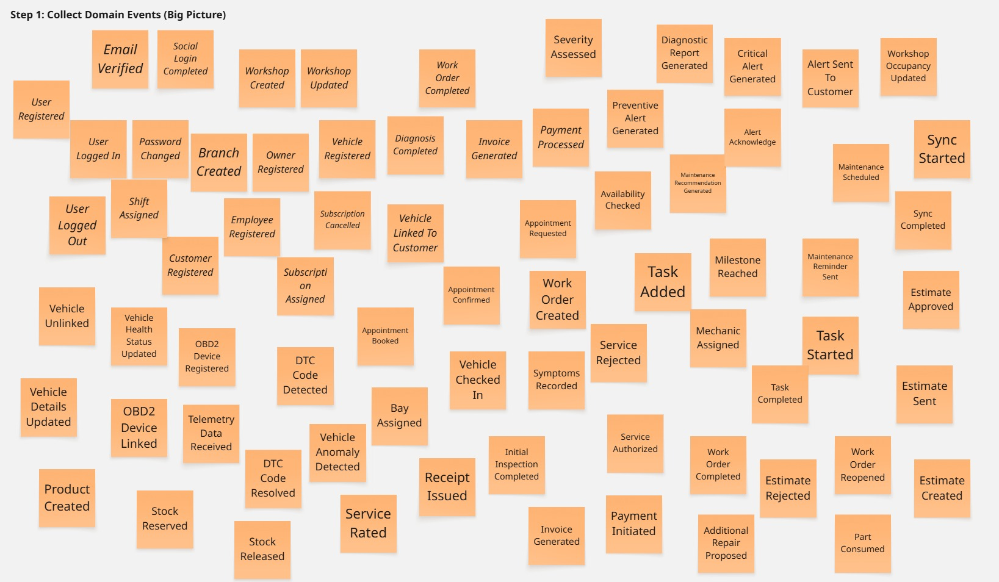

**Figura 16.** Collect Domain Events — Identificación de eventos de dominio de ShiftIq.

La actividad permitió reunir acontecimientos relacionados con identidad, gestión del taller, vehículos, telemetría, diagnóstico, citas, órdenes de trabajo, inventario, cotizaciones y pagos. Esta recopilación constituye la materia prima para el posterior refinamiento del dominio.

#### Refine Domain

A continuación, los eventos recopilados fueron revisados y refinados para distinguir los acontecimientos relevantes del negocio de acciones, datos o elementos que no representan hechos de dominio. También se consolidaron eventos relacionados y se estableció una nomenclatura orientada al lenguaje del dominio.

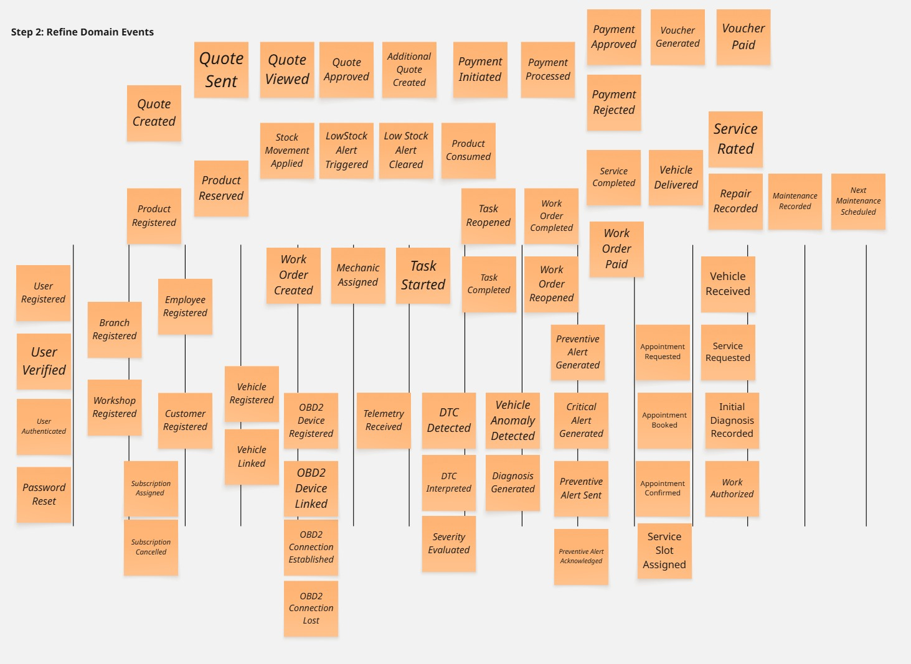

**Figura 17.** Refine Domain — Refinamiento y organización de los eventos del dominio.

El refinamiento permitió obtener un conjunto de eventos más consistente y representativo de los procesos principales de ShiftIq. Esta etapa es importante porque proporciona una base común para posteriormente identificar agrupaciones de responsabilidades.

#### Track Causes (Process Modelling)

Finalmente, se realizó el seguimiento de las causas y consecuencias de los eventos mediante **Process Modelling**. En esta actividad se relacionaron los elementos del EventStorming, principalmente **Actor, Command, Event, Business Process/Policy, Aggregate, External System y Hotspot**.

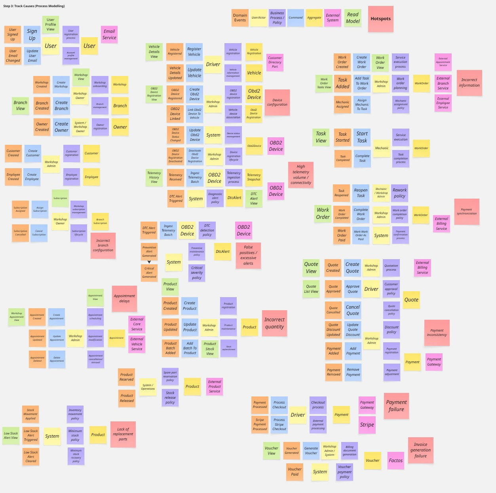

**Figura 18.** Track Causes (Process Modelling) — Relación causal de comandos, eventos y procesos.

El modelado permitió comprender cómo una acción ejecutada por un actor genera un comando que modifica el estado de un agregado y produce un evento. Asimismo, permitió identificar interacciones con sistemas externos y puntos de incertidumbre o riesgo (*hotspots*).

Entre los principales problemas identificados previamente se encuentran la conectividad inestable, el consumo de datos de telemetría, los retrasos o inasistencias a las citas, la incertidumbre respecto a los presupuestos y la necesidad de simplificar la gestión del taller.

El resultado de estas tres actividades constituyó la base para la siguiente etapa: **Candidate Context Discovery**.

#### 2.5.1.1. Candidate Context Discovery

El **Candidate Context Discovery** tuvo como objetivo identificar agrupaciones coherentes de responsabilidades dentro del dominio. Para ello se analizaron conjuntamente los eventos refinados, comandos, actores, agregados, modelos de lectura, políticas y relaciones identificadas durante el EventStorming.

Es importante señalar que los **Bounded Contexts candidatos no fueron definidos únicamente a partir de los nombres de los paquetes del backend**. Primero se identificaron las agrupaciones funcionales que emergieron del comportamiento del dominio y posteriormente se contrastaron con la estructura existente del sistema.

Como resultado se reconocieron **siete Candidate Bounded Contexts**:

1. **Identity & Access**
2. **Workshop Management**
3. **Fleet & Appointments**
4. **Vehicle Intelligence & Diagnostics**
5. **Service Operations**
6. **Inventory Management**
7. **Billing & Payments**

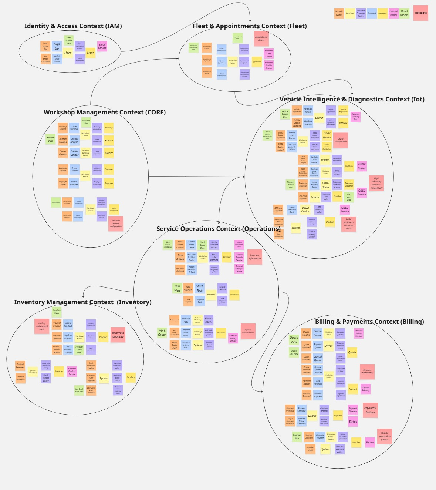

**Figura 19.** Candidate Context Discovery — Reconocimiento de los Candidate Bounded Contexts de ShiftIq.

A continuación, se describe la responsabilidad de cada contexto identificado.

##### 1. Identity & Access

Este contexto concentra las responsabilidades relacionadas con la identidad y el acceso de los usuarios. Incluye procesos de registro, autenticación, recuperación de contraseña y actualización de credenciales.

Su correspondencia con el backend se evidencia en el módulo `iam`, donde se encuentra el agregado `User`, comandos como `SignUpCommand`, `SignInCommand`, `ResetPasswordCommand` y comandos para actualizar las credenciales. También existen servicios relacionados con correo, hashing y tokens.

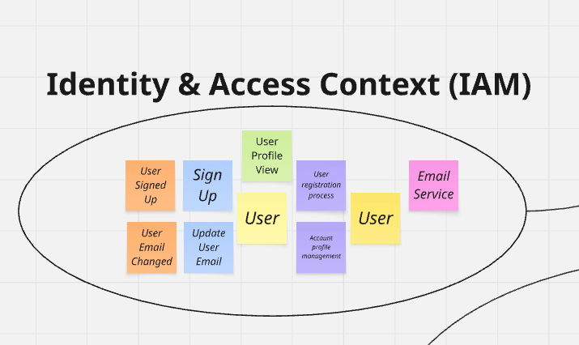

**Figura 20.** Candidate Bounded Context — Identity & Access.

---

##### 2. Workshop Management

Este contexto gestiona la información organizacional del taller, incluyendo talleres, sucursales, propietarios, clientes y empleados.

La correspondencia con el backend se encuentra en el módulo `core`, donde existen eventos como `WorkshopCreatedEvent`, `BranchCreatedEvent`, `CustomerCreatedEvent`, `EmployeeCreatedEvent` y `OwnerCreatedEvent`, además de sus respectivas consultas.

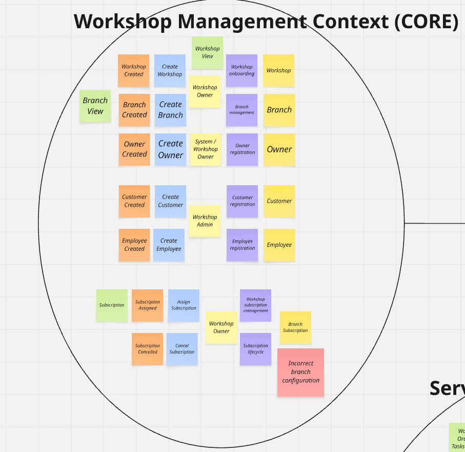

**Figura 21.** Candidate Bounded Context — Workshop Management.

---

##### 3. Fleet & Appointments

Este contexto concentra la gestión de citas y registros asociados a clientes y empleados, funcionando como punto de coordinación entre la planificación del servicio y las operaciones del taller.

El backend contiene `Appointment` y comandos relacionados con su creación, actualización y eliminación, además de `AppointmentCreatedEvent`. También dispone de recursos y servicios de consulta asociados.

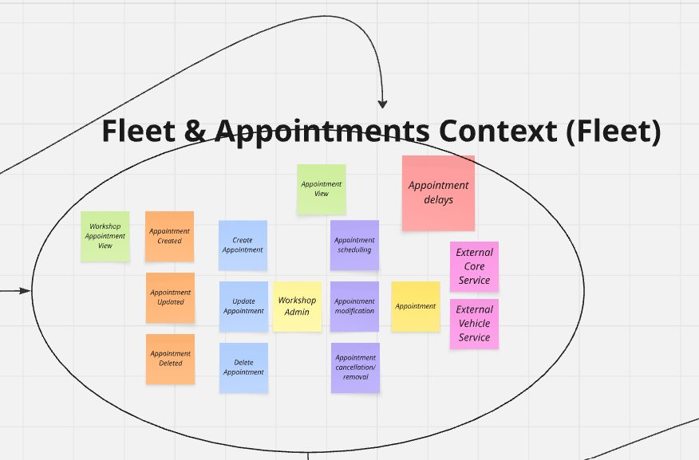

**Figura 22.** Candidate Bounded Context — Fleet & Appointments.

---

##### 4. Vehicle Intelligence & Diagnostics

Este contexto concentra las capacidades relacionadas con el vehículo, dispositivos OBD2, telemetría y diagnóstico. Su propósito dentro del dominio es transformar los datos técnicos del vehículo en información útil para el seguimiento de su condición.

Esta agrupación se relaciona con el flujo identificado previamente de vehículo vinculado, telemetría recibida, detección de DTC y evaluación de severidad.

Además, el lenguaje ubicuo del proyecto incorpora explícitamente términos como **Vehicle, OBD2 Dongle, Telemetry, DTC, Preventive Alert y Severity Level**.

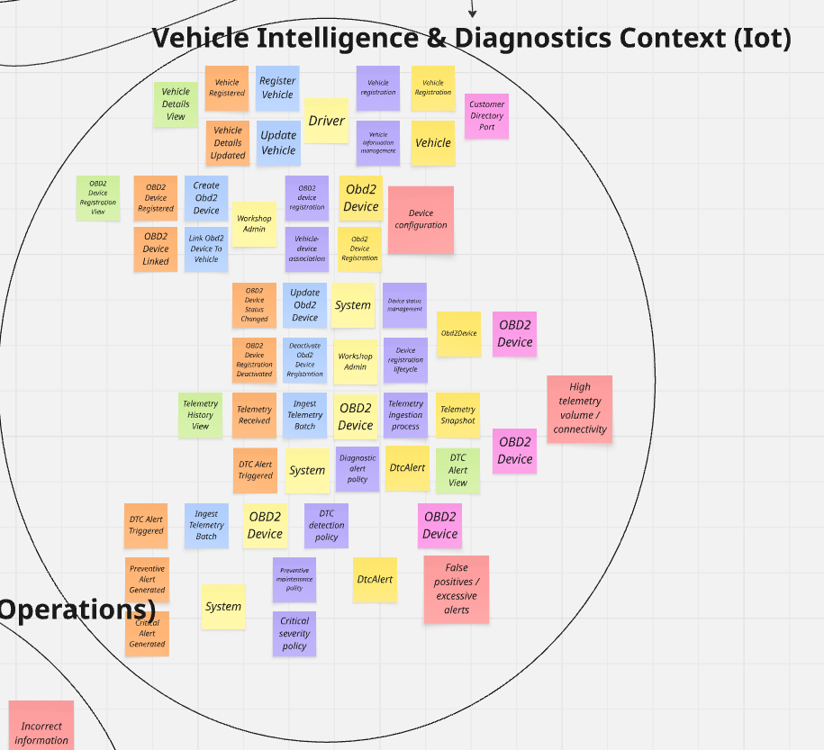

**Figura 23.** Candidate Bounded Context — Vehicle Intelligence & Diagnostics.

---

##### 5. Service Operations

Este contexto gestiona la ejecución de los servicios mediante órdenes de trabajo, tareas y asignación de mecánicos.

La estructura del backend contiene comandos para crear órdenes de trabajo, agregar tareas, asignar mecánicos, iniciar y completar tareas, así como eventos como `TaskStartedEvent`, `TaskCompletedEvent`, `TaskReopenedEvent` y `WorkOrderCompletedEvent`.

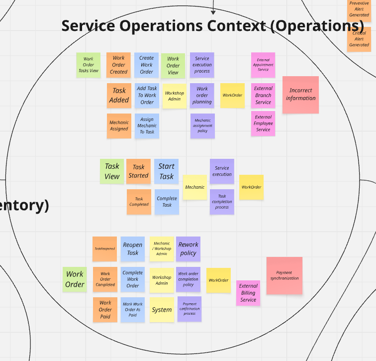

**Figura 24.** Candidate Bounded Context — Service Operations.

---

##### 6. Inventory Management

Este contexto administra los productos y existencias necesarias para la ejecución de los servicios. Incluye productos, lotes, reservas, liberaciones, movimientos de stock y evaluación de niveles mínimos.

La estructura contiene el agregado `Product`, la entidad `ProductBatch`, comandos de productos y eventos como `ProductCreatedEvent`, `StockReservedEvent`, `StockReleasedEvent`, `StockMovementAppliedEvent` y eventos relacionados con bajo stock.

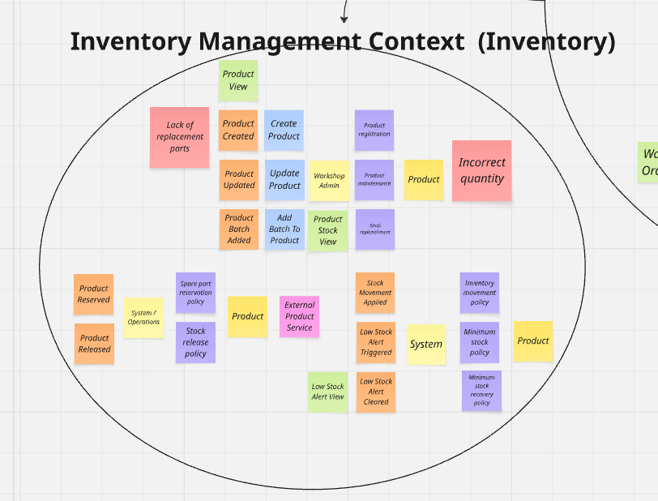

**Figura 25.** Candidate Bounded Context — Inventory Management.

---

##### 7. Billing & Payments

Este contexto concentra las responsabilidades relacionadas con cotizaciones, pagos y comprobantes asociados al servicio.

La estructura del backend contiene elementos de cotización y facturación, incluyendo `Quote`, `Voucher`, `Payment` y comandos relacionados con la creación y aprobación de cotizaciones, checkout y procesamiento de pagos.

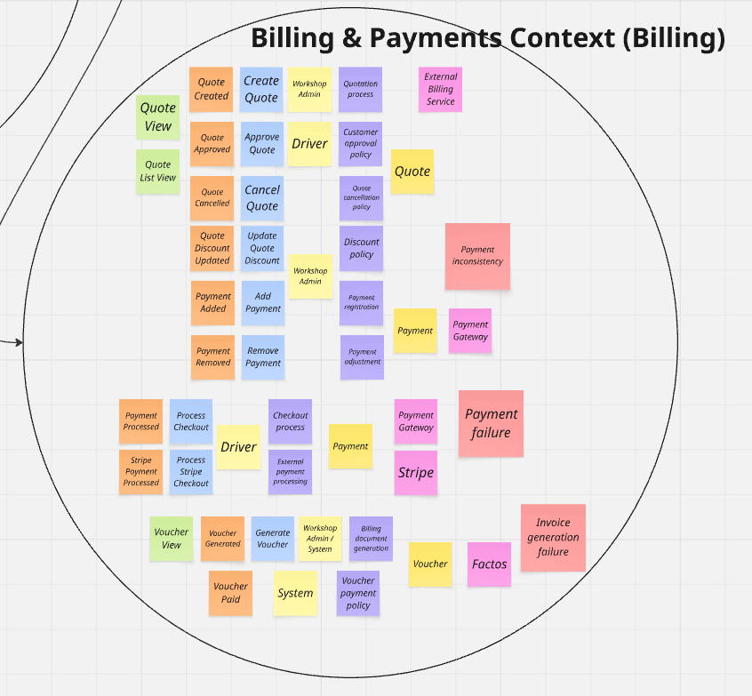

**Figura 26.** Candidate Bounded Context — Billing & Payments.

---

##### Resultado del Candidate Context Discovery

Como resultado, se obtuvieron **siete agrupaciones de responsabilidad**, que posteriormente fueron utilizadas para construir los flujos de interacción y los Bounded Context Canvases.

Por tanto, esta actividad establece **los límites candidatos del dominio**, pero no constituye todavía la definición definitiva de las relaciones entre ellos. Estas relaciones se desarrollan en el siguiente apartado mediante el **Domain Message Flows Modeling**.

#### 2.5.1.2. Domain Message Flows Modeling

#### 2.5.1.2. Domain Message Flows Modeling

Una vez reconocidos los siete Candidate Bounded Contexts, se realizó el **Domain Message Flows Modeling** con el propósito de representar cómo estos contextos colaboran para ejecutar los principales procesos del dominio.

Los flujos se construyeron utilizando los elementos identificados durante el EventStorming, principalmente **Commands, Events, Actors, Aggregates, Read Models y External Systems**.

Se definieron seis flujos principales.

##### Flow 1 — Vehicle Intelligence & Diagnostics

Representa el proceso de registro y monitoreo del vehículo, incluyendo la vinculación del dispositivo OBD2, recepción de telemetría y generación de información de diagnóstico.

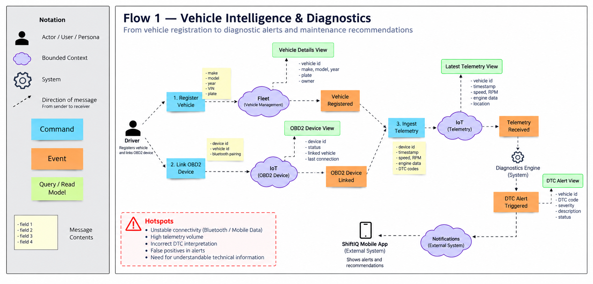

**Figura 27.** Domain Message Flow — Vehicle Intelligence & Diagnostics.

Este flujo representa una de las capacidades centrales de ShiftIq, ya que conecta la información obtenida del vehículo con el proceso de diagnóstico y seguimiento de su condición.

---

##### Flow 2 — Appointment & Service

Representa la transición desde la planificación de una atención hasta la recepción del vehículo para iniciar el servicio.

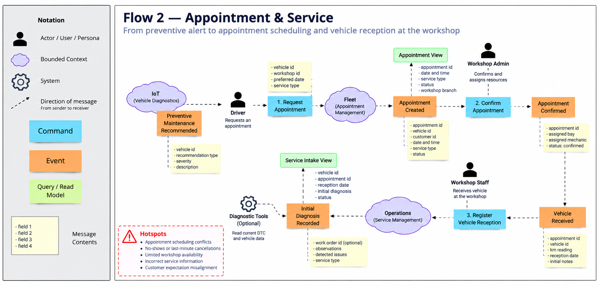

**Figura 28.** Domain Message Flow — Appointment & Service.

Este flujo muestra principalmente la interacción entre **Fleet & Appointments** y **Service Operations**, evidenciando que la cita constituye un punto de conexión entre la planificación y la ejecución del servicio.

---

##### Flow 3 — Work Order & Inventory

Representa la ejecución de una orden de trabajo y la utilización de productos necesarios para realizar las tareas del servicio.

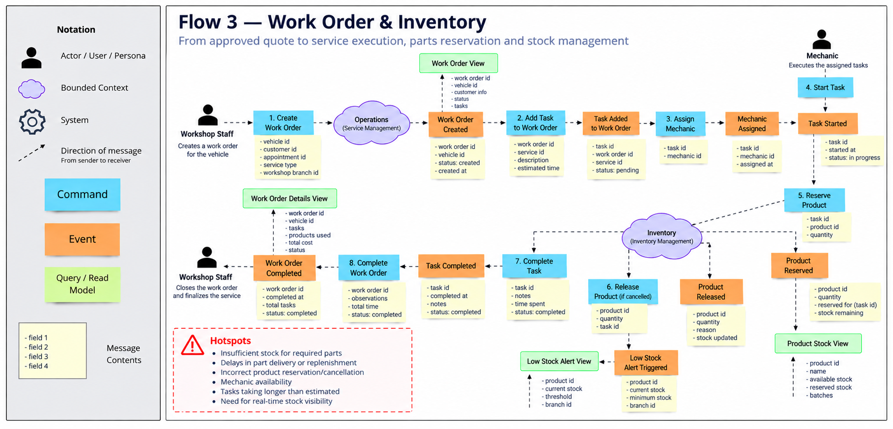

**Figura 29.** Domain Message Flow — Work Order & Inventory.

El flujo evidencia la colaboración entre **Service Operations** e **Inventory Management**, particularmente cuando una tarea requiere reservar o utilizar productos.

---

##### Flow 4 — Quotation & Payment

Representa el proceso que comienza con la elaboración de una cotización y continúa con su aprobación y procesamiento del pago.

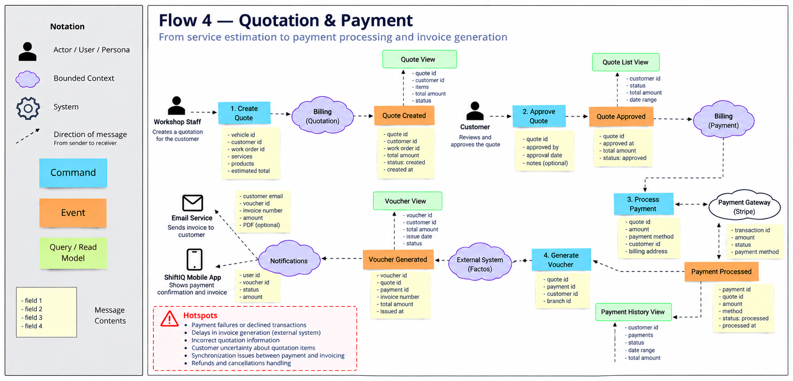

**Figura 30.** Domain Message Flow — Quotation & Payment.

Este flujo permite representar la colaboración entre el proceso operativo del servicio y **Billing & Payments**, incluyendo la intervención de los mecanismos externos de pago cuando corresponde.

---

##### Flow 5 — Workshop Management

Representa las operaciones relacionadas con la configuración y administración de la información del taller, sus sucursales, clientes y empleados.

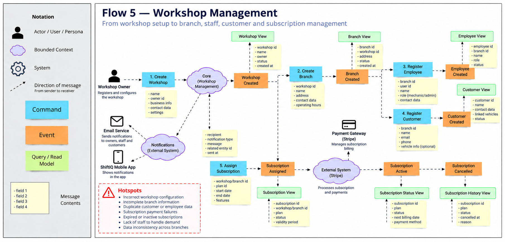

**Figura 31.** Domain Message Flow — Workshop Management.

El flujo representa las principales operaciones administrativas que permiten mantener disponible la información necesaria para los demás procesos del sistema.

---

##### Flow 6 — Identity & Access

Representa el ciclo de acceso de los usuarios a la plataforma, desde el registro hasta la autenticación y gestión de sus credenciales.

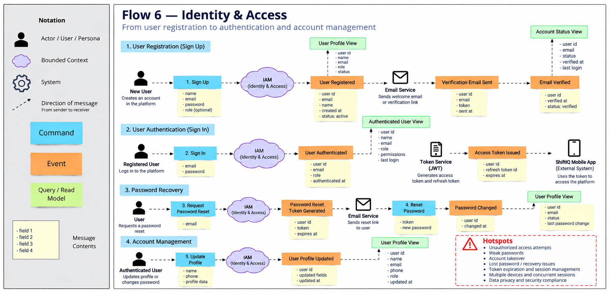

**Figura 32.** Domain Message Flow — Identity & Access.

Este flujo delimita las responsabilidades de **Identity & Access** frente a los demás contextos que requieren información sobre el usuario autenticado.

---

##### Resultado del Domain Message Flows Modeling

Los seis flujos permiten observar que los Candidate Bounded Contexts **colaboran mediante mensajes**, en lugar de funcionar como componentes completamente aislados.

De esta forma, los flujos muestran las principales interacciones del dominio y permiten comprobar que un mismo proceso de negocio puede atravesar más de un contexto. Por ejemplo, la ejecución de un servicio puede involucrar **Fleet & Appointments, Service Operations, Inventory Management y Billing & Payments**.

Los Domain Message Flows constituyen así el vínculo entre el descubrimiento de los contextos y su formalización mediante los Canvas.

#### 2.5.1.3. Bounded Context Canvases

A partir de los siete Candidate Bounded Contexts identificados y de los seis Domain Message Flows modelados, se elaboraron los **Bounded Context Canvases**.

El Canvas permite describir cada contexto desde una perspectiva estratégica, especificando su propósito, clasificación estratégica, roles de dominio, comunicaciones de entrada y salida, lenguaje ubicuo, decisiones de negocio, supuestos, métricas de verificación y preguntas abiertas.

Los siete Canvas desarrollados son los siguientes:

##### Canvas 1 — Identity & Access

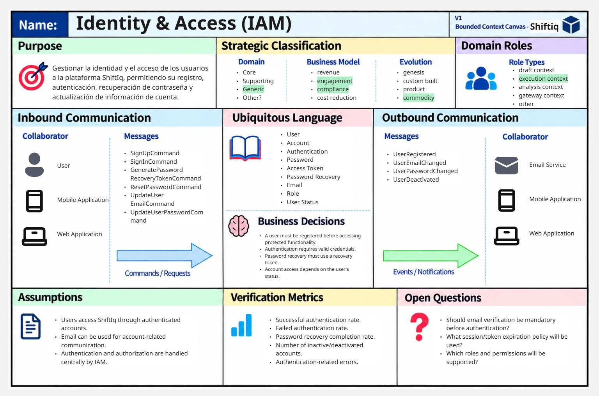

**Figura 33.** Bounded Context Canvas — Identity & Access.

El Canvas formaliza las responsabilidades del contexto relacionadas con usuarios, autenticación, recuperación de credenciales y acceso a la plataforma.

---

##### Canvas 2 — Workshop Management

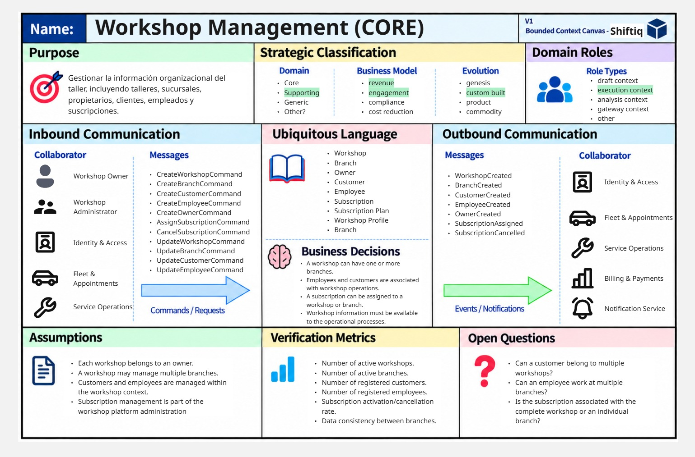

**Figura 34.** Bounded Context Canvas — Workshop Management.

El Canvas delimita las responsabilidades relacionadas con Workshop, Branch, Owner, Customer y Employee.

---

##### Canvas 3 — Fleet & Appointments

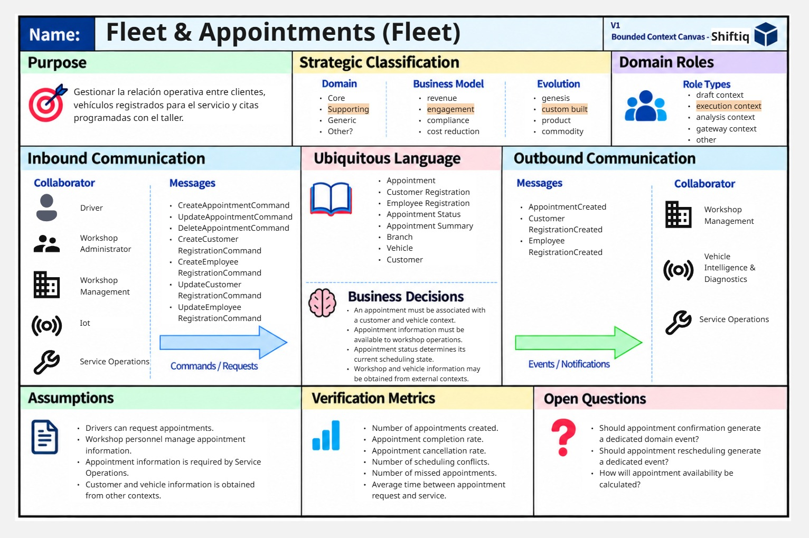

**Figura 35.** Bounded Context Canvas — Fleet & Appointments.

El Canvas formaliza la responsabilidad de gestionar citas y los registros necesarios para coordinar la atención del vehículo.

---

##### Canvas 4 — Vehicle Intelligence & Diagnostics

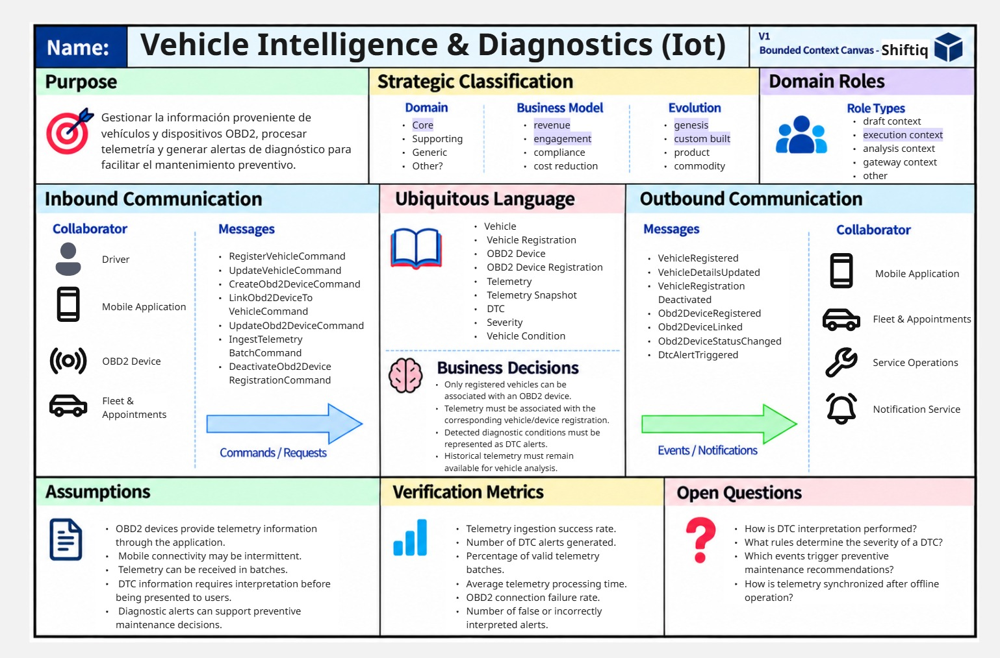

**Figura 36.** Bounded Context Canvas — Vehicle Intelligence & Diagnostics.

El Canvas formaliza las responsabilidades relacionadas con Vehicle, OBD2 Device, Telemetry, DTC y diagnóstico, elementos que forman parte del lenguaje ubicuo del proyecto.

---

##### Canvas 5 — Service Operations

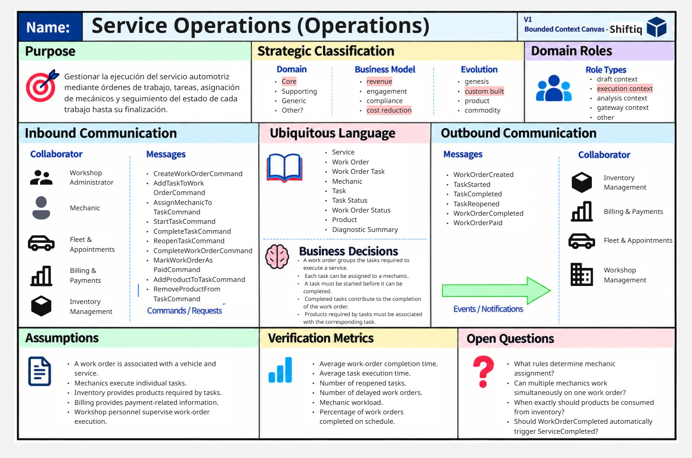

**Figura 37.** Bounded Context Canvas — Service Operations.

El Canvas formaliza las responsabilidades relacionadas con Service, Work Order, Task y Mechanic, incluyendo las reglas asociadas con la ejecución del servicio.

---

##### Canvas 6 — Inventory Management

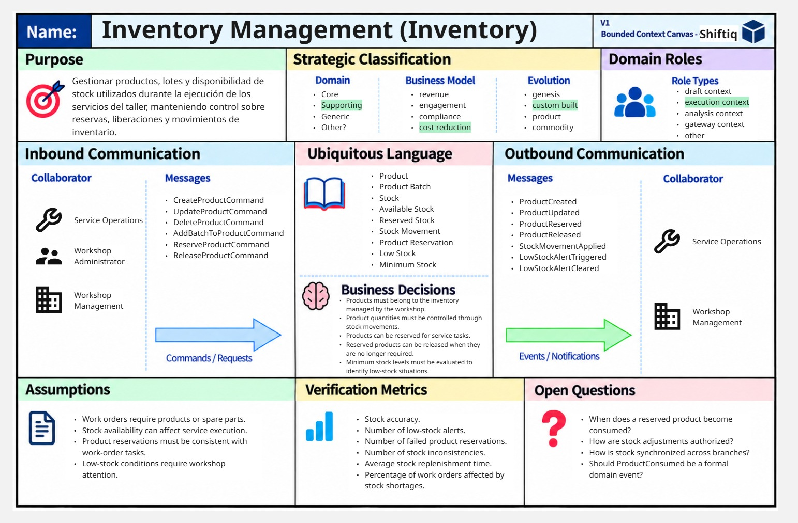

**Figura 38.** Bounded Context Canvas — Inventory Management.

El Canvas formaliza las responsabilidades relacionadas con Product, Product Batch, Stock, Reservation y Low Stock.

---

##### Canvas 7 — Billing & Payments

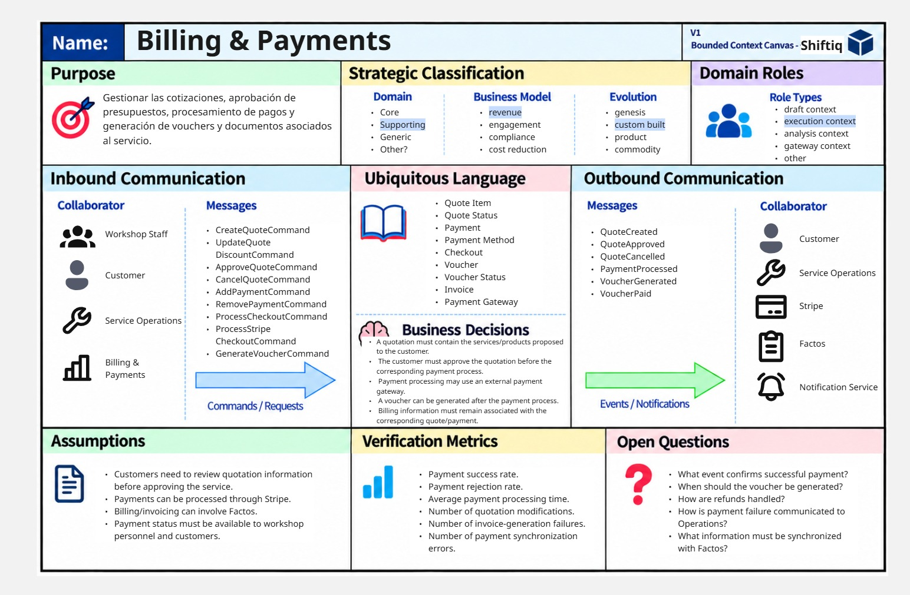

**Figura 39.** Bounded Context Canvas — Billing & Payments.

El Canvas formaliza las responsabilidades relacionadas con Quote, Payment, Checkout y Voucher, incluyendo las interacciones necesarias con servicios externos de pago y facturación.

### 2.5.2. Context Mapping

### 2.5.3. Software Architecture

#### 2.5.3.1. Software Architecture Context Level Diagrams

#### 2.5.3.2. Software Architecture Container Level Diagrams

#### 2.5.3.3. Software Architecture Deployment Diagrams
